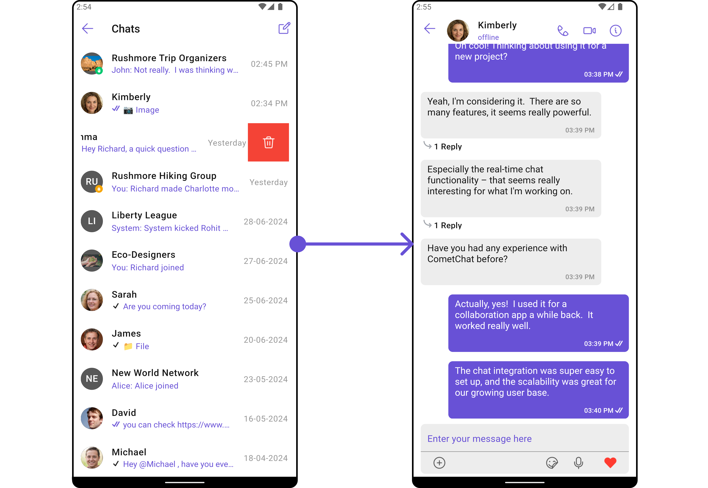
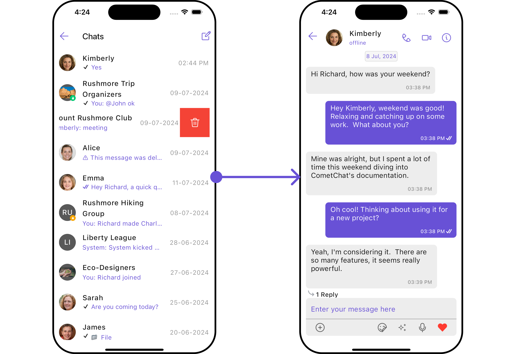

import Tabs from '@theme/Tabs';
import TabItem from '@theme/TabItem';

## Start Your First Conversation

CometChat UI Kit for Flutter is a package of pre-assembled UI elements crafted to streamline the creation of an in-app chat equipped with essential messaging functionalities. Our UI Kit presents options for light and dark themes, diverse fonts, colors, and extra customization capabilities.

CometChat UI Kit supports both one-to-one and group conversations. Follow the guide below to initiate conversations from scratch using CometChat Flutter UI Kit.

<Tabs>

<TabItem value="Android" label="Android">

<!--  -->

</TabItem>

<TabItem value="iOS" label="iOS">

<!--  -->

</TabItem>

</Tabs>

## Prerequisites

Before installing the **UI Kit**, you need to create a CometChat application on the CometChat Dashboard, which includes all the necessary data for a chat service, such as users, groups, calls, and messages. You will require the `App ID`, `AuthKey`, and `Region` of your CometChat application when initializing the SDK.

**i. Register on CometChat**

- You need to register on the **CometChat Dashboard** first. [Click here to sign up](https://app.cometchat.com/login).

**ii. Get Your Application Keys**

- Create a **new app**
- Head over to the **QuickStart** or **API & Auth Keys section** and note the **App ID**, **Auth Key**, and **Region**.

> Each CometChat application can be integrated with a single client app. Within the same application, users can communicate with each other across all platforms, whether they are on mobile devices or on the web.

**iii. IDE Setup**

- XCode for iOS platform and Android Studio for Android platform
- Pod (CocoaPods) for iOS
- An iOS device or emulator with iOS 12.0 or above.
- Android device or emulator with Android version 5.0 or above.

## Getting Started

<span style={{padding: '6px 15px', 'background-color': '#6851D6', color: 'white', 'border-radius': '15px', 'font-size': '0.9em', 'font-weight': 'bold'}}>Step 1</span>

### Create Flutter application project

To get started, create a new flutter application project.

---

<span style={{padding: '6px 15px', 'background-color': '#6851D6', color: 'white', 'border-radius': '15px', 'font-size': '0.9em', 'font-weight': 'bold'}}>Step 2</span>

### Add Dependency

**1. Update Pubspec**

To use this UI Kit in your Flutter project, you'll need to add the following dependency to the dependencies section of your `pubspec.yaml` file:

<Tabs>

<TabItem value="Dart" label="Dart">

```dart title="pubspec.yaml"
dependencies:
  cometchat_chat_uikit: ^5.0.0-beta.1
```

</TabItem>

</Tabs>

:::tip
For best results, make sure to use the latest version of the UI Kit.
:::

Now in your Dart code, import it and you can use it:

<Tabs>

<TabItem value="Dart" label="Dart">

```dart
import 'package:cometchat_chat_uikit/cometchat_chat_uikit.dart';
```

</TabItem>

</Tabs>

---

**2. Update Android minSDK version**

If your Flutter project's minimum Android SDK version (minSdkVersion) is below API level 21, you should update it to at least 21. To achieve this, navigate to the `android/app/build.gradle` file and modify the `minSdkVersion` property within the `defaultConfig` section.

<Tabs>

<TabItem value="Groovy" label="Groovy">
```Groovy
defaultConfig {
    minSdkVersion 21
    targetSdkVersion flutter.targetSdkVersion
    versionCode flutterVersionCode.toInteger()
    versionName flutterVersionName
}
```

</TabItem>

</Tabs>

:::info

If you want to use the Flutter UI Kit or enable calling support within it, you'll need to:

1. Set the `minSdkVersion` to 24 in your `android/app/build.gradle` file.

2. Add the `flutter_calling_ui_kit` dependency to your project's `pubspec.yaml` file.

:::

---

**3. Update iOS Podfile**

In your Podfile located at `ios/Podfile`, update the minimum iOS version that your project supports to 12.

<Tabs>

<TabItem value="DSL" label="DSL">
```DSL
platform :ios, '12.0'
```

</TabItem>

</Tabs>

<span style={{padding: '6px 15px', 'background-color': '#6851D6', color: 'white', 'border-radius': '15px', 'font-size': '0.9em', 'font-weight': 'bold'}}>Step 3</span>

---

### Initialize CometChatUIkit

To integrate and run CometChat UI Kit in your app, you need to initialize it beforehand.

The [Init](/ui-kit/flutter/methods#init) method initializes the settings required for CometChat. Please ensure to call this method before invoking any other methods from CometChat UI Kit or CometChat SDK.

:::info

The Auth Key is an optional property of the `UIKitSettings` Class. It is intended for use primarily during proof-of-concept (POC) development or in the early stages of application development. You can use [Auth Token](/ui-kit/flutter/methods#login-using-auth-token) method to login securely.

:::

<Tabs>

<TabItem value="Dart" label="Dart">

```dart
UIKitSettings uiKitSettings = (UIKitSettingsBuilder()
  ..subscriptionType = CometChatSubscriptionType.allUsers
  ..autoEstablishSocketConnection = true
  ..region = "REGION"//Replace with your App Region
  ..appId = "APP_ID" //Replace with your App ID
  ..authKey = "AUTH_KEY" //Replace with your app Auth Key
  ..extensions = CometChatUIKitChatExtensions.getDefaultExtensions() //Replace this with empty array you want to disable all extensions
).build();

CometChatUIKit.init(uiKitSettings: uiKitSettings,onSuccess: (successMessage) {
  // TODO("Not yet implemented")
}, onError: (e) {
  // TODO("Not yet implemented")
});
```

</TabItem>

</Tabs>

> Make sure to replace the **APP_ID** with your CometChat appId, **AUTH_KEY** with your CometChat app auth key and **REGION** with your app region in the above code.

---

<span style={{padding: '6px 15px', 'background-color': '#6851D6', color: 'white', 'border-radius': '15px', 'font-size': '0.9em', 'font-weight': 'bold'}}>Step 4</span>

### Login User

For login, you require a `UID`. You can create your own users on the CometChat Dashboard or via API. We have pre-generated test users: `cometchat-uid-1`, `cometchat-uid-2`, `cometchat-uid-3`, `cometchat-uid-4`, `cometchat-uid-5`.

The `login()` method returns the User object containing all the information of the logged-in user.

:::info

This straightforward authentication method is ideal for proof-of-concept (POC) development or during the early stages of application development. For production environments, however, we strongly recommend using an [Auth Token](/ui-kit/flutter/methods#login-using-auth-token) instead of an Auth Key to ensure enhanced security.

:::

<Tabs>

<TabItem value="Dart" label="Dart">

```dart
CometChatUIKit.login(uid, onSuccess: (s) {
  // TODO("Not yet implemented")
}, onError: (e) {
  // TODO("Not yet implemented")
});
```

</TabItem>

</Tabs>

---

<span style={{padding: '6px 15px', 'background-color': '#6851D6', color: 'white', 'border-radius': '15px', 'font-size': '0.9em', 'font-weight': 'bold'}}>Step 5</span>

### Render Conversation with Message

[CometChatUsersWithMessages](/ui-kit/flutter/conversations-with-messages) is a wrapper widget that offers functionality to render both the [Conversations](/ui-kit/flutter/conversations) and [Messages](/ui-kit/flutter/messages) widgets. It also enables opening the [Messages](/ui-kit/flutter/messages) by tapping on any conversation rendered in the list of conversations.

<Tabs>

<TabItem value="Android" label="Android">

<!--  -->

</TabItem>

<TabItem value="iOS" label="iOS">

<!--  -->

</TabItem>

</Tabs>

<Tabs>

<TabItem value="Dart" label="Dart">

```dart
Navigator.push(context, MaterialPageRoute(builder: (context) => const CometChatUsersWithMessages()));
```

</TabItem>

</Tabs>

Example

<Tabs>

<TabItem value="Dart" label="Dart">

```dart
CometChatUIKit.login(uid, onSuccess: (s) {
  Navigator.push(context, MaterialPageRoute(builder: (context) => const CometChatUsersWithMessages()));
}, onError: (e) {
  // TODO("Not yet implemented")
});
```

</TabItem>

</Tabs>
