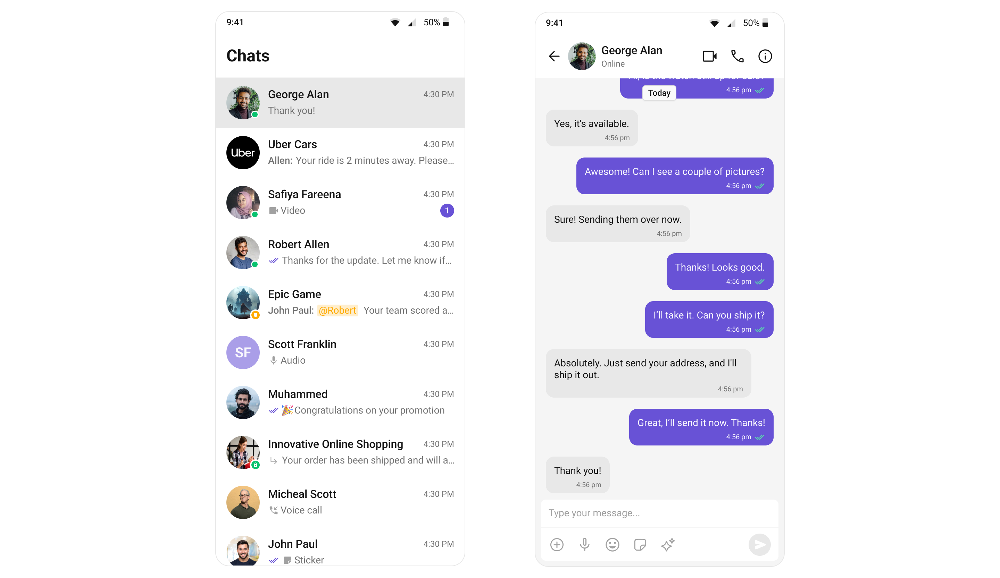
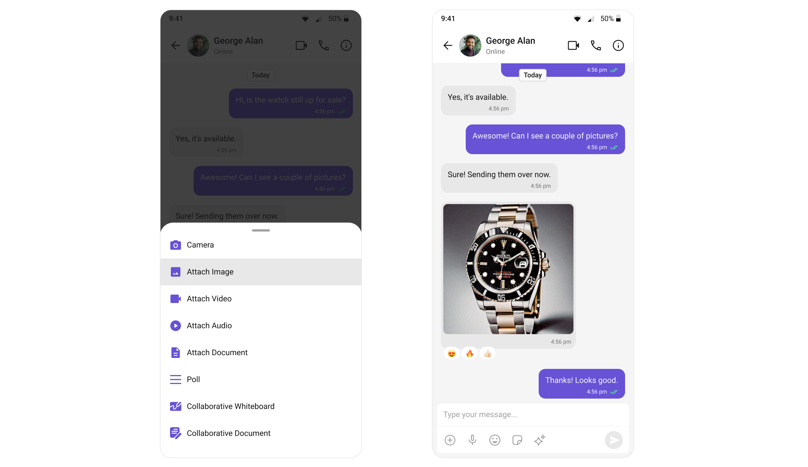
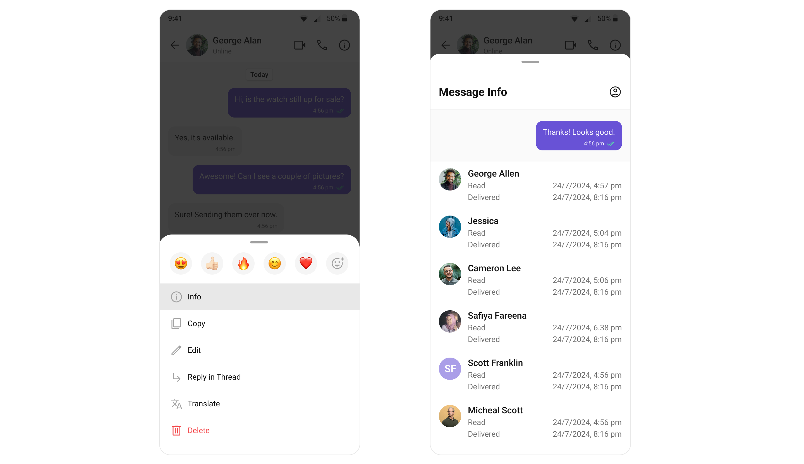
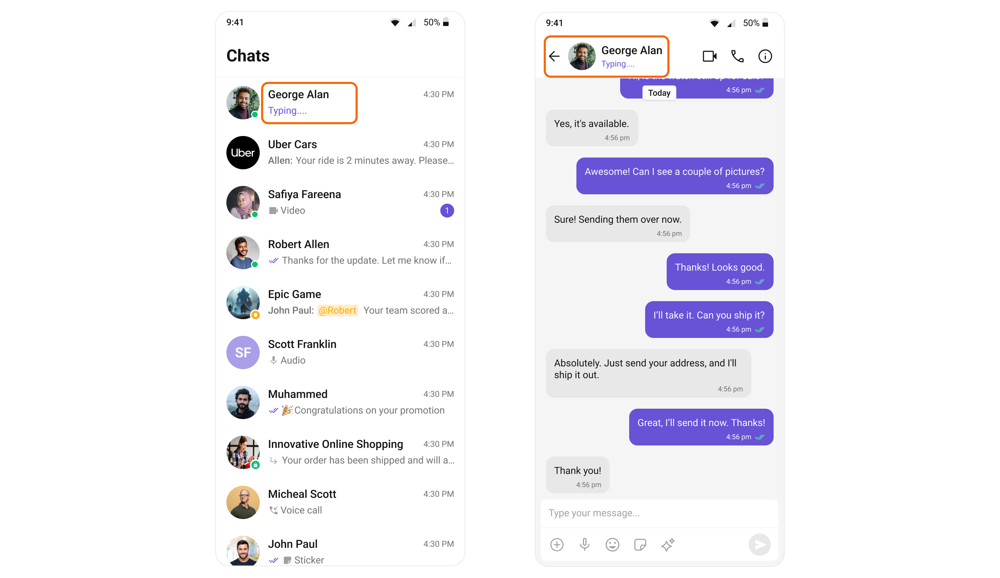
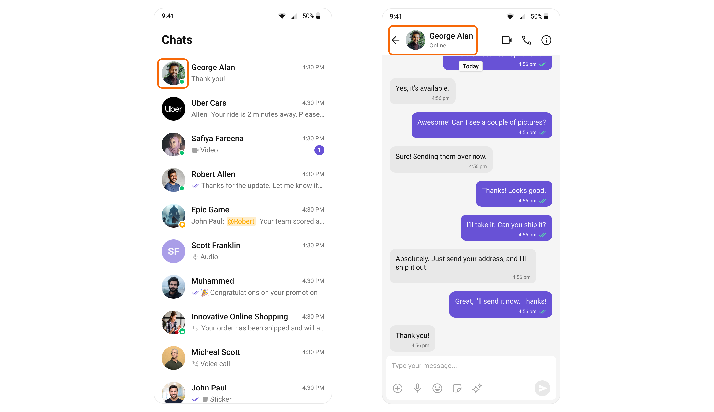
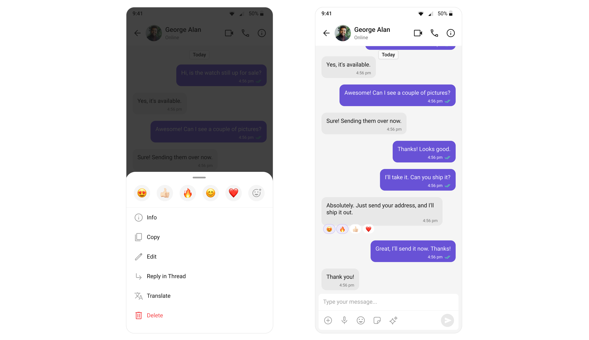
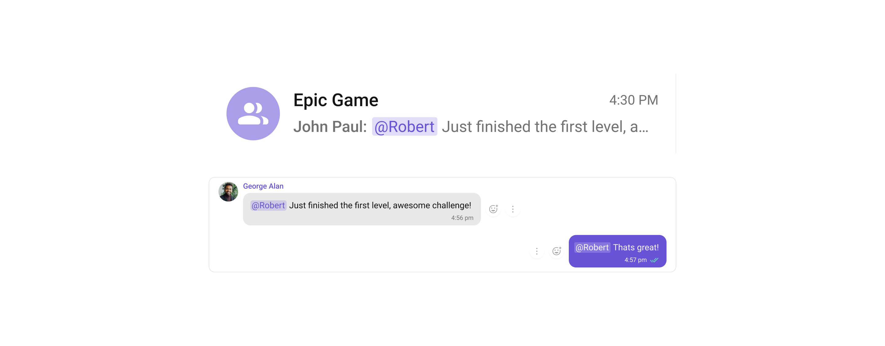
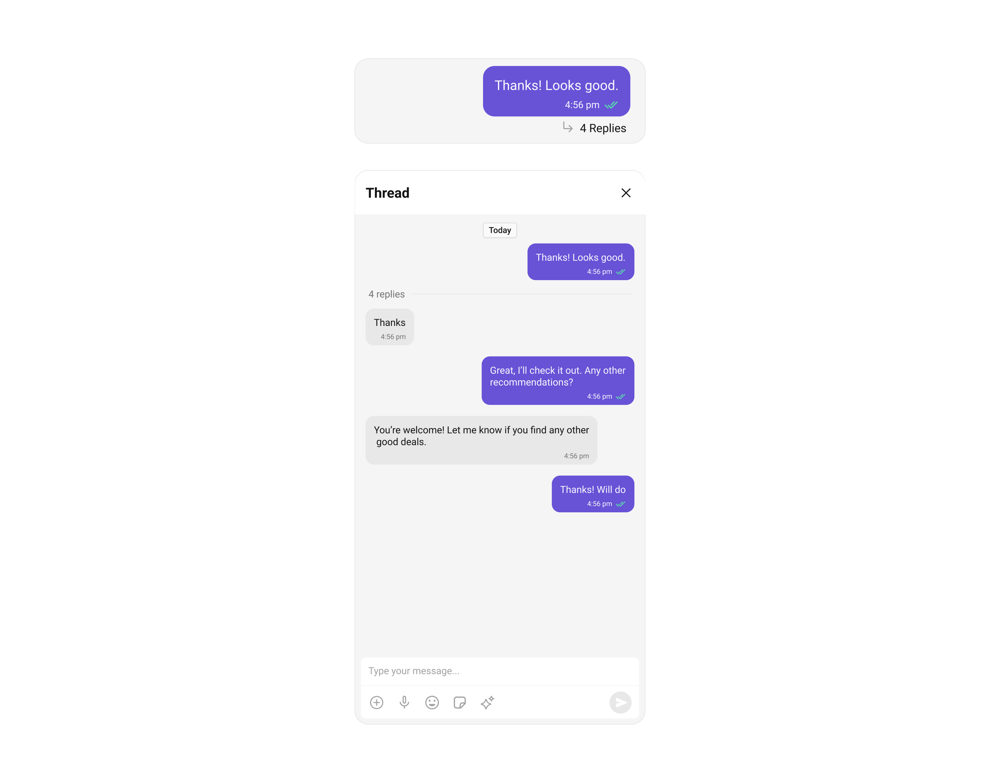
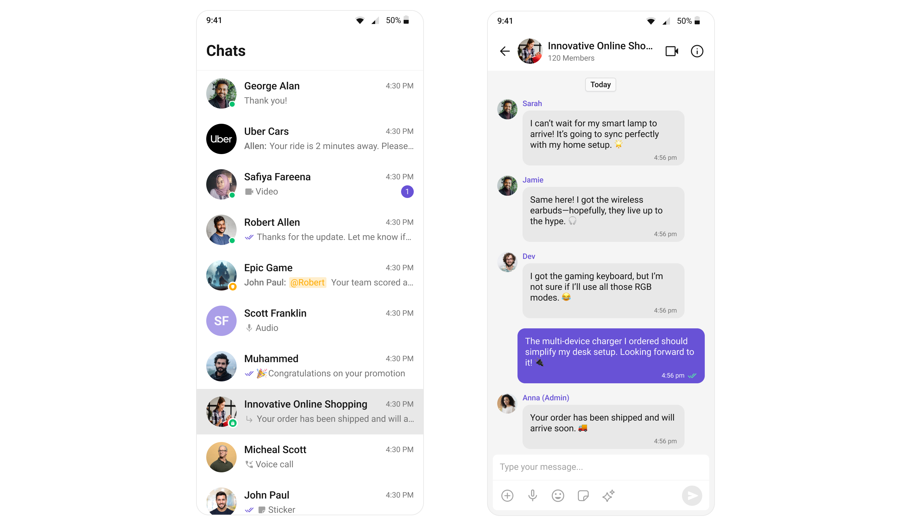

import Tabs from '@theme/Tabs';
import TabItem from '@theme/TabItem';

## Overview

The UI Kit comprises a variety of widgets, each designed to work seamlessly with one another to deliver a comprehensive and intuitive chat experience.

Here's how different UI Kit widgets work together to achieve CometChat's Core features:

## Instant Messaging

At the heart of CometChat's functionality is the ability to support real-time text messaging. Users can send and receive instant messages, fostering quick and efficient communication.

| Widgets                                      | Functionality                                                                                                                                                  |
| ----------------------------------------------- | -------------------------------------------------------------------------------------------------------------------------------------------------------------- |
| [MessageComposer](/ui-kit/flutter/message-composer) | [MessageComposer](/ui-kit/flutter/message-composer) is a Widget that enables users to write and send a variety of messages.                                     |
| [MessageList](/ui-kit/flutter/message-list)         | [MessageList](/ui-kit/flutter/message-list) is a Widget that renders a list of messages sent and messages received using [TextBubble](/ui-kit/flutter/text-bubble). |

## Media Sharing

Beyond text, CometChat allows users to share various media types within their conversations. This includes images, videos, audio files, and documents, enriching the chat experience and enabling more comprehensive communication.

| Widgets                                      | Functionality                                                                                                                                                                                                                                                                |
| ----------------------------------------------- | ---------------------------------------------------------------------------------------------------------------------------------------------------------------------------------------------------------------------------------------------------------------------------- |
| [MessageComposer](/ui-kit/flutter/message-composer) | [MessageComposer](/ui-kit/flutter/message-composer) is a Widget that has ActionSheet, ActionSheet is a menu that appears over the context of the app, providing multiple options for sharing media files.                                                                     |
| [MessageList](/ui-kit/flutter/message-list)         | [MessageList](/ui-kit/flutter/message-list) is a Widget that renders different Media Message bubbles like [Image Bubble](/ui-kit/flutter/image-bubble), [File Bubble](/ui-kit/flutter/file-bubble), [Audio Bubble](/ui-kit/flutter/audio-bubble) [Video Bubble](/ui-kit/flutter/video-bubble) |

## Read Receipts

CometChat's Read Receipts feature provides visibility into the message status, letting users know when a message has been delivered and read. This brings clarity to the communication and ensures users are informed about the status of their messages.

| Widgets                                            | Functionality                                                                                                                                                                                                                                              |
| ----------------------------------------------------- | ---------------------------------------------------------------------------------------------------------------------------------------------------------------------------------------------------------------------------------------------------------- |
| [Conversations](/ui-kit/flutter/conversations)            | [Conversations](/ui-kit/flutter/conversations) is a Widget that renders Conversations item List, Conversation item also displays the delivery status of the last message providing users with real-time updates on the status of their messages.            |
| [MessageList](/ui-kit/flutter/message-list)               | [MessageList](/ui-kit/flutter/message-list) is a Widget that renders different types of Message bubbles, Read Recept status is an integral part of all message bubbles, no matter the type, and provides real-time updates about the status of the message. |
| [MessageInformation](/ui-kit/flutter/message-information) | [MessageInformation](/ui-kit/flutter/message-information) widget provides transparency into the status of each sent message, giving the sender insights into whether their message has been delivered and read.                                             |

## Typing Indicator

The Typing Indicator feature in CometChat shows when a user is typing a response in real-time, fostering a more interactive and engaging chat environment. This feature enhances the real-time communication experience, making conversations feel more natural and fluid.

| Widgets                                   | Functionality                                                                                                                                                                                                                                                                                        |
| -------------------------------------------- | ---------------------------------------------------------------------------------------------------------------------------------------------------------------------------------------------------------------------------------------------------------------------------------------------------- |
| [Conversations](/ui-kit/flutter/conversations)   | [Conversations](/ui-kit/flutter/conversations) is a Widget that renders Conversations item List, Conversations item also shows real-time typing status indicators. This means that if a user in a one-on-one chat or a participant in a group chat is currently typing a message                      |
| [Message Header](/ui-kit/flutter/message-header) | [Message Header](/ui-kit/flutter/message-header) that renders details of User or Groups in ToolBar. The MessageHeader also handles the Typing Indicator functionality. When a user or a member in a group is typing, the MessageHeader dynamically updates to display a 'typing...' status in real-time. |

## User Presence

CometChat's User Presence feature allows users to see whether their contacts are online, offline. This helps users know the best time to initiate a conversation and sets expectations about response times.

| Widgets                                   | Functionality                                                                                                                                                |
| -------------------------------------------- | ------------------------------------------------------------------------------------------------------------------------------------------------------------ |
| [Conversations](/ui-kit/flutter/conversations)   | [Conversations](/ui-kit/flutter/conversations) is a Widget that renders Conversations item List, Conversations item also shows user presence information.     |
| [Message Header](/ui-kit/flutter/message-header) | [Message Header](/ui-kit/flutter/message-header) that renders details of User or Groups in ToolBar. The MessageHeader also handles user Presence information.    |
| [Users](/ui-kit/flutter/users)                   | [Users](/ui-kit/flutter/users) renders list of users available in your app.It also responsible to render users Presence information.                             |
| [Group Members](/ui-kit/flutter/group-members)   | [Group Members](/ui-kit/flutter/group-members) renders list of users available in the group. The Group Members widget also handles user Presence information. |

## Reactions

CometChat's Reactions feature adds a layer of expressiveness to your chat application by allowing users to react to messages. With Reactions, users can convey a range of emotions or express their thoughts on a particular message without typing out a full response, enhancing their user experience and fostering greater engagement.

The number of reactions displayed depends on the width of the view. For instance, if a message contains 5 reactions but the width of the CometChatReactions view can only accommodate 4 reactions at a time, the first three reactions will be shown along with an additional UI element at the end of the row. This element indicates the number of other unique reactions that are not immediately visible, informing users of the total count of different reactions.

In the example, tapping on this element (depicted as "+2" in the provided image) will by default trigger the CometChatReactionList widget. This action opens a modal sheet from the bottom of the screen, displaying all reactions received by the message.

| Widgets                              | Functionality                                                                                                                                                                                                                                                                                                                                                                                    |
| --------------------------------------- | ------------------------------------------------------------------------------------------------------------------------------------------------------------------------------------------------------------------------------------------------------------------------------------------------------------------------------------------------------------------------------------------------ |
| [MessageList](/ui-kit/flutter/message-list) | [MessageList](/ui-kit/flutter/message-list) is a Widget that renders different types of Message bubbles, Irrespective of the type of message bubble, Reactions are an integral part and offer a more engaging, expressive way for users to respond to messages.                                                                                                                                   |

## Mentions

Mentions is a robust feature provided by CometChat that enhances the interactivity and clarity of group or 1-1 chats by allowing users to directly address or refer to specific individuals in a conversation.

| Widgets                                      | Functionality                                                                                                                                                                                                                                                                                                                                                                        |
| ----------------------------------------------- | ------------------------------------------------------------------------------------------------------------------------------------------------------------------------------------------------------------------------------------------------------------------------------------------------------------------------------------------------------------------------------------ |
| [Conversations](/ui-kit/flutter/conversations)      | [Conversations](/ui-kit/flutter/conversations) widget provides an enhanced user experience by integrating the Mentions feature. This means that from the conversation list itself, users can see where they or someone else have been specifically mentioned.                                                                                                                         |
| [MessageComposer](/ui-kit/flutter/message-composer) | [MessageComposer](/ui-kit/flutter/message-composer)is a widget that allows users to craft and send various types of messages, including the usage of the Mentions feature for direct addressing within the conversation.                                                                                                                                                              |
| [MessageList](/ui-kit/flutter/message-list)         | [MessageList](/ui-kit/flutter/message-list) is a widget that displays a list of sent and received messages. It also supports the rendering of Mentions, enhancing the readability and interactivity of conversations.                                                                                                                                                                 |

## Threaded Conversations

The Threaded Conversations feature enables users to respond directly to a specific message in a chat. This keeps conversations organized and enhances the user experience by maintaining context, especially in group chats.

| Widgets                                         | Functionality                                                                                                                |
| -------------------------------------------------- | ---------------------------------------------------------------------------------------------------------------------------- |
| [Threaded Messages](/ui-kit/flutter/threaded-messages) | [Threaded Messages](/ui-kit/flutter/threaded-messages) that displays all replies made to a particular message in a conversation. |

## Group Chat

CometChat facilitates Group Chats, allowing users to have conversations with multiple participants simultaneously. This feature is crucial for team collaborations, group discussions, social communities, and more.

For a comprehensive understanding and guide on implementing and using the Groups feature in CometChat, you should refer to our detailed guide on [Groups](/ui-kit/flutter/groups).
