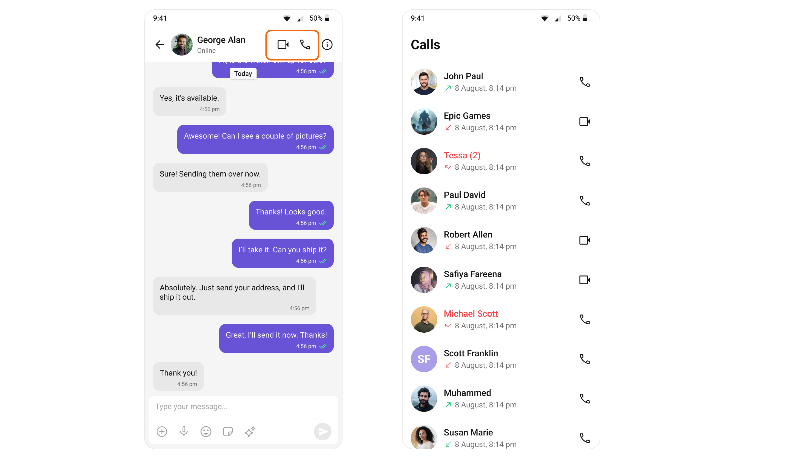
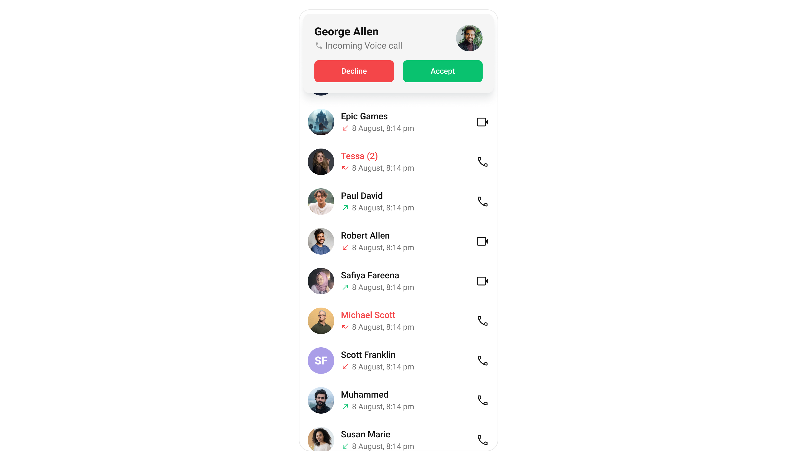
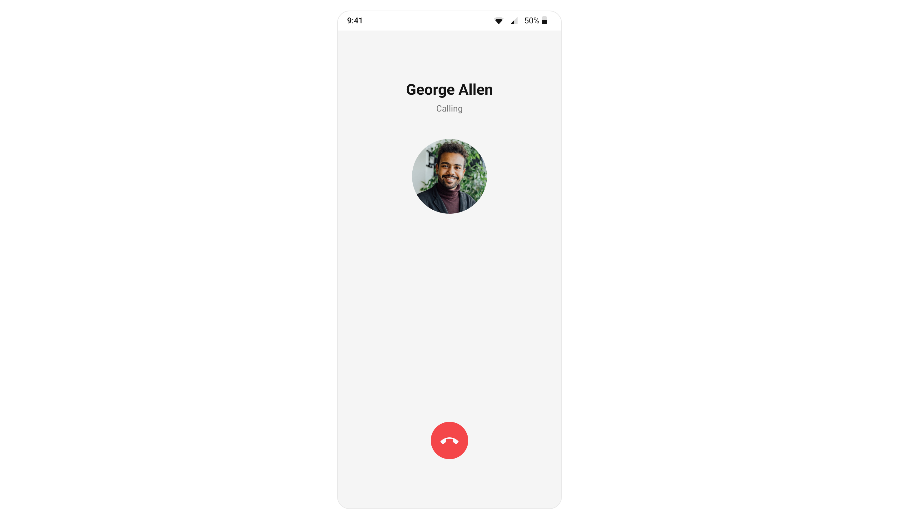
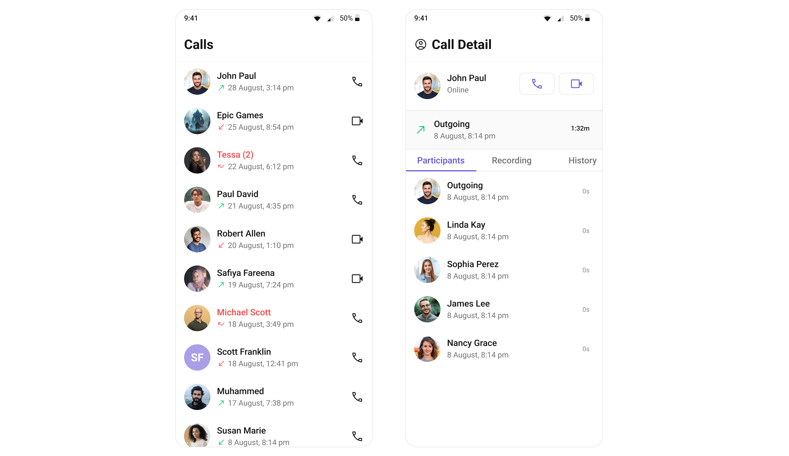

import Tabs from '@theme/Tabs';
import TabItem from '@theme/TabItem';

## Overview

CometChat's Calls feature is an advanced functionality that allows you to seamlessly integrate one-on-one as well as group audio and video calling capabilities into your application. This document provides a technical overview of these features, as implemented in the Flutter UI Kit.

## Integration

First, make sure that you've correctly integrated the UI Kit library into your project. If you haven't done this yet or are facing difficulties, refer to our [Getting Started](/ui-kit/flutter/getting-started) guide. This guide will walk you through a step-by-step process of integrating our UI Kit into your Flutter project.

Once you've successfully integrated the UI Kit, the next step is to add the CometChat Calls SDK to your project. This is necessary to enable the calling features in the UI Kit. Here's how you do it:

<span style={{padding: '6px 15px', 'background-color': '#6851D6', color: 'white', 'border-radius': '15px', 'font-size': '0.9em', 'font-weight': 'bold'}}>Step 1</span>

### Add Dependency

Add the following dependency to your `pubspec.yaml` file:

<Tabs>

<TabItem value="Dart" label="Dart">

```dart
dependencies:
  cometchat_calls_uikit: ^5.0.0-beta.1
```

</TabItem>

</Tabs>

---

<span style={{padding: '6px 15px', 'background-color': '#6851D6', color: 'white', 'border-radius': '15px', 'font-size': '0.9em', 'font-weight': 'bold'}}>Step 2</span>

### Update build.gradle

If your Flutter project's minimum Android SDK version (minSdkVersion) is below API level 24, you should update it to at least 24. To achieve this, navigate to the `android/app/build.gradle` file and modify the `minSdkVersion` property within the `defaultConfig` section.

<Tabs>

<TabItem value="Groovy" label="Groovy">
```Groovy
defaultConfig {
    minSdkVersion 24
    targetSdkVersion flutter.targetSdkVersion
    versionCode flutterVersionCode.toInteger()
    versionName flutterVersionName
}
```

</TabItem>

</Tabs>

:::info

If you want to use the Flutter UI Kit or enable calling support within it, you'll need to:

1. Set the `minSdkVersion` to 24 in your `android/app/build.gradle` file.

:::

---

<span style={{padding: '6px 15px', 'background-color': '#6851D6', color: 'white', 'border-radius': '15px', 'font-size': '0.9em', 'font-weight': 'bold'}}>Step 3</span>

### Update iOS Podfile

In your Podfile located at `ios/Podfile`, update the minimum iOS version that your project supports to 12.

<Tabs>

<TabItem value="DSL" label="DSL">
```DSL
platform :ios, '12.0'
```

</TabItem>

</Tabs>

---

<span style={{padding: '6px 15px', 'background-color': '#6851D6', color: 'white', 'border-radius': '15px', 'font-size': '0.9em', 'font-weight': 'bold'}}>Step 4</span>

### Modify UIKitSettings

To activate the calling features, you'll need to modify the UIKitSettings using `callingExtension` and pass the key in the widget.

Example

<Tabs>

<TabItem value="Dart" label="Dart">

```dart
UIKitSettings uiKitSettings = (UIKitSettingsBuilder()
  ..subscriptionType = CometChatSubscriptionType.allUsers
  ..autoEstablishSocketConnection = true
  ..region = "REGION"//Replace with your App Region
  ..appId = "APP_ID" //Replace with your App ID
  ..authKey = "AUTH_KEY" //Replace with your app Auth Key
  ..extensions = CometChatUIKitChatExtensions.getDefaultExtensions() //Replace this with empty array you want to disable all extensions
  ..callingExtension = CometChatCallingExtension() //Added this to Enable calling feature in the UI Kit
).build();

CometChatUIKit.init(uiKitSettings: uiKitSettings,onSuccess: (successMessage) {
  // TODO("Not yet implemented")
}, onError: (e) {
  // TODO("Not yet implemented")
});
```

</TabItem>

</Tabs>

To allow launching of Incoming Call screen from any widget whenever a call is received provide set key: CallNavigationContext.navigatorKey in the top most widget of your project (the widget that appears first of your app launch).

<Tabs>

<TabItem value="Dart" label="Dart">

```dart
CometChatUIKit.login(uid, onSuccess: (s) {
  Navigator.push(context, MaterialPageRoute(builder: (context) => CometChatUsersWithMessages(key: CallNavigationContext.navigatorKey)));
}, onError: (e) {
  // TODO("Not yet implemented")
});
```

</TabItem>

</Tabs>

After adding this dependency, the Flutter UI Kit will automatically detect it and activate the calling features. Now, your application supports both audio and video calling. You will see [CallButtons](/ui-kit/flutter/call-buttons) widget rendered in [MessageHeader](/ui-kit/flutter/message-header) Widget.



### Listeners

For every top-level widget you wish to receive the call events in, you need to register the CallListener listener using the `addCallListener()` method.

<Tabs>

<TabItem value="Dart" label="Dart">

```Dart
import 'package:cometchat/cometchat_sdk.dart';

class _YourClassNameState extends State<YourClassName> with CallListener {
  @override
  void initState() {
    super.initState();
    CometChat.addCallListener(listenerId, this); //Add listener
  }

  @override
  void dispose() {
    super.dispose();
    CometChat.removeCallListener(listenerId); //Remove listener
  }

  @override
  void onIncomingCallCancelled(Call call) {
    super.onIncomingCallCancelled(call);
    debugPrint("onIncomingCallCancelled");
  }

  @override
  void onIncomingCallReceived(Call call) {
    super.onIncomingCallReceived(call);
    debugPrint("onIncomingCallReceived");
  }

  @override
  void onOutgoingCallAccepted(Call call) {
    super.onOutgoingCallAccepted(call);
    debugPrint("onOutgoingCallAccepted");
  }

  @override
  void onOutgoingCallRejected(Call call) {
    super.onOutgoingCallRejected(call);
    debugPrint("onOutgoingCallRejected");
  }

  @override
  void onCallEndedMessageReceived(Call call) {
    super.onCallEndedMessageReceived(call);
    debugPrint("onCallEndedMessageReceived");
  }

  @override
  Widget build(BuildContext context) {
    // TODO: implement build
    throw UnimplementedError();
  }
}
```

</TabItem>

</Tabs>

---

## Features

### Incoming Call

The [Incoming Call](/ui-kit/flutter/incoming-call) widget of the CometChat UI Kit provides the functionality that lets users receive real-time audio and video calls in the app.

When a call is made to a user, the Incoming Call widget triggers and displays a call screen. This call screen typically displays the caller information and provides the user with options to either accept or reject the incoming call.



### Outgoing Call

The [Outgoing Call](/ui-kit/flutter/outgoing-call) widget of the CometChat UI Kit is designed to manage the outgoing call process within your application. When a user initiates an audio or video call to another user or group, this widget displays an outgoing call screen, showcasing information about the recipient and the call status.

Importantly, the Outgoing Call widget is smartly designed to transition automatically into the ongoing call screen once the receiver accepts the call. This ensures a smooth flow from initiating the call to engaging in a conversation, without any additional steps required from the user.



### Call Logs

[Call Logs](/ui-kit/flutter/call-logs) widget provides you with the records call events such as who called who, the time of the call, and the duration of the call. This information can be fetched from the CometChat server and displayed in a structured format for users to view their past call activities.


