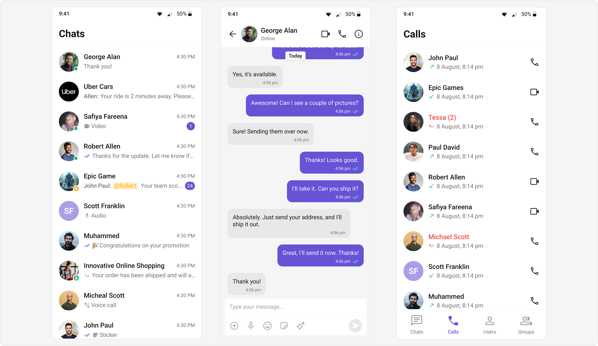
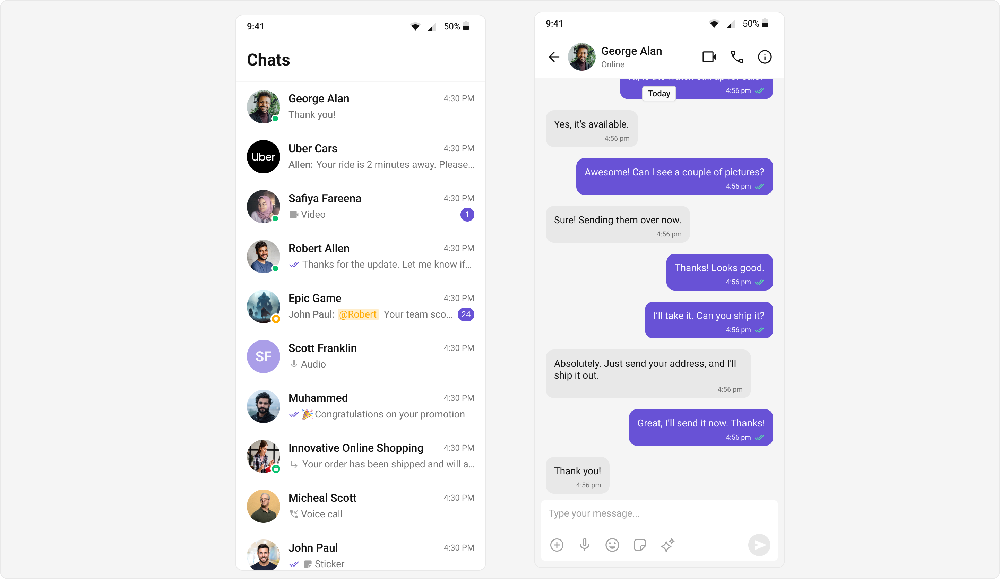
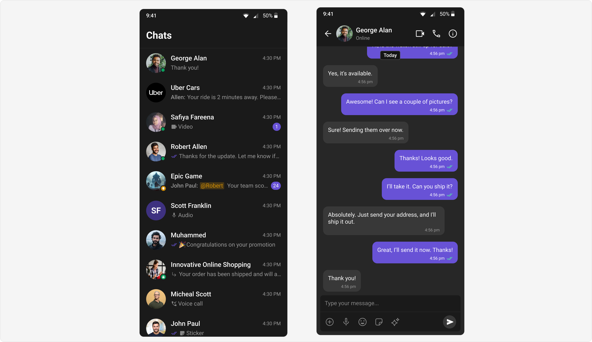
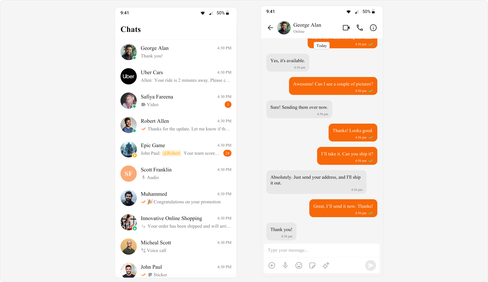
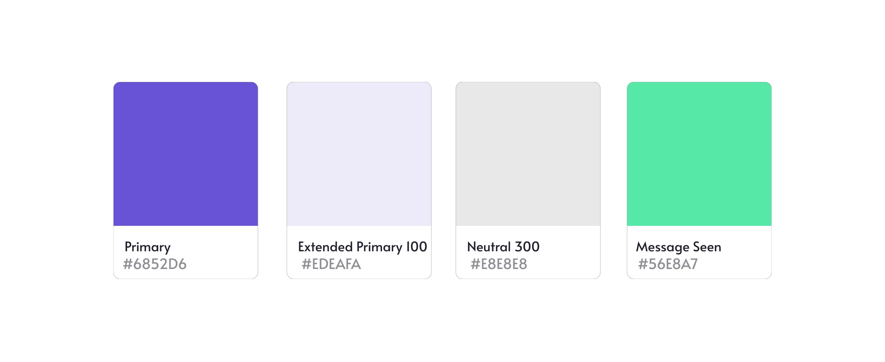
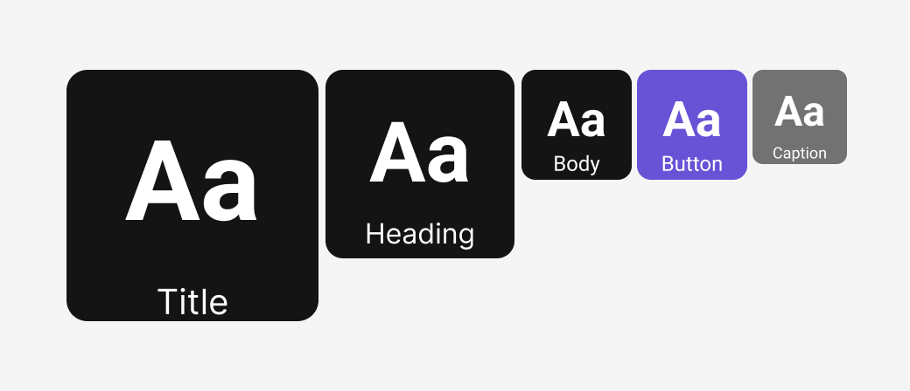

import Tabs from '@theme/Tabs';
import TabItem from '@theme/TabItem';
import spacingImage from "../assets/theming/spacing_bubble.png";

# Theming in CometChat Flutter UI Kit

CometChat's theming framework is a robust system that empowers developers to define the **look and feel** of their applications with precision and consistency. It follows three essential design system principles: **Color**, **Typography**, and **Shape**. These principles guide the customization of various UI components.



---

## Theming Overview

Theming in our UI Kit consists of three core components:

- **Color**: Managed through `CometChatColorPalette`, it controls the application's color scheme, including primary, neutral, alert, and text colors.
- **Typography**: Defined via `CometChatTypography`, it standardizes text styles, such as font size and weight.
- **Shape**: Configured using `CometChatSpacing`, it defines the structure of margins, paddings, and border radii, shaping the visual layout.

### Key Benefits
- Achieve **consistent UI** design across your application.
- Support for **light and dark themes**.
- Easy **scalability and customization** for app-specific requirements.

---

### Light and Dark Themes

Our Chat UI Kit supports both light and dark themes, to enhance usability and accessibility across diverse environments ensuring that your application is adaptable to user preferences and device settings. 



The light theme provides a clean and bright interface ideal for well-lit settings, while the dark theme reduces eye strain and conserves battery life in low-light environments. 



By offering adaptive theming, the UI Kit ensures a seamless and visually appealing experience that caters to user preferences and situational needs. This flexibility helps deliver a modern and inclusive chat experience.

### Custom Theme

The Chat UI Kit offers robust support for creating **customized themes**, allowing developers to define unique visual styles using `CometChatColorPalette`, `CometChatTypography`, and `CometChatSpacing`. By integrating these custom objects with `ThemeData` `extensions`, developers can establish global theming tailored to their application's specific design requirements. This approach promotes consistency, adaptability, and personalization, enabling seamless alignment with branding guidelines while enhancing user experience. The customization capabilities empower developers to build visually distinct and cohesive chat interfaces that resonate with their target audience.

Flutter's [**ThemeExtension**](https://api.flutter.dev/flutter/material/ThemeExtension-class.html) allows you to extend the default theming system to include **custom properties**, enabling **global styling** for app-specific widgets. It provides a structured way to define custom colors, typography, or spacing beyond Flutter’s default themes.  

By creating custom **ThemeExtension** classes, you can apply consistent styles across widgets using `ThemeData`. Developers can access these styles through `Theme.of(context).extension<YourCustomTheme>()`, ensuring a clean and maintainable approach to styling. This is particularly useful for apps requiring **customizable and reusable themes**.




<Tabs>
<TabItem value="Dart" label="Dart">
```dart
ThemeData(
    fontFamily: 'Times New Roman',
    extensions: [
         CometChatColorPalette(
              primary: Color(0xFFF76808)
        )
    ]
)
```

</TabItem>

</Tabs>


---

## Core Components

### **Color**

The `CometChatColorPalette` class offers a comprehensive way to manage colors in your app. It includes colors for primary themes, alerts, text, icons, borders, and backgrounds.

#### Features
- **Primary Colors**: Base colors and extended shades.
- **Neutral Colors**: Shades for surfaces and backgrounds.
- **Alert Colors**: Colors for states like success, error, warning, and info.
- **Text Colors**: Differentiated for primary, secondary, and disabled states.




### **Typography**
Typography plays a critical role in ensuring that content is both legible and engaging. The UI Kit supports custom font styles and weights, allowing developers to create a hierarchy of text elements.

#### Features
- **Headings**: Text styles for various heading levels, allowing for clear text hierarchy.
- **Body**: Defines the styling for regular text, such as paragraphs or content.
- **Captions**: Smaller text style, typically used for labels or supplementary information.
- **Buttons**: Customizes the text style for button text.
- **Links**: Styles the text for clickable links.
- **Titles**: Defines the style for main titles or component headers.




### **Spacing**

Spacing plays a key role in modern UI design by improving clarity, readability, and usability. Proper spacing allows elements to stand out, guides the user’s focus, and enhances the visual hierarchy. It ensures that interfaces feel organized and easy to navigate, contributing significantly to a seamless and intuitive user experience.`CometChatSpacing` provides various spacing properties such as padding, margin, and radius, essential for maintaining consistent layouts across the UI. 

#### Features
- **Padding**: Controls the internal spacing within elements, ensuring content doesn't touch the edges.
- **Margin**: Defines the space between elements, providing separation for better visual structure.
- **Radius**: Adjusts the corner rounding of UI elements for a smoother, more modern appearance.


### Best Practices
- **Ensure** Contrast: Follow accessibility guidelines to maintain a minimum contrast ratio.
- **Consistency**: Use a consistent color palette across all components.
- **Adaptability**: Test your theme in various scenarios, such as low-light and high-contrast environments.
