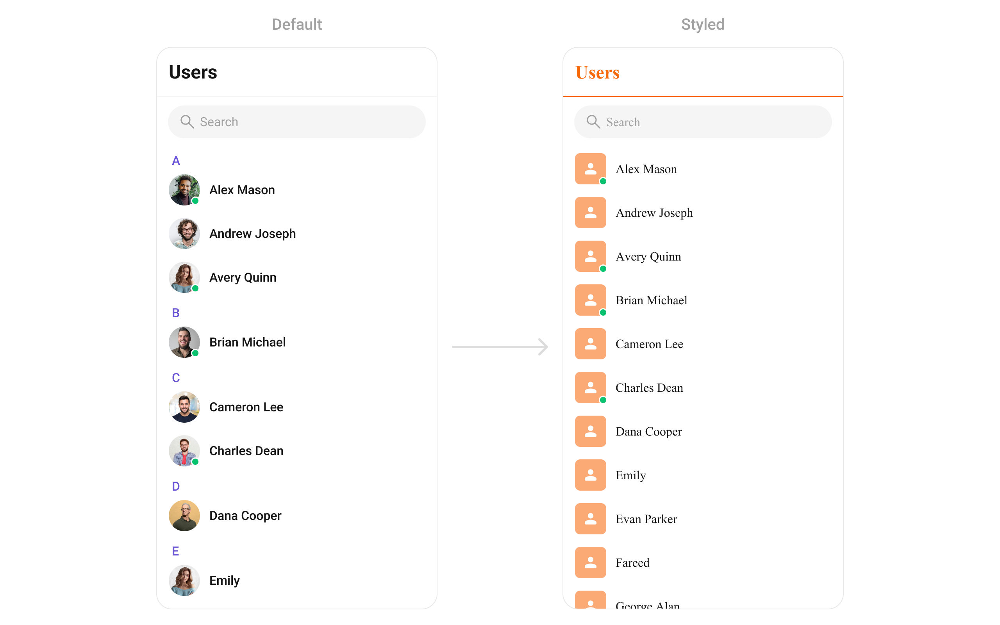

import Tabs from '@theme/Tabs';
import TabItem from '@theme/TabItem';

# Elevate Your Chat Experience: Mastering Component Styling in CometChat
## Unlock the Power of Customization

Tired of generic chat interfaces? With CometChat's powerful component styling capabilities, you can now create truly unique and visually stunning chat experiences.

## Transform Your Chat with Component Styling

Component Styling empowers you to fine-tune every aspect of your chat UI, from the subtle nuances of message bubbles to the bold impact of global theme changes. Customize the following key components to match your brand's identity and user preferences:

## Components

### Conversation

<!-- Screenshot default and customization

Code

Link to all style attributes in github -->
Control the overall layout and behavior of conversations.


<Tabs>
<TabItem value="Dart" label="Dart">

```dart
ThemeData(
    fontFamily: 'Times New Roman',
    extensions: [
        CometChatConversationsStyle(
            avatarStyle: CometChatAvatarStyle(
                borderRadius: BorderRadius.circular(8),
                backgroundColor: Color(0xFFFBAA75)
            ),
            badgeStyle: CometChatBadgeStyle(
                backgroundColor: Color(0xFFF76808)
            )
        )
    ]
)
```

</TabItem>

</Tabs>

### Message List
Customize the appearance of message lists, including bubble styles, timestamps, and reactions.

<Tabs>
<TabItem value="Dart" label="Dart">
```dart
ThemeData(
    extensions: [
        CometChatMessageListStyle(
            backgroundColor: Color(0xFFFEEDE1),
            outgoingMessageBubbleStyle: CometChatOutgoingMessageBubbleStyle(
              backgroundColor: Color(0xFFF76808)
            )
        )
    ]
)
```

</TabItem>

</Tabs>

### Message Composer
Tailor the input field and send button to suit your design.


<Tabs>
<TabItem value="Dart" label="Dart">
```dart
ThemeData(
    extensions: [
        CometChatMessageComposerStyle(
            sendButtonIconBackgroundColor: Color(0xFFF76808),
            secondaryButtonIconColor: Color(0xFFF76808),
            auxiliaryButtonIconColor: Color(0xFFF76808)
        )
    ]
)
```

</TabItem>

</Tabs>

### Message Header
Customize the header displayed at the top of each conversation.


<Tabs>
<TabItem value="Dart" label="Dart">
```dart
ThemeData(
    extensions: [
        CometChatMessageHeaderStyle(
            avatarStyle: CometChatAvatarStyle(
              backgroundColor: Color(0xFFFBAA75),
              borderRadius: BorderRadius.circular(6.67),
            ),
            callButtonsStyle: CometChatCallButtonsStyle(
              voiceCallIconColor: Color(0xFFF76808),
              videoCallIconColor: Color(0xFFF76808),
            ),
        )
    ]
)
```

</TabItem>

</Tabs>

### Users
Style user profiles and lists.


<Tabs>
<TabItem value="Dart" label="Dart">
```dart
ThemeData(
    extensions: [
        CometChatUsersStyle(
            avatarStyle: CometChatAvatarStyle(
              borderRadius: BorderRadius.circular(8),
              backgroundColor: Color(0xFFFBAA75),
            ),
            titleTextColor: Color(0xFFF76808),
            separatorColor:  Color(0xFFF76808),
            backgroundColor: Color(0xFFFFF9F5)
        )
    ]
)
```

</TabItem>

</Tabs>

### Groups
Customize the appearance of group chats and group information.


<Tabs>
<TabItem value="Dart" label="Dart">
```dart
ThemeData(
    extensions: [
        CometChatGroupsStyle(
            avatarStyle: CometChatAvatarStyle(
              borderRadius: BorderRadius.circular(8),
              backgroundColor: Color(0xFFFBAA75),
            ),
            titleTextColor: Color(0xFFF76808),
            separatorColor:  Color(0xFFF76808),
            backgroundColor: Color(0xFFFFF9F5)
        )
    ]
)
```

</TabItem>

</Tabs>

### Group Members
Elevate your group chat experience with customizable member list styles.


<Tabs>
<TabItem value="Dart" label="Dart">
```dart
ThemeData(
    extensions: [
         CometChatGroupMembersStyle(
            avatarStyle: CometChatAvatarStyle(
              borderRadius: BorderRadius.circular(8),
              backgroundColor: Color(0xFFFBAA75),
            ),
            titleStyle: TextStyle(color: Color(0xFFF76808)),
            separatorColor:  Color(0xFFF76808),
            ownerMemberScopeBackgroundColor:  Color(0xFFF76808),
            adminMemberScopeBackgroundColor: Color(0xFFFEEDE1),
            adminMemberScopeBorder: Border.all(color: Color(0xFFF76808)),
            adminMemberScopeTextColor: Color(0xFFF76808),
            moderatorMemberScopeBackgroundColor: Color(0xFFFEEDE1),
            moderatorMemberScopeTextColor: Color(0xFFF76808),
            backIconColor: Color(0xFFF76808),
        )
    ]
)
```

</TabItem>

</Tabs>

## Base Components

### Avatar
Personalize user avatars with different shapes, sizes, and borders.


<Tabs>
<TabItem value="Dart" label="Dart">
```dart
ThemeData(
    extensions: [
        CometChatAvatarStyle(
            borderRadius: BorderRadius.circular(8),
            backgroundColor: Color(0xFFFBAA75),
          )
    ]
)
```

</TabItem>

</Tabs>

### Status Indicator
Control the appearance of online/offline indicators.


<Tabs>
<TabItem value="Dart" label="Dart">
```dart
ThemeData(
    extensions: [
        CometChatStatusIndicatorStyle(
          backgroundColor: Color(0xFFFFAB00),
          borderRadius: BorderRadius.circular(2),
        )
    ]
)
```

</TabItem>

</Tabs>

### Badge
Customize badges for unread messages and notifications.


<Tabs>
<TabItem value="Dart" label="Dart">
```dart
ThemeData(
    extensions: [
        CometChatBadgeStyle(
            borderRadius: BorderRadius.circular(4),
            backgroundColor: Color(0xFFF44649),
          ),
    ]
)
```

</TabItem>

</Tabs>

### Date
Format and style timestamps.

### Receipts
Customize the appearance of message receipts (e.g., "Seen," "Delivered").


<Tabs>
<TabItem value="Dart" label="Dart">
```dart
ThemeData(
    extensions: [
        CometChatMessageReceiptStyle(
            readIconColor:  Color(0xFFFFAB00),
          )
    ]
)
```

</TabItem>

</Tabs>

### Media Recorder
Style the audio and video recording interfaces.


<Tabs>
<TabItem value="Dart" label="Dart">
```dart
ThemeData(
    extensions: [
        CometChatMediaRecorderStyle(
            recordIndicatorBackgroundColor: Color(0xFFF44649),
            recordIndicatorBorderRadius: BorderRadius.circular(20),
            pauseButtonBorderRadius: BorderRadius.circular(8),
            deleteButtonBorderRadius: BorderRadius.circular(8),
            stopButtonBorderRadius: BorderRadius.circular(8),
          )
    ]
)
```

</TabItem>

</Tabs>

### Sticker Keyboard
Customize the appearance of sticker keyboards.

### Reactions
Style the appearance of reactions to messages.


<Tabs>
<TabItem value="Dart" label="Dart">
```dart
ThemeData(
    extensions: [
         CometChatReactionsStyle(
            borderRadius: BorderRadius.circular(8),
          )
    ]
)
```

</TabItem>

</Tabs>


### Reaction List
Control the style of reactions displayed on messages.


<Tabs>
<TabItem value="Dart" label="Dart">
```dart
ThemeData(
    extensions: [
        CometChatReactionListStyle(
            activeTabTextColor: Color(0xFFF76808),
            activeTabIndicatorColor: Color(0xFFF76808),
          )
    ]
)
```

</TabItem>

</Tabs>

### Conversation Starter
Tailor the initial message or prompt.


<Tabs>
<TabItem value="Dart" label="Dart">
```dart
ThemeData(
    extensions: [
        CometChatAIConversationStarterStyle(
            backgroundColor: Color(0xFFFEEDE1),
            border: Border.all(color: Color(0xFFFBBB90)),
          )
    ]
)
```

</TabItem>

</Tabs>

### Conversation Summary
Customize the summary view of a conversation.


<Tabs>
<TabItem value="Dart" label="Dart">
```dart
ThemeData(
    extensions: [
        CometChatAIConversationSummaryStyle(
            backgroundColor: Color(0xFFFEEDE1),
            titleStyle: TextStyle(
              color: Color(0xFFF76808),
            ),
          )
    ]
)
```

</TabItem>

</Tabs>

### Smart Replies
Style the appearance of suggested replies.


<Tabs>
<TabItem value="Dart" label="Dart">
```dart
ThemeData(
    extensions: [
        CometChatAISmartRepliesStyle(
            backgroundColor: Color(0xFFFEEDE1),
            titleStyle: TextStyle(
              color: Color(0xFFF76808),
            ),
            itemBackgroundColor: Color(0xFFFFF9F5),
            itemBorder: Border.all(color: Color(0xFFFBBB90)),
          )
    ]
)
```

</TabItem>

</Tabs>

### Message Information
Customize the information displayed when tapping on a message.

<Tabs>
<TabItem value="Dart" label="Dart">
```dart
ThemeData(
        fontFamily: "Times New Roman",
        extensions: [
          CometChatOutgoingMessageBubbleStyle(
              backgroundColor: Color(0xFFF76808)
          ),
          CometChatMessageInformationStyle(
            backgroundHighLightColor: Color(0xFFFEEDE1),
            messageReceiptStyle: CometChatMessageReceiptStyle(
              readIconColor: Color(0xFFF76808)
            )
          ),
        ]
      )
```

</TabItem>

</Tabs>

### Message Option Sheet
Style the options menu for individual messages.


<Tabs>
<TabItem value="Dart" label="Dart">
```dart
ThemeData(
    extensions: [
        CometChatMessageOptionSheetStyle(
            backgroundColor: Color(0xFFFEEDE1),
            iconColor: Color(0xFFF76808),
          )
    ]
)
```

</TabItem>

</Tabs>

### Attachment Option Sheet
Customize the attachment options menu.


<Tabs>
<TabItem value="Dart" label="Dart">
```dart
ThemeData(
    extensions: [
        CometChatAttachmentOptionSheetStyle(
            backgroundColor: Color(0xFFFEEDE1),
            iconColor: Color(0xFFF76808),
          )
    ]
)
```

</TabItem>

</Tabs>

### AI Option Sheet
Style the all-in-one options menu.


<Tabs>
<TabItem value="Dart" label="Dart">
```dart
ThemeData(
    extensions: [
        CometChatAiOptionSheetStyle(
            backgroundColor: Color(0xFFFFF9F5),
            iconColor: Color(0xFFF76808)
          )
    ]
)
```

</TabItem>

</Tabs>

### Mentions
Customize the appearance of user and group mentions.


<Tabs>
<TabItem value="Dart" label="Dart">
```dart
ThemeData(
    extensions: [
        CometChatMentionsStyle(
            mentionSelfTextBackgroundColor: Color(0xFFF76808),
            mentionTextBackgroundColor: Colors.white,
            mentionTextColor: Colors.black,
            mentionSelfTextColor: Colors.white,
          )
    ]
)
```

</TabItem>

</Tabs>

