import Tabs from '@theme/Tabs';
import TabItem from '@theme/TabItem';

# Customizing Message Bubbles

When building chat applications, customizing the look and feel of message bubbles is often a significant challenge. Developers frequently encounter difficulties when they need to modify specific design elements, such as background colors or styles for particular message types. This complexity is amplified by the wide range of message bubbles available in the **CometChat Flutter UI Kit**.

To simplify this process, the CometChat UI Kit provides two specialized classes: **CometChatOutgoingMessageBubbleStyle** and **CometChatIncomingMessageBubbleStyle**. These classes are designed to give developers fine-grained control over the appearance of message bubbles for **sent** and **received** messages, respectively. Both classes extend the `ThemeExtension` class, allowing customizations to be seamlessly applied through global theming or by explicitly passing style objects.


## How These Classes Help

### 1. Targeted Customization
Developers can customize specific attributes of message bubbles, such as:
- Background color
- Border radius
- Text style
- Bubble-specific elements like reactions or avatars
- Specialized bubbles for various message types, such as:
  - Audio bubbles
  - File bubbles
  - Collaborative bubbles
  - Poll bubbles
  - Deleted message bubbles
  - Link preview bubbles
  - Message translation bubbles
  - Sticker bubbles

This targeted approach eliminates the need to modify every bubble type when changes are required for just one.

### 2. Unified Global Theming
By leveraging the power of Flutter's global theming system:
- You can define consistent styles across your application.
- Alternatively, you can apply custom styles dynamically by passing `CometChatOutgoingMessageBubbleStyle` and `CometChatIncomingMessageBubbleStyle` objects to the `outgoingMessageBubbleStyle` and `incomingMessageBubbleStyle` properties of the **CometChatMessageListStyle** class.

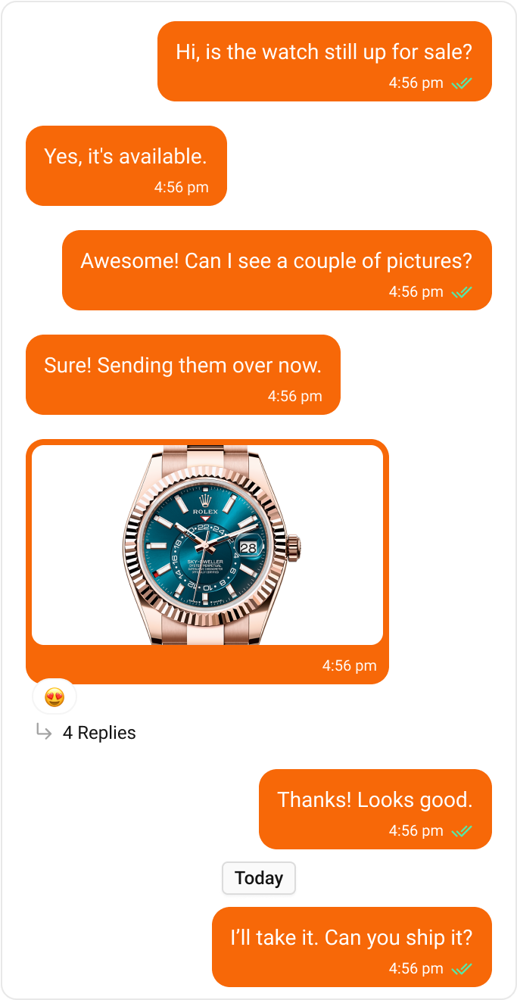

<Tabs>

<TabItem value="Dart" label="Dart">

```dart
MaterialApp(
      title: 'Your app',
      theme: ThemeData(
          extensions: [
            CometChatIncomingMessageBubbleStyle(
                backgroundColor: Color(0xFFF76808)
            ),
            CometChatOutgoingMessageBubbleStyle(
                backgroundColor: Color(0xFFF76808)
            ),
          ]
      ),
      home: ...
    );
```

</TabItem>

</Tabs>

### 3. Ease of Integration
To apply these styles:
1. Create a `CometChatMessageListStyle` object.
2. Assign your custom outgoing and incoming bubble styles.
3. Pass this object to the `style` property of the **CometChatMessageList** widget.

This modular approach ensures that customization is both easy to manage and highly adaptable.

<Tabs>

<TabItem value="Dart" label="Dart">

```dart
CometChatMessageList(
    user: user,
    group: group,
    style: CometChatMessageListStyle(
        incomingMessageBubbleStyle: CometChatIncomingMessageBubbleStyle(),
        outgoingMessageBubbleStyle: CometChatOutgoingMessageBubbleStyle(),
    ),
)
```

</TabItem>

</Tabs>

## Key Features of Each Class

### CometChatOutgoingMessageBubbleStyle
Focused on customizing bubbles for **messages sent by the user**, with properties for:
- **Text bubbles**: Style text content sent by users.
- **Image and video bubbles**: Customize visual media messages.
- **Audio bubbles**: Adjust styles for audio messages.
- **File bubbles**: Tailor the look of file-sharing bubbles.
- **Collaborative bubbles**: Style messages related to collaboration features.
- **Poll bubbles**: Adjust the appearance of poll-related messages.
- **Deleted message bubbles**: Customize how deleted messages are displayed.
- **Link preview bubbles**: Style links with previews for shared URLs.
- **Message translation bubbles**: Adjust translations for sent messages.
- **Sticker bubbles**: Customize stickers sent in chats.
- **Call bubbles**: Style voice and video call bubbles.
- Additional customizations like reactions, timestamps, avatars, and borders.

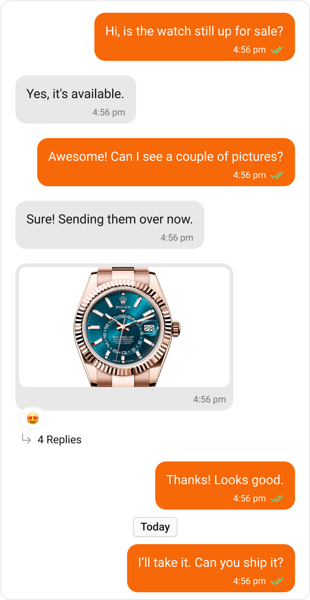

<Tabs>

<TabItem value="Dart" label="Dart">

```dart
CometChatOutgoingMessageBubbleStyle(
    backgroundColor: Color(0xFFF76808)
)
```

</TabItem>

</Tabs>

### CometChatIncomingMessageBubbleStyle
Designed to style bubbles for **messages received from others**, with properties for:
- **Text bubbles**: Customize text content from other users.
- **Image and video bubbles**: Adjust styles for media from others.
- **Audio bubbles**: Customize received audio messages.
- **File bubbles**: Tailor the look of received files.
- **Collaborative bubbles**: Style incoming collaboration-related messages.
- **Poll bubbles**: Adjust the appearance of polls sent by others.
- **Deleted message bubbles**: Customize how deleted messages appear.
- **Link preview bubbles**: Style links with previews in received messages.
- **Message translation bubbles**: Adjust translations for received messages.
- **Sticker bubbles**: Customize stickers sent by others.
- **Call bubbles**: Style voice and video call bubbles.
- **Sender name**: Customize the display style for sender names.
- Additional customizations like reactions, timestamps, avatars, and borders.

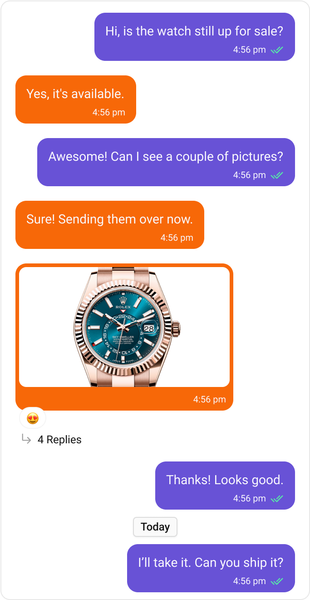

<Tabs>

<TabItem value="Dart" label="Dart">

```dart
CometChatIncomingMessageBubbleStyle(
    backgroundColor: Color(0xFFF76808)
)
```

</TabItem>

</Tabs>

## Benefits
By using these classes, developers can:
- Save time by focusing on specific customizations.
- Reduce complexity while maintaining a consistent design.
- Create visually appealing and user-friendly chat interfaces.

Whether you're tweaking a single bubble type or applying a cohesive design across your application, these tools provide the flexibility and precision needed to bring your vision to life.

<br />

## Customizable Message Bubbles
The CometChat Flutter Chat UI Kit offers a versatile range of customizable message bubbles tailored to enhance any chat experience. From Text, Image, Video, and Audio Bubbles for seamless multimedia sharing, to File, Poll, and Collaborative Whiteboard/Document Bubbles for productivity, the UI Kit ensures every interaction is visually engaging. Link Previews, Stickers, and Call Bubbles add rich context, while Action and Deleted Message Bubbles enhance clarity. These bubbles are fully customizable, empowering developers to create unique, brand-specific chat interfaces.

### Text Bubble
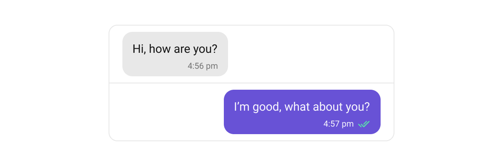
Modify text color, font, and background to match your branding while maintaining readability.
<Tabs>

<TabItem value="Dart" label="Dart">

```dart
ThemeData(
    extensions: [
        CometChatOutgoingMessageBubbleStyle(
            textBubbleStyle: CometChatTextBubbleStyle(
                backgroundColor:Color(0xFFF76808),
            )
        ),
        CometChatIncomingMessageBubbleStyle(
            textBubbleStyle: CometChatTextBubbleStyle(
                backgroundColor:  Color(0xFFFEEDE1),
            )
        ),
        ]
    )
```

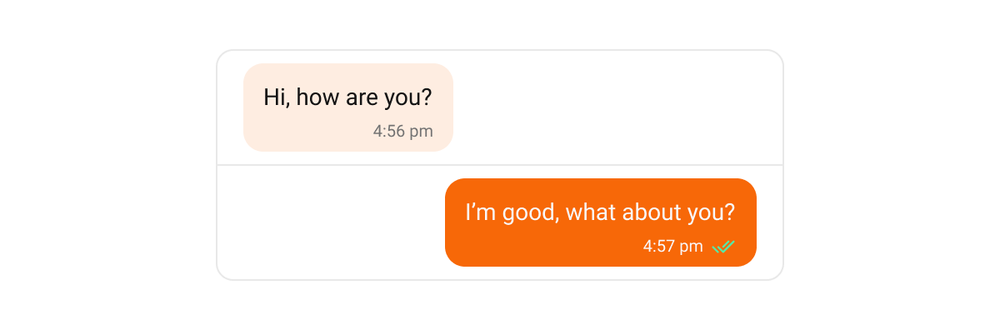

</TabItem>

</Tabs>

### Image Bubble
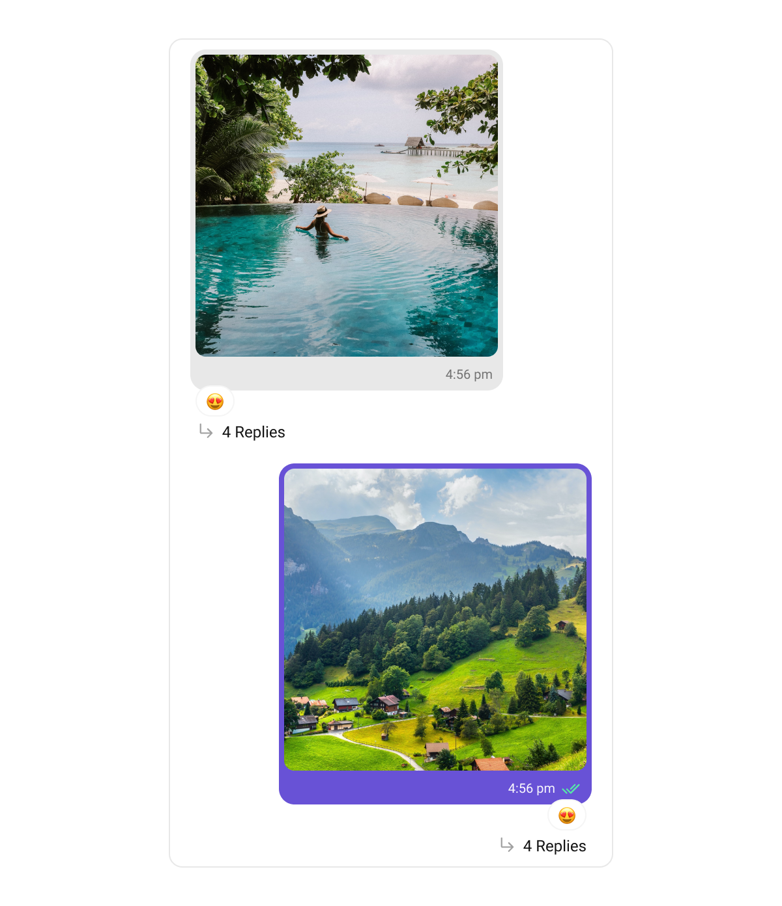
Customize borders and background to enhance media presentation.

<Tabs>

<TabItem value="Dart" label="Dart">

```dart
ThemeData(
    extensions: [
        CometChatOutgoingMessageBubbleStyle(
           imageBubbleStyle: CometChatImageBubbleStyle(
             backgroundColor:Color(0xFFF76808),
           )
          ),
        CometChatIncomingMessageBubbleStyle(
              imageBubbleStyle: CometChatImageBubbleStyle(
                backgroundColor:  Color(0xFFFEEDE1),
              )
          ),
        ]
    )
```

</TabItem>

</Tabs>
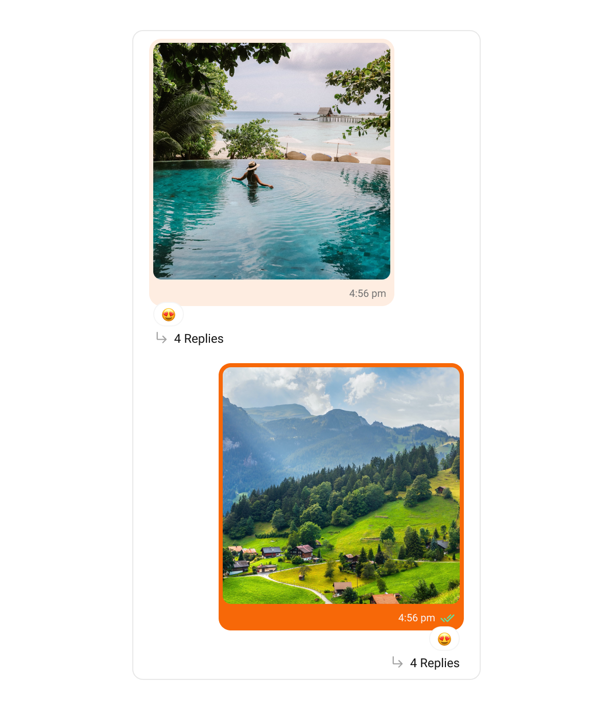

### Video Bubble
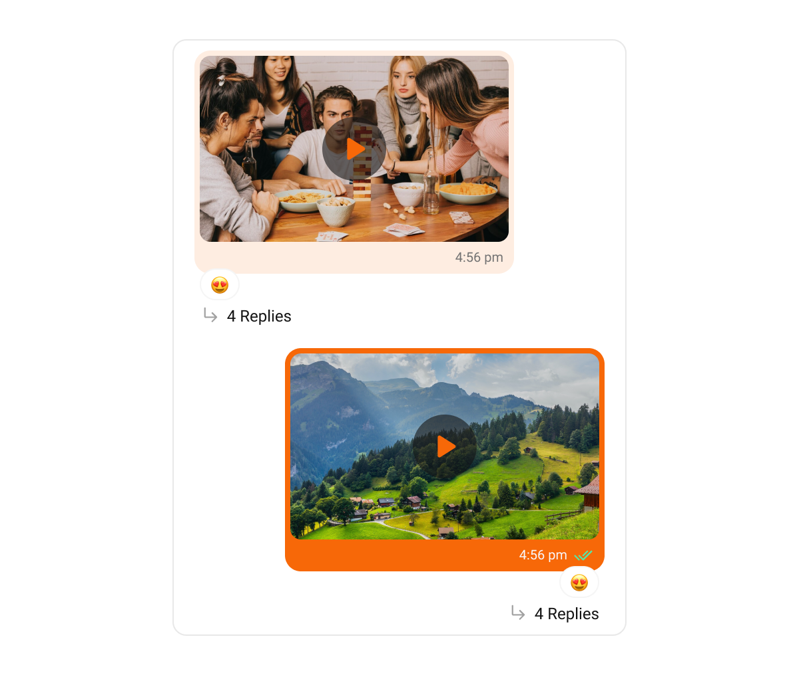
Style play button color, background color and borders for a seamless viewing experience.

<Tabs>

<TabItem value="Dart" label="Dart">

```dart
ThemeData(
    extensions: [
        CometChatOutgoingMessageBubbleStyle(
           videoBubbleStyle: CometChatVideoBubbleStyle(
             backgroundColor:Color(0xFFF76808),
             playIconColor: Color(0xFFF76808),
           )
          ),
        CometChatIncomingMessageBubbleStyle(
              videoBubbleStyle: CometChatVideoBubbleStyle(
                backgroundColor:  Color(0xFFFEEDE1),
                playIconColor: Color(0xFFF76808),
              )
          ),
        ]
    )
```

</TabItem>

</Tabs>


### Audio Bubble

Adjust progress bar colors, play and download button styles, and backgrounds to suit your theme.

<Tabs>

<TabItem value="Dart" label="Dart">

```dart
ThemeData(
    extensions: [
        CometChatOutgoingMessageBubbleStyle(
           audioBubbleStyle: CometChatAudioBubbleStyle(
             backgroundColor:Color(0xFFF76808),
             playIconColor: Color(0xFFF76808),
           )
          ),
          CometChatIncomingMessageBubbleStyle(
              audioBubbleStyle: CometChatAudioBubbleStyle(
                backgroundColor:  Color(0xFFFEEDE1),
                downloadIconColor: Color(0xFFF76808),
                audioBarColor: Color(0xFFF76808),
                playIconColor: Color(0xFFF76808),
              )
          ),
        ]
    )
```

</TabItem>

</Tabs>
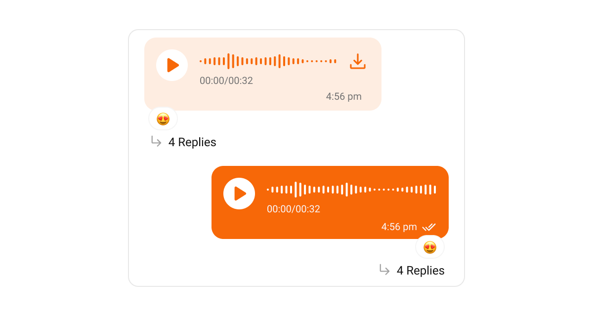

### File Bubble
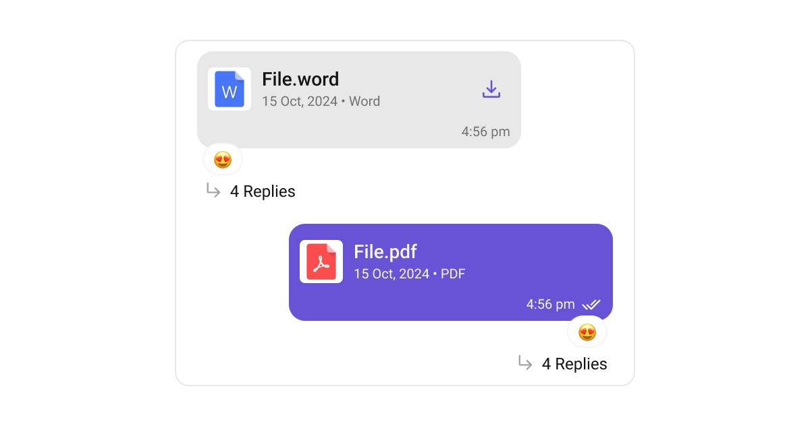
Personalize file bubble's background and download icon colors.

<Tabs>

<TabItem value="Dart" label="Dart">

```dart
ThemeData(
    extensions: [
        CometChatOutgoingMessageBubbleStyle(
           fileBubbleStyle: CometChatFileBubbleStyle(
             backgroundColor:Color(0xFFF76808),
           )
        ),
        CometChatIncomingMessageBubbleStyle(
              fileBubbleStyle: CometChatFileBubbleStyle(
                backgroundColor:  Color(0xFFFEEDE1),
                downloadIconTint: Color(0xFFF76808),
            )
        ),
        ]
    )
```

</TabItem>

</Tabs>
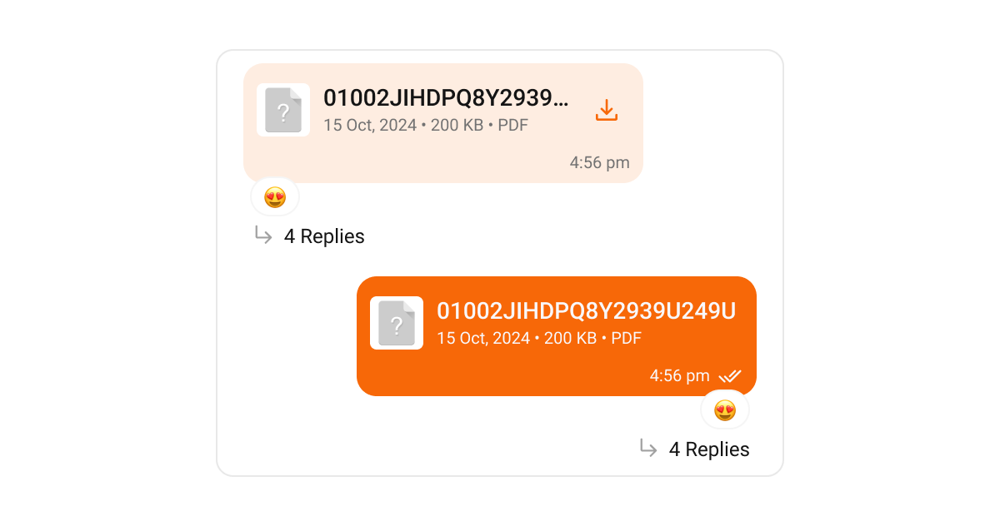

### Sticker Bubble
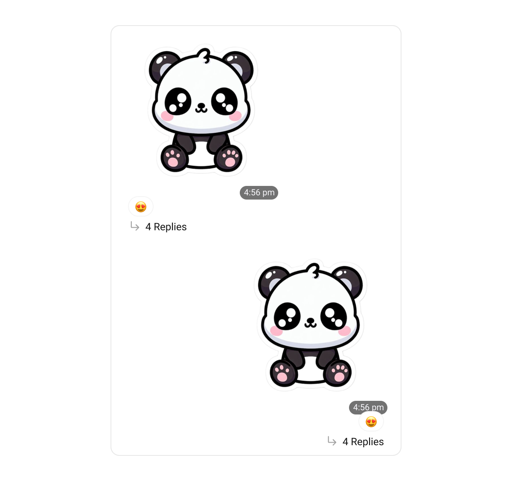
Personalize sticker display with unique padding, borders, and background styles to match the app's personality.

<Tabs>

<TabItem value="Dart" label="Dart">

```dart
ThemeData(
    extensions: [
        CometChatOutgoingMessageBubbleStyle(
            stickerBubbleStyle: CometChatStickerBubbleStyle(
              backgroundColor: Color(0xFFF76808),
            ),
          ),
          CometChatIncomingMessageBubbleStyle(
            stickerBubbleStyle: CometChatStickerBubbleStyle(
                backgroundColor: Color(0xFFFEEDE1),
            ),
          ),
        ]
    )
```

</TabItem>

</Tabs>
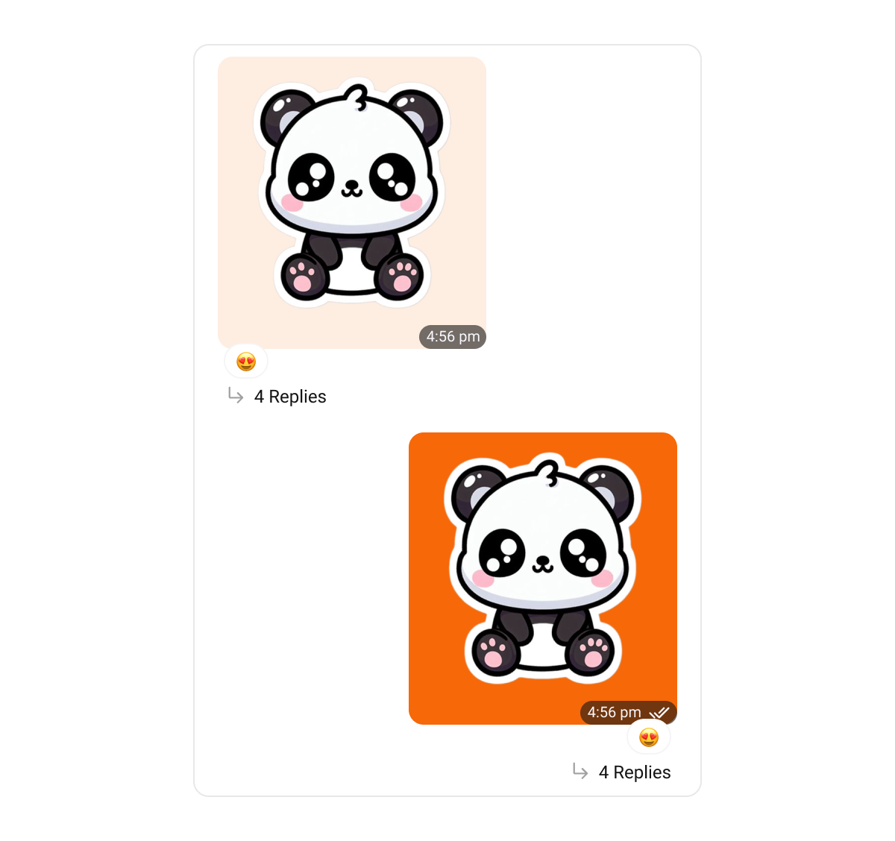

### Call Bubble

Customize icons, text, and background elements for incoming and outgoing call notifications to fit seamlessly into your UI design.

<Tabs>

<TabItem value="Dart" label="Dart">

```dart
ThemeData(
    extensions: [
        CometChatOutgoingMessageBubbleStyle(
            videoCallBubbleStyle: CometChatCallBubbleStyle(
              backgroundColor: Color(0xFFF76808),
              iconColor:  Color(0xFFF76808),
              buttonTextStyle: TextStyle(
                color: Colors.white,
              ),
              dividerColor: Color(0xFFFBAA75)
            ),
          ),
        CometChatIncomingMessageBubbleStyle(
            videoCallBubbleStyle: CometChatCallBubbleStyle(
              backgroundColor: Color(0xFFFEEDE1),
              iconColor:  Color(0xFFF76808),
              buttonTextStyle: TextStyle(
                color:  Color(0xFFF76808),
              ),
            ),
          ),
        ]
    )
```

</TabItem>

</Tabs>


### Collaborative Whiteboard Bubble
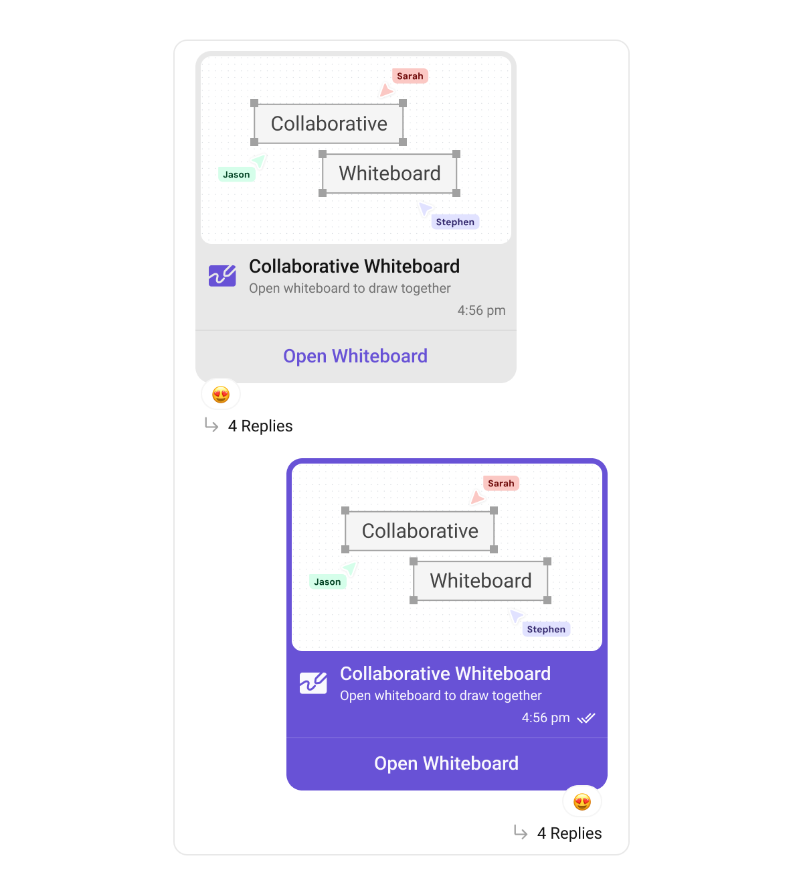
Style the background and interaction controls to support creative collaboration.

<Tabs>

<TabItem value="Dart" label="Dart">

```dart
ThemeData(
    extensions: [
        CometChatOutgoingMessageBubbleStyle(
           collaborativeWhiteboardBubbleStyle: CometChatCollaborativeBubbleStyle(
             backgroundColor:Color(0xFFF76808),
             iconTint: Color(0xFFFFFFFF),
             titleStyle: TextStyle(
               fontWeight: FontWeight.bold,
               color: Color(0xFFFFFFFF),
             ),
             buttonTextStyle: TextStyle(
               color: Color(0xFFFFFFFF),
             ),
             dividerColor: Color(0xFFFBAA75),
           )
          ),
        CometChatIncomingMessageBubbleStyle(
              collaborativeWhiteboardBubbleStyle: CometChatCollaborativeBubbleStyle(
                backgroundColor:  Color(0xFFFEEDE1),
                iconTint: Color(0xFFF76808),
                titleStyle: TextStyle(
                  fontWeight: FontWeight.bold,
                ),
                buttonTextStyle: TextStyle(
                  color: Color(0xFFF76808),
                ),
              )
          ),
        ]
    )
```

</TabItem>

</Tabs>
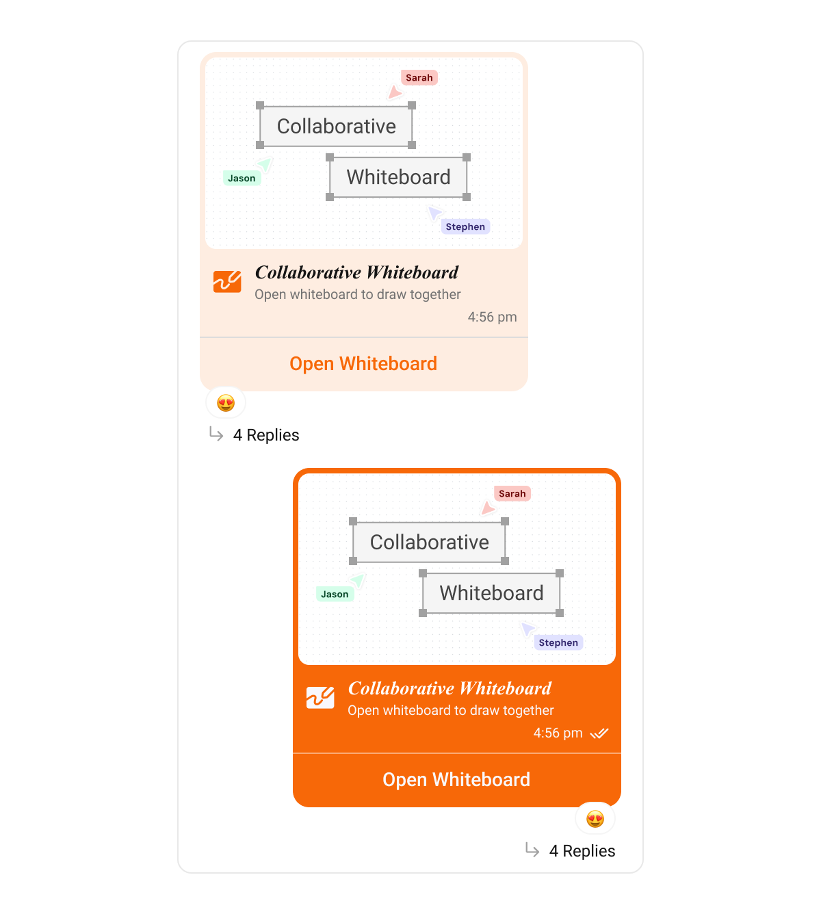

### Collaborative Document Bubble
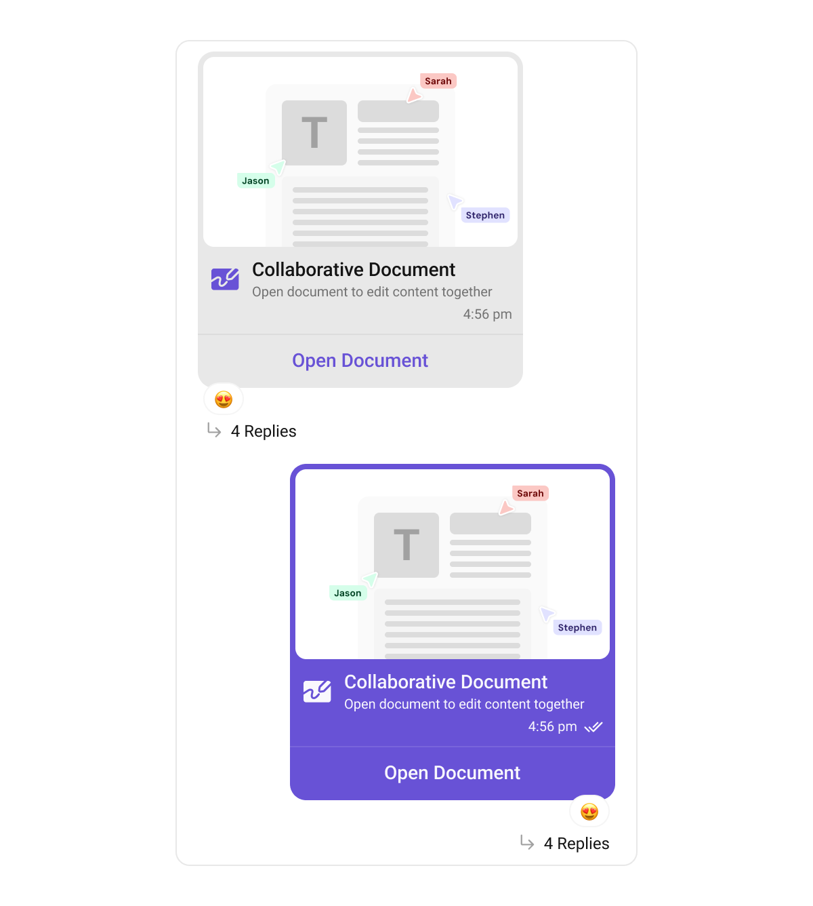
Customize fonts and interface elements for shared document interaction.

<Tabs>

<TabItem value="Dart" label="Dart">

```dart
ThemeData(
    extensions: [
        CometChatOutgoingMessageBubbleStyle(
           collaborativeDocumentBubbleStyle: CometChatCollaborativeBubbleStyle(
             backgroundColor:Color(0xFFF76808),
             iconTint: Color(0xFFFFFFFF),
             titleStyle: TextStyle(
               fontWeight: FontWeight.bold,
               color: Color(0xFFFFFFFF),
             ),
             buttonTextStyle: TextStyle(
               color: Color(0xFFFFFFFF),
             ),
             dividerColor: Color(0xFFFBAA75),
           )
          ),
        CometChatIncomingMessageBubbleStyle(
              collaborativeDocumentBubbleStyle: CometChatCollaborativeBubbleStyle(
                backgroundColor:  Color(0xFFFEEDE1),
                iconTint: Color(0xFFF76808),
                titleStyle: TextStyle(
                  fontWeight: FontWeight.bold,
                ),
                buttonTextStyle: TextStyle(
                  color: Color(0xFFF76808),
                ),
              )
          ),
        ]
    )
```

</TabItem>

</Tabs>
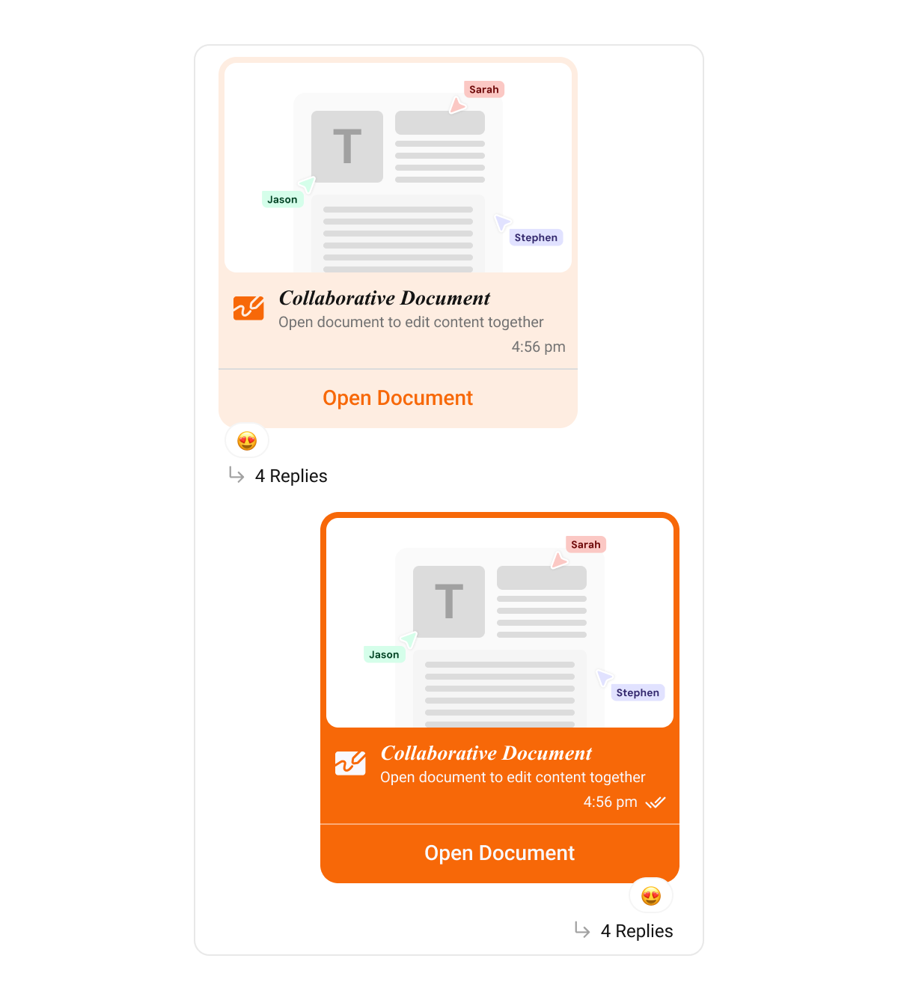

### Poll Bubble
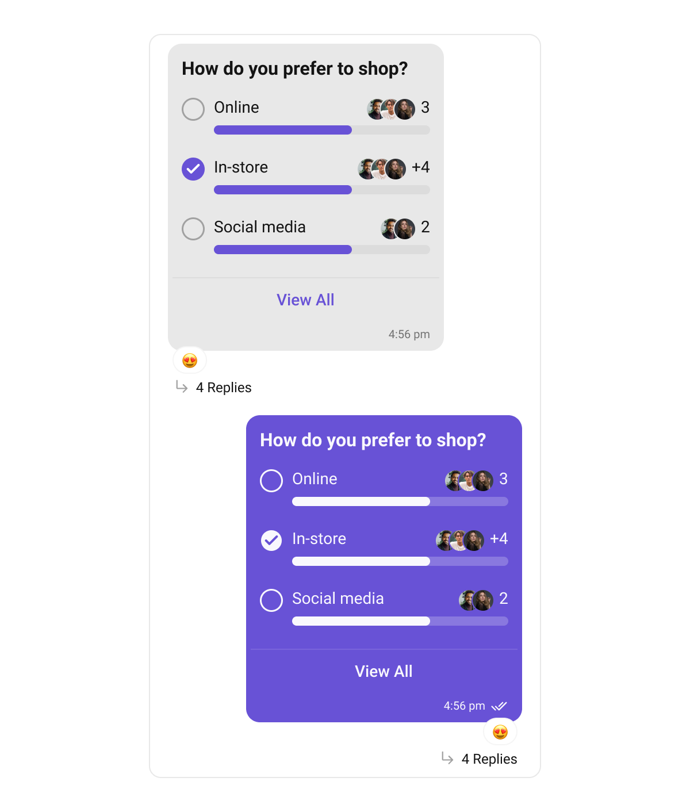
Tailor vote bar colors, text, and layouts to align with your UI design.

<Tabs>

<TabItem value="Dart" label="Dart">

```dart
ThemeData(
    extensions: [
         CometChatOutgoingMessageBubbleStyle(
            pollsBubbleStyle: CometChatPollsBubbleStyle(
              backgroundColor: Color(0xFFF76808),
              progressBackgroundColor: Color(0xFFFBAA75),
              iconColor: Color(0xFFF76808),
              voterAvatarStyle: CometChatAvatarStyle(
                border: Border.all(color: Color(0xFFF76808)),
              )
            ),
          ),
        CometChatIncomingMessageBubbleStyle(
            pollsBubbleStyle: CometChatPollsBubbleStyle(
                backgroundColor: Color(0xFFFEEDE1),
                progressBackgroundColor: Color(0xFFDCDCDC),
                progressColor: Color(0xFFF76808),
                iconColor: Colors.white,
                selectedOptionColor: Color(0xFFF76808),
                voterAvatarStyle: CometChatAvatarStyle(
                  border: Border.all(color: Color(0xFFFEEDE1)),
                )
            ),
        ),
        ]
    )
```

</TabItem>

</Tabs>
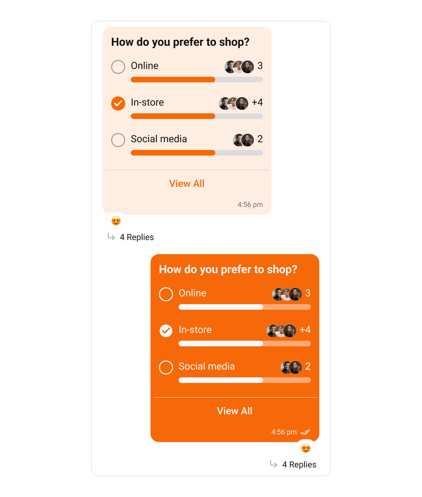

### Link Preview Bubble

Adjust title fonts, descriptions, and thumbnail frames for cohesive link displays.

<Tabs>

<TabItem value="Dart" label="Dart">

```dart
ThemeData(
    extensions: [
        CometChatOutgoingMessageBubbleStyle(
           linkPreviewBubbleStyle: CometChatLinkPreviewBubbleStyle(
             backgroundColor:Color(0xFFFBAA75),
           ),
            textBubbleStyle: CometChatTextBubbleStyle(
              backgroundColor: Color(0xFFF76808),
            ),
          ),
          CometChatIncomingMessageBubbleStyle(
              linkPreviewBubbleStyle: CometChatLinkPreviewBubbleStyle(
                backgroundColor:  Color(0xFFFBAA75),
              ),
            textBubbleStyle: CometChatTextBubbleStyle(
              backgroundColor: Color(0xFFFEEDE1),
            ),
          ),
        ]
    )
```

</TabItem>

</Tabs>
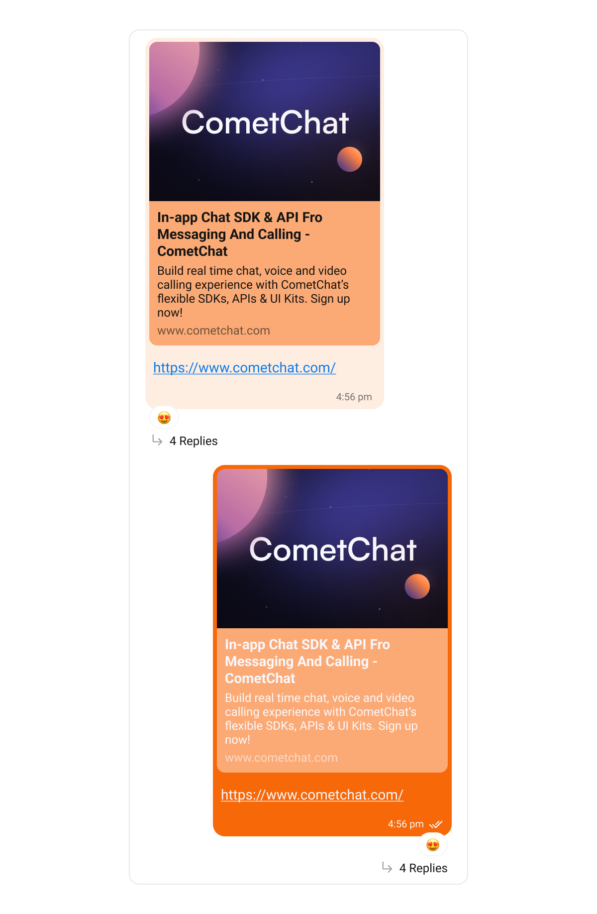

### Action Message Bubble

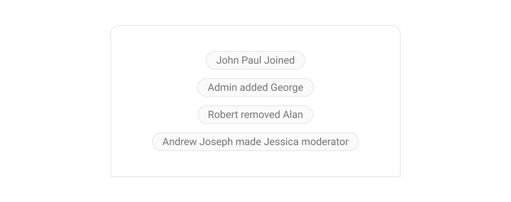
Style background colors and icons for activity-driven notifications.

<Tabs>

<TabItem value="Dart" label="Dart">

```dart
ThemeData(
    extensions: [
        CometChatActionBubbleStyle(
            textStyle: TextStyle(
              color: Color(0xFFF76808),
            ),
            border: Border.all(
              color: Color(0xFFF76808),
            ),
            backgroundColor: Color(0xFFFEEDE1)
        )
        ]
    )
```

</TabItem>

</Tabs>
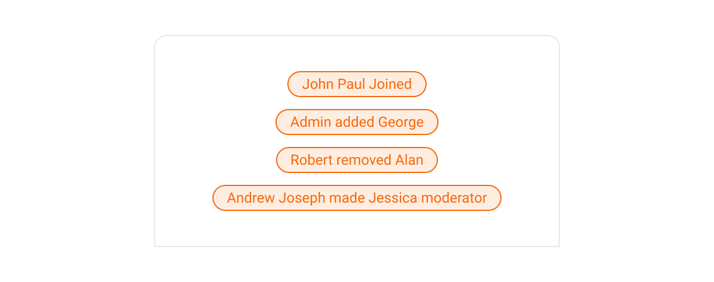

### Deleted Message Bubble

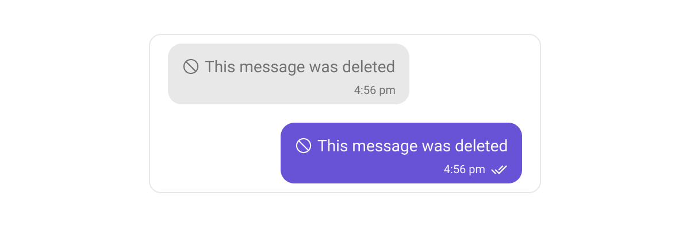
Add unique styles for placeholders that indicate message deletion.

<Tabs>

<TabItem value="Dart" label="Dart">

```dart
ThemeData(
    extensions: [
        CometChatOutgoingMessageBubbleStyle(
            deletedBubbleStyle: CometChatDeletedBubbleStyle(
              backgroundColor: Color(0xFFF76808),
            ),
        ),
        CometChatIncomingMessageBubbleStyle(
            deletedBubbleStyle: CometChatDeletedBubbleStyle(
                backgroundColor: Color(0xFFFEEDE1),
            ),
        ),
        ]
    )
```

</TabItem>

</Tabs>
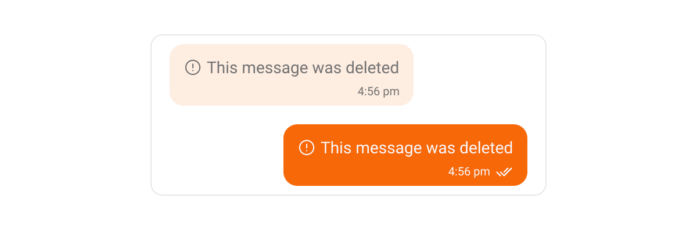

### Call Action Bubble

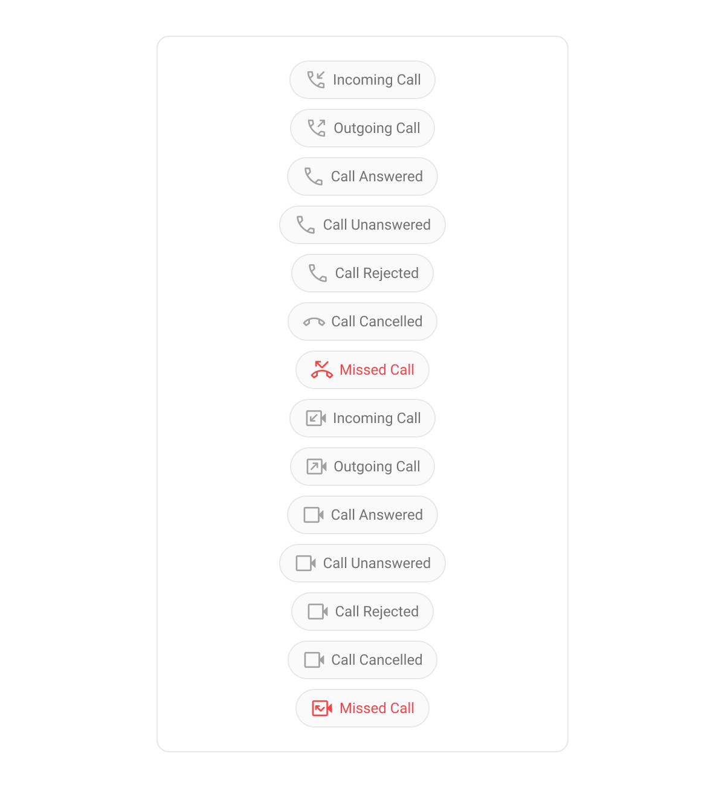

Customize call action bubbles with unique background colors and icons.

<Tabs>
<TabItem value="Dart" label="Dart">

```dart
ThemeData(extensions: [
    CometChatColorPalette(textSecondary: Color(0xFFF76808)),
    CometChatActionBubbleStyle(
        textStyle: TextStyle(
          color: Color(0xFFF76808),
        ),
        border: Border.all(
          color: Color(0xFFF76808),
        ),
        backgroundColor: Color(0xFFFEEDE1))
  ]);
```
</TabItem>
</Tabs>

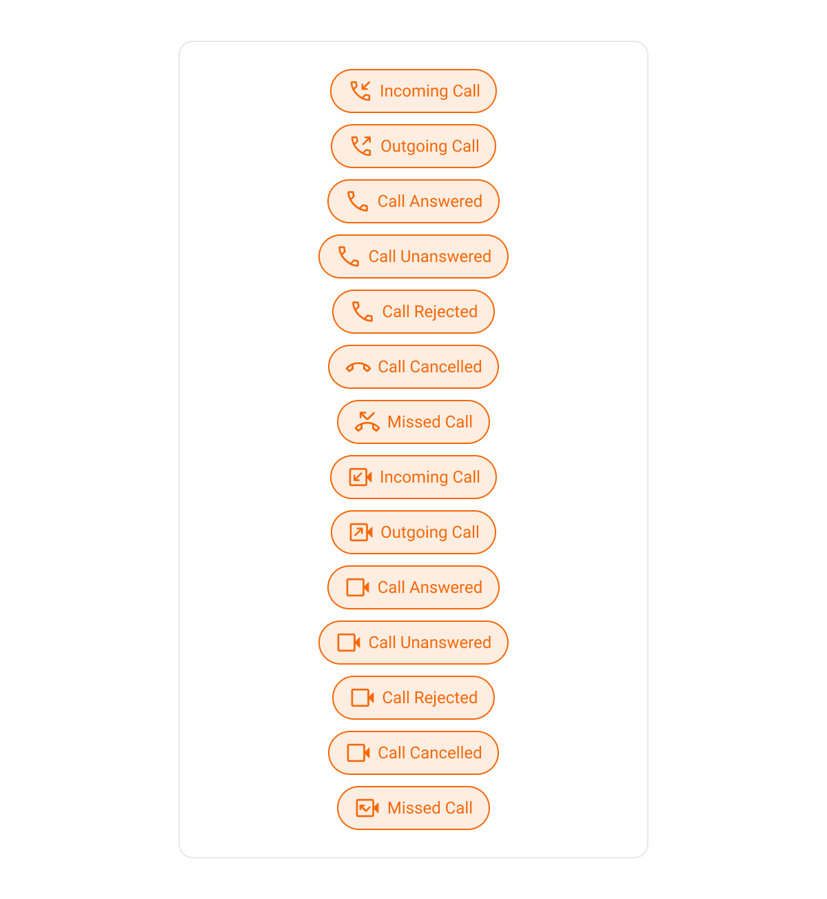


