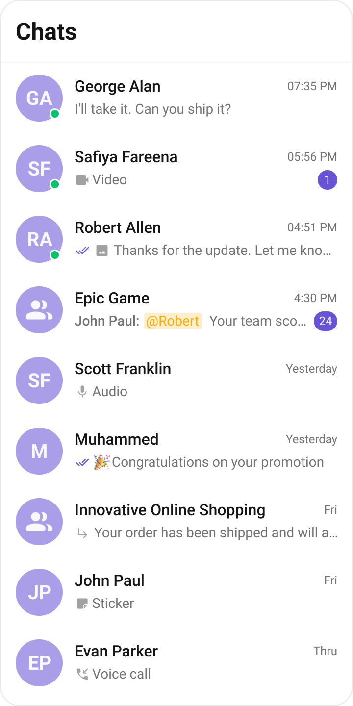
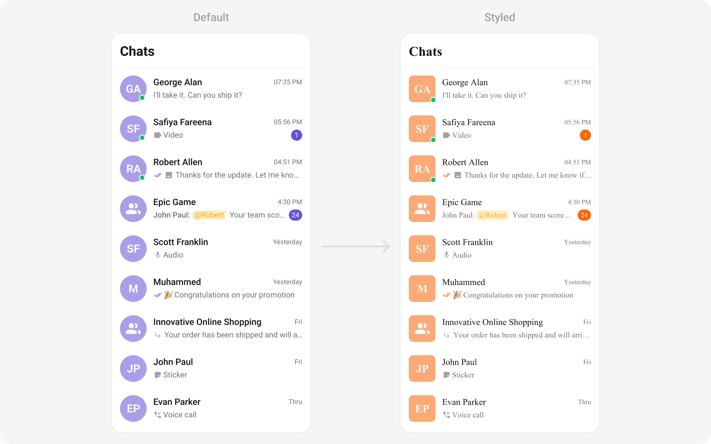
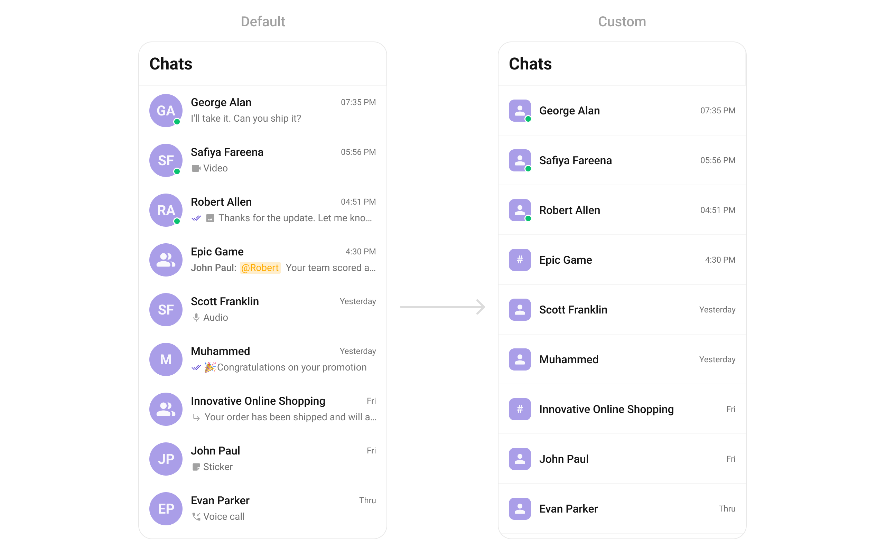
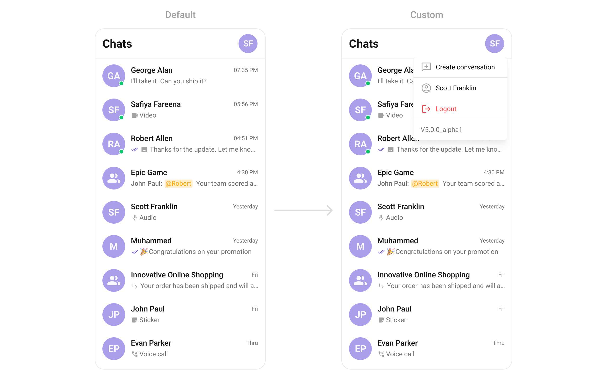
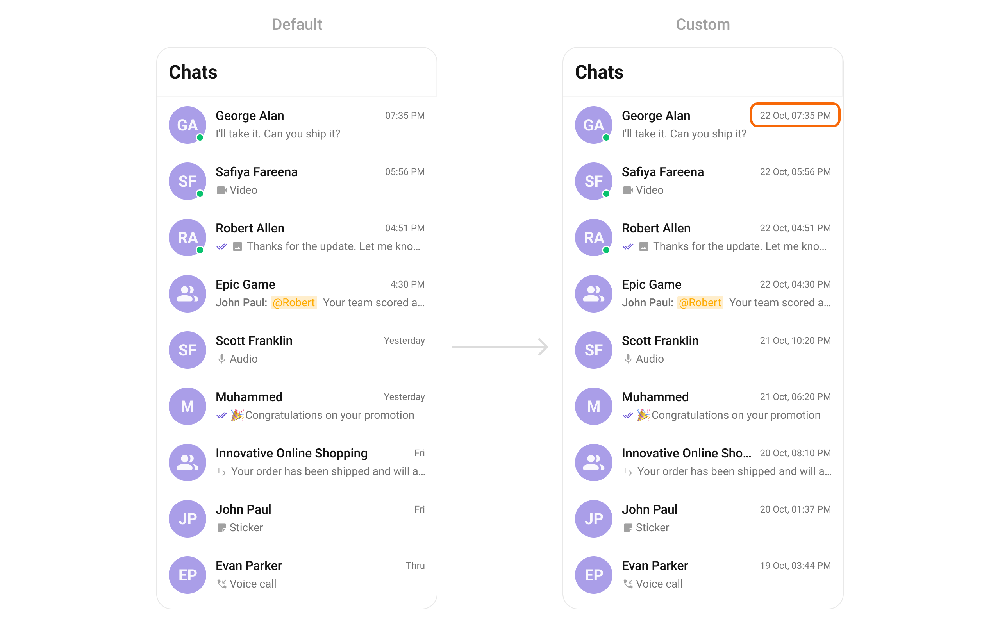
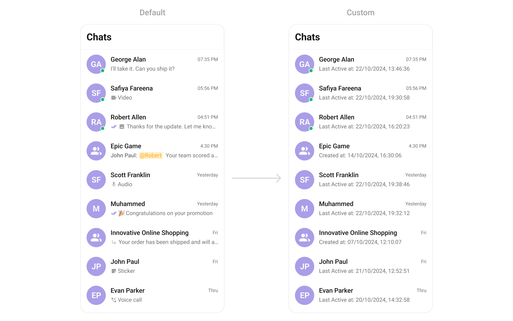

import Tabs from '@theme/Tabs';
import TabItem from '@theme/TabItem';

## Overview

The `CometChatConversations` is a [Widget](/ui-kit/flutter/components-overview#components), That shows all conversations related to the currently logged-in user,



## Usage

### Integration

As `CometChatConversations` is a widget, it can be initiated either by tapping a button or through the trigger of any event. It offers multiple parameters and methods for tailoring its user interface.

You can launch `CometChatConversations` directly using `Navigator.push`, or you can define it as a widget within the `build` method of your `State` class.

##### 1. Using Navigator to Launch `CometChatConversations`

<Tabs>

<TabItem value="Dart" label="Dart">

```dart
Navigator.push(context, MaterialPageRoute(builder: (context) => const CometChatConversations()));
```

</TabItem>

</Tabs>

##### 2. Embedding `CometChatConversations` as a Widget in the build Method

<Tabs>

<TabItem value="Dart" label="Dart">

```dart
import 'package:cometchat_chat_uikit/cometchat_chat_uikit.dart';
import 'package:flutter/material.dart';

class Conversations extends StatefulWidget {
  const Conversations({super.key});

  @override
  State<Conversations> createState() => _ConversationsState();
}

class _ConversationsState extends State<Conversations> {
  @override
  Widget build(BuildContext context) {
    return Scaffold(
      body: SafeArea(
        child: CometChatConversations(),
      ),
    );
  }
}
```

</TabItem>

</Tabs>

### Actions

[Actions](/ui-kit/flutter/components-overview#actions) dictate how a widget functions. They are divided into two types: Predefined and User-defined. You can override either type, allowing you to tailor the behavior of the widget to fit your specific needs.

1. ##### onItemTap

`onItemTap` is triggered when you click on a ListItem of the `CometChatConversations` widget.
This `onItemTap` method proves beneficial when a user intends to customize the click behavior in CometChatConversations.

<Tabs>

<TabItem value="Dart" label="Dart">

```dart
CometChatConversations(
    onItemTap: (conversation) => {
        // TODO("Not yet implemented")
    }
),
```

</TabItem>

</Tabs>

---

##### 2. onBack

This `onBack` method becomes valuable when a user needs to override the action triggered upon pressing the back button in CometChatConversations.

<Tabs>

<TabItem value="Dart" label="Dart">

```dart
CometChatConversations(
    onBack: () => {
        // TODO("Not yet implemented")
    },
),
```

</TabItem>

</Tabs>

---

##### 3. setOnSelection

The `onSelection` feature enables selection with modes: `SelectionMode.single` and `SelectionMode.multiple`.

The `onSelection` event is triggered upon the completion of a selection in `onSelection`. This returns the selected conversations list when the callback is triggered. It can be executed with any button or action.

<Tabs>

<TabItem value="Dart" label="Dart">

```dart
CometChatConversations(
    selectionMode: SelectionMode.multiple,
    onSelection: (list) => {
        // TODO("Not yet implemented")
    },
),
```

</TabItem>

</Tabs>

---

##### 4. onError

This method proves helpful when a user needs to customize the action taken upon encountering an error in CometChatConversations.

<Tabs>

<TabItem value="Dart" label="Dart">

```dart
CometChatConversations(
    onError: (e) {
        // TODO("Not yet implemented")
    },
)
```

</TabItem>

</Tabs>

---

### Filters

You can set `ConversationsRequestBuilder` in the `CometChatConversations` widget to filter the conversation list. You can modify the builder as per your specific requirements with multiple options available to know more refer to [ConversationsRequestBuilder](/sdk/flutter/retrieve-conversations).

<Tabs>

<TabItem value="Dart" label="Dart">

```dart
CometChatConversations(
    conversationsRequestBuilder: ConversationsRequestBuilder()
        ..conversationType = "user"
        ..limit = 10
        ..withTags = false,
)
```

</TabItem>

</Tabs>

You can set filters using the following parameters:

| Property                     | Description                                          | Code                             |
| ---------------------------- | ---------------------------------------------------- | -------------------------------- |
| **Build**                    | Builds and returns an `ConversationsRequest` object. | `build(): ConversationsRequest ` |
| **Conversation Type**        | Type of the conversation.                            | `conversationType: String?`      |
| **Limit**                    | Number of results to limit the query.                | `limit: int?`                    |
| **Tags**                     | Tags for filtering.                                  | `tags: List<String>?`            |
| **With Tags**                | Flag to include tags.                                | `withTags: bool?`                |
| **With User And Group Tags** | Flag to include user and group tags.                 | `withUserAndGroupTags: bool?`    |

---

### Events

[Events](/ui-kit/flutter/components-overview#events) are emitted by a `Widget`. By using event you can extend existing functionality. Being global events, they can be applied in Multiple Locations and are capable of being Added or Removed.

##### 1. Conversation Deleted

This `ccConversationDeleted` will be emitted when the user deletes a conversation

<Tabs>

<TabItem value="Dart" label="Dart">

```dart
import 'package:cometchat_chat_uikit/cometchat_chat_uikit.dart';

class _YourScreenState extends State<YourScreen> with CometChatConversationEventListener {

  @override
  void initState() {
    super.initState();
    CometChatConversationEvents.addConversationListListener("listenerId", this); // Add the listener
  }

  @override
  void dispose(){
    super.dispose();
    CometChatConversationEvents.removeConversationListListener("listenerId"); // Remove the listener
  }

  @override
  void ccConversationDeleted(Conversation conversation) {
    // TODO("Not yet implemented")
  }
}
```

</TabItem>

</Tabs>

---

## Customization

To align with your app's design specifications, you have the flexibility to customize the appearance of the conversation widget. We offer accessible methods that empower you to tailor the experience and functionality to meet your unique requirements.

### Style

You can set the `CometChatConversationsStyle` to the `CometChatConversations` Widget to customize the styling.

<Tabs>

<TabItem value="Dart" label="Dart">

```dart
CometChatConversations(
    style: CometChatConversationsStyle(
              avatarStyle: CometChatAvatarStyle(
                borderRadius: BorderRadius.circular(8),
                backgroundColor: Color(0xFFFBAA75),
              ),
              badgeStyle:CometChatBadgeStyle(
                backgroundColor: Color(0xFFF76808)
              )
)
```

</TabItem>

</Tabs>



---

### Functionality

These are a set of small functional customizations that allow you to fine-tune the overall experience of the widget. With these, you can change text, set custom icons, and toggle the visibility of UI elements.


<Tabs>

<TabItem value="Dart" label="Dart">

```dart
 CometChatConversations(
    showBackButton: false,
    title: "Your Title",
)
```

</TabItem>

</Tabs>

List of Poperties exposed by `CometChatConversations`

| Property                   | Description                                                                                                                                                                 | Code                                                      |
| -------------------------- | --------------------------------------------------------------------------------------------------------------------------------------------------------------------------- | --------------------------------------------------------- |
| **Activate Selection**     | Used to specify if the listed conversations can be selected, selection can be activated on tap or on long press                                                             | `activateSelection: ActivateSelection`                    |
| **AppBar Options**         | Used to set the options available in the app bar                                                                                                                            | `appBarOptions: List<Widget>`                             |
| **Back Button**            | Used to set back button located in the app bar                                                                                                                              | `backButton: Widget`                                      |
| **Controller**             | Used to programmatically update the scroll physics of list containing the conversations                                                                                     | `controller: ScrollController`                            |
| **Date Pattern**           | Used to display a custom string instead of the timestamp show at the tail of the conversation item                                                                          | `datePattern: String Function(Conversation conversation)` |
| **Disable Mentions**       | Disables mentions formatter if true                                                                                                                                         | `disableMentions: bool`                                   |
| **Disable Typing**         | If true stops indicating if a participant in a conversation is typing                                                                                                       | `disableTyping: bool`                                     |
| **Empty State Text**       | Used to set a custom text response when fetching the conversations has returned an empty list                                                                               | `emptyStateText: String`                                  |
| **Error State Text**       | Used to set a custom text response when some error occurs on fetching the list of conversations                                                                             | `errorStateText: String`                                  |
| **Hide Appbar**            | Toggle visibility for app bar                                                                                                                                               | `hideAppbar: bool`                                        |
| **Hide Error**             | Used to hide error on fetching conversations                                                                                                                                | `hideError: bool`                                         |
| **Hide Receipt**           | Used to toggle visibility of message receipts shown in the subtitle of the conversation                                                                                     | `hideReceipt: bool`                                       |
| **Hide Search**            | Used to toggle visibility for search box                                                                                                                                    | `hideSearch: bool`                                        |
| **Hide Separator**         | Used to hide the divider separating the conversation items                                                                                                                  | `hideSeparator: bool`                                     |
| **Hide Section Separator** | Used to hide the text separating grouped conversation items                                                                                                                 | `hideSectionSeparator: bool`                              |
| **Private Group Icon**     | Used to set icon shown in place of status indicator if the conversation is taking place in a private group                                                                  | `privateGroupIcon: Widget`                                |
| **Protected Group Icon**   | Used to set icon shown in place of status indicator if the conversation is taking place in a password protected group                                                       | `protectedGroupIcon: Widget`                              |
| **Search Box Icon**        | Used to set search Icon in the search field                                                                                                                                 | `searchBoxIcon: Widget`                                   |
| **Search Placeholder**     | Used to set placeholder text for the search field                                                                                                                           | `searchPlaceholder: String`                               |
| **Selection Icon**         | Change selection icon                                                                                                                                                       | `selectionIcon: Widget`                                   |
| **Sent Icon**              | Used to customize the receipt icon shown in the subtitle of the conversation item if hideReceipt is false and if the status of the last message in the conversation is sent | `sentIcon: Widget`                                        |
| **Show Back Button**       | Used to toggle visibility for back button                                                                                                                                   | `showBackButton: bool`                                    |
| **Theme**                  | Used to set custom theme                                                                                                                                                    | `theme: CometChatTheme`                                   |
| **Title**                  | Used to set the title in the app bar                                                                                                                                        | `title: String`                                           |
| **Typing Indicator Text**  | Used to customize the text response shown in the subtitle of the conversation item if a participant of a conversation is typing                                             | `typingIndicatorText: String`                             |

### Advanced

For advanced-level customization, you can set custom views to the widget. This lets you tailor each aspect of the widget to fit your exact needs and application aesthetics. You can create and define your own widget and then incorporate those into the widget.

#### ListItemView

With this function, you can assign a custom ListItem view to the `CometChatConversations` Widget.

<Tabs>

<TabItem value="Dart" label="Dart">

```dart
CometChatConversations(
    listItemView: (conversation) {
      return Placeholder();
    },
)
```

</TabItem>

</Tabs>



**Example**

Here is the complete example for reference:

<Tabs>

<TabItem value="Dart" label="Dart">

```dart title="custom_list_item.dart"
Widget getCustomListItem(
    Conversation conversation,
    BuildContext context
    ) {
  Widget? tail;
  Color? statusBackgroundColor;
  Widget? icon;
  final lastMessageTime = conversation.lastMessage?.sentAt ?? DateTime.now();
  tail = Padding(
      padding: EdgeInsets.only(
        left: 8,
      ),
      child: CometChatDate(
        date: lastMessageTime,
        padding:const EdgeInsets.all(0),
        style: CometChatDateStyle(
          backgroundColor: Colors.transparent,
          textStyle: TextStyle(
            color: Color(0xFF727272),
            fontSize: 12,
            fontWeight: FontWeight.w400,
          ),
          border:
          Border.all(
            width: 0,
            color: Colors.transparent,
          ),
        ),
        pattern: DateTimePattern.dayDateTimeFormat,
      )
  );


  User? conversationWithUser;
  Group? conversationWithGroup;
  if (conversation.conversationWith is User) {
    conversationWithUser = conversation.conversationWith as User;
  } else {
    conversationWithGroup = conversation.conversationWith as Group;
  }

  final statusStyle =
  CometChatThemeHelper.getTheme<CometChatStatusIndicatorStyle>(
      context: context,
      defaultTheme: CometChatStatusIndicatorStyle.of);

  StatusIndicatorUtils statusIndicatorUtils =
  StatusIndicatorUtils.getStatusIndicatorFromParams(
      context: context,
      user: conversationWithUser,
      group: conversationWithGroup,
      onlineStatusIndicatorColor: Color(0xFF09C26F)
  );

  statusBackgroundColor = statusIndicatorUtils.statusIndicatorColor;
  icon = statusIndicatorUtils.icon;
  return GestureDetector(
    key: UniqueKey(),
    child: CometChatListItem(
      avatarHeight:48,
      avatarWidth:48,
      id: conversation.conversationId,
      avatarName: conversationWithUser?.name ?? conversationWithGroup?.name,
      avatarURL: conversationWithUser?.avatar ?? conversationWithGroup?.icon,
      avatarStyle: CometChatAvatarStyle(
        borderRadius: BorderRadius.circular(8),
        backgroundColor: Color(0xFFAA9EE8),
      ),
      title: conversationWithUser?.name ?? conversationWithGroup?.name,
      key: UniqueKey(),
      tailView: tail,
      statusIndicatorColor: statusBackgroundColor,
      statusIndicatorIcon: icon,
      statusIndicatorStyle: CometChatStatusIndicatorStyle(
        border: statusStyle.border ??
            Border.all(
              width: 2,
              color: Color(0xFFFFFFFF),
            ),
        backgroundColor: statusStyle.backgroundColor,
      ),
      hideSeparator: true,
      style: ListItemStyle(
        background: Colors.transparent,
        titleStyle: TextStyle(
          overflow: TextOverflow.ellipsis,
          fontSize: 16,
          fontWeight: FontWeight.w500,
          color: Color(0xFF141414),
        ),
        padding: EdgeInsets.symmetric(
          horizontal: 16,
          vertical: 12,
        ),
      ),
    ),
  );
}
```

</TabItem>

</Tabs>

<Tabs>

<TabItem value="Dart" label="Dart">

```dart title="main.dart"
CometChatConversations(
  listItemView: (conversation) {
              return getCustomListItem(
                conversation,
                context
              );
    },
)
```

</TabItem>

</Tabs>

---

#### TextFormatters

Assigns the list of text formatters. If the provided list is not null, it sets the list. Otherwise, it assigns the default text formatters retrieved from the data source. To configure the existing Mentions look and feel check out [CometChatMentionsFormatter](/ui-kit/flutter/mentions-formatter-guide)

**Example**

Here is the complete example for reference:

<Tabs>

<TabItem value="Dart" label="Dart">

```dart
CometChatConversations(
  textFormatters: [
       CometChatMentionsFormatter(
              style: CometChatMentionsStyle(
                     mentionSelfTextBackgroundColor: Color(0xFFF76808),
                     mentionTextBackgroundColor: Colors.white,
                     mentionTextColor: Colors.black,
                     mentionSelfTextColor: Colors.white,
                    )
          )
    ],
)
```

</TabItem>

</Tabs>


---

#### AppBarOptions

You can set the Custom AppBarOptions to the `CometChatConversations` widget.



<Tabs>

<TabItem value="Dart" label="Dart">

```dart
 CometChatConversations(
      showBackButton: false,
      appBarOptions: [
        PopupMenuButton(
          shape: RoundedRectangleBorder(
            borderRadius: BorderRadius.circular(8),
            side: BorderSide(
              color: Color(0xFFF5F5F5),
              width: 1,
            ),
          ),
          color: Color(0xFFFFFFFF),
          elevation: 4,
          menuPadding : EdgeInsets.zero,
          padding: EdgeInsets.zero,
          icon: Padding(
            padding: EdgeInsets.only(
              left: 12,
              right: 16,
            ),
            child: CometChatAvatar(
              width: 40,
              height: 40,
              image: CometChatUIKit.loggedInUser?.avatar,
              name: CometChatUIKit.loggedInUser?.name,
            ),
          ),
          onSelected: (value) {
            switch (value) {
              case '/Create':
                setState(() {
                  _selectedIndex = 2;
                });
                break;
              case '/logout':
                logout();
                break;
              case '/name':
                break;
              case '/version':
                break;
            }
          },
          position: PopupMenuPosition.under,
          enableFeedback: false,
          itemBuilder: (BuildContext context) {
            return [
              PopupMenuItem(
                height: 44,
                padding: EdgeInsets.all(16),
                value: '/Create',
                child: Row(
                  crossAxisAlignment: CrossAxisAlignment.center,
                  children: [
                    Padding(
                      padding:
                      EdgeInsets.only(right: 8),
                      child: Icon(
                        Icons.add_comment_outlined,
                        color: Color(0xFFA1A1A1),
                        size: 24,
                      ),
                    ),
                    Text(
                      "Create Conversation",
                      style: TextStyle(
                        fontSize: 14,
                        fontWeight:FontWeight.w400,
                        color: Color(0xFF141414),
                      ),
                    ),
                  ],
                ),
              ),
              PopupMenuItem(
                height: 44,
                padding: EdgeInsets.all(16),
                value: '/name',
                child: Row(
                  crossAxisAlignment: CrossAxisAlignment.center,
                  children: [
                    Padding(
                      padding:
                      EdgeInsets.only(right: 8),
                      child: Icon(
                        Icons.account_circle_outlined,
                        color: Color(0xFFA1A1A1),
                        size: 24,
                      ),
                    ),
                    Text(
                      CometChatUIKit.loggedInUser?.name ?? "",
                      style: TextStyle(
                        fontSize: 14,
                        fontWeight:FontWeight.w400,
                        color: Color(0xFF141414),
                      ),
                    ),
                  ],
                ),
              ),
              PopupMenuItem(
                height: 44,
                padding: EdgeInsets.all(16),
                value: '/logout',
                child: Row(
                  crossAxisAlignment: CrossAxisAlignment.center,
                  children: [
                    Padding(
                      padding:
                      EdgeInsets.only(right: 8),
                      child: Icon(
                        Icons.logout,
                        color: Colors.red,
                        size: 24,
                      ),
                    ),
                    Text(
                      "Logout",
                      style: TextStyle(
                        fontSize: 14,
                        fontWeight:FontWeight.w400,
                        color: Colors.red,
                      ),
                    ),
                  ],
                ),
              ),
              PopupMenuItem(
                enabled: false,
                height: 44,
                padding: EdgeInsets.zero,
                value: '/version',
                child: Container(
                  width: double.infinity,
                  decoration: BoxDecoration(
                    border: Border(
                      top: BorderSide(
                        color: Color(0xFFF5F5F5),
                        width: 1,
                      ),
                    ),
                  ),
                  child: Padding(
                    padding: EdgeInsets.all(16),
                    child: Text(
                      "V5.0.0_alpha1",
                      style: TextStyle(
                        fontSize: 14,
                        fontWeight:FontWeight.w400,
                        color: Color(0xFF727272),
                      ),
                    ),
                  ),
                ),
              ),
            ];
          },
        ),
      ],
      onItemTap: (conversation) {
        User? user;
        Group? group;
        if (conversation.conversationWith is User) {
          user = conversation.conversationWith as User;
        } else {
          group = conversation.conversationWith as Group;
        }
        navigateToMessages(user: user, group: group);
      },
    )
```

</TabItem>

</Tabs>

---

#### DatePattern

You can modify the date pattern to your requirement using `datePattern`. This method accepts a function with a return type String. Inside the function, you can create your own pattern and return it as a String.



<Tabs>

<TabItem value="Dart" label="Dart">

```dart
CometChatConversations(
  datePattern: (conversation) => DateFormat('d MMM, hh:mm a').format(conversation.lastMessage?.sentAt ?? DateTime.now()),
)
```

</TabItem>

</Tabs>

---

#### SubtitleView

You can customize the subtitle view for each conversation item to meet your requirements



<Tabs>

<TabItem value="Dart" label="Dart">

```dart
CometChatConversations(
  subtitleView: (context, conversation) {
              String subtitle = "";

              if (conversation.conversationWith is User) {
                User user = conversation.conversationWith as User;
                final dateTime = user.lastActiveAt ?? DateTime.now();
                subtitle = "Last Active at " + DateFormat('dd/MM/yyyy, HH:mm:ss').format(dateTime);
              } else {
                Group group = conversation.conversationWith as Group;
                final dateTime = group.createdAt ?? DateTime.now();
                subtitle = "Created at " + DateFormat('dd/MM/yyyy, HH:mm:ss').format(dateTime);
              }
              return Text(subtitle,
                        style: TextStyle(
                          color: Color(0xFF727272),
                          fontSize: 14,
                          fontWeight: FontWeight.w400,
                        ),
              );
    }
)
```

</TabItem>

</Tabs>

---
