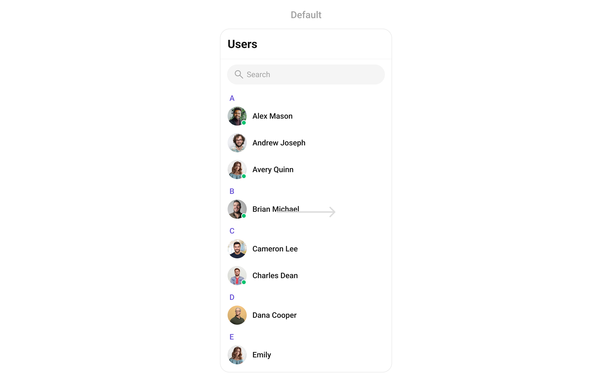
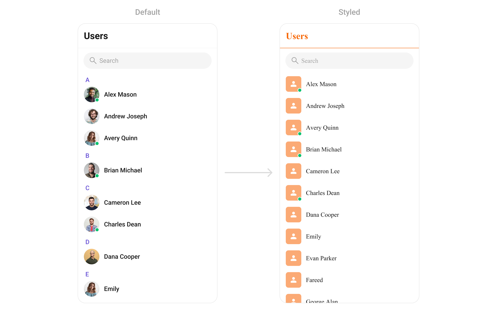
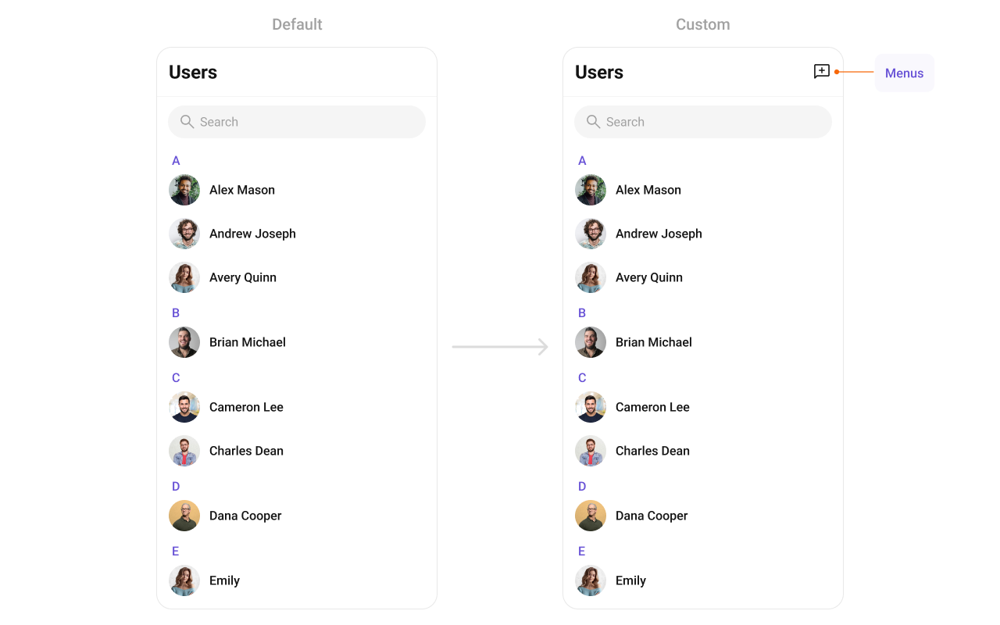

import Tabs from '@theme/Tabs';
import TabItem from '@theme/TabItem';

## Overview

The `CometChatUsers` is a [Widget](/ui-kit/flutter/components-overview#components), showcasing an accessible list of all available users. It provides an integral search functionality, allowing you to locate any specific user swiftly and easily. For each user listed, the widget displays the user's name by default, in conjunction with their avatar when available. Furthermore, it includes a status indicator, visually informing you whether a user is currently online or offline.



The `CometChatUsers` widget is composed of the following Base Widgets:

| Widgets                               | Description                                                                                                          |
| ------------------------------------- | -------------------------------------------------------------------------------------------------------------------- |
| [ListBase](/ui-kit/flutter/list-base) | a reusable container widget having title, search box, customisable background and a List View                        |
| [ListItem](/ui-kit/flutter/list-item) | a widget that renders data obtained from a User object on a Tile having a title, subtitle, leading and trailing view |

## Usage

### Integration

As `CometChatUsers` is a custom **widget**, it can be launched directly by user actions such as button clicks or other interactions. It's also possible to integrate it into a **tab widget**. `CometChatUsers` offers several parameters and methods for UI customization.

You can launch `CometChatUsers` directly using `Navigator.push`, or you can define it as a widget within the `build` method of your `State` class.

##### 1. Using Navigator to Launch `CometChatUsers`

<Tabs>

<TabItem value="Dart" label="Dart">

```dart
Navigator.push(context, MaterialPageRoute(builder: (context) => const CometChatUsers()));
```

</TabItem>

</Tabs>

##### 2. Embedding `CometChatUsers` as a Widget in the build Method

<Tabs>

<TabItem value="Dart" label="Dart">

```dart
import 'package:cometchat_chat_uikit/cometchat_chat_uikit.dart';
import 'package:flutter/material.dart';

class Users extends StatefulWidget {
  const Users({super.key});

  @override
  State<Users> createState() => _UsersState();
}

class _UsersState extends State<Users> {

  @override
  Widget build(BuildContext context) {
    return const Scaffold(
        body: SafeArea(
            child: CometChatUsers()
        )
    );
  }
}
```

</TabItem>

</Tabs>

---

### Actions

[Actions](/ui-kit/flutter/components-overview#actions) dictate how a widget functions. They are divided into two types: Predefined and User-defined. You can override either type, allowing you to tailor the behavior of the widget to fit your specific needs.

##### 1. onSelection

When the `onSelection` event is triggered, it furnishes the list of selected users. This event can be invoked by any button or action within the interface. You have the flexibility to implement custom actions or behaviors based on the selected users.

This action does not come with any predefined behavior. However, you have the flexibility to override this event and tailor it to suit your needs using the following code snippet.

<Tabs>

<TabItem value="Dart" label="Dart">

```dart
CometChatUsers(
  selectionMode: SelectionMode.multiple,
  activateSelection: ActivateSelection.onClick,
  onSelection: (list, context) {
    //TODO: This action will trigger the end of selection.
  },
)
```

</TabItem>

</Tabs>

---

##### 2. onItemTap

The `onItemTap` method is used to override the onClick behavior in `CometChatUsers`.
This action does not come with any predefined behavior. However, you have the flexibility to override this event and tailor it to suit your needs using the following code snippet.

<Tabs>

<TabItem value="Dart" label="Dart">

```dart
CometChatUsers(
  onItemTap: (context, user) {
    // TODO("Not yet implemented")
  },
)
```

</TabItem>

</Tabs>

---

##### 3. onBack

This method allows users to override the onBack Pressed behavior in `CometChatUsers` by utilizing the `onBack` , providing customization options for handling the back action.

By default, this action has a predefined behavior: it simply dismisses the current widget.
However, the flexibility of CometChat UI Kit allows you to override this standard behavior according to your application's specific requirements. You can define a custom action that will be performed instead when the back button is pressed.

<Tabs>

<TabItem value="Dart" label="Dart">

```dart
CometChatUsers(
  onBack: () {
    // TODO("Not yet implemented")
  },
)
```

</TabItem>

</Tabs>

---

##### 4. onError

This method `onError`, allows users to override error handling within `CometChatUsers`, providing greater control over error responses and actions.

<Tabs>

<TabItem value="Dart" label="Dart">

```dart
CometChatUsers(
  onError: (e) {
    // TODO("Not yet implemented")
  },
)
```

</TabItem>

</Tabs>

---

##### 5. onItemLongPress

This method `onItemLongPress`, empowers users to customize long-click actions within `CometChatUsers`, offering enhanced functionality and interaction possibilities.

<Tabs>

<TabItem value="Dart" label="Dart">

```dart
CometChatUsers(
  onItemLongPress: (context, user) {
    // TODO("Not yet implemented")
  },
)
```

</TabItem>

</Tabs>

---

### Filters

**Filters** allow you to customize the data displayed in a list within a Widget. You can filter the list based on your specific criteria, allowing for a more customized. Filters can be applied using RequestBuilders of Chat SDK.

##### 1. UsersRequestBuilder

The [UsersRequestBuilder](/sdk/flutter/retrieve-users) enables you to filter and customize the user list based on available parameters in UsersRequestBuilder. This feature allows you to create more specific and targeted queries when fetching users. The following are the parameters available in [UsersRequestBuilder](/sdk/flutter/retrieve-users)

<Tabs>

<TabItem value="Dart" label="Dart">

```dart
CometChatUsers(
    usersRequestBuilder: UsersRequestBuilder()
        ..limit = 10
)
```

</TabItem>

</Tabs>

---

### Events

[Events](/ui-kit/flutter/components-overview#events) are emitted by a `CometChatUsers` Widget. By using event you can extend existing functionality. Being global events, they can be applied in Multiple Locations and are capable of being Added or Removed.

To handle events supported by Users you have to add corresponding listeners by using `CometChatUserEvents`

| Events          | Description                                                           |
| --------------- | --------------------------------------------------------------------- |
| ccUserBlocked   | This will get triggered when the logged in user blocks another user   |
| ccUserUnblocked | This will get triggered when the logged in user unblocks another user |

<Tabs>

<TabItem value="Dart" label="Dart">

```dart
import 'package:cometchat_chat_uikit/cometchat_chat_uikit.dart';
import 'package:flutter/material.dart';

class YourScreen extends StatefulWidget {
  const YourScreen({super.key});

  @override
  State<YourScreen> createState() => _YourScreenState();
}

class _YourScreenState extends State<YourScreen> with CometChatUserEventListener {

  @override
  void initState() {
    super.initState();
    CometChatUserEvents.addUsersListener("listenerId", this);
  }

  @override
  void dispose(){
    super.dispose();
    CometChatUserEvents.removeUsersListener("listenerId");
  }

  @override
  void ccUserBlocked(User user) {
    // TODO
  }

  @override
  void ccUserUnblocked(User user) {
    // TODO
  }

  @override
  Widget build(BuildContext context) {
    return const Placeholder();
  }

}
```

</TabItem>

</Tabs>

---

## Customization

To fit your app's design requirements, you can customize the appearance of the `CometChatUsers` widget. We provide exposed methods that allow you to modify the experience and behavior according to your specific needs.

### Style

You can set the `CometChatUsersStyle` to the `CometChatUsers` widget to customize the styling.

<Tabs>

<TabItem value="Dart" label="Dart">

```dart
CometChatUsers(
  usersStyle: CometChatUsersStyle(
    avatarStyle: CometChatAvatarStyle(
    borderRadius: BorderRadius.circular(8),
    backgroundColor: Color(0xFFFBAA75),
    ),
    titleTextColor: Color(0xFFF76808),
    separatorColor: Color(0xFFF76808),
  ),
)
```

</TabItem>

</Tabs>




---

### Functionality

These are a set of small functional customizations that allow you to fine-tune the overall experience of the widget. With these, you can change text, set custom icons, and toggle the visibility of UI elements.


<Tabs>

<TabItem value="Dart" label="Dart">

```dart
CometChatUsers(
  title: "Your Title",
  backButton: Icon(Icons.add_alert, color: Color(0xFF6851D6)),
  searchPlaceholder: "Search Users",
)
```

</TabItem>

</Tabs>


List of properties exposed by `CometChatUsers`

| Property               | Data Type | Description                                                              |
| ---------------------- | --------- | ------------------------------------------------------------------------ |
| `hideSeparator`        | `bool`    | Flag indicating whether to hide separators between list items.           |
| `theme`                | `Theme?`  | Theme object for customizing the appearance of the widget.               |
| `searchPlaceholder`    | `String?` | Placeholder text for the search input box.                               |
| `backButton`           | `Widget?` | Widget for the back button in the app bar.                               |
| `showBackButton`       | `bool`    | Flag indicating whether to show the back button in the app bar.          |
| `searchBoxIcon`        | `Widget?` | Widget for the search box icon.                                          |
| `hideSearch`           | `bool`    | Flag indicating whether to hide the search input box.                    |
| `title`                | `String?` | Title of the widget or widget.                                           |
| `errorStateText`       | `String?` | Text to display in the error state view.                                 |
| `emptyStateText`       | `String?` | Text to display in the empty state view.                                 |
| `hideError`            | `bool`    | Flag indicating whether to hide the error state view.                    |
| `hideSectionSeparator` | `bool`    | Flag indicating whether to hide separators between sections in the list. |
| `disableUsersPresence` | `bool`    | Flag indicating whether to disable users' presence status indicators.    |
| `selectionIcon`        | `Widget?` | Widget for displaying the selection icon in the app bar.                 |
| `submitIcon`           | `Widget?` | Widget for displaying the submit icon in the app bar.                    |
| `hideAppbar`           | `bool`    | Flag indicating whether to hide the app bar.                             |

---

### Advance

For advanced-level customization, you can set custom views to the widget. This lets you tailor each aspect of the widget to fit your exact needs and application aesthetics. You can create and define your own widget and then incorporate those into the widget.

---

#### ListItemView

With this function, you can assign a custom ListItem to the `CometChatUsers` Widget.

<Tabs>

<TabItem value="Dart" label="Dart">

```dart
CometChatUsers(
  listItemView: (user) {
    return Placeholder();
  },
)
```

</TabItem>

</Tabs>


**Example**

Here is the complete example for reference:

<Tabs>

<TabItem value="Dart" label="Dart">

```dart title="custom_list_item.dart"
 Widget getCustomUserListItem(User user) {
    return CometChatListItem(
      id: user.uid,
      avatarName: user.name,
      avatarURL: user.avatar,
      avatarHeight: 40,
      avatarWidth: 40,
      title: user.name,
      key: UniqueKey(),
      statusIndicatorStyle: CometChatStatusIndicatorStyle(
        border: Border.all(
          width: 2,
          color: Color(0xFFFFFFFF),
        ),
        backgroundColor: Color(0xFF56E8A7),
      ),
      hideSeparator: true,
      style: ListItemStyle(
        background: user.status == CometChatUserStatus.online
            ? const Color(0xFFE6F4ED)
            : Colors.transparent,
        titleStyle: TextStyle(
          overflow: TextOverflow.ellipsis,
          fontSize: 16,
          fontWeight: FontWeight.w500,
          color: Color(0xFF141414),
        ),
        padding: EdgeInsets.only(
          left: 16,
          right: 16,
          top: 8,
          bottom: 8,
        ),
      ),
    );
  }
```

</TabItem>

</Tabs>

<Tabs>

<TabItem value="Dart" label="Dart">

```dart title="main.dart"
CometChatUsers(
  listItemView: (user) {
      return getCustomUserListItem(user);
  },
)
```

</TabItem>

</Tabs>

---

#### SubtitleView

You can customize the subtitle view for each item to meet your specific preferences and needs.

<Tabs>

<TabItem value="Dart" label="Dart">

```dart
CometChatUsers(
  subtitleView: (context, user) {
              String subtitle = "";

                final dateTime = user.lastActiveAt ?? DateTime.now();
                subtitle = "Last Active at ${DateFormat('dd/MM/yyyy, HH:mm:ss').format(dateTime)}";

              return Text(subtitle,
                style: TextStyle(
                  color: Color(0xFF727272),
                  fontSize: 14,
                  fontWeight: FontWeight.w400,
                ),
              );
    },
)
```

</TabItem>

</Tabs>


---

#### AppBarOptions

You can set the Custom AppBarOptions to the Conversations widget.

<Tabs>

<TabItem value="Dart" label="Dart">

```dart
CometChatUsers(
  appBarOptions: (context) => [
              IconButton(
                onPressed: () {},
                icon: Icon(
                  Icons.add_comment_outlined,
                  color: Color(0xFF141414),
                ),
              ),
            ],
)
```

</TabItem>

</Tabs>



---
