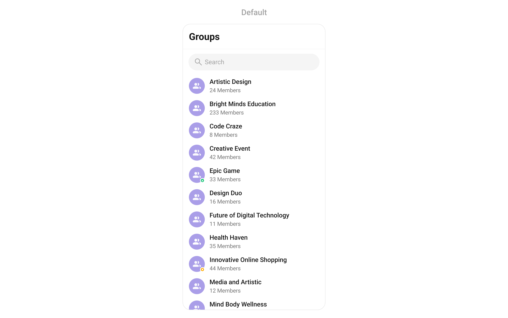
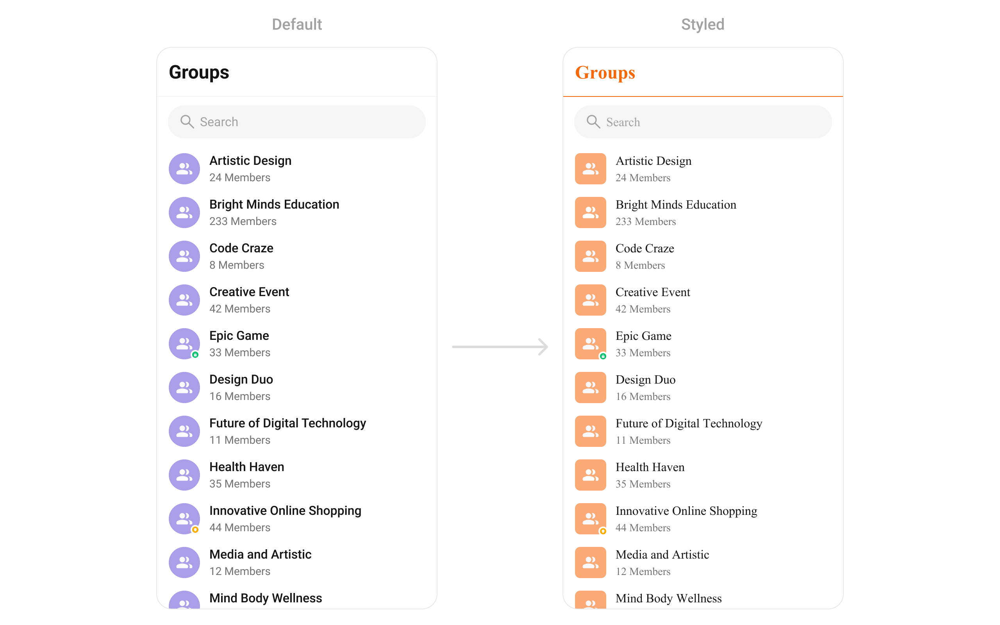
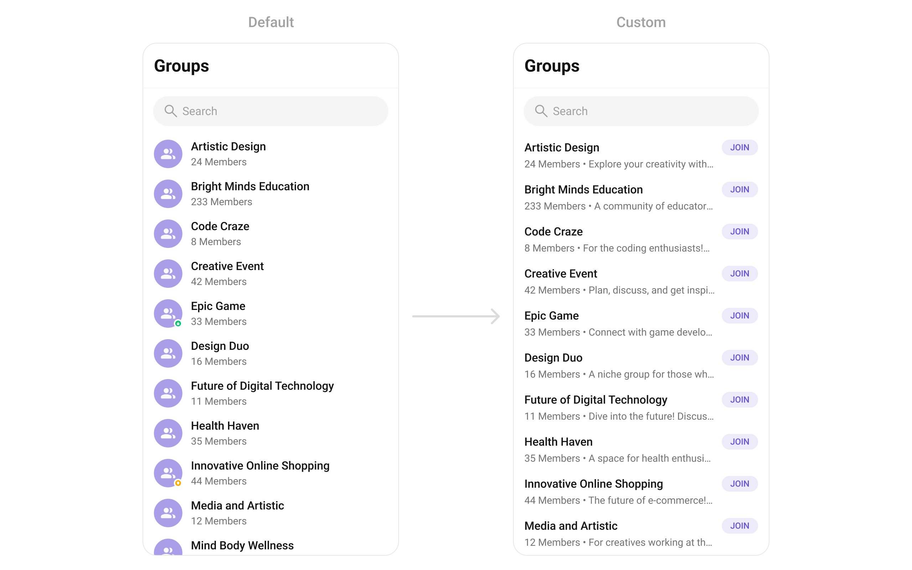
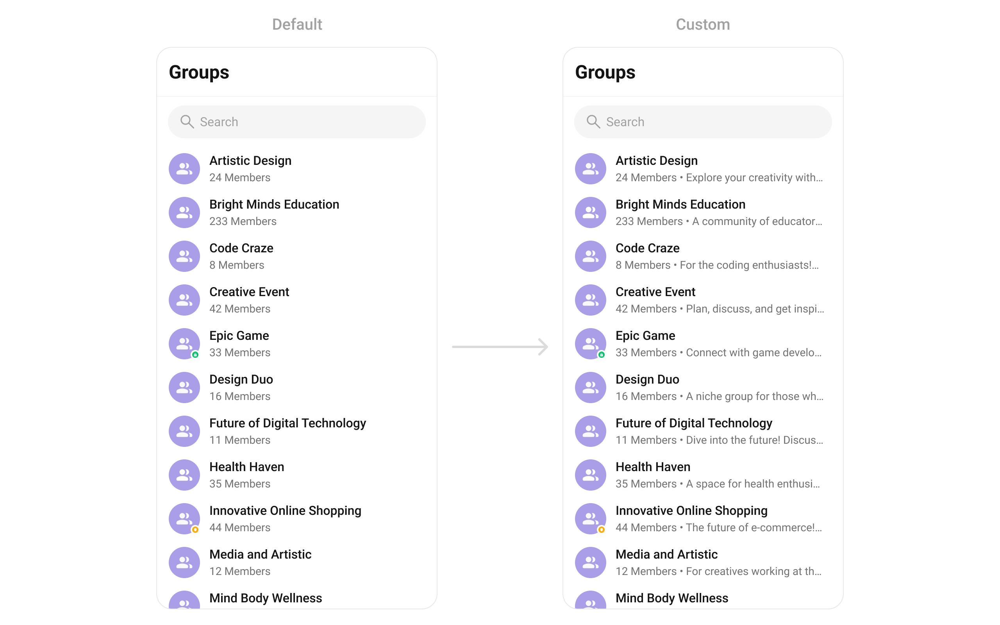
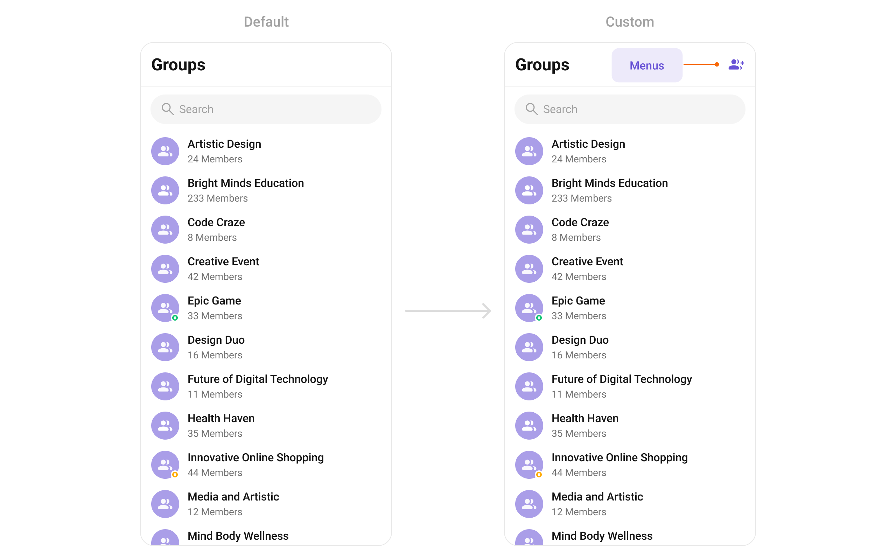

import Tabs from '@theme/Tabs';
import TabItem from '@theme/TabItem';
import { Tooltip } from 'react-tooltip'
import 'react-tooltip/dist/react-tooltip.css'

<Tooltip id="my-tooltip-html-prop" html="Not available in Group Members Configuration object"/>

## Overview

`CometChatGroups` functions as a standalone [Widget](/ui-kit/flutter/components-overview#components) designed to create a screen displaying a list of groups, with the added functionality of enabling users to search for specific groups. Acting as a container widget, `CometChatGroups` encapsulates and formats the `CometChatListBase` and `CometChatGroupList` widgets without introducing any additional behavior of its own.



The `CometChatGroups` widget is composed of the following BaseWidget:

| Widgets                                        | Description                                                                                                                                                                                |
| ---------------------------------------------- | ------------------------------------------------------------------------------------------------------------------------------------------------------------------------------------------ |
| [CometChatListBase](/ui-kit/flutter/list-base) | `CometChatListBase` serves as a container widget equipped with a title (navigationBar), search functionality (search-bar), background settings, and a container for embedding a list view. |
| [CometChatListItem](/ui-kit/flutter/list-item) | This widget renders information extracted from a `Group` object onto a tile, featuring a title, subtitle, leading view, and trailing view.                                                 |

## Usage

### Integration

As `CometChatGroups` is a custom **widget**, it can be launched directly by user actions such as button clicks or other interactions.

You can launch `CometChatGroups` directly using `Navigator.push`, or you can define it as a widget within the `build` method of your `State` class.

##### 1. Using Navigator to Launch `CometChatGroups`

<Tabs>

<TabItem value="Dart" label="Dart">

```dart
Navigator.push(context, MaterialPageRoute(builder: (context) => const CometChatGroups()));
```

</TabItem>

</Tabs>

##### 2. Embedding `CometChatGroups` as a Widget in the build Method

<Tabs>

<TabItem value="Dart" label="Dart">

```dart
import 'package:cometchat_chat_uikit/cometchat_chat_uikit.dart';
import 'package:flutter/material.dart';

class Groups extends StatefulWidget {
  const Groups({super.key});

  @override
  State<Groups> createState() => _GroupsState();
}

class _GroupsState extends State<Groups> {

  @override
  Widget build(BuildContext context) {
    return const Scaffold(
        body: SafeArea(
            child: CometChatGroups()
        )
    );
  }
}
```

</TabItem>

</Tabs>

---

### Actions

[Actions](/ui-kit/flutter/components-overview#actions) dictate how a widget functions. They are divided into two types: Predefined and User-defined. You can override either type, allowing you to tailor the behavior of the widget to fit your specific needs.

##### 1. onItemTap

This method proves valuable when users seek to override onItemTap functionality within CometChatGroups, empowering them with greater control and customization options.

The `onItemTap` action doesn't have a predefined behavior. You can override this action using the following code snippet.

<Tabs>

<TabItem value="Dart" label="Dart">

```dart
CometChatGroups(
  onItemTap: (context, group) {
    // TODO("Not yet implemented")
  },
)
```

</TabItem>

</Tabs>

---

##### 2. onBack

Enhance your application's functionality by leveraging the `onBack` feature. This capability allows you to customize the behavior associated with navigating back within your app. Utilize the provided code snippet to override default behaviors and tailor the user experience according to your specific requirements.

<Tabs>

<TabItem value="Dart" label="Dart">

```dart
CometChatGroups(
  onBack: () {
    // TODO("Not yet implemented")
  },
)
```

</TabItem>

</Tabs>

---

##### 3. onError

You can customize this behavior by using the provided code snippet to override the `onError` and improve error handling.

<Tabs>

<TabItem value="Dart" label="Dart">

```dart
CometChatGroups(
  onError: (e) {
    // TODO("Not yet implemented")
  },
)
```

</TabItem>

</Tabs>

---

##### 4. onItemLongPress

This method becomes invaluable when users seek to override long-click functionality within CometChatGroups, offering them enhanced control and flexibility in their interactions.

The `onItemLongPress` action doesn't have a predefined behavior. You can override this action using the following code snippet.

<Tabs>

<TabItem value="Dart" label="Dart">

```dart
CometChatGroups(
  onItemLongPress: (context, group) {
    // TODO("Not yet implemented")
  },
)
```

</TabItem>

</Tabs>

---

##### 5. onSelection

When the `onSelection` event is triggered, it furnishes the list of selected groups. This event can be invoked by any button or action within the interface. You have the flexibility to implement custom actions or behaviors based on the selected groups.

This action does not come with any predefined behavior. However, you have the flexibility to override this event and tailor it to suit your needs using the following code snippet.

<Tabs>

<TabItem value="Dart" label="Dart">

```dart
CometChatGroups(
  selectionMode: SelectionMode.multiple,
  activateSelection: ActivateSelection.onClick,
  onSelection: (groupList) {
    // TODO("Not yet implemented")
  }
)
```

</TabItem>

</Tabs>

---

### Filters

**Filters** allow you to customize the data displayed in a list within a Component. You can filter the list based on your specific criteria, allowing for a more customized. Filters can be applied using RequestBuilders of Chat SDK.

##### 1. GroupsRequestBuilder

The [GroupsRequestBuilder](/sdk/flutter/retrieve-groups) enables you to filter and customize the group list based on available parameters in GroupsRequestBuilder. This feature allows you to create more specific and targeted queries when fetching groups. The following are the parameters available in [GroupsRequestBuilder](/sdk/flutter/retrieve-groups)

<Tabs>

<TabItem value="Dart" label="Dart">

```dart
CometChatGroups(
    groupsRequestBuilder: GroupsRequestBuilder()
        ..limit = 10
)
```

</TabItem>

</Tabs>

| Property           | Description                                               | Code                    |
| ------------------ | --------------------------------------------------------- | ----------------------- |
| **Joined Only**    | Flag to include only joined groups. Defaults to `false`.  | `joinedOnly: bool`      |
| **Limit**          | Number of results to limit the query.                     | `limit: int`            |
| **Search Keyword** | Keyword for searching groups.                             | `searchKeyword: String` |
| **Tags**           | Tags for filtering groups.                                | `tags: List<String>`    |
| **With Tags**      | Flag to include tags in the results. Defaults to `false`. | `withTags: bool`        |

---

### Events

[Events](/ui-kit/flutter/components-overview#events) are emitted by a `CometChatGroups` Widget. By using event you can extend existing functionality. Being global events, they can be applied in Multiple Locations and are capable of being Added or Removed.

The list of events emitted by the `CometChatGroups` widget is as follows.

| Events                      | Description                                                                                              |
| --------------------------- | -------------------------------------------------------------------------------------------------------- |
| `ccGroupCreated`            | This gets triggered when the logged in user creates a group.                                             |
| `ccGroupDeleted`            | This gets triggered when the logged in user deletes a group.                                             |
| `ccGroupLeft`               | This gets triggered when the logged in user leaves a group.                                              |
| `ccGroupMemberScopeChanged` | This gets triggered when the logged in user changes the scope of another group member.                   |
| `ccGroupMemberBanned`       | This gets triggered when the logged in user bans a group member from the group.                          |
| `ccGroupMemberKicked`       | This gets triggered when the logged in user kicks another group member from the group.                   |
| `ccGroupMemberUnbanned`     | This gets triggered when the logged in user unbans a user banned from the group.                         |
| `ccGroupMemberJoined`       | This gets triggered when the logged in user joins a group.                                               |
| `ccGroupMemberAdded`        | This gets triggered when the logged in user adds new members to the group.                               |
| `ccOwnershipChanged`        | This gets triggered when the logged in user transfers the ownership of their group to some other member. |

<Tabs>

<TabItem value="Dart" label="Dart">

```dart title="your_screen.dart"
import 'package:cometchat_chat_uikit/cometchat_chat_uikit.dart';
import 'package:cometchat_sdk/models/action.dart' as cc;
import 'package:flutter/material.dart';

class YourScreen extends StatefulWidget {
  const YourScreen({super.key});

  @override
  State<YourScreen> createState() => _YourScreenState();
}

class _YourScreenState extends State<YourScreen> with CometChatGroupEventListener {

  @override
  void initState() {
    super.initState();
    CometChatGroupEvents.addGroupsListener("listenerId", this); // Add the listener
  }

  @override
  void dispose(){
    super.dispose();
    CometChatGroupEvents.removeGroupsListener("listenerId"); // Remove the listener
  }


  @override
  void ccGroupCreated(Group group) {
    // TODO("Not yet implemented")
  }

  @override
  void ccGroupDeleted(Group group) {
    // TODO("Not yet implemented")
  }

  @override
  void ccGroupLeft(cc.Action message, User leftUser, Group leftGroup) {
    // TODO("Not yet implemented")
  }

  @override
  void ccGroupMemberScopeChanged(cc.Action message, User updatedUser, String scopeChangedTo, String scopeChangedFrom, Group group) {
    // TODO("Not yet implemented")
  }

  @override
  void ccGroupMemberBanned(cc.Action message, User bannedUser, User bannedBy, Group bannedFrom) {
    // TODO("Not yet implemented")
  }

  @override
  void ccGroupMemberKicked(cc.Action message, User kickedUser, User kickedBy, Group kickedFrom) {
    // TODO("Not yet implemented")
  }

  @override
  void ccGroupMemberUnbanned(cc.Action message, User unbannedUser, User unbannedBy, Group unbannedFrom) {
    // TODO("Not yet implemented")
  }

  @override
  void ccGroupMemberJoined(User joinedUser, Group joinedGroup) {
    // TODO("Not yet implemented")
  }

  @override
  void ccGroupMemberAdded(List<cc.Action> messages, List<User> usersAdded, Group groupAddedIn, User addedBy) {
    // TODO("Not yet implemented")
  }

  @override
  void ccOwnershipChanged(Group group, GroupMember newOwner) {
    // TODO("Not yet implemented")
  }

  @override
  Widget build(BuildContext context) {
    return const Placeholder();
  }

}
```

</TabItem>

</Tabs>

---

## Customization

To fit your app's design requirements, you can customize the appearance of the groups widget. We provide exposed methods that allow you to modify the experience and behavior according to your specific needs.

### Style

Enhance your `CometChatGroups` Widget by setting the `CometChatGroupsStyle` to customize its appearance.

<Tabs>

<TabItem value="Dart" label="Dart">

```dart
CometChatGroups(
  groupsStyle: CometChatGroupsStyle(
    avatarStyle: CometChatAvatarStyle(
        borderRadius: BorderRadius.circular(8),
        backgroundColor: Color(0xFFFBAA75),
    ),
    titleTextColor: Color(0xFFF76808),
    separatorColor: Color(0xFFF76808),
  ),
)
```

</TabItem>

</Tabs>




---

### Functionality

These are a set of small functional customizations that allow you to fine-tune the overall experience of the widget. With these, you can change text, set custom icons, and toggle the visibility of UI elements.


<Tabs>

<TabItem value="Dart" label="Dart">

```dart
CometChatGroups(
  title: "Your Title",
  backButton: Icon(Icons.add_alert, color: Color(0xFF6851D6)),
  searchPlaceholder: "Search Group",
)
```

</TabItem>

</Tabs>


List of properties exposed by `CometChatGroups`

| Property                | Description                                                                          | Code                                    |
| ----------------------- | ------------------------------------------------------------------------------------ | --------------------------------------- |
| **Activate Selection**  | Lets the widget know if groups are allowed to be selected                            | `activateSelection: ActivateSelection?` |
| **Back Button**         | Back button                                                                          | `backButton: Widget?`                   |
| **Controller**          | Sets controller for the list                                                         | `controller: ScrollController?`         |
| **Controller Tag**      | Group tag to create from, if this is passed it's parent responsibility to close this | `controllerTag: String?`                |
| **Empty State Text**    | Text to be displayed when the list is empty                                          | `emptyStateText: String?`               |
| **Error State Text**    | Text to be displayed when error occurs                                               | `errorStateText: String?`               |
| **Hide Appbar**         | Toggle visibility for app bar                                                        | `hideAppbar: bool?`                     |
| **Hide Error**          | Toggle visibility of error dialog                                                    | `hideError: bool?`                      |
| **Hide Search**         | Switch on/off search input                                                           | `hideSearch: bool`                      |
| **Hide Separator**      |                                                                                      | `hideSeparator: bool`                   |
| **Password Group Icon** | Sets icon in status indicator for password group                                     | `passwordGroupIcon: Widget?`            |
| **Private Group Icon**  | Sets icon in status indicator for private group                                      | `privateGroupIcon: Widget?`             |
| **Search Box Icon**     | Search icon                                                                          | `searchBoxIcon: Widget?`                |
| **Search Placeholder**  | Placeholder text of search input                                                     | `searchPlaceholder: String?`            |
| **Selection Icon**      | Change selection icon                                                                | `selectionIcon: Widget?`                |
| **Selection Mode**      | Specifies mode groups module is opening in                                           | `selectionMode: SelectionMode?`         |
| **Submit Icon**         | Override the default submit icon                                                     | `submitIcon: Widget?`                   |
| **Theme**               | Can pass custom theme                                                                | `theme: CometChatTheme?`                |
| **Title**               | Sets title for the list                                                              | `title: String?`                        |

---

### Advance

For advanced-level customization, you can set custom views to the widget. This lets you tailor each aspect of the widget to fit your exact needs and application aesthetics. You can create and define your own widget and then incorporate those into the widget.

---

#### ListItemView

With this function, you can assign a custom ListItem to the `CometChatGroups` Widget.

<Tabs>

<TabItem value="Dart" label="Dart">

```dart
CometChatGroups(
  listItemView: (group) {
    return Placeholder(); // Replace this placeholder with your custom widget.
  },
)
```

</TabItem>

</Tabs>

**Example**

Here is the complete example for reference:


<Tabs>

<TabItem value="Dart" label="Dart">

```dart
  CometChatGroups(
    listItemView: (group) {
      return ListTile(
        title: Text(
          group.name,
          style: TextStyle(
            fontSize: 16,
            fontWeight: FontWeight.w500,
          ),
        ),
        subtitle: Text(
          "${group.membersCount} Members • ${group.description}",
          overflow: TextOverflow.ellipsis,
          style: TextStyle(
            fontSize: 14,
            fontWeight: FontWeight.w400,
            color: Color(0XFF727272),
          ),
        ),
        trailing: ElevatedButton(
            onPressed: () {
              CometChat.joinGroup(
                group.guid,
                group.type,
                onSuccess: (group) {
                  //handle success, for example, show a toast or navigate to a new screen
                },
                onError: (excep) {
                  //handle exception, for example, show an error toast or dialog
                },
              );
            },
            child: Text(
              "JOIN",
              style: TextStyle(
                  color: Color(0xFF6852D6),
                  fontSize: 12,
                  fontWeight: FontWeight.w500,
                  letterSpacing: 0),
            ),
            style: ElevatedButton.styleFrom(
              backgroundColor: Color(0xFFEDEAFA),
              elevation: 0,
              padding: EdgeInsets.symmetric(horizontal: 12, vertical: 4),
              visualDensity: VisualDensity.compact,
              shape: RoundedRectangleBorder(
                borderRadius: BorderRadius.circular(1000),
              ),
            )),
      );
    },
  );
```

</TabItem>

</Tabs>



---

#### SubtitleView

You can customize the subtitle view for each item to meet your specific preferences and needs.

<Tabs>

<TabItem value="Dart" label="Dart">

```dart
CometChatGroups(
  subtitleView: (context, group) {
     return Text(
    "${group.membersCount} Members • ${group.description}",
    overflow: TextOverflow.ellipsis,
    style: TextStyle(
      fontSize: 14,
      fontWeight: FontWeight.w400,
      color: Color(0XFF727272),
    ),
  );
  },
)
```

</TabItem>

</Tabs>



---

#### AppBarOptions

You can set the Custom `appBarOptions` to the `CometChatGroups` widget.

<Tabs>

<TabItem value="Dart" label="Dart">

```dart
CometChatGroups(
  appBarOptions: (context) {
    return [
      IconButton(
            onPressed: () {},
            icon: Icon(
                  Icons.group_add,
                  color: Color(0xFF6852D6),
            ),
        ),
    ];
  },
)
```

</TabItem>

</Tabs>



---

