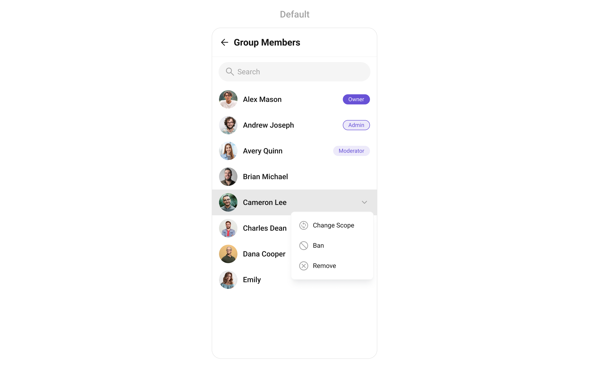
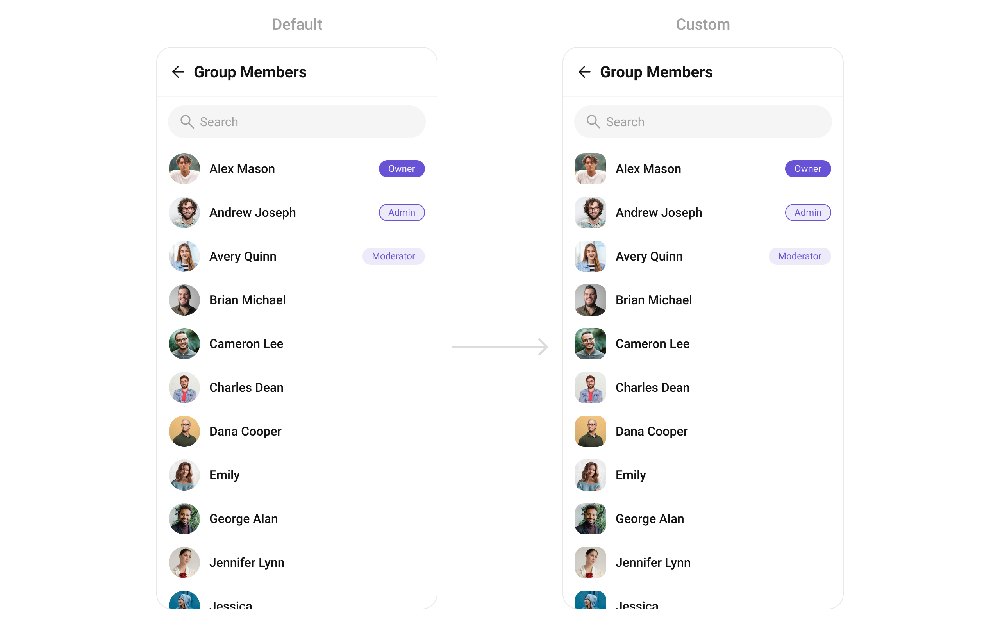
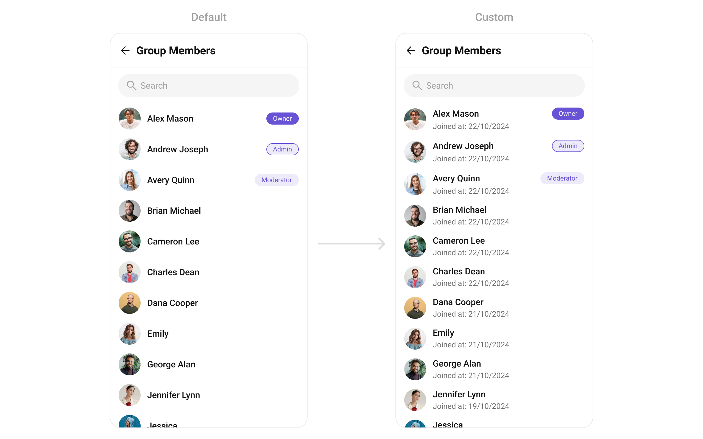
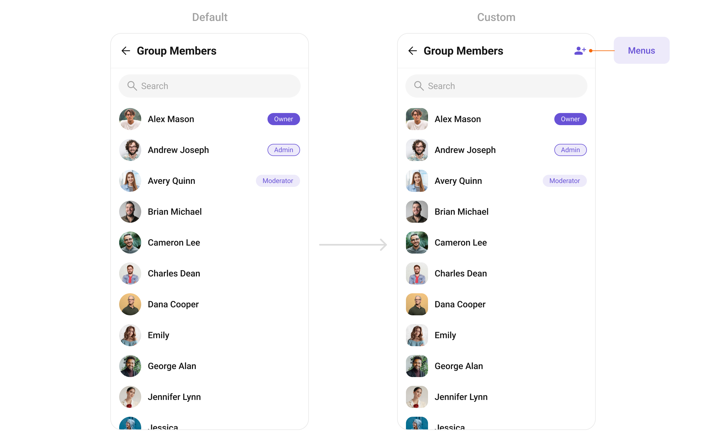
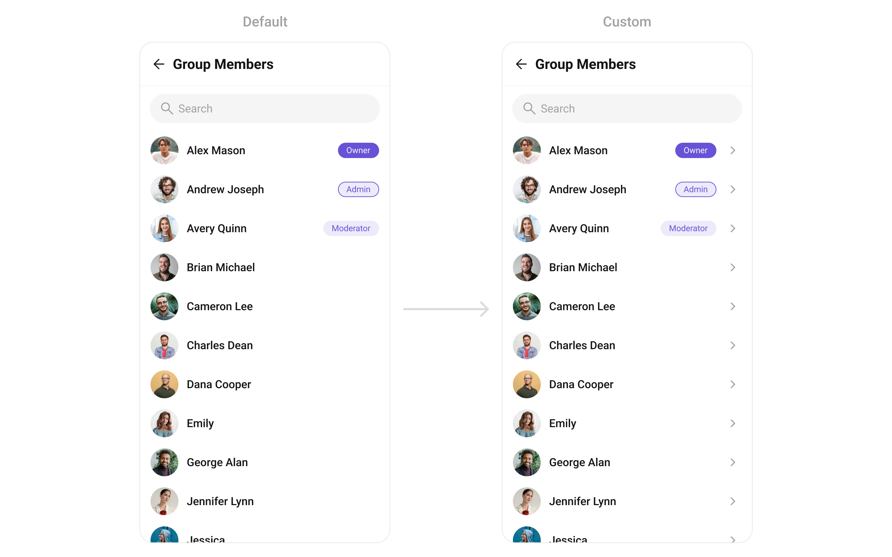

import Tabs from '@theme/Tabs';
import TabItem from '@theme/TabItem';
import { Tooltip } from 'react-tooltip'
import 'react-tooltip/dist/react-tooltip.css'

<Tooltip id="my-tooltip-html-prop" html="Not available in Group Members Configuration object"/>

## Overview

`CometChatGroupMembers` is a versatile [Widget](/ui-kit/flutter/components-overview#components) designed to showcase all users who are either added to or invited to a group, thereby enabling them to participate in group discussions, access shared content, and engage in collaborative activities. `CometChatGroupMembers` have the capability to communicate in real-time through messaging, voice and video calls, and various other interactions. Additionally, they can interact with each other, share files, and join calls based on the permissions established by the group administrator or owner.



The `CometChatGroupMembers` widget is composed of the following BaseWidgets:

| Widgets                                        | Description                                                                                                                                                                                                                   |
| ---------------------------------------------- | ----------------------------------------------------------------------------------------------------------------------------------------------------------------------------------------------------------------------------- |
| [CometChatListBase](/ui-kit/flutter/list-base) | `CometChatListBase` serves as a container widget equipped with a title (navigationBar), search functionality (search-bar), background settings, and a container for embedding a list widget.                                  |
| [CometChatListItem](/ui-kit/flutter/list-item) | This widget renders information extracted from a `User` object onto a tile, featuring a title, subtitle, leading widget, and trailing widget. experience, facilitating seamless navigation and interaction within the widget. |

---

## Usage

### Integration

`CometChatGroupMembers` , as a Composite Widget, offers flexible integration options, allowing it to be launched directly via button clicks or any user-triggered action.

You can launch `CometChatGroupMembers` directly using `Navigator.push` , or you can define it as a widget within the `build` method of your `State` class.

##### 1. Using Navigator to Launch `CometChatGroupMembers`

<Tabs>

<TabItem value="Dart" label="Dart">

```dart
Navigator.push(context, MaterialPageRoute(builder: (context) => CometChatGroupMembers(group: Group(guid: "", name: "", type: "")))); // A group object is required to launch this widget.
```

</TabItem>

</Tabs>

##### 2. Embedding `CometChatGroupMembers` as a Widget in the build Method

<Tabs>

<TabItem value="Dart" label="Dart">

```dart
import 'package:cometchat_chat_uikit/cometchat_chat_uikit.dart';
import 'package:flutter/material.dart';

class GroupMembers extends StatefulWidget {
  const GroupMembers({super.key});

  @override
  State<GroupMembers> createState() => _GroupMembersState();
}

class _GroupMembersState extends State<GroupMembers> {
  @override
  Widget build(BuildContext context) {
    return Scaffold(
        body: SafeArea(
            child: CometChatGroupMembers(
              group: Group(guid: "", name: "", type: ""),
            ) // A group object is required to launch this widget.
        )
    );
  }
}
```

</TabItem>

</Tabs>

---

### Actions

[Actions](/ui-kit/flutter/components-overview#actions) dictate how a widget functions. They are divided into two types: Predefined and User-defined. You can override either type, allowing you to tailor the behavior of the widget to fit your specific needs.

##### 1. onItemTap

This method proves valuable when users seek to override onItemClick functionality within `CometChatGroupMembers` , empowering them with greater control and customization options.

The `onItemTap` action doesn't have a predefined behavior. You can override this action using the following code snippet.

<Tabs>

<TabItem value="Dart" label="Dart">

```dart
CometChatGroupMembers(
  group: Group(guid: "", name: "", type: ""), // A group object is required to launch this widget.
  onItemTap: (groupMember) {
    // TODO("Not yet implemented")
  },
)
```

</TabItem>

</Tabs>

---

##### 2. onItemLongPress

This method becomes invaluable when users seek to override long-click functionality within `CometChatGroupMembers` , offering them enhanced control and flexibility in their interactions.

The `onItemLongPress` action doesn't have a predefined behavior. You can override this action using the following code snippet.

<Tabs>

<TabItem value="Dart" label="Dart">

```dart
CometChatGroupMembers(
  group: Group(guid: "", name: "", type: ""), // A group object is required to launch this widget.
  onItemLongPress: (groupMember) {
    // TODO("Not yet implemented")
  },
)
```

</TabItem>

</Tabs>

---

##### 3. onBack

Enhance your application's functionality by leveraging the `onBack` feature. This capability allows you to customize the behavior associated with navigating back within your app. Utilize the provided code snippet to override default behaviors and tailor the user experience according to your specific requirements.

<Tabs>

<TabItem value="Dart" label="Dart">

```dart
CometChatGroupMembers(
  group: Group(guid: "", name: "", type: ""), // A group object is required to launch this widget.
  onBack: () {
    // TODO("Not yet implemented")
  },
)
```

</TabItem>

</Tabs>

---

##### 4. onError

You can customize this behavior by using the provided code snippet to override the `onError` and improve error handling.

<Tabs>

<TabItem value="Dart" label="Dart">

```dart
CometChatGroupMembers(
  group: Group(guid: "", name: "", type: ""), // A group object is required to launch this widget.
  onError: (e) {
    // TODO("Not yet implemented")
  },
)
```

</TabItem>

</Tabs>

---

##### 5. onSelection

When the `onSelection` event is triggered, it furnishes the list of selected members. This event can be invoked by any button or action within the interface. You have the flexibility to implement custom actions or behaviors based on the selected members.

This action does not come with any predefined behavior. However, you have the flexibility to override this event and tailor it to suit your needs using the following code snippet.

<Tabs>

<TabItem value="Dart" label="Dart">

```dart
CometChatGroupMembers(
  group: Group(guid: "", name: "", type: ""), // A group object is required to launch this widget.
  selectionMode: SelectionMode.multiple,
  activateSelection: ActivateSelection.onClick,
  onSelection: (groupMembersList) {
    // TODO("Not yet implemented")
  },
)
```

</TabItem>

</Tabs>

---

### Filters

**Filters** allow you to customize the data displayed in a list within a `Widget` . You can filter the list based on your specific criteria, allowing for a more customized. Filters can be applied using `RequestBuilders` of Chat SDK.

##### 1. GroupMembersRequestBuilder

| Property           | Description                                              | Code                     |
| ------------------ | -------------------------------------------------------- | ------------------------ |
| **GUID**           | Group ID for the group whose members are to be fetched.  | `guid: String`           |
| **Limit**          | Number of results to limit the query.                    | `limit: int?`            |
| **Search Keyword** | Keyword for searching members within the group.          | `searchKeyword: String?` |
| **Scopes**         | List of scopes for filtering members (e.g., moderators). | `scopes: List<String>?`  |

**Example**

In the example below, we are applying a filter to the Group List based on limit and scope.

<Tabs>

<TabItem value="Dart" label="Dart">

```dart
CometChatGroupMembers(
    group: Group(guid: "", name: "", type: ""), // A group object is required to launch this widget.
    groupMembersRequestBuilder: GroupMembersRequestBuilder("")
      ..limit = 10
)
```

</TabItem>

</Tabs>

##### 2. GroupMembersProtocol

The `GroupMembersProtocol` uses [GroupsRequestBuilder](/sdk/flutter/retrieve-groups) enables you to filter and customize the search list based on available parameters in GroupsRequestBuilder.

This feature allows you to keep uniformity between the displayed Group Members List and Searched Group Members List.

Here is the complete example for reference:

**Example**

<Tabs>

<TabItem value="Dart" label="Dart">

```dart title="custom_protocol_builder.dart"
import 'package:cometchat_chat_uikit/cometchat_chat_uikit.dart';

class CustomProtocolBuilder extends GroupMembersBuilderProtocol {
  const CustomProtocolBuilder(super.builder);

  @override
  GroupMembersRequest getRequest() {
      return requestBuilder.build();
  }

  @override
  GroupMembersRequest getSearchRequest(String val) {
      requestBuilder.searchKeyword = val;
      return requestBuilder.build();
  }
}
```

</TabItem>

</Tabs>

<Tabs>

<TabItem value="Dart" label="Dart">

```dart title="main.dart"
CometChatGroupMembers(
  group: Group(guid: "", name: "", type: ""), // A group object is required to launch this widget.
  groupMembersProtocol: CustomProtocolBuilder(GroupMembersRequestBuilder("")..searchKeyword = "searchKeyword"),
)
```

</TabItem>

</Tabs>

---

### Events

[Events](/ui-kit/flutter/components-overview#events) are emitted by a `Widget` . By using event you can extend existing functionality. Being global events, they can be applied in Multiple Locations and are capable of being Added or Removed.

Events emitted by the Join Group widget is as follows.

| Event                         | Description                                                       |
| ----------------------------- | ----------------------------------------------------------------- |
| **ccGroupMemberBanned**       | Triggers when the group member banned from the group successfully |
| **ccGroupMemberKicked**       | Triggers when the group member kicked from the group successfully |
| **ccGroupMemberScopeChanged** | Triggers when the group member scope is changed in the group      |

**Example**

<Tabs>

<TabItem value="Dart" label="Dart">

```dart title="your_screen.dart"
import 'package:cometchat_chat_uikit/cometchat_chat_uikit.dart';
import 'package:cometchat_sdk/models/action.dart' as cc;
import 'package:flutter/material.dart';

class YourScreen extends StatefulWidget {
  const YourScreen({super.key});

  @override
  State<YourScreen> createState() => _YourScreenState();
}

class _YourScreenState extends State<YourScreen> with CometChatGroupEventListener {

  @override
  void initState() {
    super.initState();
    CometChatGroupEvents.addGroupsListener("listenerId", this); // Add the listener
  }

  @override
  void dispose(){
    super.dispose();
    CometChatGroupEvents.removeGroupsListener("listenerId"); // Remove the listener
  }

  @override
  void ccGroupMemberScopeChanged(cc.Action message, User updatedUser, String scopeChangedTo, String scopeChangedFrom, Group group) {
    // TODO("Not yet implemented")
  }

  @override
  void ccGroupMemberBanned(cc.Action message, User bannedUser, User bannedBy, Group bannedFrom) {
    // TODO("Not yet implemented")
  }

  @override
  void ccGroupMemberKicked(cc.Action message, User kickedUser, User kickedBy, Group kickedFrom) {
    // TODO("Not yet implemented")
  }

  @override
  Widget build(BuildContext context) {
    return const Placeholder();
  }

}
```

</TabItem>

</Tabs>

---

## Customization

To fit your app's design requirements, you can customize the appearance of the Groups widget. We provide exposed methods that allow you to modify the experience and behavior according to your specific needs.

### Style

You can set the `CometChatGroupMembersStyle` to the `CometChatGroupMembers` Widget to customize the styling.

<Tabs>

<TabItem value="Dart" label="Dart">

```dart
CometChatGroupMembers(
  group: Group(guid: "", name: "", type: ""), // A group object is required to launch this widget.
  style: CometChatGroupMembersStyle(
    titleStyle: TextStyle(color: Color(0xFFF76808)),
    separatorColor:  Color(0xFFF76808),
    ownerMemberScopeBackgroundColor:  Color(0xFFF76808),
    adminMemberScopeBackgroundColor: Color(0xFFFEEDE1),
    adminMemberScopeBorder: Border.all(color: Color(0xFFF76808)),
    adminMemberScopeTextColor: Color(0xFFF76808),
    moderatorMemberScopeBackgroundColor: Color(0xFFFEEDE1),
    moderatorMemberScopeTextColor: Color(0xFFF76808),
    backIconColor: Color(0xFFF76808),
  ),
)
```

</TabItem>

</Tabs>


---

### Functionality

These are a set of small functional customizations that allow you to fine-tune the overall experience of the widget. With these, you can change text, set custom icons, and toggle the visibility of UI elements.


<Tabs>

<TabItem value="Dart" label="Dart">

```dart
CometChatGroupMembers(
  group: Group(guid: "", name: "", type: ""), // A group object is required to launch this widget.
  title: "Your Title",
  hideSeparator: true,
  hideSearch: true,
  showBackButton: false
)
```

</TabItem>

</Tabs>


List of properties exposed by `CometChatGroupMembers`

| Property                   | Description                                                                                              | Code                                          |
| -------------------------- | -------------------------------------------------------------------------------------------------------- | --------------------------------------------- |
| **Back Button**            | A custom widget to replace the default back button.                                                      | `backButton: Widget?`                         |
| **Hide Search**            | Hides the search bar for filtering group members (default: false).                                       | `hideSearch: bool` (default: false)           |
| **Hide Separator**         | Hides the separator between group members in the list.                                                   | `hideSeparator: bool`                         |
| **Search Box Icon**        | A custom icon to display in the search bar.                                                              | `searchBoxIcon: Widget?`                      |
| **Search Placeholder**     | Text displayed as a placeholder in the search bar.                                                       | `searchPlaceholder: String?`                  |
| **Selection Mode**         | Mode for selecting group members (e.g., single, multiple).                                               | `selectionMode: CometChatSelectionMode?`      |
| **Show Back Button**       | A boolean value indicating whether to show the back button (default: true).                              | `showBackButton: bool` (default: true)        |
| **Empty State Text**       | Text displayed when the group member list is empty.                                                      | `emptyStateText: String?`                     |
| **Error State Text**       | Text displayed when an error occurs while fetching group members.                                        | `errorStateText: String?`                     |
| **Hide Error**             | Hides the error state view when an error occurs.                                                         | `hideError: bool`                             |
| **Title**                  | Title displayed at the top of the widget.                                                                | `title: String?`                              |
| **Disable Users Presence** | A boolean value indicating whether to disable displaying the presence of group members (default: false). | `disableUsersPresence: bool` (default: false) |
| **Select Icon**            | A custom icon to display for the selection mode.                                                         | `this.selectIcon: Widget?`                    |
| **Submit Icon**            | A custom icon to display for the submit button.                                                          | `this.submitIcon: Widget?`                    |

---

### Advanced

For advanced-level customization, you can set custom widgets to the widget. This lets you tailor each aspect of the widget to fit your exact needs and application aesthetics. You can create and define your own widgets and then incorporate those into the widget.

The `CometChatGroupMembers` widget does not provide additional functionalities beyond this level of customization.

#### ListItemView

With this function, you can assign a custom ListItem to the `CometChatGroupMembers` Widget.

<Tabs>

<TabItem value="Dart" label="Dart">

```dart title="widget"
CometChatGroupMembers(
  group: Group(guid: "", name: "", type: ""), // A group object is required to launch this widget.
  listItemView: (groupMember) {
    return Placeholder(); // Replace this placeholder with your custom widget.
  },
)
```

</TabItem>

</Tabs>

Here is the complete example for reference:

**Example**

You can indeed create a custom widget named `custom_list_item.dart` for more complex or unique list items.

<Tabs>

<TabItem value="Dart" label="Dart">

```dart title="custom_list_item.dart"
   Widget _getTailView(GroupMember groupMember, Group group) {
    Color? backgroundColor;
    BoxBorder? border;
    String scope = groupMember.scope ?? GroupMemberScope.participant;
    Color? textColor;
    TextStyle? textStyle;

    if (groupMember.uid == group.owner) {
      scope = GroupMemberScope.owner;
      backgroundColor = Color(0xFF6852D6);
      textColor = Colors.white;
    } else if (scope == GroupMemberScope.admin) {
      backgroundColor = Color(0xFFEDEAFA);
      border = Border.all(color: Color(0xFF6852D6), width: 1);
      textColor = Color(0xFF6852D6);
    } else if (scope == GroupMemberScope.moderator) {
      backgroundColor = Color(0xFFEDEAFA);
      textColor = Color(0xFF6852D6);
    } else {
      return const SizedBox();
    }

    return Container(
      alignment: Alignment.center,
      padding: EdgeInsets.symmetric(horizontal: 12, vertical: 4 ?? 0),
      decoration: BoxDecoration(
        color: backgroundColor,
        border: border,
        borderRadius: BorderRadius.circular(1000),
      ),
      child: Text(
        scope.capitalizeFirst ?? "",
        style: TextStyle(
                fontSize: 12, fontWeight: FontWeight.w400, color: textColor)
            .merge(textStyle)
            .copyWith(color: textColor),
      ),
    );
  }

  Widget getCustomListItemView(
    GroupMember member,
    Group group,
    BuildContext context,
  ) {
    Widget? subtitle;
    Widget? tail;
    Color? backgroundColor;
    Widget? icon;

    tail = _getTailView(member, group);

    StatusIndicatorUtils statusIndicatorUtils =
        StatusIndicatorUtils.getStatusIndicatorFromParams(
      context: context,
      groupMember: member,
      onlineStatusIndicatorColor: Color(0xFF09C26F),
      disableUsersPresence: false,
    );

    backgroundColor = statusIndicatorUtils.statusIndicatorColor;
    icon = statusIndicatorUtils.icon;

    return Padding(
      padding: EdgeInsets.symmetric(vertical: 8, horizontal: 16),
      child: CometChatListItem(
          id: member.uid,
          avatarName: member.name,
          avatarURL: member.avatar,
          title: member.name,
          key: UniqueKey(),
          subtitleView: subtitle,
          tailView: tail,
          avatarStyle: const CometChatAvatarStyle(
            borderRadius: BorderRadius.all(Radius.circular(12)),
          ),
          avatarHeight: 40,
          avatarWidth: 40,
          statusIndicatorColor: backgroundColor,
          statusIndicatorIcon: icon,
          hideSeparator: true,
          style: ListItemStyle(
            background: Colors.transparent,
            titleStyle: TextStyle(
                fontSize: 16,
                fontWeight: FontWeight.w500,
                color: Color(0xFF141414)),
          )),
    );
  }
```

</TabItem>

</Tabs>

<Tabs>

<TabItem value="Dart" label="Dart">

```dart title="main.dart"
CometChatGroupMembers(
  group: Group(guid: "", name: "", type: ""), // A group object is required to launch this widget.
  listItemView: (member) {
      return getCustomListItemView(member, controller.group!, context);
   },
)
```

</TabItem>

</Tabs>



---

#### SubtitleView

You can customize the subtitle view for each item to meet your specific preferences and needs.

<Tabs>

<TabItem value="Dart" label="Dart">

```dart title="widget"
CometChatGroupMembers(
  group: Group(guid: "", name: "", type: ""), // A group object is required to launch this widget.
  subtitleView: (context, groupMember) {
    return Placeholder(); // Replace this placeholder with your custom widget.
  },
)
```

</TabItem>

</Tabs>

Here is the complete example for reference:

**Example**

<Tabs>

<TabItem value="Dart" label="Dart">

```dart title="main.dart"
CometChatGroupMembers(
  group: Group(guid: "", name: "", type: ""), // A group object is required to launch this widget.
  subtitleView: (context, member) {
                            String subtitle = "";

                            final dateTime = member.joinedAt ?? DateTime.now();
                            subtitle = "Joined at ${DateFormat('dd/MM/yyyy').format(dateTime)}";

                            return Text(subtitle,
                              style: TextStyle(
                                color: Color(0xFF727272),
                                fontSize: 14,
                                fontWeight: FontWeight.w400,
                              ),
                            );
                          },
)
```

</TabItem>

</Tabs>



---

#### AppBarOptions

You can set the Custom `appBarOptions` to the `CometChatGroupMembers` widget.

<Tabs>

<TabItem value="Dart" label="Dart">

```dart title="widget"
CometChatGroupMembers(
  group: Group(guid: "", name: "", type: ""), // A group object is required to launch this widget.
  appBarOptions: [
    Placeholder(),
    Placeholder(),
    Placeholder()
  ] // Replace this list of placeholder widgets with your list of custom widgets.
)
```

</TabItem>

</Tabs>

Here is the complete example for reference:

**Example**

<Tabs>

<TabItem value="Dart" label="Dart">

```dart
CometChatGroupMembers(
  group: Group(guid: "", name: "", type: ""), // A group object is required to launch this widget.
  appBarOptions: [
    IconButton(
        onPressed: () {},
        icon: Icon(
                Icons.person_add_alt_1,
                color: Color(0xFF6852D6),
                ),
        ),
  ],  // Replaced the list of placeholder widgets with a list of custom widgets.
)
```

</TabItem>

</Tabs>



---

#### TailView

Used to generate a custom trailing widget for the `CometChatGroupMembers` widget. You can add a Tail widget using the following method.

<Tabs>

<TabItem value="Dart" label="Dart">

```dart title="widget"
CometChatGroupMembers(
  group: Group(guid: "", name: "", type: ""), // A group object is required to launch this widget.
  tailView: (context, groupMembers) {
    return Placeholder(); // Replace this placeholder with your custom widget.
  },
)
```

</TabItem>

</Tabs>

Here is the complete example for reference:

**Example**

<Tabs>

<TabItem value="Dart" label="Dart">

```dart title="main.dart"
  CometChatGroupMembers(
      group: Group(guid: "", name: "", type: ""), // A group object is required to launch this widget.
      tailView: (context, groupMember) {
        Color? backgroundColor = Color(0xFFEDEAFA);
        BoxBorder? border = Border.all(color: Color(0xFF6852D6), width: 1);
        String scope = groupMember.scope ?? GroupMemberScope.participant;
        Color? textColor = Color(0xFF6852D6);

        if (groupMember.uid == group.owner){
          scope = GroupMemberScope.owner;
        }

        return Container(
          alignment: Alignment.center,
          padding: EdgeInsets.symmetric(
              horizontal: 12, vertical:4 ?? 0),
          decoration: BoxDecoration(
            color: backgroundColor,
            border: border,
            borderRadius:
            BorderRadius.circular(1000),
          ),
          child: Text(
              scope.capitalizeFirst ?? "",
              style:TextStyle(
                  fontSize: 12,
                  fontWeight: FontWeight.w400,
                  color: textColor)
          ),
        );
      },
    );
```

</TabItem>

</Tabs>



---
