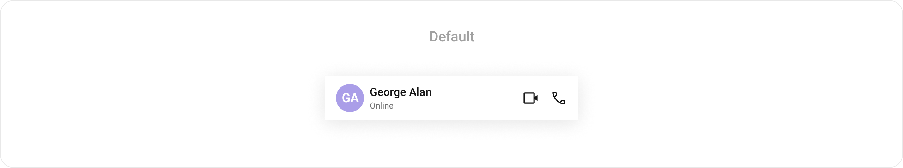
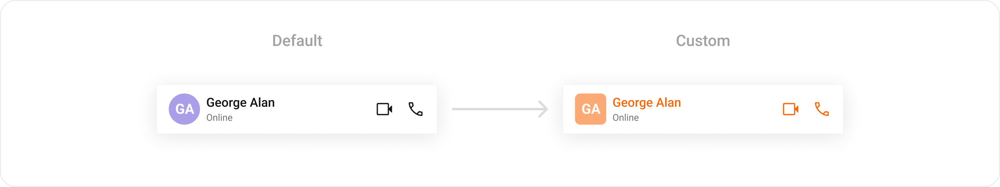
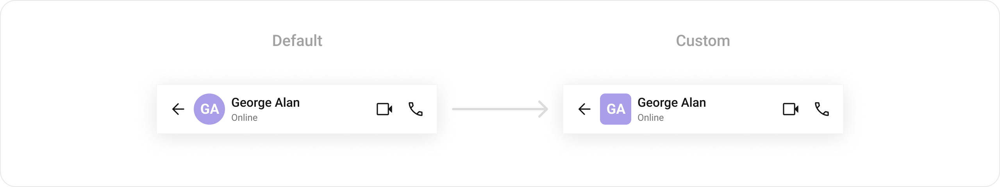
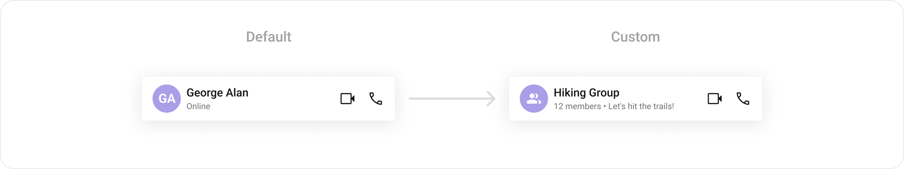
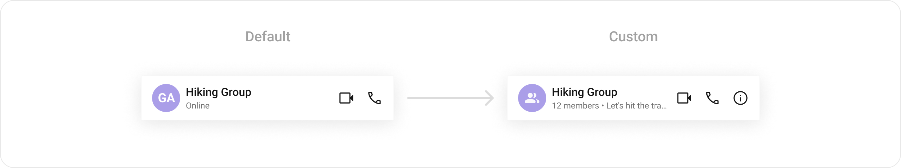
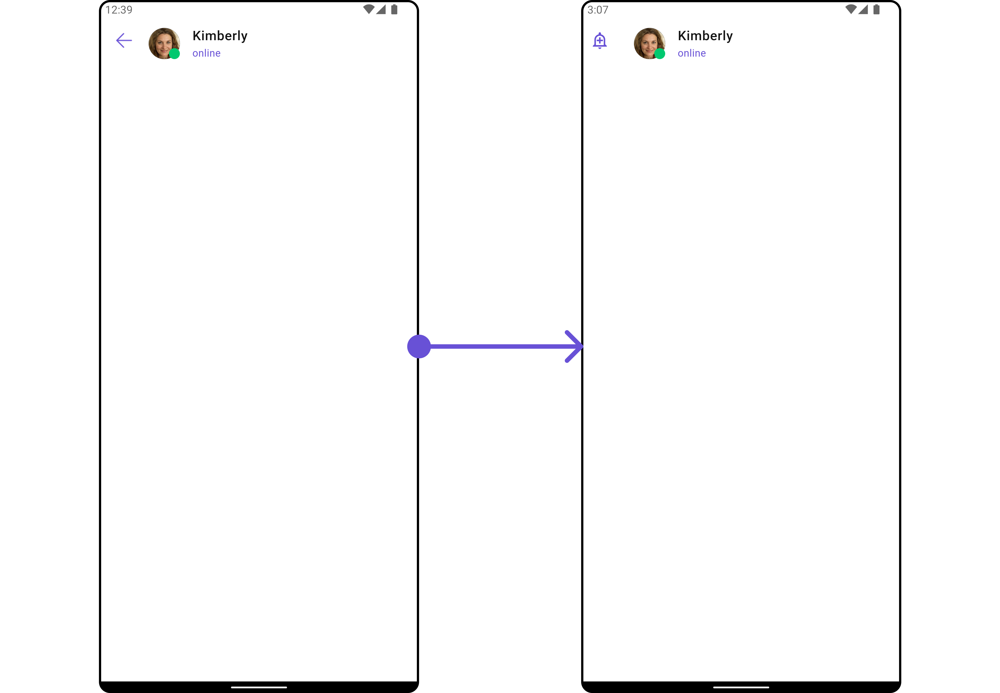
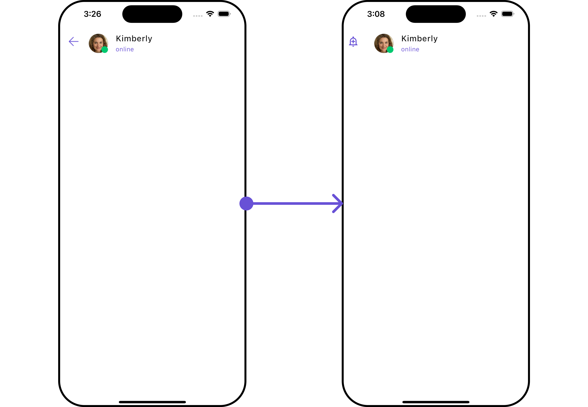

import Tabs from '@theme/Tabs';
import TabItem from '@theme/TabItem';
import { Tooltip } from 'react-tooltip'
import 'react-tooltip/dist/react-tooltip.css'

<Tooltip id="my-tooltip-html-prop" html="Not available in Group Members Configuration object"/>

## Overview

`CometChatMessageHeader` is a [Widget](/ui-kit/flutter/components-overview#components) that showcases the [User](/sdk/flutter/users-overview) or [Group](/sdk/flutter/groups-overview) details in the toolbar. Furthermore, it also presents a typing indicator and a back navigation button for ease of use.



The `CometChatMessageHeader` is comprised of the following components:

| Components                     | Description                                                                                                                                      |
| ------------------------------ | ------------------------------------------------------------------------------------------------------------------------------------------------ |
| [ListItem Widget](./list-item) | This component’s widget consists of avatar, status indicator , title, and subtitle. The fields are then mapped with the SDK’s user, group class. |
| Back Button                    | BackButton that allows users to navigate back from the current activity or screen to the previous one                                            |

## Usage

### Integration

You can launch `CometChatMessageHeader` directly using `Navigator.push`, or you can define it as a widget within the `build` method of your `State` class.

##### 1. Using Navigator to Launch `CometChatMessageHeader`

<Tabs>

<TabItem value="Dart" label="Dart">

```dart
Navigator.push(context, MaterialPageRoute(builder: (context) => CometChatMessageHeader())); // A user or group object is required to launch this widget.
```

</TabItem>

</Tabs>

##### 2. Embedding `CometChatMessageHeader` as a Widget in the build Method

<Tabs>

<TabItem value="Dart" label="Dart">

```dart
import 'package:cometchat_chat_uikit/cometchat_chat_uikit.dart';
import 'package:flutter/material.dart';

class MessageHeader extends StatefulWidget {
  const MessageHeader({super.key});

  @override
  State<MessageHeader> createState() => _MessageHeaderState();
}

class _MessageHeaderState extends State<MessageHeader> {

  @override
  Widget build(BuildContext context) {
    return Scaffold(
        body: SafeArea(
            child: CometChatMessageHeader() // A user or group object is required to launch this widget.
        )
    );
  }
}
```

</TabItem>

</Tabs>

---

### Actions

[Actions](/ui-kit/flutter/components-overview#actions) dictate how a widget functions. They are divided into two types: Predefined and User-defined. You can override either type, allowing you to tailor the behavior of the widget to fit your specific needs.

##### 1. onBack

Enhance your application's functionality by leveraging the `onBack` feature. This capability allows you to customize the behavior associated with navigating back within your app. Utilize the provided code snippet to override default behaviors and tailor the user experience according to your specific requirements.

<Tabs>

<TabItem value="Dart" label="Dart">

```dart
CometChatMessageHeader(
  user: user,
  onBack: () {
    // TODO("Not yet implemented")
  },
)
```

</TabItem>

</Tabs>

---

### Filters

**Filters** allow you to customize the data displayed in a list within a `Widget`. You can filter the list based on your specific criteria, allowing for a more customized. Filters can be applied using `RequestBuilders` of Chat SDK.

The `CometChatMessageHeader` widget does not have any exposed filters.

---

## Customization

To fit your app's design requirements, you can customize the appearance of the conversation widget. We provide exposed methods that allow you to modify the experience and behavior according to your specific needs.

### Style

To customize the appearance, you can assign a `CometChatMessageHeaderStyle` object to the `CometChatMessageHeader` widget.

<Tabs>

<TabItem value="Dart" label="Dart">

```dart
CometChatMessageHeader(
  user: user,
  style: CometChatMessageHeaderStyle(
       avatarStyle: CometChatAvatarStyle(
          backgroundColor: Color(0xFFFBAA75),
          borderRadius: BorderRadius.circular(6.67),
       ),
       callButtonsStyle: CometChatCallButtonsStyle(
          voiceCallIconColor: Color(0xFFF76808),
          videoCallIconColor: Color(0xFFF76808),
        ),
    )
)
```

</TabItem>

</Tabs>



---

### Functionality

These are a set of small functional customizations that allow you to fine-tune the overall experience of the widget. With these, you can change text, set custom icons, and toggle the visibility of UI elements.


Here is a code snippet demonstrating how you can customize the functionality of the Message Header widget.

<Tabs>

<TabItem value="Dart" label="Dart">

```dart
CometChatMessageHeader(
  user: user,
  hideBackButton: true,
  disableUserPresence: true,
)
```

</TabItem>

</Tabs>


Following is a list of customizations along with their corresponding code snippets:

| **Property**              | **Description**                      | **Code**              |
| ------------------------- | ------------------------------------ | --------------------- |
| **Back Button**           | Widget for the back button           | `backButton`          |
| **Disable Typing**        | Whether typing indicator is disabled | `disableTyping: bool` |
| **Disable User Presence** | Whether user presence is disabled    | `disableUserPresence` |
| **Group**                 | Group object to be displayed         | `group`               |
| **Hide Back Button**      | Whether to hide the back button      | `hideBackButton`      |
| **Private Group Icon**    | Icon for private groups              | `privateGroupIcon`    |
| **Protected Group Icon**  | Icon for protected groups            | `protectedGroupIcon`  |
| **Theme**                 | Theme to be applied                  | `theme`               |
| **User**                  | User object to be displayed          | `user`                |

---

### Advanced

For advanced-level customization, you can set custom views to the widget. This lets you tailor each aspect of the widget to fit your exact needs and application aesthetics. You can create and define your own widget and then incorporate those into the widget.

#### ListItemView

The `CometChatMessageHeader` widget consists of a `ListItemView`. You can customize the ListItem according to your requirements by using the `.setListItemView` method.

<Tabs>

<TabItem value="Dart" label="Dart">

```dart
CometChatMessageHeader(
  user: user,
  listItemView: (Group? group, User? user, context) {
    return Placeholder(); // Replace this placeholder with your custom widget.
  },
)
```

</TabItem>

</Tabs>

**Example**

Here is the complete example for reference:

<Tabs>

<TabItem value="Dart" label="Dart">

```dart title="main.dart"
  CometChatMessageHeader(
      user: user,
      group: group,
      listItemView: (group, user, context) {
        return CometChatListItem(
          avatarURL: group != null ? group.icon : user?.avatar,
          avatarName: group != null ? group.name : user?.name,
          avatarStyle: CometChatAvatarStyle(
              borderRadius: BorderRadius.circular(6.67),
              backgroundColor: Color(0xFFAA9EE8)),
          title: group != null ? group.name : user?.name ?? "",
          subtitleView: Text(
            user != null
                ? (user.status == UserStatusConstants.online
                    ? "Online"
                    : "Offline")
                : "${group?.membersCount} members",
            style: TextStyle(
              color: Color(0xFF727272),
              fontSize: 14,
              fontWeight: FontWeight.w400,
            ),
          ),
          tailView: CometChatUIKit.getDataSource()
              .getAuxiliaryHeaderMenu(context, user, group, null),
          style: ListItemStyle(
            titleStyle: TextStyle(
              color: Color(0xFF141414),
              fontSize: 16,
              fontWeight: FontWeight.w500,
            ),
          ),
        );
      },
    ); // Replaced the placeholder with a custom widget.
```

</TabItem>

</Tabs>



---

#### SubtitleView

You can customize the subtitle widget for each item to meet your specific preferences and needs.

<Tabs>

<TabItem value="Dart" label="Dart">

```dart
  CometChatMessageHeader(
      user: user,
      subtitleView: (group, user, context) {
        String subtitle;
        if (group != null) {
          subtitle = "${group.membersCount} . ${group.description}";
        } else {
          subtitle = user?.status ?? '';
        }
        return Text(
          subtitle,
          style: TextStyle(
            fontSize: 12,
            fontWeight: FontWeight.w400,
            color: Color(0XFF727272),
          ),
        );
      },
    )
```

</TabItem>

</Tabs>



---

#### AppBarOptions

You can set the Custom `appBarOptions` to the `CometChatMessageHeader` widget.

<Tabs>

<TabItem value="Dart" label="Dart">

```dart
CometChatMessageHeader(
  user: user,
  appBarOptions: (User? user, Group? group, BuildContext context) {
    return [
      IconButton(
                onPressed: () {},
                icon: Icon(
                  Icons.info_outline,
                  color: Color(0xFF141414),
                ),
           )
    ];
  },
)
```

</TabItem>

</Tabs>



---

#### BackIcon

You can customize the Back Icon according to your specific requirements by using the `.backButton` method.

<Tabs>

<TabItem value="Dart" label="Dart">

```dart
CometChatMessageHeader(
  user: user,
  backButton: (context) {
    return IconButton(
      icon: Icon(Icons.add_alert_outlined, color: Color(0xFF6851D6)),
      onPressed: () {
        // Navigator.pop(context);
      },
    );
  },
)
```

</TabItem>

</Tabs>

<Tabs>

<TabItem value="Android" label="Android">



</TabItem>

<TabItem value="iOS" label="iOS">



</TabItem>

</Tabs>

---
