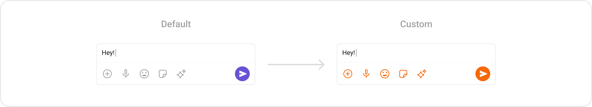
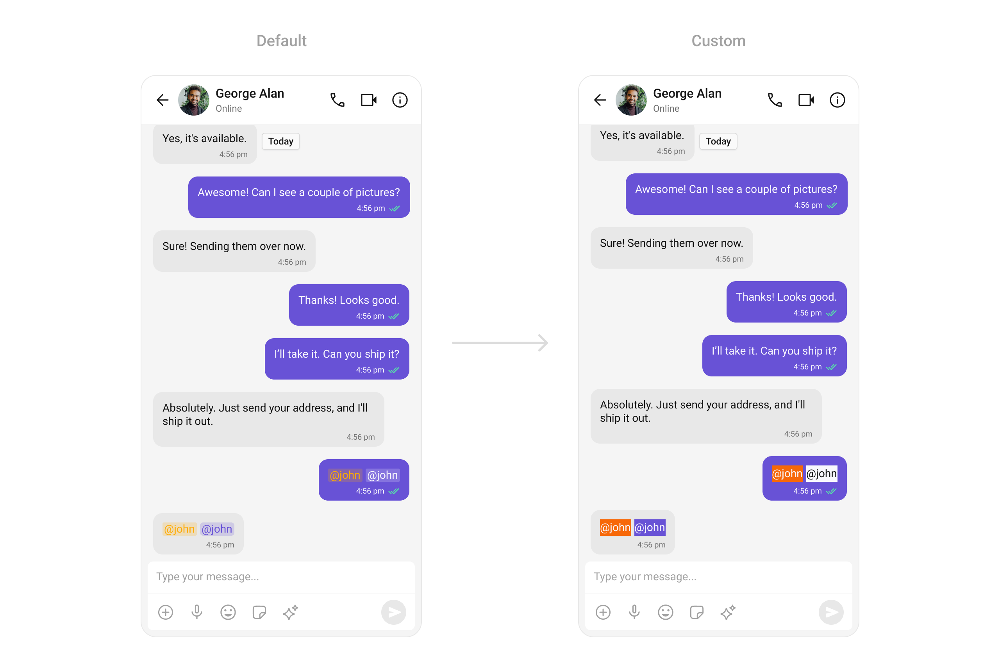

import Tabs from '@theme/Tabs';
import TabItem from '@theme/TabItem';
import { Tooltip } from 'react-tooltip'
import 'react-tooltip/dist/react-tooltip.css'

<Tooltip id="my-tooltip-html-prop" html="Not available in Group Members Configuration object"/>

## Overview

`CometChatMessageComposer` is a [Widget](/ui-kit/flutter/components-overview#components) that enables users to write and send a variety of messages, including text, image, video, and custom messages.

Features such as **Live Reaction**, **Attachments**, and **Message Editing** are also supported by it.


`CometChatMessageComposer` is comprised of the following [Base Widgets](/ui-kit/flutter/components-overview#base-components):

| Base Widgets                    | Description                                                                                                         |
| ------------------------------- | ------------------------------------------------------------------------------------------------------------------- |
| [MessageInput](./message-input) | This provides a basic layout for the contents of this component, such as the TextField and buttons                  |
| [ActionSheet](./action-sheet)   | The ActionSheet widget presents a list of options in either a list or grid mode, depending on the user's preference |

## Usage

### Integration

You can launch `CometChatMessageComposer` directly using `Navigator.push`, or you can define it as a widget within the `build` method of your `State` class.

##### 1. Using Navigator to Launch `CometChatMessageComposer`

<Tabs>

<TabItem value="Dart" label="Dart">

```dart
Navigator.push(context, MaterialPageRoute(builder: (context) => CometChatMessageComposer())); // A user or group object is required to launch this widget.
```

</TabItem>

</Tabs>

##### 2. Embedding `CometChatMessageComposer` as a Widget in the build Method

<Tabs>

<TabItem value="Dart" label="Dart">

```dart
import 'package:cometchat_chat_uikit/cometchat_chat_uikit.dart';
import 'package:flutter/material.dart';

class MessageComposer extends StatefulWidget {
  const MessageComposer({super.key});

  @override
  State<MessageComposer> createState() => _MessageComposerState();
}

class _MessageComposerState extends State<MessageComposer> {

  @override
  Widget build(BuildContext context) {
    return Scaffold(
        body: SafeArea(
            child: Column(
              children: [
                const Spacer(),
                CometChatMessageComposer()
              ],
            ) // A user or group object is required to launch this widget.
        )
    );
  }
}
```

</TabItem>

</Tabs>

---

### Actions

[Actions](/ui-kit/flutter/components-overview#actions) dictate how a widget functions. They are divided into two types: Predefined and User-defined. You can override either type, allowing you to tailor the behavior of the widget to fit your specific needs.

##### 1. OnSendButtonClick

The `OnSendButtonClick` event gets activated when the send message button is clicked. It has a predefined function of sending messages entered in the composer `EditText`. However, you can overide this action with the following code snippet.

<Tabs>

<TabItem value="Dart" label="Dart">

```dart
CometChatMessageComposer(
  user: user,
  onSendButtonTap: (BuildContext context, BaseMessage baseMessage, PreviewMessageMode? previewMessageMode) {
    // TODO("Not yet implemented")
  },
)
```

</TabItem>

</Tabs>

---

##### 2. onChange

This action handles changes in the value of text in the input field of the CometChatMessageComposer widget.

<Tabs>

<TabItem value="Dart" label="Dart">

```dart
CometChatMessageComposer(
  user: user,
  onChange: (String? text) {
    // TODO("Not yet implemented")
  },
)
```

</TabItem>

</Tabs>

---

##### 3. onError

This action doesn't change the behavior of the widget but rather listens for any errors that occur in the MessageList widget.

<Tabs>

<TabItem value="Dart" label="Dart">

```dart
CometChatMessageComposer(
  user: user,
  onError: (e) {
    // TODO("Not yet implemented")
  },
)
```

</TabItem>

</Tabs>

---

### Filters

`CometChatMessageComposer` widget does not have any available filters.

---

### Events

[Events](/ui-kit/flutter/components-overview#events) are emitted by a `Widget`. By using event you can extend existing functionality. Being global events, they can be applied in Multiple Locations and are capable of being Added or Removed.

The `CometChatMessageComposer` Widget does not emit any events of its own.

---

## Customization

To fit your app's design requirements, you can customize the appearance of the `CometChatMessageComposer` widget. We provide exposed methods that allow you to modify the experience and behavior according to your specific needs.

### Style

Using Style you can customize the look and feel of the widget in your app, These parameters typically control elements such as the color, size, shape, and fonts used within the widget.

##### 1. CometChatMessageComposerStyle

To modify the styling, you can apply the `CometChatMessageComposerStyle` to the `CometChatMessageComposer` Widget using the `style` property.

<Tabs>

<TabItem value="Dart" label="Dart">

```dart
CometChatMessageComposer(
  user: user,
  style: CometChatMessageComposerStyle(
      sendButtonIconBackgroundColor: Color(0xFFF76808),
      secondaryButtonIconColor: Color(0xFFF76808),
      auxiliaryButtonIconColor: Color(0xFFF76808)
    )
)
```

</TabItem>

</Tabs>




##### 2. MediaRecorder Style

To customize the styles of the MediaRecorder widget within the `CometChatMessageComposer` Widget, use the `mediaRecorderStyle` property. For more details, please refer to [MediaRecorder](/ui-kit/flutter/media-recorder) styles.

<Tabs>

<TabItem value="Dart" label="Dart">

```dart
CometChatMessageComposer(
  user: user,
  mediaRecorderStyle: CometChatMediaRecorderStyle(
            recordIndicatorBackgroundColor: Color(0xFFF44649),
            recordIndicatorBorderRadius: BorderRadius.circular(20),
            pauseButtonBorderRadius: BorderRadius.circular(8),
            deleteButtonBorderRadius: BorderRadius.circular(8),
            stopButtonBorderRadius: BorderRadius.circular(8),
          ),
)
```

</TabItem>

</Tabs>


---

##### 3. AI Options Style

To customize the styles of the AI Options widget within the `CometChatMessageComposer` Widget, use the `aiOptionStyle`.

<Tabs>

<TabItem value="Dart" label="Dart">

```dart
CometChatMessageComposer(
  user: user,
  aiOptionStyle: AIOptionsStyle(
    background: Color(0xFFE4EBF5),
    border: Border.all(width: 3, color: Colors.red),
  )
)
```

</TabItem>

</Tabs>

---

### Functionality

These are a set of small functional customizations that allow you to fine-tune the overall experience of the widget. With these, you can change text, set custom icons, and toggle the visibility of UI elements.


<Tabs>

<TabItem value="Dart" label="Dart">

```dart
CometChatMessageComposer(
  user: user,
  placeholderText: "Type a message...",
  liveReactionIcon: const Icon(Icons.live_tv, color: Colors.green,),
  hideVoiceRecording: true,
  disableMentions: true,
)
```

</TabItem>

</Tabs>


Below is a list of customizations along with corresponding code snippets

| **Property**                    | Description                                           | Code                                         |
| ------------------------------- | ----------------------------------------------------- | -------------------------------------------- |
| **Ai Icon**                     | Sets the AI icon.                                     | `aiIcon: Icon?`                              |
| **Ai Icon Url**                 | Sets the URL for the AI icon.                         | `aiIconURL: String?`                         |
| **Attachment Icon**             | Sets the icon for attachments.                        | `attachmentIcon: Icon?`                      |
| **Attachment Icon Url**         | Sets the URL for the attachment icon.                 | `attachmentIconURL: String?`                 |
| **Attachment Options**          | Sets the options for attachment actions.              | `attachmentOptions: ComposerActionsBuilder?` |
| **Auxiliary Buttons Alignment** | Sets the alignment for auxiliary buttons.             | `auxiliaryButtonsAlignment: Alignment?`      |
| **Custom Sound For Message**    | Sets the custom sound for messages.                   | `customSoundForMessage: String?`             |
| **Delete Icon**                 | Sets the icon for the delete action.                  | `deleteIcon: Icon?`                          |
| **Disable Mentions**            | Disables mentions in the message composer.            | `disableMentions: bool?`                     |
| **Disable Sound For Messages**  | Disables sound notifications for messages.            | `disableSoundForMessages: bool`              |
| **Disable Typing Events**       | Disables typing events.                               | `disableTypingEvents: bool`                  |
| **Live Reaction Icon**          | Sets the icon for live reactions.                     | `liveReactionIcon: Icon?`                    |
| **Live Reaction Icon Url**      | Sets the URL for the live reaction icon.              | `liveReactionIconURL: String?`               |
| **Max Line**                    | Sets the maximum number of lines for the input field. | `maxLine: int?`                              |
| **Pause Icon**                  | Sets the icon for the pause action.                   | `pauseIcon: Icon?`                           |
| **Placeholder Text**            | Sets the placeholder text for the input field.        | `placeholderText: String?`                   |
| **Play Icon**                   | Sets the icon for the play action.                    | `playIcon: Icon?`                            |
| **Record Icon**                 | Sets the icon for the record action.                  | `recordIcon: Icon?`                          |
| **Stop Icon**                   | Sets the icon for the stop action.                    | `stopIcon: Icon?`                            |
| **Submit Icon**                 | Sets the icon for the submit action.                  | `submitIcon: Icon?`                          |
| **Text**                        | Sets the initial text for the input field.            | `text: String?`                              |

---

### Advanced

For advanced-level customization, you can set custom widgets to the widget. This lets you tailor each aspect of the widget to fit your exact needs and application aesthetics. You can create and define your widgets and then incorporate those into the widget.

---

#### TextFormatters

Assigns the list of text formatters. If the provided list is not null, it sets the list. Otherwise, it assigns the default text formatters retrieved from the data source. To configure the existing Mentions look and feel check out [CometChatMentionsFormatter](../07-Advanced/02-mentions-formatter.md)

**Example**

Here is the complete example for reference:

<Tabs>

<TabItem value="Dart" label="Dart">

```dart
CometChatMessageComposer(
  user: user,
  textFormatters: [
       CometChatMentionsFormatter(
              style: CometChatMentionsStyle(
                     mentionSelfTextBackgroundColor: Color(0xFFF76808),
                     mentionTextBackgroundColor: Colors.white,
                     mentionTextColor: Colors.black,
                     mentionSelfTextColor: Colors.white,
                    )
          )
    ],
)
```

</TabItem>

</Tabs>



---

#### AttachmentOptions

By using `attachmentOptions`, you can set a list of custom `MessageComposerActions` for the `CometChatMessageComposer` Widget. This will override the existing list of `MessageComposerActions`.

**Example**

Here is the complete example for reference:

<Tabs>

<TabItem value="Dart" label="Dart">

```dart
CometChatMessageComposer(
  user: user,
  attachmentOptions: (context, user, group, id) {
      return <CometChatMessageComposerAction>[
            CometChatMessageComposerAction(
                  id: "Custom Option 1",
                  title: "Custom Option 1",
                  icon: Icon(
                    Icons.play_circle,
                    color: Colors.black,
                  ),
              ),
            CometChatMessageComposerAction(
                  id: "Custom Option 2",
                  title: "Custom Option 2",
                  icon: Icon(
                    Icons.add_box,
                    color: Colors.black,
                  ),
              ),
            CometChatMessageComposerAction(
                  id: "Custom Option 3",
                  title: "Custom Option 3",
                  icon: Icon(
                    Icons.change_circle,
                    color: Colors.black,
                  ),
              ),
            CometChatMessageComposerAction(
                  id: "Custom Option 4",
                  title: "Custom Option 4",
                  icon: Icon(
                    Icons.sunny,
                    color: Colors.black,
                  ),
             )
          ];
      },
)
```

</TabItem>

</Tabs>


---

#### AuxiliaryButton Widget

You can insert a custom widget into the `CometChatMessageComposer` widget to add additional functionality using the `auxiliaryButtonView` property.

**Example**

Here is the complete example for reference:

<Tabs>

<TabItem value="Dart" label="Dart">

```dart
CometChatMessageComposer(
    user: user,
    auxiliaryButtonView: (context, user, group, id) {
              final existingAuxiliaryOptions = CometChatUIKit.getDataSource()
                  .getAuxiliaryOptions(user, group, context, id, Color(0xFFA1A1A1));
              return Row(
                children: [
                  existingAuxiliaryOptions,
                  Icon(
                    Icons.location_pin,
                    color: Color(0xFF6852D6),
                  ),
                ],
        );
    },
)
```

</TabItem>

</Tabs>


---

#### SecondaryButton Widget

You can add a custom widget into the SecondaryButton widget for additional functionality using the `secondaryButtonView` property.

**Example**

Here is the complete example for reference:

<Tabs>

<TabItem value="Dart" label="Dart">

```dart
CometChatMessageComposer(
    user: user,
    secondaryButtonView: (context, user, group, id) {
        return Icon(
            Icons.attach_file,
            color: Color(0xFF6852D6),
          );
    }
)
```

</TabItem>

</Tabs>


---

#### SendButton Widget

You can set a custom widget in place of the already existing send button widget. Using the `sendButtonView` property.

**Example**

Here is the complete example for reference:

<Tabs>

<TabItem value="Dart" label="Dart">

```dart
 CometChatMessageComposer(
      user: user,
      sendButtonView: IconButton(
          onPressed: () {},
          padding: EdgeInsets.all(4),
          style: IconButton.styleFrom(
              alignment: Alignment.center,
              backgroundColor: Color(0xFFEDEAFA),
              shape: RoundedRectangleBorder(
                borderRadius: BorderRadius.circular(4),
              )),
          icon: Transform.rotate(
                    angle: 150,
                    child: Icon(
                         Icons.send,
                         size: 20,
                         color: Color(0xFF6852D6),
                      ),
                )
      ),
    )
```

</TabItem>

</Tabs>


---

#### Header Widget

You can set custom headerView to the `CometChatMessageComposer` widget using the `headerView` property

**Example**

Here is the complete example for reference:

<Tabs>

<TabItem value="Dart" label="Dart">

```dart
CometChatMessageComposer(
      user: user,
      headerView: (context, user, group, id) {
        return Container(
          margin: EdgeInsets.only(
              bottom: 2,
              left: 8,
              right: 8),
          padding: EdgeInsets.all(8),
          decoration: BoxDecoration(
            color: Color(0xFFEDEAFA),
            borderRadius: BorderRadius.circular(8),
          ),
          child: Row(
            children: [
              Icon(
                Icons.volume_off,
                size: 20,
                color: Color(0xFF6852D6),
              ),
              Text(
                "User has paused their notifications",
                style: TextStyle(
                  fontSize: 14,
                  fontWeight: FontWeight.w400,
                ),
              ),
            ],
          ),
        );
      },
    )
```

</TabItem>

</Tabs>


---

#### Footer Widget

You can set a custom footer widget to the `CometChatMessageComposer` widget using the `footerView` property:

**Example**

Here is the complete example for reference:

<Tabs>

<TabItem value="Dart" label="Dart">

```dart
CometChatMessageComposer(
  user: user,
  footerView: (context, user, group, id) {
    return Container(
      width: MediaQuery.of(context).size.width/1.08,
      color: Colors.yellow,
      padding: const EdgeInsets.all(8),
      child: const Center(child: Text("Your Footer Widget")),
    );
  },
)
```

</TabItem>

</Tabs>

<Tabs>

<TabItem value="Android" label="Android">


</TabItem>

<TabItem value="iOS" label="iOS">


</TabItem>

</Tabs>

---
