import Tabs from '@theme/Tabs';
import TabItem from '@theme/TabItem';
import { Tooltip } from 'react-tooltip'
import 'react-tooltip/dist/react-tooltip.css'

<Tooltip id="my-tooltip-html-prop" html="Not available in Group Members Configuration object"/>

## Overview

ThreadedMessages is a [Composite Widget](/ui-kit/flutter/components-overview#composite-components) that displays all replies made to a particular message in a conversation. By default, the parent message will be displayed at the top, the message composer will be at the bottom and between them a message list will contain all replies.


ThreadedMessages is composed of the following widgets:

| Widget                                | Description                                                                                                     |
| ------------------------------------- | --------------------------------------------------------------------------------------------------------------- |
| [MessageList](./message-list)         | CometChatMessageList is a widget that displays a list of Messages                                               |
| [MessageComposer](./message-composer) | CometChatMessageComposer is a widget that helps in writing and editing of messages and also sending attachments |

## Usage

### Integration

You can launch `CometChatThreadedMessages` directly using `Navigator.push`, or you can define it as a widget within the `build` method of your `State` class.

##### 1. Using Navigator to Launch `CometChatThreadedMessages`

<Tabs>

<TabItem value="Dart" label="Dart">

```dart
Navigator.push(context, MaterialPageRoute(builder: (context) => CometChatThreadedMessages(loggedInUser: loggedInUser, parentMessage: parentMessage))); // Logged in user object and parent message object is required to launch this widget.
```

</TabItem>

</Tabs>

##### 2. Embedding `CometChatThreadedMessages` as a Widget in the build Method

<Tabs>

<TabItem value="Dart" label="Dart">

```dart
import 'package:cometchat_chat_uikit/cometchat_chat_uikit.dart';
import 'package:flutter/material.dart';

class ThreadMessages extends StatefulWidget {
  const ThreadMessages({super.key});

  @override
  State<ThreadMessages> createState() => _ThreadMessagesState();
}

class _ThreadMessagesState extends State<ThreadMessages> {

  @override
  Widget build(BuildContext context) {
    return Scaffold(
      body: SafeArea(
        child: CometChatThreadedMessages(loggedInUser: loggedInUser, parentMessage: parentMessage) // Logged in user object and parent message object is need.
      ),
    );
  }
}
```

</TabItem>

</Tabs>

---

### Actions

[Actions](/ui-kit/flutter/components-overview#actions) dictate how a widget functions. They are divided into two types: Predefined and User-defined. You can override either type, allowing you to tailor the behavior of the widget to fit your specific needs.

ThreadedMessages does not have its own actions. However, you can override the behavior of the ThreadedMessages widget by using the actions of its widgets, with the help of [Configurations](/ui-kit/flutter/components-overview#configurations).

**Example**

In this example, we are overriding the `onThreadReplyClick` of the MessageList Widget using `MessageListConfiguration` and applying it to ThreadedMessages.

<Tabs>

<TabItem value="Dart" label="Dart">

```dart
CometChatThreadedMessages(
  loggedInUser: loggedInUser,
  parentMessage: parentMessage,
  messageListConfiguration: MessageListConfiguration(
    onThreadRepliesClick: (message, context, {bubbleView}) {
      // TODO("Not yet implemented")
    },
  ),
)
```

</TabItem>

</Tabs>

---

### Filters

**Filters** allow you to customize the data displayed in a list within a Widget. You can filter the list based on your specific criteria, allowing for a more customized. Filters can be applied using RequestBuilders of Chat SDK.

ThreadedMessages does not have its own Filters. However, you can filter the messages list in ThreadedMessages Widget using [MessageListConfiguration](#configuration).

**Example**

In this example, we are filtering messages based on the `ParentMessageID` and searching for messages that contain the keyword "payment".

<Tabs>

<TabItem value="Dart" label="Dart">

```dart
CometChatThreadedMessages(
  loggedInUser: loggedInUser,
  parentMessage: parentMessage,
  messageListConfiguration: MessageListConfiguration(
      messagesRequestBuilder: MessagesRequestBuilder()
      ..limit = 30
      ..parentMessageId = parentMessage!.parentMessageId
      ..searchKeyword = "payment"
  ),
)
```

</TabItem>

</Tabs>

---

### Events

[Events](/ui-kit/flutter/components-overview#events) are emitted by a `Widget`. By using event you can extend existing functionality. Being global events, they can be applied in Multiple Locations and are capable of being Added or Removed.

The MessageList Widget does not emit any events of its own.

---

## Customization

To fit your app's design requirements, you can customize the appearance of the conversation widget. We provide exposed methods that allow you to modify the experience and behavior according to your specific needs.

---

### Style

Using Style you can customize the look and feel of the widget in your app, These parameters typically control elements such as the color, size, shape, and fonts used within the widget.

##### 1. ThreadedHeaderStyle

To modify the styling, you can apply the `ThreadedHeaderStyle` to the `CometChatThreadedHeader` Widget using the `style` property.

<Tabs>

<TabItem value="Dart" label="Dart">

```dart
   CometChatThreadedHeader(
      parentMessage: message,
      loggedInUser: CometChatUIKit.loggedInUser!,
      style: CometChatThreadedHeaderStyle(
        bubbleContainerBackGroundColor: Color(0xFFFEEDE1),
        outgoingMessageBubbleStyle: CometChatOutgoingMessageBubbleStyle(
                backgroundColor: Color(0xFFF76808),
                borderRadius: BorderRadius.circular(12),
        )
      ),
      messageActionView: (message, context) {
        final numberOfReplies = message.replyCount;
        String replyText = numberOfReplies == 1
            ? Translations.of(context).reply
            : Translations.of(context).replies;
        return Container(
          width: double.maxFinite,
          color: Color(0xFFFEEDE1),
          padding: EdgeInsets.symmetric(
            vertical: 4,
          ),
          child: Row(
            children: [
              Flexible(
                child: Divider(
                  color: Color(0xFFF76808),
                ),
              ),
              Padding(
                padding: EdgeInsets.symmetric(horizontal: 8),
                child: Text(
                  "$numberOfReplies $replyText",
                  style: TextStyle(
                    color: Color(0xFFF76808),
                    fontSize: 14,
                    fontWeight: FontWeight.w400,
                  ),
                ),
              ),
              Flexible(
                child: Divider(
                  color: Color(0xFFF76808),
                ),
              ),
            ],
          ),
        );
      },
    );
```

</TabItem>

</Tabs>

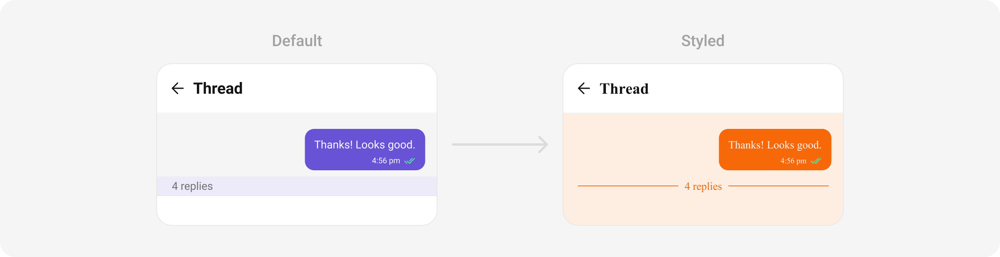

The following properties are exposed by `ThreadedMessagesStyle`:

| **Property**        | Description                                               | Code                          |
| ------------------- | --------------------------------------------------------- | ----------------------------- |
| **Background**      | Sets the background color of the threaded message style.  | `background: Color?`          |
| **Border**          | Sets the border properties of the threaded message style. | `border: Border?`             |
| **Border Radius**   | Sets the border radius of the threaded message style.     | `borderRadius: BorderRadius?` |
| **Close Icon Tint** | Sets the color for the close icon.                        | `closeIconTint: Color?`       |
| **Gradient**        | Sets the gradient applied to the threaded message style.  | `gradient: Gradient?`         |
| **Height**          | Sets the height of the threaded message style.            | `height: double?`             |
| **Title Style**     | Sets the text style for the title.                        | `titleStyle: TextStyle?`      |
| **Width**           | Sets the width of the threaded message style.             | `width: double?`              |

---

### Functionality

These are a set of small functional customizations that allow you to fine-tune the overall experience of the widget. With these, you can change text, set custom icons, and toggle the visibility of UI elements.

<Tabs>

<TabItem value="Dart" label="Dart">

```dart
CometChatThreadedMessages(
  loggedInUser: loggedInUser,
  parentMessage: parentMessage,
  hideMessageComposer: true,
  title: "Your Title",
)
```

</TabItem>

</Tabs>

<Tabs>

<TabItem value="Android" label="Android">

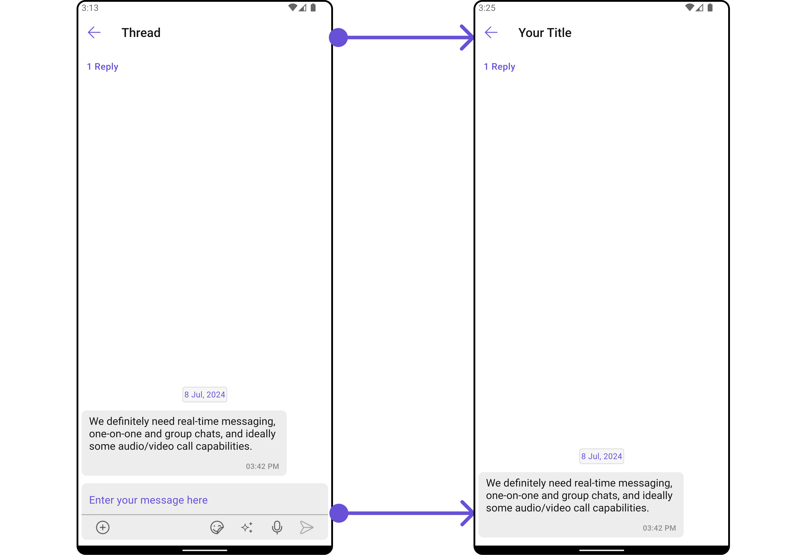

</TabItem>

<TabItem value="iOS" label="iOS">

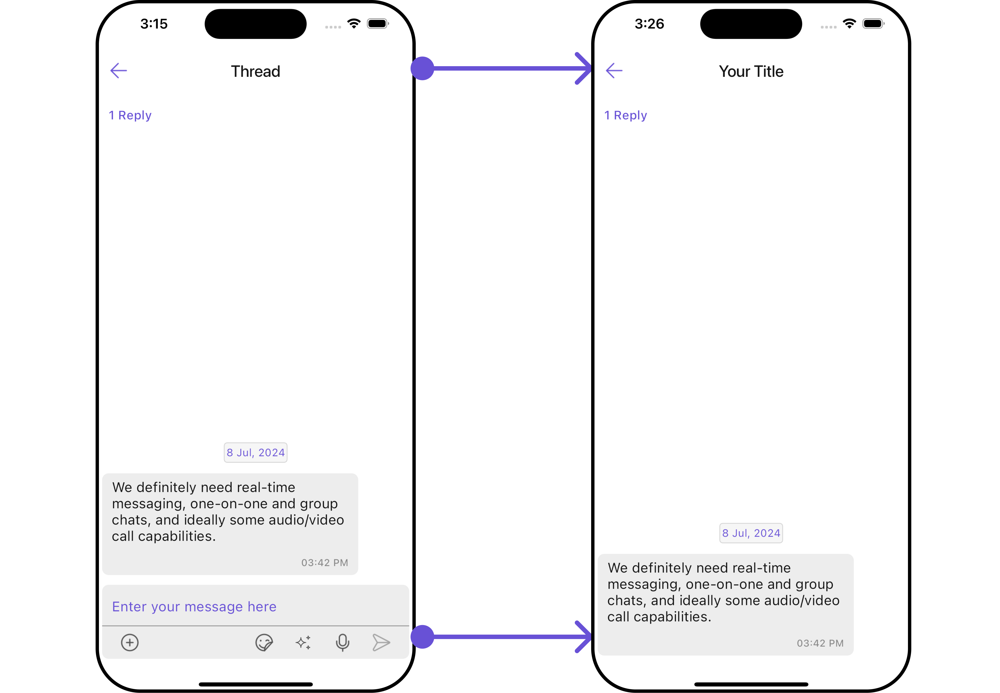

</TabItem>

</Tabs>

Below is a list of customizations along with corresponding code snippets

| **Property**              | Description                                      | Code                         |
| ------------------------- | ------------------------------------------------ | ---------------------------- |
| **Close Icon**            | Sets the icon for closing the threaded messages. | `closeIcon: Icon?`           |
| **Hide Message Composer** | Hides the message composer.                      | `hideMessageComposer: bool?` |
| **Theme**                 | Sets the theme for the threaded messages.        | `theme: Theme?`              |
| **Title**                 | Sets the title for the threaded messages.        | `title: String?`             |

---

### Advanced

For advanced-level customization, you can set custom widgets to the widget. This lets you tailor each aspect of the widget to fit your exact needs and application aesthetics. You can create and define your widgets, layouts, and UI elements and then incorporate those into the widget.

#### MessageBubbleView

By using `bubbleView`, You can set parent message buggle widget inside `CometChatThreadedMessages` Widget.

**Example**

Here is the complete example for reference:

<Tabs>

<TabItem value="Dart" label="Dart">

```dart
CometChatThreadedMessages(
  loggedInUser: loggedInUser,
  parentMessage: parentMessage,
  bubbleView: (BaseMessage baseMessage, BuildContext context) {
    return Container(
      width: MediaQuery.of(context).size.width,
      padding: const EdgeInsets.all(10),
      margin: const EdgeInsets.only(top: 10, bottom: 10),
      decoration: BoxDecoration(
        color: Colors.grey[300],
        borderRadius: BorderRadius.circular(10),
      ),
      child: Column(
        mainAxisAlignment: MainAxisAlignment.start,
        crossAxisAlignment: CrossAxisAlignment.start,
        children: [
          Text(baseMessage.sender!.name ?? "", style: const TextStyle(fontWeight: FontWeight.bold),),
          Text((baseMessage as TextMessage).text ?? "", style: const TextStyle(fontWeight: FontWeight.normal),),
        ],
      )
    );
  },
)
```

</TabItem>

</Tabs>

<Tabs>

<TabItem value="Android" label="Android">

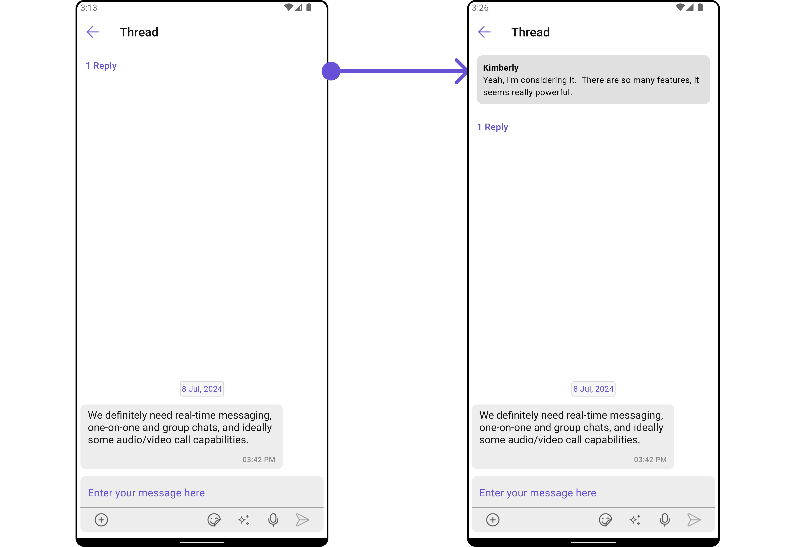

</TabItem>

<TabItem value="iOS" label="iOS">

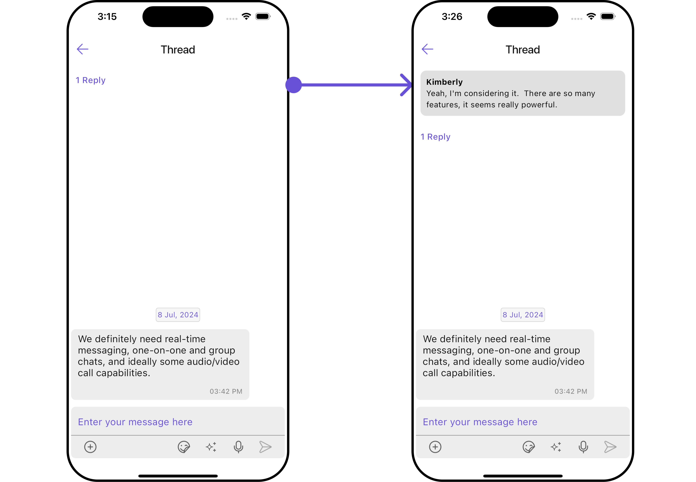

</TabItem>

</Tabs>

---

#### MessageActionView

By utilizing the `messageActionView` method, you can assign custom actions to the parent message bubble widget inside the `CometChatThreadedMessages` Widget.

**Example**

Here is the complete example for reference:

<Tabs>

<TabItem value="Dart" label="Dart">

```dart
CometChatThreadedMessages(
  loggedInUser: loggedInUser,
  parentMessage: parentMessage,
  messageActionView: (BaseMessage baseMessage, BuildContext context) {
    return Container(
      width: MediaQuery.of(context).size.width / 1.2,
      margin: const EdgeInsets.all(10),
      decoration: BoxDecoration(
        color: Color(0xFF6851D6),
        borderRadius: BorderRadius.circular(10),
        border: Border.all(width: 5, color: Color(0xFF6851D6)),
      ),
      child: const Center(
        child: Text("Your Custom Action View",
          style: TextStyle(color: Colors.white),),
      ),
    );
  },
)
```

</TabItem>

</Tabs>

<Tabs>

<TabItem value="Android" label="Android">

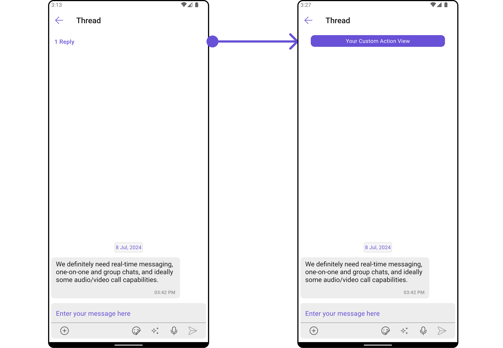

</TabItem>

<TabItem value="iOS" label="iOS">

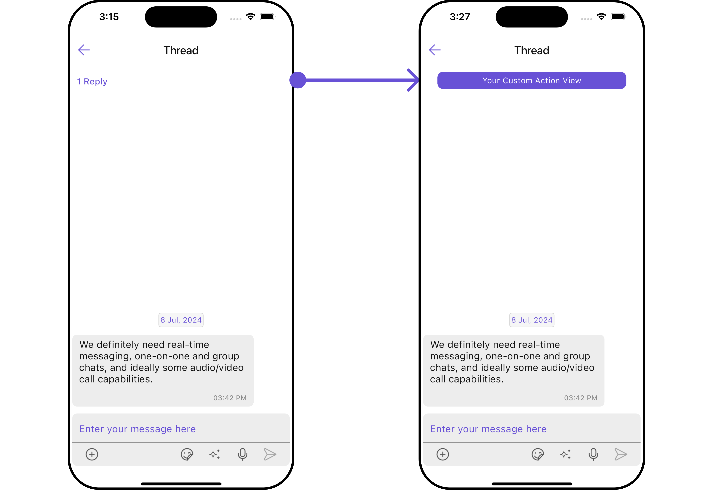

</TabItem>

</Tabs>

---

#### MessageListView

You can set your custom message list widget using the `messageListView` method. But keep in mind, by using this you will override the default message ListView functionality.

**Example**

Here is the complete example for reference:

<Tabs>

<TabItem value="Dart" label="Dart">

```dart
CometChatThreadedMessages(
  loggedInUser: loggedInUser,
  parentMessage: parentMessage,
  messageListView: (user, group, context, parentMessage) {
    return Container(
      width: MediaQuery.of(context).size.width / 1.2,
      margin: const EdgeInsets.all(10),
      decoration: BoxDecoration(
        color: Color(0xFF6851D6),
        borderRadius: BorderRadius.circular(10),
        border: Border.all(width: 5, color: Color(0xFF6851D6)),
      ),
      child: const Center(
        child: Text("Your Custom List View",
          style: TextStyle(color: Colors.white),),
      ),
    );
  },
)
```

</TabItem>

</Tabs>

<Tabs>

<TabItem value="Android" label="Android">

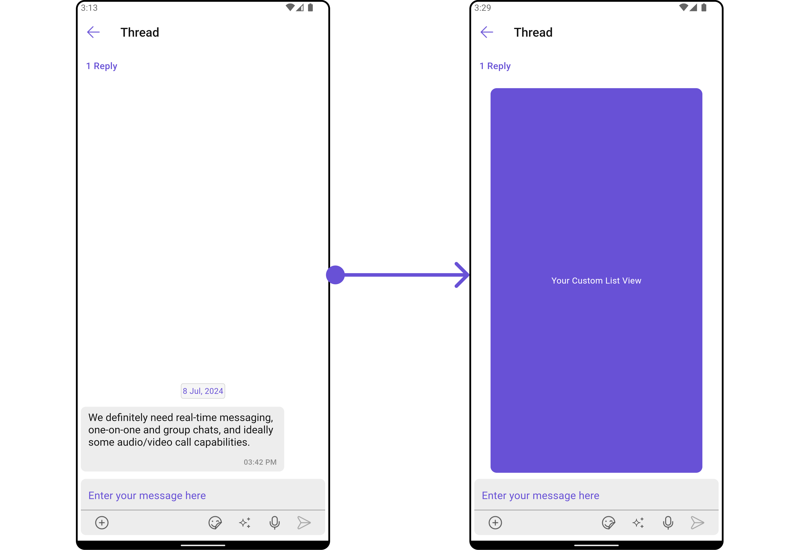

</TabItem>

<TabItem value="iOS" label="iOS">

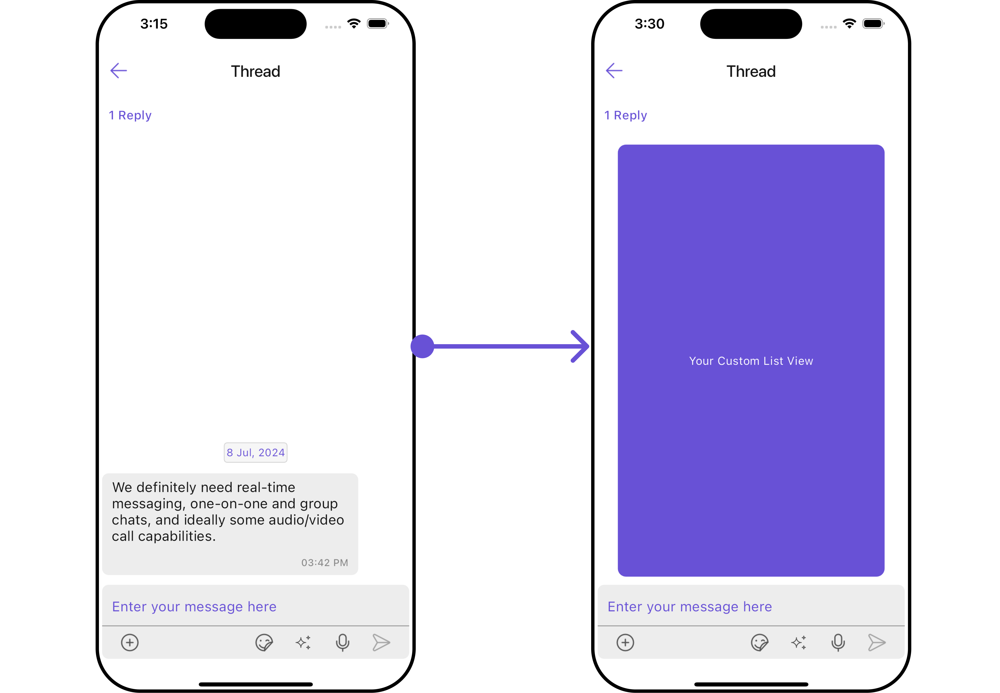

</TabItem>

</Tabs>

---

#### MessageComposerView

You can set your custom Message Composer widget using the `messageComposerView` method. But keep in mind, by using this you will override the default message composer functionality.

**Example**

Here is the complete example for reference:

<Tabs>

<TabItem value="Dart" label="Dart">

```dart
CometChatThreadedMessages(
  loggedInUser: loggedInUser,
  parentMessage: parentMessage,
  messageComposerView: (user, group, context, parentMessage) {
    return Container(
      width: MediaQuery.of(context).size.width / 1.1,
      margin: const EdgeInsets.all(10),
      decoration: BoxDecoration(
        color: Color(0xFF6851D6),
        borderRadius: BorderRadius.circular(10),
        border: Border.all(width: 5, color: Color(0xFF6851D6)),
      ),
      child: Row(
        children: [
          const Expanded(
            child: TextField(
              decoration: InputDecoration(
                hintText: "Type a message",
                border: InputBorder.none,
                hintStyle: TextStyle(color: Colors.white),
              ),
            ),
          ),
          IconButton(
            onPressed: () {
              // TODO("Not yet implemented")
            },
            icon: const Icon(Icons.send, color: Colors.white),
          )
        ],
      )
    );
  },
)
```

</TabItem>

</Tabs>

<!-- <Tabs>

<TabItem value="Android" label="Android">


</TabItem>

<TabItem value="iOS" label="iOS">


</TabItem>

</Tabs> -->

---

## Configuration

Configurations offer the ability to customize the properties of each individual widget within a Composite Widget.

The ThreadedMessages is a Composite Widget, and it has a distinct set of configurations for each of its widgets as follows.

### MessageList

If you want to customize the properties of the [MessageList](./03-message-list.md) Widget inside ThreadedMessages Widget, you need use the `MessageListConfiguration` object.

**Example**

Here is the complete example for reference:

<Tabs>

<TabItem value="Dart" label="Dart">

```dart
CometChatThreadedMessages(
  loggedInUser: loggedInUser,
  parentMessage: parentMessage,
  messageListConfiguration: MessageListConfiguration(
    alignment: ChatAlignment.leftAligned,
    messageListStyle: MessageListStyle(
      background: Color(0xFFE4EBF5),
      border: Border.all(width: 1, color: Colors.red),
      borderRadius: 10,
    ),
  ),
)
```

</TabItem>

</Tabs>

<Tabs>

<TabItem value="Android" label="Android">

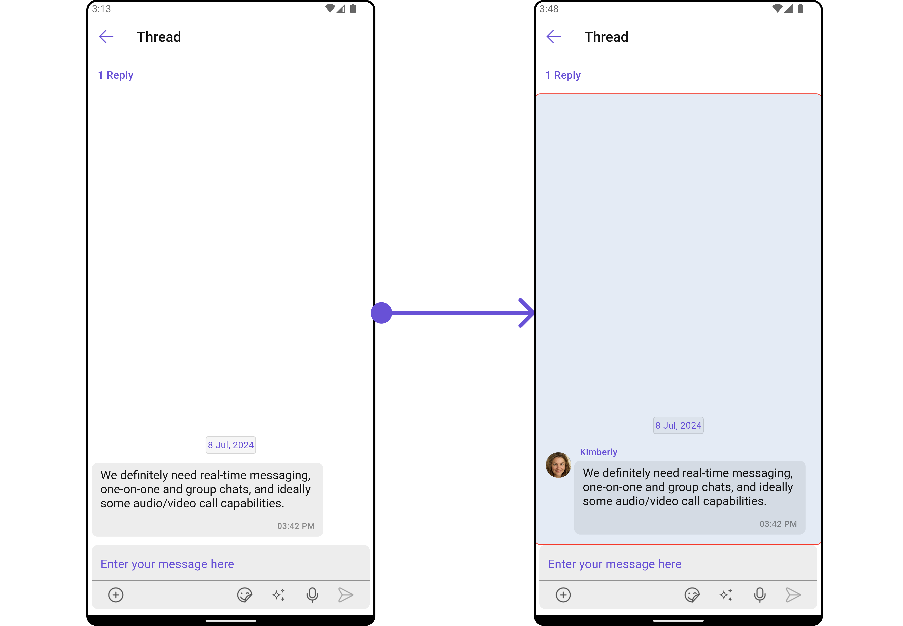

</TabItem>

<TabItem value="iOS" label="iOS">

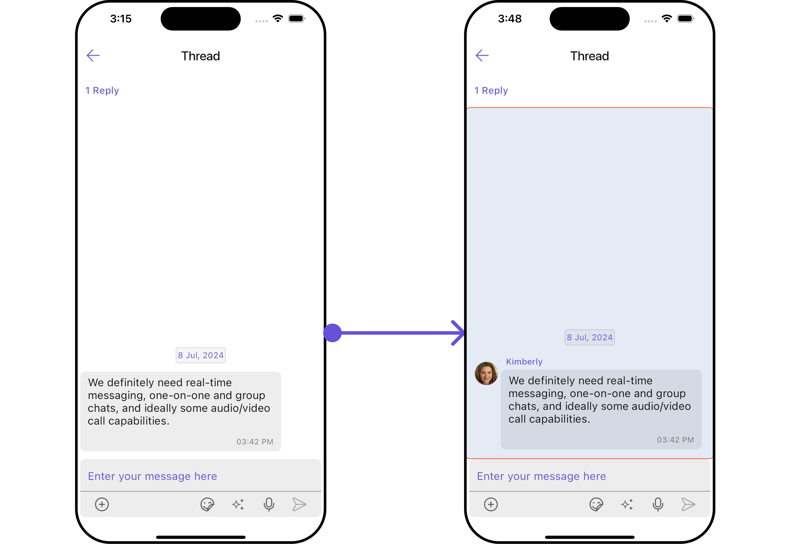

</TabItem>

</Tabs>

---

### MessageComposer

If you want to customize the properties of the [MessageComposer](/ui-kit/flutter/message-composer) Widget inside ThreadedMessages Widget, you need use the `MessageComposerConfiguration` object.

**Example**

Here is the complete example for reference:

<Tabs>

<TabItem value="Dart" label="Dart">

```dart
CometChatThreadedMessages(
  loggedInUser: loggedInUser,
  parentMessage: parentMessage,
  messageComposerConfiguration: MessageComposerConfiguration(
    messageComposerStyle: MessageComposerStyle(
      background: Color(0xFFE4EBF5),
      border: Border.all(width: 1, color: Colors.red),
      borderRadius: 10,
    ),
  ),
)
```

</TabItem>

</Tabs>

<Tabs>

<TabItem value="Android" label="Android">

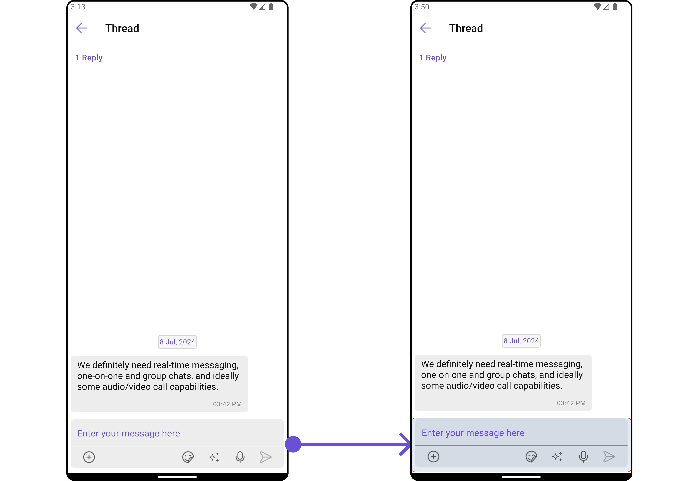

</TabItem>

<TabItem value="iOS" label="iOS">

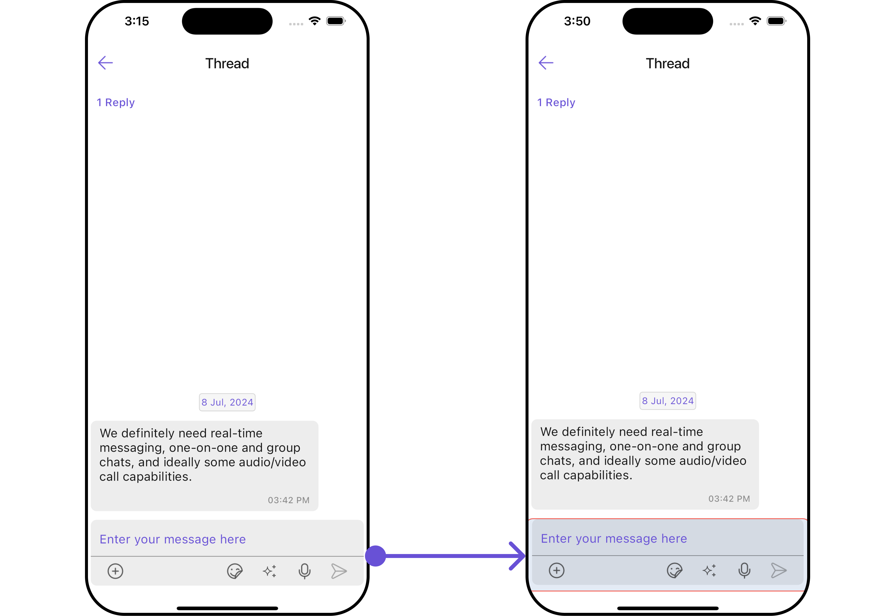

</TabItem>

</Tabs>
