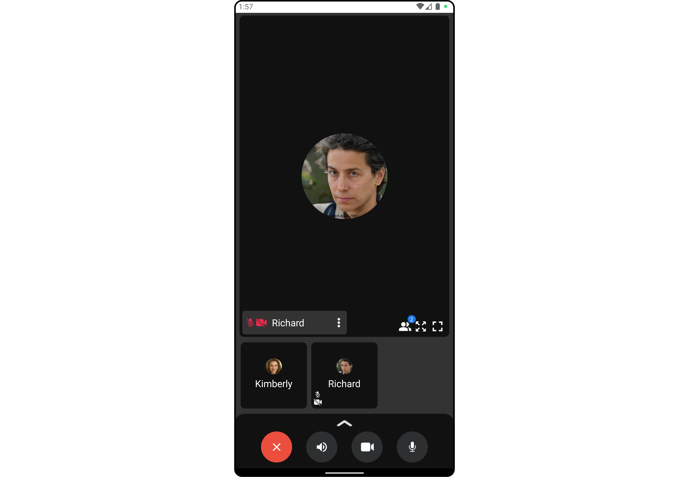
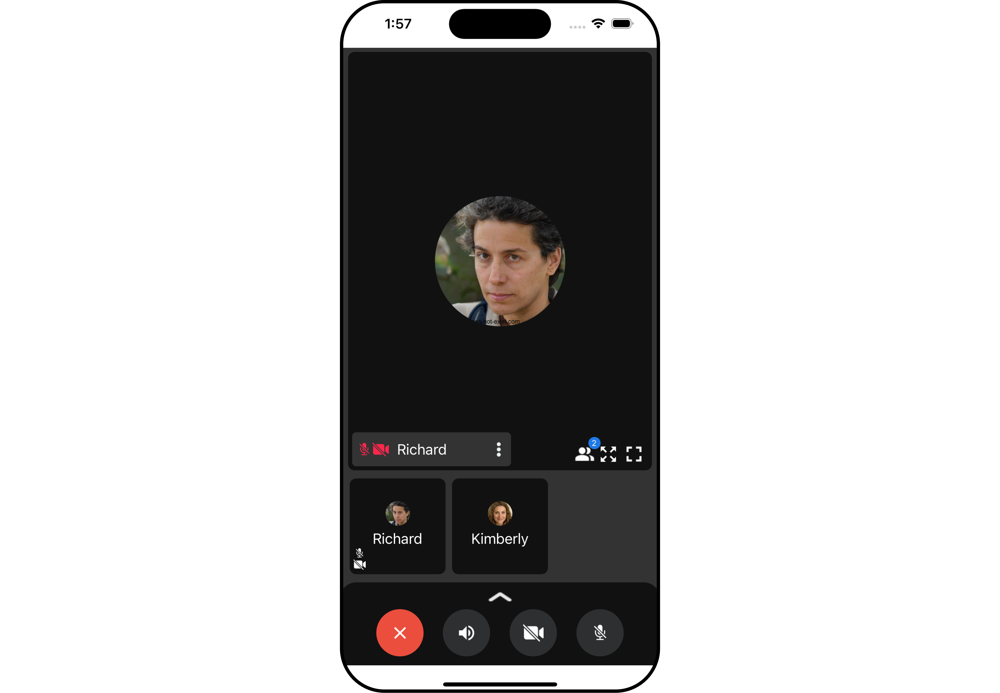

import Tabs from '@theme/Tabs';
import TabItem from '@theme/TabItem';
import { Tooltip } from 'react-tooltip'
import 'react-tooltip/dist/react-tooltip.css'

<Tooltip id="my-tooltip-html-prop" html="Not available in Group Members Configuration object"/>

## Overview

The `CometChatOngoingCall` is a [Widget](/ui-kit/android/components-overview#components) that provides users with a dedicated interface for managing real-time voice or video conversations. It includes features like a video display area for video calls, call controls for mic and camera management, participant information, call status indicators, and options for call recording and screen-sharing.

<Tabs>

<TabItem value="Android" label="Android">



</TabItem>

<TabItem value="iOS" label="iOS">



</TabItem>

</Tabs>

---

## Usage

### Integration

`CometChatOngoingCall` being a custom widget, offers versatility in its integration. It can be seamlessly launched via button clicks or any user-triggered action, enhancing the overall user experience and facilitating smoother interactions within the application.

You can launch `CometChatOngoingCall` directly using `Navigator.push`, or you can define it as a widget within the `build` method of your `State` class.

##### 1. Using Navigator to Launch `CometChatOngoingCall`

<Tabs>

<TabItem value="Dart" label="Dart">

```dart
Navigator.push(context, MaterialPageRoute(builder: (context) => CometChatOngoingCall(callSettingsBuilder: CallSettingsBuilder()..listener = this, sessionId: 'sessionId'))); // CallSettingsBuilder and Session ID is required to launch the Ongoing call widget.
```

</TabItem>

</Tabs>

##### 2. Embedding `CometChatOngoingCall` as a Widget in the build Method

<Tabs>

<TabItem value="Dart" label="Dart">

```dart
import 'package:cometchat_calls_uikit/cometchat_calls_uikit.dart';
import 'package:flutter/material.dart';

class OngoingCallExample extends StatefulWidget {
  const OngoingCallExample({super.key});

  @override
  State<OngoingCallExample> createState() => _OngoingCallExampleState();
}

class _OngoingCallExampleState extends State<OngoingCallExample> with CometChatCallsEventsListener{

  @override
  void onCallEnded() {
    // TODO("Not yet implemented")
  }

  @override
  void onError(CometChatCallsException ce) {
    // TODO("Not yet implemented")
  }

  @override
  void onRecordingToggled(RTCRecordingInfo info) {
    // TODO("Not yet implemented")
  }

  @override
  void onUserMuted(RTCMutedUser muteObj) {
    // TODO("Not yet implemented")
  }

  @override
  void onCallSwitchedToVideo(CallSwitchRequestInfo info) {
    // TODO("Not yet implemented")
  }

  @override
  // TODO("Not yet implemented")
  void onAudioModeChanged(List<AudioMode> devices) {
  }

  @override
  void onUserListChanged(List<RTCUser> users) {
    // TODO("Not yet implemented")
  }

  @override
  void onUserLeft(RTCUser user) {
    // TODO("Not yet implemented")
  }

  @override
  void onUserJoined(RTCUser user) {
    // TODO("Not yet implemented")
  }

  @override
  void onCallEndButtonPressed() {
    // TODO("Not yet implemented")
  }

  @override
  Widget build(BuildContext context) {
    return Scaffold(
      body: SafeArea(
        child: CometChatsessionId(
          callSettingsBuilder: CallSettingsBuilder()..listener = this, // CometChatCallsEventsListener
          sessionId: 'sessionId',
        ) // CallSettingsBuilder and Session ID is required to launch the Ongoing call widget.
      ),
    );
  }
}
```

</TabItem>

</Tabs>

### Actions

[Actions](/ui-kit/android/components-overview#actions) dictate how a widget functions. They are divided into two types: Predefined and User-defined. You can override either type, allowing you to tailor the behavior of the widget to fit your specific needs.

##### 1. onError

You can customize this behavior by using the provided code snippet to override the `onError` and improve error handling.

**Example**

Here is the complete example for reference:

<Tabs>

<TabItem value="Dart" label="Dart">

```dart
CometChatOngoingCall(
  callSettingsBuilder: CallSettingsBuilder()..listener = this, // CometChatCallsEventsListener
  sessionId: 'sessionId',
  onError: (e) {
    // TODO("Not yet implemented")
  },
)
```

</TabItem>

</Tabs>

---

### Filters

**Filters** allow you to customize the data displayed in a list within a Widget. You can filter the list based on your specific criteria, allowing for a more customized. Filters can be applied using RequestBuilders of Chat SDK.

You can adjust the `callSettingsBuilder` in the `OnGoing Call` Widget to customize the OnGoing Call. Numerous options are available to alter the builder to meet your specific needs. For additional details on `CallSettingsBuilder`, please visit [CallSettingsBuilder](/sdk/android/direct-calling).

##### 1. CallSettingsBuilder

The [CallSettingsBuilder](/sdk/android/direct-calling) enables you to filter and customize the call list based on available parameters in CallSettingsBuilder. This feature allows you to create more specific and targeted queries during the call. The following are the parameters available in [CallSettingsBuilder](/sdk/android/direct-calling)

**Example**

In the example below, we are applying a filter to the calls.

<Tabs>

<TabItem value="Dart" label="Dart">

```dart
CometChatOngoingCall(
  callSettingsBuilder: CallSettingsBuilder()
    ..showCallRecordButton = true
    ..setAudioOnlyCall = true
    ..startRecordingOnCallStart = true
    ..listener = this, // CometChatCallsEventsListener
  sessionId: 'sessionId',
)
```

</TabItem>

</Tabs>

---

### Events

[Events](/ui-kit/android/components-overview#events) are emitted by a `Widget`. By using event you can extend existing functionality. Being global events, they can be applied in Multiple Locations and are capable of being Added or Removed.

Events emitted by the Ongoing Call widget are as follows.

| Event           | Description                                      |
| --------------- | ------------------------------------------------ |
| **onCallEnded** | Triggers when the ongoing or outgoing call ends. |

<Tabs>

<TabItem value="Dart" label="Dart">

```dart
import 'package:cometchat_chat_uikit/cometchat_chat_uikit.dart';
import 'package:flutter/material.dart';

class YourScreen extends StatefulWidget {
  const YourScreen({super.key});

  @override
  State<YourScreen> createState() => _YourScreenState();
}

class _YourScreenState extends State<YourScreen> with CometChatCallEventListener {

  @override
  void initState() {
    super.initState();
    CometChatCallEvents.addCallEventsListener("unique_listener_ID", this); // Add the listener
  }

  @override
  void dispose(){
    super.dispose();
    CometChatCallEvents.removeCallEventsListener("unique_listener_ID"); // Remove the listener
  }

  @override
  void ccCallEnded(Call call) {
    // TODO("Not yet implemented")
  }

  @override
  Widget build(BuildContext context) {
    return const Placeholder();
  }

}
```

</TabItem>

</Tabs>

---

## Customization

To fit your app's design requirements, you can customize the appearance of the conversation widget. We provide exposed methods that allow you to modify the experience and behavior according to your specific needs.

The `CometChatOngoingCall` widget does not have any exposed style property.

---

### Functionality

These are a set of small functional customizations that allow you to fine-tune the overall experience of the widget. With these, you can change text, set custom icons, and toggle the visibility of UI elements.

The `CometChatOngoingCall` widget does not have any exposed functionality.

---

### Advanced

For advanced-level customization, you can set custom widgets to the widget. This lets you tailor each aspect of the widget to fit your exact needs and application aesthetics. You can create and define your widgets, layouts, and UI elements and then incorporate those into the widget.

The `CometChatOngoingCall` widget does not provide additional functionalities beyond this level of customization.

---
