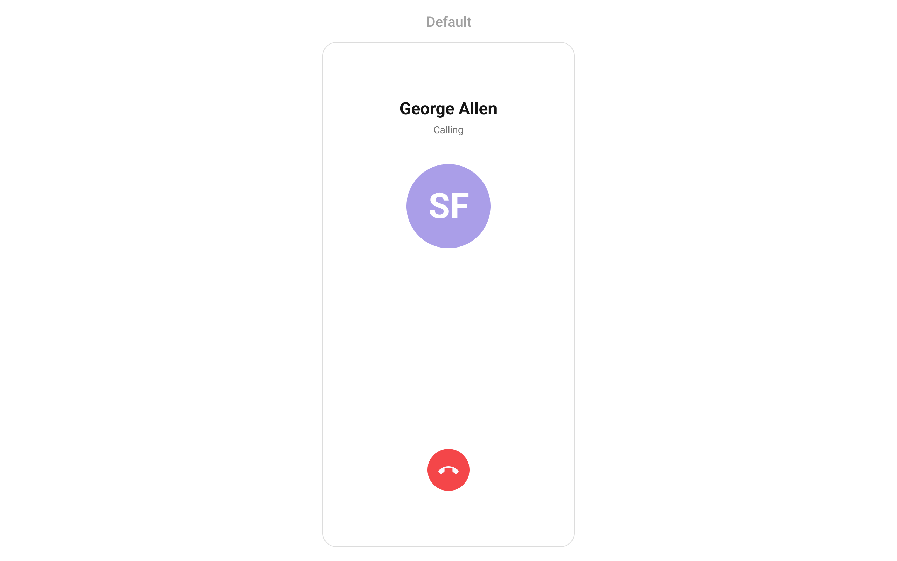
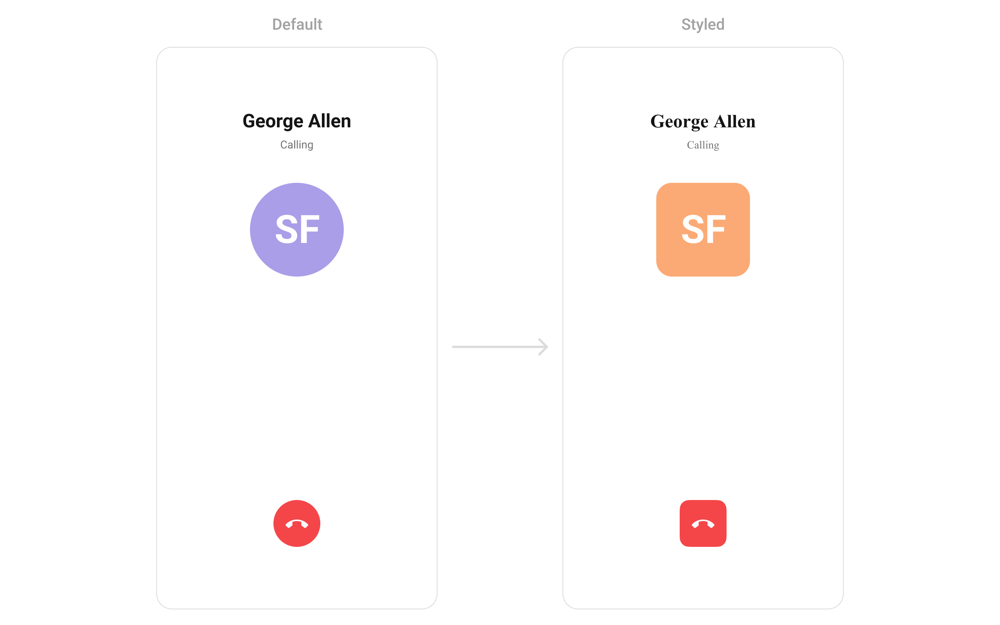
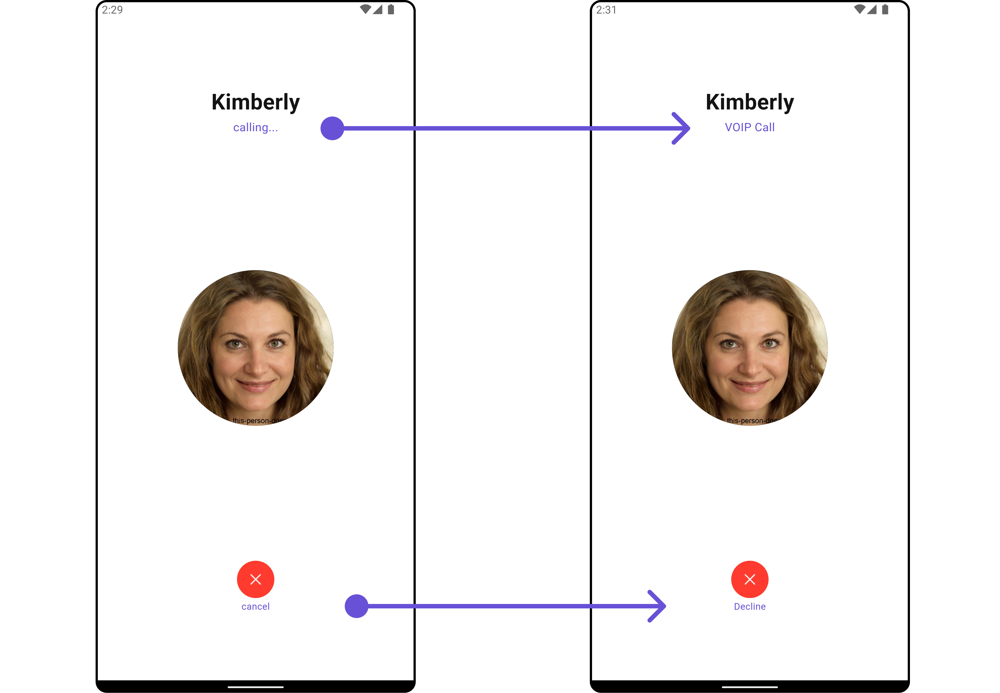
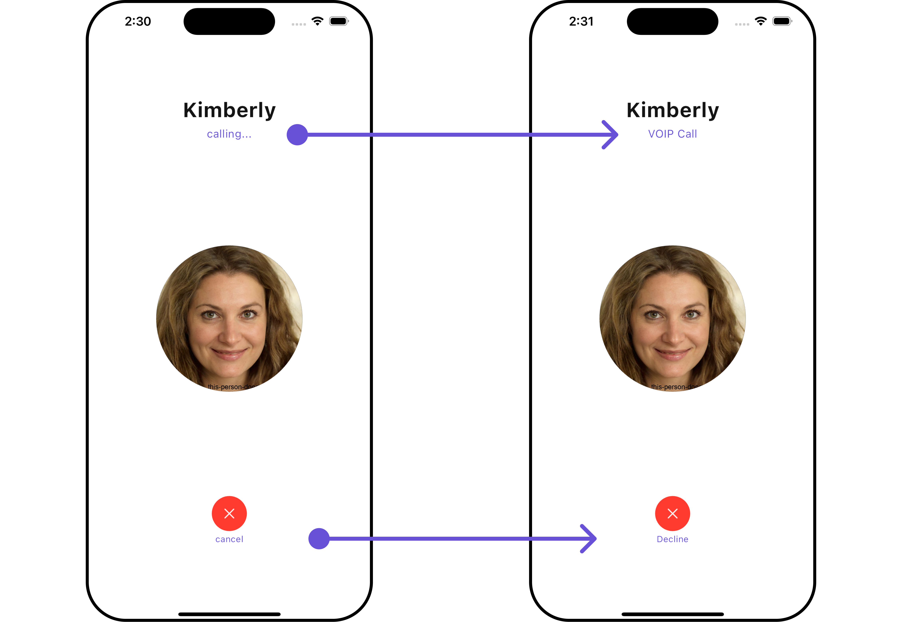

import Tabs from '@theme/Tabs';
import TabItem from '@theme/TabItem';
import { Tooltip } from 'react-tooltip'
import 'react-tooltip/dist/react-tooltip.css'

<Tooltip id="my-tooltip-html-prop" html="Not available in Group Members Configuration object"/>

## Overview

The `CometChatOutgoingCall` [Widget](/ui-kit/android/components-overview#components) is a visual representation of a user-initiated call, whether it's a voice or video call. It serves as an interface for managing outgoing calls, providing users with essential options to control the call experience. This Widget typically includes information about the call recipient, call controls for canceling the call, and feedback on the call status, such as indicating when the call is in progress.



You can launch `CometChatOutgoingCall` directly using `Navigator.push`, or you can define it as a widget within the `build` method of your `State` class.

##### 1. Using Navigator to Launch `CometChatOutgoingCall`

<Tabs>

<TabItem value="Dart" label="Dart">

```dart
Navigator.push(context, MaterialPageRoute(builder: (context) => CometChatOutgoingCall(user: user, call: callObject))); // User object and Call object is required to launch the incoming call widget.
```

</TabItem>

</Tabs>

##### 2. Embedding `CometChatOutgoingCall` as a Widget in the build Method

<Tabs>

<TabItem value="Dart" label="Dart">

```dart
import 'package:cometchat_calls_uikit/cometchat_calls_uikit.dart';
import 'package:flutter/material.dart';

class OutgoingCallExample extends StatefulWidget {
  const OutgoingCallExample({super.key});

  @override
  State<OutgoingCallExample> createState() => _OutgoingCallExampleState();
}

class _OutgoingCallExampleState extends State<OutgoingCallExample> {

  @override
  Widget build(BuildContext context) {
    return Scaffold(
      body: SafeArea(
        child: CometChatOutgoingCall(
            user: user, // User Object
            call: callObject
        ), // User object and Call object is required to launch the incoming call widget.
      ),
    );
  }
}
```

</TabItem>

</Tabs>

---

### Actions

[Actions](/ui-kit/android/components-overview#actions) dictate how a component functions. They are divided into two types: Predefined and User-defined. You can override either type, allowing you to tailor the behavior of the component to fit your specific needs.

##### 1. onDecline

The `onDecline` action is typically triggered when the call is ended, carrying out default actions. However, with the following code snippet, you can effortlessly customize or override this default behavior to meet your specific needs.

<Tabs>

<TabItem value="Dart" label="Dart">

```dart
CometChatOutgoingCall(
  user: user, // User Object
  call: callObject, // Call Object
  onDecline: (BuildContext context, Call call) {
    // TODO("Not yet implemented")
  },
)
```

</TabItem>

</Tabs>

---

##### 2. onError

You can customize this behavior by using the provided code snippet to override the `onError` and improve error handling.

<Tabs>

<TabItem value="Dart" label="Dart">

```dart
CometChatOutgoingCall(
  user: user, // User Object
  call: callObject, // Call Object
  onError: (e) {
    // TODO("Not yet implemented")
  },
)
```

</TabItem>

</Tabs>

---

### Filters

**Filters** allow you to customize the data displayed in a list within a Widget. You can filter the list based on your specific criteria, allowing for a more customized. Filters can be applied using RequestBuilders of Chat SDK.

The `CometChatOutgoingCall` Widget does not have any exposed filters.

---

### Events

[Events](/ui-kit/android/components-overview#events) are emitted by a `Widget`. By using event you can extend existing functionality. Being global events, they can be applied in Multiple Locations and are capable of being Added or Removed.

Events emitted by the Outgoing call Widget are as follows.

| Event              | Description                                  |
| ------------------ | -------------------------------------------- |
| **ccCallAccepted** | Triggers when the outgoing call is accepted. |
| **ccCallRejected** | Triggers when the outgoing call is rejected. |

**Example**

Here is the complete example for reference:

<Tabs>

<TabItem value="Dart" label="Dart">

```dart
import 'package:cometchat_chat_uikit/cometchat_chat_uikit.dart';
import 'package:flutter/material.dart';

class YourScreen extends StatefulWidget {
  const YourScreen({super.key});

  @override
  State<YourScreen> createState() => _YourScreenState();
}

class _YourScreenState extends State<YourScreen> with CometChatCallEventListener {

  @override
  void initState() {
    super.initState();
    CometChatCallEvents.addCallEventsListener("unique_listener_ID", this); // Add the listener
  }

  @override
  void dispose(){
    super.dispose();
    CometChatCallEvents.removeCallEventsListener("unique_listener_ID"); // Remove the listener
  }

  @override
  void ccCallAccepted(Call call) {
    // TODO("Not yet implemented")
  }

  @override
  void ccCallRejected(Call call) {
    // TODO("Not yet implemented")
  }

  @override
  Widget build(BuildContext context) {
    return const Placeholder();
  }

}
```

</TabItem>

</Tabs>

---

## Customization

To fit your app's design requirements, you can customize the appearance of the conversation widget. We provide exposed methods that allow you to modify the experience and behavior according to your specific needs.

### Style

You can customize the appearance of the `CometChatOutgoingCall` Widget by applying the `CometChatOutgoingCallStyle` to it using the following code snippet.

**Example**

Here is the complete example for reference:

<Tabs>

<TabItem value="Dart" label="Dart">

```dart
CometChatOutgoingCall(
  user: user, // User Object
  call: callObject, // Call Object
  style: CometChatOutgoingCallStyle(
       avatarStyle: CometChatAvatarStyle(
          backgroundColor: Color(0xFFFBAA75),
          borderRadius: BorderRadius.circular(8),
       ),
       declineButtonColor: Color(0xFFF44649),
       declineButtonBorderRadius: BorderRadius.circular(12),
     )
)
```

</TabItem>

</Tabs>



---

### Functionality

These are a set of small functional customizations that allow you to fine-tune the overall experience of the widget. With these, you can change text, set custom icons, and toggle the visibility of UI elements.

**Example**

In this example, we're enhancing the interface by customizing the decline button icons. By setting custom icons for decline buttons, users can enjoy a more visually appealing and personalized experience.

This level of customization allows developers to tailor the user interface to match the overall theme and branding of their application.

**Example**

Here is the example for reference:

<Tabs>

<TabItem value="Dart" label="Dart">

```dart
CometChatOutgoingCall(
    user: user, // User Object
    call: callObject, // Call Object
    subtitle: "VOIP Call",
    disableSoundForCalls: true,
    declineButtonText: "Decline",
)
```

</TabItem>

</Tabs>

<Tabs>

<TabItem value="Android" label="Android">



</TabItem>

<TabItem value="iOS" label="iOS">



</TabItem>

</Tabs>

Below is a list of customizations along with corresponding code snippets

| **Property**                        | Description                                               | Code                                   |
| ----------------------------------- | --------------------------------------------------------- | -------------------------------------- |
| **Custom Sound For Calls**          | Sets the custom sound for outgoing calls.                 | `customSoundForCalls: String?`         |
| **Custom Sound For Calls Package**  | Sets the package for the custom sound for outgoing calls. | `customSoundForCallsPackage: String?`  |
| **Decline Button Icon Url**         | Sets the URL for the decline button icon.                 | `declineButtonIconUrl: String?`        |
| **Decline Button Icon Url Package** | Sets the package for the decline button icon URL.         | `declineButtonIconUrlPackage: String?` |
| **Decline Button Text**             | Sets the text for the decline button.                     | `declineButtonText: String?`           |
| **Disable Sound For Calls**         | Disables sound for outgoing calls.                        | `disableSoundForCalls: bool?`          |
| **Subtitle**                        | Sets the subtitle for the outgoing call screen.           | `subtitle: String?`                    |

---

### Advanced

For advanced-level customization, you can set custom widgets to the widget. This lets you tailor each aspect of the widget to fit your exact needs and application aesthetics. You can create and define your widgets, layouts, and UI elements and then incorporate those into the widget.

The `CometChatOutgoingCall` widget does not provide additional functionalities beyond this level of customization.

---
