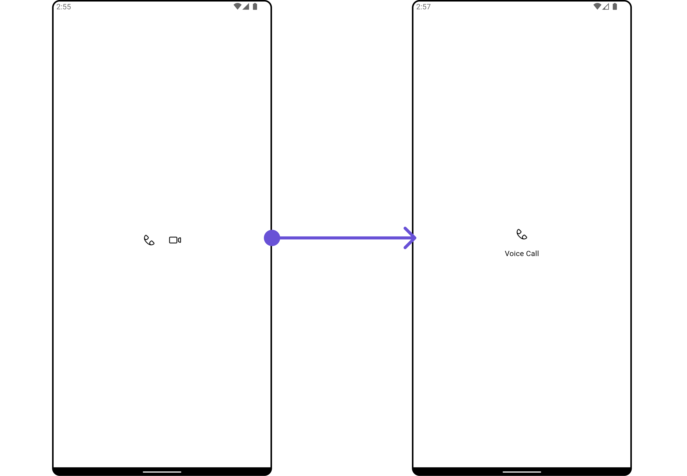
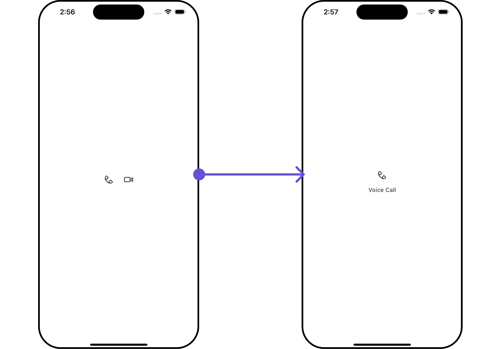

import Tabs from '@theme/Tabs';
import TabItem from '@theme/TabItem';
import { Tooltip } from 'react-tooltip'
import 'react-tooltip/dist/react-tooltip.css'

<Tooltip id="my-tooltip-html-prop" html="Not available in Group Members Configuration object"/>

## Overview

The `CometChatCallButtons` is a [Widget](/ui-kit/flutter/components-overview#components) provides users with the ability to make calls, access call-related functionalities, and control call settings. Clicking this button typically triggers the call to be placed to the desired recipient.


## Usage

### Integration

You can launch `CometChatCallButtons` directly using `Navigator.push`, or you can define it as a widget within the `build` method of your `State` class.

##### 1. Using Navigator to Launch `CometChatCallButtons`

<Tabs>

<TabItem value="Dart" label="Dart">

```dart
Navigator.push(context, MaterialPageRoute(builder: (context) => CometChatCallButtons()));
```

</TabItem>

</Tabs>

##### 2. Embedding `CometChatCallButtons` as a Widget in the build Method

<Tabs>

<TabItem value="Dart" label="Dart">

```dart
import 'package:cometchat_calls_uikit/cometchat_calls_uikit.dart';
import 'package:flutter/material.dart';

class CallButtonsExample extends StatefulWidget {
  const CallButtonsExample({super.key});

  @override
  State<CallButtonsExample> createState() => _CallButtonsExampleState();
}

class _CallButtonsExampleState extends State<CallButtonsExample> {
  @override
  Widget build(BuildContext context) {
    return Scaffold(
      body: SafeArea(
        child: Center(
          child: CometChatCallButtons()
        )
      ),
    );
  }
}
```

</TabItem>

</Tabs>

---

### Actions

[Actions](/ui-kit/flutter/components-overview#actions) dictate how a widget functions. They are divided into two types: Predefined and User-defined. You can override either type, allowing you to tailor the behavior of the widget to fit your specific needs.

##### 1. onVoiceCallClick

The `onVoiceCallClick` action is usually invoked when a voice call is initiated, executing predefined actions. However, by utilizing the provided code snippet, you can effortlessly tailor or override this default behavior to suit your unique requirements.

<Tabs>

<TabItem value="Dart" label="Dart">

```dart
CometChatCallButtons(
  onVoiceCallClick: (BuildContext buildContext, User? user, Group? group) {
    // TODO("Not yet implemented")
  },
)
```

</TabItem>

</Tabs>

---

##### 2. onVideoCallClick

The `onVideoCallClick` action is typically triggered when a video call is initiated, executing default actions. However, with the provided code snippet, you have the flexibility to easily customize or override this default behavior according to your specific preferences or requirements.

<Tabs>

<TabItem value="Dart" label="Dart">

```dart
CometChatCallButtons(
  onVideoCallClick: (BuildContext buildContext, User? user, Group? group) {
    // TODO("Not yet implemented")
  },
)
```

</TabItem>

</Tabs>

---

##### 3. onError

You can customize this behavior by using the provided code snippet to override the `onError` and improve error handling.

<Tabs>

<TabItem value="Dart" label="Dart">

```dart
CometChatCallButtons(
  onError: (e) {
    // TODO("Not yet implemented")
  },
)
```

</TabItem>

</Tabs>

---

### Filters

**Filters** allow you to customize the data displayed in a list within a Widget. You can filter the list based on your specific criteria, allowing for a more customized. Filters can be applied using RequestBuilders of Chat SDK.

The CallButton widget does not have any exposed filters.

---

### Events

[Events](/ui-kit/flutter/components-overview#events) are emitted by a `Widget`. By using event you can extend existing functionality. Being global events, they can be applied in Multiple Locations and are capable of being Added or Removed.

Events emitted by the Call buttons widget are as follows.

| Event              | Description                                  |
| ------------------ | -------------------------------------------- |
| **ccCallAccepted** | Triggers when the outgoing call is accepted. |
| **ccCallRejected** | Triggers when the outgoing call is rejected. |

<Tabs>

<TabItem value="Dart" label="Dart">

```dart
import 'package:cometchat_chat_uikit/cometchat_chat_uikit.dart';
import 'package:flutter/material.dart';

class YourScreen extends StatefulWidget {
  const YourScreen({super.key});

  @override
  State<YourScreen> createState() => _YourScreenState();
}

class _YourScreenState extends State<YourScreen> with CometChatCallEventListener {

  @override
  void initState() {
    super.initState();
    CometChatCallEvents.addCallEventsListener("unique_listener_ID", this); // Add the listener
  }

  @override
  void dispose(){
    super.dispose();
    CometChatCallEvents.removeCallEventsListener("unique_listener_ID"); // Remove the listener
  }

  @override
  void ccCallAccepted(Call call) {
    // TODO("Not yet implemented")
  }

  @override
  void ccCallRejected(Call call) {
    // TODO("Not yet implemented")
  }

  @override
  Widget build(BuildContext context) {
    return const Placeholder();
  }

}
```

</TabItem>

</Tabs>

---

## Customization

To fit your app's design requirements, you can customize the appearance of the conversation widget. We provide exposed methods that allow you to modify the experience and behavior according to your specific needs.

### Style

You can customize the appearance of the `CometChatCallButtons` Widget by applying the `CometChatCallButtonsStyle` to it using the following code snippet.

<Tabs>

<TabItem value="Dart" label="Dart">

```dart
CometChatCallButtons(
  style: CometChatCallButtonsStyle(
            voiceCallIconColor: Color(0xFF6852D6),
            videoCallIconColor: Color(0xFF6852D6),
            voiceCallButtonColor: Color(0xFFEDEAFA),
            videoCallButtonColor: Color(0xFFEDEAFA),
            voiceCallButtonBorderRadius: BorderRadius.circular(12.5),
            videoCallButtonBorderRadius: BorderRadius.circular(12.5),
            videoCallButtonBorder: BorderSide(
              color: Color(0xFFE8E8E8),
              width: 1,
            ),
            voiceCallButtonBorder: BorderSide(
              color: Color(0xFFE8E8E8),
              width: 1,
            ),
    )
)
```

</TabItem>

</Tabs>


---

### Functionality

These are a set of small functional customizations that allow you to fine-tune the overall experience of the widget. With these, you can change text, set custom icons, and toggle the visibility of UI elements.

**Example**

Here is the example for reference:

<Tabs>

<TabItem value="Dart" label="Dart">

```dart
CometChatCallButtons(
  voiceCallIconText: "Voice Call",
  hideVideoCall: true,
)
```

</TabItem>

</Tabs>

<Tabs>

<TabItem value="Android" label="Android">



</TabItem>

<TabItem value="iOS" label="iOS">



</TabItem>

</Tabs>

Below is a list of customizations along with corresponding code snippets

| **Property**                   | Description                                    | Code                              |
| ------------------------------ | ---------------------------------------------- | --------------------------------- |
| **Hide Video Call**            | Hides the video call button.                   | `hideVideoCall: bool?`            |
| **Hide Voice Call**            | Hides the voice call button.                   | `hideVoiceCall: bool?`            |
| **Video Call Icon**            | Sets the icon for the video call button.       | `videoCallIcon: Icon?`            |
| **Video Call Icon Hover Text** | Sets the hover text for the video call button. | `videoCallIconHoverText: String?` |
| **Video Call Icon Text**       | Sets the text for the video call button.       | `videoCallIconText: String?`      |
| **Voice Call Icon**            | Sets the icon for the voice call button.       | `voiceCallIcon: Icon?`            |
| **Voice Call Icon Hover Text** | Sets the hover text for the voice call button. | `voiceCallIconHoverText: String?` |
| **Voice Call Icon Text**       | Sets the text for the voice call button.       | `voiceCallIconText: String?`      |

---

### Advanced

For advanced-level customization, you can set custom views to the widget. This lets you tailor each aspect of the widget to fit your exact needs and application aesthetics. You can create and define your views, layouts, and UI elements and then incorporate those into the widget.

The `CometChatCallButtons` widget does not provide additional functionalities beyond this level of customization.

---
