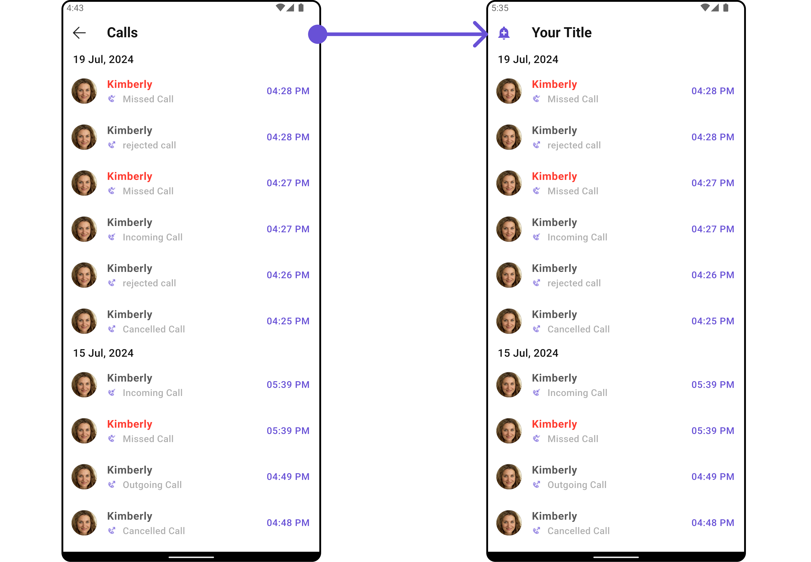

import Tabs from '@theme/Tabs';
import TabItem from '@theme/TabItem';
import { Tooltip } from 'react-tooltip'
import 'react-tooltip/dist/react-tooltip.css'

<Tooltip id="my-tooltip-html-prop" html="Not available in Group Members Configuration object"/>

## Overview

`CometChatCallLogs` is a [Widget](/ui-kit/flutter/components-overview#components) that shows the list of Call Logs available. By default, names are shown for all listed users, along with their avatars if available.


The `CometChatCallLogs` widget is composed of the following BaseWidgets:

| Widgets                                        | Description                                                                                                                                                                             |
| ---------------------------------------------- | --------------------------------------------------------------------------------------------------------------------------------------------------------------------------------------- |
| [CometChatListBase](/ui-kit/flutter/list-base) | `CometChatListBase` is a container widget featuring a title, customizable background options, and a dedicated list widget for seamless integration within your application's interface. |
| [CometChatListItem](/ui-kit/flutter/list-item) | This widget displays data retrieved from a CallLog object on a card, presenting a title and subtitle.                                                                                   |

## Usage

### Integration

`CometChatCallLogs` being a wrapper widget, offers versatility in its integration. It can be seamlessly launched via button clicks or any user-triggered action, enhancing the overall user experience and facilitating smoother interactions within the application.

You can launch `CometChatCallLogs` directly using `Navigator.push`, or you can define it as a widget within the `build` method of your `State` class.

##### 1. Using Navigator to Launch `CometChatCallLogs`

<Tabs>

<TabItem value="Dart" label="Dart">

```dart
Navigator.push(context, MaterialPageRoute(builder: (context) => CometChatCallLogs()));
```

</TabItem>

</Tabs>

##### 2. Embedding `CometChatCallLogs` as a Widget in the build Method

<Tabs>

<TabItem value="Dart" label="Dart">

```dart
import 'package:cometchat_calls_uikit/cometchat_calls_uikit.dart';
import 'package:flutter/material.dart';

class CallLogsExample extends StatefulWidget {
  const CallLogsExample({super.key});

  @override
  State<CallLogsExample> createState() => _CallLogsExampleState();
}

class _CallLogsExampleState extends State<CallLogsExample> {

  @override
  Widget build(BuildContext context) {
    return const Scaffold(
      body: SafeArea(
        child: CometChatCallLogs(),
      ),
    );
  }
}
```

</TabItem>

</Tabs>

---

### Actions

[Actions](/ui-kit/flutter/components-overview#actions) dictate how a widget functions. They are divided into two types: Predefined and User-defined. You can override either type, allowing you to tailor the behavior of the widget to fit your specific needs.

##### 1. onItemClick

This method proves valuable when users seek to override the `onItemClick` functionality within CometChatCallLogs, empowering them with greater control and customization options.

The `onItemClick` action doesn't have a predefined behavior. You can override this action using the following code snippet.

<Tabs>

<TabItem value="Dart" label="Dart">

```dart
CometChatCallLogs(
  onItemClick: (callLog) {
    // TODO("Not yet implemented")
  },
)
```

</TabItem>

</Tabs>

---

##### 2. OnError

You can customize this behavior by using the provided code snippet to override the `OnError` and improve error handling.

<Tabs>

<TabItem value="Dart" label="Dart">

```dart
CometChatCallLogs(
  onError: (e) {
    // TODO("Not yet implemented")
  },
)
```

</TabItem>

</Tabs>

---

##### 3. onBack

You can customize this behavior by using the provided code snippet to override the `onBack` and improve error handling.

<Tabs>

<TabItem value="Dart" label="Dart">

```dart
CometChatCallLogs(
  onBack: () {
    // TODO("Not yet implemented")
  },
)
```

</TabItem>

</Tabs>

---

##### 4. onInfoIconClick

You can customize this behavior by using the provided code snippet to override the `onInfoIconClick` and improve error handling.

<Tabs>

<TabItem value="Dart" label="Dart">

```dart
CometChatCallLogs(
  onInfoIconClick: (CallLog callLog) {
    // TODO("Not yet implemented")
  },
)
```

</TabItem>

</Tabs>

---

### Filters

**Filters** allow you to customize the data displayed in a list within a Widget. You can filter the list based on your specific criteria, allowing for a more customized. Filters can be applied using RequestBuilders of Chat SDK.

##### 1. CallLogRequestBuilder

The [CallLogRequestBuilder](/sdk/flutter/call-logs) enables you to filter and customize the call list based on available parameters in CallLogRequestBuilder. This feature allows you to create more specific and targeted queries during the call. The following are the parameters available in [CallLogRequestBuilder](/sdk/flutter/call-logs)

**Example**

In the example below, we are applying a filter based on the limit and have a call recording.

<Tabs>

<TabItem value="Dart" label="Dart">

```dart
CometChatCallLogs(
  callLogsRequestBuilder: CallLogRequestBuilder()
    ..limit = 10
    ..hasRecording = true,
)
```

</TabItem>

</Tabs>

List of properties exposed by `CallLogRequestBuilder`

| **Property**       | Description                                                 | Code                     |
| ------------------ | ----------------------------------------------------------- | ------------------------ |
| **Auth Token**     | Sets the authentication token.                              | `authToken: String?`     |
| **Call Category**  | Sets the category of the call.                              | `callCategory: String?`  |
| **Call Direction** | Sets the direction of the call.                             | `callDirection: String?` |
| **Call Status**    | Sets the status of the call.                                | `callStatus: String?`    |
| **Call Type**      | Sets the type of the call.                                  | `callType: String?`      |
| **Guid**           | Sets the unique ID of the group involved in the call.       | `guid: String?`          |
| **Has Recording**  | Indicates if the call has a recording.                      | `hasRecording: bool`     |
| **Limit**          | Sets the maximum number of call logs to return per request. | `limit: int`             |
| **Uid**            | Sets the unique ID of the user involved in the call.        | `uid: String?`           |

---

### Events

[Events](/ui-kit/flutter/components-overview#events) are emitted by a `Widget`. By using event you can extend existing functionality. Being global events, they can be applied in Multiple Locations and are capable of being Added or Removed.

The `CometChatCallLogs` widget does not have any exposed events.

---

## Customization

To fit your app's design requirements, you can customize the appearance of the conversation widget. We provide exposed methods that allow you to modify the experience and behavior according to your specific needs.

### Style

You can customize the appearance of the `CometChatCallLogs` Widget by applying the `CometChatCallLogsStyle` to it using the following code snippet.

<Tabs>

<TabItem value="Dart" label="Dart">

```dart
CometChatCallLogs(
  callLogsStyle: CometChatCallLogsStyle(
      titleTextColor: Color(0xFFF76808),
      separatorColor: Color(0xFFF76808),
      avatarStyle: CometChatAvatarStyle(
            borderRadius: BorderRadius.circular(8),
            backgroundColor: Color(0xFFFBAA75),
      ),
   ),
)
```

</TabItem>

</Tabs>


---

### Functionality

These are a set of small functional customizations that allow you to fine-tune the overall experience of the widget. With these, you can change text, set custom icons, and toggle the visibility of UI elements.

<Tabs>

<TabItem value="Dart" label="Dart">

```dart
CometChatCallLogs(
  title: "Your Title",
  backButton: Icon(Icons.add_alert, color: Color(0xFF6851D6)),
)
```

</TabItem>

</Tabs>

<Tabs>

<TabItem value="Android" label="Android">



</TabItem>

<TabItem value="iOS" label="iOS">


</TabItem>

</Tabs>

Below is a list of customizations along with corresponding code snippets

| **Property**                  | **Description**                                  | **Code**                                         |
| ----------------------------- | ------------------------------------------------ | ------------------------------------------------ |
| **Back Button**               | A widget for the back button.                    | `backButton: Widget?`                            |
| **Call Logs Request Builder** | Builder for creating call log requests.          | `callLogsRequestBuilder: CallLogRequestBuilder?` |
| **Date Pattern**              | Format pattern for date display.                 | `datePattern: String?`                           |
| **Date Separator Pattern**    | Format pattern for date separator.               | `dateSeparatorPattern: String?`                  |
| **Empty State Text**          | Text to display when there are no call logs.     | `emptyStateText: String?`                        |
| **Error State Text**          | Text to display when there is an error.          | `errorStateText: String?`                        |
| **Hide Separator**            | Whether to hide the separator between call logs. | `hideSeparator: bool`                            |
| **Incoming Audio Call Icon**  | Icon for incoming audio calls.                   | `incomingAudioCallIcon: Icon?`                   |
| **Incoming Video Call Icon**  | Icon for incoming video calls.                   | `incomingVideoCallIcon: Icon?`                   |
| **Info Icon Url**             | URL for the info icon.                           | `infoIconUrl: String?`                           |
| **Loading Icon Url**          | URL for the loading icon.                        | `loadingIconUrl: String?`                        |
| **Missed Audio Call Icon**    | Icon for missed audio calls.                     | `missedAudioCallIcon: Icon?`                     |
| **Missed Video Call Icon**    | Icon for missed video calls.                     | `missedVideoCallIcon: Icon?`                     |
| **Outgoing Audio Call Icon**  | Icon for outgoing audio calls.                   | `outgoingAudioCallIcon: Icon?`                   |
| **Outgoing Video Call Icon**  | Icon for outgoing video calls.                   | `outgoingVideoCallIcon: Icon?`                   |
| **Show Back Button**          | Whether to show the back button.                 | `showBackButton: bool?`                          |
| **Title**                     | Title for the call logs section.                 | `title: String?`                                 |

---

### Advanced

For advanced-level customization, you can set custom widgets to the widget. This lets you tailor each aspect of the widget to fit your exact needs and application aesthetics. You can create and define your widgets, layouts, and UI elements and then incorporate those into the widget.

#### ListItemView

With this property, you can assign a custom ListItem to the Call Logs Widget.

**Example**

Here is the complete example for reference:

<Tabs>

<TabItem value="Dart" label="Dart">

```dart
 CometChatCallLogs(
      listItemView: (callLog, context) {
        final status =
            getCallStatus(context, callLog, CometChatUIKit.loggedInUser);
        IconData icon = Icons.call;
        Color? color;
        Color? textColor;
        if (status == "Incoming Call") {
          icon = Icons.phone_callback_rounded;
          color = Color(0xFF6852D6);
        } else if (status == "Outgoing Call") {
          icon = Icons.phone_forwarded;
          color = Color(0xFF6852D6);
        } else if (status == "Missed Call") {
          icon = Icons.phone_missed;
          color = Colors.red;
          textColor = Colors.red;
        }

        String name = "";

        if (CometChatUIKit.loggedInUser != null) {
          if (callLog.initiator is CallUser && callLog.receiver is CallUser) {
            CallUser callUserInitiator = callLog.initiator as CallUser;
            CallUser callUserReceiver = callLog.receiver as CallUser;
            if (CometChatUIKit.loggedInUser?.uid == callUserInitiator.uid) {
              name = callUserReceiver.name ?? "";
            } else {
              name = callUserInitiator.name ?? "";
            }
          } else if (callLog.initiator is CallUser &&
              callLog.receiver is CallGroup) {
            CallUser callUserInitiator = callLog.initiator as CallUser;
            CallGroup callGroupReceiver = callLog.receiver as CallGroup;
            if (CometChatUIKit.loggedInUser?.uid == callUserInitiator.uid) {
              name = callGroupReceiver.name ?? "";
            } else {
              name = callUserInitiator.name ?? "";
            }
          }
        }

        //TODO: import DateFormat from intl package
        String formattedDate = DateFormat('d MMM, hh:mm a').format(
            DateTime.fromMillisecondsSinceEpoch(
                (callLog.initiatedAt ?? 0) * 1000));

        return ListTile(
          leading: CircleAvatar(
            backgroundColor: Color(0xFFEDEAFA),
            child: Icon(
              icon,
              color: color,
              size: 24,
            ),
          ),
          title: Text(
            name,
            style: TextStyle(
                fontSize: 16,
                fontWeight: FontWeight.w500,
                color: textColor ?? Color(0xFF141414),
                letterSpacing: 0),
          ),
          subtitle: Text(
            status,
            style: TextStyle(
                color: Color(0xFF727272),
                fontSize: 14,
                fontWeight: FontWeight.w400,
                letterSpacing: 0),
          ),
          trailing: Text(
            formattedDate,
            style: TextStyle(
                color: Color(0xFF727272),
                fontSize: 14,
                fontWeight: FontWeight.w400,
                letterSpacing: 0),
          ),
        );
      },
    );
```

</TabItem>
<TabItem value="getCallStatus" label="getCallStatus">

```dart
 /// Returns the call status message.
  static String getCallStatus(
      BuildContext context, CallLog callLog, User? loggedInUser) {
    String callMessageText = "";
    //check if the message is a call message and the receiver type is user
    if (callLog.receiverType == ReceiverTypeConstants.user) {
      CallUser initiator = callLog.initiator as CallUser;
      //check if the call is initiated
      if (callLog.status == CallStatusConstants.initiated) {
        //check if the logged in user is the initiator
        if (!isLoggedInUser(initiator, loggedInUser)) {
          callMessageText = "Incoming Call";
        } else {
          callMessageText = "Outgoing Call";
        }
      } else if (callLog.status == CallStatusConstants.ongoing) {
        callMessageText = "Call Accepted";
      } else if (callLog.status == CallStatusConstants.ended) {
        callMessageText = "Call Ended";
      } else if (callLog.status == CallStatusConstants.unanswered) {
        if (isLoggedInUser(initiator, loggedInUser)) {
          callMessageText = "Call Unanswered";
        } else {
          callMessageText = "Missed Call";
        }
      } else if (callLog.status == CallStatusConstants.cancelled) {
        if (isLoggedInUser(initiator, loggedInUser)) {
          callMessageText = "Call Cancelled";
        } else {
          callMessageText = "Missed Call";
        }
      } else if (callLog.status == CallStatusConstants.rejected) {
        if (isLoggedInUser(initiator, loggedInUser)) {
          callMessageText = "Call Rejected";
        } else {
          callMessageText = "Missed Call";
        }
      } else if (callLog.status == CallStatusConstants.busy) {
        if (isLoggedInUser(initiator, loggedInUser)) {
          callMessageText = "Call Rejected";
        } else {
          callMessageText = "Missed Call";
        }
      }
    }
    return callMessageText;
  }

  /// Returns true if the call is initiated by the logged in user.
  static bool isLoggedInUser(CallUser? initiator, User? loggedInUser) {
    if (initiator == null || loggedInUser == null) {
      return false;
    } else {
      return initiator.uid == loggedInUser.uid;
    }
  }
```

</TabItem>

</Tabs>


---

#### SubtitleView

You can customize the subtitle widget for each call logs item to meet your requirements

**Example**

Here is the complete example for reference:

<Tabs>

<TabItem value="Dart" label="Dart">

```dart
CometChatCallLogs(
      subTitleView: (callLog, context) {
        return Row(
          children: [
            getCallIcon(context, callLog, CometChatUIKit.loggedInUser),
            Text(
              getCallStatus(context, callLog, CometChatUIKit.loggedInUser),
              style: TextStyle(
                  color: Color(0xFF727272),
                  fontSize: 14,
                  fontWeight: FontWeight.w400,
                  letterSpacing: 0),
            )
          ],
        );
      },
    );
```

</TabItem>

<TabItem value="getCallIcon" label="getCallIcon">

```dart
 /// [getCallIcon] Return call status icon
  static Widget getCallIcon(
      BuildContext context, CallLog callLog, User? loggedInUser) {
    bool isInitiatedByUser =
        CallUtils.callLogLoggedInUser(callLog, loggedInUser);

    // Define default icons if not provided
    Widget incoming = Icon(
      Icons.call_received_outlined,
      color: Colors.red,
      size: 16,
    );

    Widget outgoing = Icon(
      Icons.call_made_outlined,
      color: Color(0xFF09C26F),
      size: 16,
    );

    Widget missed = Icon(
      Icons.call_received_outlined,
      color: Colors.red,
      size: 16,
    );

    // Helper function to select icon based on initiator and call type
    Widget selectIcon(bool isInitiatedByUser) {
      return isInitiatedByUser ? outgoing : incoming;
    }

    // Switch on call status to determine the appropriate icon
    switch (callLog.status) {
      case CallStatusConstants.initiated:
      case CallStatusConstants.ongoing:
      case CallStatusConstants.ended:
        return selectIcon(isInitiatedByUser);

      case CallStatusConstants.unanswered:
      case CallStatusConstants.cancelled:
      case CallStatusConstants.rejected:
      case CallStatusConstants.busy:
        return isInitiatedByUser ? outgoing : missed;

      default:
        return const SizedBox(); // Return empty widget for unknown statuses
    }
  }
```

</TabItem>

<TabItem value="getCallStatus" label="getCallStatus">

```dart
 /// Returns the call status message.
  static String getCallStatus(
      BuildContext context, CallLog callLog, User? loggedInUser) {
    String callMessageText = "";
    //check if the message is a call message and the receiver type is user
    if (callLog.receiverType == ReceiverTypeConstants.user) {
      CallUser initiator = callLog.initiator as CallUser;
      //check if the call is initiated
      if (callLog.status == CallStatusConstants.initiated) {
        //check if the logged in user is the initiator
        if (!isLoggedInUser(initiator, loggedInUser)) {
          callMessageText = "Incoming Call";
        } else {
          callMessageText = "Outgoing Call";
        }
      } else if (callLog.status == CallStatusConstants.ongoing) {
        callMessageText = "Call Accepted";
      } else if (callLog.status == CallStatusConstants.ended) {
        callMessageText = "Call Ended";
      } else if (callLog.status == CallStatusConstants.unanswered) {
        if (isLoggedInUser(initiator, loggedInUser)) {
          callMessageText = "Call Unanswered";
        } else {
          callMessageText = "Missed Call";
        }
      } else if (callLog.status == CallStatusConstants.cancelled) {
        if (isLoggedInUser(initiator, loggedInUser)) {
          callMessageText = "Call Cancelled";
        } else {
          callMessageText = "Missed Call";
        }
      } else if (callLog.status == CallStatusConstants.rejected) {
        if (isLoggedInUser(initiator, loggedInUser)) {
          callMessageText = "Call Rejected";
        } else {
          callMessageText = "Missed Call";
        }
      } else if (callLog.status == CallStatusConstants.busy) {
        if (isLoggedInUser(initiator, loggedInUser)) {
          callMessageText = "Call Rejected";
        } else {
          callMessageText = "Missed Call";
        }
      }
    }
    return callMessageText;
  }

  /// Returns true if the call is initiated by the logged in user.
  static bool isLoggedInUser(CallUser? initiator, User? loggedInUser) {
    if (initiator == null || loggedInUser == null) {
      return false;
    } else {
      return initiator.uid == loggedInUser.uid;
    }
  }
```

</TabItem>

</Tabs>


---

#### TailView

You can customize the tail widget for each call logs item to meet your requirements

**Example**

Here is the complete example for reference:

<Tabs>

<TabItem value="Dart" label="Dart">

```dart
CometChatCallLogs(
  tailView: (context, callLog) {
      String formattedDate = DateFormat('d MMM, hh:mm a').format(
            DateTime.fromMillisecondsSinceEpoch(
            (callLog.initiatedAt ?? 0) * 1000));
      return Text(
            formattedDate,
            style: TextStyle(
                  color: Color(0xFF727272),
                  fontSize: 14,
                  fontWeight: FontWeight.w400,
                  letterSpacing: 0),
            );
       },
)
```

</TabItem>

</Tabs>


---

## Configurations

[Configurations](/ui-kit/flutter/components-overview#configurations) offer the ability to customize the properties of each widget within a Composite Widget.

`CometChatCallLogs` has `CometChatOutgoingCall` widget. Hence, each of these widgets will have its individual `Configuration``.

- `Configurations` expose properties that are available in its individual widgets.

#### Outgoing Call

You can customize the properties of the OutGoing Call widget by making use of the `OutgoingCallConfiguration`. You can accomplish this by employing the `outgoingCallConfiguration` props as demonstrated below:

**Example**

Here is the complete example for reference:

<Tabs>

<TabItem value="Dart" label="Dart">

```dart
CometChatCallLogs(
  outgoingCallConfiguration: OutgoingCallConfiguration(
    subtitle: "Outgoing Call",
    outgoingCallStyle: OutgoingCallStyle(
      background: Color(0xFFE4EBF5),
    )
  ),
)
```

</TabItem>

</Tabs>

<Tabs>

<TabItem value="Android" label="Android">


</TabItem>

<TabItem value="iOS" label="iOS">


</TabItem>

</Tabs>

All exposed properties of `OutgoingCallConfiguration` can be found under [OutGoing Call](./outgoing-call#functionality). Properties marked with the <a data-tooltip-id="my-tooltip-html-prop"><span class="material-icons red">report</span></a> symbol are not accessible within the Configuration Object.

---
