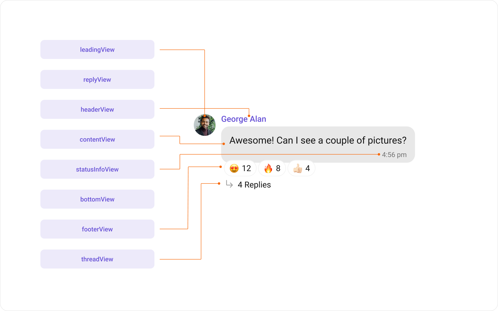
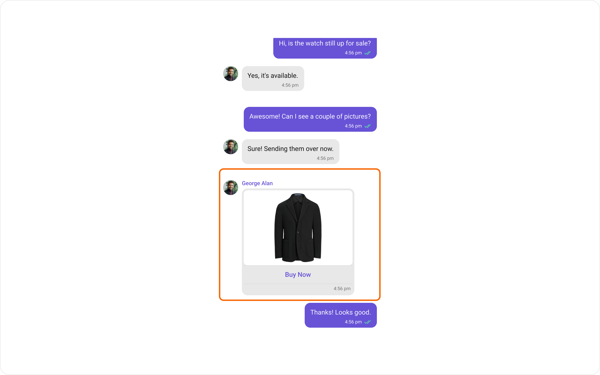
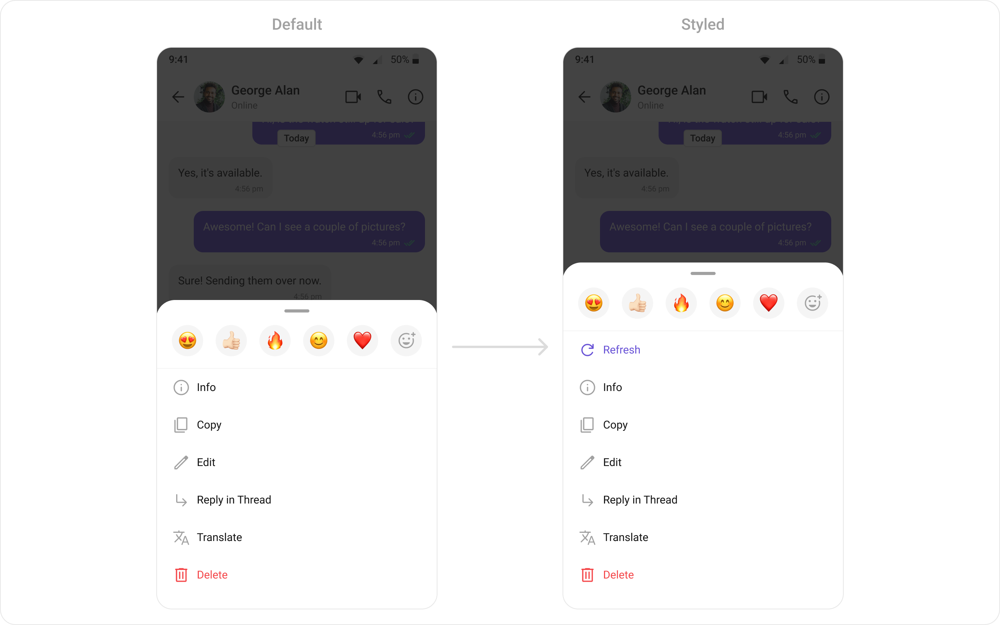
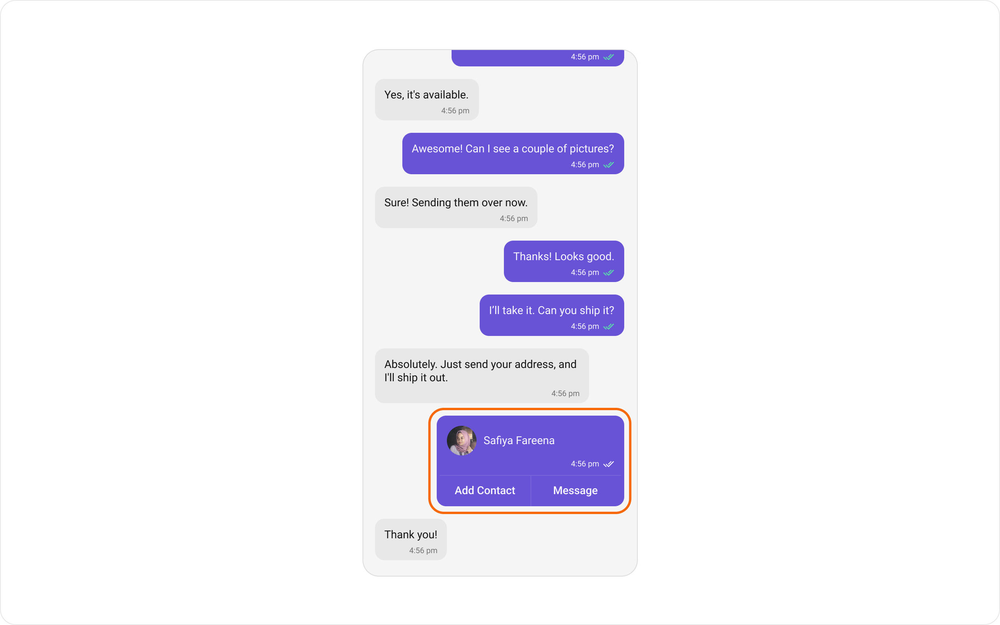

import Tabs from '@theme/Tabs';
import TabItem from '@theme/TabItem';
import { Tooltip } from 'react-tooltip'
import 'react-tooltip/dist/react-tooltip.css'

<Tooltip id="my-tooltip-html-prop" html="Not available in Group Members Configuration object"/>

## Overview

A MessageTemplate provides you with the capability to define and customize both the structure and the behavior of the [MessageBubble](/ui-kit/flutter/message-bubble). It acts as a schema or design blueprint for the creation of a variety of [MessageBubble](/ui-kit/flutter/message-bubble) widgets, allowing you to manage the appearance and interactions of [MessageBubble](/ui-kit/flutter/message-bubble) within your application effectively and consistently.

### Structure



The MessageBubble structure can typically be broken down into the following widgets:

1. **Leading widget**: This is where the sender's avatar is displayed. It's typically on the left of the MessageBubble for messages from others and on the right for messages from the current user.

2. **Header widget**: This displays the sender's name and is especially useful in group chats where multiple users are sending messages.

3. **Content widget**: This is the core of the MessageBubble where the message content (text, images, videos, etc.) is displayed.

4. **Bottom widget**: This widget can be used to extend the MessageBubble with additional elements, such as link previews or a 'load more' button for long messages. It's typically placed beneath the Content widget.

5. **Footer widget**: This is where the timestamp of the message and its delivery or read status are displayed. It's located at the bottom of the MessageBubble.

### Properties

MessageTemplate provides you with methods that allow you to alter various properties of the MessageBubble. These properties include aspects such as the `type` and `category` of a message, the appearance and behavior of the header, content, and footer sections of the message bubble,

1. **Type**

   Using `type` you can set the type of CometChatMessage, This will map your MessageTemplate to the corresponding CometChatMessage. You can set the MessageTemplate Type using the following code snippet.

   <Tabs>

   <TabItem value="Dart" label="Dart">

   ```dart
   CometChatMessageTemplate cometChatMessageTemplate = CometChatMessageTemplate(type: MessageTypeConstants.text);
   ```

   </TabItem>

   </Tabs>

2. **Category**

   Using `category` you can set the category of a MessageTemplate. This will create a MessageTemplate with the specified category and link it with a CometChatMessage of the same category.

   Please refer to our guide on [Message Categories](/sdk/flutter/message-structure-and-hierarchy) for a deeper understanding of message categories.

   <Tabs>

   <TabItem value="Dart" label="Dart">

   ```dart
   CometChatMessageTemplate cometChatMessageTemplate = CometChatMessageTemplate(category: MessageCategoryConstants.custom);
   ```

   </TabItem>

   </Tabs>

3. **Header Widget**

   The. `headerView` property allows you to assign a custom header widget to the MessageBubble. By default, it is configured to display the sender's name.

   <Tabs>

   <TabItem value="Dart" label="Dart">

   ```dart
   cometChatMessageTemplate.headerView = (BaseMessage baseMessage, BuildContext buildContext, BubbleAlignment alignment) {
       return const Placeholder();
   };
   ```

   </TabItem>

   </Tabs>

4. **Content Widget**

   The `contentView` method allows you to assign a custom content widget to the MessageBubble. By default, it displays the [Text Bubble](/ui-kit/flutter/text-bubble), [Image Bubble](/ui-kit/flutter/image-bubble), [File Bubble](/ui-kit/flutter/file-bubble), [Audio Bubble](/ui-kit/flutter/audio-bubble), or [Video Bubble](/ui-kit/flutter/video-bubble), depending on the message type.

   <Tabs>

   <TabItem value="Dart" label="Dart">

   ```dart
   cometChatMessageTemplate.contentView = (BaseMessage baseMessage, BuildContext buildContext, BubbleAlignment alignment, {AdditionalConfigurations? additionalConfigurations}) {
       return const Placeholder();
   };
   ```

   </TabItem>

   </Tabs>

5. **Footer Widget**

   The `footerView` property allows you to assign a custom Footer widget to the MessageBubble. By default, it displays the receipt and timestamp.

   <Tabs>

   <TabItem value="Dart" label="Dart">

   ```dart
   cometChatMessageTemplate.footerView = (BaseMessage baseMessage, BuildContext buildContext, BubbleAlignment alignment) {
       return const Placeholder();
   };
   ```

   </TabItem>

   </Tabs>

6. **Bottom Widget**

   The `bottomView` property allows you to assign a custom Bottom widget to the MessageBubble.By defuault is has buttons such as link previews or a 'load more' button for long messages.

   <Tabs>

   <TabItem value="Dart" label="Dart">

   ```dart
   cometChatMessageTemplate.bottomView = (BaseMessage baseMessage, BuildContext buildContext, BubbleAlignment alignment) {
       return const Placeholder();
   };
   ```

   </TabItem>

   </Tabs>

7. **Bubble Widget**

   The `bubbleView` property allows you to assign a custom Bubble widget to the MessageBubble. By default, headerView, contentView, and footerView together form a message bubble.

   <Tabs>

   <TabItem value="Dart" label="Dart">

   ```dart
   cometChatMessageTemplate.bubbleView = (BaseMessage baseMessage, BuildContext buildContext, BubbleAlignment alignment) {
       return const Placeholder();
   };
   ```

   </TabItem>

   </Tabs>

8. **Options**

   The `options` lets you set the list of actions that a user can perform on a message. This includes actions like reacting to, editing, or deleting a message.

   <Tabs>

   <TabItem value="Dart" label="Dart">

   ```dart
   cometChatMessageTemplate.options = (User loggedInUser, BaseMessage messageObject, BuildContext context, Group? group) {
       return <CometChatMessageOption>[];
   };
   ```

   </TabItem>

   </Tabs>

## Customization

Let's dive into how you can use the [properties](#properties) of MessageTemplate to customize an existing template or add a new one to the [MessageList](/ui-kit/flutter/message-list) Widget.

#### Header widget

The `headerView` method of MessageTemplate allows you to add custom widgets to the header of your message bubbles.

Here is the complete example for reference:

<Tabs>

<TabItem value="Dart" label="Dart">

```dart
  CometChatMessageList(
    group: group, // Group object
    templates: [
      CometChatMessageTemplate(
          type: MessageTypeConstants.text,
          // Define the template type
          category: MessageCategoryConstants.message,
          // Define the template category
          headerView: (BaseMessage baseMessage, BuildContext buildContext,
              BubbleAlignment alignment) {
            return Text(
              "${baseMessage.sender?.name}• 🗓️ In meeting",
              style: TextStyle(
                  color: Color(0xFF6852D6),
                  fontSize: 14.4,
                  fontWeight: FontWeight.w500,
                  letterSpacing: 0),
            ); // Replace this placeholder Widget with your custom Widget
          }),
    ],
  );
```

</TabItem>

</Tabs>


---

#### Content widget

The `contentView` method of MessageTemplate allows you to add a custom widget to the content of your message bubbles.

Here is the complete example for reference:

<Tabs>

<TabItem value="Dart" label="Dart">

```dart
  CometChatMessageList(
      group: group, // Group object
      templates: [
        CometChatMessageTemplate(
            type: "image",
            category: "message",
            contentView: (message, context, alignment,
                {AdditionalConfigurations? additionalConfigurations}) {
              if (message is! MediaMessage) {
                return const SizedBox();
              }
              return Wrap(
                direction: Axis.vertical,
                crossAxisAlignment: WrapCrossAlignment.center,
                children: [
                  CometChatImageBubble(
                    imageUrl: message.attachment?.fileUrl,
                    metadata: message.metadata,
                    key: UniqueKey(),
                  ),
                  TextButton(
                      onPressed: () {
                        //Navigate to screen with transaction features to purchase the image
                      },
                      child: Text(
                        "Buy Now",
                        style: TextStyle(
                            color: alignment == BubbleAlignment.left
                                ? Color(0xFF6852D6)
                                : Colors.white,
                            fontSize: 14,
                            fontWeight: FontWeight.w500),
                      ),
                      style: TextButton.styleFrom(
                        padding: EdgeInsets.zero,
                      ))
                ],
              );
            })
      ]);
```

</TabItem>

</Tabs>



---

#### Bottom Widget

The `bottomView` property of MessageTemplate allows you to add a custom button widget to your message bubbles.

Here is the complete example for reference:

<Tabs>

<TabItem value="Dart" label="Dart">

```dart
CometChatMessageList(
    group: group, // Group object
    templates: [
      CometChatMessageTemplate(
        type: MessageTypeConstants.text,
        // Define the template type
        category: MessageCategoryConstants.message,
        // Define the template category
        bottomView: (BaseMessage baseMessage, BuildContext buildContext,
            BubbleAlignment alignment) {
          return Container(
            decoration: BoxDecoration(
              color: Color(0xFFF44649).withOpacity(.2),
              borderRadius: BorderRadius.circular(12),
            ),
            child: Row(
              children: [
                Icon(
                  Icons.warning,
                  color: Color(0xFFF44649),
                  size: 12,
                ),
                Text(
                  "According to guidelines you cannot share contact",
                  style: TextStyle(
                      color: Color(0xFFF44649),
                      fontSize: 12,
                      fontWeight: FontWeight.w400,
                      letterSpacing: 0),
                )
              ],
            ),
          );
        },
      ),
    ],
  )
```

</TabItem>

</Tabs>


---

#### Footer Widget

The `footerView` property of MessageTemplate allows you to add a footer widget to your message bubbles.

Here is the complete example for reference:

<Tabs>

<TabItem value="Dart" label="Dart">

```dart
   CometChatMessageList(
      group: group, // Group object
      templates: [
        CometChatMessageTemplate(
          // Define the template type
          type: MessageTypeConstants.text,
          // Define the template category
          category: MessageCategoryConstants.message,
          // override the default status info view to hide that date time and read receipt
          statusInfoView: (baseMessage, context, alignment) {
            return const SizedBox(height: 11);
          },
          // Define the footer view which would show the date time and read receipt
          footerView: (baseMessage, context, alignment,
              {additionalConfigurations}) {
            return _getStatusInfoView(
                alignment,
                baseMessage,
                baseMessage.sender?.uid == CometChatUIKit.loggedInUser?.uid,
                context);
          },
        ),
      ],
    );
```

</TabItem>

<TabItem value="Status Info View" label="Status Info View">

```dart
Widget _getStatusInfoView(BubbleAlignment alignment, BaseMessage message,
      bool showReceipt, BuildContext context) {
    return Container(
      padding: EdgeInsets.only(
        left: 0,
        top: 0,
        bottom: 4,
      ),
      child: Row(
        mainAxisAlignment: MainAxisAlignment.end,
        children: [
          Container(
            child: Row(
              mainAxisAlignment: MainAxisAlignment.end,
              mainAxisSize: MainAxisSize.min,
              children: [
                getTime(message),
                if (showReceipt)
                  getReceiptIcon(message, CometChatUIKit.loggedInUser),
              ],
            ),
          ),
        ],
      ),
    );
  }

  Widget getTime(BaseMessage messageObject) {
    if (messageObject.sentAt == null) {
      return const SizedBox();
    }

    DateTime lastMessageTime = messageObject.sentAt!;
    return CometChatDate(
        date: lastMessageTime,
        pattern: DateTimePattern.timeFormat,
        style: CometChatDateStyle(
          backgroundColor: Colors.transparent,
          textStyle: TextStyle(
              color: Color(0xFF727272),
              fontSize: 14.4,
              fontWeight: FontWeight.w400,
              letterSpacing: 0),
          border: Border.all(
            color: Colors.transparent,
            width: 0,
          ),
        ));
  }

  Widget getReceiptIcon(BaseMessage message, User? loggedInUser) {
    ReceiptStatus status = MessageReceiptUtils.getReceiptStatus(message);

    return Padding(
        padding: EdgeInsets.only(right: 8),
        child: CometChatReceipt(
          status: status,
          size: 16,
          style: CometChatMessageReceiptStyle(
            deliveredIconColor: Color(0xFF858585),
            readIconColor: Color(0xFF56E8A7),
            sentIconColor: Color(0xFF858585),
            waitIconColor: Color(0xFF858585),
          ),
        ));
  }
```

</TabItem>

</Tabs>


---

#### Bubble Widget

The `bubbleView` property of MessageTemplate allows you to add a bubble widget to your message bubbles.

Here is the complete example for reference:

<Tabs>

<TabItem value="Dart" label="Dart">

```dart
   CometChatMessageList(
      user: user, // User object
      group: group, // Group object
      templates: [
        CometChatMessageTemplate(
          type: "text",
          category: "message",
          bubbleView: (baseMessage, context, alignment,
              {additionalConfigurations}) {
            return Padding(
              padding: const EdgeInsets.all(8.0),
              child: Column(
                crossAxisAlignment: alignment == BubbleAlignment.right
                    ? CrossAxisAlignment.end
                    : CrossAxisAlignment.start,
                children: [
                  CustomPaint(
                    size: Size(260, 100),
                    painter: ChatBubblePainter(
                        text: (baseMessage as TextMessage).text,
                        alignment: alignment,
                        color: alignment == BubbleAlignment.right
                            ? Color(0xFF6852D6)
                            : Color(0xFFE8E8E8)),
                  ),
                  _getStatusInfoView(
                      alignment,
                      baseMessage,
                      baseMessage.sender?.uid ==
                          CometChatUIKit.loggedInUser?.uid,
                      context)
                ],
              ),
            );
          },
        )
      ],
    );
```

</TabItem>
<TabItem value="Custom Chat Bubble" label="Custom Chat Bubble">

```dart
class ChatBubblePainter extends CustomPainter {
  ChatBubblePainter({required this.text, this.color, this.alignment});

  final String text;
  final Color? color;

  final BubbleAlignment? alignment;

  @override
  void paint(Canvas canvas, Size size) {
    Paint paint = Paint()
      ..color = color ?? Colors.blue
      ..style = PaintingStyle.fill;

    Path path = Path();
    path.moveTo(0, 0);
    path.lineTo(size.width, 0);
    if (alignment == BubbleAlignment.right) {
      path.lineTo(size.width, size.height);
      path.lineTo(size.width * .9, size.height * .8);
      path.lineTo(0, size.height * .8);
    } else {
      path.lineTo(size.width, size.height * .8);
      path.lineTo(size.width * .1, size.height * .8);
      path.lineTo(0, size.height);
    }
    path.close();

    canvas.drawPath(path, paint);

    var style = TextStyle(
        color: alignment == BubbleAlignment.right ? Colors.white : Colors.black,
        fontSize: 20);

    final ParagraphBuilder paragraphBuilder = ParagraphBuilder(ParagraphStyle(
      fontSize: style.fontSize,
      fontFamily: style.fontFamily,
      fontStyle: style.fontStyle,
      fontWeight: style.fontWeight,
      textAlign: TextAlign.justify,
    ))
      ..pushStyle(style.getTextStyle())
      ..addText(text);
    final Paragraph paragraph = paragraphBuilder.build()
      ..layout(ParagraphConstraints(width: size.width));
    canvas.drawParagraph(paragraph, Offset(55, 25));
  }

  @override
  bool shouldRepaint(covariant CustomPainter oldDelegate) {
    return oldDelegate != this;
  }
}
```

</TabItem>
<TabItem value="Status Info View" label="Status Info View">

```dart
Widget _getStatusInfoView(BubbleAlignment alignment, BaseMessage message,
      bool showReceipt, BuildContext context) {
    return Container(
      padding: EdgeInsets.only(
        left: 0,
        top: 0,
        bottom: 4,
      ),
      child: Row(
        mainAxisAlignment: MainAxisAlignment.end,
        children: [
          Container(
            child: Row(
              mainAxisAlignment: MainAxisAlignment.end,
              mainAxisSize: MainAxisSize.min,
              children: [
                getTime(message),
                if (showReceipt)
                  getReceiptIcon(message, CometChatUIKit.loggedInUser),
              ],
            ),
          ),
        ],
      ),
    );
  }

  Widget getTime(BaseMessage messageObject) {
    if (messageObject.sentAt == null) {
      return const SizedBox();
    }

    DateTime lastMessageTime = messageObject.sentAt!;
    return CometChatDate(
        date: lastMessageTime,
        pattern: DateTimePattern.timeFormat,
        style: CometChatDateStyle(
          backgroundColor: Colors.transparent,
          textStyle: TextStyle(
              color: Color(0xFF727272),
              fontSize: 14.4,
              fontWeight: FontWeight.w400,
              letterSpacing: 0),
          border: Border.all(
            color: Colors.transparent,
            width: 0,
          ),
        ));
  }

  Widget getReceiptIcon(BaseMessage message, User? loggedInUser) {
    ReceiptStatus status = MessageReceiptUtils.getReceiptStatus(message);

    return Padding(
        padding: EdgeInsets.only(right: 8),
        child: CometChatReceipt(
          status: status,
          size: 16,
          style: CometChatMessageReceiptStyle(
            deliveredIconColor: Color(0xFF858585),
            readIconColor: Color(0xFF56E8A7),
            sentIconColor: Color(0xFF858585),
            waitIconColor: Color(0xFF858585),
          ),
        ));
  }
```

</TabItem>

</Tabs>


---

#### Options List

The `options` property in the MessageTemplate allows you to customize the options that appear in the action sheet when a message is long-pressed. By default, CometChat UI Kit provides a set of options like "Reply", "Edit", and "Delete".

However, if you wish to override or modify these options, you can use the `options` method and pass a list of `CometChatMessageOption`. This list of options will replace the default set.

Here is the complete example for reference:

<Tabs>

<TabItem value="Dart" label="Dart">

```dart
CometChatMessageList(
    group: group, // Group object
    templates: [
      CometChatMessageTemplate(
        type: MessageTypeConstants.text,
        // Define the template type
        category: MessageCategoryConstants.message,
        options: (loggedInUser, messageObject, context, group,
            additionalConfigurations) {
          // Retrieve the existing options and add a new option to it
          final existingOptions = CometChatUIKit.getDataSource()
              .getTextMessageOptions(loggedInUser, messageObject, context,
                  group, additionalConfigurations); // since we are updating the options for text message, we are using getTextMessageOptions
          return [
            CometChatMessageOption(
                id: "refresh",
                title: "Refresh",
                icon: Icon(
                  Icons.refresh,
                  color: Color(0xFF6852D6),
                  size: 24,
                ),
                messageOptionSheetStyle: CometChatMessageOptionSheetStyle(
                  titleTextStyle: TextStyle(
                      color: Color(0xFF6852D6),
                      fontSize: 14,
                      fontWeight: FontWeight.w400,
                      letterSpacing: 0),
                )),
            ...existingOptions,
          ];
        },
      ),
    ],
  )
```

</TabItem>

</Tabs>



---

## New Templates

You can create an entirely new template for custom messages is one of the powerful features of CometChat's MessageTemplate.

Here is the complete example for reference:

<Tabs>

<TabItem value="Dart" label="Dart">

```dart
   CometChatMessageList(
      user: user, // User object
      group: group, // Group object
      messagesRequestBuilder: MessagesRequestBuilder()
        ..limit = 30
        ..types = [
          ...CometChatUIKit.getDataSource().getAllMessageTypes(),
          "contact"
        ] // Add the custom type here
        ..categories = CometChatUIKit.getDataSource().getAllMessageCategories(),
      templates: [
        CometChatMessageTemplate(
            type: "contact",
            // Define the template type̵
            category: MessageCategoryConstants.custom,
            // Define the template category
            contentView: (baseMessage, context, alignment,
                {additionalConfigurations}) {
              return Padding(
                padding: const EdgeInsets.fromLTRB(8, 8, 8, 0),
                child: Row(
                  children: [
                    CircleAvatar(
                      backgroundColor: Color(0xFFEDEAFA),
                      child: Icon(
                        Icons.person,
                        color: Colors.white,
                      ),
                    ),
                    SizedBox(
                      width: 8,
                    ),
                    Text("Safiya Fareena",
                        style: TextStyle(
                          color: alignment == BubbleAlignment.right
                              ? Colors.white
                              : Colors.black,
                          fontSize: 14,
                        ))
                  ],
                ),
              );
            },
            bottomView: (baseMessage, context, alignment,
                {additionalConfigurations}) {
              return DecoratedBox(
                decoration: BoxDecoration(
                    border: Border(
                        top: BorderSide(color: Color(0xFF7965DB), width: 1))),
                child: ToggleButtons(
                  children: [
                    Padding(
                      padding: EdgeInsets.fromLTRB(20, 8, 0, 8),
                      child: Text("Add Contact",
                          style: TextStyle(
                              color: alignment == BubbleAlignment.right
                                  ? Colors.white
                                  : Colors.black,
                              fontSize: 14,
                              fontWeight: FontWeight.w500)),
                    ),
                    VerticalDivider(
                      color: Color(0xFF7965DB),
                      width: 0,
                    ),
                    Padding(
                      padding: EdgeInsets.fromLTRB(0, 8, 20, 8),
                      child: Text("Message",
                          style: TextStyle(
                              color: alignment == BubbleAlignment.right
                                  ? Colors.white
                                  : Colors.black,
                              fontSize: 14,
                              fontWeight: FontWeight.w500)),
                    )
                  ],
                  isSelected: [false, false, false],
                  renderBorder: false,
                ),
              );
            })
      ],
    );
```

</TabItem>

</Tabs>


