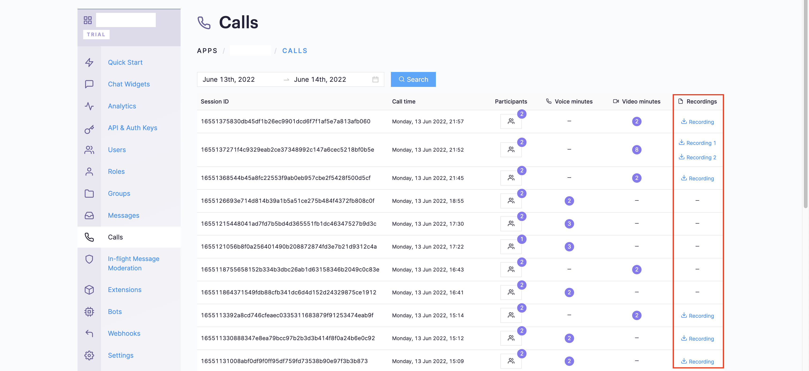

import Tabs from '@theme/Tabs';
import TabItem from '@theme/TabItem';


This section will guide you to implement call recording feature for the voice and video calls.

## Implementation

Once you have decided to implement [Default Calling](./calling-default-calling) or [Direct Calling](./calling-direct-calling) and followed the steps to implement them. Just few additional listeners and methods will help you quickly implement call recording in your app.

You need to make changes in the CometChat.startCall method and add the required listeners for recording. Please make sure your callSettings is configured accordingly for [Default Calling](./calling-default-calling) or [Direct Calling](./calling-direct-calling).

A basic example of how to make changes to implement recording for a direct call/ a default call:

<Tabs>
<TabItem value="1" label="Javascript">

```javascript
// Add listeners onRecordingStarted and onRecordingStopped to the startCall method
let sessionId = "SESSION_ID";
let audioOnly = false;
let defaultLayout = true;
let showRecordingButton = true;

let callSettings = new CometChat.CallSettingsBuilder()
    .enableDefaultLayout(defaultLayout)
    .showRecordingButton(showRecordingButton)
    .setSessionID(sessionId)
    .setIsAudioOnlyCall(audioOnly)
    .build();

CometChat.startCall(
    callSettings,
    document.getElementById("callScreen"),
    new CometChat.OngoingCallListener({
        onRecordingStarted: recordingStartedBy => {
            // This event will work in JS SDK v3.0.8 & later.
            console.log("Listener => onRecordingStarted:", recordingStartedBy);
        },
        onRecordingStopped: recordingStoppedBy => {
            // This event will work in JS SDK v3.0.8 & later.
            console.log("Listener => onRecordingStopped:", recordingStoppedBy);
        },
    })
);
```

</TabItem>

<TabItem value="2" label="Typescript">

```typescript
// Add listeners onRecordingStarted and onRecordingStopped to the startCall method.
let sessionId: string = "SESSION_ID";
let audioOnly: boolean = false;
let defaultLayout: boolean = true;
let showRecordingButton: boolean = true;

let callSettings: CometChat.CallSettings = new CometChat.CallSettingsBuilder()
    .enableDefaultLayout(defaultLayout)
    .showRecordingButton(showRecordingButton)
    .setSessionID(sessionId)
    .setIsAudioOnlyCall(audioOnly)
    .build();

CometChat.startCall(
    callSettings,
    document.getElementById("callScreen"),
    new CometChat.OngoingCallListener({
        onRecordingStarted: (recordingStartedBy: CometChat.User) => {
            // This event will work in JS SDK v3.0.8 & later.
            console.log("Listener => onRecordingStarted:", recordingStartedBy);
        },
        onRecordingStopped: (recordingStoppedBy: CometChat.User) => {
            // This event will work in JS SDK v3.0.8 & later.
            console.log("Listener => onRecordingStopped:", recordingStoppedBy);
        },
    })
);
```

</TabItem>
</Tabs>


## Settings for call recording
The `CallSettings` class allows you to customise the overall calling experience. The properties for the call/conference can be set using the `CallSettingsBuilder` class. This will eventually give you and object of the `CallSettings` class which you can pass to the `startCall()` method to start the call.

The **mandatory** parameters that are required to be present for any call/conference to work are:

1. sessionId - The unique session Id for the call/conference session.

The options available for recording of calls are:

| Setting | Description | 
| ---- | ---- | 
| `showRecordingButton(showRecordingButton: boolean)` | If set to `true` it displays the Recording button in the button Layout.<br/><br/>if set to `false` it hides the Recording button in the button Layout.<br/><br/>**Default value = false** | 
| `startRecordingOnCallStart(startRecordingOnCallStart: boolean)` | If set to `true` call recording will start as soon as the call is started.<br/><br/>if set to `false` call recording will not start as soon as the call is started.<br/><br/>**Default value = false** | 


## Downloading Recording

Currently, the call recordings are available on the [CometChat Dashboard](https://app.cometchat.com) under the Calls Section. You can refer to the below screenshot.

