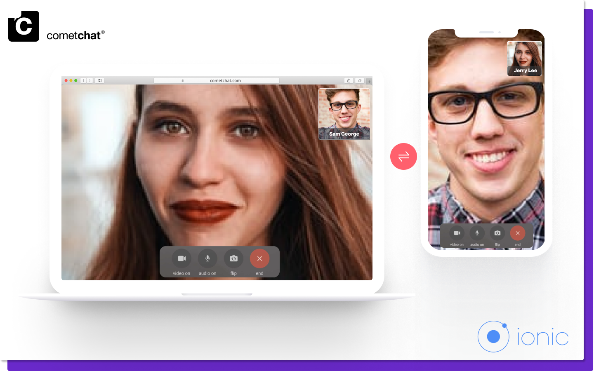

import Tabs from '@theme/Tabs';
import TabItem from '@theme/TabItem';

Calling is a core feature of CometChat. Calling allows users to connect over voice/video calls.

## Prerequisites

1. CometChat Core SDK installed.
2. Performed the steps mentioned in the [Setup](./setup#calling-component-configuration) guide

**CometChat allows two mechanisms for calling:**

1. **Direct Calling**
2. **Default Calling**

## Direct Calling

Direct Calling allows you to start the call/conference sessions directly with the session Id of your choice. All the users joining the same session Id are connected to the same call/conference.
For more information on Direct Calling, please visit the [Direct Calling docs](./calling-direct-calling).

## Default Calling

The second approach that CometChat allows is to implement the entire calling flow where one user initiates a call/conference and other user/users who want to be a part of the call accept/reject the call. All the users that accept the call are connected to the same session.
For more information on Default Calling, please visit the [Default Calling docs](./calling-default-calling).