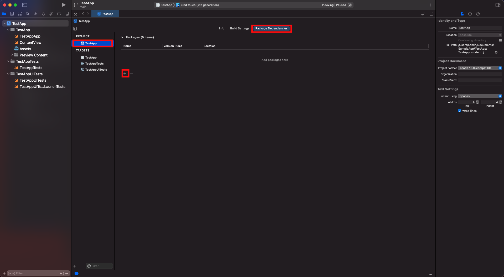
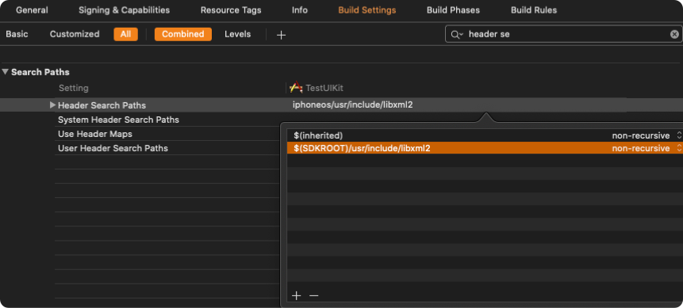
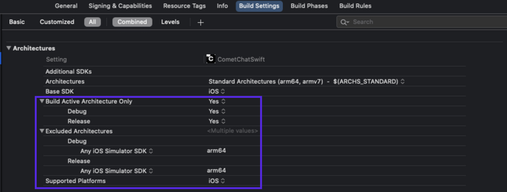

import Tabs from '@theme/Tabs';
import TabItem from '@theme/TabItem';


This guide demonstrates how to add chat to an iOS application using CometChat. Before you begin, we strongly recommend you read the [Key Concepts](./key-concepts) guide.


<div style={{display: 'flex', boxShadow: '0 0 4px 0 rgb(0 0 0 / 18%)', borderRadius: '3px'}}>
  <div style={{width: '75%', padding: '12px'}}>
    <h4>I want to integrate with my app</h4>
    <ol style={{marginBottom: '0'}}>
      <li><a style={{color: '#7c55c9', textDecoration: 'underline', fontSize: '.9em', lineHeight: '2em'}} target="_self" href="overview#get-your-application-keys">Get your application keys</a></li>
      <li><a style={{color: '#7c55c9', textDecoration: 'underline', fontSize: '.9em', lineHeight: '2em'}} target="_self" href="overview#add-the-cometchat-dependency">Add the CometChat dependency</a></li>
      <li><a style={{color: '#7c55c9', textDecoration: 'underline', fontSize: '.9em', lineHeight: '2em'}} target="_self" href="overview#initialize-cometchat">Initialize CometChat</a></li>
      <li><a style={{color: '#7c55c9', textDecoration: 'underline', fontSize: '.9em', lineHeight: '2em'}} target="_self" href="overview#register-and-login-your-user">Register or Login your user</a></li>
      <li><a style={{color: '#7c55c9', textDecoration: 'underline', fontSize: '.9em', lineHeight: '2em'}} target="_self" href="overview#integrate-our-ui-kits">Integrate our UI Kits</a></li>
    </ol>
  </div>
  <div style={{width: '75%', wordBreak: 'break-word', padding: '12px', borderLeft: '1px solid #e3e5e7'}}>
    <h4>I want to explore iOS sample apps.</h4>
    <p class="magic-block-textarea">Import the app into Xcode and follow the steps mentioned in the <code>README.md</code> file.</p>
    <p><a className="button btn" style={{backgroundColor: '#7c55c9', color: 'white', textDecoration: 'underline'}} href="https://github.com/cometchat-pro/ios-swift-chat-app/archive/refs/heads/v2.zip">Download Swift Chat App</a></p>
    <p><a className="button btn" style={{backgroundColor: '#7c55c9', color: 'white', textDecoration: 'underline'}} href="https://github.com/cometchat-pro/ios-objective-c-chat-app/archive/refs/heads/v2.zip">Download Obj-c Chat App</a></p>
    <p><a className="button btn" style={{backgroundColor: '#7c55c9', color: 'white', textDecoration: 'underline'}} href="hhttps://github.com/cometchat-pro/sdk/ios">Download iOS SDK from Github</a></p>
  </div>
</div>

---

## Get your Application Keys

[Signup for CometChat](https://app.cometchat.com) and then:

1. Create a new app
2. Head over to the **API & Auth Keys** section and note the **Auth Key**, **App ID** & **Region**

:::tip Minimum Requirement
1. Xcode 12 or above
2. iOS 11 or higher
:::

---

## Add the CometChat Dependency

### CocoaPods

We recommend using [CocoaPods](https://cocoapods.org/), as they are the most advanced way of managing iOS project dependencies.  Open a terminal window, move to your project directory, and then create a `Podfile` by running the following command.

:::warning Note
1. CometChatPro SDK supports installation through Cocoapods only. Currently, we are supporting Xcode 12 or above versions of Xcode.
2. CometChatPro SDK includes video calling components. We suggest you run on physical devices to avoid errors.
:::

<Tabs>
<TabItem value="swift" label="Swift">

```swift
$ pod init
```
</TabItem>
</Tabs>

<br />
Add the following lines to the Podfile.
<Tabs>
<TabItem value="swift" label="Swift">

```swift
platform :ios, '11.0'
use_frameworks!

target 'YourApp' do
  pod 'CometChatPro', '2.4.2'
end
```
</TabItem>
</Tabs>

:::info Important
v2.4.1+ onwards, Voice & Video Calling functionality has been moved to a separate framework. In case you do not plan to use the calling feature, please add the Calling framework `pod 'CometChatCalls', '2.1.1'` in your app Podfile.
:::

<br />
And then install the `CometChatPro` framework through CocoaPods.

<Tabs>
<TabItem value="swift" label="Swift">

```swift
$ pod install
```
</TabItem>
</Tabs>

<br />
If you're facing any issues while installing pods then use the below command.

<Tabs>
<TabItem value="swift" label="Swift">

```swift
pod install --repo-update
```
</TabItem>
</Tabs>

<br />
Always get the latest version of `CometChatPro` by command.

<Tabs>
<TabItem value="Swift" label="Swift">

```swift
$ pod update CometChatPro
```
</TabItem>
</Tabs>


### Setup Bitcode

You can set the Enable Bitcode setting to **YES** present in build settings in your XCode project.



:::danger
If you are using CometChat Pro SDK having the version less than 2.0.8, then you need to set **Enable Bitcode** to **NO**
:::

### Swift Standard Libraries

`CometChatPro`framework build on Swift, you have to ensure the required libraries are embedded. This can be done by setting the `“Always Embed Swift Standard Libraries”` checkbox in your target’s build settings to “Yes”:


### Set Header Search Path

Set the `Header Search Paths` to `$SDKROOT/usr/include/libxml2`.



### Excluded Architecture

:::danger Warning
For Xcode 12 and above, we need to add arm64 in the excluded architecture of build settings as Apple supports only arm architecture for simulators and actual devices. No support provided for  X86_64 and i386 architectures.
:::


### Setting for build for active architecture

:::success Message
In Build Settings, enable active architecture to Yes
:::



## Initialize CometChat

The `init()` method initializes the settings required for CometChat. We suggest you call the method on app startup preferably in the `didFinishLaunchingWithOptions:` method of the `AppDelegate` class.


<Tabs>
<TabItem value="Swift" label="Swift">

```swift
import CometChatPro

class AppDelegate: UIResponder, UIApplicationDelegate{
{
   var window: UIWindow?
   let appId: String = "ENTER APP ID"
   let region: String = "ENTER REGION CODE"
    
func application(_ application: UIApplication, didFinishLaunchingWithOptions launchOptions: [UIApplication.LaunchOptionsKey: Any]?) -> Bool {

let mySettings = AppSettings.AppSettingsBuilder().subscribePresenceForAllUsers().setRegion(region: region).build()
        
  CometChat.init(appId: appId ,appSettings: mySettings,onSuccess: { (isSuccess) in
            if (isSuccess) {
                print("CometChat Pro SDK intialise successfully.")
            }
        }) { (error) in
                print("CometChat Pro SDK failed intialise with error: \(error.errorDescription)")
        }
        return true
    }
}
```
</TabItem>
<TabItem value="Objective C" label="Objective C">

```objectivec
#import <CometChatPro/CometChatPro-Swift.h>

@interface AppDelegate ()

@end

@implementation AppDelegate


- (BOOL)application:(UIApplication *)application didFinishLaunchingWithOptions:(NSDictionary *)launchOptions {
  
  NSString *region = @"REGION";
  NSString *appID = @"YOUR_APP_ID";
    
    AppSettingsBuilder *appSettingBuilder = [[AppSettingsBuilder alloc]init];
    AppSettings *appSettings = [[[appSettingBuilder subscribePresenceForAllUsers]setRegionWithRegion:region]build];
    
    [[CometChat alloc]initWithAppId: appID appSettings:appSettings onSuccess:^(BOOL isSuccess) {
        NSLog(isSuccess ? @"CometChat Initialize Success:-YES" : @"CometChat Initialize Success:-NO");
    } onError:^(CometChatException * error) {
        NSLog(@"Error %@",[error errorDescription]);
    }];
    return YES;
}
```
</TabItem>
</Tabs>

<br />
Make sure you replace the `appId`  with your CometChat **App ID** in the above code.

## Register and Login your User

Once initialization is successful, you will need to create a user.
To create users on the fly, you can use the `createUser()` method. This method takes a `User` object and the `API Key` as input parameters and returns the created `User` object if the request is successful.

<Tabs>
<TabItem value="Swift" label="Swift">

```swift
let newUser : User = User(uid: "user1", name: "Kevin") // Replace with your uid and the name for the user to be created.
let authKey = "AUTH_KEY" // Replace with your Auth Key.
CometChat.createUser(user: newUser, apiKey: authKey, onSuccess: { (User) in
      print("User created successfully. \(User.stringValue())")
  }) { (error) in
     print("The error is \(String(describing: error?.description))")
}
```
</TabItem>
</Tabs>


Once initialization is successful, you will need to log the user into CometChat using the `login()` method.

The login method needs to be called in the following scenarios:
1)  When the user is logging to the App for the first time.
2) If the `CometChat.getLoggedInUser()`  function returns nil.

:::danger Important
Kindly, make sure you add the check of CometChat.getLoggedInUser() function in your app where you check the App's user login status. In case it returns nil then you need to call the Login method inside it.
:::

<Tabs>
<TabItem value="Swift" label="Swift">

```swift
let uid    = "cometchat-uid-1"
let authKey = "YOUR_AUTH_KEY"

if CometChat.getLoggedInUser() == nil {

	CometChat.login(UID: uid, apiKey: authKey, onSuccess: { (user) in

  	print("Login successful : " + user.stringValue())

	}) { (error) in

  	print("Login failed with error: " + error.errorDescription);

	}

}
```
</TabItem>
<TabItem value="Objective C" label="Objective C">

```objectivec
NSString *uid 	 = @"cometchat-uid-1";
NSString *apiKey = @"YOUR_API_KEY";

if ([CometChat getLoggedInUser == nil]){
  
[CometChat loginWithUID:uid apiKey:apiKey onSuccess:^(User * user) {
    
    // Login Successful
    NSLog(@" Login Successful :%@",[user stringValue]);
    
} onError:^(CometChatException * error) {
    
    // Login error
    NSLog(@" Login failed with exception: %@",[error errorDescription]);
    
}];
}
```
</TabItem>
</Tabs>


Make sure you replace the `AUTH_KEY`  with your CometChat **AuthKey** in the above code.

:::info Sample Users
We have set up 5 users for testing having UIDs:  `cometchat-uid-1`, `cometchat-uid-2`, `cometchat-uid-3`, `cometchat-uid-4` and `cometchat-uid-5`.
:::


The `login()` method returns the User object containing all the information of the logged in user.

:::warning Warning
UID can be alphanumeric with underscore and hyphen. Spaces, punctuation and other special characters are not allowed.
:::

## Integrate our iOS UI Kit

Please refer [iOS UI Kit](/ui-kit/ios/2.0/overview) section to integrate iOS UI Kit inside your app.