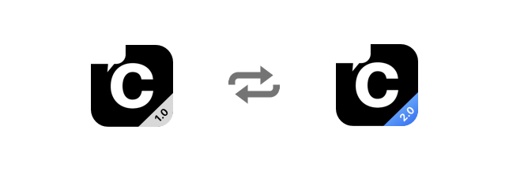

import Tabs from '@theme/Tabs';
import TabItem from '@theme/TabItem';



Upgrading from v1.x to v2 is fairly simple. Below are the major changes that are released as a part of CometChat Pro v2:

## Initialization

The `CometChat.init()` method now takes an additional parameter. This parameter is an object of the `AppSettings` class. This object can be created by using the `AppSettingsBuilder` class. The `AppSettings` class provides the CometChat SDK with the below 2 details:

1. **Region of your app**: The region of your app is the code of the region your app is hosted in. Currently, this can only hold one of the below two values:
a. **eu** -  If your app is hosted in Europe
b. **us** - If your app is hosted in the United States of America.
2. [Presence Subscription](./user-presence).

<Tabs>
<TabItem value="Swift" label="Swift">

```swift
// v1.x

CometChat(appId: APP_ID, onSuccess: { (isSuccess) in

  if (isSuccess) {
    print("CometChat Pro SDK intialise successfully.")
	 }
   }) { (error) in
  print("CometChat Pro SDK failed intialise with error:\(error.errorDescription)")  
}


// v2.0

let appSettings = AppSettings.AppSettingsBuilder().subscribePresenceForAllUsers().setRegion(region: "eu").build()
        
CometChat.init(appId: "appID", appSettings: appSettings, onSuccess: { (Success) in
 if (isSuccess) {
	print("CometChat Pro SDK intialise successfully.")
	}
 }) { (error) in
print("CometChat Pro SDK failed intialise with error: \(error.errorDescription)")
 }
```

</TabItem>
</Tabs>


## Text Message Constructor

Since the only possible valid value the `messageType` parameter could take in the constructor was `CometChatConstants.MESSAGE_TYPE_TEXT(text)`, we have excluded the `messageType` parameter from the `TextMessage` constructor.

<Tabs>
<TabItem value="Swift" label="Swift">

```swift
// v1.x

let textMessage = TextMessage(receiverUid: receiverID, text: text, messageType: .text, receiverType: .user)


// v2.0

let textMessage = TextMessage(receiverUid: receiverID, text: text, receiverType: .user)
```

</TabItem>
</Tabs>


## Mark a Message as Read

In v1.x, for marking the messages as read, every message had to marked as read individually using the `CometChat.markMessageAsRead()` which took the entire message object as the input parameter.

Starting v2.0, the method name has been changed to `markAsRead()` which takes the `messageId`,`receiverId`, and `receiverType` as input. This method, will mark all the messages as read. For more information, please check the [mark messages as read](./delivery-read-receipts#mark-messages-as-read) guide.

<Tabs>
<TabItem value="Swift" label="Swift">

```swift
// v1.x

CometChat.markMessageAsRead(message : message)


// v2.0

CometChat.markAsRead(messageId: messageId, receiverId: receiverId, receiverType: .user)
```

</TabItem>
</Tabs>


## Retrieve List of Friends

In v1.x to fetch only friends, you had to enable the Show only friends setting in the CometChat Dashboard.

Starting v2.x, we have added a method in the UsersRequestBuilder to fetch only friends. This method accepts `boolean` and fetches only friends if it is set to `true` else it fetches all the users. By default it is set to `false`. For more information, please check the [retrieve list of users](./retrieve-users#retrieve-list-of-users) guide.

<Tabs>
<TabItem value="Swift" label="Swift">

```swift
let limit = 20 

var userRequest = UsersRequest.UsersRequestBuilder(limit: limit).friendsOnly(true).build()
```

</TabItem>
</Tabs>
