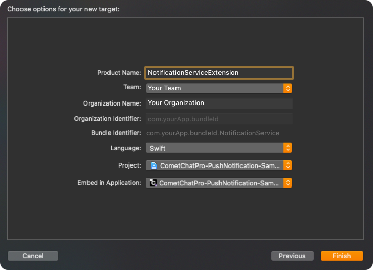

import Tabs from '@theme/Tabs';
import TabItem from '@theme/TabItem';

This guide helps you to set up with which you can remove certainly delivered notifications using **Notification Service Extension**.

For removing notifications you will need to add Notification Service in your project. Please follow the below step to add Notification Service Extension in your app.

---

## UNNotificationServiceExtension

This service grabs the data from the push notification payload, the user can modify its content and display the customized data on to the push notification.

In our case, we are modifying the data of the push notification and incrementing the badge count when a new push notification is received.

:::danger
If you already have Notification Service Extension then you can skip Step1.
:::

Let's begin to implement an incremented badge count for your app.

---

### **Step 1: Add UNNotificationServiceExtension inside the app.**

1. Click on `File` --&gt; `New` --&gt; `Targets`  --&gt; `Application Extension` --&gt; `Notification Service Extension`.


2. Add  `Product Name` and click on `Finish`.



### **Step 2: Add CometChat SDK in your Notification Extension.**

Make sure you are adding the CometChat Pro SDK in your Notification Extension. So in case if you are using pods then your pod file should contain the following:

<Tabs>
<TabItem value="Swift" label="Swift">

```swift
platform :ios, '10.0'
use_frameworks!

target 'MyApp' do
  pod 'CometChatPro', '2.0.8-Xcode11.4'
end

target 'NotificationExtension' do
	pod 'CometChatPro', '2.0.8-Xcode11.4'
end
```
</TabItem>
</Tabs>


### **Step 3: Add Code for removing Notifications.**

Once you have successfully configured the Notification Service then add the below code in `didReceive(_ request: UNNotificationRequest, withContentHandler contentHandler: @escaping (UNNotificationContent)` method under `bestAttemptContent` condition. The below code shows how you can remove the notifications for `call` type messages since we need to show the latest call notification.

<Tabs>
<TabItem value="Swift" label="Swift">

```swift
import CometChatPro

override func didReceive(_ request: UNNotificationRequest, withContentHandler contentHandler: @escaping (UNNotificationContent) -> Void) {
  
  self.contentHandler = contentHandler
  bestAttemptContent = (request.content.mutableCopy() as? UNMutableNotificationContent)

  if let bestAttemptContent = bestAttemptContent {
            // Modify the notification content here...
  var customID : String = ""
  if let userInfo = request.content.userInfo as? [String : Any], let messageObject = userInfo["message"], let str = messageObject as? String, let dict = str.stringTodictionary() {
    if let baseMessage = CometChat.processMessage(dict).0 {
      switch baseMessage.messageCategory {
        case .message: break
        case .action: break
        case .call:
          if let call = baseMessage as? Call {
            customID = call.sessionID!
          }
        case .custom: break
        @unknown default: break
      }
    }
  }
            
  UNUserNotificationCenter.current().getDeliveredNotifications { notifications in
    var id : String = ""
    let matching = notifications.first(where: { notify in
      if let existingUserInfo = request.content.userInfo as? [String : Any], let messageObject = existingUserInfo["message"], let str = messageObject as? String, let dict = str.stringTodictionary() {
      if let baseMessage = CometChat.processMessage(dict).0 {
        switch baseMessage.messageCategory {
          case .message: break
          case .action: break
          case .call:
            if let call = baseMessage as? Call {
              id = call.sessionID!
            }

            case .custom: break
            @unknown default: break
            }
         }
       }
       return id == customID
      })

      if let matchExists = matching {
      UNUserNotificationCenter.current().removeDeliveredNotifications(
        withIdentifiers: [matchExists.request.identifier])
      }
  	}
	}
}
```
</TabItem>
</Tabs>


In the above code, we are trying to remove the previous notification of the call message when the end call or unanswered call notification appears. Since we always have to show the latest notification for calls. We are removing the previous call notifications based on the call `sessionID`.

You can change the implementation as per your service. Once you added the code the above code add the completion handler in the main thread like shown below:


<Tabs>
<TabItem value="Swift" label="Swift">

```swift
DispatchQueue.main.asyncAfter(deadline: .now() + 0.2) {
	contentHandler(bestAttemptContent)
}
```
</TabItem>
</Tabs>