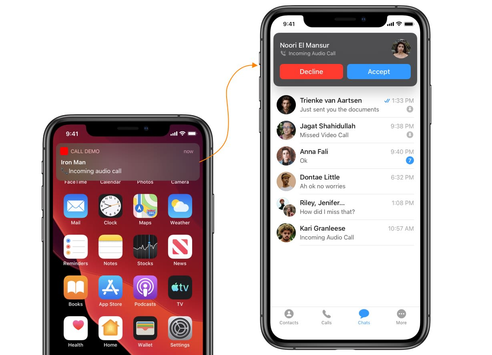

import Tabs from '@theme/Tabs';
import TabItem from '@theme/TabItem';



This guide helps you to launch an incoming call screen from the UI Kit library on receiving an incoming call notification.


:::tip Note
CometChat SDK & UI Kit both need to be configured before launching the call screen.
:::

___

## Step 1. Process push notification payload and grab `Call` object

To present an incoming call screen, firstly you will need a `Call` object. You can grab this from the push notification payload itself of incoming call notification.  You need to call `CometChat.processMessage()` method to process push notification payload.

<Tabs>
<TabItem value="Swift" label="Swift">

```swift
func userNotificationCenter(_ center: UNUserNotificationCenter,
                didReceive response: UNNotificationResponse,
                withCompletionHandler completionHandler: @escaping () -> Void) {
    
if let userInfo = response.notification.request.content.userInfo as? [String : Any], let messageObject = userInfo["message"] as? [String:Any] {
       print("didReceive: \(userInfo)")
      if let baseMessage = CometChat.processMessage(messageObject).0 {
        switch baseMessage.messageCategory {
        case .message:
        case .action: break
        case .call:
          if let call = baseMessage as? Call {
            print("Call Object Received: \(call.stringValue())")
          }
        case .custom: break
        @unknown default: break
        }
      }
    }
    completionHandler()
  }
```
</TabItem>
</Tabs>


## Step 2 . Launch call screen (Method 1)

You can directly launch the view controller from the app delegate once you receive Call Object.

<Tabs>
<TabItem value="Swift" label="Swift">

```swift
  if let call = baseMessage as? Call {
      DispatchQueue.main.async {
      let call = CometChatIncomingCall()
      call.modalPresentationStyle = .custom
      call.setCall(call: call)
     if let window = self.window, let rootViewController = window.rootViewController      {
     var currentController = rootViewController
     while let presentedController = currentController.presentedViewController {
     currentController = presentedController
     }
      if (!call.isViewLoaded && (call.view.window != nil)) {
     currentController.present(call, animated: true, completion: nil)
      }
     }
   }
 }
```
</TabItem>
</Tabs>


If you are facing any difficulties while launching the Call Screen from App Delegate, then you can use another method.


## Step 2 . Launch call screen (Method 2)

You can launch the call screen from your base view controller instead of launching it from the App Delegate.
This method uses NotificationCenter to trigger and present Call Screen.

1. In this method you need to fire notification after you receive Call Object.
2. In Notification's user info you can pass Call Object to that desired notification.


### Trigger notification from App Delegate

<Tabs>
<TabItem value="Swift" label="Swift">

```swift
if let call = baseMessage as? Call {
  DispatchQueue.main.asyncAfter(deadline: .now() + 0.5) {
 NotificationCenter.default.post(name: NSNotification.Name(rawValue: "didReceivedIncomingCall"), object: nil, userInfo: ["call":call])
   }
}
```
</TabItem>
</Tabs>


3. On the other hand, you need to observe for the above notification in your base view controller


:::danger Note
1. Base view controller is a controller that launches immediately after the app delegate.
2. Base view controller should be present to observe the notification when notification fires.
3. If the view controller is not present in the memory when a new notification receives, then it won't launch Call Screen.
:::


### Observe notification in Base View Controller

<Tabs>
<TabItem value="Swift" label="Swift">

```swift
class BaseViewController : UIViewController {
  
  override func viewDidLoad() {
    NotificationCenter.default.addObserver(self, selector:#selector(self.didReceivedIncomingCall(_:)), name: NSNotification.Name(rawValue: "didReceivedIncomingCall"), object: nil)
  }
}
```
</TabItem>
</Tabs>


### Add selector method & Launch call screen

<Tabs>
<TabItem value="Swift" label="Swift">

```swift
 @objc func didReceivedIncomingCall(_ notification: NSNotification) {
        if let currentCall = notification.userInfo?["call"] as? Call {
            DispatchQueue.main.async {
              let call = CometChatIncomingCall()
              call.modalPresentationStyle = .custom
              call.setCall(call: currentcall)
              self.present(call, animated: true, completion: nil)
            }
        }
 }
```
</TabItem>
</Tabs>