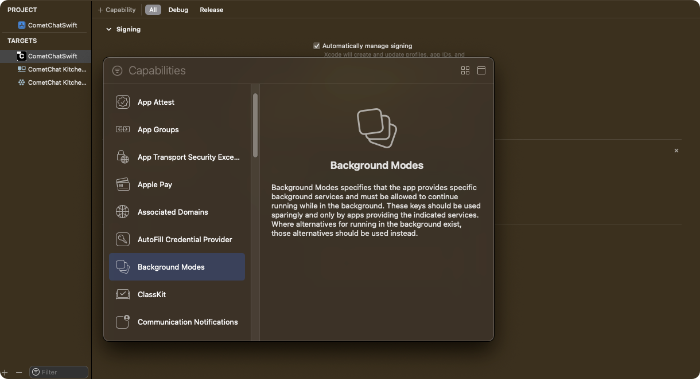

import Tabs from '@theme/Tabs';
import TabItem from '@theme/TabItem';


In iOS, when the user enters in the background state, real time connection breaks with the server. So, if the user comes inside the chat window or in the conversation list then it won't update the new messages received from the real time server until it's being fetched from the API. 

To keep user interaction alive with the application you can add our service which keeps real time connection alive in a background state for a few seconds. If the user is constantly switching between multiple applications at the same time, this service will help to update real time updates on the UI. 

## Background updates behaviour

This below table is applicable only when [these steps are followed](./prepare-your-app-for-background-updates#step-1-add-background-modes-in-capabilities). 

autoEstablishSocketConnection usage can be found in [Managing Web-Socket connections manually](./managing-web-socket-connections-manually).

|  | Value | Behaviour | 
| ---- | ---- | ---- | 
| autoEstablishSocketConnection | true | Connection is maintained in background for 30 seconds  and after that it is killed. | 
| autoEstablishSocketConnection | false | 1. If `CometChat.connect()` is called and app goes to background the connection is maintained for 30 seconds and after that connection is terminated.<br />2. If `CometChat.disconnect()` is called and app goes to background the connection not maintained. | 


Please follow the steps to prepare your app for background states.

---

## Step 1. Add Background Modes in Capabilities

Click on Targets -&gt; Project -&gt;  [+ Capability] -&gt; Add 'Background Modes' section.



---

## Step 2. Select Background modes for processing

Select 'Background Fetch' and 'Background Processing' options by ticking them.


---

## Step 3. Add Code in Application class to configure background services for different states.

Add `CometChat.configureServices`method in application class or scene delegate class as shown below.

<Tabs>
<TabItem value="Swift" label="Swift">

```swift
func applicationWillResignActive(_ application: UIApplication) {
        CometChat.configureServices(.willResignActive)
    }

    func applicationDidEnterBackground(_ application: UIApplication) {
        CometChat.configureServices(.didBackground)
    }
```
</TabItem>
</Tabs>


:::info note
1. As per the iOS standard guidelines, this service will keep alive for few seconds in background services in the system. After few seconds it will get terminated automatically by the system.
2. This service is only available after SDK **v3.0.5x** & **UI Kit v3.0.5x -1x.**
:::

---

## Step 4. Check background service is running

You can check the background service is running or not using `CometChat.BackgroundTaskEnabled()` method. It will return **`true`** if service is running else it will return `false`.

<Tabs>
<TabItem value="Swift" label="Swift">

```swift
if CometChat.backgroundTaskEnabled() {
  print("Background service is running, it will automatically update UI.")
}else{
  print("Background service is stopped, Please refresh messages or conversations here to update.")
}
```
</TabItem>
</Tabs>


---