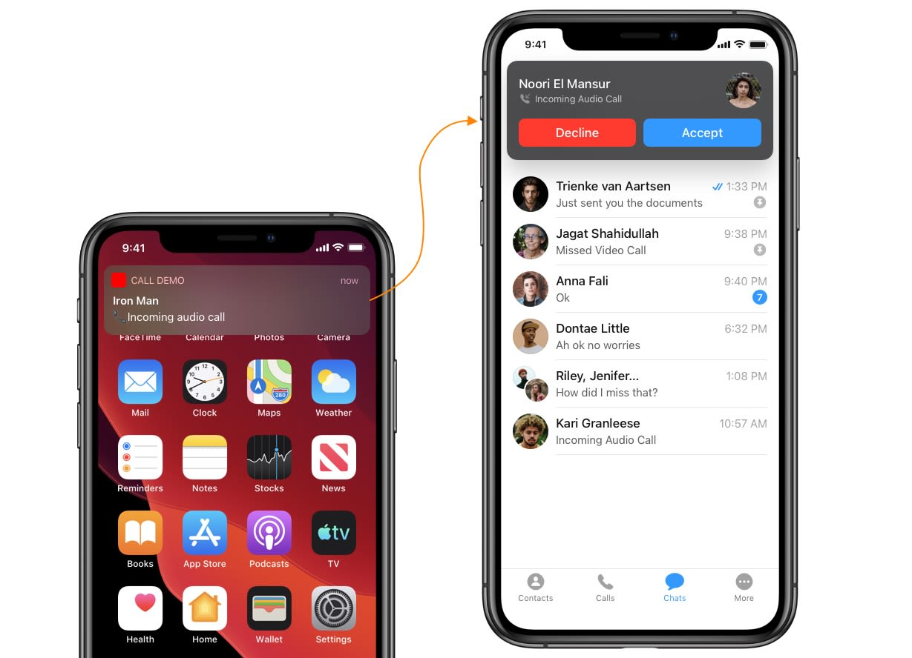
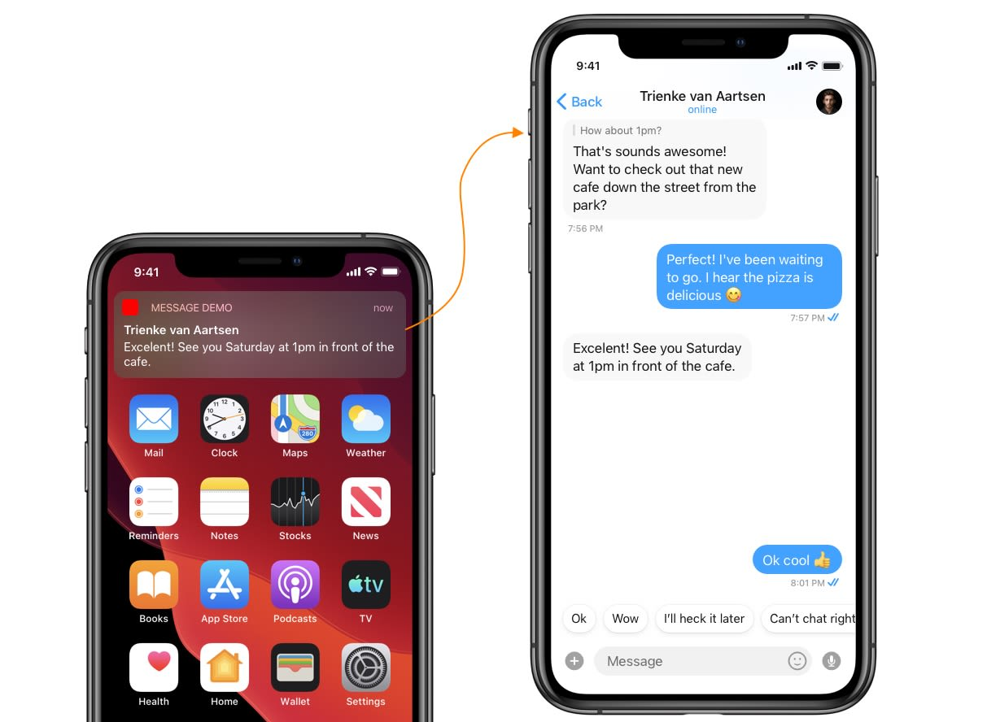

We have a number of resources that will help you while integrating CometChat in your app.

## 1. All Real-Time Delegates (Listeners)

The CometChat provides you with live events related to users, groups, messages, and calls. [Click here to learn more about Real-time Listeners](./all-real-time-delegates-listeners).

---

## 2. Publishing to the App Store

To publish your App on App Store please [follow this guide](./publishing-app-on-appstore).

---

## 3. Increment App Icon Badge Count

Learn how to [increment your app's icon badge count](./increment-app-icon-badge-count).

---

## 4. API Reference (Swift Doc)

Learn more about [iOS SDK's public API's](https://docs.cometchat.io/ios/v2.0/swiftdocs/index.html).

---

## 5. Upgrading from v1

Upgrading from v1.x to v2 is fairly simple. [Click here to know about the major changes that are released as a part of CometChat Pro v2](./upgrading-from-v2).

---

## 6. Remove Delivered Notifications

Learn [how to remove delivered notifications](./remove-delivered-notifications).

---

## 7. Launch call screen on tap of push notification

Learn [how to launch an incoming call screen from the UI Kit library on receiving an incoming call notification](./launch-call-screen-on-tap-of-push-notification).

---

## 8. Launch chat window on tap of push notification

Learn [how to launch a chat window from the UI Kit library on receiving a new message notification](./launch-chat-window-push-notification).

---

## 9. Prepare your app for background updates

Learn [how to prepare your app for background updates](./prepare-your-app-for-background-updates)