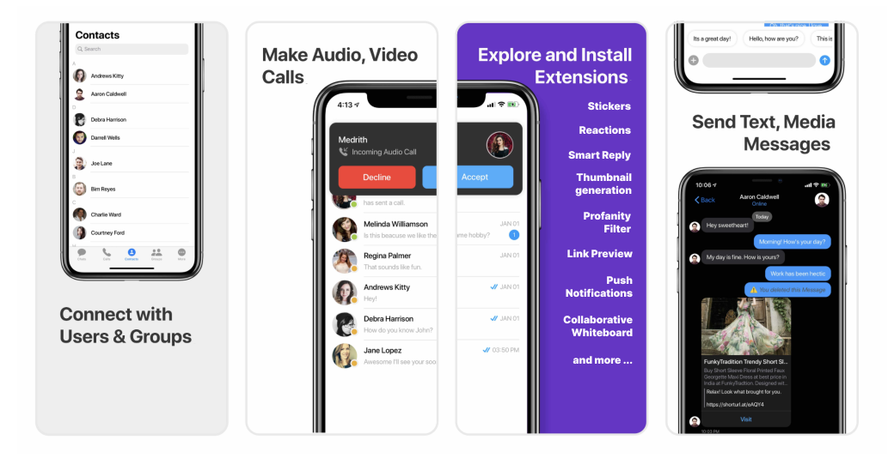
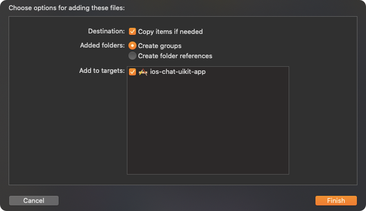
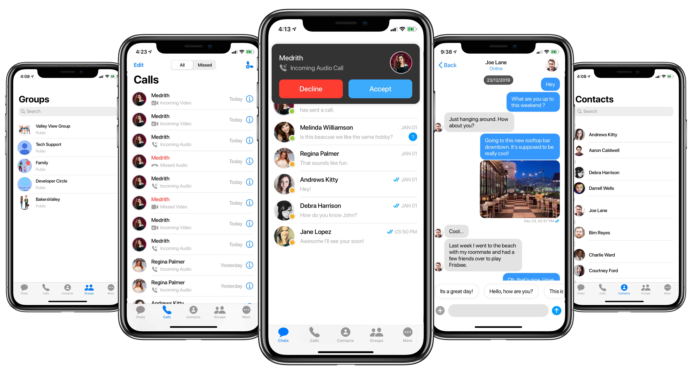

import Tabs from '@theme/Tabs';
import TabItem from '@theme/TabItem';

The **CometChat iOS UI Kit** is developed to keep developers in mind and aims to reduce development efforts significantly.



The UI Kit’s customisable **UI components** simplify the process of integrating **text chat** and voice/video calling features to your website or mobile application in a few minutes.

<div style={{ display: 'flex', boxShadow: '0 0 4px 0 rgba(0 0 0 / 18%)', borderRadius: '3px' }}>
  <div style={{ padding: '24px' }}>
    <h4 style={{ fontWeight: 'bold' }}>I want to checkout iOS UI Kit.</h4>
    <p>Follow the steps mentioned in the <code>README.md</code> file.</p>
    <p>Kindly, click on the below button to download our iOS Chat UI Kit.</p>
    <a style={{ display: 'inline-block', backgroundColor: '#7c55c9', padding: '8px', textAlign: 'center', textTransform: 'uppercase', border: '1px solid #e3e5e7', borderRadius: '3px', color: 'white', width: '100%', marginBottom: '8px' }} href="https://github.com/cometchat-pro/ios-swift-chat-ui-kit/archive/refs/heads/v2.zip" target="_blank" rel="noopener noreferrer">iOS Chat UI Kit</a>
    <a style={{ display: 'inline-block', backgroundColor: '#7c55c9', padding: '8px', textAlign: 'center', textTransform: 'uppercase', border: '1px solid #e3e5e7', borderRadius: '3px', color: 'white', width: '100%' }} href="https://github.com/cometchat-pro/ios-swift-chat-ui-kit/tree/v2" target="_blank" rel="noopener noreferrer">View on Github</a>

  <hr size="8" width="100%" color="black" />

  <h4>I want to integrate UI Kit with my App </h4>
    <ol style={{ marginBottom: '0' }}>
      
      <li><a href="/ui-kit/ios/2.0/ui-components" target="_self">UI Components</a></li>
      <li><a href="/ui-kit/ios/2.0/customize-ui-kit" target="_self">Customize UI Kit</a></li>
      
    </ol>
  </div>

  <div style={{ padding: '24px', borderLeft: '1px solid #e3e5e7' }}>
    <h4 style={{ fontWeight: 'bold' }}>I want to explore sample apps.</h4>
    <p>Import the app into Xcode and follow the steps mentioned in the <code>README.md</code> file.</p>
    <p>Kindly, click on the below button to download our Swift Sample App.</p>
    <a style={{ display: 'inline-block', backgroundColor: '#7c55c9', padding: '8px', textAlign: 'center', textTransform: 'uppercase', border: '1px solid #e3e5e7', borderRadius: '3px', color: 'white', width: '100%', marginBottom: '8px' }} href="https://github.com/cometchat-pro/ios-swift-chat-app/archive/refs/heads/v2.zip" target="_blank" rel="noopener noreferrer">Swift Sample App</a>
    <a style={{ display: 'inline-block', backgroundColor: '#7c55c9', padding: '8px', textAlign: 'center', textTransform: 'uppercase', border: '1px solid #e3e5e7', borderRadius: '3px', color: 'white', width: '100%' }} href="https://github.com/cometchat-pro/ios-swift-chat-app/tree/v2" target="_blank" rel="noopener noreferrer">View on Github</a>
    <br></br>
    <p>Or else, you can also checkout our Objective-C Sample App.</p>
    <a style={{ display: 'inline-block', backgroundColor: '#7c55c9', padding: '8px', textAlign: 'center', textTransform: 'uppercase', border: '1px solid #e3e5e7', borderRadius: '3px', color: 'white', width: '100%', marginBottom: '8px' }} href="https://github.com/cometchat-pro/ios-objective-c-chat-app/archive/refs/heads/v2.zip" target="_blank" rel="noopener noreferrer">Objective-C Sample App</a>
    <a style={{ display: 'inline-block', backgroundColor: '#7c55c9', padding: '8px', textAlign: 'center', textTransform: 'uppercase', border: '1px solid #e3e5e7', borderRadius: '3px', color: 'white', width: '100%' }} href="https://github.com/cometchat-pro/ios-objective-c-chat-app/tree/v2" target="_blank" rel="noopener noreferrer">View on Github</a>
  </div>

</div>


## Prerequisites

Before you begin, ensure you have met the following requirements:

- You have installed the **latest version of Xcode**. (Above Xcode 12 Recommended)
- **iOS Chat UI Kit** works for iOS devices from **iOS 11 and above**.

:::tip Note

If you're building the new project, the please add below line in **AppDelegate.swift**> > **var window: UIWindow?**

:::

:::info Note


Please install the latest pod version on your Mac to avoid integration issues

Please follow the below steps:

 1. sudo gem update cocoapods --pre
 
 2. pod update 
 
 3. clean
 
 4. build

:::


---

## Installing iOS Chat UI Kit

### 1. Setup 🔧

**i. Register on CometChat 🧑‍💻**

- To install iOS UI Kit, you need to first register on **CometChat Dashboard**. [Click here to sign up](https://app.cometchat.com/login).

**ii. Get Your Application Keys 🔑**

- Create a **new app**
- Head over to the **QuickStart** or **API & Auth Keys section** and note the **App ID**, **Auth Key**, and **Region**.

**iii. Add the CometChat Dependency**📦

We recommend using CocoaPods, as they are the most advanced way of managing iOS project dependencies. Open a terminal window, move to your project directory, and then create a Podfile by running the following command

Create podfile using the below command.

<Tabs>
<TabItem value="bash" label="Bash">

```bash
$ pod init
```

</TabItem>
</Tabs>


Add the following lines to the Podfile.

<Tabs>
<TabItem value="bash" label="Bash">

```bash
For Xcode 12 and above:

platform :ios, '11.0'
use_frameworks!

target 'YourApp' do
     pod 'CometChatPro', '2.4.1'
     pod 'CometChatCalls', '2.1.1'
end
```

</TabItem>
</Tabs>


:::warning Note

v2.4.1+ onwards, Voice & Video Calling functionality has been moved to a separate framework. In case you do not plan to use the calling feature, please add the Calling framework `pod 'CometChatCalls', '2.1.1'` in your app Podfile.

:::


And then install the CometChatPro framework through CocoaPods.

<Tabs>
<TabItem value="bash" label="Bash">

```bash
pod install
```

</TabItem>
</Tabs>


If you're facing any issues while installing pods then use the below command.

<Tabs>
<TabItem value="bash" label="Bash">

```bash
pod install --repo-update
```

</TabItem>
</Tabs>


---

### 2. Configure CometChat inside your app

**i. Initialize CometChat 🎬**

The `init()` method initializes the settings required for CometChat. We suggest calling the `init()` method on app startup, preferably in the `didFinishLaunchingWithOptions()` method of the Application class.

<Tabs>
<TabItem value="swift" label="Swift">

```swift
import CometChatPro

class AppDelegate: UIResponder, UIApplicationDelegate{

   var window: UIWindow?
   let appId: String = "ENTER APP ID"
   let region: String = "ENTER REGION CODE"
    
func application(_ application: UIApplication, didFinishLaunchingWithOptions launchOptions: [UIApplication.LaunchOptionsKey: Any]?) -> Bool {

let mySettings = AppSettings.AppSettingsBuilder().subscribePresenceForAllUsers().setRegion(region:   region).build()
CometChat(appId: appId ,appSettings: mySettings,onSuccess: { (isSuccess) in
       print("CometChat Pro SDK intialise successfully.")
   }) { (error) in
       print("CometChat Pro SDK failed intialise with error: \(error.errorDescription)")
    }
    return true
    }
}
```

</TabItem>
</Tabs>


:::warning Note

Make sure you replace the **appId** with your CometChat _appId_ and _region_ with your app region in the above code.

:::


**ii. Create User** 🐣

This method takes a `User` object and the `Auth Key` as input parameters and returns the created `User` object if the request is successful.

<Tabs>
<TabItem value="swift" label="Swift">

```swift
let uid = "user1"
let name = "Kevin"
let authKey = "AUTH_KEY"

let newUser : User = User(uid: uid, name: name)
newUser.avatar = "ENTER AVATAR URL HERE"

CometChat.createUser(user: newUser, apiKey: authKey, onSuccess: { (User) in
      print("User created successfully. \(User.stringValue())")
  }) { (error) in
     print("The error is \(String(describing: error?.description))")
}
```

</TabItem>
</Tabs>


**ii. Log in your User**👤

The `login()` method returns the User object containing all the information of the `logged-in user.`

<Tabs>
<TabItem value="swift" label="Swift">

```swift
let uid    = "cometchat-uid-1"
let authKey = "ENTER AUTH KEY"

CometChat.login(UID: uid, apiKey: authKey, onSuccess: { (user) in
  print("Login successful: " + user.stringValue())
}) { (error) in
  print("Login failed with error: " + error.errorDescription);
}
```

</TabItem>
</Tabs>


:::info Note

- Make sure you replace the authKey with your CometChat Auth Key in the above code.

- We have set up 5 users for testing having UIDs: cometchat-uid-1, cometchat-uid-2, cometchat-uid-3, cometchat-uid-4, and cometchat-uid-5.

:::

---

### 3. Add UI Kit to your project

To integrate **CometChat UIKit** inside your app. Kindly follow the below steps:

i. Simply **clone the UIKit Library** from the below repository.

<Tabs>
<TabItem value="bash" label="CLI">

```bash
git clone https://github.com/cometchat-pro/ios-swift-chat-ui-kit.git
```

</TabItem>
</Tabs>


ii. After cloning the repository, Navigate to the `Library` folder and drag and drop the `Library` folder inside your project's folder.



iii. Make sure you've selected ✅ Copy items if needed as well as 🔘 Create group options while adding a `Library inside your project.

iv. If the Library is added successfully, all added folders will be in Yellow color.

---

### 4. Launch CometChat



CometChatUI is an option to launch a fully functional chat application using the UI Kit. In UI Kit all the UI Components are interlinked and work together to launch a fully functional chat on your website/application.

To use **CometChatUI** user has to launch `CometChatUI` class. **CometChatUI** is a subclass of UITabbarController.

<Tabs>
<TabItem value="swift" label="Swift">

```swift
DispatchQueue.main.async {
let cometChatUI = CometChatUI()
cometChatUI.setup(withStyle: .fullScreen)
self.present(cometChatUI, animated: true, completion: nil)
}
```

</TabItem>
</Tabs>


:::warning Note

Please run the above code snippet in the main thread.

:::

---

### 5. Receive Real-time calls (Optional)

To receive real-time call events when the app is in foreground,  the user has to register for them in the **App Delegate** class.

<Tabs>
<TabItem value="swift" label="Swift">

```swift
CometChatCallManager().registerForCalls(application: self)
```

</TabItem>
</Tabs>


:::info Note

- **This method only allows user to launch the incoming call screen and other calling events when the app is in foreground mode.**

:::