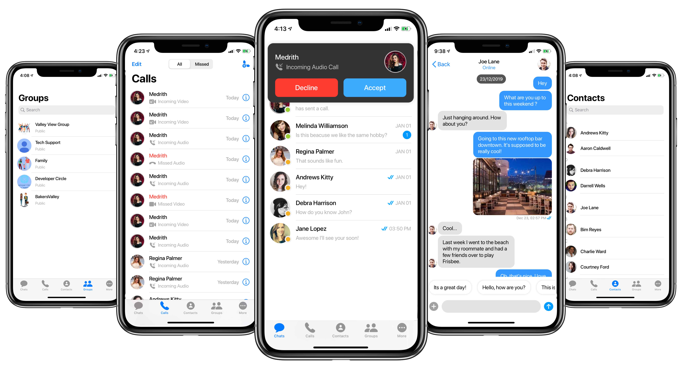
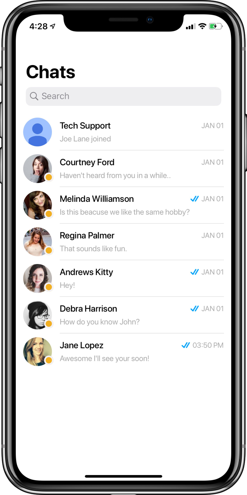
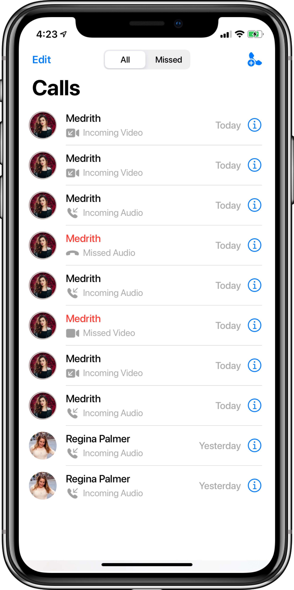
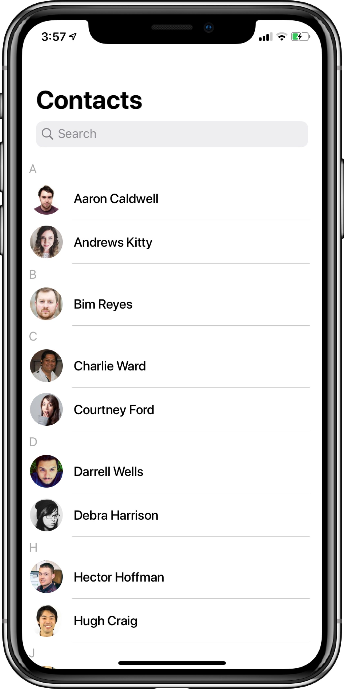
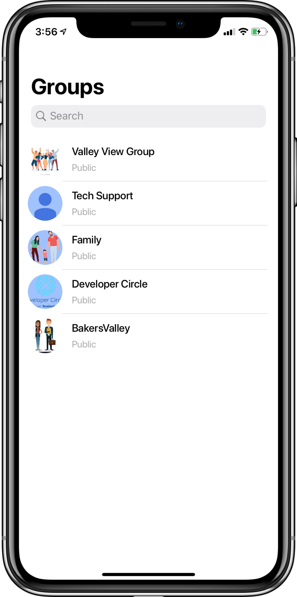
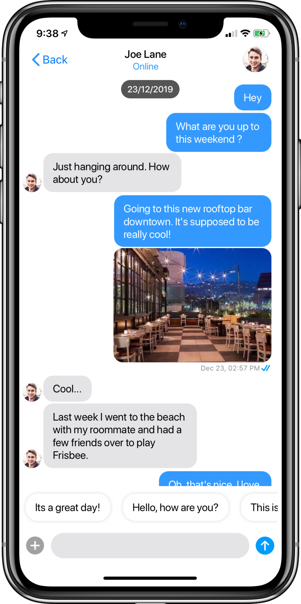
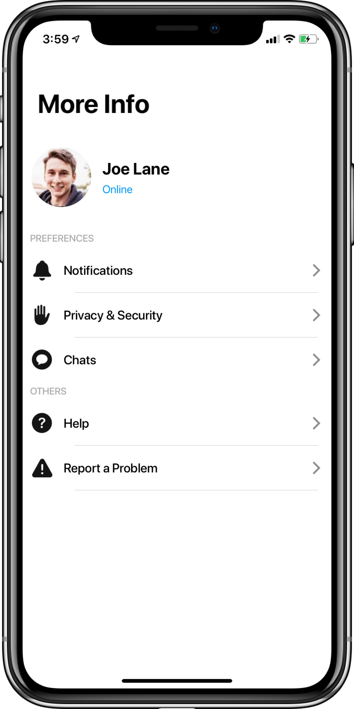

import Tabs from '@theme/Tabs';
import TabItem from '@theme/TabItem';

**UI Components** are building blocks of the UI Kit. **UI Components** are a set of custom classes specially designed to build a rich chat app. There are different UI Components available in the
UI Kit Library.

## 1. CometChatUI

**CometChatUI** is an option to launch a fully functional chat application using the UI Kit. In **CometChatUI**  all the **UI Components** are interlinked and work together to launch a fully functional chat on your mobile application.



<Tabs>
<TabItem value="js" label="swift">

```swift
DispatchQueue.main.async {
let cometChatUI = CometChatUI()
cometChatUI.setup(withStyle: .fullScreen)
self.present(cometChatUI, animated: true, completion: nil)
}
```

</TabItem>
</Tabs>

## 2. CometChatConversationList

The **CometChatConversationList** is a view controller with a list of recent conversations. The view controller has all the necessary delegates and methods.

You can present this screen using **two methods.**

### Launch Conversation List (Recommended)

<Tabs>
<TabItem value="js" label="swift">

```swift
let conversationList = CometChatConversationList()
let navigationController = UINavigationController(rootViewController:conversationList)
conversationList.set(title:"Chats", mode: .automatic)
self.present(navigationController, animated:true, completion:nil)
```

</TabItem>
</Tabs>



### Embed Conversation List in View Controller

You can use this by subclassing UIViewController as **CometChatConversationList** as shown below:

:::info

> To assign a CometChatConversationList to view controller make sure that the Navigation controller is attached properly.

:::

<Tabs>
<TabItem value="js" label="swift">

```swift
import CometChatPro

class viewController: CometChatConversationList {

override func viewDidLoad() {
      super.viewDidLoad()
      self.delegate = self
	}
}
```

</TabItem>
</Tabs>

Also, you can perform an action on tap on the conversation by adding **ConversationListDelegate** in the app's view controller as shown below:

<Tabs>
<TabItem value="js" label="swift">

```swift
extension viewController: ConversationListDelegate {
    
func didSelectConversationAtIndexPath(conversation: Conversation, indexPath: IndexPath){
        //Do Stuff
    }  
}
```

</TabItem>
</Tabs>

## 3. CometChatCallsList

The **CometChatCallsList** is a view controller with a list of recent calls. The view controller has all the necessary delegates and methods.

You can present this screen using **two methods.**

### Launch Calls List (Recommended)

<Tabs>
<TabItem value="js" label="swift">

```swift
let callList = CometChatCallsList()
let navigationController = UINavigationController(rootViewController:callList)
callList.set(title:"Calls", mode: .automatic)
self.present(navigationController, animated:true, completion:nil)
```

</TabItem>
</Tabs>




### Embed Call List in View Controller

You can use this by subclassing UIViewController as **CometChatCallsList** as shown below:

:::info note

> To assign a CometChatCallsList to view controller make sure that the Navigation controller is attached properly.

:::

<Tabs>
<TabItem value="js" label="swift">

```swift
import CometChatPro

class viewController: CometChatCallsList {

override func viewDidLoad() {
      super.viewDidLoad()
      self.delegate = self
	}
}
```

</TabItem>
</Tabs>


Also, you can perform an action on tap on the call by adding **CallsListDelegate** in the app's view controller as shown below:

<Tabs>
<TabItem value="js" label="swift">

```swift
extension viewController: CallsListDelegate {
    
func didSelectCallsAtIndexPath(call: BaseMessage, indexPath: IndexPath){
        //Do Stuff
    }  
}
```

</TabItem>
</Tabs>

## 4. CometChatUserList

The **CometChatUserList** is a view controller with a list of users. The view controller has all the necessary delegates and methods.

You can present this screen using **two methods.**

### Launch User List (Recommended)

<Tabs>
<TabItem value="js" label="swift">

```swift
let userList = CometChatUserList()
let navigationController = UINavigationController(rootViewController:userList)
userList.set(title:"Contacts", mode: .automatic)
self.present(navigationController, animated:true, completion:nil)
```

</TabItem>
</Tabs>




### Embed User List in View Controller

You can use this by subclassing UIViewController as **CometChatUserList** as shown below:

:::info note

> To assign a CometChatUserList to view controller make sure that the Navigation controller is attached properly.

:::

<Tabs>
<TabItem value="js" label="swift">

```swift
import CometChatPro

class viewController: CometChatUserList {

override func viewDidLoad() {
  super.viewDidLoad()
  self.delegate = self
  }
}
```

</TabItem>
</Tabs>


Also, you can perform an action on tap on the user by adding **UserListDelegate** in the app's view controller as shown below:

<Tabs>
<TabItem value="js" label="swift">

```swift
extension viewController: UserListDelegate {
    
func didSelectUserAtIndexPath(user: User, indexPath: IndexPath) {
        //Do Stuff
    }  
}
```

</TabItem>
</Tabs>


## 5. CometChatGroupList

The **CometChatGroupList** is a view controller with a list of groups. The view controller has all the necessary delegates and methods.

You can present this screen using **two methods.**

### Launch Group List (Recommended)

<Tabs>
<TabItem value="js" label="swift">

```swift
let groupList = CometChatGroupList()
let navigationController = UINavigationController(rootViewController:groupList)
groupList.set(title:"Groups", mode: .automatic)
self.present(navigationController, animated:true, completion:nil)
```

</TabItem>
</Tabs>




### Embed Group List in View Controller

You can use this by subclassing UIViewController as **CometChatGroupList** as shown below:

:::info note

> To assign a CometChatGroupList to view controller make sure that the Navigation controller is attached properly.

:::

<Tabs>
<TabItem value="js" label="swift">

```swift
import CometChatPro

class viewController: CometChatGroupList {

override func viewDidLoad() {
      super.viewDidLoad()
      self.delegate = self
	}
}
```

</TabItem>
</Tabs>


Also, you can perform an action on tap on the group by adding **GroupListDelegate** in the app's view controller as shown below:

<Tabs>
<TabItem value="js" label="swift">

```swift
extension viewController: GroupListDelegate {
    
func didSelectGroupAtIndexPath(group: Group, indexPath: IndexPath)
        //Do Stuff
    }  
}
```

</TabItem>
</Tabs>


## 6. CometChatMessageList

The **CometChatMessageList** is a view controller with a list of messages for a particular user or group. The view controller has all the necessary delegates and methods.

**CometChatMessageList** requires `User` or `Group` object to work properly.

:::info

> To retrieve the User or Group object you can call CometChat.getUser() or CometChat.getGroup().

:::

You can present this screen using **two methods.**

### Launch Message List (Recommended)

<Tabs>
<TabItem value="js" label="swift">

```swift
let messageList = CometChatMessageList()
let navigationController = UINavigationController(rootViewController:messageList)
messageList.set(conversationWith: user, type: .user)
self.present(navigationController, animated:true, completion:nil)
```

</TabItem>
</Tabs>




### Embed Message List in View Controller

You can use this by subclassing UIViewController as **CometChatMessageList** as shown below:

:::info note

> To assign a CometChatMessageList to view controller make sure that the Navigation controller is attached properly.

:::

<Tabs>
<TabItem value="js" label="swift">

```swift
import CometChatPro

class viewController: CometChatMessageList {

override func viewDidLoad() {
      super.viewDidLoad()
      set(conversationWith: user, type: .user)
	}
}
```

</TabItem>
</Tabs>


## 7. CometChatUserProfile

The **CometChatUserProfile** is a view controller with user information and a list of dummy cells for settings of the app which the developer can use in his app.

You can present this screen using **two methods.**

### Launch User Profile (Recommended)

<Tabs>
<TabItem value="js" label="swift">

```swift
let userProfile = CometChatUserProfile()
let navigationController = UINavigationController(rootViewController:userProfile)
userProfile.set(title:"More", mode: .automatic)
self.present(navigationController, animated:true, completion:nil)
```

</TabItem>
</Tabs>



### Embed UserProfile inView Controller

You can use this by subclassing UIViewController as **CometChatUserProfile** as shown below:

:::info note

> To assign a CometChatUserProfile to view controller make sure that the Navigation controller is attached properly.

:::

<Tabs>
<TabItem value="js" label="swift">

```swift
import CometChatPro

class viewController: CometChatUserProfile {

override func viewDidLoad() {
      super.viewDidLoad()
		 
	}
}
```

</TabItem>
</Tabs>


