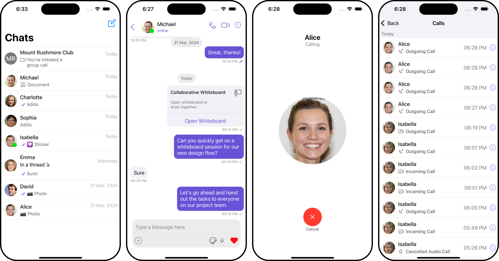

CometChat's UI Kit for iOS Swift simplifies the development of chat applications by providing a comprehensive set of customizable UI components. These components are organized into modules, allowing for easy integration and adaptation to match the specific requirements of your app. With this UI Kit, you can effortlessly incorporate essential messaging features while tailoring the interface to align with your application's unique style and functionality.

  

    
<a className="button btn" style={{backgroundColor: '#7c55c9', color: 'white', textDecoration: 'underline'}} href="https://github.com/cometchat-pro/ios-swift-chat-app/tree/v4">iOS Swift Sample App</a>

  

## Before Getting Started

Before you begin, it's essential to grasp the fundamental concepts and features offered by CometChat's APIs, SDK, and UI Kit. You can find detailed information in [Key Concepts](/fundamentals/key-concepts) documentation.

You can start building a modern messaging experience in your app by installing the new UI Kit. This developer kit is an add-on feature to CometChat iOS SDK so installing it will also install the core Chat SDK.

To begin, please follow the [Getting Started](getting-started) guide.
