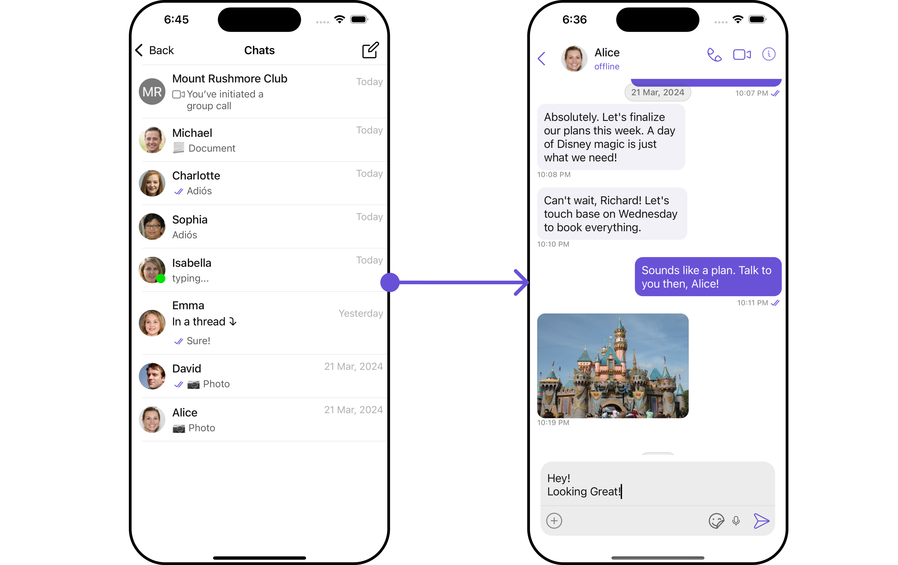
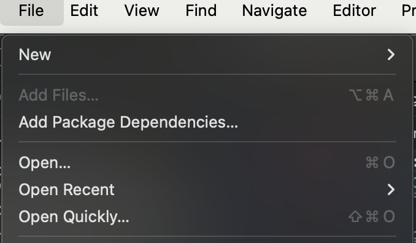
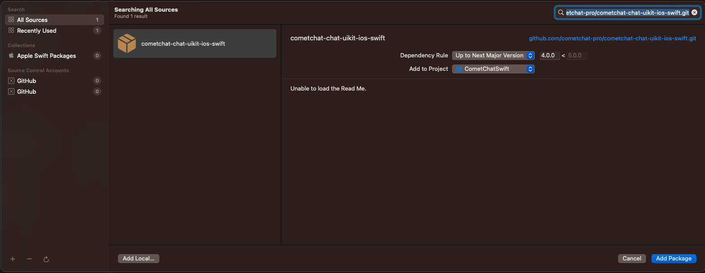
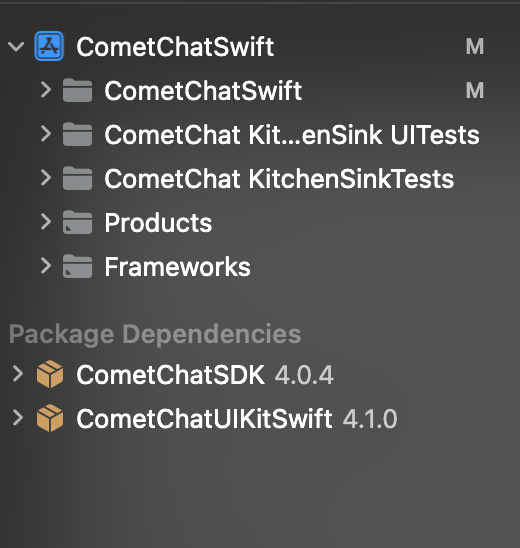
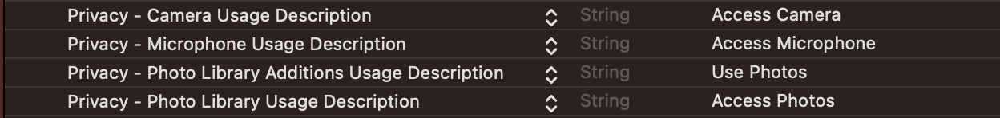
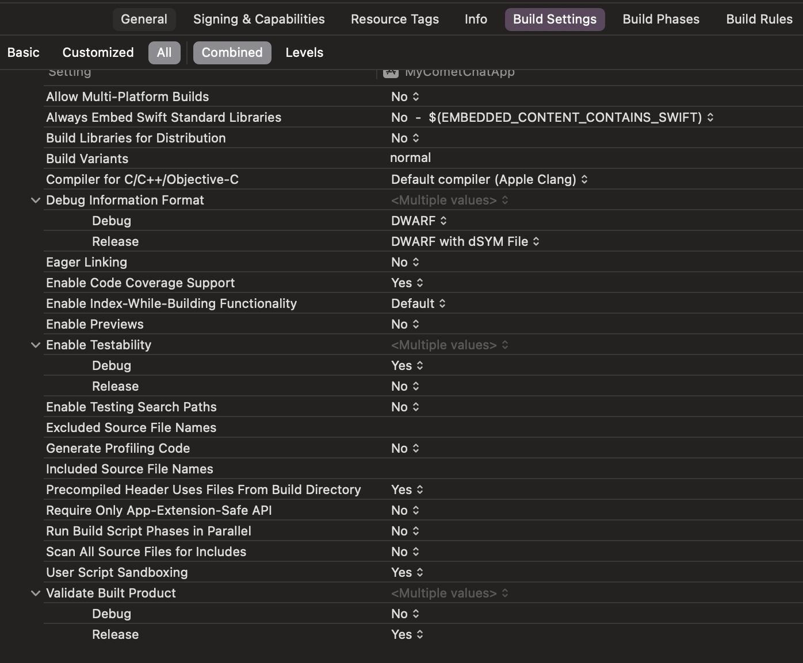

import Tabs from '@theme/Tabs';
import TabItem from '@theme/TabItem';

## Start your first conversation

CometChat UI Kit for iOS is a package of pre-assembled UI elements crafted to streamline the creation of an in-app chat equipped with essential messaging functionalities. Our UI Kit presents options for light and dark themes, diverse fonts, colors, and extra customization capabilities.

CometChat UI Kit supports both one-to-one and group conversations. Follow the guide below to initiate conversations from scratch using CometChat iOS UI Kit.



## Prerequisites

Before installing the **UI Kit**, you need to create a CometChat application on the CometChat Dashboard, which includes all the necessary data for a chat service, such as users, groups, calls, and messages. You will require the `App ID`, `AuthKey`, and `Region` of your CometChat application when initializing the SDK.

**i. Register on CometChat**

- You need to register on the **CometChat Dashboard** first. [Click here to sign up](https://app.cometchat.com/login).

**ii. Get Your Application Keys**

- Create a **new app**
- Head over to the **QuickStart** or **API & Auth Keys section** and note the **App ID**, **Auth Key**, and **Region**.

> Each CometChat application can be integrated with a single client app. Within the same application, users can communicate with each other across all platforms, whether they are on mobile devices or on the web.

**iii. IDE Setup**

- You have Xcode installed on your machine.
- You have an iOS device or simulator with iOS version 13.0 or above.
- Swift 5.0.
- macOS.

## Getting Started

<span style={{padding: '6px 15px', 'background-color': '#6851D6', color: 'white', 'border-radius': '15px', 'font-size': '0.9em', 'font-weight': 'bold'}}>Step 1</span>

### Create a project

    To get started, open Xcode and create a new project for UI Kit in the Project window as follows:

    1. Select **iOS App** in the **Choose a template for your new project** window and click Next.
    1. Enter your project name in the **Name** field in the **Choose options for your new project** window.
    1. Enter your identifier in the **Bundle Identifier** field in the **Choose options for your new project** window.
    1. Select **Storyboard** in the **Interface** field in the **Choose options for your new project** window.
    1. Select **Swift** in the **Language** field in the **Choose options for your new project** window.

---

<span style={{padding: '6px 15px', 'background-color': '#6851D6', color: 'white', 'border-radius': '15px', 'font-size': '0.9em', 'font-weight': 'bold'}}>Step 2</span>

### Add Dependency (Pods)

This developer kit is an add-on feature to CometChat iOS SDK so installing it will also install the core Chat SDK.

**1. CocoaPods**

We recommend using CocoaPods, as they are the most advanced way of managing iOS project dependencies. Open a terminal window, move to your project directory, and then create a Podfile by running the following command.
:::info

1. CometChatUIKitSwift supports installation through Cocoapods only. Currently, we are supporting Xcode 14 and higher.

2. CometChatUIKitSwift supports iOS 13 and above
   :::

```groovy title="Swift"
$ pod init
```

Add the following lines to the Podfile.

```groovy title="Swift"
platform :ios, '13.0'
use_frameworks!

target 'YourApp' do
  pod 'CometChatUIKitSwift', '4.3.19'
end
```

And then install the CometChatUIKitSwift framework through CocoaPods.

```groovy title="Swift"
$ pod install
```

If you're facing any issues while installing pods then use the below command.

```groovy title="Swift"
$ pod install --repo-update
```

Always get the latest version of CometChatUIKitSwift by command.

```groovy title="Swift"
$ pod update CometChatUIKitSwift
```

:::tip

Always ensure to open the XCFramework file after adding the dependencies.

:::

**2. Swift Package Manager.**

1. Go to your Swift Package Manager's **File** tab and select **Add Package Dependencies.**

<!--  -->

2. Add `CometChatUIKitSwift` into your `Package Repository` as below:

```groovy title="Bash"
https://github.com/cometchat/cometchat-uikit-ios.git
```

3. To add the package, select Version Rules, enter Up to Exact Version, **4.3.19,** and click Next.




4. Once, the package is added it will look like this.



---

<span style={{padding: '6px 15px', 'background-color': '#6851D6', color: 'white', 'border-radius': '15px', 'font-size': '0.9em', 'font-weight': 'bold'}}>Step 3</span>

### Permissions

- Allow Camera, Microphone and photo Library access in Info.plist

- UI Kit provides the feature of media messages, so these settings are required.



- Navigate to your build settings.



- Disable the User Script Sandboxing option.


---

<span style={{padding: '6px 15px', 'background-color': '#6851D6', color: 'white', 'border-radius': '15px', 'font-size': '0.9em', 'font-weight': 'bold'}}>Step 4</span>

### Initialize CometChatUIkit

To seamlessly integrate CometChat UI Kit into your app, initialize it using the `init( )` method. This ensures all necessary settings are configured for CometChatUIKit.

It's crucial to call this method on app startup before using any other functions from CometChat UI Kit or CometChat SDK.

Initialize CometChatUIkit within your **app delegate's** `didFinishLaunchingWithOptions method`.

:::info

The Auth Key is an optional property of the `UIKitSettings` Class. It is intended for use primarily during proof-of-concept (POC) development or in the early stages of application development. You can use the [Auth Token](/ui-kit/ios/methods#how-to-login-a-user-with-auth-token) method to log in securely.

:::

<Tabs>
<TabItem value="Swift" label="Swift">
```swift title=""
import CometChatUIKitSwift
 let uikitSettings = UIKitSettings()
      uikitSettings.set(appID: <# Enter Your App ID Here #>)
                   .set(authKey: <# Enter Your AuthKey Here #>)
                   .set(region: <# Enter Your Region Code Here #> )
                   .subscribePresenceForAllUsers()
                   .build()
       CometChatUIKit.init(uiKitSettings: uikitSettings, result: {
                  result in
                  switch result {
                case.success(let success):
                    debugPrint("Initialization completed successfully \(success)")
                    break
                    case.failure(let error):
                    debugPrint( "Initialization failed with exception: \(error.localizedDescription)")
                    break
                  }
                })

````
</TabItem>


</Tabs>

> Make sure to replace the **appId** with your CometChat appId and **region** with your app region in the above code.

---

<span style={{padding: '6px 15px', 'background-color': '#6851D6', color: 'white', 'border-radius': '15px', 'font-size': '0.9em', 'font-weight': 'bold'}}>Step 5</span>

### Login User

For login, you require a `UID`. You can create your own users on the CometChat Dashboard or via API. We have pre-generated test users: `cometchat-uid-1`, `cometchat-uid-2`, `cometchat-uid-3`, `cometchat-uid-4`, `cometchat-uid-5`.

The [Login](/ui-kit/ios/getting-started#login-user) method returns the User object containing all the information of the logged-in user.

:::info

This straightforward authentication method is ideal for proof-of-concept (POC) development or during the early stages of application development. For production environments, however, we strongly recommend using an [Auth Token](/ui-kit/ios/methods#how-to-login-a-user-with-auth-token) instead of an Auth Key to ensure enhanced security.

:::

<Tabs>
<TabItem value="Swift" label="Swift">
```swift title=""
let uid = <# Enter User's UID Here #>

    CometChatUIKit.login(uid: uid) { result in
            switch result {
            case .success(let user):
                debugPrint("User logged in successfully  \(user.name)")
              break
            case .onError(let error):
                debugPrint("Login failed with exception: \(error.errorDescription)")
              break
            }
     }

````

</TabItem>

</Tabs>

> Make sure you replace the authKey with your CometChat Auth Key in the above code.

---

<span style={{padding: '6px 15px', 'background-color': '#6851D6', color: 'white', 'border-radius': '15px', 'font-size': '0.9em', 'font-weight': 'bold'}}>Step 6</span>

### Render Conversation With Message

[CometChatConversationsWithMessages](/ui-kit/ios/conversations-with-messages) is a wrapper component that offers functionality to render both the [Conversations](/ui-kit/ios/conversations) and [Messages](/ui-kit/ios/messages) components. It also enables opening the [Messages](/ui-kit/ios/messages) by tapping on any conversation rendered in the list of conversations.

Since **CometChatConversationsWithMessages** is a view controller, it can be launched either by a button click or through any event's trigger. It inherits all the customizable properties and methods of `CometChatConversations.`

**View Controller**: To use ConversationsWithMessages in your `view controller`, use the following code snippet.

```swift title="view controller"
let cometChatConversationsWithMessages = CometChatConversationsWithMessages()
self.navigationController?.pushViewController(cometChatConversationsWithMessages, animated: true)
```

> It will automatically fetch the conversation data upon loading the list. If the conversation list is empty, you can start a new conversation.

---

**Scene Delegate**: To use ConversationsWithMessages in your `Navigation controller,` use the following code snippet in your `willConnectTo` method in SceneDelegate.

<Tabs>

<TabItem value="swift" label="Swift">

```swift
 let cometChatConversationsWithMessages = CometChatConversationsWithMessages()
        let naviVC = UINavigationController(rootViewController: cometChatConversationsWithMessages)

        window?.rootViewController = naviVC

```

:::info
make sure to `import CometChatUIKitSwift`
:::

</TabItem>

</Tabs>

---
