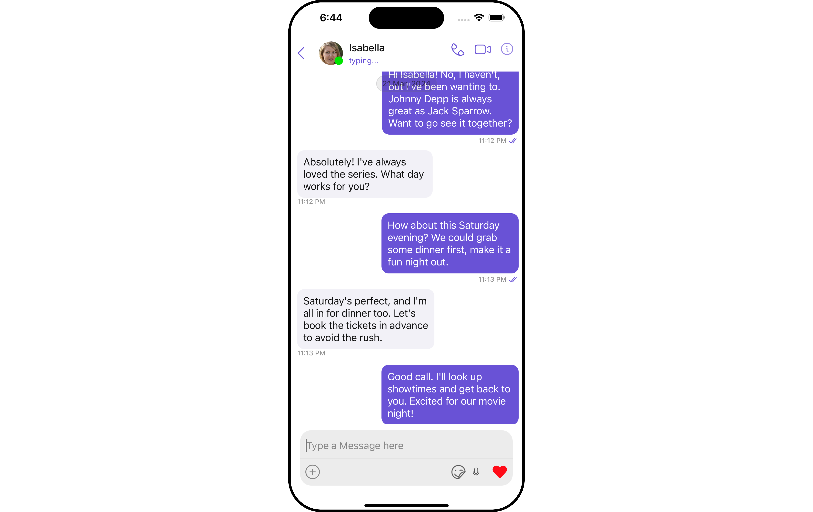
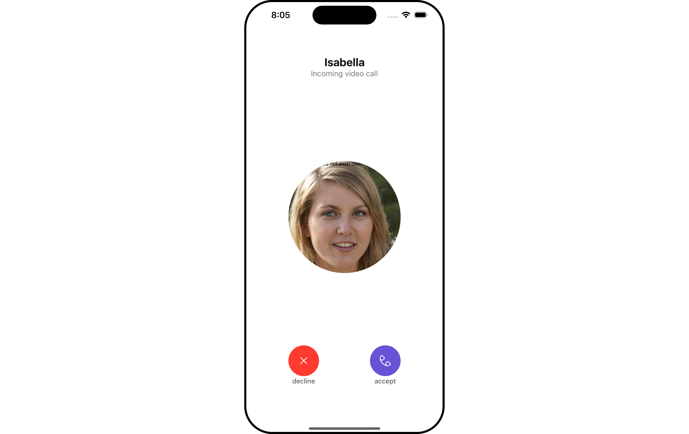
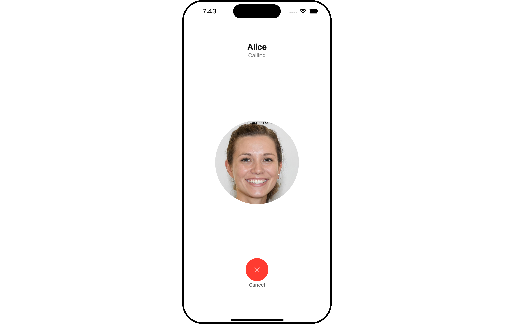
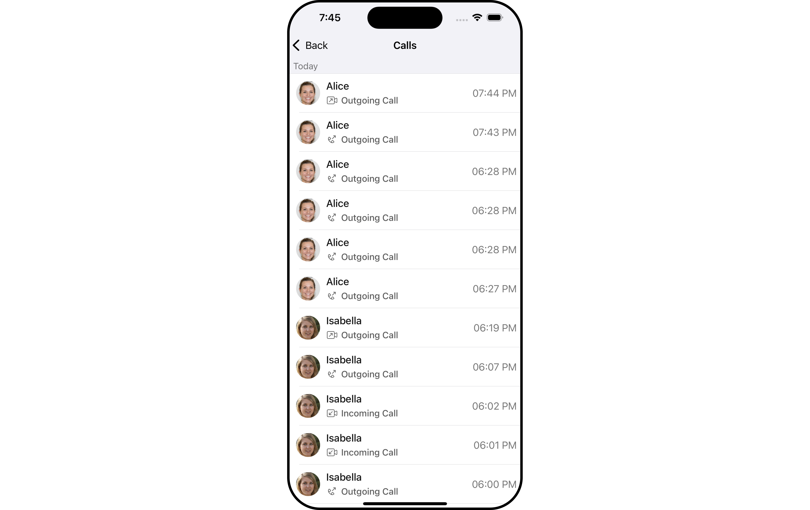

import Tabs from '@theme/Tabs';
import TabItem from '@theme/TabItem';

## Overview

CometChat's Calls feature is an advanced functionality that allows you to seamlessly integrate one-on-one as well as group audio and video calling capabilities into your application. This document provides a technical overview of these features, as implemented in the iOS UI Kit.

## Integration

First, make sure that you've correctly integrated the UI Kit library into your project. If you haven't done this yet or are facing difficulties, refer to our [Getting Started](/ui-kit/ios/getting-started) guide. This guide will walk you through a step-by-step process of integrating our UI Kit into your iOS project.

Once you've successfully integrated the UI Kit, the next step is to add the CometChat Calls SDK to your project. This is necessary to enable the calling features in the UI Kit. Here's how you do it:

**1. CocoaPods**

We recommend using CocoaPods, as they are the most advanced way of managing iOS project dependencies. Open a terminal window, move to your project directory, and then create a Podfile by running the following command.
:::info

1. You can install CometChatCallsSDK for iOS through Swift Package Manager or Cocoapods

2. CometChatCallsSDK supports iOS 13 and aboveSwift 5.0+

3. CometChatCallsSDK supports Swift 5.0+
   :::

```groovy title="Swift"
$ pod init
```

Add the following lines to the Podfile.

```groovy title="Swift"
platform :ios, '11.0'
use_frameworks!

target 'YourApp' do
  pod 'CometChatUIKitSwift', '4.3.19'
  pod 'CometChatCallsSDK', '4.0.8'
end
```

And then install the CometChatCallsSDK framework through CocoaPods.

```groovy title="Swift"
$ pod install
```

If you're facing any issues while installing pods then use the below command.

```groovy title="Swift"
$ pod install --repo-update
```

Always get the latest version of CometChatCallsSDK by command.

```groovy title="Swift"
$ pod update CometChatCallsSDK
```

:::tip

Always ensure to open the XCFramework file after adding the dependencies.

:::

---

**2. Swift Package Manager.**

Add the Call SDK dependency :

You can install **Calling SDK for iOS** through **Swift Package Manager.**

1. Go to your Swift Package Manager's File tab and select Add Packages

2. Add `CometChatCallsSDK` into your `Package Repository` as below:

```groovy title="Bash"
https://github.com/cometchat/calls-sdk-ios.git
```

3. To add the package, select Version Rules, enter Up to Exact Version, **4.0.5** and click Next.

:::note

Before Adding the Call SDK dependency to your project's dependencies please make sure that you have completed the Chat UI Kit Integration.

:::

After adding this dependency, the iOS UI Kit will automatically detect it and activate the calling features. Now, your application supports both audio and video calling. You will see [CallButtons](/ui-kit/ios/call-buttons) component rendered in [MessageHeader](/ui-kit/ios/message-header) Component.



<!--  -->

## Features

### Incoming Call

The [Incoming Call](/ui-kit/ios/incoming-call) component of the CometChat UI Kit provides the functionality that lets users receive real-time audio and video calls in the app.

When a call is made to a user, the Incoming Call component triggers and displays a call screen. This call screen typically displays the caller information and provides the user with options to either accept or reject the incoming call.



<!--  -->

### Outgoing Call

The [Outgoing Call](/ui-kit/ios/incoming-call) component of the CometChat UI Kit is designed to manage the outgoing call process within your application. When a user initiates an audio or video call to another user or group, this component displays an outgoing call screen, showcasing information about the recipient and the call status.

Importantly, the Outgoing Call component is smartly designed to transition automatically into the ongoing call screen once the receiver accepts the call. This ensures a smooth flow from initiating the call to engaging in a conversation, without any additional steps required from the user.



<!--  -->

### Ongoing Call

The [OngoingCall](/ui-kit/ios/ongoing-call) component is the user interface that displays during an ongoing call. For an audio call, this screen displays the participant's name, call duration, and buttons to mute the audio, enable or disable video, switch the camera, and end the call.

For a video call, the Call Screen might additionally display the video footage from both the user's camera and the recipient's camera.


<!--  -->

<!-- ### Call Recordings

The [Call Recordings](/ui-kit/android/call-log-recording) component of CometChat's UI Kit is designed to provide users with a comprehensive view of their recorded call history. This feature allows users to keep track of their interactions, which can be especially useful in contexts like business meetings, interviews, or educational sessions.

In the Call Recordings component, each entry represents a recorded call, and the list is usually arranged in chronological order. Each entry or call log includes details such as the call participants, the duration of the call, the date and time of the call, as well as a link or option to access the recording. -->

### Call Logs

[Call Logs](/ui-kit/ios/call-log-with-details) component provides you with the records call events such as who called who, the time of the call, and the duration of the call. This information can be fetched from the CometChat server and displayed in a structured format for users to view their past call activities.



<!--  -->
