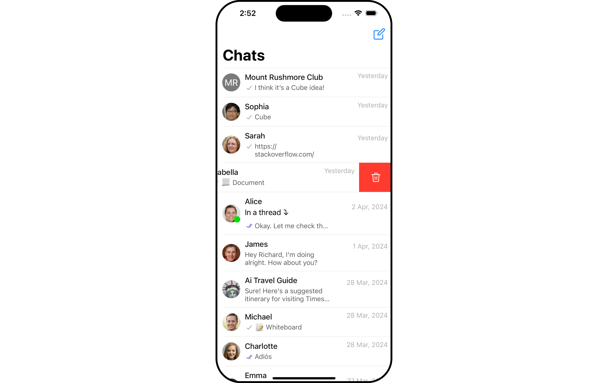
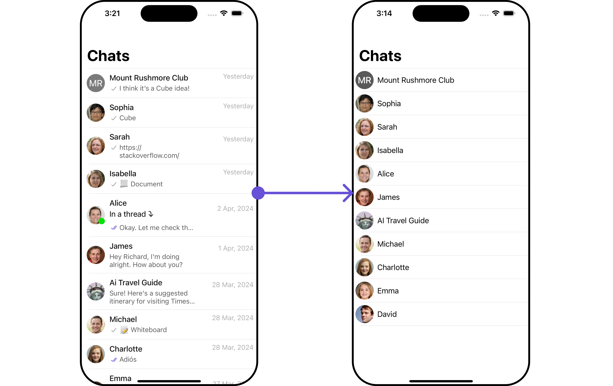
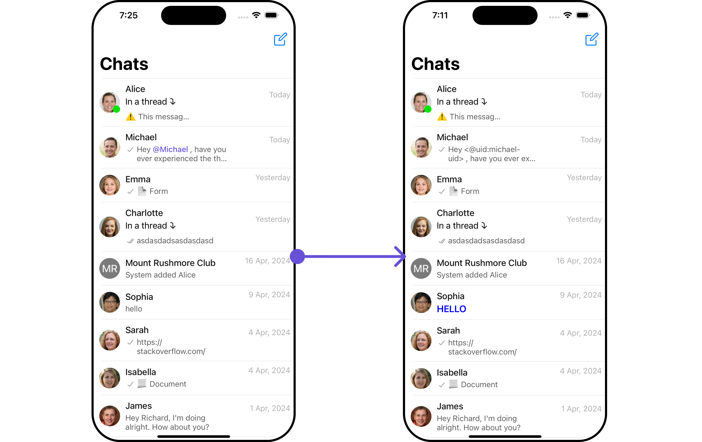
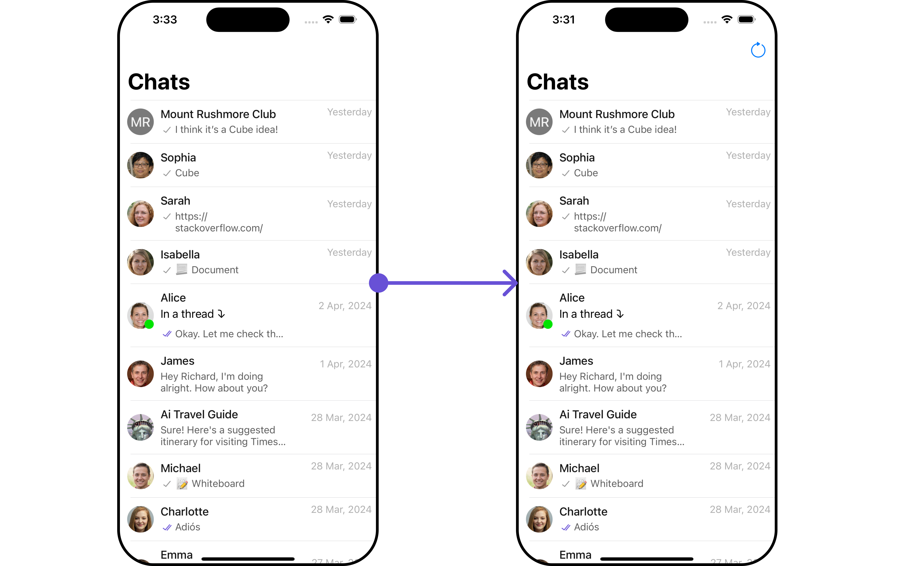
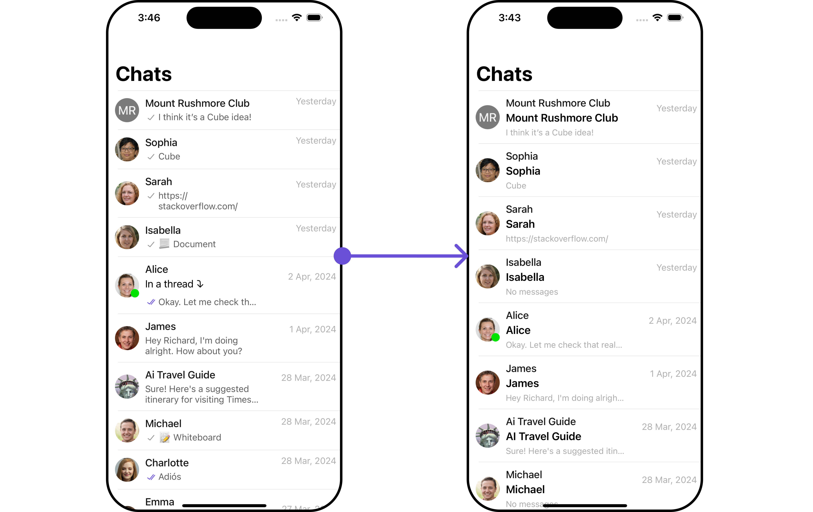

import Tabs from '@theme/Tabs';
import TabItem from '@theme/TabItem';

## Overview

The Conversations is a [Component](/ui-kit/ios/components-overview#components), That shows all conversations related to the currently logged-in user,



<!--  -->

## Usage

### Integration

As CometChatConversations is a custom view controller, it can be initiated either by tapping a button or through the trigger of any event. It offers multiple parameters and methods for tailoring its user interface.

```swift title="swift"
let cometChatConversations = CometChatConversations()
let naviVC = UINavigationController(rootViewController: cometChatConversations)
self.present(naviVC, animated: true)

```

- Integration (With Custom Request Builder)

During the initialization of **CometChatConversations,** users can provide this custom request builder.

```swift title="swift"
// You can create ConversationRequestBuilder as per your requirement
let conversationRequestBuilder = ConversationRequest.ConversationRequestBuilder(limit: 20).set(conversationType: .both)

let cometChatConversations = CometChatConversations(conversationRequestBuilder: conversationRequestBuilder)
let naviVC = UINavigationController(rootViewController: cometChatConversations)
self.present(naviVC, animated: true)

```

:::tip
If a navigation controller is already in use, opt for the `pushViewController` method instead of presenting the view controller.
:::

### Actions

[Actions](/ui-kit/ios/components-overview#actions) dictate how a component functions. They are divided into two types: Predefined and User-defined. You can override either type, allowing you to tailor the behavior of the component to fit your specific needs.

1. ##### setOnItemClick

`setOnItemClick` is triggered when you click on a ListItem of the Conversations component.
This `setOnItemClick` method proves beneficial when a user intends to customize the on-click behavior in CometChatConversations.

<Tabs>

<TabItem value="swift" label="Swift">
```swift title=""
// syntax for setOnItemClick(onItemClick: @escaping ((_ conversation: Conversation, _ indexPath: IndexPath) -> Void))
cometChatConversations.setOnItemClick { conversation, indexPath in
    // Override on item click
}

````
</TabItem>

</Tabs>

---

##### 2. setOnBack

This `setOnBack` method becomes valuable when a user needs to override the action triggered upon pressing the back button in CometChatConversations.

<Tabs>

<TabItem value="swift" label="Swift">
```swift title=""
// syntax for setOnBack(onBack: @escaping () -> Void)
cometChatConversations.setOnBack {
    // Override on back
}
````

</TabItem>

</Tabs>

---

##### 3. setOnSelection

The `selectionMode` feature enables selection with modes: .single and .multiple.

The `setOnSelection` event is triggered upon the completion of a selection in `SelectionMode`. This returns the selected conversations list when the callback is triggered. It can be executed with any button or action.

<Tabs>

<TabItem value="swift" label="Swift">
```swift title=""
cometChatConversations.selectionMode(mode: .single)

private func onButtonClick() {
cometChatConversations.setOnSelection { conversations in
// Perform action
}
}

````

</TabItem>

</Tabs>

---

##### 4. setOnError

This method proves helpful when a user needs to customize the action taken upon encountering an error in CometChatConversations.

<Tabs>

<TabItem value="swift" label="Swift">
```swift title=""
// syntax for setOnError(onError: @escaping ((_ error: CometChatException) -> Void))
cometChatConversations.setOnError { error in
    // Override on error
}

````

</TabItem>

</Tabs>

---

### Filters

You can set `ConversationsRequestBuilder` in the Conversations Component to filter the conversation list. You can modify the builder as per your specific requirements with multiple options available to know more refer to [ConversationRequestBuilder](/sdk/ios/retrieve-conversations).

You can set filters using the following parameters.

1. **Conversation Type:** Filters on type of Conversation, `User` or `Groups`
1. **Limit:** Number of conversations fetched in a single request.
1. **WithTags:** Filter on fetching conversations containing tags
1. **Tags:** Filters on specific `Tag`
1. **UserTags:** Filters on specific User `Tag`
1. **GroupTags:** Filters on specific Group `Tag`

<Tabs>

<TabItem value="swift" label="Swift">
```swift title=""
// You can create ConversationRequestBuilder as per your requirement
let conversationRequestBuilder = ConversationRequest.ConversationRequestBuilder(limit: 20).set(conversationType: .both)

let cometChatConversations = CometChatConversations(conversationRequestBuilder: conversationRequestBuilder)
let naviVC = UINavigationController(rootViewController: cometChatConversations)
self.present(naviVC, animated: true)

````

</TabItem>


</Tabs>

:::tip
If a navigation controller is already in use, opt for the `pushViewController` method instead of presenting the view controller.
:::

---

### Events

[Events](/ui-kit/ios/components-overview#events) are emitted by a `Component`. By using event you can extend existing functionality. Being global events, they can be applied in Multiple Locations and are capable of being Added or Removed.

##### 1. ConversationDeleted

This event will be emitted when the user deletes a conversation
<Tabs>
<TabItem value="swift" label="Swift">

```swift title="Add Listener"
// View controller from your project where you want to listen events.
public class ViewController: UIViewController {

   public override func viewDidLoad() {
        super.viewDidLoad()

       // Subscribing for the listener to listen events from conversation module
         CometChatConversationEvents.addListener("UNIQUE_ID", self as CometChatConversationEventListener)
    }

}

 // Listener events from conversation module
extension  ViewController: CometChatConversationEventListener {

    func onConversationDelete(conversation: Conversation) {
        // Do Stuff
    }

}
```

```swift title="Remove Listener"
 public override func viewWillDisappear(_ animated: Bool) {
       // Uncubscribing for the listener to listen events from conversation module
        CometChatConversationEvents.removeListener("LISTENER_ID_USED_FOR_ADDING_THIS_LISTENER")
    }
```

</TabItem>


</Tabs>

## Customization

To align with your app's design specifications, you have the flexibility to customize the appearance of the conversation component. We offer accessible methods that empower you to tailor the experience and functionality to meet your unique requirements.

### Style

Using Style you can customize the look and feel of the component in your app, These parameters typically control elements such as the color, size, shape, and fonts used within the component.

##### 1. Conversation Style

You can set the `ConversationsStyle` to the `Conversations` Component to customize the styling.

<Tabs>

<TabItem value="swift" label="Swift">
```swift
// Creating  ConversationsStyle object
let conversationsStyle = ConversationsStyle()

// Creating  Modifying the propeties of conversations
conversationsStyle.set(background: .black)
            .set(cornerRadius: CometChatCornerStyle(cornerRadius: 0.0))
            .set(borderColor: .clear)
            .set(borderWidth: 0)
            .set(largeTitleFont: .boldSystemFont(ofSize: 34))
            .set(largeTitleColor: .white)
            .set(titleFont: .systemFont(ofSize: 18))
            .set(titleColor: .white)
            .set(backButtonTint: .white)
            .set(privateGroupIconBackgroundColor: .orange)
            .set(protectedGroupIconBackgroundColor: .green)


// Setting the conversations style
cometChatConversations.set(conversationsStyle: conversationsStyle)
```

</TabItem>

</Tabs>

List of properties exposed by ConversationStyle

| Property                           | Description                                                               | Code                                           |
| ---------------------------------- | ------------------------------------------------------------------------- | ---------------------------------------------- |
| **Background Color**               | Used to set the background color                                          | `set(background: UIColor)`                   |
| **Border Width**                   | Used to set border width                                                  | `set(borderWidth: CGFloat)`                          |
| **Border Color**                   | Used to set border color                                                  | `.set(borderColor: .clear)`                   |
| **Corner Radius**                  | Used to set border radius                                                 | `set(cornerRadius: CometChatCornerStyle)`                       |
| **Title Appearance**               | Used to customise the appearance of the title in the app bar              | `set(titleFont: UIFont)`               |
| **BackIcon Tint**                  | Used to set the color of the back icon in the app bar                     | `set(backButtonTint: UIColor)`                  |
| **StatusIndicator Style**             | Used to set the style of the status indicator shown if a member is online | `set(statusIndicatorStyle: StatusIndicatorStyle)`             |


##### 2. Avatar Style

To apply customized styles to the `Avatar` component in the `Conversations` Component, you can use the following code snippet. For more information, visit [Avatar Styles](./avatar).

<Tabs>

<TabItem value="swift" label="Swift">
```swift
// Creating  AvatarStyle object
let avatarStyle = AvatarStyle()

// Creating  Modifying the propeties of avatar
 avatarStyle.set(background: .red)
            .set(textFont: .systemFont(ofSize: 18))
            .set(textColor: .white)
            .set(cornerRadius: CometChatCornerStyle(cornerRadius: 8.0))
            .set(borderColor: .white)
            .set(borderWidth: 5)
            .set(outerViewWidth: 3)
            .set(outerViewSpacing: 3)

// Setting the avatar style
cometChatConversations.set(avatarStyle: avatarStyle)
```
</TabItem>

</Tabs>

##### 3. StatusIndicator Style

To apply customized styles to the Status Indicator component in the `Conversations` Component, you can use the following code snippet. For more information, visit [Indicator Styles](./status-indicator).

<Tabs>

<TabItem value="swift" label="Swift">
```swift
statusIndicator.set(borderWidth:8)
.set(borderColor: [UIColor lightGreen])
.set(backgroundColor: [UIColor:green])

```
</TabItem>

</Tabs>

##### 4. Date Style

To apply customized styles to the `Date` component in the `Conversations` Component, you can use the following code snippet. For more information, visit [Date Styles](./date).

<Tabs>

<TabItem value="swift" label="Swift">
```swift
// Creating  DateStyle object
let dateStyle = DateStyle()

// Creating  Modifying the propeties of date
 dateStyle.set(titleColor: .systemFont(ofSize: 10))
.set(titleFont: .white)

// Setting the date style
cometChatConversations.set(dateStyle: dateStyle)
```
</TabItem>

</Tabs>

##### 5. Badge Style

To apply customized styles to the `Badge` component in the `Conversations` Component, you can use the following code snippet. For more information, visit [Badge Styles](./badge)

<Tabs>

<TabItem value="swift" label="Swift">
```swift
// Creating  BadgeStyle object
let badgeStyle = BadgeStyle()

// Creating  Modifying the propeties of badge
 badgeStyle.set(background: .red)
            .set(textFont: .systemFont(ofSize: 10))
            .set(textColor: .white)
            .set(cornerRadius: CometChatCornerStyle(cornerRadius: 8.0))
            .set(borderColor: .white)
            .set(borderWidth: 5)

// Setting the badge style
cometChatConversations.set(badgeStyle: badgeStyle)

```
</TabItem>

</Tabs>

##### 6. LisItem Style

To apply customized styles to the `ListItemStyle` component in the `Conversations` Component, you can use the following code snippet. For more information, visit [List Item Styles](./list-item).

<Tabs>

<TabItem value="swift" label="Swift">
```swift
// Creating  ListItemStyle object
let listItemStyle = ListItemStyle()

// Creating  Modifying the propeties of list item
 listItemStyle.set(background: .black)
              .set(titleFont: .systemFont(ofSize: 18))
              .set(titleColor: .white)
              .set(cornerRadius: CometChatCornerStyle(cornerRadius: 2.0))
              .set(borderColor: .white)
              .set(borderWidth: 5)

// Setting the list item style
cometChatConversations.set(listItemStyle: listItemStyle)
```
</TabItem>

</Tabs>

### Functionality

These are a set of small functional customizations that allow you to fine-tune the overall experience of the component. With these, you can change text, set custom icons, and toggle the visibility of UI elements.

<Tabs>

<TabItem value="swift" label="Swift">
```swift
//syntax for show(backButton: Bool)
cometChatConversations.show(backButton: Bool)

//syntax for set(backButtonIcon: UIImage)
cometChatConversations.set(backButtonIcon: UIImage("back.png"))

//syntax for set(backButtonTitle: String)
cometChatConversations.set(backButtonTitle: "Back")

```
</TabItem>

</Tabs>

Below is a list of customizations along with corresponding code snippets

| Property               | Description                                                                                                                                                                            | Code                                                          |
| ---------------------- | -------------------------------------------------------------------------------------------------------------------------------------------------------------------------------------- | ------------------------------------------------------------- |
| Title                  | Used to set custom title in the app bar.                                                                                                                                               | `.setTitle("Your Custom Title")`                              |
| Selection Mode         | Used to set a custom text response when fetching the conversations has returned an empty list                                                                                          | `selectionMode(mode: SelectionMode)`   |
| ProtectedGroup Icon    | Used to set icon shown in place of status indicator for password protected group                                                                                                       | ` .set(protectedGroupIcon: UIImage)` |
| Sent Icon           | Used to customize the receipt icon shown in the subtitle of the conversation item if hideReceipt is false and if the status of the last message in the conversation is sent      | ` .set(sentIcon: UIImage)`           |
| Delivered Icon         | Used to customize the receipt icon shown in the subtitle of the conversation item if hideReceipt is false and if the status of the last message in the conversation is delivered | `.set(deliveredIcon: UIImage)`       |
| Read Icon              | Used to customize the receipt icon shown in the subtitle of the conversation item if hideReceipt is false and if the status of the last message in the conversation is read      | `.set(readIcon: UIImage)	`             |
| Back Icon              | used to set back button located in the app bar                                                                                                                                         | `.set(backButtonIcon: UIImage)	`          |
| Show BackButton        | Used to toggle visibility for back button in the app                                                                                                                                | `.show(backButton: Bool)	`                                      |`                                         |
| Hide Error             | Used to hide error on fetching conversations                                                                                                                                           | `.hide(error: Bool)	`                                          |
| Hide Separator         | Used to control visibility of Separators in the list view                                                                                                                              | `.hide(separator: Bool)	`                                      |
| Disable UsersPresence  | Used to control visibility of status indicator shown if user is online                                                                                                                 | `.disable(userPresence: Bool)	`                               |
| Hide Receipt        | Used to hide message receipts shown in the subtitle of the conversation item.                            | `.hide(receipt: Bool)	`                                     |
| Disable Typing         | Used to toggle visibility of typing indicator                                                                                                                                          | `.disable(typing: Bool)	`                                      |

### Advanced

For advanced-level customization, you can set custom views to the component. This lets you tailor each aspect of the component to fit your exact needs and application aesthetics. You can create and define your views, layouts, and UI elements and then incorporate those into the component.

---

#### SetListItemView

With this function, you can assign a custom ListItem view to the Conversations Component.

<Tabs>

<TabItem value="swift" label="Swift">

```swift
// syntax for setSubtitle(subtitleView:@escaping((_ conversation: Conversation) -> UIView))
cometChatConversations.setListItemView { conversation in
    // Declared customListItem
    let customListItem = CustomListItem()
    customListItem.set(conversation: conversation)
    // return customListItem
    return customListItem
}

```

</TabItem>


</Tabs>

Demonstration


<!--  -->

You can create a `CustomListItemView` as a custom `UIView`. Which we will inflate in `setListItemView()`

```swift title="swift"

import UIKit
import CometChatUIKitSwift

class CustomListItem: UIView {
    // Initialize UI components
    private var profileImageView: CometChatAvatar = {
        let imageView = CometChatAvatar(image: UIImage())
        imageView.translatesAutoresizingMaskIntoConstraints = false // Important for manual layout
        return imageView
    }()

    private var nameLabel: UILabel = {
        let label = UILabel()
        label.translatesAutoresizingMaskIntoConstraints = false // Important for manual layout
        return label
    }()

    override init(frame: CGRect) {
        super.init(frame: frame)
        setupUI()
    }

    required init?(coder aDecoder: NSCoder) {
        fatalError("init(coder:) has not been implemented")
    }

    private func setupUI() {
        addSubview(profileImageView)
        addSubview(nameLabel)

        NSLayoutConstraint.activate([
            // Profile image constraints
            profileImageView.leadingAnchor.constraint(equalTo: leadingAnchor, constant: 8),
            profileImageView.centerYAnchor.constraint(equalTo: centerYAnchor),
            profileImageView.widthAnchor.constraint(equalToConstant: 40),
            profileImageView.heightAnchor.constraint(equalToConstant: 40),

            nameLabel.leadingAnchor.constraint(equalTo: profileImageView.trailingAnchor, constant: 8),
            nameLabel.trailingAnchor.constraint(equalTo: trailingAnchor, constant: -8),
            nameLabel.centerYAnchor.constraint(equalTo: centerYAnchor)
        ])
    }

    func set(conversation: Conversation) {
        var avatarURL: String?
        if let group = conversation.conversationWith as? Group {
            nameLabel.text = group.name
            avatarURL = group.icon
        }

        if let user = conversation.conversationWith as? User {
            nameLabel.text = user.name
            avatarURL = user.avatar
        }


self.profileImageView.setAvatar(avatarUrl: avatarURL, with: nameLabel.text)
            }
}
```


---
#### SetTextFormatters
Assigns the list of text formatters. If the provided list is not null, it sets the list. Otherwise, it assigns the default text formatters retrieved from the data source. To configure the existing Mentions look and feel check out [CometChatMentionsFormatter](/ui-kit/ios/mentions-formatter-guide)

**Example**

In this example, we demonstrate the creation of a custom Swift file for the CometChat text formatter.

Here are the functions provided by the custom text formatter:

- getRegex(): Defines words to replace, such as "hello".
- getTrackingCharacter(): Initiates mention suggestions with "@".
- prepareMessageString( ): Formats specific words like "hello" based on message type (sent or received).


<!--  -->
<Tabs>

<TabItem value="swift" label="Custom_text_formatter">

    ```swift
import Foundation
import CometChatSDK
import CometChatUIKitSwift

class MyCustomTextFormatter: CometChatTextFormatter {
    override func getRegex() -> String {
        return "(\\bhello\\b)"
    }

    override func getTrackingCharacter() -> Character {
        return "@"
    }

    override func search(string: String, suggestedItems: ((_: [SuggestionItem]) -> ())? = nil) {
        // This function would call an API or perform a local search
        // For now, it does nothing
    }

    override func onScrollToBottom(suggestionItemList: [SuggestionItem], listItem: ((_: [SuggestionItem]) -> ())?) {
        // This function would call the next page of an API
        // For now, it does nothing
    }

    override func onItemClick(suggestedItem: SuggestionItem, user: User?, group: Group?) {
        // Do something with the clicked item
    }

    override func handlePreMessageSend(baseMessage: BaseMessage, suggestionItemList: [SuggestionItem]) {
        // This function would modify the message before it's sent
        // For now, it does nothing
    }

    override func prepareMessageString(
      baseMessage: BaseMessage,
      regexString: String,
      alignment: MessageBubbleAlignment = .left,
      formattingType: FormattingType
    ) -> NSAttributedString {
        let attrString = NSMutableAttributedString(string: "HELLO")
        if alignment == .left { // Received message
            attrString.addAttribute(.foregroundColor, value: UIColor.blue, range: NSRange(location: 0, length: attrString.length))
        } else { // Sent message
            attrString.addAttribute(.foregroundColor, value: UIColor.red, range: NSRange(location: 0, length: attrString.length))
        }
        attrString.addAttribute(.font, value: UIFont.boldSystemFont(ofSize: 18), range: NSRange(location: 0, length: attrString.length))
        return attrString
    }

    override func onTextTapped(baseMessage: BaseMessage, tappedText: String, controller: UIViewController?) {
        // Your Action
    }
}
    ```

</TabItem>


</Tabs>

```swift title='Swift'
let myCustomTextFormatter = MyCustomTextFormatter(trackingCharacter: "@")
let cometChatConversation = CometChatConversations()
    .set(textFormatters: [myCustomTextFormatter])
```

---

#### SetMenu

You can set the Custom Menu view to add more options to the Conversations component.

<Tabs>

<TabItem value="swift" label="Swift">

```swift
//syntax for set(menus: [UIBarButtonItem])
let menus = [UIBarButtonItem]()
// Construct list of menus you want to display on navigation bar
cometChatConversations.set(menus: menus)

```

</TabItem>


</Tabs>
    Demonstration
    
    <!--  -->

<!-- You can create a `[UIBarButtonItem]()`. Which we will inflate and pass it to `.setMenu`. -->

You can create a new array of `[UIBarButtonItem](  )` objects. This array will be inflated and then passed to the `.setMenu`.

```swift title="swift"
let menuButtonItem1 = UIBarButtonItem(image: UIImage(systemName: "goforward"), style: .plain, target: self, action: #selector(self.menuButtonAction))
let menus = [menuButtonItem1]
cometChatConversations.set(menus: menus)
```

 You can manage click actions accordingly.

<Tabs>

<TabItem value="swift" label="Swift">

```swift title ="swift"

 @objc func menuButtonAction(sender: UIBarButtonItem) {
        // Add your action here
    }

```

</TabItem>


</Tabs>

---

#### SetDatePattern

    You can modify the date pattern to your requirement using .setDatePattern. This method accepts a function with a return type String. Inside the function, you can create your own pattern and return it as a String.

<Tabs>

<TabItem value="swift" label="Swift">
    ```swift
    cometChatConversations.setDatePattern( )
    ```
</TabItem>


</Tabs>

Demonstration


<!--  -->

<Tabs>

<TabItem value="swift" label="Swift">
    ```swift
    // syntax for setDatePattern(datePattern:@escaping((_ conversation: Conversation) -> String))
cometChatConversations.setDatePattern { conversation in
    guard let time = conversation.lastMessage?.sentAt else { return ""}
    // Declared new date pattern with date formatter
    let date = Date(timeIntervalSince1970: TimeInterval(time))
    let dateFormatter = DateFormatter()
     dateFormatter.timeStyle = .medium //Set time style
     dateFormatter.dateStyle = .medium//Set date style
     dateFormatter.timeZone = .current
     let customDate = dateFormatter.string(from: date)
     // return customListItem
     return customDate
}
    ```
</TabItem>


</Tabs>

#### SetSubtitleView

You can customize the subtitle view for each conversation item to meet your requirements

<Tabs>

<TabItem value="swift" label="Swift">
    ```swift
    cometChatConversations.setSubtitleView()
    ```
</TabItem>


</Tabs>

Demonstration


<!--  -->

    You need to create a `SubtitleView` a custom `UIView` `cocoa touch file` and inflate it in the setSubtitleView apply function. Then, you can define individual actions depending on your requirements.


<Tabs>

<TabItem value="swift" label="Swift">
    ```swift
    // syntax for setSubtitle(subtitleView:@escaping((_ conversation: Conversation) -> UIView))
cometChatConversations.setSubtitle { conversation in
    // Declared customListItem
    let customSubtitleView = SubtitleView()
    customSubtitleView.set(conversation: conversation)
    // return customSubtitleView
    return customSubtitleView
}
    ```
</TabItem>


</Tabs>


    - `SubtitleView` file should should appear as follows:

    ```swift title="swift"
import UIKit
import CometChatUIKitSwift
import CometChatSDK

class SubtitleView: UIView {

    private var titleLabel: UILabel = {
        let label = UILabel()
        label.translatesAutoresizingMaskIntoConstraints = false
        label.font = UIFont.boldSystemFont(ofSize: 18)
        return label
    }()

    private var subtitleLabel: UILabel = {
        let label = UILabel()
        label.translatesAutoresizingMaskIntoConstraints = false
        label.font = UIFont.systemFont(ofSize: 14)
        label.textColor = .lightGray
        return label
    }()

    override init(frame: CGRect) {
        super.init(frame: frame)
        setupUI()
    }

    required init?(coder aDecoder: NSCoder) {
        super.init(coder: aDecoder)
        setupUI()
    }

    private func setupUI() {
        addSubview(titleLabel)
        addSubview(subtitleLabel)

        NSLayoutConstraint.activate([
            titleLabel.leadingAnchor.constraint(equalTo: leadingAnchor),
            titleLabel.topAnchor.constraint(equalTo: topAnchor),
            titleLabel.trailingAnchor.constraint(equalTo: trailingAnchor),

            subtitleLabel.leadingAnchor.constraint(equalTo: titleLabel.leadingAnchor),
            subtitleLabel.topAnchor.constraint(equalTo: titleLabel.bottomAnchor, constant: 5), // 5 points space
            subtitleLabel.trailingAnchor.constraint(equalTo: titleLabel.trailingAnchor),
            subtitleLabel.bottomAnchor.constraint(equalTo: bottomAnchor)
        ])
    }

    func set(conversation: Conversation) {
        if let user = conversation.conversationWith as? User {
            titleLabel.text = user.name
        } else if let group = conversation.conversationWith as? Group {
            titleLabel.text = group.name
        }

        if let lastMessage = conversation.lastMessage as? TextMessage {
            subtitleLabel.text = lastMessage.text
        } else {
            subtitleLabel.text = "No messages"
        }
    }
}


    ```

---


#### SetErrorStateView

    You can set a custom `ErrorStateView` using `setEmptyStateView` to match the error view of your app.

<Tabs>

<TabItem value="swift" label="Swift">
    ```swift
// syntax for set(errorMessage: String)

cometChatConversations.set(errorStateText: " ")
    ```

</TabItem>

</Tabs>

    Demonstration


    We have added an error view to `errorView`. You can choose any view you prefer. This view should be inflated and passed to the `setErrorView()` method.

    ```swift title="Swift"
let errorView = UIView()

let menuView = UIView()
    menuView.translatesAutoresizingMaskIntoConstraints = false
    menuView.backgroundColor = .green
    menuView.heightAnchor.constraint(equalToConstant: 50).isActive = true
    menuView.widthAnchor.constraint(equalToConstant: 200).isActive = true

cometChatConversations.set(errorView: menuView)

````

<Tabs>

<TabItem value="swift" label="Swift">
    ```swift title="Swift"
    // syntax for hide(error: true)

cometChatConversations.hide(errorText: true)

```

</TabItem>

</Tabs>

---

<!-- ## Configuration

Conversations is a Components, Hence it doesn't have [Configuration](/ui-kit/android/-overview#configurations). Configurations are only available for [Composite Components](/ui-kit/android/components#composite-components)

Conversations can be used by Composite Component, In this case, all the [Action](#style), [Filters](#filters), [Styles](#style), [Functionality](#functionality), and [Advanced](#advanced) properties of the Conversation component will be exposed via `ConversationConfigurations`.
```

-->
