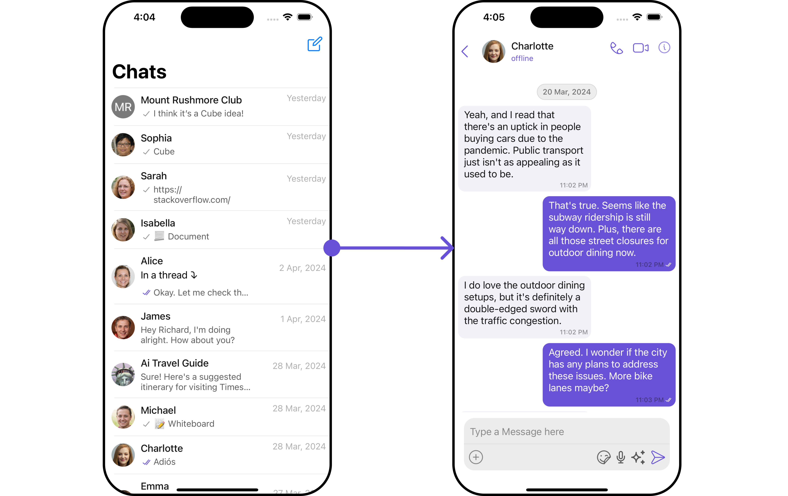
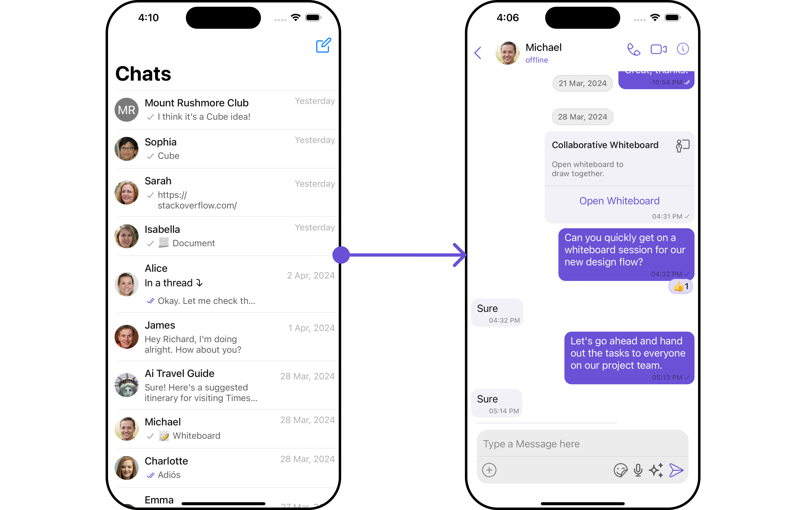
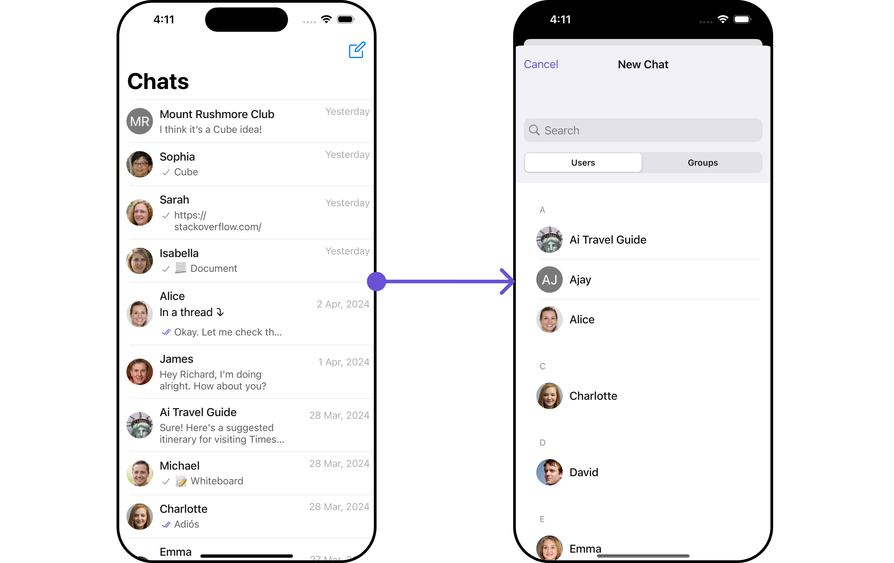
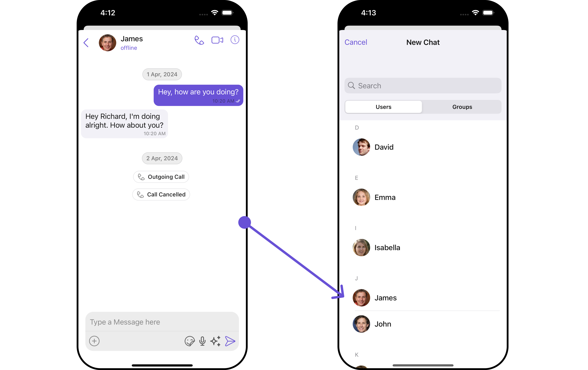
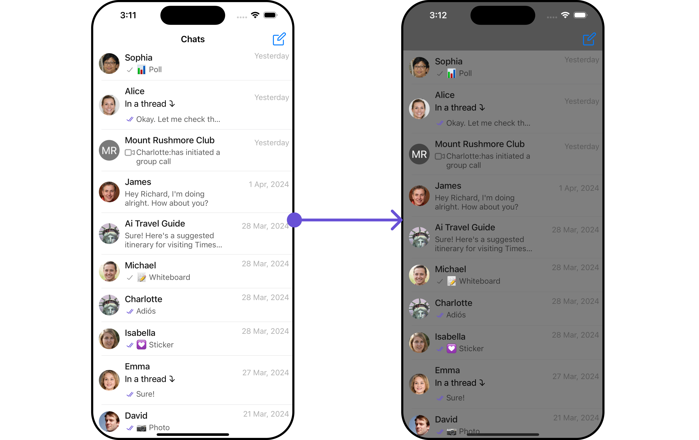

import Tabs from '@theme/Tabs';
import TabItem from '@theme/TabItem';

## Overview

<!-- Component description -->

The `ConversationsWithMessages` is a [Composite Component](/ui-kit/ios/components-overview#components) encompassing components such as [Conversations](/ui-kit/ios/conversations), [Messages](/ui-kit/ios/messages), and [Contacts](/ui-kit/ios/contacts)
. Each of these component contributes to the functionality and structure of the overall ConversationsWithMessages component.



<!--  -->

| Components                                 | Description                                                                                                                                            |
| ------------------------------------------ | ------------------------------------------------------------------------------------------------------------------------------------------------------ |
| [Conversations](/ui-kit/ios/conversations) | The `Conversations` component is designed to display a list of either `User` or `Group`. This essentially represents your recent conversation history. |
| [Messages](/ui-kit/ios/messages)           | The `Messages` component is designed to manage the messaging interaction for either individual `User` or `Group` conversations.                        |
| [Contacts](/ui-kit/ios/contacts)           | The `CometChatContacts` component is specifically designed to facilitate the display and management of both `User` and `Groups`.                       |

## Usage

### Integration

Since `CometChatConversationsWithMessages` is a **view controller**, it can be launched either by a button click or through any event's trigger. It inherits all the customizable properties and methods of `CometChatConversations.`

**View Controller**: To use ConversationsWithMessages in your `view controller`, use the following code snippet.

```swift title="view controller"
let cometChatConversationsWithMessages = CometChatConversationsWithMessages()
self.navigationController?.pushViewController(cometChatConversationsWithMessages, animated: true)

```

---

**Scene Delegate**: To use ConversationsWithMessages in your `Navigation controller,` use the following code snippet in your `willConnectTo` method in SceneDelegate.

<Tabs>

<TabItem value="swift" label="Swift">

```swift
let cometChatConversationsWithMessages = CometChatConversationsWithMessages()
let naviVC = UINavigationController(rootViewController: cometChatConversationsWithMessages)

window?.rootViewController = naviVC

```

:::info
make sure to `import CometChatUIKitSwift`
:::

</TabItem>

</Tabs>

---

### Actions

[Actions](/ui-kit/ios/components-overview#actions) dictate how a component functions. They are divided into two types: Predefined and User-defined. You can override either type, allowing you to tailor the behavior of the component to fit your specific needs.

While the ConversationsWithMessages component does not have its actions, its components - [Conversation](/ui-kit/ios/conversations#actions), [Messages](/ui-kit/ios/messages), and [Contacts](/ui-kit/ios/contacts) - each have their own set of actions.

The Action of the components can be overridden through the use of the [Configurations](#configurations) object of its components. Here is an example code snippet.

<Tabs>

<TabItem value="swift" label="Swift">

```swift
// Create an object of ConversationsConfiguration
let conversationsConfiguration = ConversationsConfiguration()

let avatarStyle = AvatarStyle( )
avatarStyle.set(cornerRadius: .init(cornerRadius: 5))

// Assign the properties as per your need
conversationsConfiguration.hide(receipt: true)
.disable(soundForMessages: true)
.set(avatarStyle: avatarStyle)

```

</TabItem>

</Tabs>

**Usage**

ConversationsConfiguration can be used in a component where CometChatConversations is present as a child component. We just pass that `ConversationsConfiguration` object to the CometChatConversations component.

<Tabs>
<TabItem value="Swift" label="Swift">

```swift
conversationsWithMessages.set(conversationsConfiguration: conversationsConfiguration)
```

</TabItem>
</Tabs>

The ConversationsWithMessages component overrides several actions from its components to reach its default behavior. The list of actions overridden by ConversationsWithMessages includes:

- [setOnItemClick](/ui-kit/ios/conversations#setonitemclick) : This `setOnItemClick` method proves beneficial when a user intends to customize the on-click behavior in CometChatConversations.



  <!--  -->

### Filters

**Filters** allow you to customize the data displayed in a list within a Component. You can filter the list based on your specific criteria, allowing for a more customized. Filters can be applied using RequestBuilders of Chat SDK.

While the ConversationsWithMessages component does not have filters, its components do, For more detail on individual filters of its component refer to [Conversations](/ui-kit/ios/conversations#filters)[ Filters](/ui-kit/ios/conversations#filters) and [Messages Filters](/ui-kit/ios/messages).

By utilizing the [Configurations](#configurations) object of its components, you can apply filters.

In the following **example**, we're filtering Conversation to only show `User`

<Tabs>

<TabItem value="swift" label="Swift">
```swift title=""
let conversationRequestBuilder = ConversationRequest.ConversationRequestBuilder(limit: 10).setConversationType(conversationType: .user)
        
let conversationsWithMessages = CometChatConversationsWithMessages(conversationRequestBuilder: conversationRequestBuilder)

let naviVC = UINavigationController(rootViewController: conversationsWithMessages)
self.present(naviVC, animated: true)

````

</TabItem>

</Tabs>

:::info
If you are already using a navigation controller, you can use the pushViewController function instead of presenting the view controller.
:::


:::tip
make sure to `import CometChatSDK`
:::
---

### Events

[Events](/ui-kit/ios/components-overview#events) are emitted by a `Component`. By using event you can extend existing functionality. Being global events, they can be applied in Multiple Locations and are capable of being Added or Removed.

The ConversationsWithMessages does not generate its events but its component does. For a full list of these events, you can refer to [Conversations events](/ui-kit/ios/conversations#events) and [Messages events](/ui-kit/ios/messages#events).

In the following example, we're incorporating observers for the `ConversationDeleted` event of `Conversations` component.

<Tabs>

<TabItem value="swift" label="Swift">

    ``` swift
// View controller from your project where you want to listen events.
public class ViewController: UIViewController {

   public override func viewDidLoad() {
        super.viewDidLoad()

       // Subscribing for the listener to listen events from conversation module
         CometChatConversationEvents.addListener("UNIQUE_ID", self as CometChatConversationEventListener)
    }

    public override func viewWillDisappear(_ animated: Bool) {
       // Uncubscribing for the listener to listen events from conversation module
        CometChatConversationEvents.removeListener("LISTENER_ID_USED_FOR_ADDING_THIS_LISTENER")
    }


}

 // Listener events from conversation module
extension  ViewController: CometChatConversationEventListener {

    func onConversationDelete(conversation: Conversation) {
        // Do Stuff
    }

}
    ```

</TabItem>


</Tabs>

---

## Customization

To fit your app's design requirements, you have the ability to customize the appearance of the
ConversationsWithMessages component. We provide exposed methods that allow you to modify the experience and behavior according to your specific needs.

### Style

Using **Style** you can **customize** the look and feel of the component in your app, These parameters typically control elements such as the **color**, **size**, **shape**, and **fonts** used within the component.
ConversationsWithMessages component doesn't have its own style parameters. But you can customize its component styles. For more details on individual component styles, you can refer [Conversation Styles](/ui-kit/ios/conversations#style), [Messages Styles](/ui-kit/ios/messages#messages-style), and [Contacts Styles](/ui-kit/ios/contacts#contactsstyle)

Styles can be applied to SubComponents using their respective [configurations](#configurations).

**Example**

<Tabs>

<TabItem value="swift" label="Swift">

```swift
// Creating  ConversationsStyle object
let conversationsStyle = ConversationsStyle()

// Creating  Modifying the propeties of conversations
conversationsStyle.set(background: .black)
    .set(cornerRadius: CometChatCornerStyle(cornerRadius: 0.0))
    .set(borderColor: .clear)
    .set(borderWidth: 0)
    .set(largeTitleFont: .boldSystemFont(ofSize: 34))
    .set(largeTitleColor: .white)
    .set(titleFont: .systemFont(ofSize: 18))
    .set(titleColor: .white)
    .set(backButtonTint: .white)
    .set(privateGroupIconBackgroundColor: .orange)
    .set(protectedGroupIconBackgroundColor: .green)


// Setting the conversations style
cometChatConversations.set(conversationsStyle: conversationsStyle)

```

</TabItem>

</Tabs>

### Functionality

These are a set of **small functional customizations** that allow you to **fine-tune** the overall experience of the component. With these, you can **change text**, set **custom icons**, and toggle the **visibility** of UI elements.

##### Set User

You can utilize the `set(user: User?)` function with a [User](/sdk/ios/user-management) object as input to ConversationsWithMessages. This will automatically guide you to the [Messages](./messages) component for the designated `User`.

<Tabs>

<TabItem value="swift" label="Swift">

```swift
//syntax for set(user: User?)

let user = User(uid: "kelvin", name: "Kelvin")
cometChatConversationsWithMessages.set(user: user)
```

</TabItem>


</Tabs>

---

##### Set Group

You can utilize the `set(group: Group?)` function with a [Group](/sdk/ios/groups-overview) object as input to ConversationsWithMessages. This will automatically guide you to the [Messages](./messages) component for the designated `Group`.

<Tabs>

<TabItem value="swift" label="Swift">

```swift
//syntax for set(group: Group?)

let group = Group(guid: "cometchat-guid-1", name: "Hiking Group")
cometChatConversationsWithMessages.set(group: group)
```

</TabItem>

</Tabs>

---

##### Components

Nearly all functionality customizations available for a Component are also available for the composite component. Using [Configuration](#configurations), you can modify the properties of its components to suit your needs.

You can find the list of all Functionality customization of individual components in [Conversations](/ui-kit/ios/conversations#functionality) , [Messages](/ui-kit/ios/messages#functionality), and [Contacts](/ui-kit/ios/Contacts)

**Example**

```swift

// Create an object of  ConversationsConfiguration
let conversationsConfiguration = ConversationsConfiguration()

let avatarStyle = AvatarStyle()
  .set(cornerRadius: .init(cornerRadius: 5))

  // Assign the properties as per your need
conversationsConfiguration.hide(receipt: true)
    .disable(soundForMessages: true)
    .set(avatarStyle: avatarStyle)
    .set(title: "erroror", mode: .always)
    .disable(typing: true)
    .hide(hideSeparator: false)
    .show(showBackButton: false)
```

**Usage**

```swift
conversationsWithMessages.set(conversationsConfiguration: conversationsConfiguration)
```

---

### Advanced

For advanced-level customization, you can set custom views to the component. This lets you tailor each aspect of the component to fit your exact needs and application aesthetics. You can create and define your own views, layouts, and UI elements and then incorporate those into the component.

By utilizing the [Configuration](#configurations) object of each component, you can apply advanced-level customizations to the ConversationsWithMessages.

**Example**

```swift
// Create an object of  ConversationsConfiguration
let conversationsConfiguration = ConversationsConfiguration()

 conversationsConfiguration.set(errorView: UIView)

```

**Usage**

The ConversationsConfiguration can be employed within a component that contains CometChatConversations as a child component. Simply pass the `ConversationsConfiguration` object to the CometChatConversations component.

```swift
conversationsWithMessages.set(conversationsConfiguration: conversationsConfiguration)
```

To find all the details on individual Component advance customization you can refer, [Conversations Advance](/ui-kit/ios/conversations#advanced),[Messages Advance](/ui-kit/ios/messages#advanced) and [Contacts Advance](/ui-kit/ios/contacts)

ConversationsWithMessages uses advanced-level customization of both Conversation & Messages components to achieve its default behavior.

1. ConversationsWithMessages utilizes the [SetMenu](/ui-kit/ios/conversations#setmenu) function of the `Conversations` subcomponent to navigate the user from [Conversations](/ui-kit/ios/conversations) to [Contacts](/ui-kit/ios/contacts)


   <!--  -->

2. ConversationsWithMessages utilizes the [SetMenu](/ui-kit/ios/message-header#setmenu) function of the `Messages` subcomponent to navigate the user from [Messages](/ui-kit/ios/messages) to [Details](/ui-kit/ios/user-details).


   <!--  -->

:::warning

When you override `.setMenu()`, the default behavior of ConversationsWithMessages will also be overridden.

:::

## Configurations

[Configurations](/ui-kit/ios/components-overview#configurations) offer the ability to customize the properties of each component within a Composite Component.

ConversationsWithMessages has `Conversations`, `Messages`, and `Contacts` component. Hence, each of these components will have its individual `Configuration``.

- `Configurations` expose properties that are available in its individual components.

#### Conversations

You can customize the properties of the Conversations component by making use of the ConversationsConfiguration. You can accomplish this by employing the `.setConversationsConfiguration()` method as demonstrated below:

<Tabs>

<TabItem value="swift" label="Swift">

```swift
let conversationsConfiguration = ConversationsConfiguration()

```

</TabItem>

</Tabs>

**Usage**

The ConversationsConfiguration can be employed within a component that contains CometChatConversations as a child component. Simply pass the `ConversationsConfiguration` object to the CometChatConversations component.

```swift
conversationsWithMessages.set(conversationsConfiguration: conversationsConfiguration)
```

All exposed properties of `ConversationsConfiguration` can be found under [Conversations](/ui-kit/ios/conversations). Properties marked with the <a data-tooltip-id="my-tooltip-html-prop"><span class="material-icons red">report</span></a> symbol are not accessible within the Configuration Object.

**Example**

Let's say you want to change the style of the Conversations subcomponent and, in addition, you only want to display users in the conversation list.

You can modify the style using the `ListItemStyle` method and filter the list with the `.      ConversationsRequestBuilder()` method.


<!--  -->

<Tabs>

<TabItem value="swift" label="Swift">
```swift title=""

 // Creating  ConversationsStyle object
    let conversationsStyle = ConversationsStyle()

// Creating  Modifying the propeties of conversations
    conversationsStyle.set(background: .lightGray.withAlphaComponent(0.5))

// Setting the conversations style

let listItemStyle = ListItemStyle()
.set(background: .lightGray.withAlphaComponent(0.5))

let cometChatConversationsWithMessages = CometChatConversationsWithMessages()
.set(conversationsStyle: conversationsStyle)
.set(listItemStyle: listItemStyle)

let conversationRequestBuilder = ConversationRequest.ConversationRequestBuilder(limit: 4).setConversationType(conversationType: .user)

let conversationsWithMessages = CometChatConversationsWithMessages(conversationRequestBuilder: conversationRequestBuilder)

let naviVC = UINavigationController(rootViewController: cometChatConversationsWithMessages)
self.present(naviVC, animated: true)

````

</TabItem>

</Tabs>

<!-- let conversationRequestBuilder = ConversationRequest.ConversationRequestBuilder(limit: 10).setConversationType(conversationType: .user)

let conversationsWithMessages = CometChatConversationsWithMessages(conversationRequestBuilder: conversationRequestBuilder)

let naviVC = UINavigationController(rootViewController: conversationsWithMessages)
self.present(naviVC, animated: true) -->

:::info
If you are already using a navigation controller, you can use the pushViewController function instead of presenting the view controller.
:::

:::tip
make sure to `import CometChatSDK`
:::

---

<!-- #### Messages

#### Contacts -->
