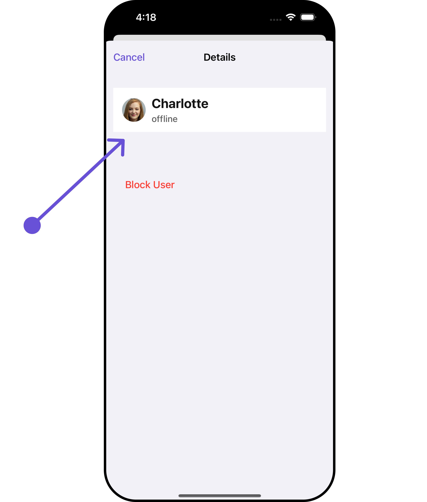
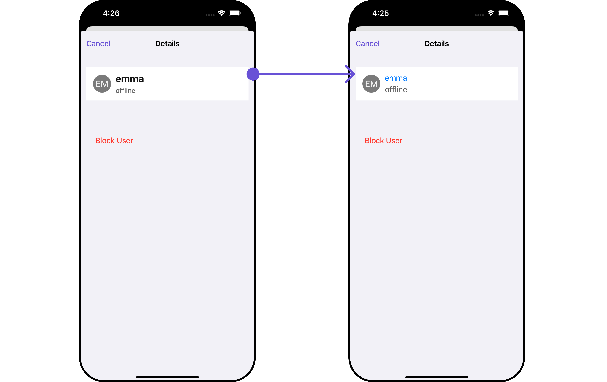
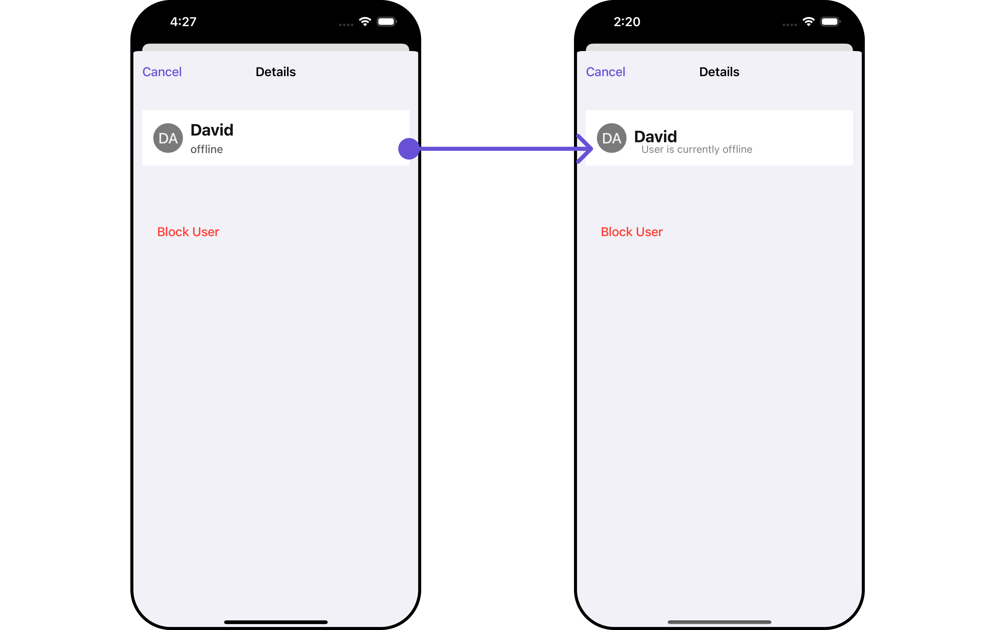
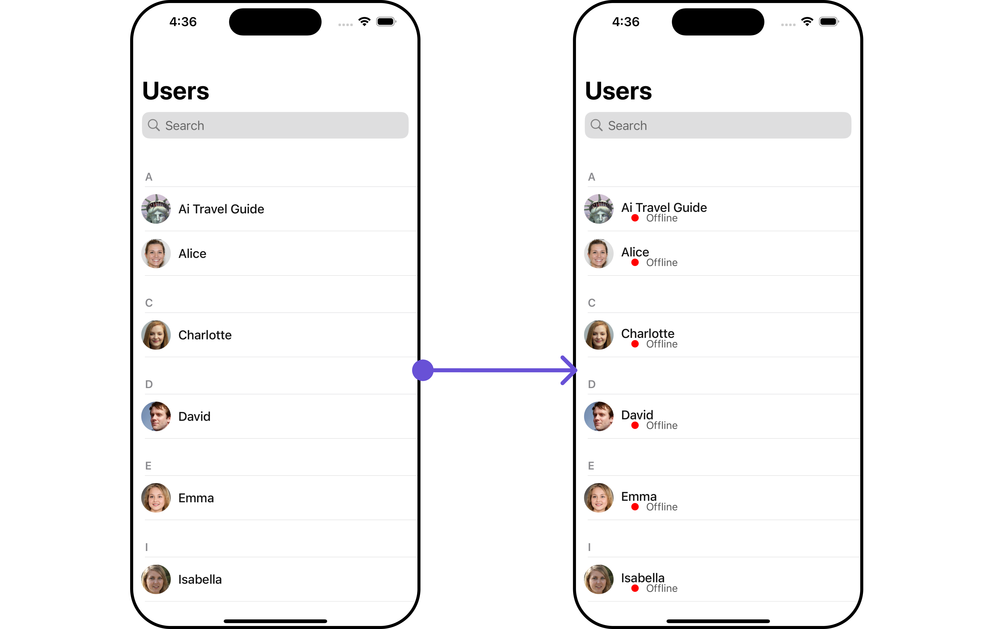

import Tabs from '@theme/Tabs';
import TabItem from '@theme/TabItem';

## Overview

`CometChatDetails` functions as a standalone component designed to establish a screen displaying the details of a specific user or group object. It inherits all properties and methods from the `CometChatListBase` class, ensuring comprehensive functionality and customization options.

CometChatDetails internally implements the following functionalities:

- User Information: It displays details about the user. This includes his/her profile picture, name, status, and other relevant information.
- User Actions: The details screen provides actions to block/unblock the user.



## Usage

### Integration

As `CometChatDetails` functions as a **view controller**, it can be directly launched through a button click or any user-initiated action. Additionally, it can be seamlessly integrated into a tab view controller. `CometChatDetails` offers a range of parameters and methods for customizing its user interface.

```swift title='Swift'
let user =  User(uid: "Your UID", name: "name")

let cometChatDetails = CometChatDetails()
cometChatDetails.set(user: user)
let naviVC = UINavigationController(rootViewController: cometChatDetails)
self.present(naviVC, animated: true)
```

:::info
If you are already using a navigation controller, you can use the pushViewController function instead of presenting the view controller.
:::

### Actions

[Actions](/ui-kit/ios/components-overview#actions) dictate how a component functions. They are divided into two types: Predefined and User-defined. You can override either type, allowing you to tailor the behavior of the component to fit your specific needs.

##### 1. SetOnClose

The `setOnClose` event is typically triggered when the close button is clicked and it carries a default action. However, with the following code snippet, you can effortlessly override this default operation.

This action does not come with any predefined behavior. However, you have the flexibility to override this event and tailor it to suit your needs using the following code snippet.

<Tabs>

<TabItem value="swift" label="Swift">

```swift
let cometChatDetails = CometChatDetails()
    .set (onClose:{
    //Perform Your Action
})
```

</TabItem>

</Tabs>

##### 2. SetOnBack

This method allows users to override the onBack Pressed behavior in **CometChatDetails** by utilizing the `setOnBack` , providing customization options for handling the back action.

By default, this action has a predefined behavior: it simply dismisses the current view controller.
However, the flexibility of CometChat UI Kit allows you to override this standard behavior according to your application's specific requirements. You can define a custom action that will be performed instead when the back button is pressed.

<Tabs>

<TabItem value="swift" label="Swift">
```swift
let cometChatDetails = CometChatDetails()
    .setOnBack {
     //Perform Your Action
}
```
</TabItem>

<TabItem value="" label="">

```

```

</TabItem>

</Tabs>

##### 3. SetOnError

This method `setOnError`, allows users to override error handling within **CometChatDetails**, providing greater control over error responses and actions.

<Tabs>

<TabItem value="swift" label="Swift">
```swift 
let cometChatDetails = CometChatDetails()
    .setOnError { error in
    //Perform Your Action
}
           
```
</TabItem>

<TabItem value="" label="">

```

```

</TabItem>

</Tabs>
### Filters

**Filters** allow you to customize the data displayed in a list within a Component. You can filter the list based on your specific criteria, allowing for a more customized. Filters can be applied using RequestBuilders of Chat SDK.

`CometChatDetails` component does not have available filters.

---

### Events

[Events](/ui-kit/ios/components-overview#events) are emitted by a `Component`. By using event you can extend existing functionality. Being global events, they can be applied in Multiple Locations and are capable of being Added or Removed.

To handle events supported by Users you have to add corresponding listeners by using `CometChatUserEvents`

| Events            | Description                                                           |
| ----------------- | --------------------------------------------------------------------- |
| emitOnUserBlock   | This will get triggered when the logged in user blocks another user   |
| emitOnUserUnblock | This will get triggered when the logged in user unblocks another user |

<Tabs>
<TabItem value="swift" label="Swift">

```swift
///pass the [User] object of the user which has been blocked by the logged in user
 CometChatUserEvents.emitOnUserBlock(user: User)

///pass the [User] object of the user which has been unblocked by the logged in user
 CometChatUserEvents.emitOnUserUnblock(user: User)
```

</TabItem>

<TabItem value="" label="">

```

```

</TabItem>
</Tabs>

**Usage**

```swift title='Swift'
// View controller from your project where you want to listen events.
public class ViewController: UIViewController {

   public override func viewDidLoad() {
        super.viewDidLoad()

       // Subscribing for the listener to listen events from user module
         CometChatUserEvents.addListener("UNIQUE_ID", self as CometChatUserEventListener)
    }

    public override func viewWillDisappear(_ animated: Bool) {
       // Uncubscribing for the listener to listen events from user module
        CometChatUserEvents.removeListener("LISTENER_ID_USED_FOR_ADDING_THIS_LISTENER")
    }
}

 // Listener events from user module
extension  ViewController: CometChatUserEventListener {

    func onUserBlock(user: User) {
        // Do Stuff
    }

    func onUserUnblock(user: User) {
        // Do Stuff
    }
}
```

---

## Customization

To fit your app's design requirements, you can customize the appearance of the details component. We provide exposed methods that allow you to modify the experience and behavior according to your specific needs.

### Style

Using Style you can customize the look and feel of the component in your app, These parameters typically control elements such as the color, size, shape, and fonts used within the component.

##### 1. Details Style

You can set the `Details Style` to the User Detail Component to customize the styling.

<Tabs>

<TabItem value="swift" label="Swift">

```swift
        // Creating  DetailsStyle object
let detailsStyle = DetailsStyle()

        // Creating  Modifying the propeties of details
detailsStyle.set(background: .black)
.set(cornerRadius: CometChatCornerStyle(cornerRadius: 0.0))
.set(borderColor: .blue)
.set(borderWidth: 0)
.set(titleFont: .systemFont(ofSize: 18))
.set(titleColor: .white)
.set(onlineStatusColor: .green)
.set(listItemTitleFont: .systemFont(ofSize: 18))
.set(listItemTitleColor: .red)
.set(listItemsubTitleFont: .systemFont(ofSize: 18))

let cometChatDetails = CometChatDetails()
.set(user: user)

        // Setting the detailsStyle
cometChatDetails.set(detailsStyle: detailsStyle)

let naviVC = UINavigationController(rootViewController: cometChatDetails)
self.present(naviVC, animated: true)
```

</TabItem>

</Tabs>


List of properties exposed by DetailsStyle

| Property                          | Description                                     | Method                                             |
| --------------------------------- | ----------------------------------------------- | -------------------------------------------------- |
| Background                        | Sets the background color for details           | `.set(background: UIColor)`                        |
| CornerRadius                      | Sets the corner radius for details              | `.set(cornerRadius: CometChatCornerStyle)`         |
| BorderWidth                       | Sets the border width for details               | `.set(borderWidth: CGFloat)`                       |
| TitleColor                        | Sets the title color for details                | `.set(titleColor: UIColor)`                        |
| TitleFont                         | Sets the title font for details                 | `.set(titleFont: UIFont)`                          |
| BackButtonTint                    | Sets the back button tint color for details     | `.set(backButtonTint: UIColor)`                    |
| OnlineStatusColor                 | Sets online status color for details            | `.set(onlineStatusColor: UIColor)`                 |
| PrivateGroupIconBackgroundColor   | Sets private group background color for details | `.set(privateGroupIconBackgroundColor: UIColor)`   |
| ProtectedGroupIconBackgroundColor | Sets add button font for details                | `.set(protectedGroupIconBackgroundColor: UIColor)` |
| HeaderBackground                  | Sets header background color for details        | `.set(headerBackground: UIColor)`                  |
| HeaderTextColor                   | Sets header text color for details              | `.set(headerTextColor: UIColor)`                   |
| HeaderTextFont                    | Sets header text font for details               | `.set(headerTextFont: UIFont)`                     |
| ListItemTitleColor                | Sets list item title color for details          | `.set(listItemTitleColor: UIColor)`                |
| ListItemTitleFont                 | Sets list item title font for details           | `.set(listItemTitleFont: UIFont)`                  |
| ListItemSubtitleFont              | Sets list item subtitle font for details        | `.set(listItemsubTitleFont: UIFont)`               |
| ListItemSubtitleColor             | Sets list item subtitle color for details       | `.set(listItemSubtitleColor: UIColor)`             |

##### 2. Avatar Style

To apply customized styles to the `Avatar` component in the User Details Component, you can use the following code snippet. For further insights on `Avatar` Styles [refer](/ui-kit/ios/avatar)

<Tabs>

<TabItem value="swift" label="Swift">
```swift
let avatarStyle = AvatarStyle()

        // Creating  Modifying the propeties of avatar

avatarStyle.set(background: .red)
.set(textFont: .systemFont(ofSize: 18))
.set(textColor: .white)
.set(cornerRadius: CometChatCornerStyle(cornerRadius: 8.0))
.set(borderColor: .white)
.set(borderWidth: 5)
.set(outerViewWidth: 3)
.set(outerViewSpacing: 3)

let cometChatDetails = CometChatDetails()
.set(avatarStyle: avatarStyle)
.set(user: user)

let naviVC = UINavigationController(rootViewController: cometChatDetails)
self.present(naviVC, animated: true)

````
</TabItem>


</Tabs>

##### 3. StatusIndicator Style

To apply customized styles to the Status Indicator component in the User Details Component, You can use the following code snippet. For further insights on Status Indicator Styles [refer](/ui-kit/ios/status-indicator)

<Tabs>

<TabItem value="swift" label="Swift">
```swift
        // Creating  StatusIndicatorStyle object
let statusIndicatorStyle = StatusIndicatorStyle()

        // Creating  Modifying the propeties of avatar
statusIndicatorStyle.set(background: .red)
    .set(cornerRadius: CometChatCornerStyle(cornerRadius: 8.0))
    .set(borderColor: .white)
    .set(borderWidth: 5)

let cometChatDetails = CometChatDetails()
    .set(statusIndicatorStyle: statusIndicatorStyle)
    .set(user: user)

let naviVC = UINavigationController(rootViewController: cometChatDetails)
self.present(naviVC, animated: true)
````

</TabItem>

</Tabs>

---

##### 4. ListItem Style

To apply customized styles to the List Item component in the User Details Component, You can use the following code snippet. For further insights on List Item Styles [refer](/ui-kit/ios/list-item)

<Tabs>

<TabItem value="swift" label="Swift">
```swift
         // Creating  ListItemStyle object
let listItemStyle = ListItemStyle()

        // Creating  Modifying the propeties of list item

listItemStyle.set(background: .black)
.set(titleFont: .systemFont(ofSize: 18))
.set(titleColor: .white)
.set(cornerRadius: CometChatCornerStyle(cornerRadius: 2.0))
.set(borderColor: .white)
.set(borderWidth: 5)

let cometChatDetails = CometChatDetails()
.set(listItemStyle: listItemStyle)
.set(user: user)

let naviVC = UINavigationController(rootViewController: cometChatDetails)
self.present(naviVC, animated: true)

````
</TabItem>

</Tabs>

---
### Functionality

These are a set of small functional customizations that allow you to fine-tune the overall experience of the component. With these, you can change text, set custom icons, and toggle the visibility of UI elements.

<Tabs>

<TabItem value="swift" label="Swift">

```swift
let cometChatDetails = CometChatDetails()
    .hide(profile: true)
    .set(closeButtonIcon: UIImage(systemName: "paperplane.fill")!)
    .set(title: "cometchat", mode: .automatic)
    .set(user: user)
````

</TabItem>

</Tabs>

<!--  -->
<!--  -->

Below is a list of customizations along with corresponding code snippets
| Property | Description | Code |
| -------------------------------------------------------------------------------------------------------- | ---------------------------------------------------------------------------------------------------------------------------------- | ----------------------------------------------------------- |
| **Set Title** | Used to set the title | `.set(title: String, mode: UINavigationItem.LargeTitleDisplayMode)` |
| **Hide Profile** | Used to hide user profile view | `.hide(profile: Bool)` |
| **Set Close Button** | Used to set close button | `.set(closeButtonIcon: UIImage)` |
| **Disable UserPresence** | Used to control visibility of user indicator shown if user is online | `.disable(userPreference: Bool)` |
| **Data** | Used to pass custom details template| `setData(data: ((_ user: User?, _ group: Group?) -> [CometChatDetailsTemplate])?)` |
| **Set User** | Used to set the user | `.set(user: User?)` |

---

### Advance

For advanced-level customization, you can set custom views to the component. This lets you tailor each aspect of the component to fit your exact needs and application aesthetics. You can create and define your views, layouts, and UI elements and then incorporate those into the component.

---

#### SetSubTitleView

Tailor the subtitle view for each user item to suit your specific preferences and needs.

<Tabs>

<TabItem value="swift" label="Swift">

```swift
let cometChatDetails = CometChatDetails()
    .set(subTitleView: { user, group in
        //Perform Your Actions
})
```

</TabItem>

</Tabs>

**Example**


<!--  -->

You can indeed create a custom Subtitle UIView file named `CustomUserDetailsSubtitleView`.

Afterwards, seamlessly integrate this `CustomUserDetailsSubtitleView` UIView file into the `.setSubtileView` method within **CometChatDetails()**.

```swift title='CustomUserDetailsSubtitleView'
import UIKit
import CometChatSDK

class CustomUserDetailsSubtitleView: UIView {

    private let subtitleLabel: UILabel = {
        let label = UILabel()
        label.font = UIFont.systemFont(ofSize: 14)
        label.textColor = .gray
        label.translatesAutoresizingMaskIntoConstraints = false
        return label
    }()

    var user: CometChatSDK.User! {
        didSet {
            switch user.status {
            case .online:
                subtitleLabel.text = "User is currently online"
            case .offline:
                subtitleLabel.text = "User is currently offline"
            default:
                subtitleLabel.text = "User status is unknown"
            }
        }
    }

    override init(frame: CGRect) {
        super.init(frame: frame)
        addSubview(subtitleLabel) // add it as a subview

        NSLayoutConstraint.activate([
            subtitleLabel.leadingAnchor.constraint(equalTo: leadingAnchor, constant: 10),
            subtitleLabel.trailingAnchor.constraint(equalTo: trailingAnchor, constant: -10),
            subtitleLabel.centerYAnchor.constraint(equalTo: centerYAnchor)
        ])
    }

    required init?(coder: NSCoder) {
        fatalError("init(coder:) has not been implemented")
    }
}


```

<Tabs>

<TabItem value="swift" label="Swift">
```swift title="View controller"
let cometChatDetails = CometChatDetails()
    .set(user: user)
    .set(subTitleView: { user, group in
        let customUserDetailsSubtitleView = CustomUserDetailsSubtitleView()
        customUserDetailsSubtitleView.user = user
        return customUserDetailsSubtitleView
 })

let naviVC = UINavigationController(rootViewController: cometChatDetails)
self.present(naviVC, animated: true)

````
</TabItem>


</Tabs>

---

#### SetCustomProfileView <a data-tooltip-id="my-tooltip-005-html-prop"> <span class="material-icons red">report</span> </a>

<Tooltip
  id="my-tooltip-005-html-prop"
  html="Not available"
/>

Tailor the custom profile view for each user item to suit your specific preferences and needs.

<Tabs>

<TabItem value="swift" label="Swift">
```swift
let cometChatDetails = CometChatDetails()
    .set(customProfileView: UIView)
````

</TabItem>
<TabItem value="" label="">

```

```

</TabItem>

</Tabs>

**Example**

<!--  -->
<!--  -->

You can indeed create a custom profile view UIView file named `CustomUDProfileView`.

Afterwards, seamlessly integrate this `CustomUDProfileView` UIView file into the `.setCustomProfileview` method within **CometChatUsers()**.

```swift title="CustomUDProfileView"

import UIKit
import CometChatSDK
import CometChatUIKitSwift

class CustomUDProfileView: UIView {

    private let imageView: CometChatAvatar = {
        let imgView = CometChatAvatar(frame: .zero)
        imgView.translatesAutoresizingMaskIntoConstraints = false
        return imgView
    }()

    private let nameLabel: UILabel = {
        let label = UILabel()
        label.translatesAutoresizingMaskIntoConstraints = false
        label.textColor = .white
        label.font = UIFont.boldSystemFont(ofSize: 14)
        return label
    }()

    private let statusLabel: UILabel = {
        let label = UILabel()
        label.translatesAutoresizingMaskIntoConstraints = false
        label.textColor = .white
        label.font = UIFont.systemFont(ofSize: 10)
        return label
    }()

    var user: CometChatSDK.User! {
        didSet {
            nameLabel.text = user.name
            imageView.setAvatar(avatarUrl: user.avatar ?? "", with: user.name ?? "")
            // CometChatSDK doesn't provide an API for User's status
            // statusLabel.text = statusString(from: user.status)
        }
    }

    override init(frame: CGRect) {
        super.init(frame: frame)

        addSubview(imageView)
        addSubview(nameLabel)

        NSLayoutConstraint.activate([
            imageView.centerYAnchor.constraint(equalTo: centerYAnchor),
            imageView.leadingAnchor.constraint(equalTo: leadingAnchor, constant: 10),
            imageView.widthAnchor.constraint(equalToConstant: 40),
            imageView.heightAnchor.constraint(equalToConstant: 40),

            nameLabel.leadingAnchor.constraint(equalTo: imageView.trailingAnchor, constant: 10),
            nameLabel.topAnchor.constraint(equalTo: imageView.topAnchor),
            nameLabel.centerYAnchor.constraint(equalTo: centerYAnchor)
        ])

        backgroundColor = UIColor(named: "#6e2bd9")
        layer.cornerRadius = 20
        layer.borderWidth = 2
        layer.borderColor = UIColor(named: "#e9baff")?.cgColor
    }

    required init?(coder: NSCoder) {
        fatalError("init(coder:) has not been implemented")
    }
}
```

<Tabs>

<TabItem value="swift" label="View Controller">
```swift
let customUDProfileView = CustomUDProfileView()

let cometChatDetails = CometChatDetails()
.set(user: user)
.set(customProfileView: customUDProfileView)

````
</TabItem>


</Tabs>

---


#### DetailsTemplate <a data-tooltip-id="my-tooltip-004-html-prop"> <span class="material-icons red">report</span> </a>

<Tooltip
  id="my-tooltip-004-html-prop"
  html="Not available"
/>

The `CometChatDetailsTemplate` offers a structure for organizing information in the CometChat details component. It serves as a blueprint, defining how user-related details are presented. This structure allows for customization and organization within the CometChat interface.

<Tabs>

<TabItem value="swift" label="Swift">

    ```swift
let cometChatDetails = CometChatDetails()
    .set(templates: [CometChatDetailsTemplate]?)

    ```

</TabItem>

</Tabs>

**Example**
<!--  -->
<!--  -->

You can create a new array of [detailsTemplate] objects. This array will be inflated and then passed to the .setTemplate.


```swift title="Swift"
let blockUserOption = CometChatDetailsOption(
    id: "custom-block",
    title: "BLOCK USER",
    customView: nil,
    titleColor: .purple,
    titleFont: UIFont(name: "Inter", size: 16) ?? UIFont.systemFont(ofSize: 16),
    height: nil,
    onClick: { option, user, group, section, controller in
    print("Block user option clicked")
    })

let reportUserOption = CometChatDetailsOption(
    id: "custom-report",
    title: "REPORT USER",
    customView: nil,
    titleColor: .purple,
    titleFont: UIFont(name: "Inter", size: 16) ?? UIFont.systemFont(ofSize: 16),
    height: nil,
    onClick: { option, user, group, section, controller in
    print("Report user option clicked")
})


let detailsTemplate = CometChatDetailsTemplate(
    id: "Block",
    title: "BLOCK/REPORT",
    titleFont: UIFont.systemFont(ofSize: 20),
    titleColor: .purple,
    itemSeparatorColor: .gray,
    hideItemSeparator: false,
    customView: nil,
    options: { user, group in
    return [blockUserOption, reportUserOption]
})

````

You have the flexibility to provide your own templates to CometChatDetails as needed.

<Tabs>

<TabItem value="swift" label="Swift">

```swift title ="Swift"
let cometChatDetails = CometChatDetails()
    cometChatDetails.set(user: user)
    cometChatDetails.set(templates: [detailsTemplate])

```

  </TabItem>
</Tabs>

---

#### DetailsOption

The `DetailsOption` defines the structure for individual options within the CometChat details component, facilitating customization and functionality for user interactions.

This defines the structure of each option for a template in the details component.

| Properties             | Type                                                                                                                           | Description                                                  |
| ---------------------- | ------------------------------------------------------------------------------------------------------------------------------ | ------------------------------------------------------------ |
| **Id**                 | `String`                                                                                                                       | Unique identifier for the template                           |
| **Title**              | `String`                                                                                                                       | Text to display below the template                           |
| **TitleColor**         | `UIColor`                                                                                                                      | Defines the color for the title in the template              |
| **ItemSeparatorColor** | `UIFont`                                                                                                                       | Defines the separator color for the option in the template   |
| **HideItemSeparator**  | `Bool`                                                                                                                         | Used to hide the item seperator in the template              |
| **CustomView**         | `UIView`                                                                                                                       | Used to set the customView for the template                  |
| **Options**            | `((_ user: User?, _ group: Group?) -> [CometChatDetailsOption])?`                                                              | Used to set the list of options for the template             |
| **Title Font**         | `UIFont`                                                                                                                       | Sets all the different properties of font for the title text |
| **Height**             | `CGFloat`                                                                                                                      | Sets the height                                              |
| **On click**           | `((_ user: User?, _ group: Group?, _ section: Int, _ option: CometChatDetailsOption, _ controller: UIViewController?) -> ())?	` | Sets the onClick Handler for the option                      |

import { Tooltip } from 'react-tooltip'
import 'react-tooltip/dist/react-tooltip.css'

<Tooltip
  id="my-tooltip-html-prop"
  html="Not available"
/>
