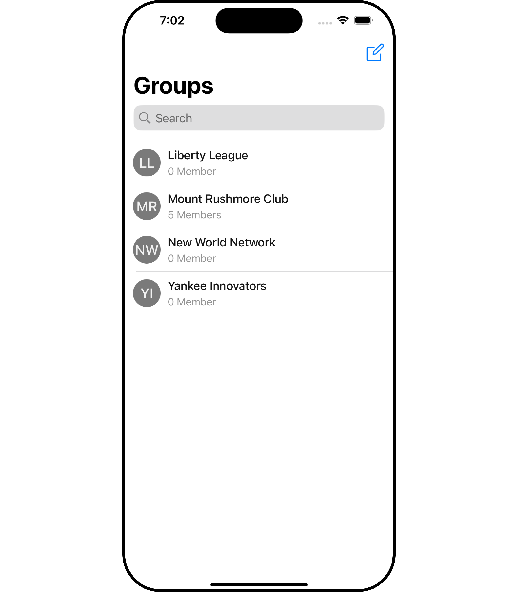
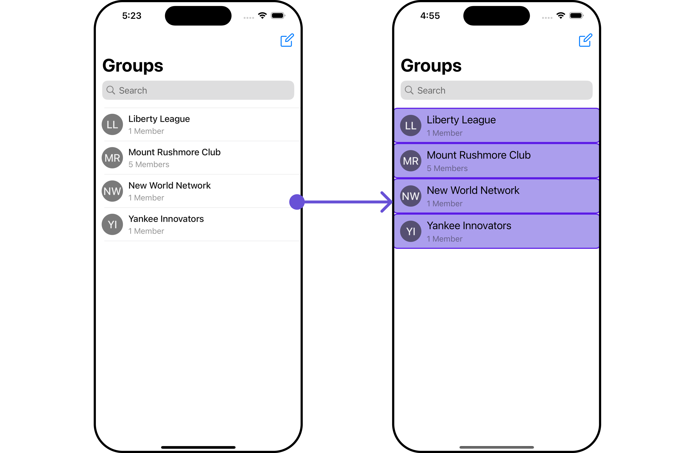
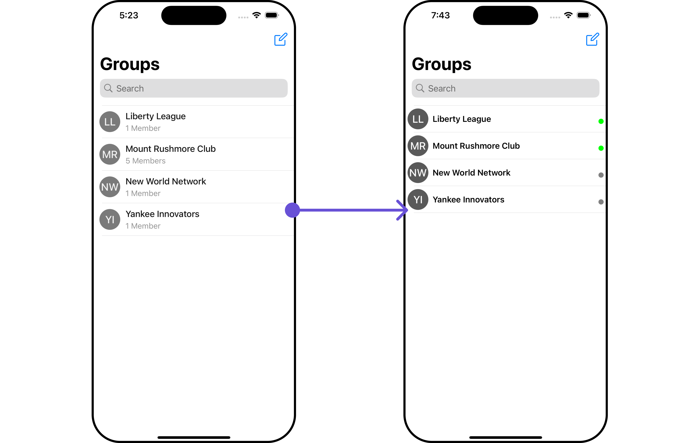
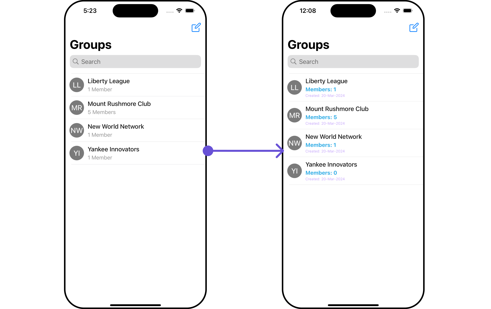
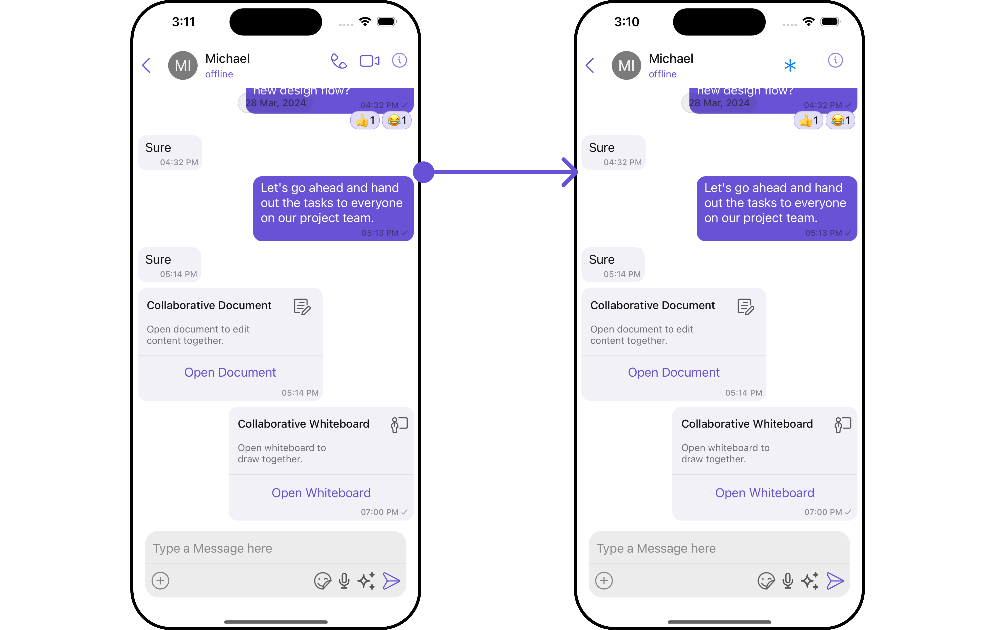
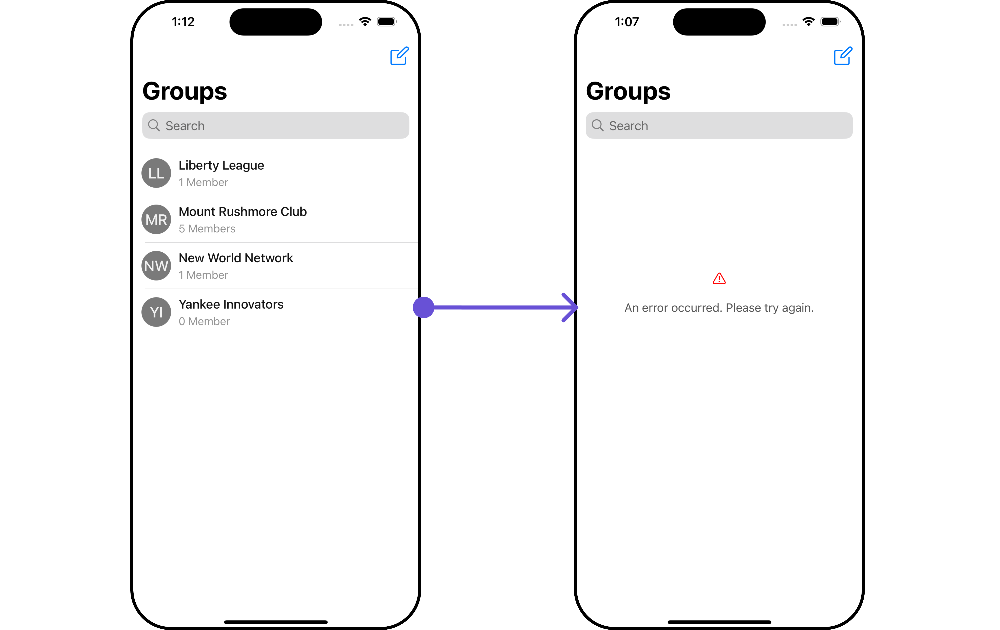
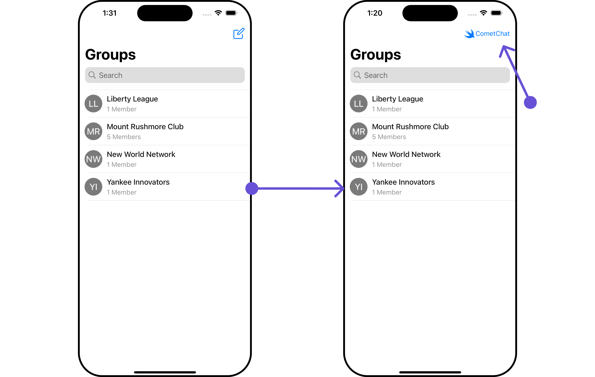

import Tabs from '@theme/Tabs';
import TabItem from '@theme/TabItem';

## Overview

`CometChatGroups` functions as a standalone [component](/ui-kit/ios/components-overview#components) designed to create a screen displaying a list of groups, with the added functionality of enabling users to search for specific groups. Acting as a container component, CometChatGroups encapsulates and formats the `CometChatListBase` and `CometChatGroupList` components without introducing any additional behavior of its own.

<!--  -->

## 

The `Groups` component is composed of the following BaseComponents:

| Components                                 | Description                                                                                                                                                                                   |
| ------------------------------------------ | --------------------------------------------------------------------------------------------------------------------------------------------------------------------------------------------- |
| [CometChatListBase](/ui-kit/ios/list-base) | `CometChatListBase` serves as a container component equipped with a title (navigationBar), search functionality (search-bar), background settings, and a container for embedding a list view. |
| [CometChatListItem](/ui-kit/ios/list-item) | This component renders information extracted from a `Group` object onto a tile, featuring a title, subtitle, leading view, and trailing view.                                                 |

<!--  -->

---

## Usage

### Integration

The following code snippet illustrates how you can can launch **CometChatGroups**.

<Tabs>
<TabItem value="swift" label="Swift">

```swift
let groups = CometChatGroups()
let naviVC = UINavigationController(rootViewController: groups)
self.present(naviVC, animated: true)
```

</TabItem>

</Tabs>

:::info
If you are already using a navigation controller, you can use the `pushViewController` function instead of presenting the view controller.
:::

### Actions

[Actions](/ui-kit/ios/components-overview#actions) dictate how a component functions. They are divided into two types: Predefined and User-defined. You can override either type, allowing you to tailor the behavior of the component to fit your specific needs.

##### 1. SetOnItemClick

This method proves valuable when users seek to override onItemClick functionality within CometChatGroups, empowering them with greater control and customization options.

The `setOnItemClick` action doesn't have a predefined behavior. You can override this action using the following code snippet.

<Tabs>

<TabItem value="swift" label="Swift">
    ```swift
let groups = CometChatGroups()
    .setOnItemClick (onItemClick:{ group, indexPath in
    //Perform Your Action       
})
    ```
</TabItem>

</Tabs>

##### 2. SetOnItemLongClick

This method becomes invaluable when users seek to override long-click functionality within CometChatGroups, offering them enhanced control and flexibility in their interactions.

The `setOnItemLongClick` action doesn't have a predefined behavior. You can override this action using the following code snippet.

<Tabs>

<TabItem value="swift" label="Swift">
    ```swift
let groups = CometChatGroups()
    .setOnItemLongClick (onItemLongClick:{ group, indexPath in
    //Perform Your Action
})
    ```
</TabItem>

</Tabs>

##### 3. SetOnError

You can customize this behavior by using the provided code snippet to override the `On Error` and improve error handling.

<Tabs>

<TabItem value="swift" label="Swift">
```swift title=""
let groups = CometChatGroups()
    .setOnError (onError:{ error in
    //Perform Your Action
})
```
</TabItem>

</Tabs>

##### 4. SetOnBack

Enhance your application's functionality by leveraging the `SetOnBack` feature. This capability allows you to customize the behavior associated with navigating back within your app. Utilize the provided code snippet to override default behaviors and tailor the user experience according to your specific requirements.

<Tabs>

<TabItem value="swift" label="Swift">
```swift title=""
let groups = CometChatGroups()
    .setOnBack (onBack:{
    //Perform Your Action    
})
```
</TabItem>

</Tabs>

### Filters

**Filters** allow you to customize the data displayed in a list within a Component. You can filter the list based on your specific criteria, allowing for a more customized. Filters can be applied using RequestBuilders of Chat SDK.

##### 1. GroupsRequestBuilder

The [GroupsRequestBuilder](/sdk/ios/retrieve-groups) enables you to filter and customize the group list based on available parameters in GroupsRequestBuilder. This feature allows you to create more specific and targeted queries when fetching groups. The following are the parameters available in [GroupsRequestBuilder](/sdk/ios/retrieve-groups)

| Methods              | Type     | Description                                                                                                         |
| -------------------- | -------- | ------------------------------------------------------------------------------------------------------------------- |
| **setLimit**         | Int      | Configure the maximum number of groups to fetch in a single request, optimizing pagination for smoother navigation. |
| **setSearchKeyword** | String   | Employed to retrieve groups that match the provided string, facilitating precise searches.                          |
| **joinedOnly**       | boolean  | Exclusively fetches joined groups.                                                                                  |
| **setTags**          | [String] | Utilized to fetch groups containing the specified tags.                                                             |
| **withTags**         | boolean  | Utilized to retrieve groups with specific tags.                                                                     |

**Example**

In the example below, we are applying a filter to the Group List based on only joined groups.

<Tabs>
<TabItem value="swift" label="Swift">

```swift title=''
// You can create GroupRequestBuilder as per your requirement
let groupsRequestBuilder = GroupsRequest.GroupsRequestBuilder(limit: 20).set(joinedOnly: true)

let groups = CometChatGroups(groupsRequestBuilder: groupsRequestBuilder)
let naviVC = UINavigationController(rootViewController: groups)
self.present(naviVC, animated: true)
```

</TabItem>

</Tabs>

##### 2. SearchRequestBuilder

The SearchRequestBuilder uses [GroupsRequestBuilder](/sdk/ios/retrieve-groups) enables you to filter and customize the search list based on available parameters in GroupsRequestBuilder.
This feature allows you to keep uniformity between the displayed Groups List and searched Group List.

**Example**

<Tabs>
<TabItem value="swift" label="Swift">

```swift title=''
// You can create GroupRequestBuilder as per your requirement
let groupsRequestBuilder = GroupsRequest.GroupsRequestBuilder(limit: 2).set(searchKeyword: "")

let groups = CometChatGroups(groupsRequestBuilder: groupsRequestBuilder)
let naviVC = UINavigationController(rootViewController: groups)
self.present(naviVC, animated: true)
```

</TabItem>

</Tabs>

---

### Events

[Events](/ui-kit/ios/components-overview#events) are emitted by a `Component`. By using event you can extend existing functionality. Being global events, they can be applied in Multiple Locations and are capable of being Added or Removed.

The list of events emitted by the Groups component is as follows.

| Event                        | Description                                                                                              |
| ---------------------------- | -------------------------------------------------------------------------------------------------------- |
| **onGroupCreate**            | This gets triggered when the logged in user creates a group.                                             |
| **onGroupDelete**            | This gets triggered when the logged in user deletes a group.                                             |
| **onGroupMemberLeave**       | This gets triggered when the logged in user leaves a group.                                              |
| **onGroupMemberChangeScope** | This gets triggered when the logged in user changes the scope of another group member.                   |
| **onGroupMemberBan**         | This gets triggered when the logged in user bans a group member from the group.                          |
| **onGroupMemberKick**        | This gets triggered when the logged in user kicks another group member from the group.                   |
| **onGroupMemberUnban**       | This gets triggered when the logged in user unbans a user banned from the group.                         |
| **onGroupMemberJoin**        | This gets triggered when the logged in user joins a group.                                               |
| **onGroupMemberAdd**         | This gets triggered when the logged in user adds new members to the group.                               |
| **onOwnershipChange**        | This gets triggered when the logged in user transfers the ownership of their group to some other member. |

Adding `CometChatGroupsEvents` Listener's

<Tabs>
<TabItem value="swift" label="Add Listener">

```swift
// View controller from your project where you want to listen events.
public class ViewController: UIViewController {

   public override func viewDidLoad() {
        super.viewDidLoad()

       // Subscribing for the listener to listen events from user module
         CometChatGroupEvents.addListener("UNIQUE_ID", self as CometChatGroupEventListener)
    }

}

 // Listener events from groups module
extension  ViewController: CometChatGroupEventListener {

    public func onGroupMemberAdd(group: Group, members: [GroupMember], addedBy: User) {
        // Do Stuff
    }

    public func onCreateGroupClick() {
         // Do Stuff
    }

    public func onGroupCreate(group: Group) {
        // Do Stuff
    }

    public func onGroupDelete(group: Group) {
        // Do Stuff
    }

    public func onGroupMemberJoin(joinedUser: User, joinedGroup: Group) {
        // Do Stuff
    }

    public func onGroupMemberLeave(leftUser: User, leftGroup: Group) {
        // Do Stuff
    }

    public func onGroupMemberBan(bannedUser: User, bannedGroup: Group) {
         // Do Stuff
    }

    public func onGroupMemberUnban(unbannedUserUser: User, unbannedUserGroup: Group) {
         // Do Stuff
    }

    public func onGroupMemberKick(kickedUser: User, kickedGroup: Group) {
         // Do Stuff
    }

    public func onGroupMemberChangeScope(updatedBy: User, updatedUser: User, scopeChangedTo: CometChat.MemberScope, scopeChangedFrom: CometChat.MemberScope, group: Group) {
          // Do Stuff
    }

    public func onOwnershipChange(group: Group?, member: GroupMember?) {
        // Do Stuff
    }
}

```

</TabItem>

</Tabs>
```swift title='Emitting Group Events'
///you need to pass the [Group] object of the group which is created
CometChatGroupEvents.emitOnGroupCreate(group: Group)

///you need to pass the [Group] object of the group which is deleted
CometChatGroupEvents.emitOnGroupDelete(group: Group)

///emit this when logged in user leaves the group.
CometChatGroupEvents.emitOnGroupMemberLeave(leftUser: User, leftGroup: Group)

///emit this when group member's scope is changed by logged in user.
CometChatGroupEvents.emitOnGroupMemberChangeScope(updatedBy: User , updatedUser: User , scopeChangedTo: CometChat.MemberScope , scopeChangedFrom: CometChat.MemberScope, group: Group)

///emit this when group member is banned from the group by logged in user.
CometChatGroupEvents.emitOnGroupMemberBan(bannedUser: User, bannedGroup: Group, bannedBy: User)

///emit this when group member is kicked from the group by logged in user.
CometChatGroupEvents.emitOnGroupMemberKick(kickedUser: User, kickedGroup: Group, kickedBy: User)

///emit this when a banned group member is unbanned from group by logged in user.
CometChatGroupEvents.emitOnGroupMemberUnban(unbannedUserUser: User, unbannedUserGroup: Group, unbannedBy: User)

///emit this when logged in user has joined a group successfully.
CometChatGroupEvents.emitOnGroupMemberJoin(joinedUser: User, joinedGroup: Group)

//emit this when members are added to a group by the logged in user.
CometChatGroupEvents.emitOnGroupMemberAdd(group: Group, members: [GroupMember], addedBy: User)

///emit this when ownership is changed by logged in user.
CometChatGroupEvents.emitOnGroupMemberChangeScope(updatedBy: User , updatedUser: User , scopeChangedTo: CometChat.MemberScope , scopeChangedFrom: CometChat.MemberScope, group: Group)

````


Removing `CometChatGroupsEvents` Listener's
<Tabs>
<TabItem value="swift" label="Remove Listener">

```swift
public override func viewWillDisappear(_ animated: Bool) {
       // Uncubscribing for the listener to listen events
CometChatGroupEvents.removeListener("LISTENER_ID_USED_FOR_ADDING_THIS_LISTENER")
}
```

</TabItem>

</Tabs>

## Customization

To fit your app's design requirements, you can customize the appearance of the groups component. We provide exposed methods that allow you to modify the experience and behavior according to your specific needs.

### Style

Using Style you can customize the look and feel of the component in your app, These parameters typically control elements such as the color, size, shape, and fonts used within the component.

##### 1. Groups Style

Enhance your Groups Component by setting the GroupsStyle to customize its appearance.


<Tabs>

<TabItem value="swift" label="Swift">

```swift
    // Creating  GroupsStyle object
let groupsStyle = GroupsStyle()

    // Creating  Modifying the propeties of groups
groupsStyle.set(background: .black)
    .set(cornerRadius: CometChatCornerStyle(cornerRadius: 0.0))
    .set(borderColor: .clear)
    .set(borderWidth: 0)
    .set(largeTitleFont: .boldSystemFont(ofSize: 34))
    .set(largeTitleColor: .white)
    .set(titleFont: .systemFont(ofSize: 18))
    .set(titleColor: .white)
    .set(searchIconTint: .white)
    .set(searchTextFont: .systemFont(ofSize: 16))
    .set(searchTextColor: .white)
    .set(searchPlaceholderColor: .systemFill)
    .set(protectedGroupIconBackgroundColor: .green)

let cometChatGroups = CometChatGroups()
    .set(groupsStyle: groupsStyle)
```

</TabItem>

</Tabs>

| Property                             | Description                                              | Code                                             |
| ------------------------------------ | -------------------------------------------------------- | ------------------------------------------------ |
| **Background**                       | Sets the background color                                | `.set(background: UIColor)`                      |
| **CornerRadius**                     | Sets the corner radius                                   | `.set(cornerRadius: CometChatCornerStyle)`       |
| **BorderWidth**                      | Sets the border width                                    | `.set(borderWidth: CGFloat)`                     |
| **TitleColor**                       | Sets the title color                                     | `.set(titleColor: UIColor)`                      |
| **TitleFont**                        | Sets the title font                                      | `.set(titleFont: UIFont)`                        |
| **LargeTitleColor**                  | Sets the large title color                               | `.set(largeTitleColor: UIColor)`                 |
| **LargeTitleFont**                   | Sets the large title font                                | `.set(largeTitleFont: UIFont)`                   |
| **BackIconTint**                     | Sets the back button tint color                          | `.set(backIconTint: UIColor)`                    |
| **SearchIconTint**                   | Sets the search icon tint color                          | `.set(searchIconTint: UIColor)`                  |
| **SearchTextFont**                   | Sets the search text font                                | `.set(searchTextFont: UIFont)`                   |
| **SearchTextColor**                  | Sets the search text color                               | `.set(searchTextColor: UIColor)`                 |
| **SearchCancelButtonTint**           | Sets the search cancel icon tint                         | `.set(searchCancelButtonTint: UIColor)`          |
| **SearchPlaceholderFont**            | Sets the search placeholder font                         | `.set(searchPlaceholderFont: UIFont)`            |
| **SearchPlaceholderColor**           | Sets the search placeholder color                        | `.set(searchPlaceholderColor: UIColor)`          |
| **PrivateGroupIconBackgroundColor**  | Sets the private group icon background                   | `.set(privateGroupIconBackgroundColor: UIColor)` |
| **ProtectedGroupIconBackgroundColor**| Sets the protected group icon background                 | `.set(protectedGroupIconBackgroundColor: UIColor)` |

##### 2. Avatar Style

To apply customized styles to the `Avatar` component in the Groups Component, you can use the following code snippet. For further insights on `Avatar` Styles [refer](/ui-kit/ios/avatar)


<Tabs>
<TabItem value="swift" label="Swift">

```swift title='Swift'
 // Creating  AvatarStyle object
let avatarStyle = AvatarStyle()

// Creating  Modifying the propeties of avatar
avatarStyle.set(background: .red)
    .set(textFont: .systemFont(ofSize: 18))
    .set(textColor: .white)
    .set(cornerRadius: CometChatCornerStyle(cornerRadius: 8.0))
    .set(borderColor: .white)
    .set(borderWidth: 5)
    .set(outerViewWidth: 3)
    .set(outerViewSpacing: 3)

let cometChatGroups = CometChatGroups()
    .set(avatarStyle: avatarStyle)
```

</TabItem>

</Tabs>


##### 3. StatusIndicator Style

To apply customized styles to the Status Indicator component in the Groups Component, You can use the following code snippet. For further insights on Status Indicator Styles [refer](/ui-kit/ios/status-indicator)

<Tabs>

<TabItem value="swift" label="Swift">

```swift
let statusIndicatorStyle = StatusIndicatorStyle()
    .set(background: .yellow)
    .set(borderColor: .red)
    .set(borderWidth: 7)

let cometChatGroups = CometChatGroups()
.set(statusIndicatorStyle: statusIndicatorStyle)
```

</TabItem>

</Tabs>


##### 4. ListItem Style

To apply customized styles to the `ListItemStyle` component in the `Groups` Component, you can use the following code snippet. For further insights on `ListItemStyle` Styles [refer](/ui-kit/ios/list-item)



<Tabs>

<TabItem value="swift" label="Swift">

```swift
// Creating  ListItemStyle object
let listItemStyle = ListItemStyle()

// Creating  Modifying the propeties of list item
listItemStyle.set(background: .init(red: 0.67, green: 0.62, blue: 0.93, alpha: 1.00))
    .set(titleFont: .systemFont(ofSize: 20))
    .set(titleColor: .black)
    .set(cornerRadius: CometChatCornerStyle(cornerRadius: 10.0))
    .set(borderColor: .init(red: 0.36, green: 0.10, blue: 0.92, alpha: 1.00))
    .set(borderWidth: 2)

let cometChatGroups = CometChatGroups()
    .set(listItemStyle: listItemStyle)
```

</TabItem>

</Tabs>


---

### Functionality

These are a set of small functional customizations that allow you to fine-tune the overall experience of the component. With these, you can change text, set custom icons, and toggle the visibility of UI elements.

<Tabs>

<TabItem value="swift" label="Swift">

```swift
let cometChatGroups = CometChatGroups()
    .set(title: "CometChat", mode: .never)
    .hide(search: true)
    .hide(separator: true)
```

</TabItem>

</Tabs>

:::info

If you are already using a navigation controller, you can use the pushViewController function instead of presenting the view controller.

:::

Below is a list of customizations along with corresponding code snippets
| Property | Description | Code |
| -------------------------------------------------------------------------------------------------------- | ---------------------------------------------------------------------------------------------------------------------------------- | ----------------------------------------------------------- |
| **title** <a data-tooltip-id="my-tooltip-html-prop"> <span class="material-icons red">report</span> </a>  | Used to set title  | `set(title:String, mode:UINavigationItem.LargeTitleDisplayMode`) |
| **searchPlaceholderText** | Used to set search placeholder text | `set(searchPlaceholder: String)	` |
| **errorStateText** | Used to set a custom text response when some error occurs on fetching the list of groups | `.set(errorStateText: String)` |
| **emptyStateText** | Used to set a custom text response when fetching the groups has returned an empty list | `.set(emptyStateText: String)` |
| **searchIcon** | Used to set search Icon in the search field | `.set(searchIcon: UIImage?)` |
| **privateGroupIcon** | Used to set the private group Icon | `.set(privateGroupIcon: UIImage)` |
| **protectedGroupIcon** | Used to set the protected group Icon | `.set(protectedGroupIcon: UIImage)` |
| **hideSearch** | Used to toggle visibility for search box |  `.hide(search: Bool)`  |
| **hideErrorText** | Used to hide error on fetching groups | `.hide(errorText: Bool)` |
| **hideSeparator** | Used to hide the divider separating the user items | `.hide(separator: Bool)` |
| **backButtonTitle** | Used to set back button title | `.set(backButtonTitle: String?)` |
| **selectionMode** | set the number of groups that can be selected, SelectionMode can be single, multiple or none.  | `.selectionMode(mode: SelectionMode)` |

---
### Advanced

For advanced-level customization, you can set custom views to the component. This lets you tailor each aspect of the component to fit your exact needs and application aesthetics. You can create and define your views, layouts, and UI elements and then incorporate those into the component.

---

#### ListItemView

Utilize this property to assign a custom ListItem to the Groups Component, allowing for enhanced customization and flexibility in its rendering.


<Tabs>

<TabItem value="swift" label="Swift">

```swift
let groups = CometChatGroups()
    .setListItemView(listItemView: { group in
    //Perform Your Action
})
```

</TabItem>

</Tabs>

**Example**



<!--  -->

In this example, we will create a UIView file `CustomListItemGroupView` and pass it inside the `setListItemView()` method.

```swift title="CustomListItemGroupView"
import UIKit
import CometChatSDK
import CometChatUIKitSwift

class CustomListItemGroupView: UIView {
    // Initialize your subviews
    let titleLabel: UILabel = {
        let label = UILabel()
        label.translatesAutoresizingMaskIntoConstraints = false
        label.font = UIFont.boldSystemFont(ofSize: 16)
        return label
    }()

    let statusIndicator: UIView = {
        let view = UIView()
        view.translatesAutoresizingMaskIntoConstraints = false
        view.backgroundColor = .green
        view.layer.cornerRadius = 5
        return view
    }()

    let groupImageView: CometChatAvatar = {
        let imageView = CometChatAvatar(frame: .zero)
        imageView.translatesAutoresizingMaskIntoConstraints = false
        return imageView
    }()

    // Override the initializer
    override init(frame: CGRect) {
        super.init(frame: frame)
        // Add subviews and layout constraints
        addSubview(groupImageView)
        addSubview(titleLabel)
        addSubview(statusIndicator)

        NSLayoutConstraint.activate([
            groupImageView.leadingAnchor.constraint(equalTo: leadingAnchor, constant: 8),
            groupImageView.centerYAnchor.constraint(equalTo: centerYAnchor),
            groupImageView.heightAnchor.constraint(equalToConstant: 40),
            groupImageView.widthAnchor.constraint(equalToConstant: 40),

            titleLabel.centerYAnchor.constraint(equalTo: centerYAnchor),
            titleLabel.leadingAnchor.constraint(equalTo: groupImageView.trailingAnchor, constant: 8),
            titleLabel.trailingAnchor.constraint(equalTo: trailingAnchor, constant: -8),

            statusIndicator.widthAnchor.constraint(equalToConstant: 10),
            statusIndicator.heightAnchor.constraint(equalToConstant: 10),
            statusIndicator.trailingAnchor.constraint(equalTo: titleLabel.trailingAnchor),
            statusIndicator.bottomAnchor.constraint(equalTo: titleLabel.bottomAnchor)
        ])
    }

    required init?(coder: NSCoder) {
        fatalError("init(coder:) has not been implemented")
    }

    // Configure the view with a group
    func configure(with group: CometChatSDK.Group) {
        titleLabel.text = group.name
        statusIndicator.backgroundColor = group.hasJoined ? .green : .gray
        groupImageView.setAvatar(avatarUrl: group.icon ?? "", with: group.name ?? "")
    }
}

```

<Tabs>

<TabItem value="swift" label="Swift">

```swift
let groups = CometChatGroups()
    .setListItemView(listItemView: { group in
        let customListItemGroupView = CustomListItemGroupView()
        customListItemGroupView.configure(with: group!)
        return customListItemGroupView
})
```

</TabItem>

</Tabs>

:::info
Ensure to pass and present `CometChatGroups`. If a navigation controller is already in use, utilize the pushViewController function instead of directly presenting the view controller.
:::

---

#### SubtitleView

You can set your custom Subtitle view using the `.setSubtitleView()` method. But keep in mind, by using this you will override the default Subtitle view functionality.

<Tabs>

<TabItem value="swift" label="Swift">

```swift
let groups = CometChatGroups()
    .setSubtitleView (subtitle:{ group in
    //Perform Your Action
})
```

</TabItem>

</Tabs>
- You can customize the subtitle view for each group item to meet your requirements

**Example**



<!--  -->

In this example, we will create a `Custom_Subtitle_Group_View`a UIView file.

```swift title="Custom_Subtitle_Group_View"
import UIKit
import CometChatSDK
import CometChatUIKitSwift

class CustomSubtitleGroupView: UIView {

    let memberLabel: UILabel = {
        let label = UILabel()
        label.translatesAutoresizingMaskIntoConstraints = false
        label.textColor = .systemCyan
        label.font = UIFont.systemFont(ofSize: 15, weight: .bold)
        return label
    }()

    let createdLabel: UILabel = {
        let label = UILabel()
        label.translatesAutoresizingMaskIntoConstraints = false
        label.textColor = .init(red: 0.71, green: 0.55, blue: 0.98, alpha: 1.00)
        label.font = UIFont.systemFont(ofSize: 10, weight: .light)
        return label
    }()

    override init(frame: CGRect) {
        super.init(frame: frame)
        addSubview(memberLabel)
        addSubview(createdLabel)

        NSLayoutConstraint.activate([
            memberLabel.topAnchor.constraint(equalTo: topAnchor),
            memberLabel.leadingAnchor.constraint(equalTo: leadingAnchor),
            memberLabel.trailingAnchor.constraint(equalTo: trailingAnchor),

            createdLabel.topAnchor.constraint(equalTo: memberLabel.bottomAnchor, constant: 2),
            createdLabel.leadingAnchor.constraint(equalTo: leadingAnchor),
            createdLabel.trailingAnchor.constraint(equalTo: trailingAnchor),
            createdLabel.bottomAnchor.constraint(equalTo: bottomAnchor)
        ])
    }

    required init?(coder: NSCoder) {
        fatalError("init(coder:) has not been implemented")
    }

    func configure(with group: CometChatSDK.Group) {
        memberLabel.text = "Members: \(group.membersCount)"

        let date = Date(timeIntervalSince1970: Double(group.createdAt))
        let dateFormatter = DateFormatter()
        dateFormatter.dateStyle = .medium
        createdLabel.text = "Created: \(dateFormatter.string(from: date))"
    }
}
```


<!-- Make modifications to the code based on your specific needs and preferences. -->

We will be passing a custom subtitle view to CometChatGroups, ensuring a tailored and user-friendly interface.

<Tabs>

<TabItem value="swift" label="Swift">
```swift
let cometChatGroups = CometChatGroups()
    .setSubtitleView(subtitle: { group in
        let customSubtitleGroupView = CustomSubtitleGroupView()
        customSubtitleGroupView.configure(with: group!)
        return customSubtitleGroupView
})
````

</TabItem>

</Tabs>

:::info
Ensure to pass and present `CometChatGroups`. If a navigation controller is already in use, utilize the pushViewController function instead of directly presenting the view controller.
:::

---

#### EmptyView <a data-tooltip-id="my-tooltip-html-prop"> <span class="material-icons red">report</span> </a>

You can set a custom EmptyView using `.set(emptyView: UIView)` to match the empty view of your app.

<Tabs>

<TabItem value="swift" label="swift">
```swift
let cometChatGroups = CometChatGroups()
    .set(emptyView: UIView)
````

</TabItem>

</Tabs>

**Example**

<!--  -->

In this example, we will create a `Custom_Empty_State_GroupView`a UIView file.

```swift
import UIKit

class CustomEmptyStateGroupView: UIView {
    // Initialize your subviews
    let imageView: UIImageView = {
        let imageView = UIImageView(image: UIImage(named: "noDataImage"))
        imageView.translatesAutoresizingMaskIntoConstraints = false
        return imageView
    }()

    let messageLabel: UILabel = {
        let label = UILabel()
        label.text = "No groups available"
        label.translatesAutoresizingMaskIntoConstraints = false
        label.font = UIFont.boldSystemFont(ofSize: 16)
        label.textColor = .black
        return label
    }()

    // Override the initializer
    override init(frame: CGRect) {
        super.init(frame: frame)
        // Add subviews and layout constraints
        addSubview(imageView)
        addSubview(messageLabel)
        NSLayoutConstraint.activate([
            imageView.centerXAnchor.constraint(equalTo: centerXAnchor),
            imageView.centerYAnchor.constraint(equalTo: centerYAnchor),
            imageView.heightAnchor.constraint(equalToConstant: 120),
            imageView.widthAnchor.constraint(equalToConstant: 120),

            messageLabel.topAnchor.constraint(equalTo: imageView.bottomAnchor, constant: 8),
            messageLabel.centerXAnchor.constraint(equalTo: centerXAnchor)
        ])
    }

    required init?(coder: NSCoder) {
        fatalError("init(coder:) has not been implemented")
    }
}
```

We will be passing a custom empty view to CometChatGroups, ensuring a tailored and user-friendly interface.

<Tabs>

<TabItem value="swift" label="Swift">
```swift
let customEmptyStateGroupView = CustomEmptyStateGroupView()
        
let groupsRequestBuilder = GroupsRequest.GroupsRequestBuilder(limit: 1000)

let cometChatGroups = CometChatGroups(groupsRequestBuilder: groupsRequestBuilder)
.set(emptyView: customEmptyStateGroupView)

````
</TabItem>


</Tabs>

:::info
Ensure to pass and present `CometChatGroups`. If a navigation controller is already in use, utilize the pushViewController function instead of directly presenting the view controller.
:::

---
#### ErrorView

You can set a custom ErrorView using `.set(errorView: UIView)` to match the error view of your app.


<Tabs>

<TabItem value="swift" label="Swift">

```swift
let cometChatGroups = CometChatGroups()
    .set(errorView: UIView)

```

</TabItem>

</Tabs>

**Example**



<!--  -->

In this example, we will create a UIView file `Custom_ErrorState_GroupView` and pass it inside the `.set(errorView: UIView)` method.

```swift title="Custom_ErrorState_GroupView"
import UIKit

let CustomErrorStateGroupView: UIView = {
        // Create main view
        let view = UIView()
        view.backgroundColor = .white

        // Create an imageView and add it to the main view
        let imageView = UIImageView(image: UIImage(systemName: "exclamationmark.triangle"))
        imageView.tintColor = .red
        imageView.translatesAutoresizingMaskIntoConstraints = false
        view.addSubview(imageView)

        // Create a label with error message and add it to the main view
        let label = UILabel()
        label.text = "An error occurred. Please try again."
        label.font = UIFont.systemFont(ofSize: 16)
        label.textColor = .darkGray
        label.numberOfLines = 0
        label.textAlignment = .center
        label.translatesAutoresizingMaskIntoConstraints = false
        view.addSubview(label)

        // Create constraints for imageView and label
        NSLayoutConstraint.activate([
            imageView.centerXAnchor.constraint(equalTo: view.centerXAnchor),
            imageView.centerYAnchor.constraint(equalTo: view.centerYAnchor, constant: -50),

            label.topAnchor.constraint(equalTo: imageView.bottomAnchor, constant: 20),
            label.leadingAnchor.constraint(equalTo: view.leadingAnchor, constant: 20),
            label.trailingAnchor.constraint(equalTo: view.trailingAnchor, constant: -20)
        ])

        return view
    }()
```

<Tabs>

<TabItem value="swift" label="Swift">

```swift
let customErrorStateGroupView = CustomErrorStateGroupView
let groupsRequestBuilder = GroupsRequest.GroupsRequestBuilder(limit: 1000)

let cometChatGroups = CometChatGroups(groupsRequestBuilder: groupsRequestBuilder)
    .set(errorView: customErrorStateGroupView)
```

</TabItem>

</Tabs>

:::info
Ensure to pass and present `CometChatGroups`. If a navigation controller is already in use, utilize the pushViewController function instead of directly presenting the view controller.
:::

---

#### Menus

You can set the Custom Menus to add more options to the Groups component.


<Tabs>

<TabItem value="swift" label="Swift">

```swift
let cometChatGroups = CometChatGroups()
    .set(menus: [UIBarButtonItem])
```

</TabItem>

</Tabs>

- You can customize the menus for groups to meet your requirements

**Example**



<!--  -->

In this example, we'll craft a custom button tailored for `CometChatGroups`, enhancing its interface with a personalized `menu` for a more user-friendly experience.


<Tabs>

<TabItem value="swift" label="Swift">
```swift
let customMenuButton: UIBarButtonItem = {
let button = UIButton(type: .system)
    button.setImage(UIImage(systemName: "swift"), for: .normal)
    button.setTitle("CometChat", for: .normal)
    button.addTarget(self, action: #selector(handleCustomMenu), for: .touchUpInside)
let barButtonItem = UIBarButtonItem(customView: button)
    return barButtonItem
}()

let cometChatGroups = CometChatGroups()
    .set(menus: [customMenuButton])
````

</TabItem>

</Tabs>

:::info
Ensure to pass and present `CometChatGroups`. If a navigation controller is already in use, utilize the pushViewController function instead of directly presenting the view controller.
:::

---

<!-- #### Options <a data-tooltip-id="my-tooltip-006-html-prop"> <span class="material-icons red">report</span> </a>

<Tooltip
  id="my-tooltip-006-html-prop"
  html="Certain properties are currently unavailable. "
/>

Elevate your Groups component experience by customizing its options to suit your preferences, all effortlessly achievable with `.setOptions()`.


<Tabs>

<TabItem value="swift" label="swift">
```swift
let cometChatGroups = CometChatGroups()
    .setOptions (options:{ group in
    //Perform Your Actions
})
````

</TabItem>

</Tabs>


**Example**
<!--  -->

<!--  -->

<!-- In this example, we'll craft custom options to display while swiping, offering an array of actions for Groups. This method seamlessly integrates these options, enhancing your interaction with Groups.

<Tabs>

<TabItem value="swift" label="Swift">
```swift
let customOptions: ((Group?) -> [CometChatGroupOption]) = { group in
    guard let group = group else { return [] }

// Create a custom option for delete
let deleteOption = CometChatGroupOption(
    titleColor: .red,
    titleFont: UIFont.systemFont(ofSize: 16),
    iconTint: .white,
    backgroundColor: .red,
    onClick: { selectedGroup, index, option, controller in
    print("Delete option selected for group: \(selectedGroup?.name ?? "")")

    }
)
    return [deleteOption]
}

let cometChatGroups = CometChatGroups()
cometChatGroups.setOptions(options: customOptions)
````
</TabItem>


</Tabs>

:::info
Ensure to pass and present `CometChatGroups`. If a navigation controller is already in use, utilize the pushViewController function instead of directly presenting the view controller.
::: -->

<!--  -->

import { Tooltip } from 'react-tooltip'
import 'react-tooltip/dist/react-tooltip.css'

<Tooltip
  id="my-tooltip-html-prop"
  html="Not available "
/>
