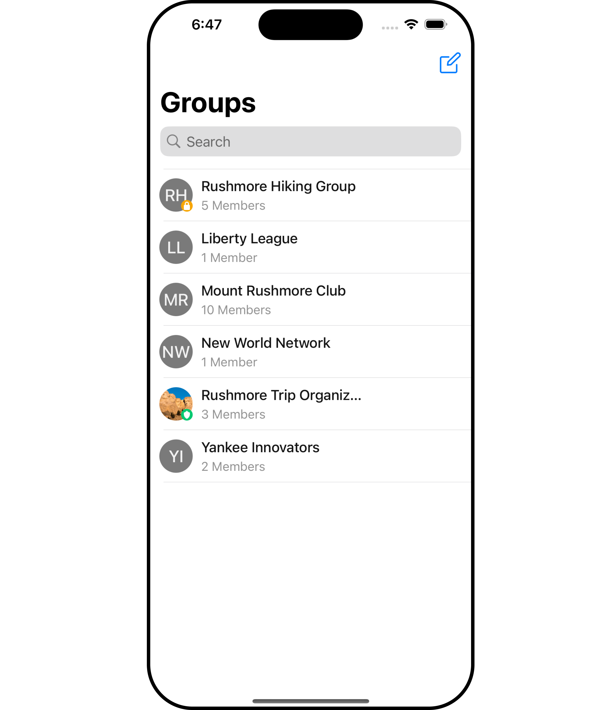
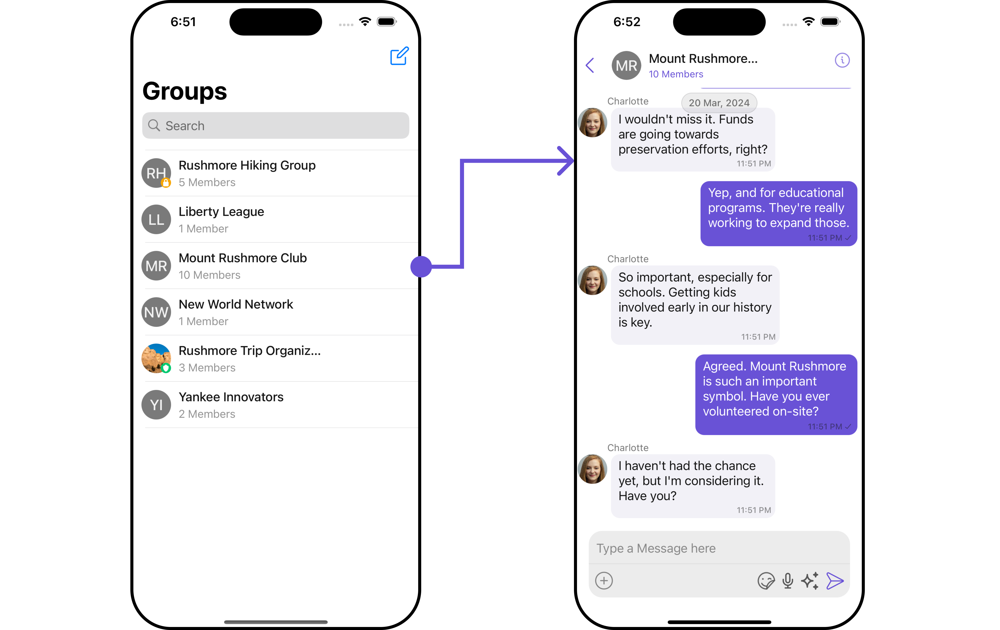
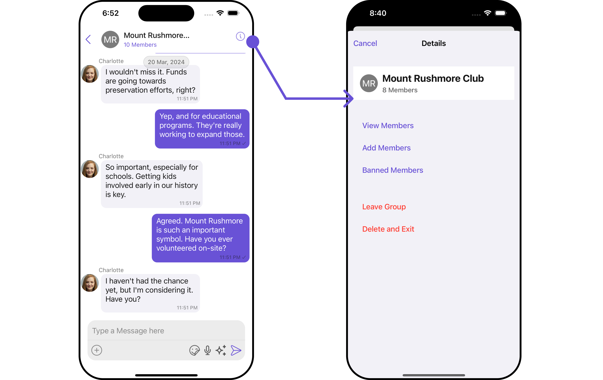

import Tabs from '@theme/Tabs';
import TabItem from '@theme/TabItem';

## Overview

`GroupsWithMessages` is a [Composite Component](/ui-kit/ios/components-overview#composite-components) encapsulating functionalities from the [Groups](/ui-kit/ios/groups) and [Messages](/ui-kit/ios/messages) components. Serving as a versatile wrapper, it seamlessly integrates with CometChatMessages, enabling users to open the module by clicking on any group within the list. This component inherits the behavior of Groups, fostering consistency and familiarity in user interactions.



<!--  -->

| Components                       | Description                                                                                                                    |
| -------------------------------- | ------------------------------------------------------------------------------------------------------------------------------ |
| [Groups](/ui-kit/ios/groups)     | The `Groups` component is designed to display a list of `Groups`. This essentially represents the recent conversation history. |
| [Messages](/ui-kit/ios/messages) | The `Messages` component is designed to manage the messaging interaction for `Group's` conversations.                          |

## Usage

### Integration

As `GroupsWithMessages` is a **view controller**, it can be effortlessly added directly in response to a button click or any event. Leveraging all the customizable properties and methods inherited from Groups, this component offers seamless integration and extensive customization capabilities. This makes it a versatile solution for enhancing user interaction within your application.

<Tabs>
<TabItem value="swift" label="Swift">

```swift
let cometChatGroupsWithMessages = CometChatGroupsWithMessages()
let naviVC = UINavigationController(rootViewController: cometChatGroupsWithMessages)
self.present(naviVC, animated: true)
```

</TabItem>

</Tabs>

:::info
If you are already using a navigation controller, you can use the pushViewController function instead of presenting the view controller.
:::

---

### Actions

[Actions](/ui-kit/ios/components-overview#actions) dictate how a component functions. They are divided into two types: Predefined and User-defined. You can override either type, allowing you to tailor the behavior of the component to fit your specific needs.

##### 1. SetOnItemClick

This method proves valuable when users seek to override onItemClick functionality within GroupsWithMessages, empowering them with greater control and customization options.

The `setOnItemClick` action doesn't have a predefined behavior. You can override this action using the following code snippet.

<Tabs>

<TabItem value="swift" label="Swift">
    ```swift
let cometChatGroupsWithMessages = CometChatGroupsWithMessages()
    .setOnItemClick (onItemClick:{ group, indexPath in
    //Perform Your Action
})
    ```
</TabItem>

</Tabs>

##### 2. SetOnItemLongClick

This method becomes invaluable when users seek to override long-click functionality within GroupsWithMessages, offering them enhanced control and flexibility in their interactions.

The `setOnItemLongClick` action doesn't have a predefined behavior. You can override this action using the following code snippet.

<Tabs>

<TabItem value="swift" label="Swift">
    ```swift
let cometChatGroupsWithMessages = CometChatGroupsWithMessages()
    .setOnItemLongClick (onItemLongClick:{ group, indexPath in
    //Perform Your Action

})

````
</TabItem>

</Tabs>

##### 3. SetOnError

You can customize this behavior by using the provided code snippet to override the `On Error` and improve error handling.

<Tabs>

<TabItem value="swift" label="Swift">
```swift title=""
let cometChatGroupsWithMessages = CometChatGroupsWithMessages()
    .setOnError (onError:{ error in
    //Perform Your Action

})

````

</TabItem>

</Tabs>

##### 4. SetOnBack

Enhance your application's functionality by leveraging the `SetOnBack` feature. This capability allows you to customize the behavior associated with navigating back within your app. Utilize the provided code snippet to override default behaviors and tailor the user experience according to your specific requirements.

<Tabs>

<TabItem value="swift" label="Swift">
```swift title=""
let cometChatGroupsWithMessages = CometChatGroupsWithMessages()
    .setOnBack (onBack:{
    //Perform Your Action

})

````

</TabItem>

</Tabs>

<!--  -->

### Filters

**Filters** allow you to customize the data displayed in a list within a Component. You can filter the list based on your specific criteria, allowing for a more customized. Filters can be applied using RequestBuilders of Chat SDK.

While the GroupsWithMessages component does not have filters, its components do, For more detail on individual filters of its component refer to [Groups Filters](/ui-kit/ios/groups#filters) and [Messages Filters](/ui-kit/ios/messages#filters).

By utilizing the [Configurations](#configurations) object of its components, you can apply filters.

In the following **example**, we are applying a filter to the Group List based on only joined groups and setting the limit to 3 using the `groupsRequestBuilder`.

<Tabs>
<TabItem value="swift" label="Swift">

```swift title='Swift'
  // You can create GroupRequestBuilder as per your requirement
let groupsRequestBuilder = GroupsRequest.GroupsRequestBuilder(limit: 3).set(joinedOnly: true)

let groupsWithMessages = CometChatGroupsWithMessages(groupsRequestBuilder: groupsRequestBuilder)

let naviVC = UINavigationController(rootViewController: groupsWithMessages)
self.present(naviVC, animated: true)
```

</TabItem>

</Tabs>
:::info
If you are already using a navigation controller, you can use the pushViewController function instead of presenting the view controller.
:::

---

### Events

[Events](/ui-kit/ios/components-overview#events) are emitted by a `Component`. By using event you can extend existing functionality. Being global events, they can be applied in Multiple Locations and are capable of being Added or Removed.

The GroupsWithMessages does not produce any events but its component does.

---

## Customization

To fit your app's design requirements, you have the ability to customize the appearance of the
GroupsWithMessages component. We provide exposed methods that allow you to modify the experience and behavior according to your specific needs.

### Style

Using **Style** you can **customize** the look and feel of the component in your app, These parameters typically control elements such as the **color**, **size**, **shape**, and **fonts** used within the component.

##### 1. GroupsWithMessages Style <a data-tooltip-id="my-tooltip-html-prop"> <span class="material-icons red">report</span> </a>

You can set the `groupsWithMessagesStyle` to the GroupsWithMessages Component to customize the styling.

<!--  -->

<Tabs>
<TabItem value="swift" label="Swift">

```swift title='swift'
let groupsWithMessagesStyle = GroupsWithMessageStyle()
    .set(background: .init(red: 0.65, green: 0.53, blue: 0.89, alpha: 1.00))
    .set(borderColor: .systemPurple)
    .set(messageTextFont: .boldSystemFont(ofSize: 11))

let cometChatGroupsWithMessages = CometChatGroupsWithMessages()

let naviVC = UINavigationController(rootViewController: cometChatGroupsWithMessages)
self.present(naviVC, animated: true)
```

</TabItem>

</Tabs>

:::info
If you are already using a navigation controller, you can use the pushViewController function instead of presenting the view controller.
:::

You can also customize its component styles. For more details on individual component styles, you can refer [Groups Styles](/ui-kit/ios/groups#style) and [Messages Styles](/ui-kit/ios/messages#messagesstyle).

Styles can be applied to SubComponents using their respective [configurations](#configurations).

---

### Functionality

These are a set of **small functional customizations** that allow you to **fine-tune** the overall experience of the component. With these, you can **change text**, set **custom icons**, and toggle the **visibility** of UI elements.

The GroupsWithMessages component currently does not offer any available functionality.

<!-- you can utilize the `group`  method with a Group object as input to the GroupsWithMessages component. This will automatically direct you to the [Messages](./messages) component for the specified `Group`.

##### Group

<Tabs>
<TabItem value="swift" label="Swift">

```swift title='Swift'
```

</TabItem>

```

</TabItem>
</Tabs>

Below is a list of customizations along with corresponding code snippets:

| Property | Description | Code |
| -------------------------------------------------------------------------------------------------------- | ---------------------------------------------------------------------------------------------------------------------------------- | ----------------------------------------------------------- |
| **isMobileView**| A boolean indicating if the component should render in mobile view for optimized display on mobile devices. | `isMobileView: false` |
| **group**  | Use the group property with a Group object as input for the GroupsWithMessages component to navigate directly to the Messages component for the specified Group. | `group={chatGroup}` |
| **messageText** | It represents the textual content which will be replaced with the messages component when user clicks on a particular group chat.| `messageText="Your Custom Message Text"` |

--- -->

##### Components

Nearly all functionality customizations available for a Component are also available for the composite component. Using [Configuration](#configurations), you can modify the properties of its components to suit your needs.

You can find the list of all Functionality customization of individual components in [Groups](/ui-kit/ios/groups#functionality) and [Messages](/ui-kit/ios/messages#functionality).

**Example**

<Tabs>
<TabItem value="swift" label="Swift">

```swift title='Swift'
let messagesConfiguration = MessagesConfiguration()
    .disable(disableTyping: true)
    .hide(messageHeader: true)

let groupsConfiguration = GroupsConfiguration()
    .hide(search: true)

let cometChatGroupsWithMessages = CometChatGroupsWithMessages()
    .set(messagesConfiguration: messagesConfiguration)
    .set(groupsConfiguration: groupsConfiguration)
```

</TabItem>

</Tabs>
:::info
Ensure to pass and present `cometChatGroupsWithMessages`. If a navigation controller is already in use, utilize the pushViewController function instead of directly presenting the view controller.
:::

---

### Advanced

For advanced-level customization, you can set custom views to the component. This lets you tailor each aspect of the component to fit your exact needs and application aesthetics. You can create and define your own views, layouts, and UI elements and then incorporate those into the component.

By utilizing the [Configuration](#configurations) object of each component, you can apply advanced-level customizations to the GroupsWithMessages.

**Example**

```swift
// Create an object of  GroupsConfiguration
let groupsConfiguration = GroupsConfiguration()
.set(errorStateView: UIView)

```

**Usage**

You can utilize the groupsConfiguration object within a CometChatGroupsWithMessages widget. Simply set the groupsConfiguration using the `.set(groupsConfiguration: groupsConfiguration)` method when initializing the `CometChatGroupsWithMessages` instance.

```swift
let cometChatGroupsWithMessages = CometChatGroupsWithMessages()
.set(groupsConfiguration: groupsConfiguration)
```

To find all the details on individual Component advance customization you can refer, [Groups Advance](/ui-kit/ios/groups#advanced) and [Messages Advance](/ui-kit/ios/messages#advanced).

GroupsWithMessages uses advanced-level customization of both Groups & Messages components to achieve its default behavior.

1. GroupsWithMessages utilizes the [SetMenu](/ui-kit/ios/groups#setmenu) function of the `Groups` subcomponent to navigate the user from [Groups](/ui-kit/ios/groups) to [Messages](/ui-kit/ios/messages)



   <!--  -->

2. GroupsWithMessages utilizes the [SetMenu](/ui-kit/ios/messages#setmenu) function of the `Messages` subcomponent to navigate the user from [Messages](/ui-kit/ios/messages) to [Details](/ui-kit/ios/user-details).



   <!--  -->

:::warning

When you override `.setMenu()`, the default behavior of GroupsWithMessages will also be overridden.

:::

## Configurations

[Configurations](/ui-kit/ios/components-overview#configurations) offer the ability to customize the properties of each component within a Composite Component.

GroupsWithMessages has `Groups` and `Messages` component. Hence, each of these components will have its individual `Configuration``.

- `Configurations` expose properties that are available in its individual components.

#### Groups

You can customize the properties of the Groups component by making use of the `groupsConfiguration`. You can accomplish this by employing the `groupsConfiguration` props as demonstrated below:

<Tabs>

<TabItem value="swift" label="Swift">

```swift
let groupsConfiguration = GroupsConfiguration()
    // Customize properties of groups by overriding them.

let cometChatGroupsWithMessages = CometChatGroupsWithMessages()
    .set(groupsConfiguration: groupsConfiguration)
```

</TabItem>

</Tabs>

All exposed properties of `GroupsConfiguration` can be found under [Groups](./groups#configuration). Properties marked with the <a data-tooltip-id="my-tooltip-html-prop"><span class="material-icons red">report</span></a> symbol are not accessible within the Configuration Object.

**Example**

Let's say you want to change the style of the Groups subcomponent and, in addition, you only want to display the Group List based on only joined groups and setting the limit to 3.

You can modify the style using the `groupsStyle` property and filter the list with the `groupsRequestBuilder` property.

<!--  -->

<Tabs>
<TabItem value="swift" label="Swift">

```swift
let groupsStyle = GroupsStyle()
    .set(background: .init(red: 0.72, green: 0.45, blue: 0.95, alpha: 1.00))
    .set(backIconTint: .black)
    .set(largeTitleColor: .cyan)

let groupsConfiguration = GroupsConfiguration()
    .set(style: groupsStyle)

let groupsRequestBuilder = GroupsRequest.GroupsRequestBuilder(limit: 3).set(joinedOnly: true)

let groupsWithMessages = CometChatGroupsWithMessages(groupsRequestBuilder: groupsRequestBuilder)
    .set(groupsConfiguration: groupsConfiguration)
```

</TabItem>

</Tabs>

---

#### Messages

You can customize the properties of the Messages component by making use of the messagesConfiguration. You can accomplish this by employing the `messagesConfiguration` props as demonstrated below:

<Tabs>

<TabItem value="swift" label="Swift">

```swift
let  messagesConfiguration = MessagesConfiguration()
    // Customize properties by overriding them.

let cometChatGroupsWithMessages = CometChatGroupsWithMessages()
    .set(messagesConfiguration: messagesConfiguration)

```

</TabItem>

</Tabs>

All exposed properties of `MessagesConfiguration` can be found under [Messages](./messages#configuration). Properties marked with the <a data-tooltip-id="my-tooltip-html-prop"><span class="material-icons red">report</span></a> symbol are not accessible within the Configuration Object.

**Example**

Let's say you want to change the style of the Messages subcomponent and, in addition, you only want to hide message header.

You can modify the style using the `messagesStyle` property and hide the message header with the `hideMessageHeader` property.

<!--  -->

<Tabs>
<TabItem value="swift" label="Swift">

```swift
let messagesStyle = MessagesStyle()
    .set(background: .init(red: 0.72, green: 0.45, blue: 0.95, alpha: 1.00))
    .set(borderColor: .systemPink)
    .set(borderWidth: 3)

let messagesConfiguration = MessagesConfiguration()
    .set(messagesStyle: messagesStyle)
    .hide(messageHeader: true)

let cometChatGroupsWithMessages = CometChatGroupsWithMessages()
    .set(messagesConfiguration: messagesConfiguration)
```

</TabItem>

</Tabs>

:::info
Ensure to pass and present `cometChatGroupsWithMessages`. If a navigation controller is already in use, utilize the pushViewController function instead of directly presenting the view controller.
:::

---

#### Join Group

You can customize the properties of the Join Group component by making use of the JoinGroupConfiguration. You can accomplish this by employing the `joinGroupConfiguration` props as demonstrated below:

<Tabs>

<TabItem value="swift" label="Swift">

```swift
let joinProtectedGroupConfiguration = JoinProtectedGroupConfiguration()
    // Customize properties by overriding them.

let cometChatGroupsWithMessages = CometChatGroupsWithMessages()
    .set(joinProtectedGroupConfiguration: joinProtectedGroupConfiguration)

```

</TabItem>

</Tabs>

All exposed properties of `JoinGroupConfiguration` can be found under [Join Group](./join-protected-group#configurations). Properties marked with the <a data-tooltip-id="my-tooltip-html-prop"><span class="material-icons red">report</span></a> symbol are not accessible within the Configuration Object.

**Example**

Let's say you want to change the style of the Join Group subcomponent.

You can modify the style using the `joinGroupStyle` property.

<!--  -->

<Tabs>
<TabItem value="swift" label="Swift">

```swift
let joinProtectedGroupStyle = JoinProtectedGroupStyle()
    .set(background: .init(red: 0.72, green: 0.45, blue: 0.95, alpha: 1.00))
    .set(joinButtonTextColor: .orange)
    .set(passwordTextColor: .systemTeal)

let joinProtectedGroupConfiguration = JoinProtectedGroupConfiguration()
    .set(joinProtectedGroupStyle: joinProtectedGroupStyle)
    // Customize properties by overriding them.

let cometChatGroupsWithMessages = CometChatGroupsWithMessages()
    .set(joinProtectedGroupConfiguration: joinProtectedGroupConfiguration)
```

</TabItem>

</Tabs>

:::info
Ensure to pass and present `cometChatGroupsWithMessages`. If a navigation controller is already in use, utilize the pushViewController function instead of directly presenting the view controller.
:::

---

#### Create Group

You can customize the properties of the Create Group component by making use of the CreateGroupConfiguration. You can accomplish this by employing the `createGroupConfiguration` props as demonstrated below:

<Tabs>

<TabItem value="swift" label="Swift">

```swift
let createGroupConfiguration = CreateGroupConfiguration()
    .set(createGroupStyle: createGroupStyle)
    // Customize properties by overriding them.

let cometChatGroupsWithMessages = CometChatGroupsWithMessages()
    .set(createGroupConfiguration: createGroupConfiguration)

```

</TabItem>

</Tabs>

All exposed properties of `CreateGroupConfiguration` can be found under [Create Group](./create-group#configurations). Properties marked with the <a data-tooltip-id="my-tooltip-html-prop"><span class="material-icons red">report</span></a> symbol are not accessible within the Configuration Object.

**Example**

Let's say you want to change the style of the Create Group subcomponent.

You can modify the style using the `createGroupStyle` property.

<!--  -->

<Tabs>
<TabItem value="swift" label="Swift">

```swift
let createGroupStyle = CreateGroupStyle()
    .set(background: .init(red: 0.72, green: 0.45, blue: 0.95, alpha: 1.00))
    .set(titleTextColor: .systemCyan)
    .set(borderColor: .systemPurple)

let createGroupConfiguration = CreateGroupConfiguration()
    .set(createGroupStyle: createGroupStyle)

let cometChatGroupsWithMessages = CometChatGroupsWithMessages()
    .set(createGroupConfiguration: createGroupConfiguration)
```

</TabItem>

</Tabs>

:::info
Ensure to pass and present `cometChatGroupsWithMessages`. If a navigation controller is already in use, utilize the pushViewController function instead of directly presenting the view controller.
:::

---

import { Tooltip } from 'react-tooltip'
import 'react-tooltip/dist/react-tooltip.css'

<Tooltip
  id="my-tooltip-html-prop"
  html="Not available "
/>
````
