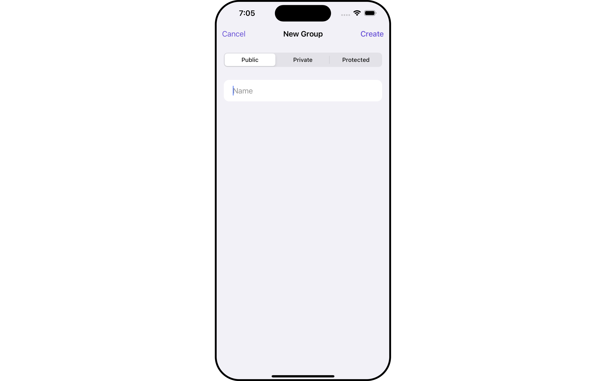

import Tabs from '@theme/Tabs';
import TabItem from '@theme/TabItem';

## Overview

`CometChatCreateGroup` serves as a versatile [Component](/ui-kit/ios/components-overview#components), empowering users to create diverse group types, encompassing public, private, and password-protected options. This functionality grants users the flexibility to tailor their group settings to suit their preferences and requirements.



<!--  -->

The `CometChatCreateGroup` component is composed of the following BaseComponents:

| Components                                 | Description                                                                                                                                                                                                                                                                                                                                                    |
| ------------------------------------------ | -------------------------------------------------------------------------------------------------------------------------------------------------------------------------------------------------------------------------------------------------------------------------------------------------------------------------------------------------------------- |
| [CometChatListBase](/ui-kit/ios/list-base) | `CometChatListBase` serves as a comprehensive container component, encompassing essential elements such as a title (navigationBar), search functionality (search-bar), background, and a container to embed a list view. This design provides a cohesive and intuitive user experience, facilitating seamless navigation and interaction within the component. |

---

## Usage

### Integration

`CreateGroup`, as a custom **view controller**, offers flexible integration options, allowing it to be launched directly via button clicks or any user-triggered action. Additionally, it seamlessly integrates into tab view controllers. With CreateGroup, users gain access to a wide range of parameters and methods for effortless customization of its user interface.

The following code snippet exemplifies how you can seamlessly integrate the CreateGroup component into your application.

<Tabs>
<TabItem value="swift" label="Swift">

```swift
let cometChatCreateGroup = CometChatCreateGroup()
let naviVC = UINavigationController(rootViewController: cometChatCreateGroup)
self.present(naviVC, animated: true)
```

</TabItem>

</Tabs>

:::info
If you are already using a navigation controller, you can use the pushViewController function instead of presenting the view controller.
:::

---

### Actions

[Actions](/ui-kit/ios/components-overview#actions) dictate how a component functions. They are divided into two types: Predefined and User-defined. You can override either type, allowing you to tailor the behavior of the component to fit your specific needs.

##### 1. SetOnCreateGroupClick

The `setOnCreateGroupClick` action is activated when you click the create Group button. This returns the created groups.

You can override this action using the following code snippet.

<Tabs>
<TabItem value="swift" label="Swift">

```swift title=""
let cometChatCreateGroup = CometChatCreateGroup()
    .setOnCreateGroupClick (onCreateGroupClick:{ group in
    //Perform Your Action

})
```

</TabItem>

</Tabs>

##### 2. SetOnError

You can customize this behavior by using the provided code snippet to override the `On Error` and improve error handling.

<Tabs>

<TabItem value="swift" label="Swift">
```swift title=""
let cometChatCreateGroup = CometChatCreateGroup()
    .setOnError (onError:{ CometChatException in
     //Perform Your Action

})

````
</TabItem>

</Tabs>

##### 3. SetOnBack

Enhance your application's functionality by leveraging the `SetOnBack` feature. This capability allows you to customize the behavior associated with navigating back within your app. Utilize the provided code snippet to override default behaviors and tailor the user experience according to your specific requirements.

<Tabs>

<TabItem value="swift" label="Swift">
```swift title=""
let cometChatCreateGroup = CometChatCreateGroup()
    .setOnBack (onBack:{
    //Perform Your Action

})
````

</TabItem>

</Tabs>

### Filters

**Filters** allow you to customize the data displayed in a list within a `Component`. You can filter the list based on your specific criteria, allowing for a more customized. Filters can be applied using `RequestBuilders` of Chat SDK.

The `CreateGroup` component does not have any exposed filters.

### Events

[Events](/ui-kit/ios/components-overview#events) are emitted by a `Component`. By using event you can extend existing functionality. Being global events, they can be applied in Multiple Locations and are capable of being Added or Removed.

Events emitted by the Create Group component is as follows.

| Event                    | Description                                                                                                |
| ------------------------ | ---------------------------------------------------------------------------------------------------------- |
| **onGroupCreate**        | This event will be triggered when the logged-in user initiates the creation of a group.                    |
| **onCreateGroupClick()** | This event is utilized to execute specific tasks when the logged-in user clicks the "Create Group" button. |

<Tabs>

<TabItem value="swift" label="Add Listener">

```swift
// View controller from your project where you want to listen events.
public class ViewController: UIViewController {

   public override func viewDidLoad() {
        super.viewDidLoad()

       // Subscribing for the listener to listen events from user module
         CometChatGroupEvents.addListener("UNIQUE_ID", self as CometChatGroupEventListener)
    }
}
 // Listener events from groups module
extension  ViewController: CometChatGroupEventListener {

    public func onCreateGroupClick() {
         // Do Stuff
    }
    public func onGroupCreate(group: Group) {
        // Do Stuff
    }
}
```

</TabItem>

</Tabs>

```swift title='Emitting Group Events'
///you need to pass the [Group] object of the group which is created
CometChatGroupEvents.emitOnGroupCreate(group: Group)
```

---

<Tabs>

<TabItem value="swift" label="Remove Listener">

```swift title='View Controller'
public override func viewWillDisappear(_ animated: Bool) {
    // Uncubscribing for the listener to listen events from user module
CometChatGroupEvents.removeListener("LISTENER_ID_USED_FOR_ADDING_THIS_LISTENER")
}
```

</TabItem>

</Tabs>

## Customization

To fit your app's design requirements, you can customize the appearance of the Groups component. We provide exposed methods that allow you to modify the experience and behavior according to your specific needs.

### Style

Using **Style** you can **customize** the look and feel of the component in your app, These parameters typically control elements such as the **color**, **size**, **shape**, and **fonts** used within the component.

##### 1. CreateGroup Style <a data-tooltip-id="my-tooltip-html-prop"> <span class="material-icons red">report</span> </a>

<Tooltip
  id="my-tooltip-html-prop"
  html="Not available"
/>

You can set the `CreateGroupStyle` to the `Create Group` Component to customize the styling.

<Tabs>
<TabItem value="swift" label="Swift">

```swift title=''
// Creating  CreateGroupStyle object
let createGroupStyle = CreateGroupStyle()

// Creating  Modifying the propeties of create group
createGroupStyle.set(background: .black)
.set(cornerRadius: CometChatCornerStyle(cornerRadius: 0.0))
.set(borderColor: .clear)
.set(borderWidth: 0)
.set(titleTextFont: .systemFont(ofSize: 22))
.set(titleTextColor: .white)
.set(namePlaceholderTextFont: .systemFont(ofSize: 16))
.set(namePlaceholderTextColor: .white)
.set(passwordPlaceholderFont: .systemFont(ofSize: 16))
.set(passwordPlaceholderColor: .white)
.set(nameInputTextFont: .systemFont(ofSize: 16))
.set(nameInputTextColor: .white)
.set(passwordInputTextFont: .systemFont(ofSize: 16))
.set(passwordInputTextColor: .white)
.set(tabColor: .black)
.set(tabTextColor: .white)
.set(tabTextFont: .systemFont(ofSize: 16))
.set(selectedTabTextColor: .white)
.set(selectedTabTextFont: .systemFont(ofSize: 16))
.set(inputBackgroundColor: .white)
.set(createButtonTextFont: .systemFont(ofSize: 16))
.set(createButtonTextColor: .tintColor)
.set(cancelButtonTextFont: .systemFont(ofSize: 16))
.set(cancelButtonTextColor: .tintColor)


// Setting the CreateGroupStyle
let cometChatCreateGroup = CometChatCreateGroup()
cometChatCreateGroup.set(createGroupStyle: createGroupStyle)

```

</TabItem>

</Tabs>

List of properties exposed by CreateGroupStyle

| Property                     | Description                                      | Code                                      |
| ---------------------------- | ------------------------------------------------ | ----------------------------------------- |
| **Background**               | Sets the background color for create group       | `set(background: UIColor)`                |
| **CornerRadius**             | Sets the corner radius for create group          | `set(cornerRadius: CometChatCornerStyle)` |
| **BorderWidth**              | Sets the border width for create group           | `set(borderWidth: CGFloat)`               |
| **BorderColor**              | Sets the border color for create group           | `set(borderColor: UIColor)`               |
| **TitleTextColor**           | Sets the title color for create group            | `set(titleTextColor: UIColor)`            |
| **TitleTextFont**            | Sets the title font for create group             | `set(titleTextFont: UIFont)`              |
| **NamePlaceholderTextColor** | Sets the placeholder color for name              | `set(namePlaceholderTextColor: UIColor)`  |
| **NamePlaceholderTextFont**  | Sets the placeholder font for name               | `set(namePlaceholderTextFont: UIFont)`    |
| **NameInputTextFont**        | Sets the text font for name                      | `set(nameInputTextFont: UIFont)`          |
| **NameInputTextColor**       | Sets the text color for name                     | `set(nameInputTextColor: UIColor)`        |
| **PasswordInputTextColor**   | Sets the text color for password                 | `set(passwordInputTextColor: UIColor)`    |
| **PasswordInputTextFont**    | Sets the text font for password                  | `set(passwordInputTextFont: UIFont)`      |
| **PasswordPlaceholderColor** | Sets the placeholder color for password          | `set(passwordPlaceholderColor: UIColor)`  |
| **PasswordPlaceholderFont**  | Sets the placeholder font for password           | `set(passwordPlaceholderFont: UIFont)`    |
| **TabColor**                 | Sets the tab color for group types               | `set(tabColor: UIColor)`                  |
| **TabTextFont**              | Sets the tab text font for group types           | `set(tabTextFont: UIFont)`                |
| **TabTextColor**             | Sets the tab text color for group types          | `set(tabTextColor: UIColor)`              |
| **SelectedTabTextFont**      | Sets the selected tab text font for group types  | `set(selectedTabTextFont: UIFont)`        |
| **SelectedTabTextColor**     | Sets the selected tab text color for group types | `set(selectedTabTextColor: UIColor)`      |
| **InputBackgroundColor**     | Sets the input view background color             | `set(inputBackgroundColor: UIColor)`      |
| **InputCornerRadius**        | Sets the input view corner radius                | `set(inputCornerRadius: CGFloat)`         |
| **CreateButtonTextColor**    | Sets the create button text color                | `set(createButtonTextColor: UIColor)`     |
| **CreateButtonTextFont**     | Sets the create button text font                 | `set(createButtonTextFont: UIFont)`       |
| **CancelButtonTextColor**    | Sets the cancel button text color                | `set(cancelButtonTextColor: UIColor)`     |
| **CancelButtonTextFont**     | Sets the cancel button text font                 | `set(cancelButtonTextFont: UIFont)`       |

---

### Functionality

These are a set of small functional customizations that allow you to fine-tune the overall experience of the component. With these, you can change text, set custom icons, and toggle the visibility of UI elements.

<Tabs>
<TabItem value="swift" label="Swift">

```swift title=''
let cometChatCreateGroup = CometChatCreateGroup()
    .set(title: "Your Custom Title", mode: .automatic)
    .set(backButtonTitle: "Cc")
    .hide(separator: true)

```

</TabItem>

</Tabs>

<!-- Default: -->
<!--  -->

<!-- Custom: -->
<!--  -->

| Property                  | Description                              | Code                                                                |
| ------------------------- | ---------------------------------------- | ------------------------------------------------------------------- |
| **Title**                 | Custom title for the component           | `.set(title: String, mode: UINavigationItem.LargeTitleDisplayMode)` |
| **BackButtonText**        | Custom text for the back button          | `.set(backButtonTitle: String?)`                                    |
| **SearchPlaceholderText** | Custom placeholder text for search field | `.set(searchPlaceholder: String)`                                   |
| **ShowBackButton**        | Whether to hide the back button          | `.show(backButton: Bool)`                                           |
| **ErrorStateText**        | Custom error state text                  | `.set(errorStateText: String)`                                      |
| **BackButtonIcon**        | Custom back button icon                  | `.set(backButtonIcon: UIImage)`                                     |

### Advanced

For advanced-level customization, you can set custom views to the component. This lets you tailor each aspect of the component to fit your exact needs and application aesthetics. You can create and define your own views, layouts, and UI elements and then incorporate those into the component.

The `Create Group` component does not provide additional functionalities beyond this level of customization.

import { Tooltip } from 'react-tooltip'
import 'react-tooltip/dist/react-tooltip.css'

<Tooltip
  id="my-tooltip-html-prop"
  html="Not available "
/>
