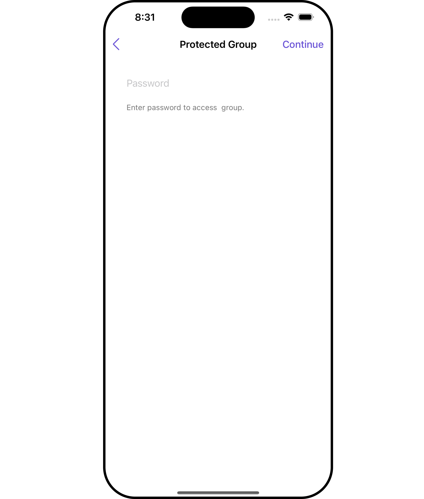
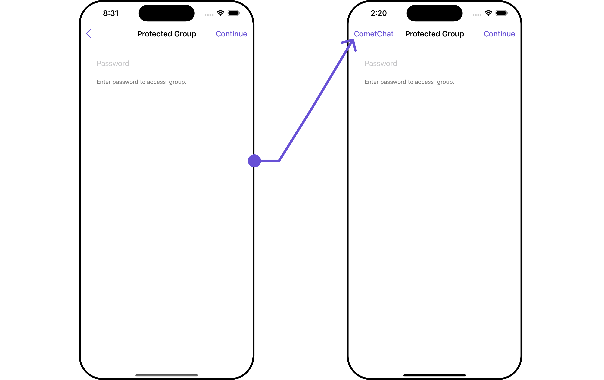

import Tabs from '@theme/Tabs';
import TabItem from '@theme/TabItem';

## Overview

CometChatJoinProtectedGroup is a [Component](/ui-kit/ios/components-overview#components) used to set up a screen that shows the functionality to join a password protected group, featuring the functionality to join a password-protected group, where users can join a single password-protected group at a time.



<!--  -->

The `CometChatJoinProtectedGroup` component is composed of the following BaseComponents:

| Components                                 | Description                                                                                                                                                                                                                                                                                                                                                    |
| ------------------------------------------ | -------------------------------------------------------------------------------------------------------------------------------------------------------------------------------------------------------------------------------------------------------------------------------------------------------------------------------------------------------------- |
| [CometChatListBase](/ui-kit/ios/list-base) | `CometChatListBase` serves as a comprehensive container component, encompassing essential elements such as a title (navigationBar), search functionality (search-bar), background, and a container to embed a list view. This design provides a cohesive and intuitive user experience, facilitating seamless navigation and interaction within the component. |

---

## Usage

### Integration

`CometChatJoinProtectedGroup`, as a custom **view controller**, offers flexible integration options, allowing it to be launched directly via button clicks or any user-triggered action. Additionally, it seamlessly integrates into tab view controllers. With join group, users gain access to a wide range of parameters and methods for effortless customization of its user interface.

The following code snippet exemplifies how you can seamlessly integrate the JoinProtectedGroup component into your application.

<Tabs>
<TabItem value="swift" label="Swift">

```swift
let cometChatJoinProtectedGroup = CometChatJoinProtectedGroup()
let naviVC = UINavigationController(rootViewController: cometChatJoinProtectedGroup)
self.present(naviVC, animated: true)
```

</TabItem>

</Tabs>

:::info
If you are already using a navigation controller, you can use the pushViewController function instead of presenting the view controller.
:::

---

### Actions

[Actions](/ui-kit/ios/components-overview#actions) dictate how a component functions. They are divided into two types: Predefined and User-defined. You can override either type, allowing you to tailor the behavior of the component to fit your specific needs.

##### 1. SetOnJoinClick

The `setOnJoinClick` action is activated when you click the join Group button. This returns the join groups.

You can override this action using the following code snippet.

<Tabs>
<TabItem value="swift" label="Swift">

```swift title=""
let cometChatJoinProtectedGroup = CometChatJoinProtectedGroup()
    .setOnJoinClick (onJoinClick:{ group, password in
    //Perform Your Action

})
```

</TabItem>

</Tabs>

##### 2. SetOnError

You can customize this behavior by using the provided code snippet to override the `On Error` and improve error handling.

<Tabs>

<TabItem value="swift" label="Swift">
```swift title=""
let cometChatJoinProtectedGroup = CometChatJoinProtectedGroup()
    .setOnError (onError:{ error in
    //Perform Your Action

})

````
</TabItem>

</Tabs>

##### 3. SetOnBack

Enhance your application's functionality by leveraging the `SetOnBack` feature. This capability allows you to customize the behavior associated with navigating back within your app. Utilize the provided code snippet to override default behaviors and tailor the user experience according to your specific requirements.

<Tabs>

<TabItem value="swift" label="Swift">
```swift title=""
let cometChatJoinProtectedGroup = CometChatJoinProtectedGroup()
    .setOnBack (onBack:{
    //Perform Your Action

})
````

</TabItem>

</Tabs>

### Filters

**Filters** allow you to customize the data displayed in a list within a `Component`. You can filter the list based on your specific criteria, allowing for a more customized. Filters can be applied using `RequestBuilders` of Chat SDK.

The `Join Group` component does not have any exposed filters.

### Events

[Events](/ui-kit/ios/components-overview#events) are emitted by a `Component`. By using event you can extend existing functionality. Being global events, they can be applied in Multiple Locations and are capable of being Added or Removed.

Events emitted by the Join Group component is as follows.

| Event                 | Description                                                  |
| --------------------- | ------------------------------------------------------------ |
| **onGroupMemberJoin** | Triggers when the user joined a protected group successfully |

<Tabs>

<TabItem value="swift" label="Add Listener">

```swift
// View controller from your project where you want to listen events.
public class ViewController: UIViewController {

   public override func viewDidLoad() {
        super.viewDidLoad()

       // Subscribing for the listener to listen events from user module
         CometChatGroupEvents.addListener("UNIQUE_ID", self as CometChatGroupEventListener)
    }
}
 // Listener events from groups module
extension  ViewController: CometChatGroupEventListener {

      public func onGroupMemberJoin(joinedUser: User, joinedGroup: Group) {
        // Do Stuff
    }
}
```

<TabItem value="swift" label="">

```swift title='Emitting Group Events'
///emit this when logged in user has joined a group successfully.
CometChatGroupEvents.emitOnGroupMemberJoin(joinedUser: User, joinedGroup:  Group)
```

</TabItem>

</TabItem>

</Tabs>

---

<Tabs>

<TabItem value="swift" label="Remove Listener">

```swift title='View Controller'
public override func viewWillDisappear(_ animated: Bool) {
    // Uncubscribing for the listener to listen events from user module
CometChatGroupEvents.removeListener("LISTENER_ID_USED_FOR_ADDING_THIS_LISTENER")
}
```

</TabItem>

</Tabs>

## Customization

To fit your app's design requirements, you can customize the appearance of the Groups component. We provide exposed methods that allow you to modify the experience and behavior according to your specific needs.

### Style

Using **Style** you can **customize** the look and feel of the component in your app, These parameters typically control elements such as the **color**, **size**, **shape**, and **fonts** used within the component.

##### 1. JoinGroup Style <a data-tooltip-id="my-tooltip-html-prop"> <span class="material-icons red">report</span> </a>

<Tooltip
  id="my-tooltip-html-prop"
  html="Not available"
/>

You can set the `JoinGroupStyle` to the `Join Group` Component to customize the styling.

<Tabs>
<TabItem value="swift" label="Swift">

```swift title=''
// Creating  JoinProtectedGroupStyle object
let joinProtectedGroupStyle = JoinProtectedGroupStyle()

// Creating  Modifying the propeties of join protected group
joinProtectedGroupStyle.set(background: .black)
.set(cornerRadius: CometChatCornerStyle(cornerRadius: 0.0))
.set(borderColor: .clear)
.set(borderWidth: 0)
.set(titleTextFont: .systemFont(ofSize: 22))
.set(titleTextColor: .white)
.set(errorTextFont: .systemFont(ofSize: 22))
.set(errorTextColor: .white)
.set(passwordPlaceholderFont: .systemFont(ofSize: 16))
.set(passwordPlaceholderColor: .white)
.set(passwordTextFont: .systemFont(ofSize: 16))
.set(passwordTextColor: .white)
.set(passwordInputBackground: .black)
.set(joinButtonTextFont: .systemFont(ofSize: 16))
.set(joinButtonTextColor: .tintColor)
.set(cancelButtonTextFont: .systemFont(ofSize: 16))
.set(cancelButtonTextColor: .tintColor)
.set(captionTextFont: .systemFont(ofSize: 16))
.set(captionTextColor: .white)

let cometChatJoinProtectedGroup = CometChatJoinProtectedGroup()
cometChatJoinProtectedGroup.set(joinProtectedGroupStyle: joinProtectedGroupStyle)
```

</TabItem>

</Tabs>

List of properties exposed by JoinGroupStyle

| Property                      | Description                                                     | Code                                      |
| ----------------------------- | --------------------------------------------------------------- | ----------------------------------------- |
| **Background**                | Sets the background color for join protected group              | `set(background: UIColor)`                |
| **CornerRadius**              | Sets the corner radius for join protected group                 | `set(cornerRadius: CometChatCornerStyle)` |
| **BorderWidth**               | Sets the border width for join protected group                  | `set(borderWidth: CGFloat)`               |
| **BorderColor**               | Sets the border color for join protected group                  | `set(borderColor: UIColor)`               |
| **TitleTextColor**            | Sets the title color for join protected group                   | `set(titleTextColor: UIColor)`            |
| **TitleTextFont**             | Sets the title font for join protected group                    | `set(titleTextFont: UIFont)`              |
| **ErrorTextColor**            | Sets the error text color for join protected group              | `set(errorTextColor: UIColor)`            |
| **ErrorTextFont**             | Sets the error text font for join protected group               | `set(errorTextFont: UIFont)`              |
| **PasswordTextColor**         | Sets the text color for password in join protected group        | `set(passwordTextColor: UIColor)`         |
| **PasswordTextFont**          | Sets the text font for password in join protected group         | `set(passwordTextFont: UIFont)`           |
| **PasswordPlaceholderColor**  | Sets the placeholder color for password in join protected group | `set(passwordPlaceholderColor: UIColor)`  |
| **PasswordPlaceholderFont**   | Sets the placeholder font for password in join protected group  | `set(passwordPlaceholderFont: UIFont)`    |
| **PasswordInputBackground**   | Sets the input view background color in join protected group    | `set(passwordInputBackground: UIColor)`   |
| **PasswordInputCornerRadius** | Sets the input view corner radius in join protected group       | `set(passwordInputCornerRadius: CGFloat)` |
| **JoinButtonTextColor**       | Sets the join button text color in join protected group         | `set(joinButtonTextColor: UIColor)`       |
| **JoinButtonTextFont**        | Sets the join button text font in join protected group          | `set(joinButtonTextFont: UIFont)`         |
| **CancelButtonTextColor**     | Sets the cancel button text color in join protected group       | `set(cancelButtonTextColor: UIColor)`     |
| **CancelButtonTextFont**      | Sets the cancel button text font in join protected group        | `set(cancelButtonTextFont: UIFont)`       |
| **CaptionTextFont**           | Sets the caption text font in join protected group              | `set(captionTextFont: UIFont)`            |
| **CaptionTextColor**          | Sets the caption text color in join protected group             | `set(captionTextColor: UIColor)`          |

---

### Functionality

These are a set of small functional customizations that allow you to fine-tune the overall experience of the component. With these, you can change text, set custom icons, and toggle the visibility of UI elements.

<Tabs>
<TabItem value="swift" label="Swift">

```swift title=''
let cometChatJoinProtectedGroup = CometChatJoinProtectedGroup()
    .set(title: "Cc", mode: .always)
    .set(passwordPlaceholderText: "Your Custom placeholder text")
    .set(backButtonTitle: "CometChat")

```

</TabItem>

</Tabs>



<!-- Default: -->
<!--  -->

<!-- Custom: -->
<!--  -->

| Property                    | Description                              | Code                                                                |
| --------------------------- | ---------------------------------------- | ------------------------------------------------------------------- |
| **Title**                   | Custom title for the component           | `.set(title: String, mode: UINavigationItem.LargeTitleDisplayMode)` |
| **BackButtonTitle**         | Custom text for the back button          | `.set(backButtonTitle: String?)`                                    |
| **SearchPlaceholderText**   | Custom placeholder text for search field | `.set(searchPlaceholder: String)`                                   |
| **ShowBackButton**          | Whether to hide the back button          | `.show(backButton: Bool)`                                           |
| **ErrorStateText**          | Custom error state text                  | `.set(errorStateText: String)`                                      |
| **BackButtonIcon**          | Custom back button icon                  | `.set(backButtonIcon: UIImage)`                                     |
| **PasswordPlaceHolderText** | Custom placeholder text                  | `.set(passwordPlaceholderText: String)`                             |
| **HideContinueButton**      | Whether to hide the continue button      | `.hide(continueButton: Bool)`                                       |

### Advanced

For advanced-level customization, you can set custom views to the component. This lets you tailor each aspect of the component to fit your exact needs and application aesthetics. You can create and define your own views, layouts, and UI elements and then incorporate those into the component.

The `Join Group` component does not provide additional functionalities beyond this level of customization.

import { Tooltip } from 'react-tooltip'
import 'react-tooltip/dist/react-tooltip.css'

<Tooltip
  id="my-tooltip-html-prop"
  html="Not available "
/>
