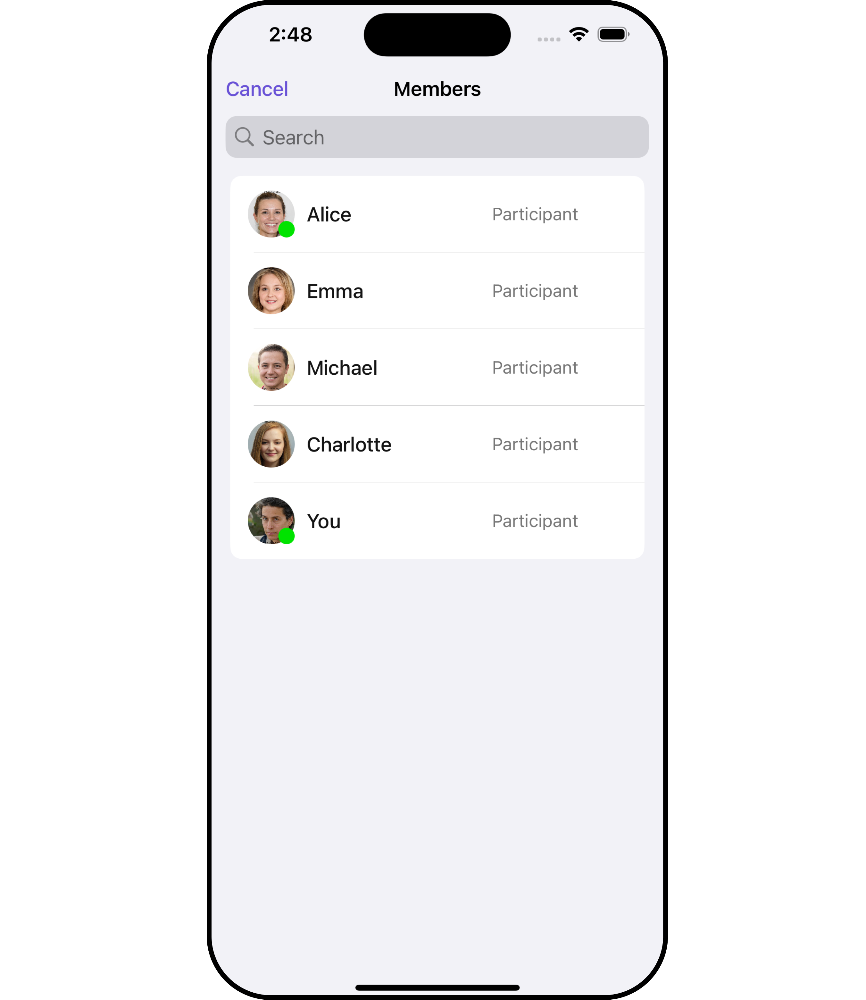
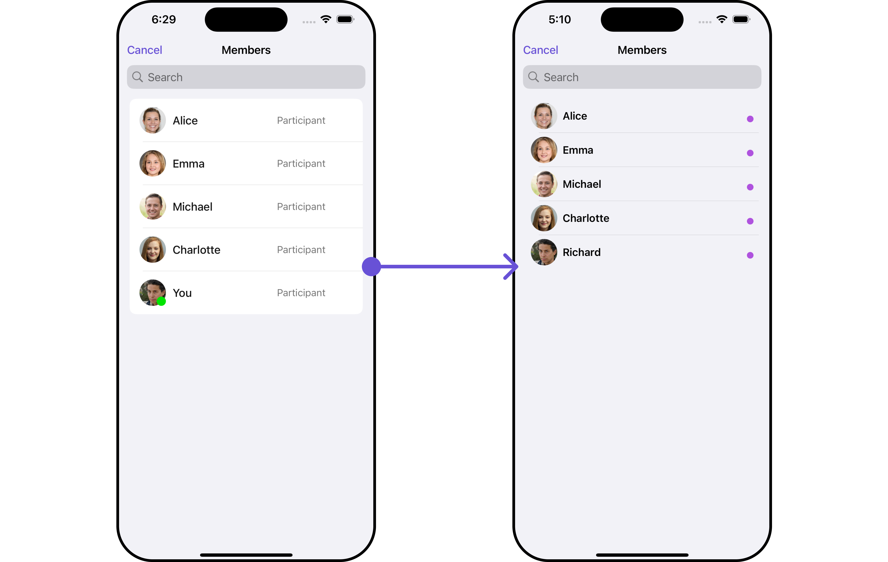
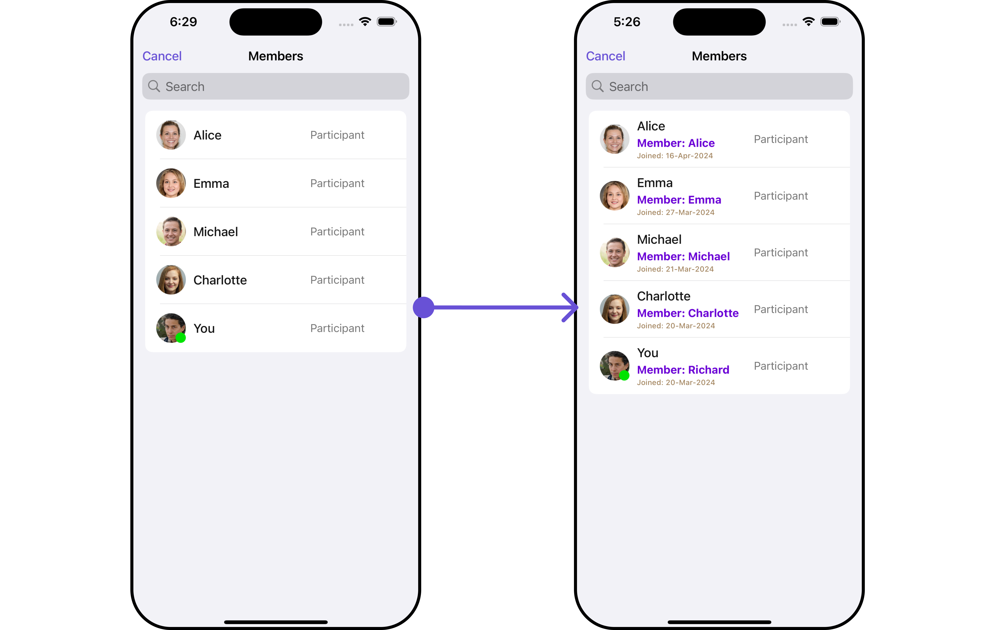
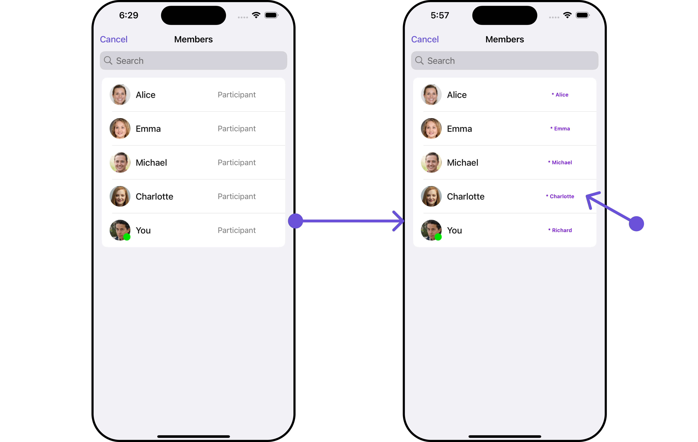
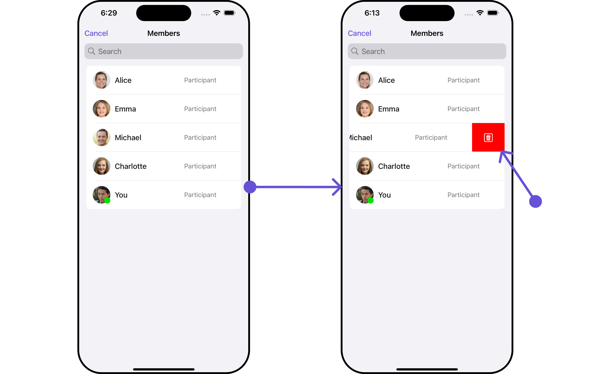

import Tabs from '@theme/Tabs';
import TabItem from '@theme/TabItem';

## Overview

`CometChatGroupMembers` is a versatile [Component](/ui-kit/ios/components-overview#components) designed to showcase all users who are either added to or invited to a group, thereby enabling them to participate in group discussions, access shared content, and engage in collaborative activities. Group members have the capability to communicate in real-time through messaging, voice and video calls, and various other interactions. Additionally, they can interact with each other, share files, and join calls based on the permissions established by the group administrator or owner.



<!--  -->

The `CometChatGroupMembers` component is composed of the following BaseComponents:

| Components                                 | Description                                                                                                                                                                                                                     |
| ------------------------------------------ | ------------------------------------------------------------------------------------------------------------------------------------------------------------------------------------------------------------------------------- |
| [CometChatListBase](/ui-kit/ios/list-base) | `CometChatListBase` serves as a container component equipped with a title (navigationBar), search functionality (search-bar), background settings, and a container for embedding a list view.                                   |
| [CometChatListItem](/ui-kit/ios/list-item) | This component renders information extracted from a `User` object onto a tile, featuring a title, subtitle, leading view, and trailing view. experience, facilitating seamless navigation and interaction within the component. |

---

## Usage

### Integration

`CometChatGroupMembers`, as a custom **view controller**, offers flexible integration options, allowing it to be launched directly via button clicks or any user-triggered action. Additionally, it seamlessly integrates into tab view controllers. With group members, users gain access to a wide range of parameters and methods for effortless customization of its user interface.

The following code snippet exemplifies how you can seamlessly integrate the GroupMembers component into your application.

<Tabs>
<TabItem value="swift" label="Swift">

```swift
let group =  Group(guid: <#T##String#>, name: <#T##String#>, groupType: <#T##CometChat.groupType#>, password: <#T##String?#>)
let cometChatGroupMembers = CometChatGroupMembers(group: group)
let naviVC = UINavigationController(rootViewController: cometChatGroupMembers)
self.present(naviVC, animated: true)
```

</TabItem>

</Tabs>

:::info
If you are already using a navigation controller, you can use the pushViewController function instead of presenting the view controller.
:::

---

### Actions

[Actions](/ui-kit/ios/components-overview#actions) dictate how a component functions. They are divided into two types: Predefined and User-defined. You can override either type, allowing you to tailor the behavior of the component to fit your specific needs.

##### 1. SetOnItemClick

This method proves valuable when users seek to override onItemClick functionality within CometChatGroupMembers, empowering them with greater control and customization options.

The `setOnItemClick` action doesn't have a predefined behavior. You can override this action using the following code snippet.

<Tabs>

<TabItem value="swift" label="Swift">
    ```swift
let cometChatGroupMembers = CometChatGroupMembers(group: group)
    .setOnItemClick (onItemClick:{ groupMember, indexPath in
    //Perform Your Action

})

````
</TabItem>

</Tabs>

##### 2. SetOnItemLongClick

This method becomes invaluable when users seek to override long-click functionality within CometChatGroupMembers, offering them enhanced control and flexibility in their interactions.

The `setOnItemLongClick` action doesn't have a predefined behavior. You can override this action using the following code snippet.

<Tabs>

<TabItem value="swift" label="Swift">
    ```swift
let cometChatGroupMembers = CometChatGroupMembers(group: group)
    .setOnItemLongClick (onItemLongClick:{ groupMember, indexPath in
    //Perform Your Action

})
````

</TabItem>

</Tabs>

##### 3. SetOnError

You can customize this behavior by using the provided code snippet to override the `On Error` and improve error handling.

<Tabs>

<TabItem value="swift" label="Swift">
```swift title=""
let cometChatGroupMembers = CometChatGroupMembers(group: group)
    .setOnError (onError:{ error in
    //Perform Your Action

})

````
</TabItem>

</Tabs>

##### 4. SetOnBack

Enhance your application's functionality by leveraging the `SetOnBack` feature. This capability allows you to customize the behavior associated with navigating back within your app. Utilize the provided code snippet to override default behaviors and tailor the user experience according to your specific requirements.

<Tabs>

<TabItem value="swift" label="Swift">
```swift title=""
let cometChatGroupMembers = CometChatGroupMembers(group: group)
    .setOnBack (onBack:{
    //Perform Your Action

})
````

</TabItem>

</Tabs>

### Filters

**Filters** allow you to customize the data displayed in a list within a `Component`. You can filter the list based on your specific criteria, allowing for a more customized. Filters can be applied using `RequestBuilders` of Chat SDK.

##### 1. GroupsRequestBuilder

The [GroupsRequestBuilder](/sdk/ios/retrieve-groups) enables you to filter and customize the group list based on available parameters in GroupsRequestBuilder. This feature allows you to create more specific and targeted queries when fetching groups. The following are the parameters available in [GroupsRequestBuilder](/sdk/ios/retrieve-groups)

| Methods              | Type     | Description                                                                                                         |
| -------------------- | -------- | ------------------------------------------------------------------------------------------------------------------- |
| **setLimit**         | Int      | Configure the maximum number of groups to fetch in a single request, optimizing pagination for smoother navigation. |
| **setSearchKeyword** | String   | Employed to retrieve groups that match the provided string, facilitating precise searches.                          |
| **scopes**           | [String] | used for fetching group members based on multiple scopes                                                            |

**Example**

In the example below, we are applying a filter to the Group List based on limit and scope.

<Tabs>
<TabItem value="swift" label="Swift">

```swift title=''
let group =  Group(guid: "mrc-uid", name: "", groupType: .public, password: .none)
let groupMembersRequestBuilder =  GroupMembersRequest.GroupMembersRequestBuilder(guid: group.guid).set(limit: 2).set(scopes: ["admin"])

let cometChatGroupMembers = CometChatGroupMembers(group: group, groupMembersRequestBuilder: groupMembersRequestBuilder)

let naviVC = UINavigationController(rootViewController: cometChatGroupMembers)
self.present(naviVC, animated: true)
```

</TabItem>

</Tabs>

##### 2. SearchRequestBuilder

The SearchRequestBuilder uses [GroupsRequestBuilder](/sdk/ios/retrieve-groups) enables you to filter and customize the search list based on available parameters in GroupsRequestBuilder.
This feature allows you to keep uniformity between the displayed Groups List and searched Group List.

**Example**

<Tabs>
<TabItem value="swift" label="Swift">

```swift title=''
let group =  Group(guid: "mrc-uid", name: "", groupType: .public, password: .none)
let groupMembersRequestBuilder =  GroupMembersRequest.GroupMembersRequestBuilder(guid: group.guid)
    .set(searchKeyword: "")

let cometChatGroupMembers = CometChatGroupMembers(group: group, groupMembersRequestBuilder: groupMembersRequestBuilder)

let naviVC = UINavigationController(rootViewController: cometChatGroupMembers)
self.present(naviVC, animated: true)

```

</TabItem>

</Tabs>

---

### Events

[Events](/ui-kit/ios/components-overview#events) are emitted by a `Component`. By using event you can extend existing functionality. Being global events, they can be applied in Multiple Locations and are capable of being Added or Removed.

Events emitted by the Join Group component is as follows.

| Event                        | Description                                                       |
| ---------------------------- | ----------------------------------------------------------------- |
| **onGroupMemberBan**         | Triggers when the group member banned from the group successfully |
| **onGroupMemberKick**        | Triggers when the group member kicked from the group successfully |
| **onGroupMemberChangeScope** | Triggers when the group member scope is changed in the group      |

<Tabs>

<TabItem value="swift" label="Add Listener">

```swift
// View controller from your project where you want to listen events.
public class ViewController: UIViewController {

   public override func viewDidLoad() {
        super.viewDidLoad()

       // Subscribing for the listener to listen events from user module
         CometChatGroupEvents.addListener("UNIQUE_ID", self as CometChatGroupEventListener)
    }
}
 // Listener events from groups module
extension  ViewController: CometChatGroupEventListener {
         public func onGroupMemberBan(bannedUser: User, bannedGroup: Group) {
         // Do Stuff
    }
        public func onGroupMemberKick(kickedUser: User, kickedGroup: Group) {
         // Do Stuff
    }
       public func onGroupMemberChangeScope(updatedBy: User, updatedUser: User, scopeChangedTo: CometChat.MemberScope, scopeChangedFrom: CometChat.MemberScope, group: Group) {
          // Do Stuff
    }
}
```

<TabItem value="swift" label="">

```swift title='Emitting Group Events'
///emit this when group member is banned from the group by logged in user.
CometChatGroupEvents.emitOnGroupMemberBan(bannedUser: User, bannedGroup:  Group, bannedBy: User)

///emit this when group member is kicked from the group by logged in user.
CometChatGroupEvents.emitOnGroupMemberKick(kickedUser: User, kickedGroup:  Group, kickedBy: User)

///emit this when group member's scope is changed by logged in user.
CometChatGroupEvents.emitOnGroupMemberChangeScope(updatedBy: User , updatedUser: User , scopeChangedTo: CometChat.MemberScope , scopeChangedFrom: CometChat.MemberScope, group: Group)

```

</TabItem>

</TabItem>

</Tabs>

---

<Tabs>

<TabItem value="swift" label="Remove Listener">

```swift title='View Controller'
public override func viewWillDisappear(_ animated: Bool) {
    // Uncubscribing for the listener to listen events from user module
CometChatGroupEvents.removeListener("LISTENER_ID_USED_FOR_ADDING_THIS_LISTENER")
}
```

</TabItem>

</Tabs>

## Customization

To fit your app's design requirements, you can customize the appearance of the Groups component. We provide exposed methods that allow you to modify the experience and behavior according to your specific needs.

### Style

Using **Style** you can **customize** the look and feel of the component in your app, These parameters typically control elements such as the **color**, **size**, **shape**, and **fonts** used within the component.

##### 1. GroupMembers Style

You can set the `GroupMembersStyle` to the `Group Memebers` Component to customize the styling.

<Tabs>
<TabItem value="swift" label="Swift">

```swift title=''
// Creating  GroupMembersStyle object
let groupMembersStyle = GroupMembersStyle()

// Creating  Modifying the propeties of conversations
groupMembersStyle.set(background: .blue)
.set(cornerRadius: CometChatCornerStyle(cornerRadius: 0.0))
.set(borderColor: .cyan)
.set(borderWidth: 3)
.set(largeTitleFont: .boldSystemFont(ofSize: 34))
.set(titleFont: .systemFont(ofSize: 18))
.set(titleColor: .systemOrange)
.set(searchIconTint: .brown)
.set(searchTextFont: .systemFont(ofSize: 16))
.set(searchTextColor: .red)
.set(searchPlaceholderFont: .systemFont(ofSize: 16))
.set(searchPlaceholderColor: .green)

let cometChatGroupMembers = CometChatGroupMembers(group: group)
.set(groupMembersStyle: groupMembersStyle)

```

</TabItem>

</Tabs>

List of properties exposed by GroupMemberStyle

| Property                   | Description                                       | Code                                      |
| -------------------------- | ------------------------------------------------- | ----------------------------------------- |
| **Background**             | Sets the background color for Add Members         | `set(background: UIColor)`                |
| **CornerRadius**           | Sets the corner radius for Add Members            | `set(cornerRadius: CometChatCornerStyle)` |
| **BorderWidth**            | Sets the border width for Add Members             | `set(borderWidth: CGFloat)`               |
| **TitleColor**             | Sets the title color for Add Members              | `set(titleColor: UIColor)`                |
| **TitleFont**              | Sets the title font for Add Members               | `set(titleFont: UIFont)`                  |
| **LargeTitleFont**         | Sets the large title font for Add Members         | `set(largeTitleFont: UIFont)`             |
| **BackIconTint**           | Sets the back button tint color for Add Members   | `set(backIconTint: UIColor)`              |
| **SearchIconTint**         | Sets the search icon tint color for Add Members   | `set(searchIconTint: UIColor)`            |
| **SearchTextFont**         | Sets the search text font for Add Members         | `set(searchTextFont: UIFont)`             |
| **SearchTextColor**        | Sets the search text color for Add Members        | `set(searchTextColor: UIColor)`           |
| **SearchCancelButtonTint** | Sets the search cancel icon tint for Add Members  | `set(searchCancelButtonTint: UIColor)`    |
| **SearchPlaceholderFont**  | Sets the search placeholder font for Add Members  | `set(searchPlaceholderFont: UIFont)`      |
| **SearchPlaceholderColor** | Sets the search placeholder color for Add Members | `set(searchPlaceholderColor: UIColor)`    |
| **AddButtonTint**          | Sets add button color for Add Members             | `set(addButtonTint: UIColor)`             |
| **AddButtonFont**          | Sets add button font for Add Members              | `set(addButtonFont: UIFont)`              |

##### 2. Avatar Style

To apply customized styles to the `Avatar` component in the Group Member Component, you can use the following code snippet. For further insights on `Avatar` Styles [refer](/ui-kit/ios/avatar)

<Tabs>
<TabItem value="swift" label="Swift">

```swift title='Swift'
 // Creating  AvatarStyle object
let avatarStyle = AvatarStyle()

// Creating  Modifying the propeties of avatar
avatarStyle.set(background: .red)
.set(textFont: .systemFont(ofSize: 18))
.set(textColor: .blue)
.set(cornerRadius: CometChatCornerStyle(cornerRadius: 8.0))
.set(borderColor: .white)
.set(borderWidth: 5)
.set(outerViewWidth: 3)
.set(outerViewSpacing: 3)

let cometChatGroupMembers = CometChatGroupMembers(group: group)
.set(avatarStyle: avatarStyle)

```

</TabItem>

</Tabs>

##### 3. StatusIndicator Style

To apply customized styles to the Status Indicator component in the Group Member Component, You can use the following code snippet. For further insights on Status Indicator Styles [refer](/ui-kit/ios/status-indicator)

<Tabs>

<TabItem value="swift" label="Swift">

```swift
// Creating  StatusIndicatorStyle object
let statusIndicatorStyle = StatusIndicatorStyle()

// Creating  Modifying the propeties of avatar
statusIndicatorStyle.set(background: .red)
.set(cornerRadius: CometChatCornerStyle(cornerRadius: 8.0))
.set(borderColor: .white)
.set(borderWidth: 5)

let cometChatGroupMembers = CometChatGroupMembers(group: group)
.set(statusIndicatorStyle: statusIndicatorStyle)
```

</TabItem>

</Tabs>

##### 4. ListItem Style

To apply customized styles to the `ListItemStyle` component in the `Group Member` Component, you can use the following code snippet. For further insights on `ListItemStyle` Styles [refer](/ui-kit/ios/list-item)


<Tabs>

<TabItem value="swift" label="Swift">

```swift
// Creating  ListItemStyle object
let listItemStyle = ListItemStyle()

// Creating  Modifying the propeties of list item
listItemStyle.set(background: .init(red: 0.81, green: 0.64, blue: 0.96, alpha: 1.00))
.set(titleFont: .systemFont(ofSize: 18))
.set(titleColor: .init(red: 0.37, green: 0.01, blue: 0.65, alpha: 1.00))
.set(cornerRadius: CometChatCornerStyle(cornerRadius: 8.0))
.set(borderColor: .black)
.set(borderWidth: 3)

let cometChatGroupMembers = CometChatGroupMembers(group: group)
.set(listItemStyle: listItemStyle)

```

</TabItem>

</Tabs>

---

### Functionality

These are a set of small functional customizations that allow you to fine-tune the overall experience of the component. With these, you can change text, set custom icons, and toggle the visibility of UI elements.

<Tabs>
<TabItem value="swift" label="Swift">

```swift title=''
let cometChatGroupMembers = CometChatGroupMembers(group: group)
    .set(title: "Cc", mode: .automatic)
    .disable(usersPresence: true)
    .hide(separator: true)
```

</TabItem>

</Tabs>

<!-- Default: -->
<!--  -->

<!-- Custom: -->
<!--  -->

| Property                    | Description                                                                                 | Code                                                                |
| --------------------------- | ------------------------------------------------------------------------------------------- | ------------------------------------------------------------------- |
| **Title**                   | Custom title for the component                                                              | `.set(title: String, mode: UINavigationItem.LargeTitleDisplayMode)` |
| **BackButtonTitle**         | Custom text for the back button                                                             | `.set(backButtonTitle: String?)`                                    |
| **SearchPlaceholderText**   | Custom placeholder text for search field                                                    | `.set(searchPlaceholder: String)`                                   |
| **ShowBackButton**          | Whether to hide the back button                                                             | `.show(backButton: Bool)`                                           |
| **ErrorStateText**          | Custom error state text                                                                     | `.set(errorStateText: String)`                                      |
| **BackButtonIcon**          | Custom back button icon                                                                     | `.set(backButtonIcon: UIImage)`                                     |
| **PasswordPlaceHolderText** | Custom placeholder text                                                                     | `.set(passwordPlaceholderText: String)`                             |
| **HideContinueButton**      | Whether to hide the continue button                                                         | `.hide(continueButton: Bool)`                                       |
| **SearchPlaceholder**       | Set the placeholder for search bar in CometChatGroupMembers                                 | `set(searchPlaceholder: String)`                                    |
| **SearchIcon**              | Sets the icon for the search bar in CometChatGroupMembers                                   | `set(searchIcon:UIImage)`                                           |
| **SearchClearIcon**         | Sets the clear icon for the search bar in CometChatGroupMembers                             | `set(searchClearIcon:UIImage)`                                      |
| **SearchBarHeight**         | Set the height for the search bar in CometChatGroupMembers                                  | `set(searchBarHeight: CGFloat)`                                     |
| **HideSearch**              | Hide / unhide the search bar as per boolean value                                           | `hide(search: Bool)`                                                |
| **SelectionMode**           | This enables a selection, it has three modes: .single, .multiple                            | `selectionMode(mode: SelectionMode)`                                |
| **HideSeparator**           | This method will hide the separator in CometChatGroupMembers                                | `hide(separator: Bool)`                                             |
| **DisableUserPresence**     | This method disables user's online/offline status in CometChatGroupMembers                  | `disable(userPresence: Bool)`                                       |
| **ClearList**               | This method will clear the users locally in CometChatGroupMembers                           | `clearList()`                                                       |
| **UpdateGroupMember**       | This method specifies the option to update member object locally in CometChatGroupMembers   | `update(groupMember: GroupMember)`                                  |
| **RemoveGroupMember**       | This method specifies the option to remove member object locally from CometChatGroupMembers | `remove(groupMember: GroupMember)`                                  |
| **GetSize**                 | This method specifies the count of members displayed in CometChatGroupMembers               | `size()`                                                            |

### Advanced

For advanced-level customization, you can set custom views to the component. This lets you tailor each aspect of the component to fit your exact needs and application aesthetics. You can create and define your own views, layouts, and UI elements and then incorporate those into the component.

The `Join Group` component does not provide additional functionalities beyond this level of customization.

#### ListItemView

Utilize this property to assign a custom ListItem to the GroupMembers Component, allowing for enhanced customization and flexibility in its rendering.

<Tabs>

<TabItem value="swift" label="Swift">

```swift
let cometChatGroupMembers = CometChatGroupMembers(group: group)
    .setListItemView (listItemView:{ groupMember in
    //Perform Your Action
})

```

</TabItem>

</Tabs>

**Example**



<!--  -->

In this example, we will create a UIView file `CustomListItemGroupView` and pass it inside the `setListItemView()` method.

```swift title="CustomListItemGroupView"

import UIKit
import CometChatSDK
import CometChatUIKitSwift

class CustomListItemGroupView: UIView {
    // Initialize your subviews
    let titleLabel: UILabel = {
        let label = UILabel()
        label.translatesAutoresizingMaskIntoConstraints = false
        label.font = UIFont.boldSystemFont(ofSize: 16)
        return label
    }()

    let statusIndicator: UIView = {
        let view = UIView()
        view.translatesAutoresizingMaskIntoConstraints = false
        view.backgroundColor = .green
        view.layer.cornerRadius = 5
        return view
    }()

    let groupImageView: CometChatAvatar = {
        let imageView = CometChatAvatar(frame: .zero)
        imageView.translatesAutoresizingMaskIntoConstraints = false
        return imageView
    }()

    // Override the initializer
    override init(frame: CGRect) {
        super.init(frame: frame)
        // Add subviews and layout constraints
        addSubview(groupImageView)
        addSubview(titleLabel)
        addSubview(statusIndicator)

        NSLayoutConstraint.activate([
            groupImageView.leadingAnchor.constraint(equalTo: leadingAnchor, constant: 8),
            groupImageView.centerYAnchor.constraint(equalTo: centerYAnchor),
            groupImageView.heightAnchor.constraint(equalToConstant: 40),
            groupImageView.widthAnchor.constraint(equalToConstant: 40),

            titleLabel.centerYAnchor.constraint(equalTo: centerYAnchor),
            titleLabel.leadingAnchor.constraint(equalTo: groupImageView.trailingAnchor, constant: 8),
            titleLabel.trailingAnchor.constraint(equalTo: trailingAnchor, constant: -8),

            statusIndicator.widthAnchor.constraint(equalToConstant: 10),
            statusIndicator.heightAnchor.constraint(equalToConstant: 10),
            statusIndicator.trailingAnchor.constraint(equalTo: titleLabel.trailingAnchor),
            statusIndicator.bottomAnchor.constraint(equalTo: titleLabel.bottomAnchor)
        ])
    }

    required init?(coder: NSCoder) {
        fatalError("init(coder:) has not been implemented")
    }

    // Configure the view with a group member
    func configure(with groupMember: GroupMember) {
        titleLabel.text = groupMember.name

        statusIndicator.backgroundColor = groupMember.joinedAt != 0 ? .systemPurple : .gray

        if let avatarUrl = groupMember.avatar {
            groupImageView.setAvatar(avatarUrl: avatarUrl, with: groupMember.name ?? "")
        } else {
        }
    }
}

```

<Tabs>

<TabItem value="swift" label="Swift">

```swift
let cometChatGroupMembers = CometChatGroupMembers(group: group)
    .setListItemView (listItemView:{ groupMember in
        let customListItemGroupView = CustomListItemGroupView()
        customListItemGroupView.configure(with: groupMember!) // pass group member here
        return customListItemGroupView
})
```

</TabItem>

</Tabs>

:::info
Ensure to pass and present `CometChatGroupMembers`. If a navigation controller is already in use, utilize the pushViewController function instead of directly presenting the view controller.
:::

---

#### SubtitleView

You can set your custom Subtitle view using the `.setSubtitleView()` method. But keep in mind, by using this you will override the default Subtitle view functionality.

<Tabs>

<TabItem value="swift" label="Swift">

```swift
let cometChatGroupMembers = CometChatGroupMembers(group: group)
    .setSubtitleView (subtitleView:{ groupMember in
    //Perform Your Action
})
```

</TabItem>

</Tabs>
- You can customize the subtitle view for each GroupMembers item to meet your requirements

**Example**



<!--  -->

In this example, we will create a `Custom_Subtitle_GroupMember_View`a UIView file.

```swift title="Custom_Subtitle_GroupMember_View"

import UIKit
import CometChatSDK
import CometChatUIKitSwift

class CustomSubtitleGroupMemberView: UIView {

    let memberNameLabel: UILabel = {
        let label = UILabel()
        label.translatesAutoresizingMaskIntoConstraints = false
        label.textColor = .init(red: 0.42, green: 0.01, blue: 0.84, alpha: 1.00)
        label.font = UIFont.systemFont(ofSize: 15, weight: .bold)
        return label
    }()

    let joinedAtLabel: UILabel = {
        let label = UILabel()
        label.translatesAutoresizingMaskIntoConstraints = false
        label.textColor = .systemBrown
        label.font = UIFont.systemFont(ofSize: 10, weight: .medium)
        return label
    }()

    override init(frame: CGRect) {
        super.init(frame: frame)
        addSubview(memberNameLabel)
        addSubview(joinedAtLabel)

        NSLayoutConstraint.activate([
            memberNameLabel.topAnchor.constraint(equalTo: topAnchor),
            memberNameLabel.leadingAnchor.constraint(equalTo: leadingAnchor),
            memberNameLabel.trailingAnchor.constraint(equalTo: trailingAnchor),

            joinedAtLabel.topAnchor.constraint(equalTo: memberNameLabel.bottomAnchor, constant: 2),
            joinedAtLabel.leadingAnchor.constraint(equalTo: leadingAnchor),
            joinedAtLabel.trailingAnchor.constraint(equalTo: trailingAnchor),
            joinedAtLabel.bottomAnchor.constraint(equalTo: bottomAnchor)
        ])
    }

    required init?(coder: NSCoder) {
        fatalError("init(coder:) has not been implemented")
    }

    func configure(with groupMember: GroupMember) {
        memberNameLabel.text = "Member: \(groupMember.name ?? "")"

        let date = Date(timeIntervalSince1970: Double(groupMember.joinedAt))
        let dateFormatter = DateFormatter()
        dateFormatter.dateStyle = .medium
        joinedAtLabel.text = "Joined: \(dateFormatter.string(from: date))"
    }
}

```

<!-- Make modifications to the code based on your specific needs and preferences. -->

We will be passing a custom subtitle view to CometChatGroupMembers, ensuring a tailored and user-friendly interface.

<Tabs>

<TabItem value="swift" label="Swift">
```swift
let cometChatGroupMembers = CometChatGroupMembers(group: group)
    .setSubtitleView(subtitleView: { groupMember in
        let customSubtitleGroupMemberView = CustomSubtitleGroupMemberView()
        customSubtitleGroupMemberView.configure(with: groupMember!)
        return customSubtitleGroupMemberView
})
````
</TabItem>

</Tabs>

:::info
Ensure to pass and present `CometChatGroupMembers`. If a navigation controller is already in use, utilize the pushViewController function instead of directly presenting the view controller.
:::

---

#### EmptyView <a data-tooltip-id="my-tooltip-html-prop"> <span class="material-icons red">report</span> </a>

You can set a custom EmptyView using `.set(emptyView: UIView)` to match the empty view of your app.

<Tabs>

<TabItem value="swift" label="swift">
```swift
let cometChatGroupMembers = CometChatGroupMembers(group: group)
    .set(emptyView: UIView)
        
````

</TabItem>

</Tabs>

**Example**

<!--  -->

In this example, we will create a `Custom_Empty_State_GroupView`a UIView file.

```swift
import UIKit

class CustomEmptyStateGroupView: UIView {
    // Initialize your subviews
    let imageView: UIImageView = {
        let imageView = UIImageView(image: UIImage(named: "noDataImage"))
        imageView.translatesAutoresizingMaskIntoConstraints = false
        return imageView
    }()

    let messageLabel: UILabel = {
        let label = UILabel()
        label.text = "No groups available"
        label.translatesAutoresizingMaskIntoConstraints = false
        label.font = UIFont.boldSystemFont(ofSize: 16)
        label.textColor = .black
        return label
    }()

    // Override the initializer
    override init(frame: CGRect) {
        super.init(frame: frame)
        // Add subviews and layout constraints
        addSubview(imageView)
        addSubview(messageLabel)
        NSLayoutConstraint.activate([
            imageView.centerXAnchor.constraint(equalTo: centerXAnchor),
            imageView.centerYAnchor.constraint(equalTo: centerYAnchor),
            imageView.heightAnchor.constraint(equalToConstant: 120),
            imageView.widthAnchor.constraint(equalToConstant: 120),

            messageLabel.topAnchor.constraint(equalTo: imageView.bottomAnchor, constant: 8),
            messageLabel.centerXAnchor.constraint(equalTo: centerXAnchor)
        ])
    }

    required init?(coder: NSCoder) {
        fatalError("init(coder:) has not been implemented")
    }
}
```

We will be passing a custom empty view to CometChatGroupMembers, ensuring a tailored and user-friendly interface.

<Tabs>

<TabItem value="swift" label="Swift">
```swift
let groupMembersRequestBuilder =  GroupMembersRequest.GroupMembersRequestBuilder(guid: group.guid)
.set(limit: 1000)

let customEmptyStateGroupView = CustomEmptyStateGroupView()

let cometChatGroupMembers = CometChatGroupMembers(group: group, groupMembersRequestBuilder: groupMembersRequestBuilder)
.set(emptyView: customEmptyStateGroupView)

````
</TabItem>


</Tabs>

:::info
Ensure to pass and present `CometChatGroupMembers`. If a navigation controller is already in use, utilize the pushViewController function instead of directly presenting the view controller.
:::

---
#### ErrorView

You can set a custom ErrorView using `.set(errorView: UIView)` to match the error view of your app.


<Tabs>

<TabItem value="swift" label="Swift">

```swift
let cometChatGroupMembers = CometChatGroupMembers(group: group)
    .set(errorView: UIView)
```

</TabItem>

</Tabs>

**Example**


<!--  -->

In this example, we will create a UIView file `Custom_ErrorState_GroupView` and pass it inside the `.set(errorView: UIView)` method.

```swift title="Custom_ErrorState_GroupView"
import UIKit

let CustomErrorStateGroupView: UIView = {
        // Create main view
        let view = UIView()
        view.backgroundColor = .white

        // Create an imageView and add it to the main view
        let imageView = UIImageView(image: UIImage(systemName: "exclamationmark.triangle"))
        imageView.tintColor = .red
        imageView.translatesAutoresizingMaskIntoConstraints = false
        view.addSubview(imageView)

        // Create a label with error message and add it to the main view
        let label = UILabel()
        label.text = "An error occurred. Please try again."
        label.font = UIFont.systemFont(ofSize: 16)
        label.textColor = .darkGray
        label.numberOfLines = 0
        label.textAlignment = .center
        label.translatesAutoresizingMaskIntoConstraints = false
        view.addSubview(label)

        // Create constraints for imageView and label
        NSLayoutConstraint.activate([
            imageView.centerXAnchor.constraint(equalTo: view.centerXAnchor),
            imageView.centerYAnchor.constraint(equalTo: view.centerYAnchor, constant: -50),

            label.topAnchor.constraint(equalTo: imageView.bottomAnchor, constant: 20),
            label.leadingAnchor.constraint(equalTo: view.leadingAnchor, constant: 20),
            label.trailingAnchor.constraint(equalTo: view.trailingAnchor, constant: -20)
        ])

        return view
    }()
```

<Tabs>

<TabItem value="swift" label="Swift">

```swift
let groupMembersRequestBuilder =  GroupMembersRequest.GroupMembersRequestBuilder(guid: group.guid)
.set(limit: 1000)

let customErrorStateGroupView = CustomErrorStateGroupView

let cometChatGroupMembers = CometChatGroupMembers(group: group, groupMembersRequestBuilder: groupMembersRequestBuilder)
.set(errorView: customErrorStateGroupView)

```

</TabItem>

</Tabs>

:::info
Ensure to pass and present `CometChatGroupMembers`. If a navigation controller is already in use, utilize the pushViewController function instead of directly presenting the view controller.
:::

---

#### Menus

You can set the Custom Menus to add more options to the Groups component.


<Tabs>

<TabItem value="swift" label="Swift">

```swift
let cometChatGroupMembers = CometChatGroupMembers(group: group)
    .set(menus: [UIBarButtonItem])
```

</TabItem>

</Tabs>

- You can customize the menus for groups to meet your requirements

**Example**


<!--  -->

In this example, we'll craft a custom button tailored for `CometChatGroupMembers`, enhancing its interface with a personalized `menu` for a more user-friendly experience.


<Tabs>

<TabItem value="swift" label="Swift">
```swift
let customMenuButton: UIBarButtonItem = {
    let button = UIButton(type: .system)
    button.setImage(UIImage(systemName: "swift"), for: .normal)
    button.setTitle("", for: .normal)
    button.addTarget(self, action: #selector(handleCustomMenu), for: .touchUpInside)
    let barButtonItem = UIBarButtonItem(customView: button)
    return barButtonItem
}()

let cometChatGroupMembers = CometChatGroupMembers(group: group)
.set(menus: [customMenuButton])

````

</TabItem>

</Tabs>

:::info
Ensure to pass and present `CometChatGroupMembers`. If a navigation controller is already in use, utilize the pushViewController function instead of directly presenting the view controller.
:::

---

#### TailView

You can set a custom Tailview using `.setTailView()` to match the `TailView` view of your app.

<Tabs>

<TabItem value="swift" label="Swift">

```swift
let cometChatGroupMembers = CometChatGroupMembers(group: group)
    .setTailView (tailView:{ groupMember in
    //Perform Your Action

})
```

</TabItem>

</Tabs>

**Example**



<!--  -->

In this example, we will create a UIView file `Custom_Tail_GroupView` and pass it inside the `.setTailView()` method.

```swift title="Custom_Tail_GroupView"

import UIKit
import CometChatSDK
import CometChatUIKitSwift

class CustomTailGroupView: UIView {

    let tailLabel: UILabel = {
        let label = UILabel()
        label.translatesAutoresizingMaskIntoConstraints = false
        label.font = UIFont.systemFont(ofSize: 10, weight: .semibold)
        label.textColor = .init(red: 0.42, green: 0.01, blue: 0.84, alpha: 1.00)
        return label
    }()

    override init(frame: CGRect) {
        super.init(frame: frame)
        addSubview(tailLabel)
        NSLayoutConstraint.activate([
            tailLabel.centerXAnchor.constraint(equalTo: centerXAnchor),
            tailLabel.centerYAnchor.constraint(equalTo: centerYAnchor),
        ])
    }

    required init?(coder: NSCoder) {
        fatalError("init(coder:) has not been implemented")
    }

    // Configure the view with a group member
    func configure(with groupMember: GroupMember) {
        tailLabel.text = "* \(groupMember.name!.description )"
    }
}

```

<Tabs>

<TabItem value="swift" label="Swift">

```swift
let cometChatGroupMembers = CometChatGroupMembers(group: group)
    .setTailView(tailView: { groupMember in
        let customTailGroupView = CustomTailGroupView()
        customTailGroupView.configure(with: groupMember!)
        return customTailGroupView
})
```

</TabItem>

</Tabs>

:::info
Ensure to pass and present `CometChatGroupMembers`. If a navigation controller is already in use, utilize the pushViewController function instead of directly presenting the view controller.
:::

---

#### Options

Enhance your GroupsMembers component by setting Custom Options to incorporate additional functionalities when swiping

<Tabs>

<TabItem value="swift" label="Swift">

```swift
let cometChatGroupMembers = CometChatGroupMembers(group: group)
    .setOptions (options:{ group, groupMember in
    //Perform Your Action
})
```

</TabItem>

</Tabs>

- You can customize the options for group members to meet your requirements

**Example**



<!--  -->

In this example, we've enhanced the interface of `CometChatGroupMembers` by introducing a tailored feature. By adding a custom option, such as "Delete" with a corresponding trash icon, users can now enjoy a more interactive and user-friendly experience.

<Tabs>

<TabItem value="swift" label="Swift">
```swift
let customOption = CometChatGroupMemberOption(id: "custom_option_1",
                                              title: "Delete",
                                              icon: UIImage(systemName: "trash.square"),
                                              backgroundColor: .red,
                                              onClick: { groupMember, group, section, option, controller in
                                                        print("Custom option clicked!")
})

let cometChatGroupMembers = CometChatGroupMembers(group: group)
.setOptions(options: { group, groupMember in
return [customOption]
})

```
</TabItem>


</Tabs>

:::info
Ensure to pass and present `CometChatGroupMembers`. If a navigation controller is already in use, utilize the pushViewController function instead of directly presenting the view controller.
:::
---
import { Tooltip } from 'react-tooltip'
import 'react-tooltip/dist/react-tooltip.css'

<Tooltip
  id="my-tooltip-html-prop"
  html="Not available "
/>

```
