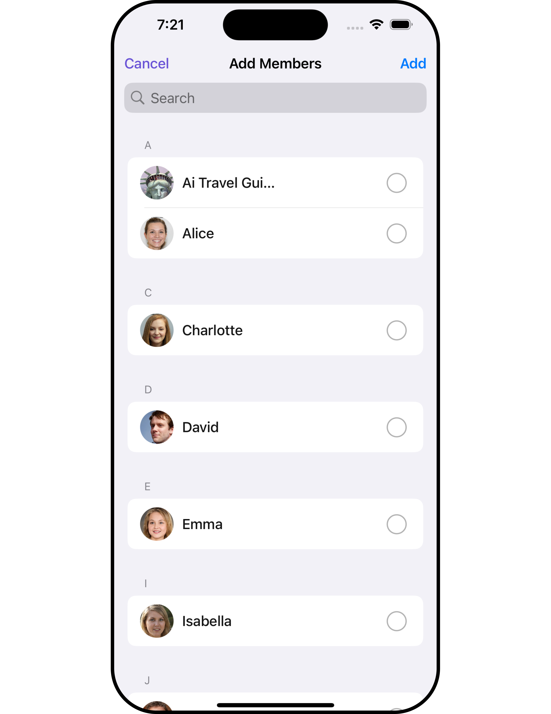
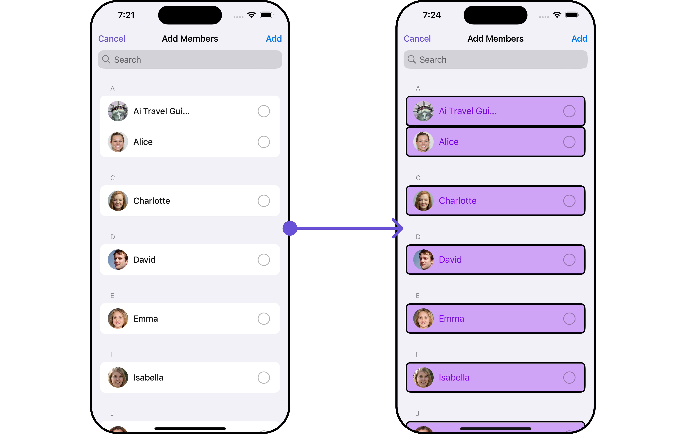
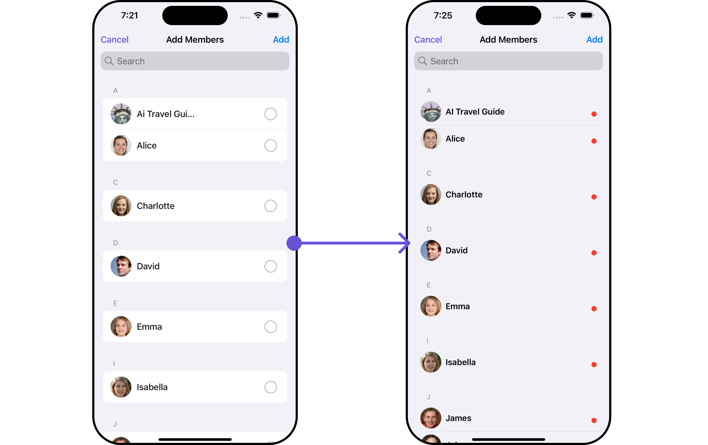
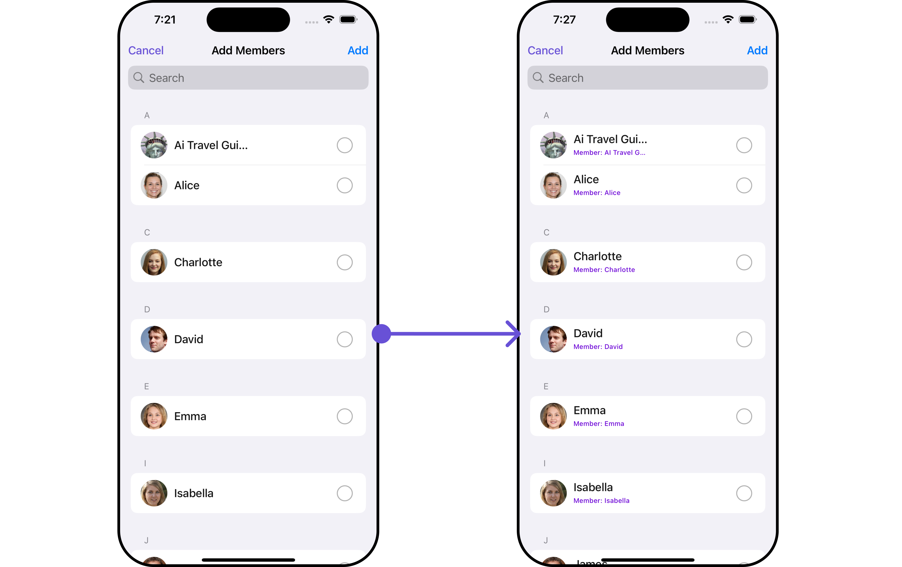
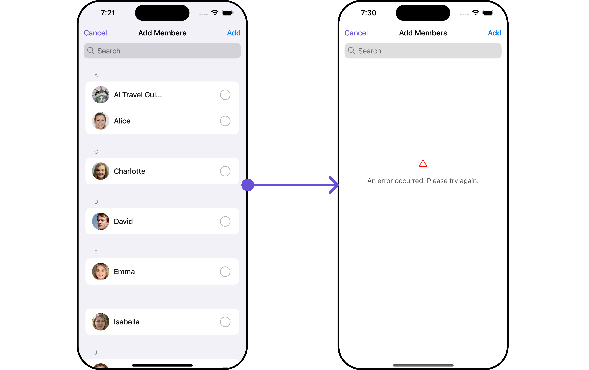
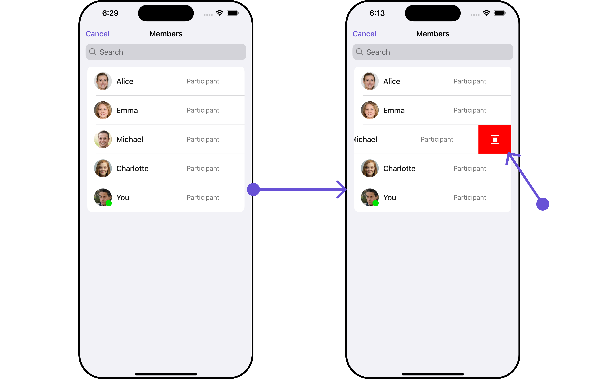

import Tabs from '@theme/Tabs';
import TabItem from '@theme/TabItem';

## Overview

`CometChatAddMembers` is a [Component](/ui-kit/ios/components-overview#components) that empowers administrators or group owners with the ability to expand group membership by seamlessly adding new participants. This component facilitates effortless management of group membership and enhances collaboration within the group's discussions and activities. Administrators can meticulously select desired users to join the group, whether by targeted search or from a list of available users. Selected users receive notifications, streamlining the process of joining the group and ensuring smooth integration into the community.



<!--  -->

The `CometChatAddMembers` component is composed of the following BaseComponents:

| Components                                 | Description                                                                                                                                                                                                                                                                                                                                                   |
| ------------------------------------------ | ------------------------------------------------------------------------------------------------------------------------------------------------------------------------------------------------------------------------------------------------------------------------------------------------------------------------------------------------------------- |
| [CometChatUsers](/ui-kit/ios/users)        | `CometChatUsers` is a standalone component that presents a user list and enables targeted user searches. As a container inheriting from `CometChatListBase`, it seamlessly incorporates the `CometChatUserList` component. This setup streamlines user browsing and search capabilities, enhancing overall usability and facilitating efficient interactions. |
| [CometChatListItem](/ui-kit/ios/list-item) | This component renders information extracted from a `User` object onto a tile, featuring a title, subtitle, leading view, and trailing view. experience, facilitating seamless navigation and interaction within the component.                                                                                                                               |

---

## Usage

### Integration

`CometChatAddMembers`, as a custom **view controller**, offers flexible integration options, allowing it to be launched directly via button clicks or any user-triggered action. Additionally, it seamlessly integrates into tab view controllers. With add members, users gain access to a wide range of parameters and methods for effortless customization of its user interface.

The following code snippet exemplifies how you can seamlessly integrate the AddMembers component into your application.

<Tabs>
<TabItem value="swift" label="Swift">

```swift
let cometChatAddMembers = CometChatAddMembers()
let naviVC = UINavigationController(rootViewController: cometChatAddMembers)
self.present(naviVC, animated: true)
```

</TabItem>

</Tabs>

:::info
If you are already using a navigation controller, you can use the pushViewController function instead of presenting the view controller.
:::

---

### Actions

[Actions](/ui-kit/ios/components-overview#actions) dictate how a component functions. They are divided into two types: Predefined and User-defined. You can override either type, allowing you to tailor the behavior of the component to fit your specific needs.

##### 1. SetOnItemClick

This method proves valuable when users seek to override onItemClick functionality within CometChatAddMembers, empowering them with greater control and customization options.

The `setOnItemClick` action doesn't have a predefined behavior. You can override this action using the following code snippet.

<Tabs>

<TabItem value="swift" label="Swift">
    ```swift
let cometChatAddMembers = CometChatAddMembers(group: group)
    .setOnItemClick (onItemClick:{ user, indexPath in
                
})
    ```
</TabItem>

</Tabs>

##### 2. SetOnItemLongClick

This method becomes invaluable when users seek to override long-click functionality within CometChatAddMembers, offering them enhanced control and flexibility in their interactions.

The `setOnItemLongClick` action doesn't have a predefined behavior. You can override this action using the following code snippet.

<Tabs>

<TabItem value="swift" label="Swift">
    ```swift
let cometChatAddMembers = CometChatAddMembers(group: group)
    .setOnItemLongClick (onItemLongClick:{ user, indexPath in
    //Perform Your Actions         
})
    ```
</TabItem>

</Tabs>

##### 3. SetOnError

You can customize this behavior by using the provided code snippet to override the `On Error` and improve error handling.

<Tabs>

<TabItem value="swift" label="Swift">
```swift title=""
let cometChatAddMembers = CometChatAddMembers(group: group)
    .setOnError (onError:{ error in
    //Perform Your Action
})
```
</TabItem>

</Tabs>

##### 4. SetOnBack

Enhance your application's functionality by leveraging the `SetOnBack` feature. This capability allows you to customize the behavior associated with navigating back within your app. Utilize the provided code snippet to override default behaviors and tailor the user experience according to your specific requirements.

<Tabs>

<TabItem value="swift" label="Swift">
```swift title=""
let cometChatAddMembers = CometChatAddMembers(group: group)
    .setOnBack (onBack:{
    //Perform Your Action
             
})
```
</TabItem>

</Tabs>

### Filters

**Filters** allow you to customize the data displayed in a list within a `Component`. You can filter the list based on your specific criteria, allowing for a more customized. Filters can be applied using `RequestBuilders` of Chat SDK.

##### 1. UsersRequestBuilder

The [UsersRequestBuilder](/sdk/ios/retrieve-users) enables you to filter and customize the group list based on available parameters in UsersRequestBuilder. This feature allows you to create more specific and targeted queries when fetching users. The following are the parameters available in [UsersRequestBuilder](/sdk/ios/retrieve-users)

| Methods              | Type                 | Description                                                                                                         |
| -------------------- | -------------------- | ------------------------------------------------------------------------------------------------------------------- |
| **setLimit**         | Int                  | Configure the maximum number of groups to fetch in a single request, optimizing pagination for smoother navigation. |
| **setSearchKeyword** | String               | Employed to retrieve groups that match the provided string, facilitating precise searches.                          |
| **setTags**          | [String]             | used for fetching users containing the passed tags                                                                  |
| **setRoles**         | [String]             | used for fetching users containing the passed tags                                                                  |
| **setUIDs**          | [String]             | used for fetching users containing the passed users                                                                 |
| **setStatus**        | CometChat.UserStatus | used for fetching users by their status online or offline                                                           |

**Example**

In the example below, we are applying a filter to the User List based on limits.

<Tabs>
<TabItem value="swift" label="Swift">

```swift title=''
let group =  Group(guid: "Your-uid", name: "", groupType: .public, password: .none)
let usersRequestBuilder = UsersRequest.UsersRequestBuilder(limit: 2)
let cometChatAddMembers = CometChatAddMembers(group: group, userRequestBuilder: usersRequestBuilder)

let naviVC = UINavigationController(rootViewController: cometChatAddMembers)
self.present(naviVC, animated: true)
```

</TabItem>

</Tabs>

##### 2. SearchRequestBuilder

The SearchRequestBuilder uses [UsersRequestBuilder](/sdk/ios/retrieve-users) enables you to filter and customize the search list based on available parameters in UsersRequestBuilder.
This feature allows you to keep uniformity between the displayed User List and searched User List.

**Example**

<Tabs>
<TabItem value="swift" label="Swift">

```swift title=''
let group =  Group(guid: "Your-uid", name: "", groupType: .public, password: .none)
let usersRequestBuilder = UsersRequest.UsersRequestBuilder(limit: 2).set(searchKeyword: "Your Keyword")
let cometChatAddMembers = CometChatAddMembers(group: group, userRequestBuilder: usersRequestBuilder)

let naviVC = UINavigationController(rootViewController: cometChatAddMembers)
self.present(naviVC, animated: true)

```

</TabItem>

</Tabs>

---

### Events

[Events](/ui-kit/ios/components-overview#events) are emitted by a `Component`. By using event you can extend existing functionality. Being global events, they can be applied in Multiple Locations and are capable of being Added or Removed.

Events emitted by the Join Group component is as follows.

| Event                | Description                                        |
| -------------------- | -------------------------------------------------- |
| **onGroupMemberAdd** | Triggers when a user added to a group successfully |

<Tabs>

<TabItem value="swift" label="Add Listener">

```swift
// View controller from your project where you want to listen events.
public class ViewController: UIViewController {

   public override func viewDidLoad() {
        super.viewDidLoad()

       // Subscribing for the listener to listen events from user module
         CometChatGroupEvents.addListener("UNIQUE_ID", self as CometChatGroupEventListener)
    }
}
 // Listener events from groups module
extension  ViewController: CometChatGroupEventListener {

    public func onGroupMemberAdd(group: Group, members: [GroupMember], addedBy: User) {
        // Do Stuff
    }

}
```

<TabItem value="swift" label="">

```swift title='Emitting Group Events'
//emit this when members are added to a group by the logged in user.
CometChatGroupEvents.emitOnGroupMemberAdd(group: Group, members: [GroupMember], addedBy: User)
```

</TabItem>

</TabItem>

</Tabs>

---

<Tabs>

<TabItem value="swift" label="Remove Listener">

```swift title='View Controller'
public override func viewWillDisappear(_ animated: Bool) {
    // Uncubscribing for the listener to listen events from user module
CometChatGroupEvents.removeListener("LISTENER_ID_USED_FOR_ADDING_THIS_LISTENER")
}
```

</TabItem>

</Tabs>

## Customization

To fit your app's design requirements, you can customize the appearance of the Groups component. We provide exposed methods that allow you to modify the experience and behavior according to your specific needs.

### Style

Using **Style** you can **customize** the look and feel of the component in your app, These parameters typically control elements such as the **color**, **size**, **shape**, and **fonts** used within the component.

<!-- ##### 1. AddMembers Style

You can set the `GroupMembersStyle` to the `Group Memebers` Component to customize the styling.


<Tabs>
<TabItem value="swift" label="Swift">

```swift title=''

```

</TabItem>

</Tabs>


List of properties exposed by GroupMemberStyle

| Property                  | Description                                   | Code                                          |
| ------------------------- | --------------------------------------------- | --------------------------------------------- |
| **Background**            | Sets the background color for Add Members     | `set(background: UIColor)`                    |
| **CornerRadius**          | Sets the corner radius for Add Members        | `set(cornerRadius: CometChatCornerStyle)`     |
| **BorderWidth**           | Sets the border width for Add Members         | `set(borderWidth: CGFloat)`                   |
| **TitleColor**            | Sets the title color for Add Members          | `set(titleColor: UIColor)`                    |
| **TitleFont**             | Sets the title font for Add Members           | `set(titleFont: UIFont)`                      |
| **LargeTitleFont**        | Sets the large title font for Add Members     | `set(largeTitleFont: UIFont)`                 |
| **BackIconTint**        | Sets the back button tint color for Add Members | `set(backIconTint: UIColor)`              |
| **SearchIconTint**        | Sets the search icon tint color for Add Members | `set(searchIconTint: UIColor)`              |
| **SearchTextFont**        | Sets the search text font for Add Members     | `set(searchTextFont: UIFont)`                 |
| **SearchTextColor**       | Sets the search text color for Add Members    | `set(searchTextColor: UIColor)`               |
| **SearchCancelButtonTint**  | Sets the search cancel icon tint for Add Members | `set(searchCancelButtonTint: UIColor)`        |
| **SearchPlaceholderFont** | Sets the search placeholder font for Add Members | `set(searchPlaceholderFont: UIFont)`        |
| **SearchPlaceholderColor**| Sets the search placeholder color for Add Members | `set(searchPlaceholderColor: UIColor)`      |
| **AddButtonTint**         | Sets add button color for Add Members         | `set(addButtonTint: UIColor)`                 |
| **AddButtonFont**         | Sets add button font for Add Members          | `set(addButtonFont: UIFont)`                  | -->

##### 1. Avatar Style

To apply customized styles to the `Avatar` component in the Add Members Component, you can use the following code snippet. For further insights on `Avatar` Styles [refer](/ui-kit/ios/avatar)

<Tabs>
<TabItem value="swift" label="Swift">

```swift title='Swift'
// Creating  AvatarStyle object
let avatarStyle = AvatarStyle()

// Creating  Modifying the propeties of avatar
avatarStyle.set(background: .red)
.set(textFont: .systemFont(ofSize: 18))
.set(textColor: .green)
.set(cornerRadius: CometChatCornerStyle(cornerRadius: 8.0))
.set(borderColor: .orange)
.set(borderWidth: 3)
.set(outerViewWidth: 3)
.set(outerViewSpacing: 3)

let group =  Group(guid: "your-uid", name: "", groupType: .public, password: .none)
let cometChatAddMembers = CometChatAddMembers(group: group)
.set(avatarStyle: avatarStyle)
```

</TabItem>

</Tabs>

##### 2. StatusIndicator Style

To apply customized styles to the Status Indicator component in the Add Members Component, You can use the following code snippet. For further insights on Status Indicator Styles [refer](/ui-kit/ios/status-indicator)

<Tabs>

<TabItem value="swift" label="Swift">

```swift
// Creating  StatusIndicatorStyle object
let statusIndicatorStyle = StatusIndicatorStyle()

// Creating  Modifying the propeties of avatar
statusIndicatorStyle.set(background: .red)
.set(borderColor: .green)
.set(borderWidth: 5)
.set(cornerRadius: CometChatCornerStyle.init(cornerRadius: 10))

let group =  Group(guid: "your-uid", name: "", groupType: .public, password: .none)
let cometChatAddMembers = CometChatAddMembers(group: group)
.set(statusIndicatorStyle: statusIndicatorStyle)

```

</TabItem>

</Tabs>

##### 3. LisItem Style

To apply customized styles to the `ListItemStyle` component in the `Add Members` Component, you can use the following code snippet. For further insights on `ListItemStyle` Styles [refer](/ui-kit/ios/list-item)


<Tabs>

<TabItem value="swift" label="Swift">

```swift
// Creating  ListItemStyle object
let listItemStyle = ListItemStyle()

// Creating  Modifying the propeties of list item
listItemStyle.set(background: .init(red: 0.81, green: 0.64, blue: 0.96, alpha: 1.00))
.set(titleFont: .systemFont(ofSize: 18))
.set(titleColor: .init(red: 0.47, green: 0.02, blue: 0.93, alpha: 1.00))
.set(cornerRadius: CometChatCornerStyle(cornerRadius: 8.0))
.set(borderColor: .black)
.set(borderWidth: 3)

let group =  Group(guid: "mrc-uid", name: "", groupType: .public, password: .none)
let cometChatAddMembers = CometChatAddMembers(group: group)
.set(listItemStyle: listItemStyle)
```

</TabItem>

</Tabs>

:::tip
Ensure to include your GUID and the name of your group when configuring group settings.
:::

---

### Functionality

These are a set of small functional customizations that allow you to fine-tune the overall experience of the component. With these, you can change text, set custom icons, and toggle the visibility of UI elements.

<Tabs>
<TabItem value="swift" label="Swift">

```swift title=''
let group =  Group(guid: "your-uid", name: "", groupType: .public, password: .none)
let cometChatAddMembers = CometChatAddMembers(group: group)
    .set(title: "CC", mode: .automatic)
    .disable(userPresence: true)
    .hide(separator: true)
```

</TabItem>

</Tabs>

<!-- Default: -->
<!--  -->

<!-- Custom: -->
<!--  -->

Below is a list of customizations along with corresponding code snippets

| Property                  | Description                                                      | Code                                                                |
| ------------------------- | ---------------------------------------------------------------- | ------------------------------------------------------------------- |
| **Title**                 | Custom title for the component                                   | `.set(title: String, mode: UINavigationItem.LargeTitleDisplayMode)` |
| **BackButtonTitle**       | Custom text for the back button                                  | `.set(backButtonTitle: String?)`                                    |
| **SearchPlaceholderText** | Custom placeholder text for search field                         | `.set(searchPlaceholder: String)`                                   |
| **ShowBackButton**        | Whether to hide the back button                                  | `.show(backButton: Bool)`                                           |
| **ErrorStateText**        | Custom error state text                                          | `.set(errorStateText: String)`                                      |
| **BackButtonIcon**        | Custom back button icon                                          | `.set(backButtonIcon: UIImage)`                                     |
| **HideAddButton**         | Whether to hide the add button                                   | `.hide(addButton: Bool)`                                            |
| **SearchPlaceholder**     | Set the placeholder for search bar                               | `set(searchPlaceholder: String)`                                    |
| **SearchIcon**            | Sets the icon for the search bar                                 | `set(searchIcon:UIImage)`                                           |
| **SearchClearIcon**       | Sets the clear icon for the search bar                           | `set(searchClearIcon:UIImage)`                                      |
| **SearchBarHeight**       | Set the height for the search bar                                | `set(searchBarHeight: CGFloat)`                                     |
| **HideSearch**            | Hide / unhide the search bar as per boolean value                | `hide(search: Bool)`                                                |
| **SelectionMode**         | This enables a selection, it has three modes: .single, .multiple | `selectionMode(mode: SelectionMode)`                                |
| **HideSeparator**         | This method will hide the separator                              | `hide(separator: Bool)`                                             |
| **DisableUserPresence**   | This method disables user's online/offline status                | `disable(userPresence: Bool)`                                       |
| **UpdateUser**            | This method specifies the option to update user object locally   | `.update(user: User)`                                               |
| **RemoveUser**            | This method specifies the option to remove user object locally   | `.remove(user: User)`                                               |

:::tip
Ensure to include your GUID and the name of your group when configuring group settings.
:::

---

### Advanced

For advanced-level customization, you can set custom views to the component. This lets you tailor each aspect of the component to fit your exact needs and application aesthetics. You can create and define your own views, layouts, and UI elements and then incorporate those into the component.

The `Add Members` component does not provide additional functionalities beyond this level of customization.

#### ListItemView

Utilize this property to assign a custom ListItem to the AddMembers Component, allowing for enhanced customization and flexibility in its rendering.

<Tabs>

<TabItem value="swift" label="Swift">

```swift
let group =  Group(guid: "your-uid", name: "", groupType: .public, password: .none)
let cometChatAddMembers = CometChatAddMembers(group: group)
    .setListItemView (listItemView:{ user in
    //Perform Your Action
})
```

</TabItem>

</Tabs>

**Example**



<!--  -->

In this example, we will create a UIView file `CustomListItemGroupView` and pass it inside the `setListItemView()` method.

```swift title="CustomListItemGroupView"
import UIKit
import CometChatSDK
import CometChatUIKitSwift

class CustomListItemGroupView: UIView {
    // Initialize your subviews
    let titleLabel: UILabel = {
        let label = UILabel()
        label.translatesAutoresizingMaskIntoConstraints = false
        label.font = UIFont.boldSystemFont(ofSize: 16)
        return label
    }()

    let statusIndicator: UIView = {
        let view = UIView()
        view.translatesAutoresizingMaskIntoConstraints = false
        view.backgroundColor = .systemRed
        view.layer.cornerRadius = 5
        return view
    }()

    let groupImageView: CometChatAvatar = {
        let imageView = CometChatAvatar(frame: .zero)
        imageView.translatesAutoresizingMaskIntoConstraints = false
        return imageView
    }()

    // Override the initializer
    override init(frame: CGRect) {
        super.init(frame: frame)
        // Add subviews and layout constraints
        addSubview(groupImageView)
        addSubview(titleLabel)
        addSubview(statusIndicator)

        NSLayoutConstraint.activate([
            groupImageView.leadingAnchor.constraint(equalTo: leadingAnchor, constant: 8),
            groupImageView.centerYAnchor.constraint(equalTo: centerYAnchor),
            groupImageView.heightAnchor.constraint(equalToConstant: 40),
            groupImageView.widthAnchor.constraint(equalToConstant: 40),

            titleLabel.centerYAnchor.constraint(equalTo: centerYAnchor),
            titleLabel.leadingAnchor.constraint(equalTo: groupImageView.trailingAnchor, constant: 8),
            titleLabel.trailingAnchor.constraint(equalTo: trailingAnchor, constant: -8),

            statusIndicator.widthAnchor.constraint(equalToConstant: 10),
            statusIndicator.heightAnchor.constraint(equalToConstant: 10),
            statusIndicator.trailingAnchor.constraint(equalTo: titleLabel.trailingAnchor),
            statusIndicator.bottomAnchor.constraint(equalTo: titleLabel.bottomAnchor)
        ])
    }

    required init?(coder: NSCoder) {
        fatalError("init(coder:) has not been implemented")
    }


    func configure(with user: User) {
        titleLabel.text = user.name
        if let avatarUrl = user.avatar {
            groupImageView.setAvatar(avatarUrl: avatarUrl, with: user.name ?? "")
        } else {
            // handle when avatar is nil
        }
    }
}
```

<Tabs>

<TabItem value="swift" label="Swift">

```swift
let group =  Group(guid: "your-uid", name: "", groupType: .public, password: .none)
let cometChatAddMembers = CometChatAddMembers(group: group)
    .setListItemView (listItemView:{ groupMember in
        let customListItemGroupView = CustomListItemGroupView()
        if let user = groupMember as? User {
            customListItemGroupView.configure(with: user)
        }
        return customListItemGroupView
})
```

</TabItem>

</Tabs>

:::info
Ensure to pass and present `CometChatAddMembers`. If a navigation controller is already in use, utilize the pushViewController function instead of directly presenting the view controller.
:::

---

#### SubtitleView

You can set your custom Subtitle view using the `.setSubtitleView()` method. But keep in mind, by using this you will override the default Subtitle view functionality.

<Tabs>

<TabItem value="swift" label="Swift">

```swift
let group =  Group(guid: "your-uid", name: "", groupType: .public, password: .none)
let cometChatAddMembers = CometChatAddMembers(group: group)
    .setSubtitle (subtitle:{ user in
    //Perform Your Action

})
```

</TabItem>

</Tabs>
- You can customize the subtitle view for each AddMembers item to meet your requirements

**Example**



<!--  -->

In this example, we will create a `Custom_Subtitle_GroupMember_View`a UIView file.

```swift title="Custom_Subtitle_GroupMember_View"
import UIKit
import CometChatSDK
import CometChatUIKitSwift

class CustomSubtitleGroupMemberView: UIView {

    let memberNameLabel: UILabel = {
        let label = UILabel()
        label.translatesAutoresizingMaskIntoConstraints = false
        label.textColor = .init(red: 0.42, green: 0.01, blue: 0.84, alpha: 1.00)
        label.font = UIFont.systemFont(ofSize: 10, weight: .medium)
        return label
    }()

    let joinedAtLabel: UILabel = {
        let label = UILabel()
        label.translatesAutoresizingMaskIntoConstraints = false
        label.textColor = .systemBrown
        label.font = UIFont.systemFont(ofSize: 10, weight: .medium)
        return label
    }()

    override init(frame: CGRect) {
        super.init(frame: frame)
        addSubview(memberNameLabel)
        addSubview(joinedAtLabel)

        NSLayoutConstraint.activate([
            memberNameLabel.topAnchor.constraint(equalTo: topAnchor),
            memberNameLabel.leadingAnchor.constraint(equalTo: leadingAnchor),
            memberNameLabel.trailingAnchor.constraint(equalTo: trailingAnchor),

            joinedAtLabel.topAnchor.constraint(equalTo: memberNameLabel.bottomAnchor, constant: 2),
            joinedAtLabel.leadingAnchor.constraint(equalTo: leadingAnchor),
            joinedAtLabel.trailingAnchor.constraint(equalTo: trailingAnchor),
            joinedAtLabel.bottomAnchor.constraint(equalTo: bottomAnchor)
        ])
    }

    required init?(coder: NSCoder) {
        fatalError("init(coder:) has not been implemented")
    }


    func configure(with user: User) {
        memberNameLabel.text = "Member: \(user.name ?? "")"

    }
}
```

<!-- Make modifications to the code based on your specific needs and preferences. -->

We will be passing a custom subtitle view to CometChatAddMembers, ensuring a tailored and user-friendly interface.

<Tabs>

<TabItem value="swift" label="Swift">
```swift
let group =  Group(guid: "your-uid", name: "", groupType: .public, password: .none)
let cometChatAddMembers = CometChatAddMembers(group: group)
    .setSubtitle { user in
        let customSubtitleGroupMemberView = CustomSubtitleGroupMemberView()
        customSubtitleGroupMemberView.configure(with: user!) 
        return customSubtitleGroupMemberView
}
````
</TabItem>

</Tabs>

:::info
Ensure to pass and present `CometChatAddMembers`. If a navigation controller is already in use, utilize the pushViewController function instead of directly presenting the view controller.
:::

---

#### EmptyView <a data-tooltip-id="my-tooltip-html-prop"> <span class="material-icons red">report</span> </a>

You can set a custom EmptyView using `.set(emptyView: UIView)` to match the empty view of your app.

<Tabs>

<TabItem value="swift" label="swift">
```swift
let group =  Group(guid: "your-uid", name: "", groupType: .public, password: .none)
let cometChatAddMembers = CometChatAddMembers(group: group)
    .set(emptyView: UIView)
 
````

</TabItem>

</Tabs>

**Example**

<!--  -->

In this example, we will create a `Custom_Empty_State_GroupView`a UIView file.

```swift
import UIKit

class CustomEmptyStateGroupView: UIView {
    // Initialize your subviews
    let imageView: UIImageView = {
        let imageView = UIImageView(image: UIImage(named: "noDataImage"))
        imageView.translatesAutoresizingMaskIntoConstraints = false
        return imageView
    }()

    let messageLabel: UILabel = {
        let label = UILabel()
        label.text = "No groups available"
        label.translatesAutoresizingMaskIntoConstraints = false
        label.font = UIFont.boldSystemFont(ofSize: 16)
        label.textColor = .black
        return label
    }()

    // Override the initializer
    override init(frame: CGRect) {
        super.init(frame: frame)
        // Add subviews and layout constraints
        addSubview(imageView)
        addSubview(messageLabel)
        NSLayoutConstraint.activate([
            imageView.centerXAnchor.constraint(equalTo: centerXAnchor),
            imageView.centerYAnchor.constraint(equalTo: centerYAnchor),
            imageView.heightAnchor.constraint(equalToConstant: 120),
            imageView.widthAnchor.constraint(equalToConstant: 120),

            messageLabel.topAnchor.constraint(equalTo: imageView.bottomAnchor, constant: 8),
            messageLabel.centerXAnchor.constraint(equalTo: centerXAnchor)
        ])
    }

    required init?(coder: NSCoder) {
        fatalError("init(coder:) has not been implemented")
    }
}
```

We will be passing a custom empty view to CometChatAddMembers, ensuring a tailored and user-friendly interface.

<Tabs>

<TabItem value="swift" label="Swift">
```swift
let group =  Group(guid: "Your-uid", name: "", groupType: .public, password: .none)
let usersRequestBuilder = UsersRequest.UsersRequestBuilder(limit: 1000)
let customEmptyStateGroupView = CustomEmptyStateGroupView()

let cometChatAddMembers = CometChatAddMembers(group: group, userRequestBuilder: usersRequestBuilder)
.set(emptyView: customEmptyStateGroupView)

````
</TabItem>


</Tabs>

:::info
Ensure to pass and present `CometChatAddMembers`. If a navigation controller is already in use, utilize the pushViewController function instead of directly presenting the view controller.
:::

---
#### ErrorView

You can set a custom ErrorView using `.set(errorView: UIView)` to match the error view of your app.


<Tabs>

<TabItem value="swift" label="Swift">

```swift
let group =  Group(guid: "your-uid", name: "", groupType: .public, password: .none)
let cometChatAddMembers = CometChatAddMembers(group: group)
    .set(errorView: UIView)

```

</TabItem>

</Tabs>

**Example**


<!--  -->

In this example, we will create a UIView file `Custom_ErrorState_GroupView` and pass it inside the `.set(errorView: UIView)` method.

```swift title="Custom_ErrorState_GroupView"
import UIKit

let CustomErrorStateGroupView: UIView = {
        // Create main view
        let view = UIView()
        view.backgroundColor = .white

        // Create an imageView and add it to the main view
        let imageView = UIImageView(image: UIImage(systemName: "exclamationmark.triangle"))
        imageView.tintColor = .red
        imageView.translatesAutoresizingMaskIntoConstraints = false
        view.addSubview(imageView)

        // Create a label with error message and add it to the main view
        let label = UILabel()
        label.text = "An error occurred. Please try again."
        label.font = UIFont.systemFont(ofSize: 16)
        label.textColor = .darkGray
        label.numberOfLines = 0
        label.textAlignment = .center
        label.translatesAutoresizingMaskIntoConstraints = false
        view.addSubview(label)

        // Create constraints for imageView and label
        NSLayoutConstraint.activate([
            imageView.centerXAnchor.constraint(equalTo: view.centerXAnchor),
            imageView.centerYAnchor.constraint(equalTo: view.centerYAnchor, constant: -50),

            label.topAnchor.constraint(equalTo: imageView.bottomAnchor, constant: 20),
            label.leadingAnchor.constraint(equalTo: view.leadingAnchor, constant: 20),
            label.trailingAnchor.constraint(equalTo: view.trailingAnchor, constant: -20)
        ])

        return view
    }()
```

<Tabs>

<TabItem value="swift" label="Swift">

```swift
let group =  Group(guid: "your-uid", name: "", groupType: .public, password: .none)
let usersRequestBuilder = UsersRequest.UsersRequestBuilder(limit: 1000)
let customErrorStateGroupView = CustomErrorStateGroupView

let cometChatAddMembers = CometChatAddMembers(group: group, userRequestBuilder: usersRequestBuilder)
    .set(errorView: customErrorStateGroupView)
```

</TabItem>

</Tabs>

:::info
Ensure to pass and present `CometChatAddMembers`. If a navigation controller is already in use, utilize the pushViewController function instead of directly presenting the view controller.
:::

---

#### Menus <a data-tooltip-id="my-tooltip-html-prop"> <span class="material-icons red">report</span> </a>


You can set the Custom Menus to add more options to the AddMembers component.


<Tabs>

<TabItem value="swift" label="Swift">

```swift
let group =  Group(guid: "mrc-uid", name: "", groupType: .public, password: .none)
let cometChatAddMembers = CometChatAddMembers(group: group)
    .set(menus: [UIBarButtonItem])

```

</TabItem>

</Tabs>

- You can customize the menus for AddMembers to meet your requirements

**Example**

<!--  -->

In this example, we'll craft a custom button tailored for `CometChatAddMembers`, enhancing its interface with a personalized `menu` for a more user-friendly experience.


<Tabs>

<TabItem value="swift" label="Swift">
```swift
let customMenuButton: UIBarButtonItem = {
    let button = UIButton(type: .system)
    button.setImage(UIImage(systemName: "swift"), for: .normal)
    button.setTitle("", for: .normal)
    button.addTarget(self, action: #selector(handleCustomMenu), for: .touchUpInside)
    let barButtonItem = UIBarButtonItem(customView: button)
    return barButtonItem
}()

let group =  Group(guid: "your-uid", name: "", groupType: .public, password: .none)
let cometChatAddMembers = CometChatAddMembers(group: group)
.set(menus: [customMenuButton])

````

</TabItem>

</Tabs>

:::info
Ensure to pass and present `CometChatAddMembers`. If a navigation controller is already in use, utilize the pushViewController function instead of directly presenting the view controller.
:::

:::tip
Ensure to include your GUID and the name of your group when configuring group settings.
:::

---

<!-- MARK - OPTIONS - not able to set title and icon in options and also while overriding it's not funcitoning -->

<!-- #### Options

Enhance your AddMembers component by setting Custom Options to incorporate additional functionalities when swiping -->

<!-- <Tabs>

<TabItem value="swift" label="Swift">

```swift
let group =  Group(guid: "your-uid", name: "", groupType: .public, password: .none)

let cometChatAddMembers = CometChatAddMembers(group: group)
    .setOptions (options:{ user in
    //Perform Your Action

})
```

</TabItem>

</Tabs> -->

<!-- - You can customize the menus for AddMembers to meet your requirements

**Example**

 -->
<!--  -->

<!-- In this example, we've enhanced the interface of `CometChatAddMembers` by introducing a tailored feature. By adding a custom option, such as "Delete" with a corresponding trash icon, users can now enjoy a more interactive and user-friendly experience. -->

<!-- <Tabs>

<TabItem value="swift" label="Swift">
```swift
let group =  Group(guid: "mrc-uid", name: "", groupType: .public, password: .none)
let customOption = CometChatUserOption(
    titleColor: .black,
    titleFont: UIFont.systemFont(ofSize: 16),
    iconTint: .red,
    backgroundColor: .clear) {
    (user, index, option, controller) in
    print("Custom option clicked!")
}
let cometChatAddMembers = CometChatAddMembers(group: group)
    .setOptions { user in
    return [customOption]
}

````
</TabItem>


</Tabs> -->

<!-- :::info
Ensure to pass and present `CometChatAddMembers`. If a navigation controller is already in use, utilize the pushViewController function instead of directly presenting the view controller.
::: -->

---

import { Tooltip } from 'react-tooltip'
import 'react-tooltip/dist/react-tooltip.css'

<Tooltip
  id="my-tooltip-html-prop"
  html="Not available "
/>
