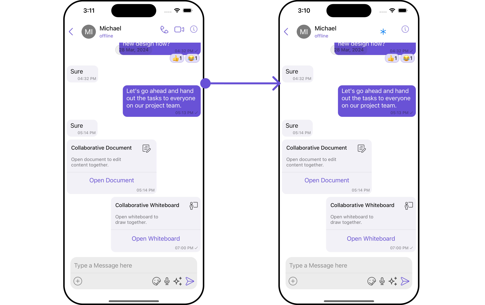
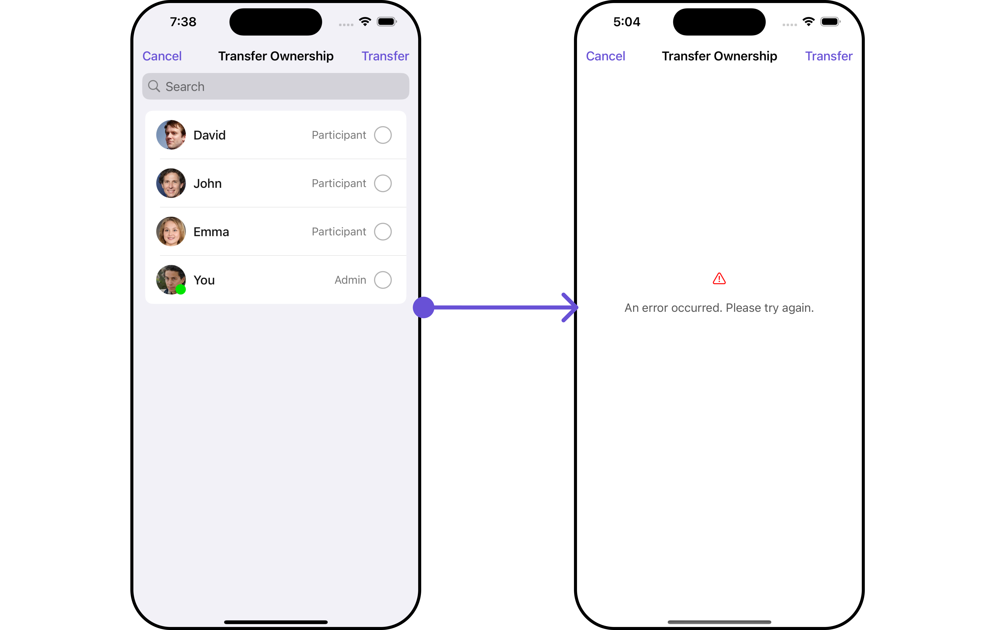
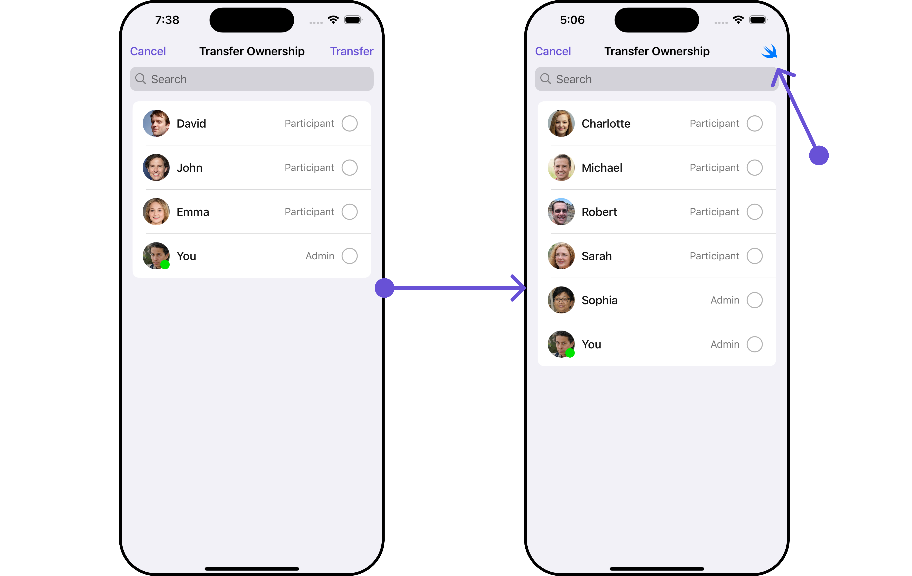

import Tabs from '@theme/Tabs';
import TabItem from '@theme/TabItem';

## Overview

`CometChatTransferOwnership` is a [Component](/ui-kit/ios/components-overview#components) that allows the current owner or administrator of a group to transfer the ownership rights and administrative control of that group to another user. By transferring ownership, the original owner can designate a new user as the group owner, giving them full control and administrative privileges over the group.

Here are some key points regarding the transfer ownership feature in CometChat:

1. **Administrative Control**: The current owner or administrator of the group has the authority to initiate the transfer of ownership. This feature is typically available to ensure flexibility and allow smooth transitions of group ownership.
2. **New Group Owner**: During the transfer process, the current owner can select a specific user from the group members to become the new owner. This new owner will then assume the responsibilities and privileges associated with being the group owner.
3. **Administrative Privileges**: As the new owner, the designated user will gain full administrative control over the group. They will have the ability to manage group settings, add or remove members, moderate conversations, and perform other administrative actions.
4. **Group Continuity**: Transferring ownership does not disrupt the existing group or its content. The transfer ensures the continuity of the group while transferring the administrative control to a new owner.


<!--  -->

The Transfer Ownership component is composed of the following BaseComponents:

| Components                                         | Description                                                                                                                                                                                                                                                                                 |
| -------------------------------------------------- | ------------------------------------------------------------------------------------------------------------------------------------------------------------------------------------------------------------------------------------------------------------------------------------------- |
| [CometchatGroupMembers](/ui-kit/ios/group-members) | `CometChatGroupMembers` is an independent component designed to create a user-friendly screen for browsing and managing group members. Users can effortlessly search for specific members and take actions such as kicking, banning, or changing member scopes directly from the interface. |
| [CometChatListItem](/ui-kit/ios/list-item)         | This component renders information extracted from a `User` object onto a tile, featuring a title, subtitle, leading view, and trailing view.                                                                                                                                                |

---

## Usage

### Integration

`CometChatTransferOwnership`, as a custom **view controller**, offers flexible integration options, allowing it to be launched directly via button clicks or any user-triggered action. Additionally, it seamlessly integrates into tab view controllers. With banned members, users gain access to a wide range of parameters and methods for effortless customization of its user interface.

The following code snippet exemplifies how you can seamlessly integrate the TransferOwnership component into your application.

<Tabs>
<TabItem value="swift" label="Swift">

```swift
let group =  Group(guid: "your UID", name: "", groupType: .public, password: .none)
let cometChatTransferOwnership = CometChatTransferOwnership(group: group)
let naviVC = UINavigationController(rootViewController: cometChatTransferOwnership)
self.present(naviVC, animated: true)

```

</TabItem>

</Tabs>

:::info
If you are already using a navigation controller, you can use the pushViewController function instead of presenting the view controller.
:::

---

### Actions

[Actions](/ui-kit/ios/components-overview#actions) dictate how a component functions. They are divided into two types: Predefined and User-defined. You can override either type, allowing you to tailor the behavior of the component to fit your specific needs.

##### 1. SetOnTransferOwnership

The `setOnTransferOwnership` action is activated when you select a group member and click on the transfer ownership submit button. you have the flexibility to override this event and tailor it to suit your needs using the following code snippet.

<Tabs>

<TabItem value="swift" label="Swift">
    ```swift
let group = Group(guid: "your-uid", name: "", groupType: .public, password: .none)

let cometChatTransferOwnership = CometChatTransferOwnership(group: group)
.setOnTransferOwnership { group, groupMember in
//Perform Your Action

}

````
</TabItem>

</Tabs>

##### 2. SetOnItemClick

This method proves valuable when users seek to override onItemClick functionality within CometChatTransferOwnership, empowering them with greater control and customization options.

The `setOnItemClick` action doesn't have a predefined behavior. You can override this action using the following code snippet.

<Tabs>

<TabItem value="swift" label="Swift">
    ```swift
let group =  Group(guid: "your UID", name: "", groupType: .public, password: .none)
let cometChatTransferOwnership = CometChatTransferOwnership(group: group)
    .setOnItemClick { groupMember, indexPath in
    //Perform Your Action

}
````

</TabItem>

</Tabs>

##### 3. SetOnItemLongClick

This method becomes invaluable when users seek to override long-click functionality within CometChatTransferOwnership, offering them enhanced control and flexibility in their interactions.

The `setOnItemLongClick` action doesn't have a predefined behavior. You can override this action using the following code snippet.

<Tabs>

<TabItem value="swift" label="Swift">
    ```swift
let group =  Group(guid: "your UID", name: "", groupType: .public, password: .none)
let cometChatTransferOwnership = CometChatTransferOwnership(group: group)
    .setOnItemLongClick { groupMember, indexPath in
    //Perform Your Action

}

````
</TabItem>

</Tabs>

##### 4. SetOnError

You can customize this behavior by using the provided code snippet to override the `On Error` and improve error handling.

<Tabs>

<TabItem value="swift" label="Swift">
```swift title=""
let group =  Group(guid: "your UID", name: "", groupType: .public, password: .none)
let cometChatTransferOwnership = CometChatTransferOwnership(group: group)
    .setOnError { error in
    //Perform Your Action

}

````

</TabItem>

</Tabs>

##### 5. SetOnBack

Enhance your application's functionality by leveraging the `SetOnBack` feature. This capability allows you to customize the behavior associated with navigating back within your app. Utilize the provided code snippet to override default behaviors and tailor the user experience according to your specific requirements.

<Tabs>

<TabItem value="swift" label="Swift">
```swift title=""
let group =  Group(guid: "your UID", name: "", groupType: .public, password: .none)
let cometChatTransferOwnership = CometChatTransferOwnership(group: group)
    .setOnBack {
    //Perform Your Action

}

````

</TabItem>

</Tabs>

---

### Filters

**Filters** allow you to customize the data displayed in a list within a Component. You can filter the list based on your specific criteria, allowing for a more customized. Filters can be applied using RequestBuilders of Chat SDK.

##### 1. GroupMembersRequestBuilder

The [GroupMembersRequestBuilder](/sdk/ios/retrieve-group-members) enables you to filter and customize the group members list based on available parameters in GroupMembersRequestBuilder. This feature allows you to create more specific and targeted queries when fetching groups. The following are the parameters available in [GroupMembersRequestBuilder](/sdk/ios/retrieve-group-members)

| Methods              | Type     | Description                                                                                        |
| -------------------- | -------- | -------------------------------------------------------------------------------------------------- |
| **setLimit**         | Int      | sets the number of banned members that can be fetched in a single request, suitable for pagination |
| **setSearchKeyword** | String   | used for fetching banned members matching the passed string                                        |
| **setScope**         | [String] | used for fetching group members based on multiple scopes                                           |

**Example**

In the example below, we are applying a filter to the Group Members by setting the limit to 1 and setting the scope to show only admin.


<Tabs>
<TabItem value="swift" label="Swift">

```swift title=''
let group =  Group(guid: "Your-uid", name: "", groupType: .public, password: .none)

let groupMembersRequestBuilder =  GroupMembersRequest.GroupMembersRequestBuilder(guid: group.guid).set(scopes: ["admin"]).set(limit: 1)

let cometChatTransferOwnership = CometChatTransferOwnership(group: group, groupMembersRequestBuilder: groupMembersRequestBuilder)

let naviVC = UINavigationController(rootViewController: cometChatTransferOwnership)
self.present(naviVC, animated: true)
```

</TabItem>

</Tabs>

##### 2. SearchRequestBuilder

The SearchRequestBuilder uses [GroupMembersRequestBuilder](/sdk/ios/retrieve-group-members) enables you to filter and customize the search list based on available parameters in GroupMembersRequestBuilder.
This feature allows you to keep uniformity between the displayed Group Members List and searched Group Members List.

**Example**

<Tabs>
<TabItem value="swift" label="Swift">

```swift title=''
let group =  Group(guid: "Your-uid", name: "", groupType: .public, password: .none)

let groupMembersRequestBuilder =  GroupMembersRequest.GroupMembersRequestBuilder(guid: group.guid).set(scopes: ["admin"]).set(limit: 2).set(searchKeyword: "")

let cometChatTransferOwnership = CometChatTransferOwnership(group: group, groupMembersRequestBuilder: groupMembersRequestBuilder)

let naviVC = UINavigationController(rootViewController: cometChatTransferOwnership)
self.present(naviVC, animated: true)
```

</TabItem>

</Tabs>

---

### Events

[Events](/ui-kit/ios/components-overview#events) are emitted by a `Component`. By using event you can extend existing functionality. Being global events, they can be applied in Multiple Locations and are capable of being Added or Removed.

Events emitted by the Join Group component is as follows.

| Event                 | Description                                                           |
| --------------------- | --------------------------------------------------------------------- |
| **onOwnershipChange** | Triggers when the ownership of a group member is changed successfully |

<Tabs>

<TabItem value="swift" label="Add Listener">

```swift
// View controller from your project where you want to listen events.
public class ViewController: UIViewController {

   public override func viewDidLoad() {
        super.viewDidLoad()

       // Subscribing for the listener to listen events from user module
         CometChatGroupEvents.addListener("UNIQUE_ID", self as CometChatGroupEventListener)
    }
}
 // Listener events from groups module
extension  ViewController: CometChatGroupEventListener {

 public func onOwnershipChange(group: Group?, member: GroupMember?) {
        // Do Stuff
    }

}
```

<TabItem value="swift" label="">

```swift title='Emitting Group Events'
///emit this when ownership is changed by logged in user.
CometChatGroupEvents.emitOnGroupMemberChangeScope(updatedBy: User , updatedUser: User , scopeChangedTo: CometChat.MemberScope , scopeChangedFrom: CometChat.MemberScope, group: Group)
```

</TabItem>

</TabItem>

</Tabs>

---

<Tabs>

<TabItem value="swift" label="Remove Listener">

```swift title='View Controller'
public override func viewWillDisappear(_ animated: Bool) {
    // Uncubscribing for the listener to listen events from user module
CometChatGroupEvents.removeListener("LISTENER_ID_USED_FOR_ADDING_THIS_LISTENER")
}
```

</TabItem>

</Tabs>

---

## Customization

To fit your app's design requirements, you can customize the appearance of the Transfer Ownership component. We provide exposed methods that allow you to modify the experience and behavior according to your specific needs.

### Style

Using **Style** you can **customize** the look and feel of the component in your app, These parameters typically control elements such as the **color**, **size**, **shape**, and **fonts** used within the component.

##### 1. TransferOwnership Style

You can set the TransferOwnershipStyle to the Transfer Ownership Component to customize the styling.

<Tabs>
<TabItem value="swift" label="Swift">

```swift title=''
// Creating  TransferOwnershipStyle object
let transferOwnershipStyle = TransferOwnershipStyle()

// Creating  Modifying the propeties of conversations
transferOwnershipStyle.set(background: .purple)
.set(cornerRadius: CometChatCornerStyle(cornerRadius: 0.0))
.set(borderColor: .red)
.set(borderWidth: 2)
.set(largeTitleFont: .boldSystemFont(ofSize: 34))
.set(titleFont: .systemFont(ofSize: 18))
.set(titleColor: .blue)
.set(backIconTint: .orange) //Icon
.set(searchIconTint: .blue)
.set(searchTextFont: .systemFont(ofSize: 16))
.set(searchTextColor: .blue)
.set(searchPlaceholderFont: .systemFont(ofSize: 16))
.set(searchPlaceholderColor: .systemFill)
.set(transferButtonFont: .systemFont(ofSize: 16))
.set(transferButtonTint: .cyan)

let cometChatTransferOwnership = CometChatTransferOwnership(group: group)
.set(transferOwnerShipStyle: transferOwnershipStyle)

```

</TabItem>

</Tabs>

List of properties exposed by GroupMemberStyle

| Property                   | Description                          | Code                                      |
| -------------------------- | ------------------------------------ | ----------------------------------------- |
| **Background**             | Sets the background color for        | `set(background: UIColor)`                |
| **CornerRadius**           | Sets the corner radius for           | `set(cornerRadius: CometChatCornerStyle)` |
| **BorderWidth**            | Sets the border width for            | `set(borderWidth: CGFloat)`               |
| **TitleColor**             | Sets the title color for             | `set(titleColor: UIColor)`                |
| **TitleFont**              | Sets the title font for              | `set(titleFont: UIFont)`                  |
| **LargeTitleFont**         | Sets the large title font for        | `set(largeTitleFont: UIFont)`             |
| **BackIconTint**           | Sets the back button tint color for  | `set(backIconTint: UIColor)`              |
| **SearchIconTint**         | Sets the search icon tint color      | `set(searchIconTint: UIColor)`            |
| **SearchTextFont**         | Sets the search text font            | `set(searchTextFont: UIFont)`             |
| **SearchTextColor**        | Sets the search text color           | `set(searchTextColor: UIColor)`           |
| **SearchCancelButtonTint** | Sets the search cancel icon tint     | `set(searchCancelButtonTint: UIColor)`    |
| **SearchPlaceholderFont**  | Sets the search placeholder font for | `set(searchPlaceholderFont: UIFont)`      |
| **SearchPlaceholderColor** | Sets the search placeholder color    | `set(searchPlaceholderColor: UIColor)`    |
| **TransferButtonFont**     | Sets transfer button color           | `set(addButtonTint: UIColor)`             |
| **transferButtonTint**     | Sets transfer button font            | `set(addButtonFont: UIFont)`              |

##### 2. Avatar Style

To apply customized styles to the `Avatar` component in the Transfer ownership Component, you can use the following code snippet. For further insights on `Avatar` Styles [refer](/ui-kit/ios/avatar)

<Tabs>
<TabItem value="swift" label="Swift">

```swift title='Swift'
// Creating  AvatarStyle object
let avatarStyle = AvatarStyle()

// Creating  Modifying the propeties of avatar
avatarStyle.set(background: .red)
.set(textFont: .systemFont(ofSize: 18))
.set(textColor: .blue)
.set(cornerRadius: CometChatCornerStyle(cornerRadius: 8.0))
.set(borderColor: .green)
.set(borderWidth: 5)
.set(outerViewWidth: 3)
.set(outerViewSpacing: 3)

let cometChatTransferOwnership = CometChatTransferOwnership(group: group)
.set(avatarStyle: avatarStyle)

```

</TabItem>

</Tabs>

##### 3. StatusIndicator Style

To apply customized styles to the Status Indicator component in the Transfer ownership Component, You can use the following code snippet. For further insights on Status Indicator Styles [refer](/ui-kit/ios/status-indicator)

<Tabs>

<TabItem value="swift" label="Swift">

```swift
// Creating  StatusIndicatorStyle object
let statusIndicatorStyle = StatusIndicatorStyle()

// Creating  Modifying the propeties of avatar
statusIndicatorStyle.set(background: .red)
.set(borderColor: .systemOrange)
.set(borderWidth: 2)

let cometChatTransferOwnership = CometChatTransferOwnership(group: group)
.set(statusIndicatorStyle: statusIndicatorStyle)
```

</TabItem>

</Tabs>

##### 4. ListItem Style

To apply customized styles to the `ListItemStyle` component in the `Transfer ownership` Component, you can use the following code snippet. For further insights on `ListItemStyle` Styles [refer](/ui-kit/ios/list-item)


<Tabs>

<TabItem value="swift" label="Swift">

```swift
// Creating  ListItemStyle object
let listItemStyle = ListItemStyle()

listItemStyle.set(background: .init(red: 0.81, green: 0.64, blue: 0.96, alpha: 1.00))
.set(titleFont: .systemFont(ofSize: 18))
.set(titleColor: .init(red: 0.47, green: 0.02, blue: 0.93, alpha: 1.00))
.set(cornerRadius: CometChatCornerStyle(cornerRadius: 8.0))
.set(borderColor: .black)
.set(borderWidth: 3)

let cometChatTransferOwnership = CometChatTransferOwnership(group: group)
.set(listItemStyle: listItemStyle)
```

</TabItem>

</Tabs>

##### 5. GroupMembers Style

You can set the `GroupMembersStyle` to the Transfer Ownership Component to customize the styling, you can use the following code snippet. For further insights on `GroupMembers` Styles [refer](/ui-kit/ios/group-members)

<Tabs>

<TabItem value="swift" label="Swift">

```swift
// Creating  GroupMembersStyle object
let groupMembersStyle = GroupMembersStyle()

// Creating  Modifying the propeties of conversations
groupMembersStyle.set(background: .blue)
.set(cornerRadius: CometChatCornerStyle(cornerRadius: 0.0))
.set(borderColor: .cyan)
.set(borderWidth: 3)
.set(largeTitleFont: .boldSystemFont(ofSize: 34))
.set(titleFont: .systemFont(ofSize: 18))
.set(titleColor: .systemOrange)
.set(searchIconTint: .brown)
.set(searchTextFont: .systemFont(ofSize: 16))
.set(searchTextColor: .red)
.set(searchPlaceholderFont: .systemFont(ofSize: 16))
.set(searchPlaceholderColor: .green)

let cometChatTransferOwnership = CometChatTransferOwnership(group: group)
.set(groupMembersStyle: groupMembersStyle)
```

</TabItem>

</Tabs>

---

### Functionality

These are a set of small functional customizations that allow you to fine-tune the overall experience of the component. With these, you can change text, set custom icons, and toggle the visibility of UI elements.

<Tabs>
<TabItem value="swift" label="Swift">

```swift
let group =  Group(guid: "your UID", name: "", groupType: .public, password: .none)

let cometChatTransferOwnership = CometChatTransferOwnership(group: group)
    .set(title: "Cc", mode: .automatic)
    .hide(separator: true)
    .disable(usersPresence: true)
```

</TabItem>
</Tabs>

<!-- Default: -->
<!--  -->

<!-- Custom: -->
<!--  -->

Below is a list of customizations along with corresponding code snippets

| Property                                                                                                 | Description                                                                         | Code                                                                |
| -------------------------------------------------------------------------------------------------------- | ----------------------------------------------------------------------------------- | ------------------------------------------------------------------- |
| **Title** <a data-tooltip-id="my-tooltip-html-prop"> <span class="material-icons red">report</span> </a> | Custom title for the component                                                      | `.set(title: String, mode: UINavigationItem.LargeTitleDisplayMode)` |
| **BackButtonTitle**                                                                                      | Custom text for the back button                                                     | `.set(backButtonTitle: String?)`                                    |
| **SearchPlaceholderText**                                                                                | Custom placeholder text for search field                                            | `.set(searchPlaceholder: String)`                                   |
| **ShowBackButton**                                                                                       | Whether to hide the back button                                                     | `.show(backButton: Bool)`                                           |
| **ErrorStateText**                                                                                       | Custom error state text                                                             | `.set(errorStateText: String)`                                      |
| **BackButtonIcon**                                                                                       | Custom back button icon                                                             | `.set(backButtonIcon: UIImage)`                                     |
| **HideAddButton**                                                                                        | Whether to hide the add button                                                      | `.hide(addButton: Bool)`                                            |
| **SearchPlaceholder**                                                                                    | Set the placeholder for search bar                                                  | `set(searchPlaceholder: String)`                                    |
| **SearchIcon**                                                                                           | Sets the icon for the search bar                                                    | `set(searchIcon:UIImage)`                                           |
| **SearchClearIcon**                                                                                      | Sets the clear icon for the search bar                                              | `set(searchClearIcon:UIImage)`                                      |
| **SearchBarHeight**                                                                                      | Set the height for the search bar                                                   | `set(searchBarHeight: CGFloat)`                                     |
| **HideSearch**                                                                                           | Hide / unhide the search bar as per boolean value                                   | `hide(search: Bool)`                                                |
| **SelectionMode**                                                                                        | This enables a selection, it has three modes: .single, .multiple                    | `selectionMode(mode: SelectionMode)`                                |
| **HideSeparator**                                                                                        | This method will hide the separator                                                 | `hide(separator: Bool)`                                             |
| **DisableUserPresence**                                                                                  | This method disables user's online/offline status                                   | `disable(userPresence: Bool)`                                       |
| **UpdateGroupMember**                                                                                    | This method specifies the option to update member object locally                    | `update(groupMember: GroupMember)`                                  |
| **RemoveGroupMember**                                                                                    | This method specifies the option to remove member object locally                    | `remove(groupMember: GroupMember)`                                  |
| **AddGroupMember**                                                                                       | This method specifies the option to add member object locally                       | `add(groupMember: GroupMember)`                                     |
| **InsertGroupMember**                                                                                    | This method specifies the option to add member object locally at specified location | `insert(groupMember: GroupMember, at: Int)`                         |
| **ClearList**                                                                                            | This method will clear the users locally                                            | `clearList()`                                                       |
| **GetSize**                                                                                              | This method specifies the count of members displayed                                | `size()`                                                            |

:::tip
Ensure to include your GUID and the name of your group when configuring group settings.
:::

---

### Advance

For advanced-level customization, you can set custom views to the component. This lets you tailor each aspect of the component to fit your exact needs and application aesthetics. You can create and define your views, layouts, and UI elements and then incorporate those into the component.

#### ListItemView

Utilize this property to assign a custom ListItem to the TransferOwnership Component, allowing for enhanced customization and flexibility in its rendering.

<Tabs>

<TabItem value="swift" label="Swift">

```swift
let group =  Group(guid: "your-uid", name: "", groupType: .public, password: .none)
let cometChatTransferOwnership = CometChatTransferOwnership(group: group)
    .setListItemView { groupMember in
    //Perform Your Action

}
```

</TabItem>

</Tabs>

**Example**


<!--  -->

In this example, we will create a UIView file `CustomListItemGroupView` and pass it inside the `setListItemView()` method.

```swift title="CustomListItemGroupView"
import UIKit
import CometChatSDK
import CometChatUIKitSwift

class CustomListItemGroupView: UIView {
    // Initialize your subviews
    let titleLabel: UILabel = {
        let label = UILabel()
        label.translatesAutoresizingMaskIntoConstraints = false
        label.font = UIFont.boldSystemFont(ofSize: 16)
        return label
    }()

    let statusIndicator: UIView = {
        let view = UIView()
        view.translatesAutoresizingMaskIntoConstraints = false
        view.backgroundColor = .systemRed
        view.layer.cornerRadius = 5
        return view
    }()

    let groupImageView: CometChatAvatar = {
        let imageView = CometChatAvatar(frame: .zero)
        imageView.translatesAutoresizingMaskIntoConstraints = false
        return imageView
    }()

    // Override the initializer
    override init(frame: CGRect) {
        super.init(frame: frame)
        // Add subviews and layout constraints
        addSubview(groupImageView)
        addSubview(titleLabel)
        addSubview(statusIndicator)

        NSLayoutConstraint.activate([
            groupImageView.leadingAnchor.constraint(equalTo: leadingAnchor, constant: 8),
            groupImageView.centerYAnchor.constraint(equalTo: centerYAnchor),
            groupImageView.heightAnchor.constraint(equalToConstant: 40),
            groupImageView.widthAnchor.constraint(equalToConstant: 40),

            titleLabel.centerYAnchor.constraint(equalTo: centerYAnchor),
            titleLabel.leadingAnchor.constraint(equalTo: groupImageView.trailingAnchor, constant: 8),
            titleLabel.trailingAnchor.constraint(equalTo: trailingAnchor, constant: -8),

            statusIndicator.widthAnchor.constraint(equalToConstant: 10),
            statusIndicator.heightAnchor.constraint(equalToConstant: 10),
            statusIndicator.trailingAnchor.constraint(equalTo: titleLabel.trailingAnchor),
            statusIndicator.bottomAnchor.constraint(equalTo: titleLabel.bottomAnchor)
        ])
    }

    required init?(coder: NSCoder) {
        fatalError("init(coder:) has not been implemented")
    }


    func configure(with user: User) {
        titleLabel.text = user.name
        if let avatarUrl = user.avatar {
            groupImageView.setAvatar(avatarUrl: avatarUrl, with: user.name ?? "")
        } else {
            // handle when avatar is nil
        }
    }
}
```

<Tabs>

<TabItem value="swift" label="Swift">

```swift
let group = Group(guid: "your-uid", name: "", groupType: .public, password: .none)

let cometChatTransferOwnership = CometChatTransferOwnership(group: group)
    .setListItemView { user in
        let customListItemGroupView = CustomListItemGroupView()
        customListItemGroupView.configure(with: user!)
        return customListItemGroupView
}
```

</TabItem>

</Tabs>

:::info
Ensure to pass and present `CometChatTransferOwnership`. If a navigation controller is already in use, utilize the pushViewController function instead of directly presenting the view controller.
:::

---

#### SubtitleView

You can set your custom Subtitle view using the `.setSubtitleView()` method. But keep in mind, by using this you will override the default Subtitle view functionality.

<Tabs>

<TabItem value="swift" label="Swift">

```swift
let group =  Group(guid: "your-uid", name: "", groupType: .public, password: .none)
let cometChatTransferOwnership = CometChatTransferOwnership(group: group)
    .setSubtitleView { groupMember in
    //Perform Your Action

}
```

</TabItem>

</Tabs>
- You can customize the subtitle view for each TransferOwnership item to meet your requirements

**Example**


<!--  -->

In this example, we will create a `Custom_Subtitle_GroupMember_View`a UIView file.

```swift title="Custom_Subtitle_GroupMember_View"
import UIKit
import CometChatSDK
import CometChatUIKitSwift

class CustomSubtitleGroupMemberView: UIView {

    let memberNameLabel: UILabel = {
        let label = UILabel()
        label.translatesAutoresizingMaskIntoConstraints = false
        label.textColor = .init(red: 0.42, green: 0.01, blue: 0.84, alpha: 1.00)
        label.font = UIFont.systemFont(ofSize: 10, weight: .medium)
        return label
    }()

    let joinedAtLabel: UILabel = {
        let label = UILabel()
        label.translatesAutoresizingMaskIntoConstraints = false
        label.textColor = .systemBrown
        label.font = UIFont.systemFont(ofSize: 10, weight: .medium)
        return label
    }()

    override init(frame: CGRect) {
        super.init(frame: frame)
        addSubview(memberNameLabel)
        addSubview(joinedAtLabel)

        NSLayoutConstraint.activate([
            memberNameLabel.topAnchor.constraint(equalTo: topAnchor),
            memberNameLabel.leadingAnchor.constraint(equalTo: leadingAnchor),
            memberNameLabel.trailingAnchor.constraint(equalTo: trailingAnchor),

            joinedAtLabel.topAnchor.constraint(equalTo: memberNameLabel.bottomAnchor, constant: 2),
            joinedAtLabel.leadingAnchor.constraint(equalTo: leadingAnchor),
            joinedAtLabel.trailingAnchor.constraint(equalTo: trailingAnchor),
            joinedAtLabel.bottomAnchor.constraint(equalTo: bottomAnchor)
        ])
    }

    required init?(coder: NSCoder) {
        fatalError("init(coder:) has not been implemented")
    }


    func configure(with user: User) {
        memberNameLabel.text = "Member: \(user.name ?? "")"

    }
}
```

<!-- Make modifications to the code based on your specific needs and preferences. -->

We will be passing a custom subtitle view to CometChatTransferOwnership, ensuring a tailored and user-friendly interface.

<Tabs>

<TabItem value="swift" label="Swift">
```swift
let group = Group(guid: "your-uid", name: "", groupType: .public, password: .none)
let cometChatTransferOwnership = CometChatTransferOwnership(group: group)
    .setSubtitleView { user in
        let customSubtitleGroupMemberView = CustomSubtitleGroupMemberView()
        customSubtitleGroupMemberView.configure(with: user!)
        return customSubtitleGroupMemberView
}
````

</TabItem>

</Tabs>

:::info
Ensure to pass and present `CometChatTransferOwnership`. If a navigation controller is already in use, utilize the pushViewController function instead of directly presenting the view controller.
:::

---

#### EmptyView <a data-tooltip-id="my-tooltip-html-prop"> <span class="material-icons red">report</span> </a>

You can set a custom EmptyView using `.set(emptyView: UIView)` to match the empty view of your app.

<Tabs>

<TabItem value="swift" label="swift">
```swift
let group = Group(guid: "your-uid", name: "", groupType: .public, password: .none)
let cometChatTransferOwnership = CometChatTransferOwnership(group: group)
    .set(emptyView: UIView)
 
````

</TabItem>

</Tabs>

**Example**

<!--  -->

In this example, we will create a `Custom_Empty_State_GroupView`a UIView file.

```swift
import UIKit

class CustomEmptyStateGroupView: UIView {
    // Initialize your subviews
    let imageView: UIImageView = {
        let imageView = UIImageView(image: UIImage(named: "noDataImage"))
        imageView.translatesAutoresizingMaskIntoConstraints = false
        return imageView
    }()

    let messageLabel: UILabel = {
        let label = UILabel()
        label.text = "No groups available"
        label.translatesAutoresizingMaskIntoConstraints = false
        label.font = UIFont.boldSystemFont(ofSize: 16)
        label.textColor = .black
        return label
    }()

    // Override the initializer
    override init(frame: CGRect) {
        super.init(frame: frame)
        // Add subviews and layout constraints
        addSubview(imageView)
        addSubview(messageLabel)
        NSLayoutConstraint.activate([
            imageView.centerXAnchor.constraint(equalTo: centerXAnchor),
            imageView.centerYAnchor.constraint(equalTo: centerYAnchor),
            imageView.heightAnchor.constraint(equalToConstant: 120),
            imageView.widthAnchor.constraint(equalToConstant: 120),

            messageLabel.topAnchor.constraint(equalTo: imageView.bottomAnchor, constant: 8),
            messageLabel.centerXAnchor.constraint(equalTo: centerXAnchor)
        ])
    }

    required init?(coder: NSCoder) {
        fatalError("init(coder:) has not been implemented")
    }
}
```

We will be passing a custom empty view to CometChatTransferOwnership, ensuring a tailored and user-friendly interface.

<Tabs>

<TabItem value="swift" label="Swift">
```swift
let group = Group(guid: "your-uid", name: "", groupType: .public, password: .none)

let groupMembersRequestBuilder = GroupMembersRequest.GroupMembersRequestBuilder(guid: group.guid).set(limit: 1000)

let customEmptyStateGroupView = CustomEmptyStateGroupView()

let cometChatTransferOwnership = CometChatTransferOwnership(group: group, groupMembersRequestBuilder: groupMembersRequestBuilder)
.set(emptyView: customEmptyStateGroupView)

````
</TabItem>


</Tabs>

:::info
Ensure to pass and present `CometChatTransferOwnership`. If a navigation controller is already in use, utilize the pushViewController function instead of directly presenting the view controller.
:::

---
#### ErrorView

You can set a custom ErrorView using `.set(errorView: UIView)` to match the error view of your app.


<Tabs>

<TabItem value="swift" label="Swift">

```swift
let group =  Group(guid: "your-uid", name: "", groupType: .public, password: .none)
let cometChatTransferOwnership = CometChatTransferOwnership(group: group)
.set(errorView: UIView)

```

</TabItem>

</Tabs>

**Example**


<!--  -->

In this example, we will create a UIView file `Custom_ErrorState_GroupView` and pass it inside the `.set(errorView: UIView)` method.

```swift title="Custom_ErrorState_GroupView"
import UIKit

let CustomErrorStateGroupView: UIView = {
        // Create main view
        let view = UIView()
        view.backgroundColor = .white

        // Create an imageView and add it to the main view
        let imageView = UIImageView(image: UIImage(systemName: "exclamationmark.triangle"))
        imageView.tintColor = .red
        imageView.translatesAutoresizingMaskIntoConstraints = false
        view.addSubview(imageView)

        // Create a label with error message and add it to the main view
        let label = UILabel()
        label.text = "An error occurred. Please try again."
        label.font = UIFont.systemFont(ofSize: 16)
        label.textColor = .darkGray
        label.numberOfLines = 0
        label.textAlignment = .center
        label.translatesAutoresizingMaskIntoConstraints = false
        view.addSubview(label)

        // Create constraints for imageView and label
        NSLayoutConstraint.activate([
            imageView.centerXAnchor.constraint(equalTo: view.centerXAnchor),
            imageView.centerYAnchor.constraint(equalTo: view.centerYAnchor, constant: -50),

            label.topAnchor.constraint(equalTo: imageView.bottomAnchor, constant: 20),
            label.leadingAnchor.constraint(equalTo: view.leadingAnchor, constant: 20),
            label.trailingAnchor.constraint(equalTo: view.trailingAnchor, constant: -20)
        ])

        return view
    }()
```

<Tabs>

<TabItem value="swift" label="Swift">

```swift
let group = Group(guid: "your-uid", name: "", groupType: .public, password: .none)

let groupMembersRequestBuilder =  GroupMembersRequest.GroupMembersRequestBuilder(guid: group.guid).set(limit: 1000)
let customErrorStateGroupView = CustomErrorStateGroupView

let cometChatTransferOwnership = CometChatTransferOwnership(group: group, groupMembersRequestBuilder: groupMembersRequestBuilder)
.set(errorView: customErrorStateGroupView)
```

</TabItem>

</Tabs>

:::info
Ensure to pass and present `CometChatTransferOwnership`. If a navigation controller is already in use, utilize the pushViewController function instead of directly presenting the view controller.
:::

---

#### Menus


You can set the Custom Menus to add more options to the TransferOwnership component.


<Tabs>

<TabItem value="swift" label="Swift">

```swift
let group =  Group(guid: "your-uid", name: "", groupType: .public, password: .none)
let cometChatTransferOwnership = CometChatTransferOwnership(group: group)
.set(menus: [UIBarButtonItem])

```

</TabItem>

</Tabs>

- You can customize the menus for TransferOwnership to meet your requirements

**Example**


<!--  -->

In this example, we'll craft a custom button tailored for `CometChatTransferOwnership`, enhancing its interface with a personalized `menu` for a more user-friendly experience.


<Tabs>

<TabItem value="swift" label="Swift">
```swift
let customMenuButton: UIBarButtonItem = {
    let button = UIButton(type: .system)
    button.setImage(UIImage(systemName: "swift"), for: .normal)
    button.setTitle("", for: .normal)
    button.addTarget(self, action: #selector(handleCustomMenu), for: .touchUpInside)
    let barButtonItem = UIBarButtonItem(customView: button)
    return barButtonItem
}()
let cometChatTransferOwnership = CometChatTransferOwnership(group: group)
.set(menus: [customMenuButton])

````

</TabItem>

</Tabs>

:::info
Ensure to pass and present `CometChatTransferOwnership`. If a navigation controller is already in use, utilize the pushViewController function instead of directly presenting the view controller.
:::

---

#### Options

Enhance your TransferOwnership component by setting Custom Options to incorporate additional functionalities when swiping

<Tabs>

<TabItem value="swift" label="Swift">

```swift
let group = Group(guid: "your-uid", name: "", groupType: .public, password: .none)

let cometChatTransferOwnership = CometChatTransferOwnership(group: group)
    .setOptions { group, groupMember in
    //Perform Your Action

}
```

</TabItem>

</Tabs>

- You can customize the options for TransferOwnership to meet your requirements

**Example**


<!--  -->

In this example, we've enhanced the interface of `CometChatTransferOwnership` by introducing a tailored feature. By adding a custom option, such as "Delete" with a corresponding trash icon, users can now enjoy a more interactive and user-friendly experience.

<Tabs>

<TabItem value="swift" label="Swift">
```swift
let customOption = CometChatGroupMemberOption(id: "custom_option_1",
                                                      title: "Delete",
                                                      icon: UIImage(systemName: "trash.square"),
                                                      backgroundColor: .red,
                                                      onClick: { groupMember, group, section, option, controller in
                                                                print("Custom option clicked!")
})

let cometChatTransferOwnership = CometChatTransferOwnership(group: group)
.setOptions { group, groupMember in
return [customOption]
}

```
</TabItem>


</Tabs>

:::info
Ensure to pass and present `CometChatTransferOwnership`. If a navigation controller is already in use, utilize the pushViewController function instead of directly presenting the view controller.
:::

:::tip
Ensure to include your GUID and the name of your group when configuring group settings.
:::


---


import { Tooltip } from 'react-tooltip'
import 'react-tooltip/dist/react-tooltip.css'

<Tooltip
  id="my-tooltip-html-prop"
  html="Not available "
/>
```
