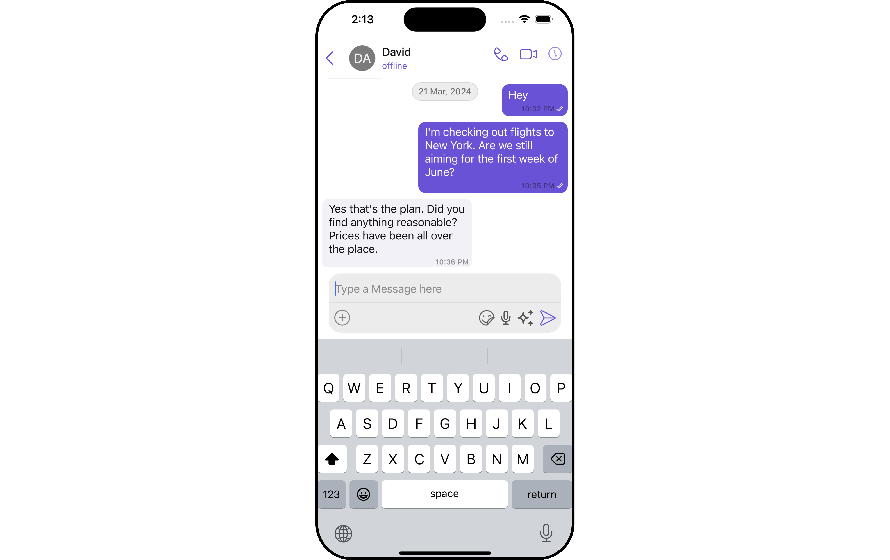
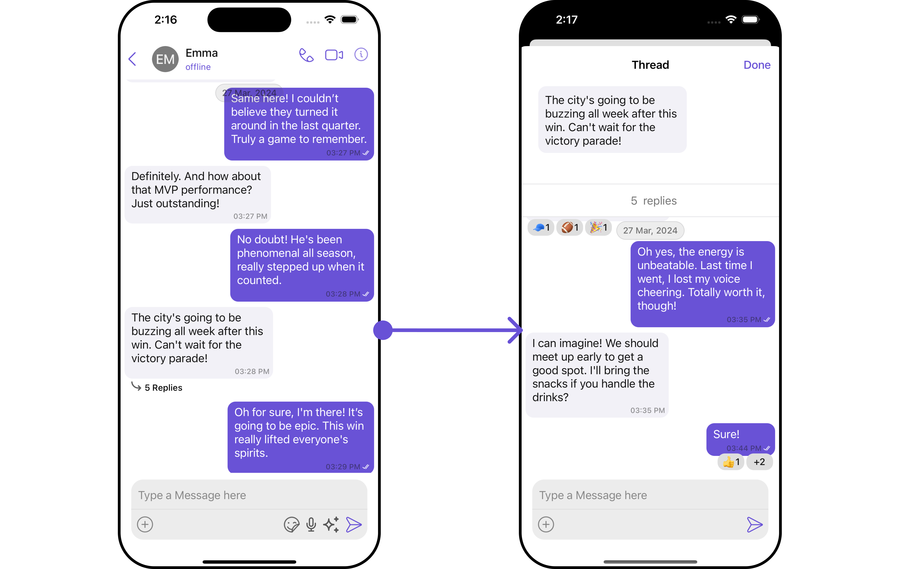
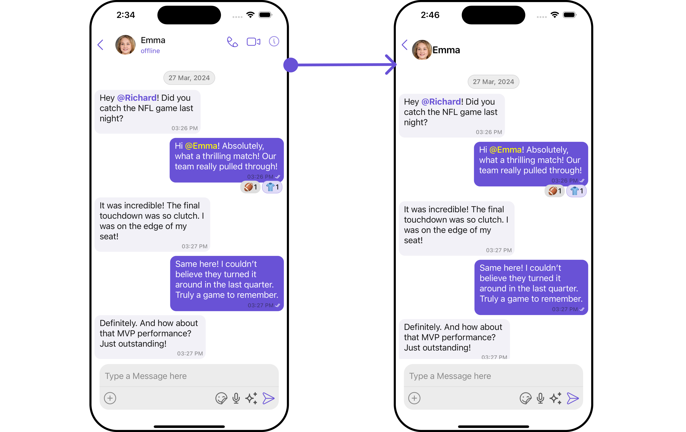
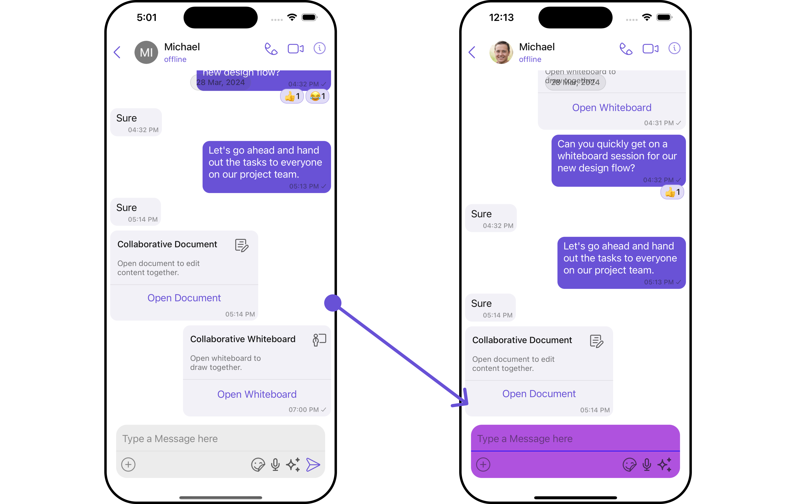
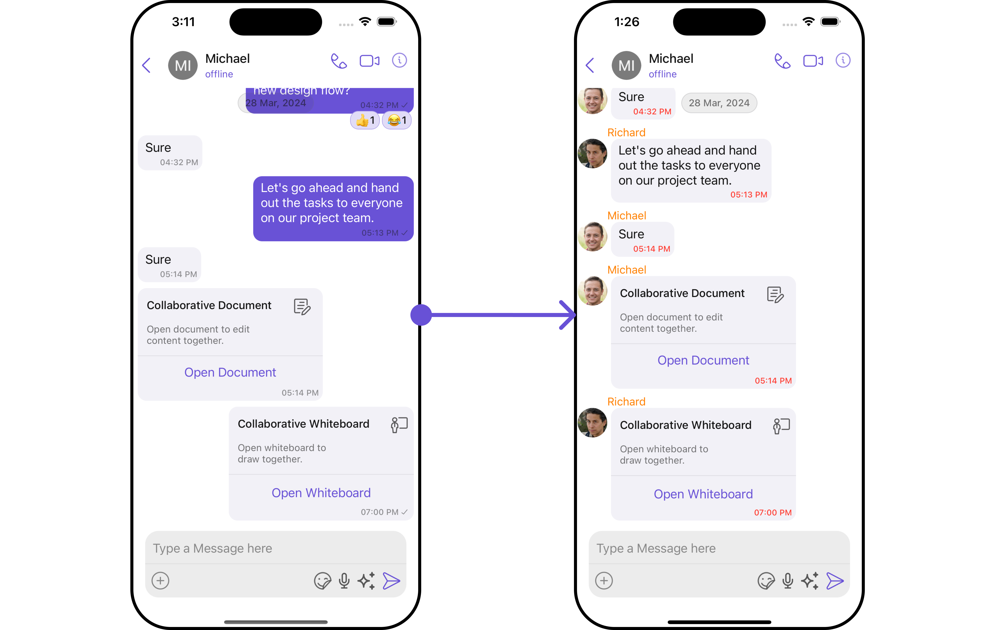
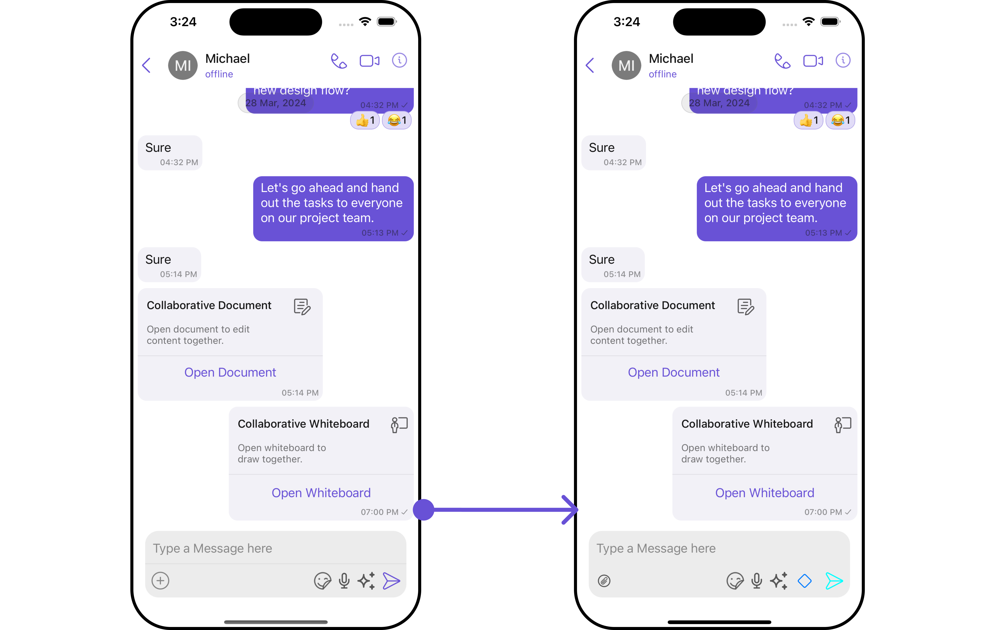
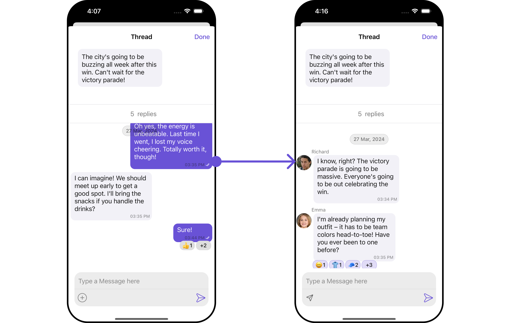

import Tabs from '@theme/Tabs';
import TabItem from '@theme/TabItem';

## Overview

The Messages is a Composite Component that manages messages for users and groups.

The Messages component is composed of three individual components, [MessageHeader](/ui-kit/ios/message-header), [MessageList](/ui-kit/ios/message-list), and [MessageComposer](/ui-kit/ios/message-composer). In addition, the Messages component also navigates to the [Details](/ui-kit/ios/group-details) and [ThreadedMessages](/ui-kit/ios/threaded-messages) components.

<!-- `CometChatMessages` displays the chat window either for `User` or `Group` entities, and shows the list of messages where the loggedInUser has sent and received from either of the entities. `CometChatMessages` wraps up the three main components in it such as `CometChatMessageHeader`, `CometChatMessageList` & `CometChatMessageComposer`. -->

<!--  -->

## 

`CometChatMessages` mainly contains below components in it.

| Components                                        | Description                                                                                                                                                                                              |
| ------------------------------------------------- | -------------------------------------------------------------------------------------------------------------------------------------------------------------------------------------------------------- |
| [MessageHeader](/ui-kit/ios/message-header)       | `CometChatMessageHeader` displays the `User` or `Group` information using CometChat SDK's `User` or `Group object.` It also shows the typing indicator when the user starts typing in `MessageComposer`. |
| [MessageList](/ui-kit/ios/message-list)           | `CometChatMessageList` is one of the core UI components. It displays a list of messages and handles real-time operations.                                                                                |
| [MessageComposer](/ui-kit/ios/message-composer)   | `CometChatMessageComposer` is an independent and critical component that allows users to compose and send various types of messages includes text, image, video and custom messages.                     |
| [Details](/ui-kit/ios/group-details)              | `CometChatDetails` is a component that displays all the available options available for `Users` & `Groups`                                                                                               |
| [ThreadedMessages](/ui-kit/ios/threaded-messages) | `CometChatThreadedMessages` is a component that displays all replies made to a particular message in a conversation.                                                                                     |

<!--  -->

---

## Usage

### Integration

The following code snippet illustrates how you can can launch CometChatMessages.

<Tabs>
<TabItem value="For User" label="For User">

```swift
let cometChatMessages = CometChatMessages()
cometChatMessages.set(user: User)
self.present(cometChatMessages, animated: true)
```

</TabItem>
<TabItem value="For Group" label="For Group">

```swift
let cometChatMessages = CometChatMessages()
cometChatMessages.set(group: group)
self.present(cometChatMessages, animated: true)
```

</TabItem>
</Tabs>

:::info
If you are already using a navigation controller, you can use the `pushViewController` function instead of presenting the view controller.
:::

### Actions

[Actions](/ui-kit/ios/components-overview#actions) dictate how a component functions. They are divided into two types: Predefined and User-defined. You can override either type, allowing you to tailor the behavior of the component to fit your specific needs.

The Messages component does not have its actions. However, since it's a [Composite Component](/ui-kit/ios/components-overview#components), you can use the actions of its components by utilizing the [Configurations](#configuration) object of each component.

**Example**

In this example, we are employing the [ThreadRepliesClick](/ui-kit/ios/message-list#1-onthreadrepliesclick) action from the MessageList Component through the MessageListConfiguration object.

<Tabs>

<TabItem value="swift" label="Swift">

```swift
let messageListConfiguration = MessageListConfiguration()
    .setOnThreadRepliesClick { message, messageBubbleView in
                // Perform your action
     }
let cometChatMessages = CometChatMessages()
    .set(user: user)
    .set(messageListConfiguration: messageListConfiguration)

```

</TabItem>

</Tabs>

---

<!--  -->



> The Messages Component overrides the [ThreadRepliesClick](/ui-kit/ios/message-list#1-onthreadrepliesclick) action to navigate to the [ThreadedMessages](/ui-kit/ios/threaded-messages) component. If you override `ThreadRepliesClick`, it will also override the default behavior of the Messages Component.

### Filters

**Filters** allow you to customize the data displayed in a list within a Component. You can filter the list based on your specific criteria, allowing for a more customized. Filters can be applied using RequestBuilders of Chat SDK.

The Messages component does not have its filters. But as it is a [Composite Component](/ui-kit/ios/components-overview#components), you can use the filters of its components by using the [Configurations](#configuration) object of each component. For more details on the filters of its components, please refer to [MessageList Filters](/ui-kit/ios/message-list#filters).

**Example**

In this example, we're applying the MessageList Component filter to the Messages Component using `MessageListConfiguration`.

<Tabs>

<TabItem value="swift" label="Swift">

```swift
 let messageRequestBuilder =  MessagesRequest.MessageRequestBuilder()
    .set(uid: "UID")
    .set(types: ["Text"])
    .set(searchKeyword: "sure")

let messageListConfiguration = MessageListConfiguration()
    .set(messagesRequestBuilder:messageRequestBuilder)

let cometChatMessages = CometChatMessages()
    .set(user: user)
    .set(messageListConfiguration: messageListConfiguration)
```

</TabItem>

<TabItem value="" label="">

```

```

</TabItem>

</Tabs>

### Events

[Events](/ui-kit/ios/components-overview#events) are emitted by a `Component`. By using event you can extend existing functionality. Being global events, they can be applied in Multiple Locations and are capable of being Added or Removed.

The list of events emitted by the Messages component is as follows.

| Event               | Description                                                                                                                       |
| ------------------- | --------------------------------------------------------------------------------------------------------------------------------- |
| **onMessageSent**   | Triggers whenever a loggedIn user sends any message, it will have two states such as: <br /><br />inProgress & sent               |
| **onMessageEdit**   | Triggers whenever a loggedIn user edits any message from the list of messages .it will have two states such as: inProgress & sent |
| **onMessageDelete** | Triggers whenever a loggedIn user deletes any message from the list of messages                                                   |
| **onMessageRead**   | Triggers whenever a loggedIn user reads any message.                                                                              |
| **onLiveReaction**  | Triggers whenever a loggedIn clicks on live reaction                                                                              |

Adding `CometChatMessageEvents` Listener's

<Tabs>
<TabItem value="swift" label="Swift">

```swift
// View controller from your project where you want to listen events.
public class ViewController: UIViewController {

   public override func viewDidLoad() {
        super.viewDidLoad()

       // Subscribing for the listener to listen events from message module
        CometChatMessageEvents.addListener("UNIQUE_ID", self as CometChatMessageEventListener)
    }

    public override func viewWillDisappear(_ animated: Bool) {
       // Uncubscribing for the listener to listen events from message module
        CometChatMessageEvents.removeListener("LISTENER_ID_USED_FOR_ADDING_THIS_LISTENER")
    }


}

 // Listener events from message module
extension  ViewController: CometChatMessageEventListener {

     func onMessageSent(message: BaseMessage, status: MessageStatus) {
        // Do Stuff
    }

    func onMessageEdit(message: BaseMessage, status: MessageStatus) {
        // Do Stuff
    }

    func onMessageDelete(message: BaseMessage, status: MessageStatus) {
        // Do Stuff
    }


    func onMessageRead(message: BaseMessage) {
         // Do Stuff
    }

    func onLiveReaction(reaction: TransientMessage) {
        // Do Stuff
    }
}

```

</TabItem>

</Tabs>

Removing `CometChatMessageEvents` Listener's
<Tabs>
<TabItem value="swift" label="Swift">

```swift
CometChatMessageEvents.removeListener("LISTENER_ID_USED_FOR_ADDING_THIS_LISTENER")

```

</TabItem>

</Tabs>

## Customization

To fit your app's design requirements, you can customize the appearance of the conversation component. We provide exposed methods that allow you to modify the experience and behavior according to your specific needs.

### Style

Using Style you can customize the look and feel of the component in your app, These parameters typically control elements such as the color, size, shape, and fonts used within the component.

1. ##### Messages Style

You can customize the appearance of the Messages Component by applying the MessagesStyle to it using the following code snippet.

<Tabs>

<TabItem value="swift" label="Swift">

```swift
// Creating  MessagesStyle object
let messagesStyle = MessagesStyle()

// Creating  Modifying the propeties of create group
messagesStyle.set(background: .black)
                .set(cornerRadius: CometChatCornerStyle(cornerRadius: 0.0))
                .set(borderColor: .clear)
                .set(borderWidth: 0)

// Setting the MessagesStyle
cometChatMessages.set(messagesStyle: messagesStyle)

```

</TabItem>

</Tabs>

List of properties exposed by MessagesStyle

| Property             | Description                      | Code                                       |
| -------------------- | -------------------------------- | ------------------------------------------ |
| **set Background**   | Used to set the background color | `.set(background: UIColor)	`                |
| **set BorderColor**  | Used to set border color         | `.set(borderColor: UIColor)	`               |
| **set BorderWidth**  | Used to set border width         | `.set(borderWidth: CGFloat)	`               |
| **set CornerRadius** | Used to set corner radius        | `.set(cornerRadius: CometChatCornerStyle)` |

##### 2. Component's Styles

Being a [Composite component](/ui-kit/ios/components-overview#composite-components), the Messages Component allows you to customize the styles of its components using their respective Configuration objects.

For a list of all available properties, refer to each component's styling documentation: [MesssageHeader Styles](/ui-kit/ios/message-header#style), [MessageList Styles](/ui-kit/ios/message-list#style), [MessageComposer Styles](/ui-kit/ios/message-composer#style), [Details Styles](/ui-kit/ios/group-details), [ThreadMessages Styles](/ui-kit/ios/threaded-messages).

**Example**

In this example, we are creating `MessageListStyle` and `MessageComposerStyle` and then applying them to the Messages Component using `MessageListConfiguration` and `MessageComposerConfiguration`.

<Tabs>

<TabItem value="swift" label="Swift">

```swift
let messageListStyle = MessageListStyle()
    .set(background: .systemTeal)
    .set(cornerRadius: CometChatCornerStyle(cornerRadius: 10.0))
    .set(borderColor: .green)
    .set(loadingIconTint: .red)
    .set(nameTextColor: .systemIndigo)

let messageComposerStyle = MessageComposerStyle()
    .set(background: .brown)
    .set(borderColor: .cyan)
    .set(dividerTint: .blue)
    .set(textColor: .systemPink)
    .set(textFont: .monospacedDigitSystemFont(ofSize: 11, weight: .ultraLight))

let messageListConfiguration = MessageListConfiguration()
    .set(messageListStyle: messageListStyle)

let messageComposerConfiguration = MessageComposerConfiguration()
    .set(messageComposerStyle: messageComposerStyle)

```

</TabItem>

</Tabs>

**Usage**

```swift
let cometChatMessages = CometChatMessages()
    .set(user: user)
    .set(messageListConfiguration: messageListConfiguration)
    .set(messageComposerConfiguration: messageComposerConfiguration)
```

---

### Functionality

These are a set of small functional customizations that allow you to fine-tune the overall experience of the component. With these, you can change text, set custom icons, and toggle the visibility of UI elements.

<Tabs>

<TabItem value="swift" label="Swift">

```swift
 let cometChatMessages = CometChatMessages()
        .set(user: user)
        .hide(details: true)
        .disable(disableTyping: true)

self.present(cometChatMessages, animated: true)
```

</TabItem>

</Tabs>

:::info

If you are already using a navigation controller, you can use the pushViewController function instead of presenting the view controller.

:::

Below is a list of customizations along with corresponding code snippets
| Property | Description | Code |
| -------------------------------------------------------------------------------------------------------- | ---------------------------------------------------------------------------------------------------------------------------------- | ----------------------------------------------------------- |
| **User**| Used to pass user object of which header specific details will be shown | `.set(user: User)	` |
| **Group** | Used to pass group object of which header specific details will be shown | `.set(group: Group)	` |
| **Hide MessageComposer** | Used to toggle visibility for CometChatMessageComposer, default false | `.hide(messageComposer: Bool)` |
| **Hide MessageHeader** | Used to toggle visibility for CometChatMessageHeader, default false | `.hide(messageHeader: Bool)` |
| **Disable Typing** | Used to toggle functionality for showing typing indicator and also enable/disable sending message delivery/read receipts | `.disable(disableTyping: Bool)` |
| **Disable SoundForMessages** | Used to toggle sound for messages | `.disable(soundForMessages: Bool)` |
| **Set CustomSoundForIncomingMessages** | Used to set custom sound asset's path for incoming messages | `.set(customSoundForIncomingMessages: URL)` |
| **Set CustomSoundForOutgoingMessages** | Used to set custom sound asset's path for outgoing messages | `.set(customSoundForOutgoingMessages: URL)` |
| **Hide Details** | Used to toggle visibility for details icon in CometChatMessageHeader | `.hide(details: Bool)	` |

### Advanced

For advanced-level customization, you can set custom views to the component. This lets you tailor each aspect of the component to fit your exact needs and application aesthetics. You can create and define your views, layouts, and UI elements and then incorporate those into the component.

---

#### MessageHeaderView

You can set your custom message header view using the `setMessageHeaderView()` method. But keep in mind, by using this you will override the default message header functionality.

<Tabs>

<TabItem value="swift" label="Swift">

```swift
cometChatMessages.setMessageHeaderView { user, group in
}
```

</TabItem>

</Tabs>

**Example**



<!--  -->

In this example, we will create a UIView file `custom_header_view` and pass it inside the `setMessageHeaderView()` method.

```swift title="custom_header_view"
import UIKit
import CometChatUIKitSwift

class HeaderView: UIView {

    // MARK: - Properties
     let profileImageView: UIImageView = {
        let imageView = UIImageView()
        imageView.translatesAutoresizingMaskIntoConstraints = false
        imageView.layer.cornerRadius = 20
        imageView.clipsToBounds = true
        imageView.contentMode = .scaleAspectFit
        return imageView
    }()

     let nameLabel: UILabel = {
        let label = UILabel()
        label.translatesAutoresizingMaskIntoConstraints = false
        label.font = UIFont.boldSystemFont(ofSize: 19)
        return label
    }()

    // MARK: - Initialization
    override init(frame: CGRect) {
        super.init(frame: frame)
        setupViews()
    }

    required init?(coder aDecoder: NSCoder) {
        super.init(coder: aDecoder)
        setupViews()
    }

    // MARK: - Setup
    private func setupViews() {
        addSubview(profileImageView)
        addSubview(nameLabel)

        NSLayoutConstraint.activate([
            profileImageView.widthAnchor.constraint(equalToConstant: 40),
            profileImageView.heightAnchor.constraint(equalToConstant: 40),
            profileImageView.centerYAnchor.constraint(equalTo: centerYAnchor),
            profileImageView.leadingAnchor.constraint(equalTo: leadingAnchor),

            nameLabel.centerYAnchor.constraint(equalTo: centerYAnchor),
            nameLabel.leadingAnchor.constraint(equalTo: profileImageView.trailingAnchor),
            nameLabel.trailingAnchor.constraint(equalTo: trailingAnchor),
            nameLabel.widthAnchor.constraint(lessThanOrEqualToConstant: 250)
        ])
    }

    // MARK: - Update Image
    func updateImage(from url: URL) {
        DispatchQueue.global(qos: .userInitiated).async {
            guard let imageData = try? Data(contentsOf: url),
                  let image = UIImage(data: imageData) else { return }
            DispatchQueue.main.async { [weak self] in
                self?.profileImageView.image = image
            }
        }
    }
}
```

<Tabs>

<TabItem value="swift" label="Swift">

```swift
let cometChatMessages = CometChatMessages()

CometChat.getUser(UID: "emma-uid", onSuccess: { (user) in
      if let user = user {
    DispatchQueue.main.async {

let cometChatMessages = CometChatMessages()
    .set(user: user)
    .setMessageHeaderView { user, group in

        let headerView = HeaderView()

        var avatarUrl : URL?
        if let user = user {
            headerView.nameLabel.text = user.name
            avatarUrl = URL(string: user.avatar ?? "")
            } else if let group = group {
            headerView.nameLabel.text = group.name
            avatarUrl = URL(string: group.icon ?? "")
    }

        if let url = avatarUrl {
            headerView.updateImage(from: url)
        }

        return headerView
        }

let naviVC = UINavigationController(rootViewController: cometChatMessages)
    self.window?.rootViewController = naviVC
        }

} else {
        print("User is nil")
    }

}, onError: { (error) in
    print("User fetch failed with error: \(String(describing: error?.errorDescription))")
 })
```

</TabItem>

</Tabs>

:::info
Ensure to pass and present `cometChatMessages`. If a navigation controller is already in use, utilize the pushViewController function instead of directly presenting the view controller.
:::

---

#### SetMessageComposerView

You can set your custom Message Composer view using the `setMessageComposerView()` method. But keep in mind, by using this you will override the default message composer functionality.

<Tabs>

<TabItem value="swift" label="Swift">

```swift
cometChatMessages.setMessageComposerView { user, group in
      let customMessageComposer = CustomMessageComposer(user: user, group: group)
      return customMessageComposer
}
```

</TabItem>

</Tabs>
- Utilized for configuring a custom message composer.

**Example**



<!--  -->

In this example, we will create a `custom_composer_style` while creating a `MessageComposerStyle` object.

```swift title="swift"
  // Creating  MessageComposerStyle object
let messageComposerStyle = MessageComposerStyle()

 // Creating  Modifying the propeties of message composer
    messageComposerStyle
        .set(background: .black)
        .set(cornerRadius: CometChatCornerStyle(cornerRadius: 0.0))
        .set(borderColor: .clear)
        .set(borderWidth: 0)
        .set(dividerTint: .blue)
        .set(inputBackground: .systemPurple)

let cometChatMessageComposer = MessageComposerConfiguration()
    .set(messageComposerStyle: messageComposerStyle)

            // Create an object of MessagesConfiguration
let messagesConfiguration = MessagesConfiguration()
    .set(messageComposerConfiguration: cometChatMessageComposer)

            // Create the CometChatMessages
let cometChatMessages = CometChatMessages()
    .set(user: user)
    .set(messagesConfiguration: messagesConfiguration)
```

:::info
Ensure to pass and present `cometChatMessages`. If a navigation controller is already in use, utilize the pushViewController function instead of directly presenting the view controller.
:::

Make modifications to the code based on your specific needs and preferences.

<Tabs>

<TabItem value="swift" label="Swift">
```swift
cometChatMessages.setMessageComposerView { user, group in
      let customMessageComposer = CustomMessageComposer(user: user, group: group)
      return customMessageComposer
}

// hide(messageComposer: Bool)
cometChatMessages.hide(messageComposer: false)

// syntax for set(messageComposerConfiguration: MessageComposerConfiguration?)
let messageComposerConfiguration = MessageComposerConfiguration()
// Perform modifications as per your need
cometChatMessages.set(messageComposerConfiguration: messageComposerConfiguration)

````
</TabItem>


</Tabs>

:::info
Ensure to pass your own `CustomMessageComposer` view.
:::
---

#### SetAuxiliaryHeaderMenu

This will configure the auxiliary menu options displayed in the CometChatMessageHeader within CometChatMessages by using the `setAuxiliaryMenu()` method. Users can specify different auxiliary menu options that appear before the details option.

<Tabs>

<TabItem value="swift" label="swift">
```swift
cometChatMessages.setAuxiliaryMenu(auxiliaryMenu: auxiliaryMenu)
````

</TabItem>

</Tabs>

:::info
Details options which is by default visible on CometChatHeader will not be altered by this option.> > If you want to hide detail use setHideDetail properties instead
:::

**Example**


<!--  -->

In this example we are adding a custom button in header menu using `.setAuxiliaryMenu()`

```swift
let auxiliaryMenu : ((_ user: User?, _ group: Group?, _ id: [String: Any]?) -> UIStackView)? = {
                  (user, group, id) in
    let stackView = UIStackView()

    let button = UIButton()
        button.setImage(UIImage(systemName: "asterisk"), for: .normal)
        button.addTarget(self, action: #selector(self.buttonTapped), for: .touchUpInside)

        stackView.addArrangedSubview(button)
        stackView.axis = .horizontal
        stackView.distribution = .fillEqually
        stackView.spacing = 10

        return stackView
}

let cometChatMessages = CometChatMessages()
    .set(user: user)
    .setAuxiliaryMenu(auxiliaryMenu: auxiliaryMenu)
```

The Messages Component uses the `setAuxiliaryMenu()` method to establish its default functionality. By setting an Auxiliary Menu, the Messages Component gains the capability to navigate to the [Details](/ui-kit/ios/group-details) section.

<!--  -->

## Configuration

Configurations offer the ability to customize the properties of each individual component within a Composite Component.

The Messages Component is a Composite Component and it has a specific set of configuration for each of its components.

### MessageHeader<a data-tooltip-id="my-tooltip-01-html-prop"> <span class="material-icons red">report</span> </a>

<Tooltip
  id="my-tooltip-01-html-prop"
  html="Not available"
/>

If you want to customize the properties of the [MessageHeader](/ui-kit/ios/message-header) Component inside Messages Component, you need use the `MessageHeaderConfiguration` object.

<Tabs>

<TabItem value="swift" label="Swift">

```swift
// Create an object of  MessageHeaderConfiguration
let messageHeaderConfiguration = MessageHeaderConfiguration()
cometChatMessages.set(messageHeaderConfiguration: properties)
```

</TabItem>

</Tabs>

The `MessageHeaderConfiguration` provides access to all the [Action](/ui-kit/ios/message-header#style), [Filters](/ui-kit/ios/message-header#filters), [Styles](/ui-kit/ios/message-header#style), [Functionality](/ui-kit/ios/message-header#functionality), and [Advanced](/ui-kit/ios/message-header#advanced) properties of the [MessageHeader](/ui-kit/ios/message-header) component.

> Please note that the properties marked with the <a><span class="material-icons red">report</span></a> symbol are not accessible within the Configuration Object.

**Example**

<!--  -->

In this example, we will be adding a custom back button and styling a few properties of the Avatar component of the [MessageHeader](/ui-kit/ios/message-header) component using `MessageHeaderConfiguration`.

<Tabs>

<TabItem value="swift" label="Swift">

```swift
 let avatarStyle = AvatarStyle()
    .set(cornerRadius: .init(cornerRadius: 5))
    .set(borderColor: .green)
    .set(textColor: .magenta)

let messageHeaderConfiguration = MessageHeaderConfiguration()
    .set(backIcon: UIImage(systemName: "bell")!)
    .set(avatarStyle: avatarStyle)

let cometChatMessages = CometChatMessages()
    .set(user: user)
    .set(messageHeaderConfiguration: messageHeaderConfiguration)
```

</TabItem>

</Tabs>

<!-- <a><span class="material-icons red">report</span></a> -->

### MessageList

If you want to customize the properties of the [MessageList](/ui-kit/ios/message-list) Component inside Messages Component, you need use the `MessageListConfiguration` object.

<Tabs>

<TabItem value="swift" label="Swift">

```swift
let messageListConfiguration = MessageListConfiguration()
cometChatMessages.set(messageListConfiguration: messageListConfiguration)

```

</TabItem>

</Tabs>

The `MessageListConfiguration` provides access to all the [Action](/ui-kit/ios/message-list#style), [Filters](/ui-kit/ios/message-list#filters), [Styles](/ui-kit/ios/message-list#style), [Functionality](/ui-kit/ios/message-list#functionality), and [Advanced](//ios-chat-ui-kit/message-list#advanced) properties of the [MessageList](/ui-kit/ios/message-list) component.

> Please note that the properties marked with the <a><span class="material-icons red">report</span></a> symbol are not accessible within the Configuration Object.

**Example**



<!--  -->

In this example, we will be changing the list alignment and modifying the message bubble styles in the [MessageList](/ui-kit/ios/message-list) component using `MessageListConfiguration`.

<Tabs>

<TabItem value="swift" label="Swift">

```swift
let messageListStyle = MessageListStyle()
    .set(nameTextColor: .orange)
    .set(nameTextFont: .preferredFont(forTextStyle: .subheadline))
    .set(timestampTextColor: .systemRed)
    .set(borderColor: .green)
    .set(borderWidth: 15)

let messageListConfiguration = MessageListConfiguration()
    .set(alignment: .leftAligned)
    .disable(receipt: false)
    .set(messageListStyle: messageListStyle)

let cometChatMessages = CometChatMessages()
    .set(user: user)
    .set(messageListConfiguration: messageListConfiguration)
```

</TabItem>

</Tabs>
:::info
Ensure to pass and present `cometChatMessages.` If a navigation controller is already in use, utilize the pushViewController function instead of directly presenting the view controller.
:::

### MessageComposer

If you want to customize the properties of the [MessageComposer](/ui-kit/ios/message-composer) Component inside Messages Component, you need use the `MessageComposerConfiguration` object.

<Tabs>

<TabItem value="swift" label="Swift">

```swift
let messageComposerConfiguration = MessageComposerConfiguration()
cometChatMessages.set(messageComposerConfiguration: messageComposerConfiguration)
```

</TabItem>

</Tabs>

The `MessageComposerConfiguration` provides access to all the [Action](/ui-kit/ios/message-composer#style), [Filters](/ui-kit/ios/message-composer#filters), [Styles](/ui-kit/ios/message-composer#style), [Functionality](/ui-kit/ios/message-composer#functionality), and [Advanced](/ui-kit/ios/message-composer#advanced) properties of the [MessageComposer](/ui-kit/ios/message-composer) component.

> Please note that the properties marked with the <a><span class="material-icons red">report</span></a> symbol are not accessible within the Configuration Object.

**Example**



<!--  -->

In this example, we'll customizing some properties of the [MessageComposer](/ui-kit/ios/message-composer) component using `MessageComposerConfiguration`.

<Tabs>

<TabItem value="swift" label="Swift">

```swift
let messageComposerStyle = MessageComposerStyle()
    .set(borderColor: .orange)
    .set(textColor: .red)
    .set(borderWidth: 2)
    .set(sendIconTint: .cyan)


let messageComposerConfiguration = MessageComposerConfiguration()
    .set(background: .green)
    .set(attachmentIcon: UIImage(systemName: "paperclip.circle")!)
    .set(liveReactionIcon: UIImage(systemName: "diamond")!)
    .set(messageComposerStyle: messageComposerStyle)

let cometChatMessages = CometChatMessages()
    .set(user: user)
    .set(messageComposerConfiguration: messageComposerConfiguration)
```

</TabItem>

</Tabs>
:::info
Ensure to pass and present `cometChatMessages.` If a navigation controller is already in use, utilize the pushViewController function instead of directly presenting the view controller.
:::

### ThreadedMessages <a data-tooltip-id="my-tooltip-threaded-html-prop"> <span class="material-icons red">report</span> </a><Tooltip id="my-tooltip-threaded-html-prop" html="Some properties are not available."/>

If you want to customize the properties of the [ThreadedMessages](/ui-kit/ios/threaded-messages) Component inside Messages Component, you need use the `ThreadedMessagesConfiguration` object.

<Tabs>

<TabItem value="swift" label="Swift">

```swift
let threadedMessagesConfiguration = ThreadedMessageConfiguration()

cometChatMessages.set(threadedMessageConfiguration: threadedMessagesConfiguration)
```

</TabItem>

</Tabs>

The `ThreadedMessagesConfiguration` provides access to all the [Action](/ui-kit/ios/threaded-messages#style), [Filters](/ui-kit/ios/threaded-messages#filters), [Styles](/ui-kit/ios/threaded-messages), [Functionality](/ui-kit/ios/threaded-messages), and [Advanced](/ui-kit/ios/threaded-messages#advanced) properties of the [ThreadedMessages](/ui-kit/ios/threaded-messages) component.

> Please note that the properties marked with the <a><span class="material-icons red">report</span></a> symbol are not accessible within the Configuration Object.

**Example**


<!--  -->

In this example, we are adding a custom title to the Threaded Message component and also adding custom properties to the [MessageList](#messagelist) using `MessageListConfiguration`. We then apply these changes to the [ThreadedMessages](/ui-kit/ios/message-composer) component using `ThreadedMessagesConfiguration`.

<Tabs>

<TabItem value="swift" label="Swift">

```swift
let messageComposerConfiguration = MessageComposerConfiguration()
     .set(attachmentIcon: UIImage(systemName: "paperplane")!)

let messageListStyle = MessageListStyle()
    .set(threadReplyTextColor: .systemPink)
    .set(threadReplySeperatorColor: .red)
    .set(nameTextColor: .systemTeal)
    .set(borderColor: .yellow)

let messageListconfiguration = MessageListConfiguration()
    .set(alignment: .leftAligned)
    .set(messageListStyle: messageListStyle)

let threadedMessagesConfiguration = ThreadedMessageConfiguration()
    .set(messageComposerConfiguration: messageComposerConfiguration)
    .set(messageListConfiguration: messageListconfiguration)

let cometChatMessages = CometChatMessages()
    .set(user: user)
    .set(messageComposerConfiguration: messageComposerConfiguration)
    .set(threadedMessageConfiguration: threadedMessagesConfiguration)
```

</TabItem>

</Tabs>

:::info
Ensure to pass and present `cometChatMessages`. If a navigation controller is already in use, utilize the pushViewController function instead of directly presenting the view controller.
:::

<!-- <a data-tooltip-id="my-tooltip-threaded-html-prop"> <span class="material-icons red">report</span> </a><Tooltip
  id="my-tooltip-threaded-html-prop"
  html="Properties Unavailable"
/> -->

<!-- ### Details

If you want to customize the properties of the [Details](/ui-kit/android/threaded-messages) Component inside Messages Component, you need use the `ThreadedMessagesConfiguration` object. -->

import { Tooltip } from 'react-tooltip'
import 'react-tooltip/dist/react-tooltip.css'

<Tooltip
  id="my-tooltip-html-prop"
  html="Not available"
/>

---
