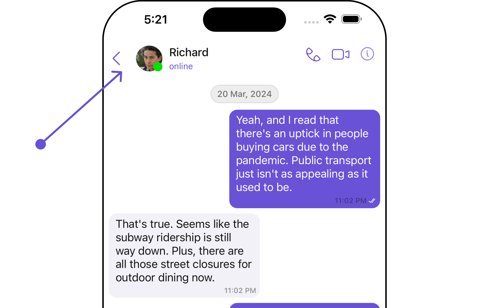
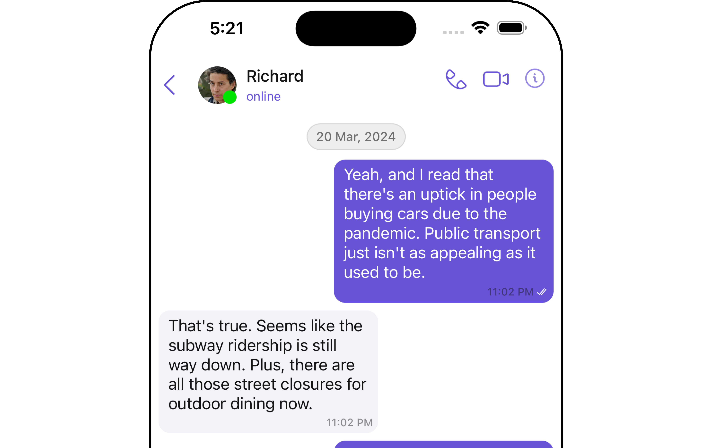
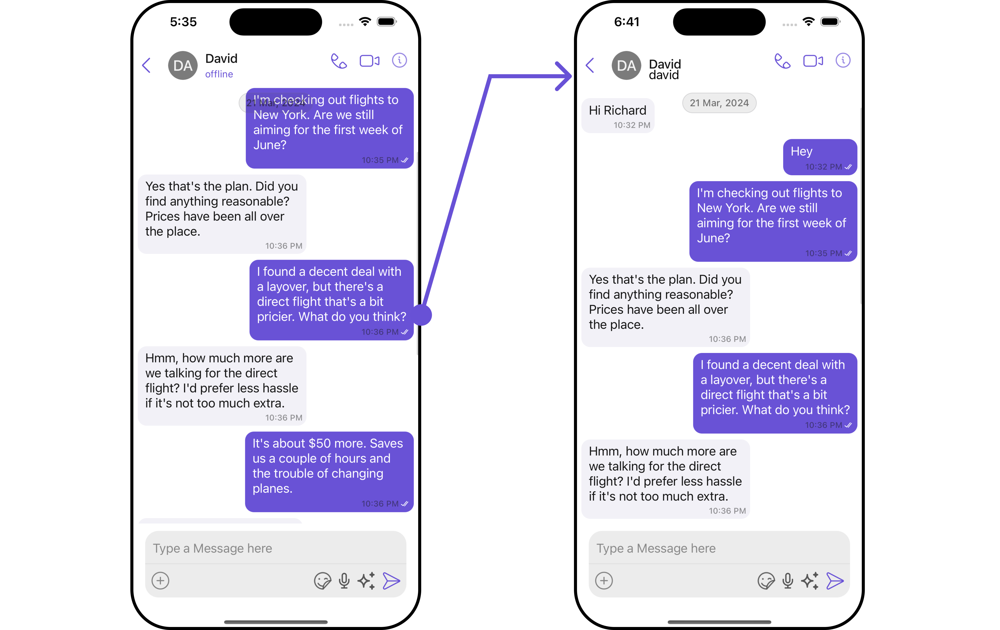
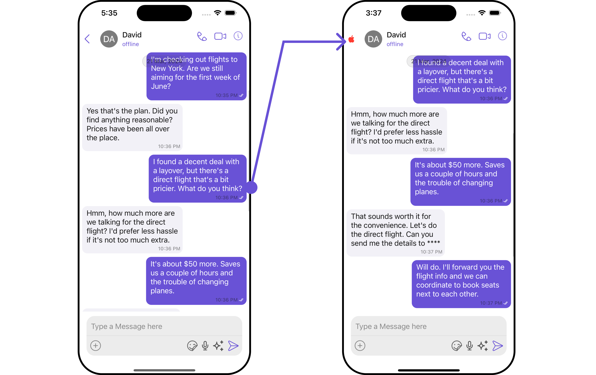
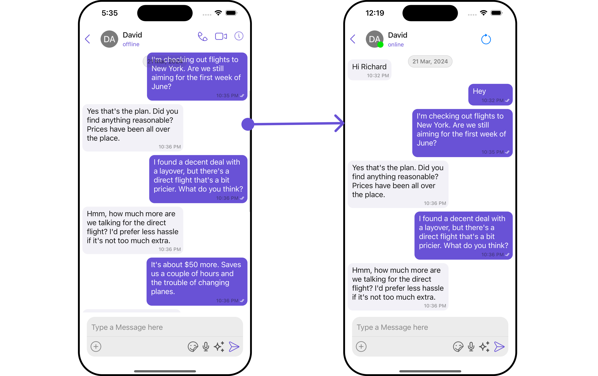

import Tabs from '@theme/Tabs';
import TabItem from '@theme/TabItem';
import { Tooltip } from 'react-tooltip'
import 'react-tooltip/dist/react-tooltip.css'

## Overview

`MessageHeader` is a [Component](/ui-kit/ios/components-overview#components) that showcases the [User](/sdk/ios/users-overview) or [Group](/sdk/ios/groups-overview) details in the toolbar. Furthermore, it also presents a typing indicator and a back navigation button for ease of use.



<!--  -->

<!--  -->

The `MessageHeader` is comprised of the following components:

| Components                                  | Description                                                                                                                                    |
| ------------------------------------------- | ---------------------------------------------------------------------------------------------------------------------------------------------- |
| [ListItem Component](/ui-kit/ios/list-item) | This component’s view consists of avatar, status indicator , title, and subtitle. The fields are then mapped with the SDK’s user, group class. |
| Back Button                                 | BackButton that allows users to navigate back from the current activity or screen to the previous one                                          |

## Usage

### Integration

You can add `MessageHeader` component directly by setting the user.

```swift title="Swift"
// syntax for set(user: User)
messageHeader.set(user: user)	 // The object which is going to be rendered in the data item
```

### Actions

[Actions](/ui-kit/ios/components-overview#actions) dictate how a component functions. They are divided into two types: Predefined and User-defined. You can override either type, allowing you to tailor the behavior of the component to fit your specific needs.

The `MessageHeader` component does not have any exposed actions.

### Filters

**Filters** allow you to customize the data displayed in a list within a `Component`. You can filter the list based on your specific criteria, allowing for a more customized. Filters can be applied using `RequestBuilders` of Chat SDK.

The `MessageHeader` component does not have any exposed filters.

### Events

[Events](/ui-kit/ios/components-overview#events) are emitted by a `Component`. By using event you can extend existing functionality. Being global events, they can be applied in Multiple Locations and are capable of being Added or Removed.

The `MessageHeader` component does not produce any events.

## Customization

To fit your app's design requirements, you can customize the appearance of the conversation component. We provide exposed methods that allow you to modify the experience and behavior according to your specific needs.

### Style

Using Style you can customize the look and feel of the component in your app, These parameters typically control elements such as the color, size, shape, and fonts used within the component.

##### 1. MessageHeader Style

To customize the appearance, you can assign a `MessageHeaderStyle` object to the `MessageHeader` component.

<Tabs>
<TabItem value="swift" label="Swift">

```swift
// Creating MessageHeaderStyle object
let messageHeaderStyle = MessageHeaderStyle()
    .set(typingIndicatorTextColor: .orange)

let messageHeaderConfiguration = MessageHeaderConfiguration()
    .set(messageHeaderStyle: messageHeaderStyle)

let cometChatMessages = CometChatMessages()
    .set(user: user)
    .set(messageHeaderConfiguration: messageHeaderConfiguration)
```

</TabItem>

</Tabs>

The properties exposed by `MessageHeaderStyle` are as follows:

<!-- | Property                           | Description                             | Code                                       |
| ---------------------------------- | --------------------------------------- | ------------------------------------------ |
| **Border Width**                   | Used to set border                      | `.set(borderWidth: CGFloat)`               |
| **Border Color**                   | Used to set border color                | `.set(borderColor: UIColor)`               |
| **Corner Radius**                  | Used to set corner radius               | `.set(cornerRadius: CometChatCornerStyle)	` |
| **Background**                     | Used to set background colour           | `.set(background: UIColor)	`                |
| **BackIcon Tint**                  | Used to set back button icon tint       | `.set(backIconTint: UIColor)`              |
| **TypingIndicator TextAppearance** | Used to set typing indicator textStyle  | `.set(typingIndicatorTextFont: UIFont)	`    |
| **TypingIndicator TextColor**      | Used to set typing indicator text color | `.set(typingIndicatorTextColor: UIColor)	`  |
| **SubtitleText Appearance**        | Used to set subtitle text style         | `.set(subtitleTextFont: UIFont)`           |
| **SubtitleText Color**             | Used to set subtitle text color         | `.set(subtitleTextColor: UIColor`          | -->

| Property                                  | Description                                                  | Method                                             |
| ----------------------------------------- | ------------------------------------------------------------ | -------------------------------------------------- |
| **Set BorderWidth**                       | Used to set border                                           | `.set(borderWidth: CGFloat)`                       |
| **Set BorderColor**                       | Used to set border color                                     | `.set(borderColor: UIColor)`                       |
| **Set CornerRadius**                      | Used to set corner radius                                    | `.set(cornerRadius: CometChatCornerStyle)`         |
| **Set Background**                        | Used to set background colour                                | `.set(background: UIColor)`                        |
| **Set BackIconTint**                      | Used to set back button icon tint                            | `.set(backIconTint: UIColor)`                      |
| **Set TypingIndicatorTextAppearance**     | Used to set typing indicator textStyle                       | `.set(typingIndicatorTextFont: UIFont)`            |
| **Set TypingIndicatorTextColor**          | Used to set typing indicator text color                      | `.set(typingIndicatorTextColor: UIColor)`          |
| **Set SubtitleTextAppearance**            | Used to set subtitle text style                              | `.set(subtitleTextFont: UIFont)`                   |
| **Set SubtitleTextColor**                 | Used to set subtitle text color                              | `.set(subtitleTextColor: UIColor)`                 |
| **Set DetailIconTint**                    | Sets the tint color for detail icon for message header       | `.set(detailIconTint: UIColor)`                    |
| **Set OnlineStatusColor**                 | Sets the online status color for message header              | `.set(onlineStatusColor: UIColor)`                 |
| **Set PrivateGroupIconBackgroundColor**   | Sets the private group background color for message header   | `.set(privateGroupIconBackgroundColor: UIColor)`   |
| **Set ProtectedGroupIconBackgroundColor** | Sets the protected group background color for message header | `.set(protectedGroupIconBackgroundColor: UIColor)` |

##### 2. Avatar Style <a data-tooltip-id="my-tooltip-1-html-prop"> <span class="material-icons red">report</span> </a>

<Tooltip
  id="my-tooltip-1-html-prop"
  html="Not available"
/>

If you want to apply customized styles to the `Avatar` component within the `MessageHeader` Component, you can use the following code snippet. For more information you can refer [Avatar Styles](/ui-kit/ios/avatar#methods).

<Tabs>

<TabItem value="swift" label="Swift">
```swift
 // Creating  AvatarStyle object
let avatarStyle = AvatarStyle()

// Creating Modifying the propeties of avatar
avatarStyle.set(background: .red)
.set(textFont: .systemFont(ofSize: 18))
.set(textColor: .white)
.set(cornerRadius: CometChatCornerStyle(cornerRadius: 8.0))
.set(borderColor: .white)
.set(borderWidth: 5)
.set(outerViewWidth: 3)
.set(outerViewSpacing: 3)

// Creating MessageHeaderStyle object
let messageHeaderStyle = MessageHeaderStyle()
.set(typingIndicatorTextColor: .orange)

let messageHeaderConfiguration = MessageHeaderConfiguration()
.set(messageHeaderStyle: messageHeaderStyle)

let cometChatMessages = CometChatMessages()
.set(user: user)
.set(messageHeaderConfiguration: messageHeaderConfiguration)

````
</TabItem>

</Tabs>


##### 3. ListItem Style <a data-tooltip-id="my-tooltip-2-html-prop"> <span class="material-icons red">report</span> </a>
<Tooltip
  id="my-tooltip-2-html-prop"
  html="Not available"
/>

If you want to apply customized styles to the `ListItemStyle` component within the `MessageHeader` Component, you can use the following code snippet. For more information, you can refer [ListItem Styles](/ui-kit/ios/list-item).

<Tabs>

<TabItem value="swift" label="Swift">
```swift
 // Creating  ListItemStyle object
let listItemStyle = ListItemStyle()

 // Creating  Modifying the propeties of list item
listItemStyle.set(background: .black)
    .set(titleFont: .systemFont(ofSize: 18))
    .set(titleColor: .white)
    .set(cornerRadius: CometChatCornerStyle(cornerRadius: 2.0))
    .set(borderColor: .white)
    .set(borderWidth: 5)

let messageHeaderStyle = MessageHeaderStyle()

let messageHeaderConfiguration = MessageHeaderConfiguration()
     .set(messageHeaderStyle: messageHeaderStyle)

let cometChatMessages = CometChatMessages()
     .set(user: user)
     .set(messageHeaderConfiguration: messageHeaderConfiguration)

````

</TabItem>

</Tabs>

##### 4. StatusIndicator Style<a data-tooltip-id="my-tooltip-3-html-prop"> <span class="material-icons red">report</span> </a>

<Tooltip
  id="my-tooltip-3-html-prop"
  html="Not available"
/>

If you want to apply customized styles to the `Status Indicator` component within the `MessageHeader` Component, you can use the following code snippet. For more information you can refer [StatusIndicator Styles](/ui-kit/ios/status-indicator#methods).

<Tabs>

<TabItem value="swift" label="Swift">
```swift
// Creating StatusIndicatorStyle object
let statusIndicatorStyle = StatusIndicatorStyle()

// Creating Modifying the propeties of avatar
statusIndicatorStyle.set(background: .red)
.set(borderColor: .orange)
.set(background: .purple)
.set(borderWidth: 14)

let messageHeaderStyle = MessageHeaderStyle()

let messageHeaderConfiguration = MessageHeaderConfiguration()
.set(messageHeaderStyle: messageHeaderStyle)

let cometChatMessages = CometChatMessages()  
 .set(user: user)
.set(messageHeaderConfiguration: messageHeaderConfiguration)

````
</TabItem>

</Tabs>

### Functionality

These are a set of small functional customizations that allow you to fine-tune the overall experience of the component. With these, you can change text, set custom icons, and toggle the visibility of UI elements.

Here is a code snippet demonstrating how you can customize the functionality of the Message Header component.

<Tabs>

<TabItem value="swift" label="Swift">

```swift
// syntax for set(user: User)
messageHeader.set(user: user)	 // The object which is going to be rendered in the data  item

// syntax for set(backIcon: UIImage)
messageHeader.set(backIcon: UIImage(named: "back"))

// syntax for hide(backButton: Bool)
messageHeader.hide(backButton: false)
````

</TabItem>

</Tabs>

Following is a list of customizations along with their corresponding code snippets:

| Property                  | Description                                                              | Code                                |
| ------------------------- | ------------------------------------------------------------------------ | ----------------------------------- |
| **User**                  | Used to pass user object of which header specific details will be shown  | `.set(user: User)	`                  |
| **Group**                 | Used to pass group object of which header specific details will be shown | `.set(group: Group)	`                |
| **ProtectedGroupIcon**    | Used to set custom protected group icon                                  | `.set(protectedGroupIcon: UIImage)	` |
| **PrivateGroupIcon**      | Used to set custom private group icon                                    | `.set(privateGroupIcon: UIImage)	`   |
| **Hide BackIcon**         | Used to toggle back button visibility                                    | `.hide(backButton: Bool)	`           |
| **Disable Typing**        | Used to enable /disable typing indicators                                | `.disable(typing: Bool)`            |
| **Disable UsersPresence** | Used to toggle functionality to show user's presence                     | `.set(disableUsersPresence: Bool)`  |

### Advanced

For advanced-level customization, you can set custom views to the component. This lets you tailor each aspect of the component to fit your exact needs and application aesthetics. You can create and define your views, layouts, and UI elements and then incorporate those into the component.

#### SetSubtitleView

By using the `.setSubtitle` method, you can modify the SubtitleView to meet your specific needs.

```swift
let messageHeaderConfiguration = MessageHeaderConfiguration()
        .set(subtitle: { user, group in
let customSubtitleView = CustomSubtitleView(user: user, group: group)
        return customSubtitleView
})
```

**Example**



<!--  -->

You should create a `customSubtitleView` file and pass it inside `messageHeaderConfiguration` function.

```swift title="CustomSubtitleView"
import UIKit
import CometChatUIKitSwift
import CometChatSDK

class CustomSubtitleView: UIView {
    private let label = UILabel()

    init(user: User?, group: Group?) {
        super.init(frame: .zero)

        // Configure your view here.
        // For instance, you might want to show the user's or group's name.
        if let user = user {
            label.text = user.name
        } else if let group = group {
            label.text = group.name
        }

        addSubview(label)

        // Set up the constraints for your label.
        label.translatesAutoresizingMaskIntoConstraints = false
        NSLayoutConstraint.activate([
            label.centerYAnchor.constraint(equalTo: centerYAnchor),
            label.leadingAnchor.constraint(equalTo: leadingAnchor),
            label.trailingAnchor.constraint(equalTo: trailingAnchor)
        ])
    }
    required init?(coder: NSCoder) {
        fatalError("init(coder:) has not been implemented")
    }
}
```

<Tabs>

<TabItem value="swift" label="Swift">

```swift title="swift"
let messageHeaderConfiguration = MessageHeaderConfiguration()
    .set(subtitle: { user, group in
let customSubtitleView = CustomSubtitleView(user: user, group: group)
                return customSubtitleView
            })

let cometChatMessages = CometChatMessages()
    .set(user: user)
    .set(messageHeaderConfiguration: messageHeaderConfiguration)
```

</TabItem>

</Tabs>
:::info
Ensure to pass and present `cometChatMessages`. If a navigation controller is already in use, utilize the pushViewController function instead of directly presenting the view controller.
:::

:::tip
Please make sure to include the **User's** `uid` and `name`
:::

---

#### SetBackIcon

You can customize the Back Icon according to your specific requirements by using the `.set(backIcon: UIImage)` method.

```swift
// syntax for set(backButtonIcon: UIImage)
messageHeader.set(backButtonIcon: UIImage(named: "back.png")
```

**Example**



<!--  -->

You can to create a `custom_back_icon` UIImage or can use system named UIImage, and then pass it to the `MessageHeaderConfiguration` method.

```swift
let  messageHeaderStyle = MessageHeaderStyle()
    .set(backIconTint: .systemRed)

let  messageHeaderConfiguration = MessageHeaderConfiguration()
    .set(backIcon: UIImage(systemName: "apple.logo")!)
    .set(messageHeaderStyle: messageHeaderStyle)
    .hide(backButton: false)

let cometChatMessages = CometChatMessages()
     .set(user: user)
     .set(messageHeaderConfiguration: messageHeaderConfiguration)
```

:::info
Ensure to pass and present `cometChatMessages`. If a navigation controller is already in use, utilize the pushViewController function instead of directly presenting the view controller.
:::

---

#### SetMenu

You can customize the Menu options to meet your specific needs by using the `.setMenu()` method.

```swift
let messageHeaderConfiguration = MessageHeaderConfiguration()
    .setMenus { user, group in
let customMenus = CustomMenus(user: user, group: group) // Return view which you want to show in the right side of the message header
    return customMenus
}
```

**Example**


<!--  -->

You need to create a `Custom_Menus` UIView file, and then pass it to `MessageHeaderConfiguration()` method.

```swift title="CustomMenus"
import UIKit
import CometChatSDK
import CometChatUIKitSwift

class CustomMenus: UIView {
    private let menuButton: UIButton = {
        let button = UIButton(type: .system)
        button.setImage(UIImage(systemName: "goforward"), for: .normal)
        button.addTarget(self, action: #selector(menuButtonTapped), for: .touchUpInside)
        return button
    }()

    init(user: User?, group: Group?) {
        super.init(frame: .zero)

        addSubview(menuButton)

        menuButton.translatesAutoresizingMaskIntoConstraints = false
        NSLayoutConstraint.activate([
            menuButton.topAnchor.constraint(equalTo: topAnchor),
            menuButton.bottomAnchor.constraint(equalTo: bottomAnchor),
            menuButton.leadingAnchor.constraint(equalTo: leadingAnchor),
            menuButton.trailingAnchor.constraint(equalTo: trailingAnchor),
        ])
    }

    required init?(coder: NSCoder) {
        fatalError("init(coder:) has not been implemented")
    }

    @objc private func menuButtonTapped() {
        print("Menu button tapped!")
        // Implement your menu action here
    }
}

```

<Tabs>

<TabItem value="swift" label="Swift">

```swift title ="Swift"
let messageHeaderConfiguration = MessageHeaderConfiguration()
            .setMenus { user, group in
let customMenus = CustomMenus(user: user, group: group) // Return view which you want to show in the right side of the message header
return customMenus
}


let cometChatMessages = CometChatMessages()
    .set(user: user)
    .set(messageHeaderConfiguration: messageHeaderConfiguration)
```

</TabItem>

</Tabs>

:::info
Ensure to pass and present `cometChatMessages`. If a navigation controller is already in use, utilize the pushViewController function instead of directly presenting the view controller.
:::

<!-- ## Configuration

Message Header is a [Components](/ui-kit/android/components#components), Hence it doesn't have [Configuration](/ui-kit/android/components#configurations). Configurations are only available for [Composite Components](/ui-kit/android/components#composite-components)

Message Header can be used by Composite Component, In this case, all the [Action](#style), [Filters](#filters), [Styles](#style), [Functionality](#functionality), and [Advanced](#advanced) properties of the Message Header component will be exposed via `MessageHeaderConfigurations`.

Properties marked with the <a data-tooltip-id="my-tooltip-html-prop"><span class="material-icons red">report</span></a> symbol are not accessible within the Configuration Object. -->

<Tooltip
  id="my-tooltip-html-prop"
  html="Not available in MessageHeaderConfiguration"
/>
