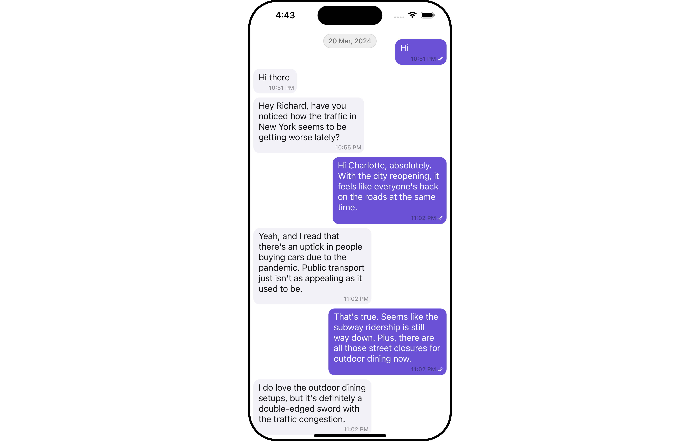
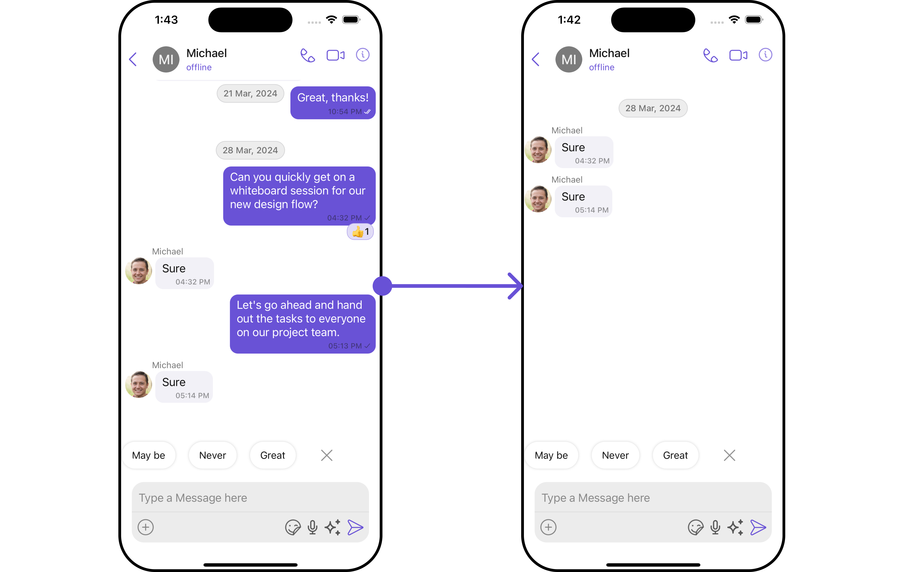
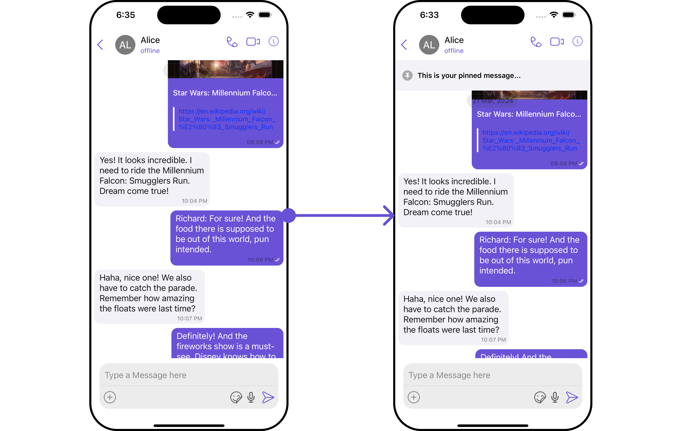
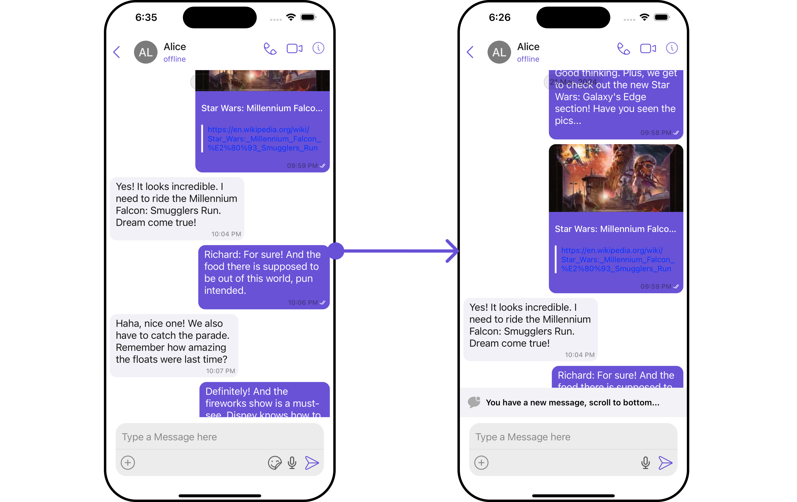
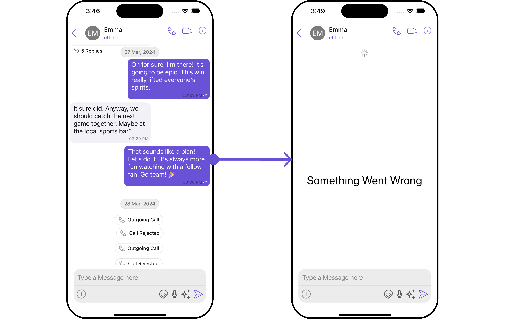
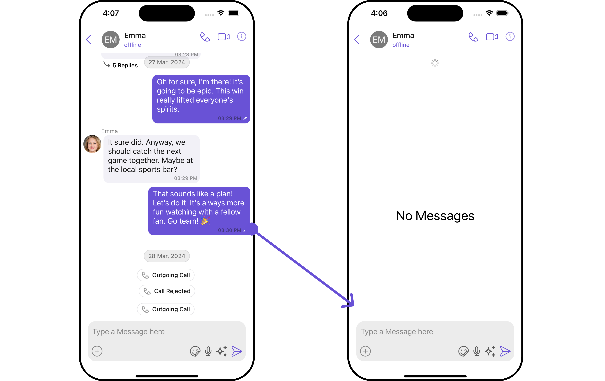
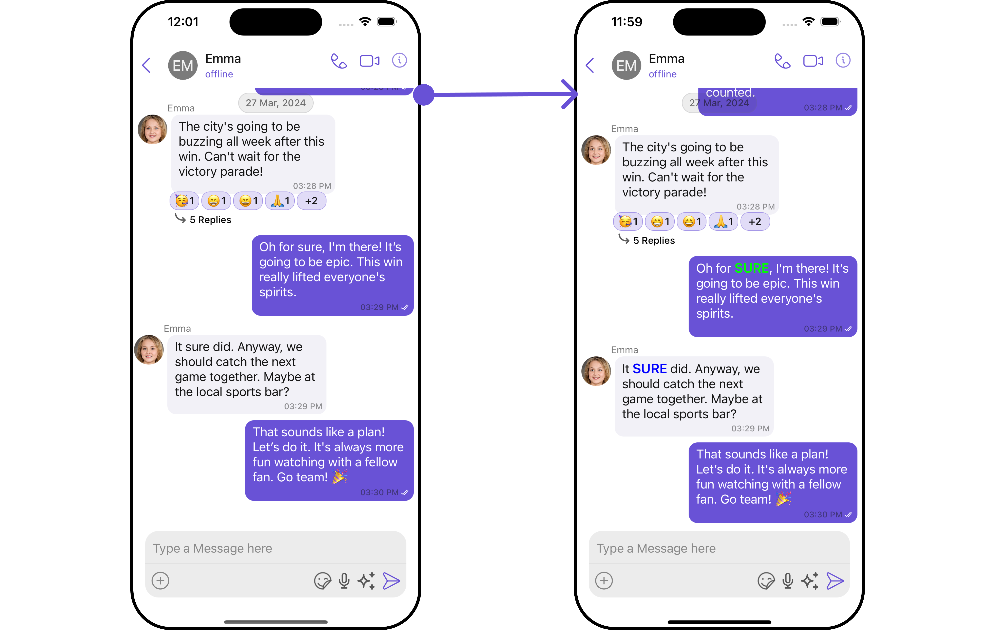
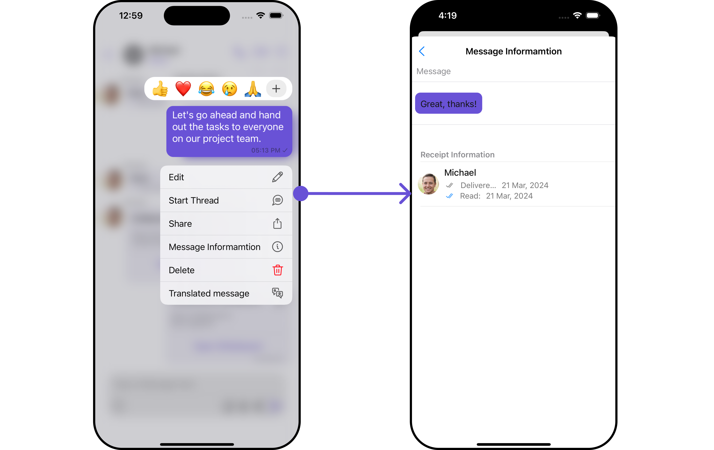
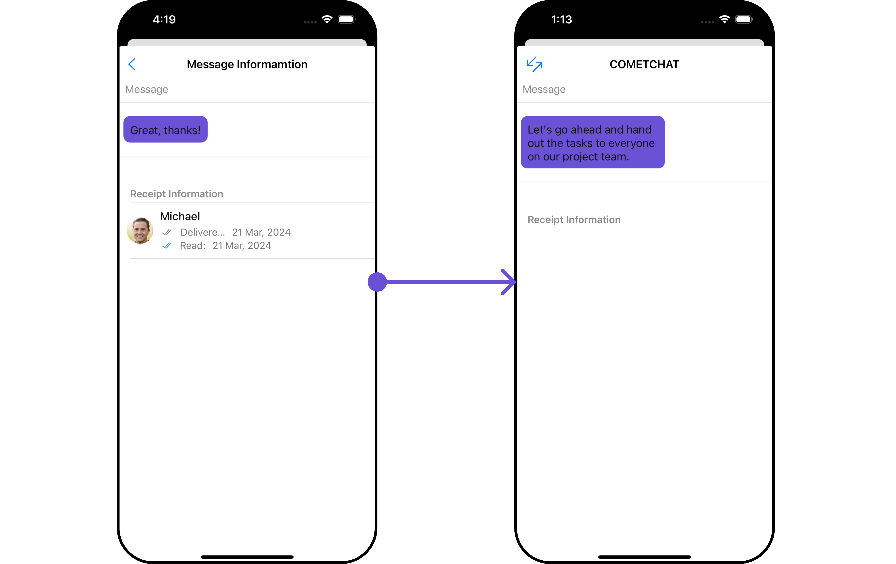

import Tabs from '@theme/Tabs';
import TabItem from '@theme/TabItem';
import { Tooltip } from 'react-tooltip'
import 'react-tooltip/dist/react-tooltip.css'

## Overview

`MessageList` is a [Composite Component](/ui-kit/ios/components-overview#composite-components) that displays a list of messages and effectively manages real-time operations. It includes various types of messages such as Text Messages, Media Messages, Stickers, and more.

`MessageList` is primarily a list of the base component [MessageBubble](/ui-kit/ios/message-bubble). The MessageBubble Component is utilized to create different types of chat bubbles depending on the message type.



<!--  -->

---

## Usage

### Integration

The following code snippet illustrates how you can directly incorporate the MessageList component.

<Tabs>
<TabItem value="swift" label="Swift">

```swift
// syntax for set(user: User)
messageList.set(user: user)

// syntax for set(user: User, parentMessage: BaseMessage? = nil)
messageList.set(user: user, parentMessage: textMessage)
```

</TabItem>
</Tabs>

:::warning

To retrieve messages for a specific entity, you must associate it with either a `User` or `Group` object.

:::

---

### Actions

[Actions](/ui-kit/ios/components-overview#actions) dictate how a component functions. They are divided into two types: Predefined and User-defined. You can override either type, allowing you to tailor the behavior of the component to fit your specific needs.

##### 1. onThreadRepliesClick

`onThreadRepliesClick` is triggered when you click on the threaded message bubble.
The `onThreadRepliesClick` action doesn't have a predefined behavior. You can override this action using the following code snippet.

<Tabs>

<TabItem value="swift" label="Swift">
    ```swift
 let messageListConfiguration = MessageListConfiguration()
     .setOnThreadRepliesClick { message, messageBubbleView in
         // Your action onclick       
 }
    ```
</TabItem>

</Tabs>

##### 2. onError

You can customize this behavior by using the provided code snippet to override the `error view` and improve error handling. You have the option to integrate your own custom `UIView` file for this purpose.

<Tabs>

<TabItem value="swift" label="Swift">
```swift title="Swift"
let messageListConfiguration = MessageListConfiguration()
    .set(errorStateView: UIView)
```
</TabItem>

</Tabs>

### Filters

You can adjust the `MessagesRequestBuilder` in the MessageList Component to customize your message list. Numerous options are available to alter the builder to meet your specific needs. For additional details on `MessagesRequestBuilder`, please visit [MessagesRequestBuilder](/sdk/ios/additional-message-filtering).



In the example below, we are applying a filter to the messages based on a search substring and for a specific user. This means that only messages that contain the search term and are associated with the specified user will be displayed

<Tabs>

<TabItem value="swift" label="Swift">

```swift
let messageRequestBuilder =  MessagesRequest.MessageRequestBuilder()
    .set(uid: "YOUR_UID")
    .set(types: ["Text"])
    .set(searchKeyword: "sure")

let messageListConfiguration = MessageListConfiguration()
    .set(messagesRequestBuilder:messageRequestBuilder)

let cometChatMessages = CometChatMessages()
    .set(user: user)
    .set(messageListConfiguration: messageListConfiguration)
```

</TabItem>

</Tabs>

:::info

The following parameters in messageRequestBuilder will always be altered inside the message list

1. UID
2. GUID
3. types
4. categories

:::

:::tip
Ensure to include the `uid` and `name` of the User in the implementation.
:::

---

### Events

[Events](/ui-kit/ios/components-overview#events) are emitted by a `Component`. By using event you can extend existing functionality. Being global events, they can be applied in Multiple Locations and are capable of being Added or Removed.

The MessageList Component does not emit any events of its own.

---

## Customization

To fit your app's design requirements, you can customize the appearance of the conversation component. We provide exposed methods that allow you to modify the experience and behavior according to your specific needs.

### Style

Using Style you can customize the look and feel of the component in your app, These parameters typically control elements such as the color, size, shape, and fonts used within the component.

##### 1. MessageList Style

You can set the MessageListStyle to the MessageList Component to customize the styling.

<Tabs>

<TabItem value="swift" label="Swift">

```swift
let messageListStyle = MessageListStyle()
    .set(background: .systemMint)
    .set(borderColor: .green)
    .set(borderWidth: 30)
    .set(cornerRadius: cometChatCornerStyle)

```

</TabItem>

</Tabs>

List of properties exposed by MessageListStyle

| Property                       | Description                                                          | Code                                       |
| ------------------------------ | -------------------------------------------------------------------- | ------------------------------------------ |
| **Border Width**               | used to set border width                                             | `.set(borderWidth: CGFloat)	`               |
| **Border Color**               | used to set border color                                             | `.set(titleColor: UIColor)`                |
| **Corner Radius**              | used to set corner radius                                            | `.set(cornerRadius: CometChatCornerStyle)	` |
| **LoadingIcon Tint**           | used to set loading icon tint                                        | `.set(loadingIconTint: UIColor)`           |
| **EmptyText Appearance**       | used to set empty state text Appearance                              | `.set(emptyTextFont: UIFont)	`              |
| **ErrorText Appearance**       | used to set error text Appearance                                    | `.set(errorTextFont: UIFont)	`              |
| **EmptyText Color**            | used to set empty state text color                                   | `.set(emptyTextColor: UIColor)	`            |
| **ErrorText Color**            | used to set error state text color                                   | `.set(errorTextColor: UIColor)	`            |
| **NameText Color**             | used to set sender/receiver name text color on a message bubble.     | `.set(nameTextColor: UIColor)	`             |
| **NameText Appearance**        | used to set sender/receiver name text appearance on a message bubble | `.set(nameTextFont: UIFont)	`               |
| **TimeStampText Color**        | used to set time stamp text appearance                               | `.set(timestampTextColor: UIColor)	`        |
| **ThreadReplySeparator Color** | used to set thread reply separator color                             | `.set(threadReplySeperatorColor: UIColor)	` |
| **ThreadReplyText Color**      | used to set thread reply text color                                  | `.set(threadReplyTextColor: UIColor)	`      |
| **ThreadReplyText Appearance** | used to set thread reply text appearance                             | `.set(threadReplyTextFont: UIFont)	`        |
| **Background**                 | This method will set the background color for message list           | `.set(background: UIColor)	`                |

##### 2. Avatar Style <a data-tooltip-id="my-tooltip-html-prop"> <span class="material-icons red">report</span> </a>

To apply customized styles to the `Avatar` component in the `Conversations` Component, you can use the following code snippet. For further insights on `Avatar` Styles [refer](/ui-kit/ios/avatar#methods)

<Tabs>

<TabItem value="swift" label="Swift">
```swift
 let avatarStyle = AvatarStyle()
            .set(background: .blue)
            .set(borderColor: .gray)
    
let messageListStyle = MessageListStyle()
            .set(background: .systemMint)

let messageListConfiguration = MessageListConfiguration()
.set(messageListStyle: messageListStyle)
.show(avatar: true)

````
</TabItem>

</Tabs>

---

### Functionality

These are a set of small functional customizations that allow you to fine-tune the overall experience of the component. With these, you can change text, set custom icons, and toggle the visibility of UI elements.

<Tabs>

<TabItem value="swift" label="Swift">

```swift
let messageList = CometChatMessageList()
     .set(user: user)
    .hide(error: false)
    .hide(receipt: false)
````

</TabItem>

</Tabs>

Below is a list of customizations along with corresponding code snippets

| Property                                                                                                 | Description                                                                                                                                                                     | Code                                                        |
| -------------------------------------------------------------------------------------------------------- | ------------------------------------------------------------------------------------------------------------------------------------------------------------------------------- | ----------------------------------------------------------- |
| **User** <a data-tooltip-id="my-tooltip-html-prop"> <span class="material-icons red">report</span> </a>  | Used to pass user object of which header specific details will be shown                                                                                                         | `.set(user: User)	`                                          |
| **Group** <a data-tooltip-id="my-tooltip-html-prop"> <span class="material-icons red">report</span> </a> | Used to pass group object of which header specific details will be shown                                                                                                        | `.set(group: Group)	`                                        |
| **Messages Alignment**                                                                                   | used to set the alignmet of messages in CometChatMessageList. It can be either **leftAligned** or **standard**                                                                  | `.set(alignment: MessageListAlignment)	`                     |
| **EmptyState Text**                                                                                      | used to set text which will be visible when no messages are available                                                                                                           | `.set(emptyStateMessage: String)	`                           |
| **ErrorState Text**                                                                                      | used to set text which will be visible when error in messages retrieval                                                                                                         | `.set(errorMessage: String)	`                                |
| **Hide Error**                                                                                           | used to toggle visibility of error in MessageList                                                                                                                               | `.hide(error: Bool)	`                                        |
| **Disable Sound For Messages**                                                                           | used to enable/disable sound for incoming/outgoing messages , default false                                                                                                     | `.disable(soundForMessages: Bool)	`                          |
| **CustomSound For Messages**                                                                             | used to set custom sound for outgoing message                                                                                                                                   | `.set(customSoundForMessages: URL)	`                         |
| **Set ReadIcon**                                                                                         | used to set custom read icon visible at read receipt                                                                                                                            | `.set(readIcon: UIImage)	`                                   |
| **Set DeliverIcon**                                                                                      | used to set custom delivered icon visible at read receipt                                                                                                                       | `.set(deliveredIcon: UIImage)	`                              |
| **Set SentIcon**                                                                                         | used to set custom sent icon visible at read receipt                                                                                                                            | `.set(sentIcon: UIImage)	`                                   |
| **Set WaitIcon**                                                                                         | used to set custom wait icon visible at read receipt                                                                                                                            | `.set(waitIcon: UIImage)	`                                   |
| **Show Avatar**                                                                                          | used to toggle visibility for avatar                                                                                                                                            | `.show(avatar: Bool)	`                                       |
| **Hide Timestamp**                                                                                       | used to toggle visibility for of timestamp                                                                                                                                      | `.hideTimestamp(false)`                                     |
| **Set TimeStampAlignment**                                                                               | used to set receipt's time stamp alignment .It can be either **top** or **bottom**                                                                                              | `.setTimeStampAlignment(UIKitConstants.TimeStampAlignment)` |
| **Set newMessageIndicatorText**                                                                          | used to set new message indicator text                                                                                                                                          | `.set(newMessageIndicatorText: String)	`                     |
| **Toggle scrollToBottomOnNewMessage**                                                                    | should scroll to bottom on new message? , by default false                                                                                                                      | `.scrollToBottomOnNewMessages(bool: Bool)	`                  |
| **HideReceipt**                                                                                          | This method is used to control visibility of message receipts.                                                                                                                  | `.hide(receipt: Bool)	`                                      |
| **Add Message**                                                                                          | This method specifies the option to add user object locally in MessageList.                                                                                                     | `add(message: BaseMessage)	`                                 |
| **Update Message**                                                                                       | This method specifies the option to update message object locally in MessageList.                                                                                               | `update(message: BaseMessage)	`                              |
| **Remove Message**                                                                                       | This method specifies the option to remove message object locally in MessageList.                                                                                               | `remove(message: BaseMessage)`                              |
| **Delete Message**                                                                                       | This method specifies the option to delete message object in MessageList. This method will internally trigger SDK's `.deleteMessagefunction` to delete the message from server. | `delete(message: BaseMessage)`                              |

---

### Advance

For advanced-level customization, you can set custom views to the component. This lets you tailor each aspect of the component to fit your exact needs and application aesthetics. You can create and define your views, layouts, and UI elements and then incorporate those into the component.

#### Set Template

[CometChatMessageTemplate](/ui-kit/ios/message-template) is a pre-defined structure for creating message views that can be used as a starting point or blueprint for creating message views often known as message bubbles. For more information, you can refer to [CometChatMessageTemplate](/ui-kit/ios/message-template).

You can set message Templates to MessageList by using the following code snippet

<Tabs>

<TabItem value="swift" label="Swift">

```swift
let textTemp1: CometChatMessageTemplate = CometChatUIKit.getDataSource().getTextMessageTemplate()
let imageTemp: CometChatMessageTemplate = CometChatUIKit.getDataSource().getImageMessageTemplate()
let textTemp: [CometChatMessageTemplate] = [textTemp1, imageTemp]

let messageListStyle = MessageListStyle()
    .set(background: .systemTeal)

let messageListConfiguration = MessageListConfiguration()
    .set(messageListStyle: messageListStyle)
    .show(avatar: true)
    set(templates: textTemp)
```

</TabItem>

</Tabs>

---

#### Set HeaderView

You can set custom headerView to the Message List component using the following method.

```swift
let headerView = CustomHeaderView(user: user)
messageList.set(headerView: headerView)
```

Example



<Tabs>

<TabItem value="swift" label="Swift">

```swift
let customHeaderView = CustomChatListHeaderView() // CustomChatListHeaderView() is of type UIView()
 let messageListConfiguration = MessageListConfiguration()
 messageListConfiguration.set(headerView: customHeaderView)
```

</TabItem>

</Tabs>

Following is the code of CustomChatListHeaderView UIView Class

```swift
class CustomChatListHeaderView: UIView {

    private let pinImageView: UIImageView = {
        let imageView = UIImageView()
        imageView.image = UIImage(systemName: "pin.circle.fill") // set your image here
        imageView.contentMode = .scaleAspectFit
        imageView.translatesAutoresizingMaskIntoConstraints = false
        imageView.tintColor = .lightGray
        return imageView
    }()

    private let titleLabel: UILabel = {
        let label = UILabel()
        label.textColor = .black
        label.font = UIFont.boldSystemFont(ofSize: 14)
        label.text = "This is your pinned message..."
        label.translatesAutoresizingMaskIntoConstraints = false
        return label
    }()

    override init(frame: CGRect) {
        super.init(frame: frame)
        setupView()
    }

    required init?(coder aDecoder: NSCoder) {
        super.init(coder: aDecoder)
        setupView()
    }

    private func setupView() {
        backgroundColor = .systemGray6
        heightAnchor.constraint(equalToConstant: 50).isActive = true
        addSubview(pinImageView)
        addSubview(titleLabel)

        NSLayoutConstraint.activate([
            pinImageView.centerYAnchor.constraint(equalTo: centerYAnchor),
            pinImageView.leadingAnchor.constraint(equalTo: leadingAnchor, constant: 16),
            pinImageView.widthAnchor.constraint(equalToConstant: 24), // Adjust width as needed
            pinImageView.heightAnchor.constraint(equalToConstant: 24), // Adjust height as needed

            titleLabel.centerYAnchor.constraint(equalTo: centerYAnchor),
            titleLabel.leadingAnchor.constraint(equalTo: pinImageView.trailingAnchor, constant: 8),
            titleLabel.trailingAnchor.constraint(equalTo: trailingAnchor, constant: -16)
        ])
    }

    func configure(title: String) {
        titleLabel.text = title  // set your custom text
    }
}
```

---

#### Set FooterView

You can set custom footerView to the Message List component using the following method.

```swift
let footerView = CustomFooterView(user: user)
messageList.set(footerView: headerView)
```

Example



<Tabs>

<TabItem value="swift" label="Swift">

```swift
let customFooterView = CustomChatListFooterView() // CustomChatListFooterView() is of type UIView()
let messageListConfiguration = MessageListConfiguration()
messageListConfiguration.set(footerView: customFooterView)
```

</TabItem>

</Tabs>

Following is the code of CustomChatListFooterView UIView Class

```swift
class CustomChatListFooterView: UIView {

    private let pinImageView: UIImageView = {
        let imageView = UIImageView()
        imageView.image = UIImage(named: "new_message_icon") // set your image here
        imageView.contentMode = .scaleAspectFit
        imageView.translatesAutoresizingMaskIntoConstraints = false
        imageView.tintColor = .lightGray
        return imageView
    }()

    private let titleLabel: UILabel = {
        let label = UILabel()
        label.textColor = .black
        label.font = UIFont.boldSystemFont(ofSize: 14)
        label.text = "You have a new message, scroll to bottom..."
        label.translatesAutoresizingMaskIntoConstraints = false
        return label
    }()

    override init(frame: CGRect) {
        super.init(frame: frame)
        setupView()
    }

    required init?(coder aDecoder: NSCoder) {
        super.init(coder: aDecoder)
        setupView()
    }

    private func setupView() {
        backgroundColor = .systemGray6
        heightAnchor.constraint(equalToConstant: 50).isActive = true
        addSubview(pinImageView)
        addSubview(titleLabel)

        NSLayoutConstraint.activate([
            pinImageView.centerYAnchor.constraint(equalTo: centerYAnchor),
            pinImageView.leadingAnchor.constraint(equalTo: leadingAnchor, constant: 16),
            pinImageView.widthAnchor.constraint(equalToConstant: 24), // Adjust width as needed
            pinImageView.heightAnchor.constraint(equalToConstant: 24), // Adjust height as needed

            titleLabel.centerYAnchor.constraint(equalTo: centerYAnchor),
            titleLabel.leadingAnchor.constraint(equalTo: pinImageView.trailingAnchor, constant: 8),
            titleLabel.trailingAnchor.constraint(equalTo: trailingAnchor, constant: -16)
        ])
    }

    func configure(title: String) {
        titleLabel.text = title  // set your custom text
    }
}
```

---

#### Set DateSeparatorPattern

You can modify the date pattern of the message list date separator to your requirement using `setDateSeparatorPattern()`. This method accepts a function with a return type String. Inside the function, you can create your own pattern and return it as a String.

<Tabs>

<TabItem value="swift" label="Swift">
    ```swift
let messageListConfiguration = MessageListConfiguration()
        .setDateSeparatorPattern { timestamp in
     
            }
cometChatMessages.set(messageListConfiguration: messageListConfiguration)
```
</TabItem>

</Tabs>

**Example**


<!--  -->

<Tabs>

<TabItem value="swift" label="Swift">
    ```swift
let messageListConfiguration = MessageListConfiguration()
        .setDateSeparatorPattern { timestamp in
         guard let timestamp = timestamp else {
          return ""
    }
let date = Date(timeIntervalSince1970: TimeInterval(timestamp))
let formatter = DateFormatter()
formatter.dateFormat = "hh:mm MM/yyyy"
return formatter.string(from: date)
    }

let cometChatMessages = CometChatMessages()
.set(user: user)
.set(messageListConfiguration: messageListConfiguration)

    ```

</TabItem>

<TabItem value="" label="">

```

```

</TabItem>
</Tabs>
:::info
Ensure to pass and present `cometChatMessages`. If a navigation controller is already in use, utilize the pushViewController function instead of directly presenting the view controller.
:::

---

#### SetDatePattern

You can modify the date pattern to your requirement using .setDatePattern. This method accepts a function with a return type String. Inside the function, you can create your own pattern and return it as a String.

<Tabs>

<TabItem value="swift" label="Swift">
    ```swift
let messageListConfiguration = MessageListConfiguration()
            .setDatePattern { timestamp in
               
 }
    ```
</TabItem>

</Tabs>

**Example**

<!--  -->

<Tabs>

<TabItem value="swift" label="Swift">
    ```swift
let messageListConfiguration = MessageListConfiguration()
        .setDatePattern { timestamp in
            guard let timestamp = timestamp else {
             return ""
}
let date = Date(timeIntervalSince1970: TimeInterval(timestamp/1000))
let formatter = DateFormatter()
formatter.dateFormat = "dd-MM-yyyy"
return formatter.string(from: date)
 }
            
let cometChatMessages = CometChatMessages()
    .set(user: user)
    .set(messageListConfiguration: messageListConfiguration)
    ```
</TabItem>

<TabItem value="" label="">

```

```

</TabItem>
</Tabs>

:::info
Ensure to pass and present `cometChatMessages`. If a navigation controller is already in use, utilize the pushViewController function instead of directly presenting the view controller.
:::

---

#### SetErrorStateView

You can set a custom `ErrorStateView` using `setEmptyStateView` to match the error view of your app.
<Tabs>

<TabItem value="swift" label="Swift">
    ```swift
let messageListConfiguration = MessageListConfiguration()
    .set(errorStateView: errorView)
    ```
</TabItem>

</Tabs>

**Example**



<!--  -->

We have added an error view to `error_view` a UIView file. You can choose any view you prefer. This view should be passed to the `.set(errorStateView: errorView)` method.

```swift title="errorView"
import UIKit
import CometChatSDK
import CometChatUIKitSwift

class ErrorView: UIView {

    override init(frame: CGRect) {
        super.init(frame: frame)
        setupView()
    }

    required init?(coder: NSCoder) {
        super.init(coder: coder)
        setupView()
    }

    private func setupView() {
        backgroundColor = .systemBackground // Or any color matching your application's styles

        let imageView = UIImageView()
        imageView.image = UIImage(systemName: "exclamationmark.circle") // Replace with your error image
        imageView.translatesAutoresizingMaskIntoConstraints = false
        addSubview(imageView)

        let label = UILabel()
        label.text = "Something Went Wrong"
        label.font = UIFont.systemFont(ofSize: 30)
        label.translatesAutoresizingMaskIntoConstraints = false
        addSubview(label)

        NSLayoutConstraint.activate([
            imageView.centerXAnchor.constraint(equalTo: centerXAnchor),
            imageView.centerYAnchor.constraint(equalTo: centerYAnchor, constant: -50), // Adjust as needed
            imageView.widthAnchor.constraint(equalToConstant: 100),
            imageView.heightAnchor.constraint(equalToConstant: 100),

            label.topAnchor.constraint(equalTo: imageView.bottomAnchor, constant: 50), // Adjust as needed
            label.centerXAnchor.constraint(equalTo: imageView.centerXAnchor)
        ])
    }
}
```

<Tabs>

<TabItem value="swift" label="Swift">
    ```swift title=""
let errorView = ErrorView()

let messageListConfiguration = MessageListConfiguration()
.set(errorStateView: errorView)

let cometChatMessages = CometChatMessages()
.set(user: user)
.set(messageListConfiguration: messageListConfiguration)

````
</TabItem>

</Tabs>

:::info
Ensure to pass and present `cometChatMessages`. If a navigation controller is already in use, utilize the pushViewController function instead of directly presenting the view controller.
:::

---

#### SetEmptyStateView

The `setEmptyStateView()` function provides the ability to set a custom empty state view in your app. An empty state view is displayed when there are no messages for a particular user.

<Tabs>

<TabItem value="swift" label="Swift">
```swift
let messageListConfiguration = MessageListConfiguration()
.set(emptyStateView: emptyview)
````

</TabItem>

</Tabs>

**Example**



<!--  -->

You have to create a custom layout named `Empty_View`, you can set it as the empty state view by passing it as a parameter to the setEmptyStateView() function.

```swift title="Empty_View"
import UIKit

class EmptyView: UIView {

    override init(frame: CGRect) {
        super.init(frame: frame)
        setupView()
    }

    required init?(coder: NSCoder) {
        super.init(coder: coder)
        setupView()
    }

    private func setupView() {
        backgroundColor = .systemBackground // Or any color matching your application's styles

        let imageView = UIImageView()
        imageView.image = UIImage(systemName: "message") // Replace with your image
        imageView.translatesAutoresizingMaskIntoConstraints = false
        addSubview(imageView)

        let label = UILabel()
        label.text = "No Messages"
        label.font = UIFont.systemFont(ofSize: 30)
        label.translatesAutoresizingMaskIntoConstraints = false
        addSubview(label)

        NSLayoutConstraint.activate([
            imageView.centerXAnchor.constraint(equalTo: centerXAnchor),
            imageView.centerYAnchor.constraint(equalTo: centerYAnchor, constant: -50),
            imageView.widthAnchor.constraint(equalToConstant: 100),
            imageView.heightAnchor.constraint(equalToConstant: 100),

            label.topAnchor.constraint(equalTo: imageView.bottomAnchor, constant: 50),
            label.centerXAnchor.constraint(equalTo: imageView.centerXAnchor)
        ])
    }
}

```

<Tabs>

<TabItem value="Swift" label="Swift">
```swift 
let emptyview = EmptyView()
        
let messageListConfiguration = MessageListConfiguration()
            .set(emptyStateView: emptyview)
        
let cometChatMessages  = CometChatMessages()
            .set(user: user)
            .set(messageListConfiguration: messageListConfiguration)  
```
</TabItem>

<TabItem value="" label="">

```

```

</TabItem>
</Tabs>
:::info
Ensure to pass and present `cometChatMessages`. If a navigation controller is already in use, utilize the pushViewController function instead of directly presenting the view controller.
:::

---

#### SetTextFormatters

This functionality dynamically assigns a list of text formatters. If a custom list is provided, it uses that list. Otherwise, it gracefully falls back to the default text formatters retrieved from the data source for seamless integration.

<!-- This method handles the assignment of text formatters. If a custom list is provided and not empty, it sets the list accordingly. Otherwise, it falls back to using the default text formatters retrieved from the data source for enhanced functionality. -->

**Example**

This code customizes a CometChat text formatter to identify and style the word "sure", with handling options for interactions like string search, scrolling, and item clicks. The custom formatter is then applied to CometChat messages.


<!--  -->
<Tabs>

<TabItem value="swift" label="MyCustomTextFormatter">

    ```swift

import Foundation
import CometChatSDK
import CometChatUIKitSwift

class MyCustomTextFormatter: CometChatTextFormatter {
override func getRegex() -> String {
return "(\\bsure\\b)"

    }

    override func getTrackingCharacter() -> Character {
        return "#"
    }

    override func search(string: String, suggestedItems: ((_: [SuggestionItem]) -> ())? = nil) {
        // This function would call an API or perform a local search
        // For now, it does nothing
    }

    override func onScrollToBottom(suggestionItemList: [SuggestionItem], listItem: ((_: [SuggestionItem]) -> ())?) {
        // This function would call the next page of an API
        // For now, it does nothing
    }

    override func onItemClick(suggestedItem: SuggestionItem, user: User?, group: Group?) {
        // Do something with the clicked item
    }

    override func handlePreMessageSend(baseMessage: BaseMessage, suggestionItemList: [SuggestionItem]) {
        // This function would modify the message before it's sent
        // For now, it does nothing
    }

    override func prepareMessageString(
      baseMessage: BaseMessage,
      regexString: String,
      alignment: MessageBubbleAlignment = .left,
      formattingType: FormattingType
    ) -> NSAttributedString {
        let attrString = NSMutableAttributedString(string: "SURE")
        if alignment == .left { // Received message
            attrString.addAttribute(.foregroundColor, value: UIColor.blue, range: NSRange(location: 0, length: attrString.length))
        } else { // Sent message
            attrString.addAttribute(.foregroundColor, value: UIColor.green, range: NSRange(location: 0, length: attrString.length))
        }
        attrString.addAttribute(.font, value: UIFont.boldSystemFont(ofSize: 18), range: NSRange(location: 0, length: attrString.length))
        return attrString
    }

    override func onTextTapped(baseMessage: BaseMessage, tappedText: String, controller: UIViewController?) {
        // Your Action
    }

}

````

</TabItem>

</Tabs>

```swift title='Swift'
 let myCustomTextFormatter = MyCustomTextFormatter(trackingCharacter: "#")

let messageListConfiguration = MessageListConfiguration()
    .set(textFormatter: [myCustomTextFormatter])

let cometChatMessages  = CometChatMessages()
    .set(user: user)
    .set(messageListConfiguration: messageListConfiguration)
```
:::info
Ensure to pass and present `cometChatMessages`. If a navigation controller is already in use, utilize the pushViewController function instead of directly presenting the view controller.
:::

---

#### SetMentionsFormatters
Assigns the list of text formatters. If the provided list is not null, it sets the list. Otherwise, it assigns the default text formatters retrieved from the data source. To configure the existing Mentions look and feel check out [CometChatMentionsFormatter](/ui-kit/ios/mentions-formatter-guide)

**Example**

In this example, we are customizing the CometChat's '**mentions**' feature. We define different styles for mentions appearing in the message bubbles and the message composer. We also set a custom action when a mention is clicked, which shows an alert with options to view the mentioned user's profile or dismiss the alert. These customizations are then applied to the CometChat messages through the `MessageListConfiguration`.


<!--  -->
<Tabs>

<TabItem value="swift" label="Swift">

    ```swift
        // Initialize the MentionTextStyle for the left bubble

let leftBubbleTextStyle = MentionTextStyle()
.set(textColor: UIColor.blue)
.set(textFont: UIFont.systemFont(ofSize: 18, weight: .bold))
.set(loggedInUserTextColor: UIColor.red)
.set(loggedInUserTextFont: UIFont.systemFont(ofSize: 18, weight: .bold))

        // Initialize the MentionTextStyle for the right bubble

let rightBubbleTextStyle = MentionTextStyle()
.set(textColor: UIColor.green)
.set(textFont: UIFont.systemFont(ofSize: 18, weight: .bold))
.set(loggedInUserTextColor: UIColor.red)
.set(loggedInUserTextFont: UIFont.systemFont(ofSize: 18, weight: .bold))

      // Initialize the MentionTextStyle for the composer

let composerTextStyle = MentionTextStyle()
.set(textColor: UIColor.orange)
.set(textFont: UIFont.systemFont(ofSize: 18, weight: .bold))
.set(loggedInUserTextColor: UIColor.red)
.set(loggedInUserTextFont: UIFont.systemFont(ofSize: 18, weight: .bold))

        // Initialize and set the CometChatMentionsFormatter properties

let customMentionFormatter = CometChatMentionsFormatter()
.set(composerTextStyle: composerTextStyle)
.set(leftBubbleTextStyle: leftBubbleTextStyle)
.set(rightBubbleTextStyle: rightBubbleTextStyle)
.set(onMentionClicked: { baseMessage, tappedText, controller in

                let senderName = baseMessage.sender?.name ?? "Unknown User"
                let alertTitle = "Mention Clicked"
                let alertMessage = "\(senderName) mentioned you Would you like to view their profile?"
                let alert = UIAlertController(title: alertTitle, message: alertMessage, preferredStyle: .alert)

                alert.addAction(UIAlertAction(title: "View Profile", style: .default, handler: { _ in
                    // Code here to view user's profile
                }))
                alert.addAction(UIAlertAction(title: "Dismiss", style: .cancel, handler: nil))

                controller?.present(alert, animated: true, completion: nil)
    })

        // Pass this customMentionFormatter to your message list's configuration

let messageListConfiguration = MessageListConfiguration()
.set(textFormatter: [customMentionFormatter])

let cometChatMessages = CometChatMessages()
.set(user: user)
.set(messageListConfiguration: messageListConfiguration)

````

</TabItem>
</Tabs>

:::info
Ensure to pass and present `cometChatMessages`. If a navigation controller is already in use, utilize the pushViewController function instead of directly presenting the view controller.
:::

---

## Configuration

[Configurations](/ui-kit/ios/components-overview#configurations) offer the ability to customize the properties of each component within a Composite Component.

### MessageInformation

From the MessageList, you can navigate to the [MesssageInformation](/ui-kit/ios/message-information) component as shown in the image.



<!--  -->

If you wish to modify the properties of the [MesssageInformation](/ui-kit/ios/message-information) Component, you can use the `MessageInformationConfiguration` object.

<Tabs>

<TabItem value="swift" label="Swift">

```swift
let messageInformationConfiguration = MessageInformationConfiguration()
let messageListConfiguration = MessageListConfiguration()
    .set(messageInformationConfiguration: messageInformationConfiguration)
```

</TabItem>

</Tabs>

The `MessageInformationConfiguration` indeed provides access to all the [Action](/ui-kit/ios/message-information#style), [Filters](/ui-kit/ios/message-information#filters), [Styles](#style), [Functionality](/ui-kit/ios/message-information#functionality), and [Advanced](/ui-kit/ios/message-information) properties of the [MesssageInformation](/ui-kit/ios/message-information) component.

Please note that the properties marked with the <a data-tooltip-id="my-tooltip-html-prop"><span class="material-icons red">report</span></a> symbol are not accessible within the Configuration Object.

**Example**



<!--  -->

In this example, we are replacing the back button and styling a few properties of the [MesssageInformation](/ui-kit/ios/message-information) component using `MessageInformationConfiguration`.

```swift
let messageInformationStyle = MessageInformationStyle()
    .set(background: .gray)
    .set(deliveredIconTint: .green)
    .set(sendIconTint: .yellow)
    .set(titleTextColor: .systemBrown)
    .set(borderColor: .cyan)
    .set(borderWidth: 17)
    .set(titleTextFont: .italicSystemFont(ofSize: 11))
    .set(width: 15)

let messageInformationConfiguration = MessageInformationConfiguration()
    .setStyle(messageInformationStyle: messageInformationStyle)
    .set(backIcon: UIImage(systemName: "arrow.down.left.arrow.up.right")!)
    .set(titleText: "COMETCHAT")

let messageListConfiguration = MessageListConfiguration()
    .set(emptyStateView: emptyview)
    .set(messageInformationConfiguration: messageInformationConfiguration)

let cometChatMessages  = CometChatMessages()
    .set(user: user)
    .set(messageListConfiguration: messageListConfiguration)
```

In the above code, the back button is replaced, the title is set to "COMETCHAT", and the background color is set to gray. Finally, this configuration is applied to the message list.

:::info
Ensure to pass and present `cometChatMessages`. If a navigation controller is already in use, utilize the pushViewController function instead of directly presenting the view controller.
:::

---

### Reactions

<!--  -->

If you wish to modify the properties of the [Reaction](/ui-kit/ios/reactions) Component, you can use the `ReactionsConfiguration` object.

<Tabs>

<TabItem value="swift" label="Swift">

```swift
let reactionsConfiguration = ReactionsConfiguration()
let messageListConfiguration = MessageListConfiguration()
.set(reactionsConfiguration: reactionsConfiguration)
```

</TabItem>

</Tabs>

**Example**

In this example, we are styling a few properties of the [Reaction](/ui-kit/ios/reactions) component using `ReactionsConfiguration`.

```swift
let reactionsStyle  = ReactionsStyle()
.set(background: .init(red: 0.81, green: 0.64, blue: 0.96, alpha: 1.00))
.set(countColor: .red)

let reactionsConfiguration = ReactionsConfiguration()
.set(style: reactionsStyle)
.set(reactionAlignment: .center)

let messageListConfiguration = MessageListConfiguration()
.set(reactionsConfiguration: reactionsConfiguration)

let cometChatMessages = CometChatMessages()
.set(user: User(uid: "emma-uid", name: "emma"))
.set(messageListConfiguration: messageListConfiguration)

```

:::info
Ensure to pass and present `cometChatMessages`. If a navigation controller is already in use, utilize the pushViewController function instead of directly presenting the view controller.
:::
<Tooltip
  id="my-tooltip-html-prop"
  html="Not available in MessageListConfiguration"
/>
