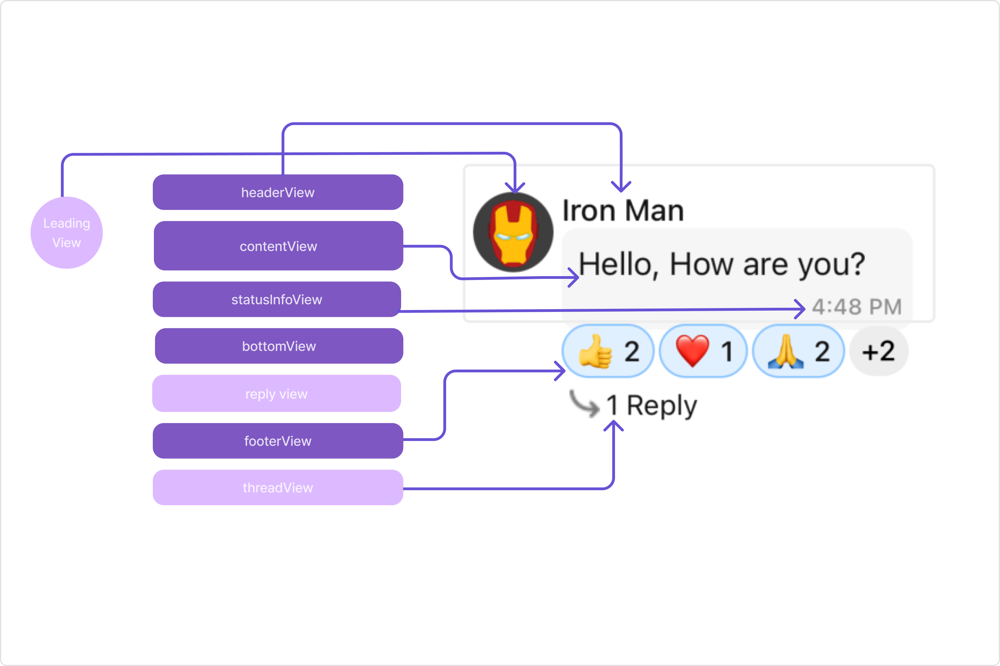
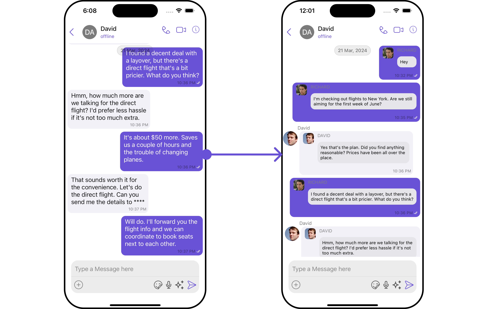
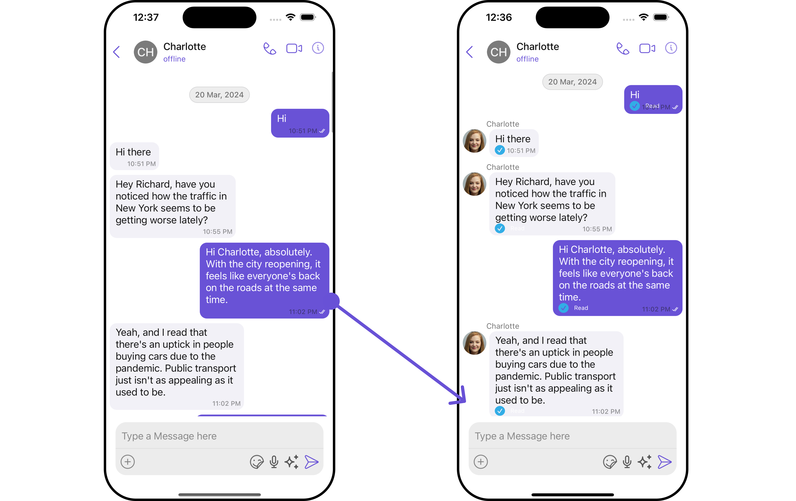
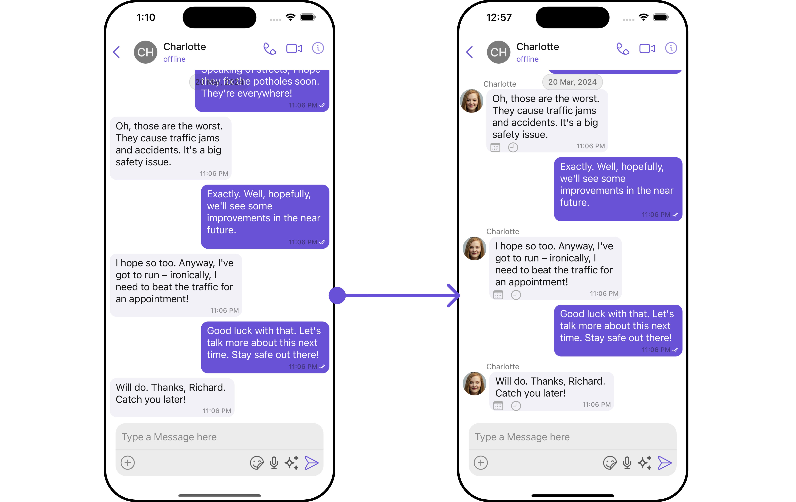
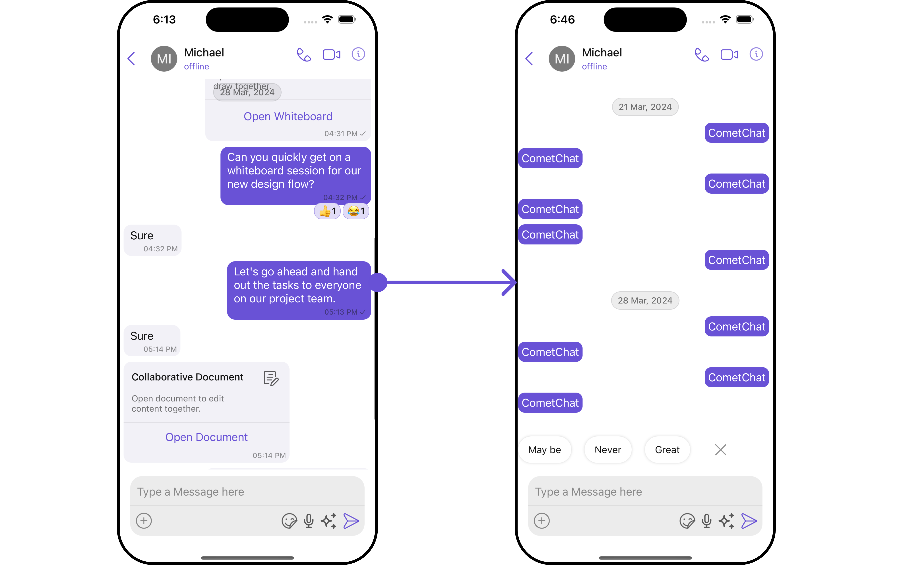
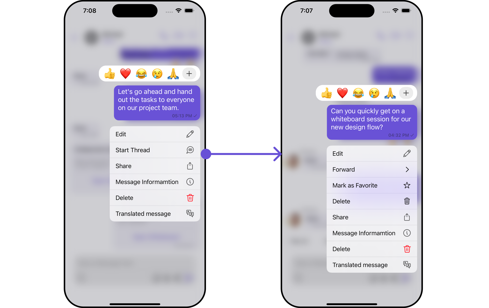
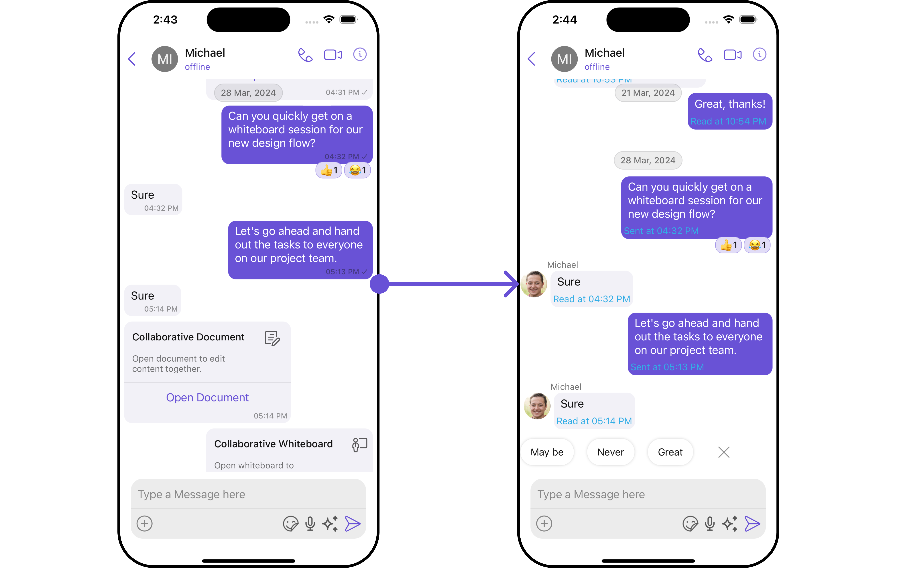

import Tabs from '@theme/Tabs';
import TabItem from '@theme/TabItem';

## Overview

A MessageTemplate provides you with the capability to define and customize both the structure and the behavior of the [MessageBubble](/ui-kit/ios/message-bubble). It acts as a schema or design blueprint for the creation of a variety of [MessageBubble](/ui-kit/ios/message-bubble) components, allowing you to manage the appearance and interactions of [MessageBubble](/ui-kit/ios/message-bubble) within your application effectively and consistently.

### Structure


<!--  -->
<!--  -->

The MessageBubble structure can typically be broken down into the following views:

1. **Leading view**: This is where the sender's avatar is displayed. It's typically on the left of the MessageBubble for messages from others and on the right for messages from the current user.

2. **Header view**: This displays the sender's name and is especially useful in group chats where multiple users are sending messages.

3. **Reply view**: This view can be used to extend the MessageBubble with additional elements. It's typically placed above the Content view.


4. **Content view**: This is the core of the MessageBubble where the message content (text, images, videos, etc.) is displayed.

5. **Bottom view**: This view can be used to extend the MessageBubble with additional elements, such as link previews or a 'load more' button for long messages. It's typically placed beneath the Content view.

6. **Thread view**:This is where the thread reply icon and reply counts are displayed. It's located below the footer view.

7. **Footer view**: This is where the timestamp of the message and its delivery or read status are displayed. It's located at the bottom of the MessageBubble.

8. **Status Info view**: This is where the timestamp of the message and its delivery or read status are displayed. It's located inside the MessageBubble just below the content view.

### Properties

MessageTemplate provides you with methods that allow you to alter various properties of the MessageBubble. These properties include aspects such as the `type` and `category` of a message, the appearance and behavior of the header, content, and footer sections of the message bubble,

1. **Type**

   Using `setType()` you can set the type of CometChatMessage, This will map your MessageTemplate to the corresponding CometChatMessage. You can set the MessageTemplates Type using the following code snippet.

   ```swift

   let type = "custom_template"//replace this with your own custom type

   //Creating a custom message template
   let customMessageTemplate =
   CometChatMessageTemplate(category: category, type: type, contentView: { message, alignment, controller in
   return UIView() //replace this with your own UI for message list

        }, bubbleView: nil, headerView: nil, footerView: nil) { message, alignment, controller in
            return UIView() //replace this with your own UI for message composer
        } options: { message, group, controller in
            return [CometChatMessageOption]() //replace this with your own options
        }

   ```

2. **Category**

Using `.setCategory()` you can set the category of a MessageTemplate. This will create a MessageTemplate with the specified category and link it with a CometChatMessage of the same category.

Please refer to our guide on [Message Categories](/sdk/ios/message-structure-and-hierarchy) for a deeper understanding of message categories.

```swift
let category = "custom_category"//replace this with your own category

//Creating a custom message template
//You can also set UI for bubbleView, headerView and footerView instead of nil
let customMessageTemplate =
  CometChatMessageTemplate(category: category, type: type, contentView: { message, alignment, controller in
         return UIView() //replace this with your own UI for message list

     }, bubbleView: nil, headerView: nil, footerView: nil) { message, alignment, controller in
         return UIView() //replace this with your own UI for message composer
     } options: { message, group, controller in
         return [CometChatMessageOption]() //replace this with your own options
     }
```

3. **Header View**

   The .`template.headerView` method allows you to assign a custom header view to the MessageBubble. By default, it is configured to display the sender's name.

   ```swift
   var allTemplates = CometChatUIKit.getDataSource().getAllMessageTemplates()

   for (index, template) in allTemplates.enumerated() {
            var template = template
            template.headerView = { (baseMessage: BaseMessage?, bubbleAlignment: MessageBubbleAlignment, viewController: UIViewController?) -> (UIView)? in
                return UIView()

     }
   }
   ```

4. **Content View**

   The `template.contentView` method allows you to assign a custom content view to the MessageBubble. By default, it displays the [Text Bubble](/ui-kit/ios/text-bubble), [Image Bubble](/ui-kit/ios/image-bubble), [File Bubble](/ui-kit/ios/file-bubble), [Audio Bubble](/ui-kit/ios/audio-bubble), or [Video Bubble](/ui-kit/ios/video-bubble), depending on the message type.

   ```swift
   var allTemplates = CometChatUIKit.getDataSource().getAllMessageTemplates()

    for (index, template) in allTemplates.enumerated() {
            var template = template
            template.contentView = { (baseMessage: BaseMessage?, bubbleAlignment: MessageBubbleAlignment, viewController: UIViewController?) -> (UIView)? in
                return UIView()
    }
   }
   ```

5. **Footer View**

   The `template.footerView` method allows you to assign a custom Footer view to the MessageBubble. By default, it displays the receipt and timestamp.

   ```swift
   var allTemplates = CometChatUIKit.getDataSource().getAllMessageTemplates()

    for (index, template) in allTemplates.enumerated() {
            var template = template
            template.footerView = { (baseMessage: BaseMessage?, bubbleAlignment: MessageBubbleAlignment, viewController: UIViewController?) -> (UIView)? in
                return UIView()
    }
   }
   ```

6. **Bottom View**

   The `template.bottomView` method allows you to assign a custom Bottom view to the MessageBubble.By defuault is has buttons such as link previews or a 'load more' button for long messages.

   ```swift
   var allTemplates = CometChatUIKit.getDataSource().getAllMessageTemplates()

    for (index, template) in allTemplates.enumerated() {
            var template = template
            template.bottomView = { (baseMessage: BaseMessage?, bubbleAlignment: MessageBubbleAlignment, viewController: UIViewController?) -> (UIView)? in
                return UIView()
    }
   }
   ```

7. **Bubble View**

   The `template.bubbleView` method allows you to assign a custom Bubble view to the MessageBubble. By default, headerView, contentView, and footerView together form a message bubble.

   ```swift
   var allTemplates = CometChatUIKit.getDataSource().getAllMessageTemplates()

    for (index, template) in allTemplates.enumerated() {
            var template = template
            template.bubbleView = { (baseMessage: BaseMessage?, bubbleAlignment: MessageBubbleAlignment, viewController: UIViewController?) -> (UIView)? in
                return UIView()
    }
   }
   ```

8. **Options**

   The `template.options` lets you set the list of actions that a user can perform on a message. This includes actions like reacting to, editing, or deleting a message.

   ```swift
   var allTemplates = CometChatUIKit.getDataSource().getAllMessageTemplates()
    for (index, template) in allTemplates.enumerated() {
            var template = template
            template.options = { message, group, controller in
                let loggedInUser = CometChat.getLoggedInUser()
                let options = CometChatUIKit.getDataSource().getMessageOptions(loggedInUser: loggedInUser!, messageObject: message!, controller: controller, group: group)

                return options
    }
     allTemplates[index] = template
   }
   ```
---
## Customization

Let's dive into how you can use the [properties](#properties) of MessageTemplate to customize an existing template or add a new one to the [MessageList](/ui-kit/ios/message-list) component.

The First step is to fetch the list of existing templates when you want to modify or add to them. This can be done using the getAllMessageTemplates() method from the DataSource of the CometChatUIKit class.

```swift
var messageTemplates : [CometChatMessageTemplate] = CometChatUIKit.getDataSource().getAllMessageTemplates()
```

### Existing Templates

You will need to first get the MessageTemplates object for the type of message you want to customize. You will be customizing the TextMessage Bubble here. The code snippet to get the Text MessageTemplate is as follows.

<Tabs>

<TabItem value="swift" label="Swift">

```swift
var messageTemplates : [CometChatMessageTemplate] = CometChatUIKit.getDataSource().getAllMessageTemplates()

for i in 0..<messageTemplates.count {
 if messageTemplates[i].type == "text" && messageTemplates[i].category == "message" {
  // Set your own content view
    messageTemplates[i].contentView = { message, alignment, controller in
    // Create your own content view and return
      return UIView()
 }
   // Set your own bubble view
     messageTemplates[i].bubbleView = { message, alignment, controller in
    // Create your own bubble view and return
     return UIView()
     }
    }
 }

let messageListConfiguration = MessageListConfiguration()
     .set(templates: messageTemplates)

let cometChatMessages = CometChatMessages()
    .set(user: user)
    .set(messageListConfiguration: messageListConfiguration)
```

</TabItem>

</Tabs>

You will be using [Messages](/ui-kit/ios/messages#overview) Component for example here so to apply Template to Messages you will need to use `MessageListConfiguration`. This is because the [Set Templates](/ui-kit/ios/message-list#set-template) function, which is used to apply the custom templates, belongs to the [MessageList](/ui-kit/ios/message-list) component.

By utilizing this code snippet, you will retrieve `text templates`.

<Tabs>

<TabItem value="swift" label="Swift">

```swift
let messageTemplates : CometChatMessageTemplate = CometChatUIKit.getDataSource().getTextMessageTemplate()

let messageListConfiguration = MessageListConfiguration()
    .set(templates: [messageTemplates])


let cometChatMessages = CometChatMessages()
    .set(user: user)
    .set(messageListConfiguration: messageListConfiguration)
```

</TabItem>

</Tabs>

:::info
Ensure to pass and present `cometChatMessages`. If a navigation controller is already in use, utilize the pushViewController function instead of directly presenting the view controller.
:::

---
#### Header view

The `template.headerView` method of MessageTemplate allows you to add custom views to the header of your message bubbles. In the example below, we will add a custom UIView `custom_header_view` to the header view of every text message in the MessageList.


<!--  -->

```swift title='custom_header_view'
import UIKit
import CometChatUIKitSwift

class HeaderView: UIView {

    // MARK: - Properties
     let profileImageView: UIImageView = {
        let imageView = UIImageView()
        imageView.translatesAutoresizingMaskIntoConstraints = false
        imageView.layer.cornerRadius = 20
        imageView.clipsToBounds = true
        imageView.contentMode = .scaleAspectFit
        return imageView
    }()

     let nameLabel: UILabel = {
        let label = UILabel()
        label.translatesAutoresizingMaskIntoConstraints = false
        label.font = UIFont.boldSystemFont(ofSize: 19)
        return label
    }()

    // MARK: - Initialization
    override init(frame: CGRect) {
        super.init(frame: frame)
        setupViews()
    }

    required init?(coder aDecoder: NSCoder) {
        super.init(coder: aDecoder)
        setupViews()
    }

    // MARK: - Setup
    private func setupViews() {
        addSubview(profileImageView)
        addSubview(nameLabel)

        NSLayoutConstraint.activate([
            profileImageView.widthAnchor.constraint(equalToConstant: 40),
            profileImageView.heightAnchor.constraint(equalToConstant: 40),
            profileImageView.centerYAnchor.constraint(equalTo: centerYAnchor),
            profileImageView.leadingAnchor.constraint(equalTo: leadingAnchor),

            nameLabel.centerYAnchor.constraint(equalTo: centerYAnchor),
            nameLabel.leadingAnchor.constraint(equalTo: profileImageView.trailingAnchor),
            nameLabel.trailingAnchor.constraint(equalTo: trailingAnchor),
            nameLabel.widthAnchor.constraint(lessThanOrEqualToConstant: 250)
        ])
    }

    // MARK: - Update Image
    func updateImage(from url: URL) {
        DispatchQueue.global(qos: .userInitiated).async {
            guard let imageData = try? Data(contentsOf: url),
                  let image = UIImage(data: imageData) else { return }
            DispatchQueue.main.async { [weak self] in
                self?.profileImageView.image = image
            }
        }
    }
}

```

<Tabs>

<TabItem value="swift" label="Swift">

```swift title='Swift'
 var allTemplates = CometChatUIKit.getDataSource().getAllMessageTemplates()
            for (index, template) in allTemplates.enumerated() {
             var template = template
            template.headerView = { (baseMessage: BaseMessage?, bubbleAlignment: MessageBubbleAlignment, viewController: UIViewController?) -> (UIView)? in
             let customHeaderView = HeaderView()
            return customHeaderView                        }
        allTemplates[index] = template
 }

 let messageListConfiguration = MessageListConfiguration()
                           .set(templates: allTemplates)

let cometChatMessages = CometChatMessages()
            .set(user: user)
            .set(messageListConfiguration: messageListConfiguration)
```

</TabItem>

</Tabs>

:::info
Ensure to pass and present `cometChatMessages`. If a navigation controller is already in use, utilize the pushViewController function instead of directly presenting the view controller.
:::

---
#### Content view

The `template.contentView` method of MessageTemplate allows you to add a custom view to the content of your message bubbles. In the example below, we will add a custom `custom_message_view_file` to the content view of every text message in the MessageList.



<!--  -->

<Tabs>

<TabItem value="swift" label="Swift">

```swift title='custom_message_view_file'
import UIKit
import CometChatSDK
import CometChatUIKitSwift

class CustomMessageView: UIView {
    let avatarImageView = UIImageView()
    let nameLabel = UILabel()
    let messageBubbleView = UIView()
    let messageLabel = UILabel()
    let timestampLabel = UILabel()

    init(message: TextMessage) {
        super.init(frame: .zero)

        avatarImageView.translatesAutoresizingMaskIntoConstraints = false
        nameLabel.translatesAutoresizingMaskIntoConstraints = false
        messageLabel.translatesAutoresizingMaskIntoConstraints = false
        timestampLabel.translatesAutoresizingMaskIntoConstraints = false
        messageBubbleView.translatesAutoresizingMaskIntoConstraints = false

        // Set avatar image
        avatarImageView.layer.cornerRadius = 8
        avatarImageView.clipsToBounds = true
        if let avatarURL = message.sender?.avatar {
            URLSession.shared.dataTask(with: URL(string: avatarURL)!) { (data, response, error) in
                if let data = data {
                    DispatchQueue.main.async {
                        self.avatarImageView.image = UIImage(data: data)
                    }
                }
            }.resume()
        }

        // Set sender's name
        nameLabel.text = message.sender?.name?.uppercased()
        nameLabel.font = .systemFont(ofSize: 12)
        nameLabel.textColor = .gray

        // Set message bubble
        messageBubbleView.backgroundColor = .systemGray5
        messageBubbleView.layer.cornerRadius = 12

        // Set message text
        messageLabel.text = message.text
        messageLabel.numberOfLines = 0
        messageLabel.font = .systemFont(ofSize: 12)
        messageLabel.textAlignment = .left

        messageBubbleView.addSubview(messageLabel)
        addSubview(avatarImageView)
        addSubview(nameLabel)
        addSubview(messageBubbleView)
        addSubview(timestampLabel)

        setupConstraints()
    }

    required init?(coder: NSCoder) {
        fatalError("init(coder:) has not been implemented")
    }

    func setupConstraints() {
        NSLayoutConstraint.activate([
            avatarImageView.topAnchor.constraint(equalTo: self.topAnchor, constant: 10),
            avatarImageView.leadingAnchor.constraint(equalTo: self.leadingAnchor, constant: 10),
            avatarImageView.widthAnchor.constraint(equalToConstant: 30),
            avatarImageView.heightAnchor.constraint(equalToConstant: 30),

            nameLabel.topAnchor.constraint(equalTo: avatarImageView.topAnchor),
            nameLabel.leadingAnchor.constraint(equalTo: avatarImageView.trailingAnchor, constant: 10),
            nameLabel.trailingAnchor.constraint(equalTo: self.trailingAnchor, constant: -10),

            messageBubbleView.topAnchor.constraint(equalTo: nameLabel.bottomAnchor, constant: 10),
            messageBubbleView.leadingAnchor.constraint(equalTo: nameLabel.leadingAnchor),
            messageBubbleView.trailingAnchor.constraint(equalTo: self.trailingAnchor, constant: -10),

            messageLabel.topAnchor.constraint(equalTo: messageBubbleView.topAnchor, constant: 8),
            messageLabel.leadingAnchor.constraint(equalTo: messageBubbleView.leadingAnchor, constant: 8),
            messageLabel.trailingAnchor.constraint(equalTo: messageBubbleView.trailingAnchor, constant: -8),
            messageLabel.bottomAnchor.constraint(equalTo: messageBubbleView.bottomAnchor, constant: -8),

            timestampLabel.topAnchor.constraint(equalTo: messageBubbleView.bottomAnchor, constant: 10),
            timestampLabel.leadingAnchor.constraint(equalTo: nameLabel.leadingAnchor),
            timestampLabel.trailingAnchor.constraint(equalTo: self.trailingAnchor, constant: -10),
            timestampLabel.bottomAnchor.constraint(equalTo: self.bottomAnchor, constant: -10)
        ])
    }
}
```

</TabItem>
</Tabs>
<Tabs>
<TabItem  value="swift" label="Swift">

```swift title='Swift'
var allTemplates = CometChatUIKit.getDataSource().getAllMessageTemplates()
    for (index, template) in allTemplates.enumerated() {
            var template = template
    template.contentView = { (baseMessage: BaseMessage?, bubbleAlignment: MessageBubbleAlignment, viewController: UIViewController?) -> (UIView)? in
                if let textMessage = baseMessage as? TextMessage {
                    let customMessageView = CustomMessageView(message: textMessage)
                    return customMessageView
                } else {
                    return nil
                }
            }
    allTemplates[index] = template
 }

let messageListConfiguration = MessageListConfiguration()
    .set(templates: allTemplates)

let cometChatMessages = CometChatMessages()
    .set(user: user)
    .set(messageListConfiguration: messageListConfiguration)
```

</TabItem>
</Tabs>
:::info
Ensure to pass and present `cometChatMessages`. If a navigation controller is already in use, utilize the pushViewController function instead of directly presenting the view controller.
:::

---
#### Bottom View

The `template.bottomView ` method of MessageTemplate allows you to add a custom button view to your message bubbles. In the example below, we will add a custom UIView `custom_bottom_view_file` to the bottom view of every text message in the MessageList.



<!--  -->

```swift title='custom_bottom_view_file'
import UIKit

class CustomBottomView: UIView {
    let statusLabel = UILabel()
    let statusIcon = UIImageView()

    init(status: String) {
        super.init(frame: .zero)

        // Set up the gradient background
        let gradient = CAGradientLayer()
        gradient.colors = [UIColor.systemBlue.cgColor, UIColor.systemPurple.cgColor]
        gradient.locations = [0.0, 1.0]
        gradient.frame = bounds
        layer.insertSublayer(gradient, at: 0)

        // Set up the status icon
        let iconName = status == "Read" ? "checkmark.circle.fill" : "clock.fill"
        statusIcon.image = UIImage(systemName: iconName)?.withTintColor(.systemCyan, renderingMode: .alwaysOriginal)
        statusIcon.translatesAutoresizingMaskIntoConstraints = false

        // Set up the status label
        statusLabel.text = status
        statusLabel.font = .systemFont(ofSize: 10)
        statusLabel.textColor = .white
        statusLabel.translatesAutoresizingMaskIntoConstraints = false

        addSubview(statusIcon)
        addSubview(statusLabel)

        NSLayoutConstraint.activate([
            statusIcon.leadingAnchor.constraint(equalTo: leadingAnchor, constant: 8),
            statusIcon.centerYAnchor.constraint(equalTo: centerYAnchor),
            statusIcon.widthAnchor.constraint(equalToConstant: 20),
            statusIcon.heightAnchor.constraint(equalToConstant: 20),

            statusLabel.leadingAnchor.constraint(equalTo: statusIcon.trailingAnchor, constant: 8),
            statusLabel.trailingAnchor.constraint(equalTo: trailingAnchor, constant: -8),
            statusLabel.centerYAnchor.constraint(equalTo: centerYAnchor),
        ])

    }

    required init?(coder: NSCoder) {
        fatalError("init(coder:) has not been implemented")
    }

    override func layoutSubviews() {
        super.layoutSubviews()
        layer.sublayers?.first?.frame = bounds
    }

}
```

<Tabs>

<TabItem value="swift" label="Swift">

```swift title='Swift'
var allTemplates = CometChatUIKit.getDataSource().getAllMessageTemplates()

    for (index, template) in allTemplates.enumerated() {
            var template = template
            template.bottomView = { (baseMessage: BaseMessage?, bubbleAlignment: MessageBubbleAlignment, viewController: UIViewController?) -> (UIView)? in
                if let textMessage = baseMessage as? TextMessage {
                    let customBottomView = CustomBottomView(status: textMessage.readAt != nil ? "Read" : "Delivered")
                    return customBottomView
                } else {
                    return nil
                }
            }
  allTemplates[index] = template
 }

let messageListConfiguration = MessageListConfiguration()
            .set(templates: allTemplates)

let cometChatMessages = CometChatMessages()
            .set(user: user)
            .set(messageListConfiguration: messageListConfiguration)
```

</TabItem>

</Tabs>

:::info
Ensure to pass and present `cometChatMessages`. If a navigation controller is already in use, utilize the pushViewController function instead of directly presenting the view controller.
:::


---
#### Footer View

The `template.footerView` method of MessageTemplate allows you to add a footer view to your message bubbles. In the example below, we will add a custom UIView file `custom_footer_view` to the bottom view of every text message in the MessageList.


<!--  -->

```swift title='custom_footer_view'
import UIKit

class CustomFooterView: UIView {
    let dateIcon = UIImageView()
    let timeIcon = UIImageView()

    init() {
        super.init(frame: .zero)

        dateIcon.image = UIImage(systemName: "calendar")
        dateIcon.tintColor = .lightGray
        dateIcon.translatesAutoresizingMaskIntoConstraints = false

        timeIcon.image = UIImage(systemName: "clock")
        timeIcon.tintColor = .lightGray
        timeIcon.translatesAutoresizingMaskIntoConstraints = false

        addSubview(dateIcon)
        addSubview(timeIcon)

        NSLayoutConstraint.activate([
            dateIcon.centerYAnchor.constraint(equalTo: self.centerYAnchor, constant: -9),  // move up by 5 points
            dateIcon.leadingAnchor.constraint(equalTo: self.leadingAnchor, constant: 10),

            timeIcon.centerYAnchor.constraint(equalTo: self.centerYAnchor, constant: -9),  // move up by 5 points
            timeIcon.leadingAnchor.constraint(equalTo: dateIcon.trailingAnchor, constant: 10),
        ])
    }

    required init?(coder: NSCoder) {
        fatalError("init(coder:) has not been implemented")
    }
}
```

```swift title='Swift'
var allTemplates = CometChatUIKit.getDataSource().getAllMessageTemplates()

    for (index, template) in allTemplates.enumerated() {
            var template = template
            template.footerView = { (baseMessage: BaseMessage?, bubbleAlignment: MessageBubbleAlignment, viewController: UIViewController?) -> (UIView)? in
                if baseMessage is TextMessage {
                    let customFooterView = CustomFooterView()
                    return customFooterView
                } else {
                    return nil
                }
            }
    allTemplates[index] = template
}

let messageListConfiguration = MessageListConfiguration().set(templates: allTemplates)

let cometChatMessages = CometChatMessages()
            .set(user: user)
            .set(messageListConfiguration: messageListConfiguration)
```

:::info
Ensure to pass and present `cometChatMessages`. If a navigation controller is already in use, utilize the pushViewController function instead of directly presenting the view controller.
:::

---
#### Bubble View

The` template.bubbleView` method of MessageTemplate allows you to add a bubble view to your message bubbles. In the example below, we will add a custom UIView `custom_bubble_view` to the bubble view of every text message in the MessageList.


<!--  -->

```swift title='custom_bubble_view'
import UIKit

class CustomBubbleView: UIView {

let messageLabel: UILabel = {
        let label = UILabel()
        label.textColor = .white
        label.translatesAutoresizingMaskIntoConstraints = false
        label.numberOfLines = 0
        label.lineBreakMode = .byWordWrapping
        return label
    }()

let bubbleBackgroundView: UIView = {
        let view = UIView()
        view.translatesAutoresizingMaskIntoConstraints = false
        view.backgroundColor = .init(red: 0.41, green: 0.32, blue: 0.84, alpha: 1.00)
        view.layer.cornerRadius = 10
        view.clipsToBounds = true
        return view
    }()

override init(frame: CGRect) {
        super.init(frame: frame)

        addSubview(bubbleBackgroundView)
        addSubview(messageLabel)

        NSLayoutConstraint.activate([
            // Constraints for bubbleBackgroundView
            bubbleBackgroundView.topAnchor.constraint(equalTo: self.topAnchor),
            bubbleBackgroundView.bottomAnchor.constraint(equalTo: self.bottomAnchor),
            bubbleBackgroundView.leadingAnchor.constraint(equalTo: self.leadingAnchor),
            bubbleBackgroundView.trailingAnchor.constraint(equalTo: self.trailingAnchor),

            // Constraints for messageLabel
            messageLabel.topAnchor.constraint(equalTo: bubbleBackgroundView.topAnchor, constant: 5),
            messageLabel.bottomAnchor.constraint(equalTo: bubbleBackgroundView.bottomAnchor, constant: -5),
            messageLabel.leadingAnchor.constraint(equalTo: bubbleBackgroundView.leadingAnchor, constant: 5),
            messageLabel.trailingAnchor.constraint(equalTo: bubbleBackgroundView.trailingAnchor, constant: -5)
        ])
 }

required init?(coder: NSCoder) {
        fatalError("init(coder:) has not been implemented")
    }
}

```

```swift title='Swift'
var allTemplates = CometChatUIKit.getDataSource().getAllMessageTemplates()
        for (index, template) in allTemplates.enumerated() {
        var template = template
        template.bubbleView = { (baseMessage: BaseMessage?, bubbleAlignment: MessageBubbleAlignment, viewController: UIViewController?) -> (UIView)? in
            let customBubbleView = CustomBubbleView()
                customBubbleView.messageLabel.text = "CometChat"
                return customBubbleView                        }
                allTemplates[index] = template
}

let messageListConfiguration = MessageListConfiguration()
                           .set(templates: allTemplates)

let cometChatMessages = CometChatMessages()
            .set(user: user)
            .set(messageListConfiguration: messageListConfiguration)
```
:::info
Ensure to pass and present `cometChatMessages`. If a navigation controller is already in use, utilize the pushViewController function instead of directly presenting the view controller.
:::


---
#### Options List

The `template.options` method in the MessageTemplate allows you to customize the options that appear in the action sheet when a message is long-pressed. By default, CometChat UIKit provides a set of options like "Edit", "Share", "Translated message", and "Delete".

However, if you wish to override or modify these options, you can use the `template.options` method and pass a list of `getMessageOptions`. This list of options will replace the default set.


<!--  -->

```swift title='Swift'
var allTemplates = CometChatUIKit.getDataSource().getAllMessageTemplates()
for (index, template) in allTemplates.enumerated() {
    var template = template
    template.options = { message, group, controller in
        let loggedInUser = CometChat.getLoggedInUser()
        var options = CometChatUIKit.getDataSource().getMessageOptions(loggedInUser: loggedInUser!, messageObject: message!, controller: controller, group: group)
        for (index, option) in (options ?? []).enumerated() {
            if option.id == "replyInThread" {
                
                let forwardOption = CometChatMessageOption(id: "customOptionId", title: "Forward", icon: UIImage(systemName: "chevron.right"))
                let favoriteOption = CometChatMessageOption(id: "favoriteOptionId", title: "Mark as Favorite", icon: UIImage(systemName: "star"))
                let deleteOption = CometChatMessageOption(id: "deleteOptionId", title: "Delete", icon: UIImage(systemName: "trash"))
                
                options?[index...index] = [forwardOption, favoriteOption, deleteOption]
            }
        }
        return options ?? []
        
    }
    allTemplates[index] = template
}

let messageListConfiguration = MessageListConfiguration()
    .set(templates: allTemplates)

let cometChatMessages = CometChatMessages()
    .set(user: user)
    .set(messageListConfiguration: messageListConfiguration)
```

:::info
Ensure to pass and present `cometChatMessages`. If a navigation controller is already in use, utilize the pushViewController function instead of directly presenting the view controller.
:::
---

#### Status Info View

The `template.statusInfoView` method of MessageTemplate enables you to add a status info view to your message bubbles. This is a user-defined component used to display the statusInfo view, which shows the timestamp and read-receipt of the message.

In the example below, we will integrate a custom UIView file named `custom_status_view` into the status info view of every text message in the MessageList.



<!--  -->

```swift title='custom_status_view'
import UIKit
import CometChatSDK
import CometChatUIKitSwift

class CustomStatusView: UIView {
    let label: UILabel

    init(baseMessage: BaseMessage) {
        label = UILabel()
        label.font = UIFont.systemFont(ofSize: 14.0)
        label.textColor = .systemCyan
        label.numberOfLines = 1

        super.init(frame: .zero)

        addSubview(label)
        label.translatesAutoresizingMaskIntoConstraints = false

        let padding: CGFloat = 4.0
        NSLayoutConstraint.activate([
            label.topAnchor.constraint(equalTo: topAnchor, constant: padding),
            label.leadingAnchor.constraint(equalTo: leadingAnchor, constant: padding),
            label.trailingAnchor.constraint(equalTo: trailingAnchor, constant: -padding),
            label.bottomAnchor.constraint(equalTo: bottomAnchor, constant: -padding)
        ])

        if let textMessage = baseMessage as? TextMessage {
            var status = "Sent"
            if textMessage.readAt > 0 {
                status = "Read"
            } else if textMessage.deliveredAt > 0 {
                status = "Delivered"
            }

            let dateFormatter = DateFormatter()
            dateFormatter.dateFormat = "hh:mm a"
            let time = dateFormatter.string(from: Date(timeIntervalSince1970: TimeInterval(textMessage.sentAt)))

            label.text = "\(status) at \(time)"
        }
    }

    required init?(coder: NSCoder) {
        fatalError("init(coder:) has not been implemented")
    }
}
```

```swift title='Swift'
var allTemplates = CometChatUIKit.getDataSource().getAllMessageTemplates()
    for (index, template) in allTemplates.enumerated() {
            var template = template
            template.statusInfoView = { (baseMessage: BaseMessage?, bubbleAlignment: MessageBubbleAlignment, viewController: UIViewController?) -> UIView? in
                if let baseMessage = baseMessage {
                    return CustomStatusView(baseMessage: baseMessage)
                }
                return nil
        }
    allTemplates[index] = template
}

let messageListConfiguration = MessageListConfiguration()
            .set(templates: allTemplates)
        
let cometChatMessages = CometChatMessages()
            .set(user: user)
            .set(messageListConfiguration: messageListConfiguration)     
```
:::info
Ensure to pass and present `cometChatMessages`. If a navigation controller is already in use, utilize the pushViewController function instead of directly presenting the view controller.
:::

---
### New Template

You can create an entirely new template for custom messages is one of the powerful features of CometChat's MessageTemplate.
To add a new template, you can create a new one and then add it to the list of existing templates.

<!--  -->

First, let's see how to send a custom message:

```swift title='Swift'
//Creating a text template
let textTemplate = CometChatUIKit.getDataSource()
                      .getTextMessageTemplate()

// set content view for TextMessage template
textTemplate.contentView = { message, alignment, controller in
	// Create your own content view and return
  return UIView()
}

// set bubble view for TextMessage template
textTemplate.bubbleView = { message, alignment, controller in
  // Create your own bubble view and return
  return UIView()
}

//Creating an audio template
let audioTemplate = CometChatUIKit.getDataSource()
                      .getAudioMessageTemplate()

// set content view for AudioMessage template
audioTemplate.contentView = { message, alignment, controller in
	// Create your own content view and return
  return UIView()
}

// set bubble view for AudioMessage template
audioTemplate.bubbleView = { message, alignment, controller in
  // Create your own bubble view and return
  return UIView()
}


let type = "custom_template"//replace this with your own custom type
let category = "custom_category"//replace this with your own category

//Creating a custom message template
//You can also set UI for bubbleView, headerView and footerView instead of nil
let customMessageTemplate =
     CometChatMessageTemplate(category: category, type: type, contentView: { message, alignment, controller in
            return UIView() //replace this with your own UI for message list

        }, bubbleView: nil, headerView: nil, footerView: nil) { message, alignment, controller in
            return UIView() //replace this with your own UI for message composer
        } options: { message, group, controller in
            return [CometChatMessageOption]() //replace this with your own options
        }

//custom list of templates
let messageTypes = [
        textTemplate,
        audioTemplate,
   		customMessageTemplate
              ]

var templates = [(type: String, template: CometChatMessageTemplate)]()
for template in messageTypes {
	templates.append((type: template.type, template: template))
}

//passing template list to cometchatMessages
  let messageList = CometChatMessageList()
	messageList.set(templates: templates)
```

:::info
Make sure to set new type and category in to the message Request builder in order to fetch those respective messages as shown in the example below.
:::
