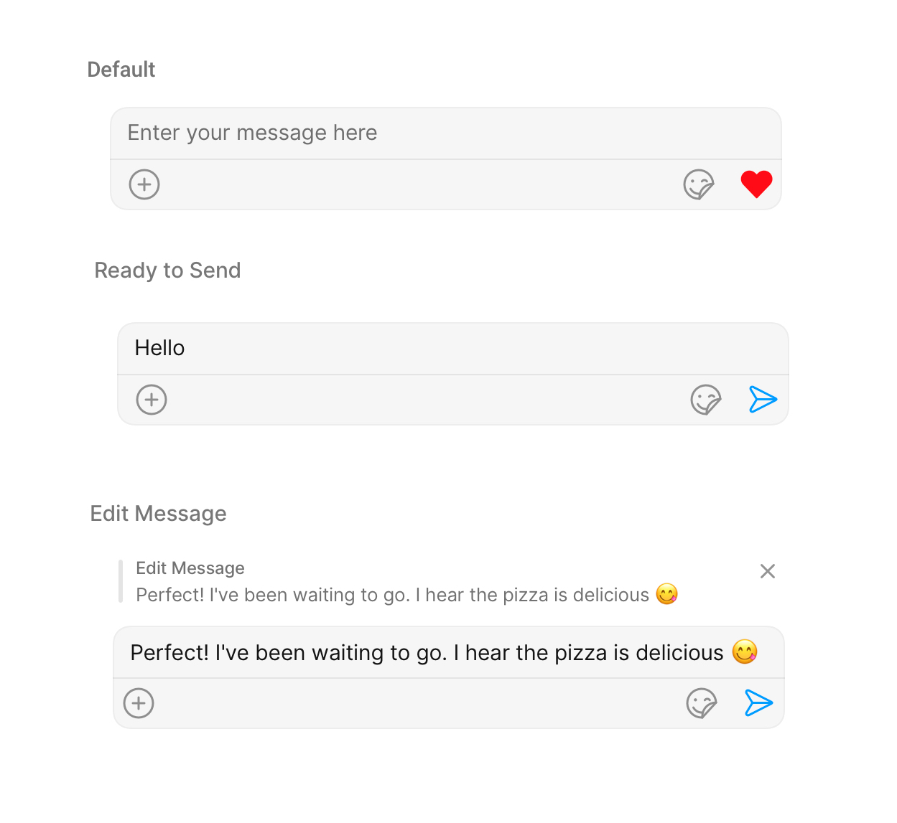

import Tabs from '@theme/Tabs';
import TabItem from '@theme/TabItem';
import { Tooltip } from 'react-tooltip'
import 'react-tooltip/dist/react-tooltip.css'

## Overview

MessageComposer is a [Component](/ui-kit/ios/components-overview#components) that enables users to write and send a variety of messages, including text, image, video, and custom messages.

Features such as **Live Reaction**, **Attachments**, and **Message Editing** are also supported by it.



MessageComposer is comprised of the following [Base Components](/ui-kit/ios/components-overview#base-components):

| Base Components                 | Description                                                                                                            |
| ------------------------------- | ---------------------------------------------------------------------------------------------------------------------- |
| [MessageInput](./message-input) | This provides a basic layout for the contents of this component, such as the TextField and buttons                     |
| [ActionSheet](./action-sheet)   | The ActionSheet component presents a list of options in either a list or grid mode, depending on the user's preference |

## Usage

### Integration

The following code snippet illustrates how you can directly incorporate the MessageComposer component into your file.

```swift
// syntax for set(user: User)
let messageComposer = CometChatMessageComposer()
    messageComposer.set(user: user)
    messageComposer.set(parentMessageId: 20)
```

<!-- :::warning Warning

The MessageComposer is responsible for managing runtime permissions. To ensure the **ActivityResultLauncher** is properly initialized, its object should be created in the the **onCreate** state of an activity. To ensure that the composer is loaded within the fragment, it is important to make sure that the fragment is loaded in the `onCreate` state of the activity.

::: -->

### Actions

[Actions](/ui-kit/ios/components-overview#actions) dictate how a component functions. They are divided into two types: Predefined and User-defined. You can override either type, allowing you to tailor the behavior of the component to fit your specific needs.

##### 1. OnSendButtonClick

The `OnSendButtonClick` event gets activated when the send message button is clicked. The following code snippet Overrides the action of the send button in CometChatMessageComposer.

<Tabs>

<TabItem value="swift" label="Swift">
    ```swift
// syntax for set(sendIcon: UIImage) 
messageComposer.setOnSendButtonClick { message in
 // return custom action here
}
    ```
</TabItem>

</Tabs>

---

### Filters

MessageComposer component does not have any available filters.

---

### Events

[Events](/ui-kit/ios/components-overview#events) are emitted by a `Component`. By using event you can extend existing functionality. Being global events, they can be applied in Multiple Locations and are capable of being Added or Removed.

The MessageComposer Component does not emit any events of its own.

---

## Customization

To fit your app's design requirements, you can customize the appearance of the MessageComposer component. We provide exposed methods that allow you to modify the experience and behavior according to your specific needs.

### Style

Using Style you can customize the look and feel of the component in your app, These parameters typically control elements such as the color, size, shape, and fonts used within the component.

##### 1. MessageComposer Style

To customize the styling, you can apply the `MessageComposerStyle` to the MessageComposer component.

<Tabs>

<TabItem value="swift" label="Swift">

```swift
let messageComposerStyle  = MessageComposerStyle()
let messageComposerConfiguration = MessageComposerConfiguration()
    .set(messageComposerStyle: messageComposerStyle)
```

</TabItem>

</Tabs>

The following properties are exposed by MessageComposerStyle:

<!-- | Property                     | Description                                                | Code                                       |
| ---------------------------- | ---------------------------------------------------------- | ------------------------------------------ |
| **Set BorderWidth**          | Used to set outermost border                               | `.set(borderWidth: CGFloat)	  `             |
| **Border Color**             | Used to set border color                                   | `.set(borderColor: UIColor)`               |
| **Corner Radius**            | Used to set corner radius                                  | `.set(cornerRadius: CometChatCornerStyle)	` |
| **Background**               | This method will set the background color for message list | `.set(background: UIColor)	`                |
| **Set InputBackgroundColor** | Used to set input background color                         | `.set(inputBackground: UIColor)	`           |
| **Set TextAppearance**       | Used to set input text style                               | `.set(textFont: UIFont)	`                   |
| **Set PlaceHolderTextColor** | Used to set placeholder text color                         | `.set(placeHolderTextColor: UIColor)	`      |
| **Set AttachIconTint**       | Used to set attachment icon tint                           | `.set(attachmentIconTint: UIColor)	`        |
| **Set SendIconTint**         | Used to set send button icon tint                          | `.set(sendIconTint: UIColor)	`              |
| **Set DividerTint**          | Used to set separator color                                | `.set(dividerTint: UIColor)	`               | -->

| Property                                | Description                                                              | Method                                           |
| --------------------------------------- | ------------------------------------------------------------------------ | ------------------------------------------------ |
| **Set BorderWidth**                     | Sets the border width for message composer   | `.set(borderWidth: CGFloat)`  |
| **Set BorderColor**                     | Sets the border color for message composer       | `.set(borderColor: UIColor)` |
| **Set CornerRadius**                    | Sets the corner radius for message composer   | `.set(cornerRadius: CometChatCornerStyle)` |
| **Set Background**                      | Sets the background color for message composer  | `.set(background: UIColor)` |
| **Set InputBackgroundColor**            | Sets the input background color of message composer  | `.set(inputBackground: UIColor)` |
| **Set TextFont**                  | Sets the input text font of message composer  | `.set(textFont: UIFont)`  |
| **Set InputBoxPlaceholderFont**         | Sets the placeholder text font for message composer input field  | `.set(inputBoxPlaceholderFont: UIFont)`          |
| **Set PlaceHolderTextColor**            | Sets the placeholder text color for message composer input field                                     | `.set(placeHolderTextColor: UIColor)`            |
| **Set AttachIconTint**                  | Sets the attachment icon tint color  | `.set(attachmentIconTint: UIColor)`              |
| **Set SendIconTint**                    | Sets send button icon tint color   | `.set(sendIconTint: UIColor)`                    |
| **Set SeparatorTint**                     | Sets the separator color for message composer | `.set(separatorTint: UIColor)`                     |
| **Set InputBorderWidth**                | Sets the border width for message composer input view  | `.set(inputBorderWidth: CGFloat)`                |
| **Set InputBorderColor**                |  Sets the border color for message composer input view | `.set(inputBorderColor: UIColor)`                |
| **Set ActionSheetTitleColor**           | Sets the title color for action sheet of message composer | `.set(actionSheetTitleColor: UIColor)`           |
| **Set ActionSheetTitleFont**            | Sets the title font for action sheet of message composer | `.set(actionSheetTitleFont: UIFont)`             |
| **Set ActionSheetLayoutModelIconTint**  | Sets action sheet layout mode icon tint color for message composer | `.set(actionSheetLayoutModelIconTint: UIColor)`  |
| **Set ActionSheetCancelButtonIconTint** | Sets action sheet cancel button icon tint color for message composer | `.set(actionSheetCancelButtonIconTint: UIColor)` |
| **Set ActionSheetCancelButtonIconFont** | Sets the action sheet cancel button icon font color for message composer | `.set(actionSheetCancelButtonIconFont: UIFont)`  |
| **Set ActionSheetSeparatorTint** | Sets the separator color for action sheet items | `.set(actionSheetSeparatorTint: UIColor)` |
| **Set ActionSheetBackground** | Sets the background color of action sheet | `.set(actionSheetBackground: UIColor)` |
| **Set VoiceRecordingIconTint** | Sets the voice recorder icon tint color | `.set(voiceRecordingIconTint: UIColor)` |
| **Set AiIconTint** | Sets the ai icon tint color | `.set(aiIconTint: UIColor)` |
| **Set InfoTextColor** | Sets the text color for info message displayed | `.set(infoTextColor: UIColor)` |
| **Set InfoIconTintColor** | Sets the tint color for info icon | `.set(infoIconTintColor: UIColor)` | 
| **Set InfoBackgroundColor** | Sets the background color for info message view | `.set(infoBackgroundColor: UIColor)` |
| **Set InfoSeparatorColor** | Sets the separator color for info view | `.set(infoSeparatorColor: UIColor)` |


##### 2. MediaRecorder Style

To customize the styles of the MediaRecorder component within the MessageComposer Component, use the `.set(mediaRecorderStyle:)` method. For more details, please refer to [MediaRecorder](/ui-kit/ios/media-recorder) styles.

<Tabs>

<TabItem value="swift" label="Swift">

```swift
let mediaRecorderStyle = MediaRecorderStyle()
    .set(borderColor: .orange)
    .set(borderWidth: 10)

let messageComposerConfiguration = MessageComposerConfiguration()
    .set(mediaRecorderStyle: mediaRecorderStyle)
```

</TabItem>

</Tabs>

The following properties are exposed by MessageComposerStyle:

| Property                     | Description                                                | Code                                       |
| ---------------------------- | ---------------------------------------------------------- | ------------------------------------------ |
| **Set PlayIconTint**         | Sets play voice button tint color   | `.set(playIconTint: UIColor)` |
| **Set StopIconTint**         | Sets stop voice button tint color   | `.set(stopIconTint: UIColor)` |
| **Set PauseIconTint**         | Sets pause voice button tint color   | `.set(pauseIconTint: UIColor)` |
| **Set SubmitIconTint**         | Sets submit voice button tint color   | `.set(submitIconTint: UIColor)`|
| **Set TimerTextColor**         | Sets text color for voice record timer  | `.set(timerTextColor: UIColor)`|
| **Set TimerTextFont**         | Sets text font for voice record timer   | `.set(timerTextFont: UIFont)` |
| **Set DeleteIconTint**         | Sets delete voice button tint color   | `.set(deleteIconTint: UIColor)`|


##### 3. AI Options Style

To customize the styles of the MediaRecorder component within the MessageComposer Component, use the `.set(aiOptionsStyle:)` method. For more details, please refer to [MediaRecorder](/ui-kit/ios/media-recorder) styles.

<Tabs>

<TabItem value="swift" label="Swift">

```swift
let aiOptionsStyle = AIOptionsStyle()
    .set(aiIconTint: .orange)
    .set(buttonBorder: 2)

let messageComposerConfiguration = MessageComposerConfiguration()
    .set(aiOptionsStyle: aiOptionsStyle)
```

</TabItem>

</Tabs>

The following properties are exposed by MessageComposerStyle:

| Property                     | Description                                                | Code                                       |
| ---------------------------- | ---------------------------------------------------------- | ------------------------------------------ |
| **Set AIIconTint**         | Sets ai button tint color   | `.set(aiIconTint: UIColor)` |
| **Set ButtonBorder**         | Sets border for ai options button   | `.set(buttonBorder: CGFloat) ` |
| **Set ButtonBackground**         | Sets background color for ai options button   | `.set(buttonBackground: UIColor)` |
| **Set ButtonTextFont**         | Sets ai options button text font   | `.set(buttonTextFont: UIColor)` |
| **Set ButtonTextColor**         | Sets ai options button text color  | `.set(buttonTextColor: UIColor)`  |
| **Set ButtonBorderColor**         | Sets border color for ai options button   | `.set(buttonBorderColor: UIColor)`  |
| **Set ButtonBorderRadius**         | Sets border radius for ai options button   | `.set(buttonBorderRadius: CGFloat)`  |
| **Set CancelBackground**         | Sets cancel button background color   | `.set(cancelBackground: UIColor)` |
| **Set CancelButtonFont**         | Sets cancel button text font   | `.set(cancelButtonFont: UIFont) ` |
| **Set CancelButtonColor**         | Sets cancel button text color   | `.set(cancelButtonColor: UIColor)` |
| **Set CancelButtonBorder**         | Sets border for cancel button   | `.set(cancelButtonBorder: CGFloat)` |
| **Set CancelButtonBorderColor**         | Sets cancel button border color  | `.set(cancelButtonBorderColor: UIColor)`  |
| **Set CancelButtonBorderRadius**         | Sets border radius for cancel button   | `.set(cancelButtonBorderRadius: CGFloat)`  |
| **Set Background**         | Sets background color for ai options action sheet   | `.set(background: UIColor)`  |
| **Set BorderWidth**         | Sets border width for ai options action sheet   | `.set(borderWidth: CGFloat)`  |
| **Set BorderColor**         | Sets border color for ai options action sheet   | `.set(borderColor: UIColor)`  |
| **Set CornerRadius**         | Sets corner radius for ai options action sheet   | `.set(background: CGFloat)`  |


---

### Functionality

These are a set of small functional customizations that allow you to fine-tune the overall experience of the component. With these, you can change text, set custom icons, and toggle the visibility of UI elements.

<Tabs>

<TabItem value="swift" label="Swift">

```swift
let messageComposer  = CometChatMessageComposer()
    .disable(disableTypingEvents: true)
    .hide(liveReaction: true)
```

</TabItem>

</Tabs>


Below is a list of customizations along with corresponding code snippets

| Property                                                                                                 | Description                                                                                                                                | Code                                                       |
| -------------------------------------------------------------------------------------------------------- | ------------------------------------------------------------------------------------------------------------------------------------------ | ---------------------------------------------------------- |
| **User** <a data-tooltip-id="my-tooltip-html-prop"> <span class="material-icons red">report</span> </a>  | Used to pass user object of which header specific details will be shown                                                                    | `.set(user: User)	`                                         |
| **Group** <a data-tooltip-id="my-tooltip-html-prop"> <span class="material-icons red">report</span> </a> | Used to pass group object of which header specific details will be shown | `.set(group: Group)` |
| **Set Background**  | Sets background color for message composer | `.set(background: UIColor)` |
| **Set PlaceHolderText**  | Sets message composer's placeholder text | `.set(placeholderText: String)` |
| **Set MaxLine**   | Sets limit for lines of text to be displayed in input field | `.set(maxLines: Int)` |
| **Set AuxiliaryButtonAlignment**  | Sets position for auxiliary buttons view , can be **left** or **right** . default is **right**   | `.set(auxiliaryButtonAlignment: AuxiliaryButtonAlignment)` |
| **Set CustomSoundForMessages**  | Sets custom sounds for outgoing messages. | `.set(customSoundForMessage: URL)	` |
| **Set LiveReactionIcon**  | Sets custom live reaction icon. | `.set(LiveReactionIconURL: UIImage)`   |
| **Set Parent MessageId**  | Sets the parentMessageId used in the CometChatMessageComposer for all sub-components. It is used to send messages to the particular thread. | `.set(parentMessageId: Int)` |
| **Set DisableMentions**  | Enables/Disables user mentions in message composer input field. | `.set(disableMentions: Bool)`  |
| **Set InfoIcon**  | Sets image for info icon. | `.set(infoIcon: UIImage)`   |
| **Set AttachmentIcon**  | Sets image for attachment button on message composer. | `.set(attachmentIcon: UIImage)`   |
| **Set AIAuxiliaryIcon**  | Sets image for ai auxillary button. | `.set(aiAuxiliaryIcon: UIImage)`   |
| **Set OnSendButtonClick**  | Sets custom actions for send button click. | `.setOnSendButtonClick()`   |
| **Hide LiveReaction** | Toggles visibility for live reaction component  | `.hide(liveReaction: Bool)` |
| **Hide FooterView** | Toggles visibility for footer view of message composer  | `.hide(footerView: Bool)` |
| **Hide HeaderView** | Toggles visibility for header view of message composer  | `.hide(headerView: Bool)` |
| **Hide SendButton** | Toggles visibility for send button  | `.hide(sendButton: Bool)` |
| **Hide VoiceRecording** | Toggles visibility for voice recorder button  | `.hide(voiceRecording: Bool)` |
| **Disable TypingEvents**  | Used to disable/enable typing events , default value is **false**  | `.disable(disableTypingEvents: Bool)` |
| **Disable SoundForMessages**  | Toggles sound for outgoing messages  | `.disable(disableSoundForMessages: Bool)`  |

---

### Advanced

For advanced-level customization, you can set custom views to the component. This lets you tailor each aspect of the component to fit your exact needs and application aesthetics. You can create and define your views, layouts, and UI elements and then incorporate those into the component.

---

#### SetTextFormatters

Assigns the list of text formatters. If the provided list is not null, it sets the list. Otherwise, it assigns the default text formatters retrieved from the data source. To configure the existing Mentions look and feel check out [CometChatMentionsFormatter](/ui-kit/ios/mentions-formatter-guide)

**Example**


<!--  -->
<Tabs>

<TabItem value="swift" label="Swift">

    ```swift

let composerTextStyle = MentionTextStyle()
.set(textBackgroundColor: .white)
.set(textColor: UIColor.black)
.set(textFont: UIFont.systemFont(ofSize: 18, weight: .heavy))
.set(loggedInUserTextColor: UIColor.systemTeal)
.set(loggedInUserTextFont: UIFont.systemFont(ofSize: 18, weight: .bold))

let customMentionFormatter = CometChatMentionsFormatter()
.set(composerTextStyle: composerTextStyle)

let messageComposerConfiguration = MessageComposerConfiguration()
.set(textFormatter: [customMentionFormatter])

let cometChatMessages = CometChatMessages()
.set(user: user)
.set(messageComposerConfiguration: messageComposerConfiguration)

````

</TabItem>

</Tabs>

#### AttachmentOptions

By using `setAttachmentOptions()`, you can set a list of custom `MessageComposerActions` for the MessageComposer Component. This will override the existing list of `MessageComposerActions`.

<Tabs>

<TabItem value="swift" label="Swift">

```swift
 let messageComposerConfiguration = MessageComposerConfiguration()
    .setAttachmentOptions { user, group, controller in
    }
````

</TabItem>

</Tabs>

**Example**


<!--  -->

In this example, we are overriding the existing MessageComposerActions List with Capture Photo actions.

<Tabs>

<TabItem value="swift" label="Swift">

```swift
let messageComposerConfiguration = MessageComposerConfiguration()
            .setAttachmentOptions { user, group, controller in

let customComposerAction1 = CometChatMessageComposerAction(
                    id: "customAction1",
                    text: "Capture",
                    startIcon: UIImage(systemName: "camera"),
                    endIcon: nil,
                    startIconTint: .blue,
                    endIconTint: nil,
                    textColor: .purple,
                    textFont: .italicSystemFont(ofSize: 15),
                    backgroundColour: .white,
                    borderWidth: 1,
                    borderColor: .gray,
                    onActionClick: {
                        print("Custom Action 1 clicked!")
                    }
                )

return [customComposerAction1 , customComposerAction1, customComposerAction1, customComposerAction1 ]
            }

let cometChatMessages  = CometChatMessages()
            .set(user: user)
            .set(messageComposerConfiguration: messageComposerConfiguration)
```

</TabItem>

</Tabs>

---

#### AuxiliaryButtonView

You can insert a custom view into the MessageComposer component to add additional functionality using the following method.

<Tabs>

<TabItem value="swift" label="Swift">

```swift
let messageComposerConfiguration = MessageComposerConfiguration()
            .setAuxilaryButtonView { user, group in

     }
```

</TabItem>

</Tabs>

Please note that the MessageComposer Component utilizes the AuxiliaryButton to provide sticker functionality. Overriding the AuxiliaryButton will subsequently replace the sticker functionality.

**Example**

<!--  -->

In this example, we'll be adding a custom button with click functionality. You'll first need to create a custom UIView file and then inflate it inside the `.setAuxiliaryButtonView()` function.

```swift title="Swift"
let messageComposerConfiguration = MessageComposerConfiguration()
    .setAuxilaryButtonView { user, group in
        let customView = UIView()
        customView.translatesAutoresizingMaskIntoConstraints = false

        let customButton = UIButton()
        customButton.setImage(UIImage(systemName: "bell"), for: .normal)
        customButton.translatesAutoresizingMaskIntoConstraints = false
        customButton.addTarget(self, action: #selector(self.customButtonClicked), for: .touchUpInside)

        customView.addSubview(customButton)

        NSLayoutConstraint.activate([
        customButton.trailingAnchor.constraint(equalTo: customView.trailingAnchor, constant: -8),
        customButton.centerYAnchor.constraint(equalTo: customView.centerYAnchor),
        customButton.heightAnchor.constraint(equalToConstant: 30),
        customButton.widthAnchor.constraint(equalToConstant: 80)
    ])

    return customView

 }

let cometChatMessages  = CometChatMessages()
    .set(user: user)
    .set(messageComposerConfiguration: messageComposerConfiguration)
```

---

#### SecondaryButtonView

You can add a custom view into the SecondaryButton component for additional functionality using the below method.
<Tabs>

<TabItem value="swift" label="Swift">

```swift
let messageComposerConfiguration = MessageComposerConfiguration()
    .setSecondaryButtonView { user, group in
    }
```

</TabItem>

</Tabs>

Please note that the MessageComposer Component uses the SecondaryButton to open the ComposerActionsList. Overriding the SecondaryButton will replace the ComposerActionsList functionality.

**Example**


<!--  -->

In this example, we'll be adding a custom button with click functionality. You'll first need to create a custom UIView file and then inflate it inside the `.setSecondaryButtonView()` function.

```swift title="swift"
let messageComposerConfiguration = MessageComposerConfiguration()
    .setSecondaryButtonView { user, group in
        let customView = UIView()
        customView.translatesAutoresizingMaskIntoConstraints = false

        let customButton = UIButton()
        customButton.setImage(UIImage(systemName: "bell"), for: .normal)
        customButton.translatesAutoresizingMaskIntoConstraints = false
        customButton.addTarget(self, action: #selector(self.customButtonClicked), for: .touchUpInside)

        customView.addSubview(customButton)

        NSLayoutConstraint.activate([
        customButton.leadingAnchor.constraint(equalTo: customView.leadingAnchor, constant: -20),
        customButton.centerYAnchor.constraint(equalTo: customView.centerYAnchor),
        customButton.heightAnchor.constraint(equalToConstant: 30),
        customButton.widthAnchor.constraint(equalToConstant: 80)
    ])

        return customView
}
 let cometChatMessages  = CometChatMessages()
            .set(user: user)
            .set(messageComposerConfiguration: messageComposerConfiguration)
```

---

#### Set SendButtonView

You can set a custom view in place of the already existing send button view. Using the following method.

<Tabs>

<TabItem value="swift" label="Swift">

```swift
 let messageComposerConfiguration = MessageComposerConfiguration()
            .setSendButtonView { user, group in
     }
```

</TabItem>
</Tabs>

**Example**

<Tabs>

<TabItem value="swift" label="Swift">

```swift
let messageComposerConfiguration = MessageComposerConfiguration()
    .setSendButtonView { user, group in
    let customButton = UIButton()
    customButton.setImage(UIImage(systemName: "bell"), for: .normal)
    customButton.translatesAutoresizingMaskIntoConstraints = false
    customButton.addTarget(self, action: #selector(self.customButtonClicked), for: .touchUpInside)
    return customButton
}
let cometChatMessages  = CometChatMessages()
    .set(user: user)
    .set(messageComposerConfiguration: messageComposerConfiguration)

```

</TabItem>

<TabItem value="" label="">

```

```

</TabItem>

</Tabs>

---

#### HeaderView

You can set custom headerView to the MessageComposer component using the following method

<Tabs>

<TabItem value="swift" label="Swift">

```swift
let messageComposerConfiguration = MessageComposerConfiguration()
    .set(headerView: UIView())
```

</TabItem>

<TabItem value="" label="">

```

```

</TabItem>

</Tabs>

**Example**


<!--  -->

In the following example, we're going to apply a mock smart reply view to the MessageComposer Component using the `.set(headerView: UIView?)	` method.

```swift title="Custom_View_file"
import UIKit

class CustomActionView: UIView {

let actionButton: UIButton

    override init(frame: CGRect) {
        actionButton = UIButton(type: .system)
        actionButton.backgroundColor? = .purple
        actionButton.tintColor = .init(red: 0.41, green: 0.32, blue: 0.84, alpha: 1.00)

        actionButton.setTitle("Smart Replies", for: .normal)
        let image = UIImage(systemName: "arrowshape.turn.up.left.2.fill")
        actionButton.setImage(image, for: .normal)
        actionButton.translatesAutoresizingMaskIntoConstraints = false

        super.init(frame: frame)

        addSubview(actionButton)
        setupButtonConstraints()

        actionButton.addTarget(self, action: #selector(buttonTapped), for: .touchUpInside)
    }

required init?(coder: NSCoder) {
        fatalError("init(coder:) has not been implemented")
    }

private func setupButtonConstraints() {
        NSLayoutConstraint.activate([
            actionButton.leadingAnchor.constraint(equalTo: self.leadingAnchor, constant: 8),
            actionButton.centerYAnchor.constraint(equalTo: self.centerYAnchor)
        ])
    }

@objc private func buttonTapped() {
        print("Button was tapped!")
    }
}

```

<Tabs>

<TabItem value="swift" label="Swift">

```swift
 let messageComposerConfiguration = MessageComposerConfiguration()
    .set(headerView: CustomActionView())

let cometChatMessages = CometChatMessages()
    .set(user: user)
    .set(messageComposerConfiguration: messageComposerConfiguration)

```

</TabItem>

<TabItem value="" label="">

```

```

</TabItem>

</Tabs>
:::info
Ensure to pass and present `cometChatMessages`. If a navigation controller is already in use, utilize the pushViewController function instead of directly presenting the view controller.
:::

---

#### FooterView

You can set a custom footer view to the MessageComposer component using the following method:

<Tabs>

<TabItem value="swift" label="Swift">

```swift
 let messageComposerConfiguration = MessageComposerConfiguration()
    .set(footerView: UIView())
```

</TabItem>

</Tabs>

**Example**


<!--  -->

In the following example, we're going to apply a mock smart reply view to the MessageComposer Component using the `.set(footerView: UIView?)	` method.

```swift title="Custom_View_file"
import UIKit

class CustomActionView: UIView {

let actionButton: UIButton

    override init(frame: CGRect) {
        actionButton = UIButton(type: .system)
        actionButton.backgroundColor? = .purple
        actionButton.tintColor = .init(red: 0.41, green: 0.32, blue: 0.84, alpha: 1.00)

        actionButton.setTitle("Smart Replies", for: .normal)

        let image = UIImage(systemName: "repeat")
        actionButton.setImage(image, for: .normal)
        actionButton.translatesAutoresizingMaskIntoConstraints = false

        super.init(frame: frame)

        addSubview(actionButton)
        setupButtonConstraints()

        actionButton.addTarget(self, action: #selector(buttonTapped), for: .touchUpInside)
    }

    required init?(coder: NSCoder) {
        fatalError("init(coder:) has not been implemented")
    }

    private func setupButtonConstraints() {
        NSLayoutConstraint.activate([
            actionButton.leadingAnchor.constraint(equalTo: self.leadingAnchor, constant: 8),
            actionButton.centerYAnchor.constraint(equalTo: self.centerYAnchor)
        ])
    }

    @objc private func buttonTapped() {
        print("Button was tapped!")
    }
}
```

<Tabs>

<TabItem value="swift" label="Swift">

```swift
let messageComposerConfiguration = MessageComposerConfiguration()
    .set(footerView: CustomActionView())

let cometChatMessages = CometChatMessages()
    .set(user: user)
    .set(messageComposerConfiguration: messageComposerConfiguration)
```

</TabItem>

</Tabs>
:::info
Ensure to pass and present `cometChatMessages`. If a navigation controller is already in use, utilize the pushViewController function instead of directly presenting the view controller.
:::
---

<Tooltip
  id="my-tooltip-html-prop"
  html="Not available in MessageComposerConfiguration"
/>
