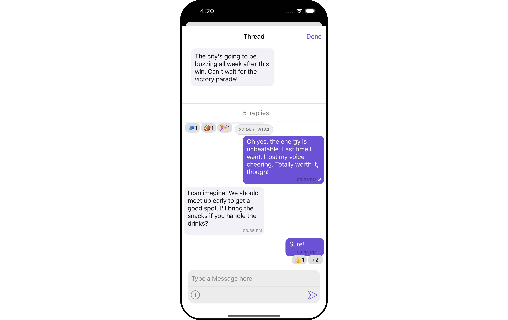
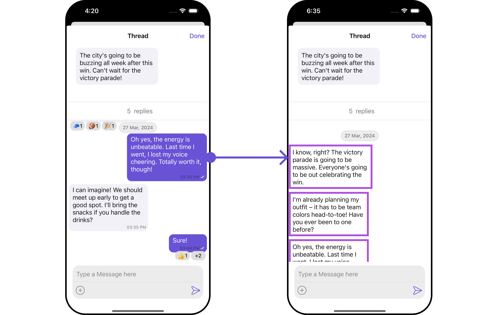
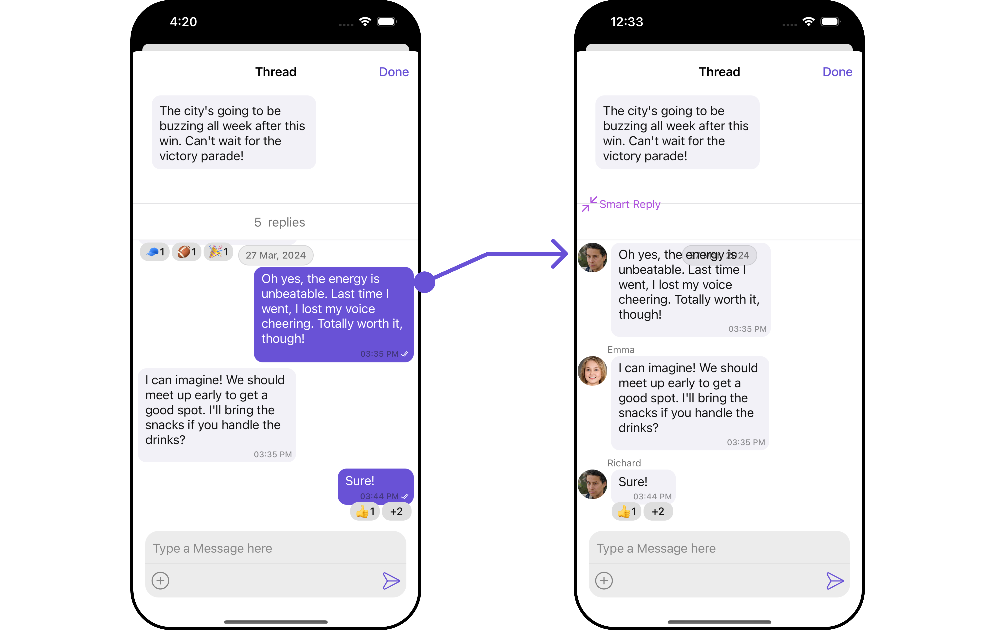
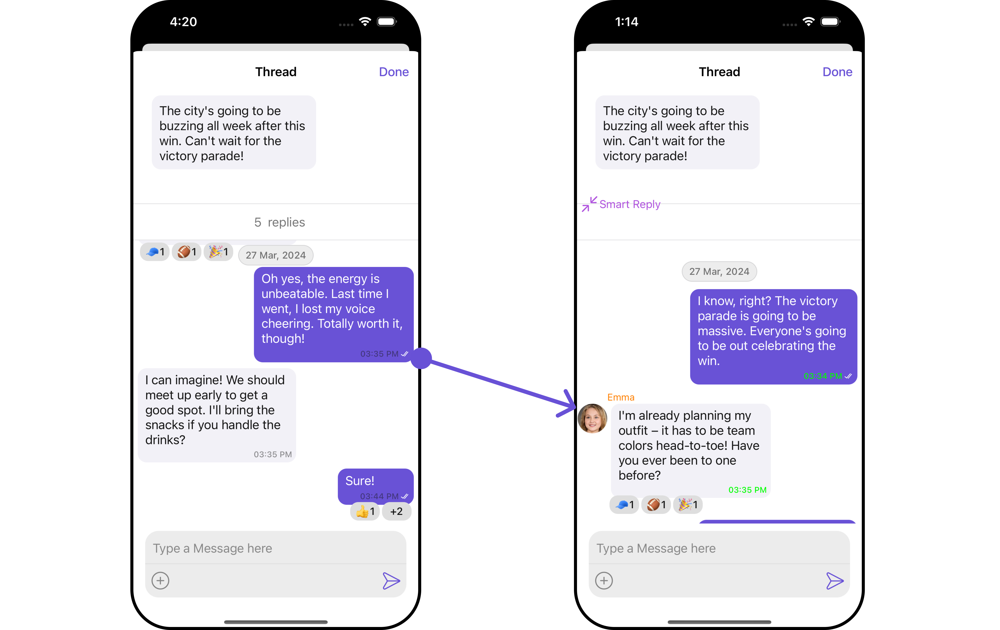
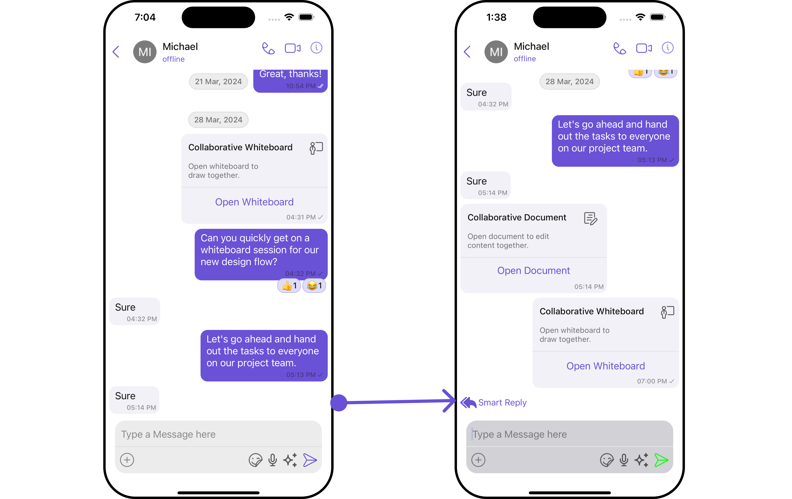

import Tabs from '@theme/Tabs';
import TabItem from '@theme/TabItem';

## Overview

ThreadedMessages is a [Composite Component](/ui-kit/ios/components-overview#composite-components) that displays all replies made to a particular message in a conversation. By default, the parent message will be displayed at the top, the message composer will be at the bottom and between them a message list will contain all replies.



<!--  -->

<!-- CometChatThreadedMessages sets up the following functionality internally:

- sets a message list component and fetches relevant messages
- sets up a message composer that will be used to send messages in the thread -->

ThreadedMessages is composed of the following components:

| Component                                       | Description                                                                                                        |
| ----------------------------------------------- | ------------------------------------------------------------------------------------------------------------------ |
| [MessageList](/ui-kit/ios/message-list)         | CometChatMessageList is a component that displays a list of Messages                                               |
| [MessageComposer](/ui-kit/ios/message-composer) | CometChatMessageComposer is a component that helps in writing and editing of messages and also sending attachments |

## Usage

### Integration

As `CometChatThreadedMessages` is a **view controller**, you can launch it by adding the following code snippet.

<Tabs>
<TabItem value="swift" label="Swift">

```swift
let threadedMessage = CometChatThreadedMessages()
```

</TabItem>
</Tabs>

:::info
Ensure to pass and present `threadedMessage`. If a navigation controller is already in use, utilize the pushViewController function instead of directly presenting the view controller.
:::

---

### Actions

[Actions](/ui-kit/ios/components-overview#actions) dictate how a component functions. They are divided into two types: Predefined and User-defined. You can override either type, allowing you to tailor the behavior of the component to fit your specific needs.

ThreadedMessages does not have its own actions. However, you can override the behavior of the ThreadedMessages component by using the actions of its Components, with the help of [Configurations](/ui-kit/ios/components-overview#configurations).

**Example**

In this example, we are overriding the `setOnThreadRepliesClick` of the MessageList Component using `MessageListConfiguration` and applying it to ThreadedMessages.

<Tabs>

<TabItem value="swift" label="Swift">

```swift
let messageListConfiguration = MessageListConfiguration()
    .setOnThreadRepliesClick { message, messageBubbleView in
                // Perform your action
     }

let threadedMessageConfiguration = ThreadedMessageConfiguration()
    .set(messageListConfiguration: messageListConfiguration)

let cometChatMessages  = CometChatMessages()
    .set(user: user)
    .set(threadedMessageConfiguration: threadedMessageConfiguration)
```

</TabItem>

</Tabs>

---

### Filters

**Filters** allow you to customize the data displayed in a list within a Component. You can filter the list based on your specific criteria, allowing for a more customized. Filters can be applied using RequestBuilders of Chat SDK.

ThreadedMessages does not have its own Filters. However, you can filter the messages list in ThreadedMessages Component using [MessageListConfiguration](#configuration).

**Example**

In this example, we are filtering messages and searching for messages that contain the keyword "payment".

<Tabs>

<TabItem value="swift" label="Swift">
```swift
let messageRequestBuilder =  MessagesRequest.MessageRequestBuilder()
.set(uid: "your UID")
.set(searchKeyword: "sure")
    
let messageListConfiguration = MessageListConfiguration()
.set(messagesRequestBuilder: messageRequestBuilder)

let threadedMessageConfiguration = ThreadedMessageConfiguration()
.set(messageListConfiguration: messageListConfiguration)

let cometChatMessages = CometChatMessages()
.set(messageListConfiguration: messageListConfiguration)
.set(user: user)
.set(threadedMessageConfiguration: threadedMessageConfiguration)

````
</TabItem>


</Tabs>

---

### Events

[Events](/ui-kit/ios/components-overview#events) are emitted by a `Component`. By using event you can extend existing functionality. Being global events, they can be applied in Multiple Locations and are capable of being Added or Removed.

The MessageList Component does not emit any events of its own.

---

## Customization

To fit your app's design requirements, you can customize the appearance of the conversation component. We provide exposed methods that allow you to modify the experience and behavior according to your specific needs.

---

### Style
`ThreadedMessagesStyle` contains various properties which can be used to customize the UI of `CometChatThreadedMessages`.

<Tabs>

<TabItem value="swift" label="Swift">
```swift
let threadedMessagesStyle = ThreadedMessagesStyle()
                            .set(doneButtonTextColor: .brown)
                            .set(background: .white)
                            .set(bubbleViewPrimaryBackgroundColor: .blue)
                            .set(bubbleViewSecondaryBackgroundColor: .gray)

````

</TabItem>

</Tabs>

List of properties available for configuring in ThreadedMessagesStyle:

| Property                               | Description                                                                                                                                                                             | Code                                               |
| -------------------------------------- | --------------------------------------------------------------------------------------------------------------------------------------------------------------------------------------- | -------------------------------------------------- |
| **doneButtonTextColor**                | allows to modify the color of the text in the done button. Defaults to CometChatTheme.palatte.primary.                                                                                  | `.set(doneButtonTextColor:UIColor)`                |
| **doneButtonTextFont**                 | allows to modify the font of the text in the done button                                                                                                                                | `.set(doneButtonTextFont:UIFont)`                  |
| **background**                         | Used to customize the background color. Defaults to `CometChatTheme.palatte.background`.                                                                                                | `.set(background:UIColor)`                         |
| **actionItemTitleFont**                | allows to modify the font of the title in the action item view                                                                                                                          | `.set(actionItemTitleFont:UIFont)`                 |
| **actionItemTitleColor**               | allows to modify the color of the title in the action item view                                                                                                                         | `.set(actionItemTitleColor:UIColor)`               |
| **bubbleViewBackgroundColor**          | Used to set background color of the bubble view for a message that has been received or a message other than text that has been sent . Defaults to `CometChatTheme.palatte.background`. | `.set(bubbleViewBackgroundColor:UIColor)`          |
| **bubbleViewPrimaryBackgroundColor**   | Used to set background color of the bubble view for a text message that has been sent. Defaults to `CometChatTheme.palatte.primary`.                                                    | `.set(bubbleViewPrimaryBackgroundColor:UIColor)`   |
| **bubbleViewSecondaryBackgroundColor** | Used to set background color of the bubble view for a message that has been received or a message other than text that has been sent. Defaults to `CometChatTheme.palatte.secondary`.   | `.set(bubbleViewSecondaryBackgroundColor:UIColor)` |
| **actionItemBackgroundColor**          | allows to modify the background color of the action item view. Defaults to `CometChatTheme.palatte.background`.                                                                         | `.set(actionItemBackgroundColor:UIColor)`          |

### Advanced

For advanced-level customization, you can set custom views to the component. This lets you tailor each aspect of the component to fit your exact needs and application aesthetics. You can create and define your views, layouts, and UI elements and then incorporate those into the component.

#### MessageBubbleView

By using `.set(templates: allTempalte)`, You can set styling to message bubble view inside ThreadedMessage Component.

<Tabs>

<TabItem value="swift" label="Swift">

```swift
let messageListConfiguration = MessageListConfiguration()
    .set(templates: allTemplates)

let threadedMessageConfiguration = ThreadedMessageConfiguration()
    .set(messageListConfiguration: messageListConfiguration)

let cometChatMessages  = CometChatMessages()
    .set(threadedMessageConfiguration: threadedMessageConfiguration)
    .set(user: user)
```

</TabItem>

</Tabs>

**Example**



<!--  -->

In this example, we will set styling to message bubble view which we get from `setOnThreadRepliesClick` Action of MessageList Component and apply custom styles on it.

<Tabs>

<TabItem value="swift" label="Swift">

```swift
let messageListStyle = MessageListStyle()
    .set(threadReplySeperatorColor: .cyan)
    .set(timestampTextColor: .green)

let cometChatCornerStyle = CometChatCornerStyle.init(cornerRadius: 11)

var allTemplates = CometChatUIKit.getDataSource().getAllMessageTemplates()
if let textIndex = allTemplates.firstIndex(where: { $0.type == "text" }) {
var textTemplate = allTemplates[textIndex]
textTemplate.bubbleView = { baseMessage, messageBubbleAlignment, controller in

let textMessageStyle = TextBubbleStyle()
    .set(borderWidth: 5)
    .set(borderColor: .systemPurple)

let textBubbleView = CometChatUIKit.getDataSource().getTextMessageBubble(messageText: nil, message: baseMessage as? TextMessage, controller: controller, alignment: messageBubbleAlignment, style: textMessageStyle)

    return textBubbleView
    }
    allTemplates[textIndex] = textTemplate
 }

let messageListConfiguration = MessageListConfiguration()
    .set(alignment: .leftAligned)
    .set(messageListStyle: messageListStyle)
    .set(templates: allTemplates)

let threadedMessageConfiguration = ThreadedMessageConfiguration()
    .set(backIcon: UIImage(systemName: "checkmark")!)
    .set(messageListConfiguration: messageListConfiguration)

let cometChatMessages  = CometChatMessages()
    .set(threadedMessageConfiguration: threadedMessageConfiguration)
    .set(user: user)
```

</TabItem>

</Tabs>

#### MessageActionView

By utilizing the `setMessageActionView()` method, you can assign custom actions to the parent message bubble view inside the ThreadedMessage Component.

<Tabs>

<TabItem value="swift" label="Swift">
```swift
 let threadedMessageConfiguration = ThreadedMessageConfiguration()
    .setMessageActionView { message in

        }

````
</TabItem>


</Tabs>

**Example**

<!--  -->

In this example, we are setting mock smart reply view to parent message bubble in ThreadedMessages Component.

```swift title="custom_action_view"
class CustomActionView: UIView {

let actionButton: UIButton

override init(frame: CGRect) {
        actionButton = UIButton(type: .system)
        actionButton.backgroundColor? = .purple
        actionButton.tintColor = .systemPurple

        actionButton.setTitle("Smart Reply", for: .normal)

let image = UIImage(systemName: "arrow.up.forward.and.arrow.down.backward")
        actionButton.setImage(image, for: .normal)

        actionButton.translatesAutoresizingMaskIntoConstraints = false

        super.init(frame: frame)

        addSubview(actionButton)
        setupButtonConstraints()

        actionButton.addTarget(self, action: #selector(buttonTapped), for: .touchUpInside)
}

    required init?(coder: NSCoder) {
        fatalError("init(coder:) has not been implemented")
    }

private func setupButtonConstraints() {
        NSLayoutConstraint.activate([
            actionButton.leadingAnchor.constraint(equalTo: self.leadingAnchor, constant: 8),
            actionButton.centerYAnchor.constraint(equalTo: self.centerYAnchor)
        ])
    }

    @objc private func buttonTapped() {
        print("Button was tapped!")
    }
}
````

<Tabs>

<TabItem value="swift" label="Swift">
```swift
let messageListConfiguration = MessageListConfiguration()
    .set(alignment: .standard)

let threadedMessageConfiguration = ThreadedMessageConfiguration()
.set(backIcon: UIImage(systemName: "checkmark")!)
.set(messageListConfiguration: messageListConfiguration)
.setMessageActionView { message in
let customactionView = CustomActionView()
return customactionView
}

let cometChatMessages = CometChatMessages()
.set(threadedMessageConfiguration: threadedMessageConfiguration)
.set(user: user)

```
</TabItem>

<TabItem value="" label="">

```

````

</TabItem>

</Tabs>

---

## Configuration

Configurations offer the ability to customize the properties of each individual component within a Composite Component.

The ThreadedMessages is a Composite Component, and it has a distinct set of configurations for each of its components as follows.

### MessageList

If you want to customize the properties of the [MessageList](./03-message-list.md) Component inside ThreadedMessages Component, you need use the `MessageListConfiguration` object.

<Tabs>

<TabItem value="swift" label="Swift">

```swift
let messageListConfiguration = MessageListConfiguration()

let threadedMessageConfiguration = ThreadedMessageConfiguration()
    .set(messageListConfiguration: messageListConfiguration)
````

</TabItem>

</Tabs>

The `MessageListConfiguration` provides access to all the [Action](/ui-kit/ios/message-list#style), [Filters](/ui-kit/ios/message-list#filters), [Styles](/ui-kit/ios/message-list#style), [Functionality](/ui-kit/ios/message-list#functionality), and [Advanced](//ios-chat-ui-kit/message-list#advanced) properties of the [MessageList](/ui-kit/ios/message-list) component.

> Please note that the properties marked with the <a><span class="material-icons red">report</span></a> symbol are not accessible within the Configuration Object.

**Example**


<!--  -->

In this example, we will be changing the list alignment and modifying the message bubble styles in the [MessageList](/ui-kit/ios/message-list) component using `MessageListConfiguration`.

<Tabs>

<TabItem value="swift" label="Swift">

```swift
let messageListStyle  = MessageListStyle()
    .set(nameTextColor: .orange)
    .set(timestampTextColor: .green)
    .set(borderColor: .cyan)
    .set(borderWidth: 12)
    .set(threadReplyTextColor: .red)

let messageListConfiguration = MessageListConfiguration()
    .set(alignment: .standard)
    .set(leftThreadIcon: UIImage(systemName: "bell")!)
    .set(messageListStyle: messageListStyle)

let threadedMessageConfiguration = ThreadedMessageConfiguration()
    .set(backIcon: UIImage(systemName: "checkmark")!)
    .set(messageListConfiguration: messageListConfiguration)

let cometChatMessages  = CometChatMessages()
    .set(threadedMessageConfiguration: threadedMessageConfiguration)
    .set(user: user)
```

</TabItem>

</Tabs>

---

### MessageComposer

If you want to customize the properties of the [MessageComposer](/ui-kit/ios/message-composer) Component inside ThreadedMessages Component, you need use the `MessageComposerConfiguration` object.

<Tabs>

<TabItem value="swift" label="Swift">

```swift
let messageComposerConfiguration = MessageComposerConfiguration()

let cometChatMessages  = CometChatMessages()
    .set(messageComposerConfiguration: messageComposerConfiguration)
```

</TabItem>

</Tabs>

The `MessageComposerConfiguration` provides access to all the [Action](/ui-kit/ios/message-composer#style), [Filters](/ui-kit/ios/message-composer#filters), [Styles](/ui-kit/ios/message-composer#style), [Functionality](/ui-kit/ios/message-composer#functionality), and [Advanced](/ui-kit/ios/message-composer#advanced) properties of the [MessageComposer](/ui-kit/ios/message-composer) component.

> Please note that the properties marked with the <a><span class="material-icons red">report</span></a> symbol are not accessible within the Configuration Object.

**Example**


<!--  -->

In this example, we'll be adding a custom header view and customizing some properties of the [MessageComposer](/ui-kit/ios/message-composer) component using `MessageComposerConfiguration`.

<Tabs>

<TabItem value="swift" label="Swift">

```swift
let messageComposerStyle  = MessageComposerStyle()
    .set(inputBorderColor: .systemCyan)
    .set(textColor: .systemBrown)
    .set(background: .yellow)
    .set(sendIconTint: .green)
    .set(inputBackground: .systemGray4)

let messageComposerConfiguration = MessageComposerConfiguration()
    .set(messageComposerStyle: messageComposerStyle)
    .set(headerView: CustomActionView()) // You can pass your own custom view

let messageListStyle  = MessageListStyle()
    .set(nameTextColor: .orange)
    .set(timestampTextColor: .green)
    .set(borderColor: .cyan)
    .set(borderWidth: 12)
    .set(threadReplyTextColor: .red)

let messageListConfiguration = MessageListConfiguration()
    .set(alignment: .standard)
    .set(leftThreadIcon: UIImage(systemName: "bell")!)
    .set(messageListStyle: messageListStyle)

let cometChatMessages  = CometChatMessages()
    .set(user: user)
    .set(messageComposerConfiguration: messageComposerConfiguration)
```

</TabItem>
</Tabs>

import { Tooltip } from 'react-tooltip'
import 'react-tooltip/dist/react-tooltip.css'

<Tooltip
  id="my-tooltip-html-prop"
  html="Not available in ThreadedMessagesConfiguration"
/>

```

```
