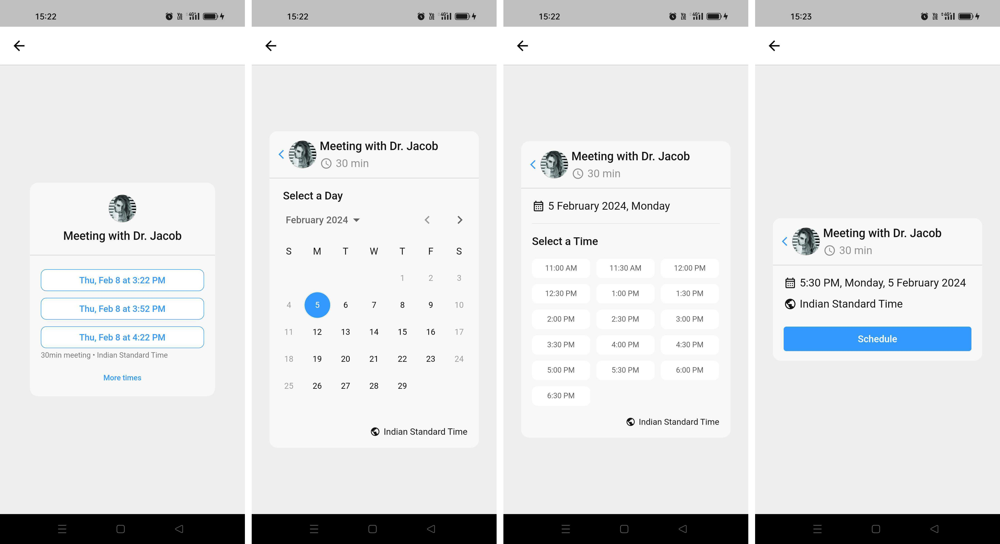

import Tabs from '@theme/Tabs';
import TabItem from '@theme/TabItem';

CometChatSchedulerBubble is a versatile type of message widget designed to facilitate easy and efficient event scheduling. It offers the following key features:

1. **Event Scheduling:** Users can send a calendar-like invitation, similar to `Calendly`, allowing the recipient to schedule a meeting conveniently.
2. **Flexible event Parameters**: Senders have the flexibility to set allowed event times and define the time intervals between consecutive events.
3. **Customisable Availability Hours**: Message senders can personalise their availability by specifying a range of hours during which meetings can be scheduled.
4. **ICS File Integration**: Seamlessly integrates with ICS files, analysing the data to provide users with available time slots based on their free time.
5. **Developer Configuration**: As a developer, you have the freedom to configure actions triggered upon scheduling button clicks. This ensures that the platform can be tailored to specific needs and workflows.

`CometChatSchedulerBubble` aims to streamline the event scheduling process, offering a user-friendly experience for both senders and recipients. With its robust features, it provides a dynamic solution for coordinating and managing meetings efficiently.



## Properties

| Properties                | Type                                                            | Description                                                                                                                                                                                                               |
| ------------------------- | --------------------------------------------------------------- | ------------------------------------------------------------------------------------------------------------------------------------------------------------------------------------------------------------------------- |
| **message**               | SchedulerMessage                                                | An instance of the `SchedulerMessage` class which holds information about the event scheduling availability.                                                                                                              |
| **style**                 | SchedulerBubbleStyle                                            | An object of styles for customizing the UI of the meeting bubble. You can override styles for the wrapper, title, goal completion text, schedule button, etc. If a style is not provided, the default style will be used. |
| **onScheduleClick**       | ((_ dateTime: String?, _ message: SchedulerMessage) -&gt; Void) | The provided parameter is responsible for managing the on-click callback functionality. By default, this parameter initiates a call to the specified URL as outlined in the example below                                 |
| **timeSlotSelectorStyle** | TimeSlotSelectorStyle                                           | accepts an object of TimeSlotSelectorStyle which is used to customize the appearance of CometChatTimeSlotSelector                                                                                                         |

## SchedulerBubbleStyle

`SchedulerBubbleStyle` is a class extending `BaseStyle` containing attributes to customize the appearance of the `CometChatSchedulerBubble` component.

| Properties           | Type                 | Description                                                             |
| -------------------- | -------------------- | ----------------------------------------------------------------------- |
| **background**       | UIColor              | used to set the background color                                        |
| **borderWidth**      | CGFloat              | used to set border                                                      |
| **cornerRadius**     | CometChatCornerStyle | used to set border radius                                               |
| **borderColor**      | UIColor              | used to set border color                                                |
| **avatarStyle**      | AvatarStyle          | used to set the style for the avatar in the scheduler bubble            |
| **messageTintColor** | UIColor              | used to set the tint color for overall message.                         |
| **titleFont**        | UIFont               | used to set the title font                                              |
| **lisItemStyle**     | ListItemStyle        | used to style header View of all the views inside the message bubble    |
| **dividerTint**      | UIColor              | used to set tint color for divider in message bubble                    |
| **titleTint**        | UIColor              | used to set the tint color for messgae title                            |
| **deactivatedTint**  | UIColor              | used to set tint color when the message in not intractable to the user. |

## Usage

CometChatSchedulerBubble allows for a dynamic combination of developer-provided data and data collected from the user's interaction. It provides flexibility for developers to customize the behaviour of the scheduler button and integrate it seamlessly into their application.

```swift
let schedulerMessage = SchedulerMessage()
schedulerMessage.duration = 60
schedulerMessage.title = "Meet Dr. Jackob"
schedulerMessage.bufferTime = 15
schedulerMessage.avatarURL = "https:__encrypted-tbn0.gstatic.com_images?q=tbn:ANd9GcRdRz0HEBl1wvncmX6rU8wFrRDxt2cvn2Dq9w&usqp=CAU"
schedulerMessage.goalCompletionText = "Meeting Scheduled Successfully!!"
schedulerMessage.timezoneCode = TimeZone.current.identifier
schedulerMessage.dateRangeStart = Int(Date().timeIntervalSince1970)
schedulerMessage.dateRangeEnd = Int(Date().addingTimeInterval(30 * 24 * 60 * 60).timeIntervalSince1970)
schedulerMessage.receiverUid = "cometchat-uid-1"
schedulerMessage.receiverType = .user
schedulerMessage.availability = [
    "monday": [TimeRange(startTime: "0000", endTime: "1359")],
    "tuesday": [TimeRange(startTime: "0000", endTime: "1559")],
    "wednesday ": [TimeRange(startTime: "0000", endTime: "0659")],
    "thuesday": [TimeRange(startTime: "0000", endTime: "0959")],
    "friday": [TimeRange(startTime: "0000", endTime: "1059")],
]

let clickAction = APIAction()
clickAction.url = "https:__abc.com"
clickAction.payLoad = ["isPayloadPresent": true]

let scheduleElement = ButtonElement(elementType: .button, elementID: "21", clickAction: clickAction, buttonText: "Submit")
schedulerMessage.scheduleElement = scheduleElement


let schedulerBubble = CometChatSchedulerBubble()
    .set(style: schedulerBubbleStyle)
    .set(message: schedulerMessage)

schedulerBubble.translatesAutoresizingMaskIntoConstraints = false
self.addSubView(schedulerBubble)
```

### SchedulerBubble Triggered Request to Endpoint

After user interaction, the `SchedulerBubble` generates a request to the specified endpoint i.e upon clicking the schedule button. Like in above example scheduler bubble will trigger a POST request to abc.com

The request includes the following payload and headers:

#### Headers:

```json
{
  "accept": "application_json",
  "content-type": "application_json"
}
```

#### Payload:

```json
{
  "appID": "XXXX",
  "region": "XX",
  "trigger": "ui_message_interacted",
  "payload": {
    "key1": "value1"
  },
  "data": {
    "conversationId": "user1_user_user4",
    "sender": "user1",
    "receiver": "user4",
    "receiverType": "user",
    "messageCategory": "interactive",
    "messageType": "scheduler",
    "messageId": 373,
    "interactionTimezoneCode": "Asia_Kolkata",
    "interactedBy": "user4",
    "interactedElementId": "1",
    "schedulerData": {
      "meetStartAt": "2024-02-15T01:00",
      "duration": 60
    }
  }
}
```

| Properties              | Description                                                                                                    |
| ----------------------- | -------------------------------------------------------------------------------------------------------------- |
| meetStartAt             | time slot selected by user                                                                                     |
| duration                | duration for the meeting                                                                                       |
| `appID`                 | app id of the application                                                                                      |
| `region`                | The text message                                                                                               |
| `payload`               | The type of the receiver- `CometChatReceiverType.user` (user) or `CometChatReceiverType.group` (group)         |
| conversationId          | The type of the message that needs to be sent which in this case can be: `CometChatMessageType.text`\_\_(text) |
| sender                  | `UID` of the message sender                                                                                    |
| receiver                | `UID` of the user or `GUID` of the group receiving the message                                                 |
| receiverType            | The type of the receiver- `CometChatReceiverType.user` (user) or `CometChatReceiverType.group` (group)         |
| messageCategory         | The category of the message - MessageCategoryConstants.interactive                                             |
| messageType             | The type of message which is MessageTypeConstants.scheduler                                                    |
| messageId               | The id of the message                                                                                          |
| interactionTimezoneCode | The time zone of user's device                                                                                 |
| interactedBy            | The User id of interacting user                                                                                |
| interactedElementId     | The element id of element making the requiest                                                                  |

:::info

if header is provided in the action meeting bubble will not add anything to the header while generating the request

:::
