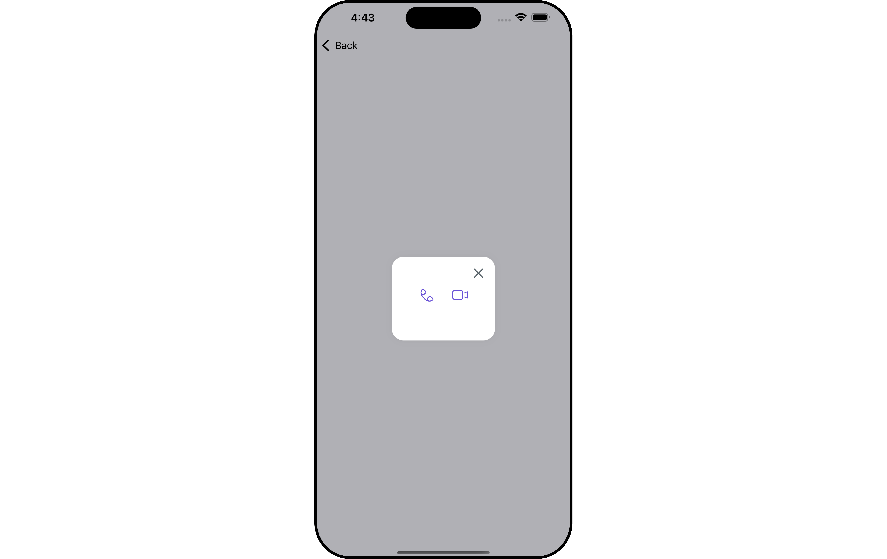

import Tabs from '@theme/Tabs';
import TabItem from '@theme/TabItem';

## Overview

<!-- `CometChatCallButton` is a independent component used to set up a screen that shows the call buttons for particular user or group object. -->

The `Call Button` is a [Component](/ui-kit/ios/components-overview#components) provides users with the ability to make calls, access call-related functionalities, and control call settings. Clicking this button typically triggers the call to be placed to the desired recipient.



---

<!--  -->

---

## Usage

### Integration

Since `CometChatCallButton` is a **custom view**, it offers flexibility in integration. It can be easily added to any view or embedded within other components, enhancing user interactions and providing seamless access to call functionalities.

<Tabs>
<TabItem value="swift" label="Swift">

```swift
let user =  User(uid: "your-uid", name: "")

let cometChatCallButton = CometChatCallButtons(width: 2, height: 4)
    cometChatCallButton.set(user: user)
    container.addSubview(cometChatCallButton)
```

</TabItem>

</Tabs>

---

### Actions

[Actions](/ui-kit/ios/components-overview#actions) dictate how a component functions. They are divided into two types: Predefined and User-defined. You can override either type, allowing you to tailor the behavior of the component to fit your specific needs.

##### 1. SetOnVoiceCallClick

The `setOnVoiceCallClick` action is usually invoked when a voice call is initiated, executing predefined actions. However, by utilizing the provided code snippet, you can effortlessly tailor or override this default behavior to suit your unique requirements.

<Tabs>

<TabItem value="swift" label="Swift">
    ```swift
let cometChatCallButton = CometChatCallButtons(width: 2, height: 4)
    .setOnVoiceCallClick { user, group in
    //Perform Your Action
     
}
    ```
</TabItem>

</Tabs>

##### 2. SetOnVideoCallClick

The `setOnVideoCallClick` action is typically triggered when a video call is initiated, executing default actions. However, with the provided code snippet, you have the flexibility to easily customize or override this default behavior according to your specific preferences or requirements.

<Tabs>

<TabItem value="swift" label="Swift">
    ```swift
let cometChatCallButton = CometChatCallButtons(width: 2, height: 4)
    .setOnVideoCallClick { user, group in
    //Perform Your Action
      
}
    ```
</TabItem>

</Tabs>

##### 3. SetOnError

You can customize this behavior by using the provided code snippet to override the `On Error` and improve error handling.

<Tabs>

<TabItem value="swift" label="Swift">
```swift title=""
let cometChatCallButton = CometChatCallButtons(width: 2, height: 4)
    .setOnError { error in
    //Perform Your Action

}

````
</TabItem>

</Tabs>


---


### Filters

**Filters** allow you to customize the data displayed in a list within a Component. You can filter the list based on your specific criteria, allowing for a more customized. Filters can be applied using RequestBuilders of Chat SDK.

The CallButton component does not have any exposed filters.

---

### Events


[Events](/ui-kit/ios/components-overview#events) are emitted by a `Component`. By using event you can extend existing functionality. Being global events, they can be applied in Multiple Locations and are capable of being Added or Removed.

<!-- The `CallButton` component does not have any exposed Events. -->

Events emitted by the Call buttons component is as follows.

| Event                | Description                                                                                                                       |
| -------------------- | --------------------------------------------------------------------------------------------------------------------------------- |
| **onOutgoingCallAccepted**  |Triggers when the  outgoing call is accepted.|
| **onOutgoingCallRejected**  |Triggers when the outgoing call is rejected.|


<Tabs>

<TabItem value="swift" label="Add Listener">

```swift
// View controller from your project where you want to listen events.
public class ViewController: UIViewController {

   public override func viewDidLoad() {
        super.viewDidLoad()

       // Subscribing for the listener to listen events from user module
        CometChatCallEvents.addListener("UNIQUE_ID", self as CometChatCallEventListener)
    }

}
 // Listener events from user module
extension  ViewController: CometChatCallEventListener {

    func onOutgoingCallAccepted(call: Call) {
        // Do Stuff
    }

    func onOutgoingCallRejected(call: Call){
        // Do Stuff
    }

    func onCallEnded(call: Call) {
        // Do Stuff
    }
}
````

<TabItem value="swift" label="">

```swift title='Emitting Group Events'
//emit this when the other user accepts the call
CometChatCallEvents.emitOnOutgoingCallAccepted(call: Call)

//emit this when the other user rejects a call
CometChatCallEvents.emitOnOutgoingCallRejected(call: Call)

//emit this when logged in user cancels a call
CometChatCallEvents.emitOnCallEnded(call: Call)
```

</TabItem>

</TabItem>

</Tabs>

---

<Tabs>

<TabItem value="swift" label="Remove Listener">

```swift title='View Controller'
public override func viewWillDisappear(_ animated: Bool) {
      // Uncubscribing for the listener to listen events from user module
      CometChatCallEvents.removeListener("LISTENER_ID_USED_FOR_ADDING_THIS_LISTENER")
}
```

</TabItem>

</Tabs>

---

## Customization

To fit your app's design requirements, you can customize the appearance of the conversation component. We provide exposed methods that allow you to modify the experience and behavior according to your specific needs.

### Style

Using Style you can customize the look and feel of the component in your app, These parameters typically control elements such as the color, size, shape, and fonts used within the component.

##### 1. CallButtons Style

You can customize the appearance of the `CallButtons` Component by applying the `ButtonStyle` to it using the following code snippet.

<Tabs>
<TabItem value="swift" label="Swift">

```swift
let buttonStyle = ButtonStyle()
.set(background: .red)
.set(textFont: .systemFont(ofSize: 18))
.set(textColor: .systemTeal)
.set(cornerRadius: CometChatCornerStyle(cornerRadius: 8.0))
.set(borderColor: .systemBlue)
.set(borderWidth: 5)
.set(iconBackground: .systemTeal)
.set(iconBorder: 6)
.set(iconCornerRadius: 10)
.set(iconTint: .blue)

let cometChatCallButton = CometChatCallButtons(width: 2, height: 4)
.set(callButtonsStyle: buttonStyle)

```

</TabItem>

</Tabs>

List of properties exposed by ButtonStyle

| Property                 | Description                        | Code                                       |
| ------------------------ | ---------------------------------- | ------------------------------------------ |
| **set Background**       | Sets the background color          | `.set(background: UIColor)`                |
| **set TextFont**         | Sets the font of the text          | `.set(textFont: UIFont)`                   |
| **set TextColor**        | Sets the color of the text         | `.set(textColor: UIColor)`                 |
| **set CornerRadius**     | Sets the corner radius             | `.set(cornerRadius: CometChatCornerStyle)` |
| **set BorderColor**      | Sets the color of the border       | `.set(borderColor: UIColor)`               |
| **set BorderWidth**      | Sets the width of the border       | `.set(borderWidth: CGFloat)`               |
| **set IconBackground**   | Sets the background of the icon    | `.set(iconBackground: UIColor)`            |
| **set IconBorder**       | Sets the border of the icon        | `.set(iconBorder: CGFloat)`                |
| **set IconCornerRadius** | Sets the corner radius of the icon | `.set(iconCornerRadius: CGFloat)`          |
| **set IconTint**         | Sets the tint of the icon          | `.set(iconTint: UIColor)`                  |

---

### Functionality

These are a set of small functional customizations that allow you to fine-tune the overall experience of the component. With these, you can change text, set custom icons, and toggle the visibility of UI elements.

<Tabs>

<TabItem value="swift" label="Swift">

```swift
let cometChatCallButton = CometChatCallButtons(width: 2, height: 4)
    .hide(videoCall: true)
    .hide(voiceCall: true)
    .set(user: user)
```

</TabItem>

</Tabs>

Below is a list of customizations along with corresponding code snippets

| Property              | Description                                    | Code                                  |
| --------------------- | ---------------------------------------------- | ------------------------------------- |
| **Hide VideoCall**    | Hides the video call button                    | `.hide(videoCall: Bool)`              |
| **Hide VoiceCall**    | Hides the voice call button                    | `.hide(voiceCall: Bool)`              |
| **Controller**        | Sets the view controller                       | `.set(controller: UIViewController?)` |
| **Group**             | Sets the Group object for CometChatCallButtons | `.set(group: Group)`                  |
| **IsCenterAligned**   | Sets the alignment of the buttons              | `.set(isCenterAligned: Bool)`         |
| **User**              | Sets the User object for CometChatCallButtons  | `.set(user: User)`                    |
| **VideoCallIcon**     | Sets the icon for the video call button        | `.set(videoCallIcon: UIImage)`        |
| **VideoCallIconText** | Sets the text for the video call button        | `.set(videoCallIconText: String)`     |
| **VoiceCallIcon**     | Sets the icon for the voice call button        | `.set(voiceCallIcon: UIImage)`        |
| **VoiceCallIconText** | Sets the text for the voice call button        | `.set(voiceCallIconText: String)`     |

### Advanced

For advanced-level customization, you can set custom views to the component. This lets you tailor each aspect of the component to fit your exact needs and application aesthetics. You can create and define your views, layouts, and UI elements and then incorporate those into the component.

The `Call Buttons` component does not provide additional functionalities beyond this level of customization.

---

## Configurations

[Configurations](/ui-kit/ios/components-overview#configurations) offer the ability to customize the properties of each individual component within a Composite Component.

- `Configurations` expose properties that are available in its individual components.

---

#### Outgoing Call

You can customize the properties of the Outgoing Call component by making use of the `OutgoingCallConfiguration`. You can accomplish this by employing the `OutgoingCallConfiguration` as demonstrated below:

<Tabs>

<TabItem value="swift" label="Swift">

```swift
// Create an object of  OutgoingCallConfiguration
let outgoingCallConfiguration = OutgoingCallConfiguration()

```

</TabItem>

</Tabs>

All exposed properties of `OutgoingCallConfiguration` can be found under [Outgoing Call](/ui-kit/ios/outgoing-call). Properties marked with the <a data-tooltip-id="my-tooltip-html-prop"><span class="material-icons red">report</span></a> symbol are not accessible within the Configuration Object.

**Example**

Let's say you want to change the style of the Outgoing Call subcomponent and, in addition, you only want to disable soundForCalls.

You can modify the style using the `OutgoingCallStyle` property, disable sound for calls using `.disable(soundForCalls: bool)` property.

<!--  -->

<Tabs>
<TabItem value="swift" label="Swift">
```swift title=''
let outgoingCallStyle = OutgoingCallStyle()
.set(subtitleColor: .black)
.set(titleColor: .orange)
.set(background: .cyan)
.set(cornerRadius: CometChatCornerStyle.init(cornerRadius: 8))

let outgoingCallConfiguration = OutgoingCallConfiguration()
.disable(soundForCalls: true)
.set(outgoingCallStyle: outgoingCallStyle)

let cometChatCallButton = CometChatCallButtons(width: 2, height: 4)
.set(outgoingCallConfiguration: outgoingCallConfiguration)
.set(user: user)

```
</TabItem>

</Tabs>


import { Tooltip } from 'react-tooltip'
import 'react-tooltip/dist/react-tooltip.css'

<Tooltip
  id="my-tooltip-html-prop"
  html="Not available "
/>

---
```
