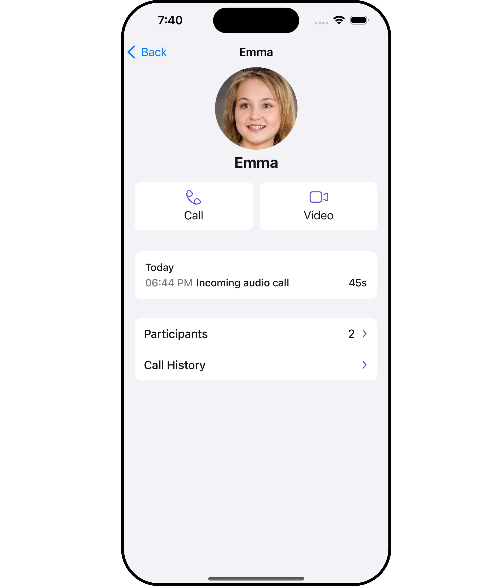
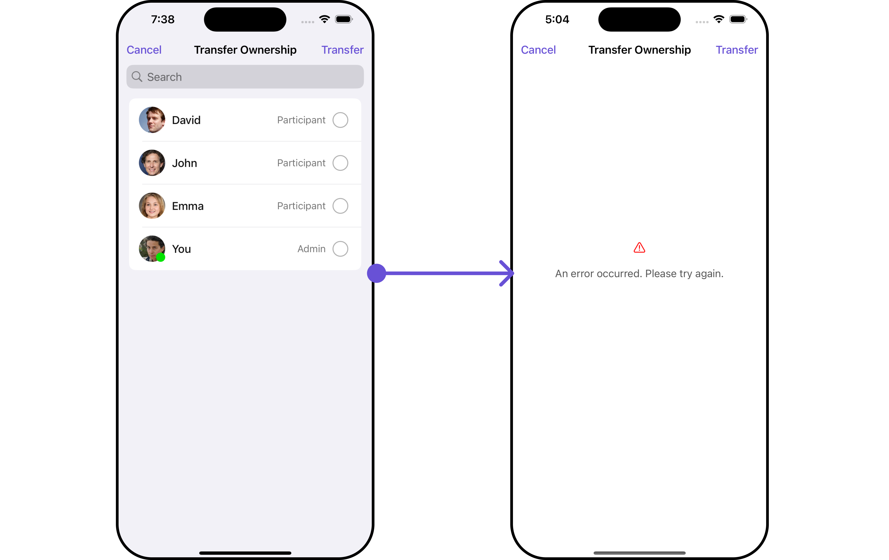
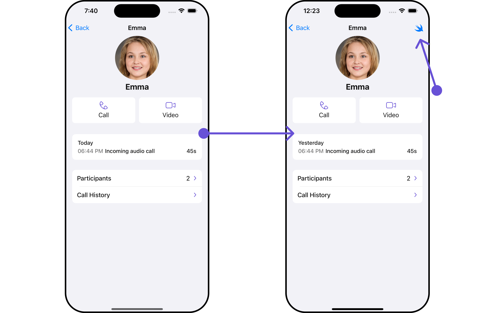

import Tabs from '@theme/Tabs';
import TabItem from '@theme/TabItem';

## Overview

The `Call Log Details` is a [Component](/ui-kit/ios/components-overview#components) that displays all the information related to a call. This component displays information like user/group information, participants of the call, recordings of the call (if available) & history of all the previous calls. Also, it has buttons to start a new call.



---

<!--  -->

---

## Usage

### Integration

`CometChatCallLogDetails` is a **ViewController**, it can be seamlessly presented within your application. To display the details of a CallLog, you simply need to pass the corresponding CallLog object to the CometChatCallLogDetails instance using its setCallLog property. This enables you to efficiently showcase specific call log details within your application's interface.

<Tabs>
<TabItem value="swift" label="Swift">

```swift
// To navigate to the CometChatCallLogs
//implementation for a callLog object
let callLogDetails = CometChatCallLogDetails()
.set(callLog: call)
self.navigationController?.pushViewController(callLogDetails, animated: true)
```

</TabItem>

</Tabs>

### Actions

[Actions](/ui-kit/ios/components-overview#actions) dictate how a component functions. They are divided into two types: Predefined and User-defined. You can override either type, allowing you to tailor the behavior of the component to fit your specific needs.

<!-- The `Call Log Details` component does not have any exposed Actions. -->

##### 1. OnCallHistoryClicked

The `onCallHistoryClicked` action is typically triggered when a user interacts with the call history section within the call log, executing a predefined action. However, by implementing the provided code snippet, you can effortlessly customize or override this default behavior to meet your specific requirements.

<Tabs>

<TabItem value="swift" label="Swift">
    ```swift
let callLogDetailsConfiguration = CallLogDetailsConfiguration()
    .set (onCallHistoryClicked:{ callLog in
    //Perform Your Action    
         
})
    ```
</TabItem>

</Tabs>

##### 2. OnCallRecordingsClicked

The `onCallRecordingsClicked` action is typically triggered when a user interacts with the recordings section within the call log, executing a predefined action. However, by implementing the provided code snippet, you can effortlessly customize or override this default behavior to meet your specific requirements.

<Tabs>

<TabItem value="swift" label="Swift">
    ```swift
let callLogDetailsConfiguration = CallLogDetailsConfiguration()
    .set (onCallRecordingsClicked:{ callLog in
    //Perform Your Action    
 
})
    ```
</TabItem>

</Tabs>

##### 3. OnCallParticipantsClicked

The `onCallParticipantsClicked` action is typically triggered when a user interacts with the participants section within the call log, executing a predefined action. However, by implementing the provided code snippet, you can effortlessly customize or override this default behavior to meet your specific requirements.

<Tabs>

<TabItem value="swift" label="Swift">
    ```swift
let callLogDetailsConfiguration = CallLogDetailsConfiguration()
    .set (onCallParticipantsClicked:{ callLog in
    //Perform Your Action

})

````
</TabItem>

</Tabs>

---

### Filters

**Filters** allow you to customize the data displayed in a list within a Component. You can filter the list based on your specific criteria, allowing for a more customized. Filters can be applied using RequestBuilders of Chat SDK.

The `Call Log Details` component does not have any exposed filters.

---

### Events

[Events](/ui-kit/ios/components-overview#events) are emitted by a `Component`. By using event you can extend existing functionality. Being global events, they can be applied in Multiple Locations and are capable of being Added or Removed.

The `Call Log Details` component does not have any exposed events.

---

## Customization

To fit your app's design requirements, you can customize the appearance of the conversation component. We provide exposed methods that allow you to modify the experience and behavior according to your specific needs.

### Style

Using Style you can customize the look and feel of the component in your app, These parameters typically control elements such as the color, size, shape, and fonts used within the component.

##### 1. CallLogDetails Style

You can customize the appearance of the `callLogDetails` Component by applying the `callLogDetailsStyle` to it using the following code snippet.


<Tabs>
<TabItem value="swift" label="Swift">

```swift
let callLogDetailsStyle = CallLogDetailsStyle()
.set(callStatusTextColor: .cyan)
.set(dateTextColor: .red)
.set(nameTextColor: .systemPurple)
.set(background: .magenta)
.set(arrowIconTint: .systemBlue)
.set(detailsSectionBackgroundColor: .lightGray.withAlphaComponent(0.8))
.set(timeTextColor: .systemBlue)
.set(borderColor: .green)
.set(borderWidth: 3)

let CallLogDetailsConfiguration = CallLogDetailsConfiguration()
.set(style: callLogDetailsStyle)

let callLogDetails = CometChatCallLogDetails()
.set(configuration: CallLogDetailsConfiguration)

````

</TabItem>

</Tabs>

| Property                      | Description                               | Code                                           |
| ----------------------------- | ----------------------------------------- | ---------------------------------------------- |
| background                    | Sets the background color                 | `.set(background: UIColor)`                    |
| borderWidth                   | Sets the border width                     | `.set(borderWidth: CGFloat)`                   |
| borderColor                   | Sets the border color                     | `.set(borderColor: UIColor)`                   |
| nameTextFont                  | Sets the name text font                   | `.set(nameTextFont: UIFont)`                   |
| nameTextColor                 | Sets the name text color                  | `.set(nameTextColor: UIColor)`                 |
| detailsSectionBackgroundColor | Sets the details section background color | `.set(detailsSectionBackgroundColor: UIColor)` |
| dateTextFont                  | Sets the font for date text               | `.set(dateTextFont: UIFont)`                   |
| dateTextColor                 | Sets the text color for date              | `.set(dateTextColor: UIColor)`                 |
| timeTextColor                 | Sets the color for the time text          | `.set(timeTextColor: UIColor)`                 |
| timeTextFont                  | Sets the font for the time text           | `.set(timeTextFont: UIFont)`                   |
| durationTextFont              | Sets the font for the duration text       | `.set(durationTextFont: UIFont)`               |
| durationTextColor             | Sets the color for the duration text      | `.set(durationTextColor: UIColor)`             |
| callStatusTextFont            | Sets the font for the call status text    | `.set(callStatusTextFont: UIFont)`             |
| callStatusTextColor           | Sets the color for the call status text   | `.set(callStatusTextColor: UIColor)`           |
| arrowIconTint                 | Sets the tint color for the arrow icon    | `.set(arrowIconTint: UIColor)`                 |
| corner radius                 | Sets the corner radius                    | `.set(cornerRadius: CometChatCornerStyle)`     |

##### 2. Avatar Styles

To apply customized styles to the `Avatar` component in the `callLogDetails` Component, you can use the following code snippet. For further insights on `Avatar` Styles [refer](/ui-kit/ios/avatar#avatarstyle)

<Tabs>
<TabItem value="swift" label="Swift">

```swift title='Swift'

let avatarStyle = AvatarStyle()
.set(background: .red)
.set(textFont: .systemFont(ofSize: 18))
.set(textColor: .systemTeal)
.set(cornerRadius: CometChatCornerStyle(cornerRadius: 8.0))
.set(borderColor: .systemBlue)
.set(borderWidth: 5)
.set(outerViewWidth: 3)
.set(outerViewSpacing: 3)

let CallLogDetailsConfiguration = CallLogDetailsConfiguration()
.set(avatarStyle: avatarStyle)

let callLogDetails = CometChatCallLogDetails()
.set(configuration: CallLogDetailsConfiguration)

```

</TabItem>

</Tabs>

##### 3. Button Styles

You can customize the appearance of the `CallLogDetails` Component by applying the ButtonStyle to it using the following code snippet.

<Tabs>
<TabItem value="swift" label="Swift">

```swift title='Swift'
let buttonStyle = ButtonStyle()
.set(background: .red)
.set(textFont: .systemFont(ofSize: 18))
.set(textColor: .systemTeal)
.set(cornerRadius: CometChatCornerStyle(cornerRadius: 8.0))
.set(borderColor: .systemBlue)
.set(borderWidth: 5)
.set(iconBackground: .systemTeal)
.set(iconBorder: 6)
.set(iconCornerRadius: 10)
.set(iconTint: .blue)

let CallLogDetailsConfiguration = CallLogDetailsConfiguration()
.set(callButtonStyle: buttonStyle)

let callLogDetails = CometChatCallLogDetails()
.set(configuration: CallLogDetailsConfiguration)

```

</TabItem>

</Tabs>

:::info
Ensure to pass and present `CometChatCallLogDetails`. If a navigation controller is already in use, utilize the pushViewController function instead of directly presenting the view controller.
:::

---

### Functionality

These are a set of small functional customizations that allow you to fine-tune the overall experience of the component. With these, you can change text, set custom icons, and toggle the visibility of UI elements.

<Tabs>

<TabItem value="swift" label="Swift">

```swift
let callLogDetails = CometChatCallLogDetails()
.set(title: "Cc", mode: .automatic)
.hide(separator: true)
.set(backButtonIcon: UIImage(systemName: "cricket.ball.fill")!)

self.navigationController?.pushViewController(callLogDetails, animated: true)

```

</TabItem>

</Tabs>

Below is a list of customizations along with corresponding code snippets

| Property               | Description                        | Code                                                                |
| ---------------------- | ---------------------------------- | ------------------------------------------------------------------- |
| titleFont              | Sets the font for the title        | `.set(titleFont: UIFont)`                                           |
| titleColor             | Sets the color for the title       | `.set(titleColor: UIColor)`                                         |
| title                  | Sets the title for the title bar   | `.set(title: String, mode: UINavigationItem.LargeTitleDisplayMode)` |
| largeTitleFont         | Sets the large title font          | `.set(largeTitleFont: UIFont)`                                      |
| backButtonTitle        | Sets the back button title         | `.set(backButtonTitle: String?)`                                    |
| largeTitleColor        | Sets the large title color         | `.set(largeTitleColor: UIColor)`                                    |
| backButtonTitleColor   | Sets the back button title color   | `.set(backButtonTitleColor: UIColor)`                               |
| hide(search)           | Hides the search bar               | `.hide(search: Bool)`                                               |
| hide(separator)        | Hides the separator                | `.hide(separator: Bool)`                                            |
| hide(errorText)        | Hides the error text               | `.hide(errorText: Bool)`                                            |
| callLog                | Sets the call log                  | `.set(callLog: Any?)`                                               |
| backButtonFont         | Sets the back button font          | `.set(backButtonFont: UIFont?)`                                     |
| backButtonIcon         | Sets the back button icon          | `.set(backButtonIcon: UIImage)`                                     |
| backButtonTint         | Sets the back button tint          | `.set(backButtonTint: UIColor)`                                     |
| background             | Sets the background                | `.set(background: [CGColor]?)`                                      |
| borderColor            | Sets the border color              | `.set(borderColor: UIColor)`                                        |
| borderWidth            | Sets the border width              | `.set(borderWidth: CGFloat)`                                        |
| corner                 | Sets the corner style              | `.set(corner: CometChatCornerStyle)`                                |
| emptyStateText         | Sets the empty state text          | `.set(emptyStateText: String)`                                      |
| emptyStateTextColor    | Sets the empty state text color    | `.set(emptyStateTextColor: UIColor)`                                |
| emptyStateTextFont     | Sets the empty state text font     | `.set(emptyStateTextFont: UIFont)`                                  |
| errorStateText         | Sets the error state text          | `.set(errorStateText: String)`                                      |
| errorStateTextColor    | Sets the error state text color    | `.set(errorStateTextColor: UIColor)`                                |
| errorStateTextFont     | Sets the error state text font     | `.set(errorStateTextFont: UIFont)`                                  |
| searchBackground       | Sets the search background         | `.set(searchBackground: UIColor)`                                   |
| searchIcon             | Sets the search icon               | `.set(searchIcon: UIImage?)`                                        |
| searchPlaceholder      | Sets the search placeholder        | `.set(searchPlaceholder: String)`                                   |
| searchIconTint         | Sets the search icon tint          | `.set(searchIconTint: UIColor)`                                     |
| searchTextFont         | Sets the search text font          | `.set(searchTextFont: UIFont)`                                      |
| searchBarHeight        | Sets the search bar height         | `.set(searchBarHeight: CGFloat)`                                    |
| searchClearIcon        | Sets the search clear icon         | `.set(searchClearIcon: UIImage)`                                    |
| searchTextColor        | Sets the search text color         | `.set(searchTextColor: UIColor)`                                    |
| searchBorderColor      | Sets the search border color       | `.set(searchBorderColor: UIColor)`                                  |
| searchBorderWidth      | Sets the search border width       | `.set(searchBorderWidth: CGFloat)`                                  |
| searchCornerRadius     | Sets the search corner radius      | `.set(searchCornerRadius: CometChatCornerStyle)`                    |
| searchClearIconTint    | Sets the search clear icon tint    | `.set(searchClearIconTint: UIColor)`                                |
| searchPlaceholderColor | Sets the search placeholder color  | `.set(searchPlaceholderColor: UIColor)`                             |
| searchCancelButtonFont | Sets the search cancel button font | `.set(searchCancelButtonFont: UIFont)`                              |
| searchCancelButtonTint | Sets the search cancel button tint | `.set(searchCancelButtonTint: UIColor)`                             |

---

### Advanced

For advanced-level customization, you can set custom views to the component. This lets you tailor each aspect of the component to fit your exact needs and application aesthetics. You can create and define your views, layouts, and UI elements and then incorporate those into the component.

#### EmptyView <a data-tooltip-id="my-tooltip-html-prop"> <span class="material-icons red">report</span> </a>

You can set a custom EmptyView using `.set(emptyView: UIView)` to match the empty view of your app.

<Tabs>

<TabItem value="swift" label="swift">
```swift
let callLogDetails = CometChatCallLogDetails()
.set(emptyView: UIView)       //you can pass your own view

````

</TabItem>

</Tabs>


**Example**
<!--  -->


In this example, we will create a `Custom_Empty_State_GroupView`a UIView file.

```swift
import UIKit

class CustomEmptyStateGroupView: UIView {
    // Initialize your subviews
    let imageView: UIImageView = {
        let imageView = UIImageView(image: UIImage(named: "noDataImage"))
        imageView.translatesAutoresizingMaskIntoConstraints = false
        return imageView
    }()

    let messageLabel: UILabel = {
        let label = UILabel()
        label.text = "No groups available"
        label.translatesAutoresizingMaskIntoConstraints = false
        label.font = UIFont.boldSystemFont(ofSize: 16)
        label.textColor = .black
        return label
    }()

    // Override the initializer
    override init(frame: CGRect) {
        super.init(frame: frame)
        // Add subviews and layout constraints
        addSubview(imageView)
        addSubview(messageLabel)
        NSLayoutConstraint.activate([
            imageView.centerXAnchor.constraint(equalTo: centerXAnchor),
            imageView.centerYAnchor.constraint(equalTo: centerYAnchor),
            imageView.heightAnchor.constraint(equalToConstant: 120),
            imageView.widthAnchor.constraint(equalToConstant: 120),

            messageLabel.topAnchor.constraint(equalTo: imageView.bottomAnchor, constant: 8),
            messageLabel.centerXAnchor.constraint(equalTo: centerXAnchor)
        ])
    }

    required init?(coder: NSCoder) {
        fatalError("init(coder:) has not been implemented")
    }
}
```
We will be passing a custom empty view to CometChatCallLogDetails, ensuring a tailored and user-friendly interface.

<Tabs>

<TabItem value="swift" label="Swift">
```swift
let customEmptyStateGroupView = CustomEmptyStateGroupView()

let callLogDetails = CometChatCallLogDetails()
.set(emptyView: customEmptyStateGroupView)

self.navigationController?.pushViewController(callLogDetails, animated: true)
````

</TabItem>

</Tabs>

:::info
Ensure to pass and present `CometChatCallLogDetails`. If a navigation controller is already in use, utilize the pushViewController function instead of directly presenting the view controller.
:::

---

#### ErrorView <a data-tooltip-id="my-tooltip-html-prop"> <span class="material-icons red">report</span> </a>

You can set a custom ErrorView using `.set(errorView: UIView)` to match the error view of your app.

<Tabs>

<TabItem value="swift" label="Swift">

```swift
let callLogDetails = CometChatCallLogDetails()
.set(errorView: UIView)    //you can pass your own view

```

</TabItem>

</Tabs>

**Example**

<!--  -->
<!--  -->

In this example, we will create a UIView file `Custom_ErrorState_GroupView` and pass it inside the `.set(errorView: UIView)` method.

```swift title="Custom_ErrorState_GroupView"
import UIKit

let CustomErrorStateGroupView: UIView = {
        // Create main view
        let view = UIView()
        view.backgroundColor = .white

        // Create an imageView and add it to the main view
        let imageView = UIImageView(image: UIImage(systemName: "exclamationmark.triangle"))
        imageView.tintColor = .red
        imageView.translatesAutoresizingMaskIntoConstraints = false
        view.addSubview(imageView)

        // Create a label with error message and add it to the main view
        let label = UILabel()
        label.text = "An error occurred. Please try again."
        label.font = UIFont.systemFont(ofSize: 16)
        label.textColor = .darkGray
        label.numberOfLines = 0
        label.textAlignment = .center
        label.translatesAutoresizingMaskIntoConstraints = false
        view.addSubview(label)

        // Create constraints for imageView and label
        NSLayoutConstraint.activate([
            imageView.centerXAnchor.constraint(equalTo: view.centerXAnchor),
            imageView.centerYAnchor.constraint(equalTo: view.centerYAnchor, constant: -50),

            label.topAnchor.constraint(equalTo: imageView.bottomAnchor, constant: 20),
            label.leadingAnchor.constraint(equalTo: view.leadingAnchor, constant: 20),
            label.trailingAnchor.constraint(equalTo: view.trailingAnchor, constant: -20)
        ])

        return view
    }()
```

<Tabs>

<TabItem value="swift" label="Swift">

```swift
let customErrorStateGroupView = CustomErrorStateGroupView

let callLogDetails = CometChatCallLogDetails()
.set(errorView: customErrorStateGroupView)

self.navigationController?.pushViewController(callLogDetails, animated: true)
```

</TabItem>

</Tabs>

:::info
Ensure to pass and present `CometChatCallLogDetails`. If a navigation controller is already in use, utilize the pushViewController function instead of directly presenting the view controller.
:::

---

#### Menus

You can set the Custom Menus to add more options to the CometChatCallLogDetails component.

<Tabs>

<TabItem value="swift" label="Swift">

```swift
let callLogDetails = CometChatCallLogDetails()
.set(menus: [UIBarButtonItem])

```

</TabItem>

</Tabs>

- You can customize the menus for CometChatCallLogDetails to meet your requirements

**Example**


<!--  -->
<!--  -->

In this example, we'll craft a custom button tailored for `callLogDetails`, enhancing its interface with a personalized `menu` for a more user-friendly experience.

<Tabs>

<TabItem value="swift" label="Swift">
```swift
let customMenuButton: UIBarButtonItem = {
    let button = UIButton(type: .system)
    button.setImage(UIImage(systemName: "swift"), for: .normal)
    button.setTitle("", for: .normal)
    button.addTarget(self, action: #selector(handleCustomMenu), for: .touchUpInside)
    let barButtonItem = UIBarButtonItem(customView: button)
    return barButtonItem
}()

let callLogDetails = CometChatCallLogDetails()
.set(menus: [customMenuButton])

````
</TabItem>


</Tabs>

:::info
Ensure to pass and present `CometChatCallLogDetails`. If a navigation controller is already in use, utilize the pushViewController function instead of directly presenting the view controller.
:::


---


#### Options

Enhance your CallLogDetails component by setting Custom Options to incorporate additional functionalities when swiping

<Tabs>

<TabItem value="swift" label="Swift">

```swift
let group = Group(guid: "your-uid", name: "", groupType: .public, password: .none)

let cometChatTransferOwnership = CometChatTransferOwnership(group: group)
    .setOptions { group, groupMember in
    //Perform Your Action

}
```

</TabItem>

</Tabs>

- You can customize the options for CallLogDetails to meet your requirements

**Example**

<!--  -->


In this example, we've customized the interface of `CometChatCallLogDetails` by incorporating a unique feature. By implementing a custom option, labeled "Custom Option," users can access additional functionalities tailored to their needs. Additionally, a custom template, named "Custom Template," enhances the visual presentation of call log details.

This customization allows for a more engaging and user-friendly experience within the application.

<Tabs>

<TabItem value="swift" label="Swift">
```swift

// Define custom option
let customOption = CometChatCallDetailsOption(
    id: "CustomOption",
    title: "Custom Option",
    customView: nil,
    titleColor: .blue,
    titleFont: .systemFont(ofSize: 14),
    height: 50,
    tailView: nil
) { callLog, index, option, controller in
   print("Custom option tapped")
  }

// Define custom template
let customTemplate = CometChatCallDetailsTemplate(
    id: "CustomTemplate",
    title: "Custom Template",
    height: 20,
    titleFont: .boldSystemFont(ofSize: 16),
    titleColor: .black,
    itemSeparatorColor: .lightGray
) { callLog, controller in
   let customTemplateView = UIView()
   customTemplateView.backgroundColor = .yellow
   return customTemplateView
  } options: { callLog in
              return [customOption]
             }

// Integrate custom option and template into the call log details
let callLogDetails = CometChatCallLogDetails()
callLogDetails.add(option: customOption, templateID: "CustomTemplate")

````

</TabItem>

</Tabs>

:::info
Ensure to pass and present `CometChatCallLogDetails`. If a navigation controller is already in use, utilize the pushViewController function instead of directly presenting the view controller.
:::

import { Tooltip } from 'react-tooltip'
import 'react-tooltip/dist/react-tooltip.css'

<Tooltip
  id="my-tooltip-html-prop"
  html="Not available "
/>

---
